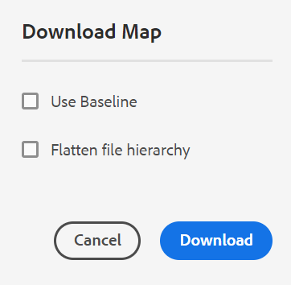

# Dateien herunterladen {#id216MC0H0BE8}

Sie können Assets, einschließlich DITA- und Nicht-DITA-Dateien, herunterladen. Es gibt mehrere Möglichkeiten, Assets herunterzuladen. Einige Methoden sind nativ in AEM und andere werden von AEM Guides unterstützt. Informationen zum Herunterladen nativer AEM-Assets finden Sie unter [Herunterladen von Assets von Adobe Experience Manager](https://experienceleague.adobe.com/docs/experience-manager-cloud-service/assets/manage/download-assets-from-aem.html) in der AEM-Dokumentation. Im folgenden Abschnitt wird der Mechanismus zum Herunterladen von Dateien über die DITA-Zuordnungskonsole in AEM Guides erläutert.

## Exportieren einer DITA-Zuordnungsdatei

Sobald Sie die DITA-Zuordnungsdatei im AEM-Repository haben, können Sie die Zuordnungsdatei zusammen mit den zugehörigen Komponenten herunterladen. Dadurch haben Sie die Möglichkeit, die gesamte Zuordnungsdatei für die Offline-Bearbeitung, Validierung, Überprüfung oder einfache Erstellung eines Backups freizugeben.

Führen Sie die folgenden Schritte aus, um eine DITA-Zuordnungsdatei zusammen mit den abhängigen Dateien herunterzuladen:

1. Navigieren Sie in der Assets-Benutzeroberfläche zu der DITA-Karte, die Sie herunterladen möchten.

1. Klicken Sie auf die DITA-Map, um sie in der DITA-Map-Konsole zu öffnen.

1. Wählen Sie die **Themen** aus, um eine Liste der in der DITA-Karte verfügbaren Themen anzuzeigen.

1. Klicken Sie in der Hauptsymbolleiste auf **Karte herunterladen**.

   Das Dialogfeld Zuordnung herunterladen wird angezeigt.

   {width="300" align="left"}

1. Klicken Sie auf **Herunterladen**. Im Dialogfeld Karte herunterladen können Sie die folgenden Optionen auswählen:

   - **Baseline verwenden**: Wählen Sie diese Option, um eine Liste der Baselines zu erhalten, die für die DITA-Zuordnung erstellt wurden. Wenn Sie die Zuordnungsdatei und deren Inhalte basierend auf einer bestimmten Baseline herunterladen möchten, wählen Sie die Baseline aus der Dropdown-Liste aus. Weitere Informationen zum Arbeiten mit Grundlinien finden Sie unter [Arbeiten mit Grundlinien](generate-output-use-baseline-for-publishing.md#).
   - **Dateihierarchie reduzieren**: Wählen Sie diese Option, um alle referenzierten Themen und Mediendateien in einem Ordner zu speichern.
   >[!NOTE]
   >
   > Sie können die Zuordnungsdatei auch herunterladen, ohne eine Option auszuwählen. In diesem Fall wird die letzte persistierte Version der referenzierten Themen und Mediendateien heruntergeladen.

1. Nachdem Sie auf die Schaltfläche **Herunterladen** geklickt haben, wird die Anfrage zum Herunterladen der Zuordnung in die Warteschlange gestellt. Sobald die Karte zum Herunterladen bereit ist, erhalten Sie die folgende Benachrichtigung.

   {width="550" align="left"}

   - Klicken Sie **Herunterladen**, um die Zuordnungsdatei im ZIP-Format herunterzuladen.

   - Klicken Sie **Später herunterladen**, um die Zuordnungsdatei zu einem späteren Zeitpunkt herunterzuladen. Der Downloadlink kann über den AEM-Benachrichtigungs-Posteingang aufgerufen werden. Klicken Sie auf die generierte Zuordnungsbenachrichtigung im Posteingang, um die Zuordnung im ZIP-Format herunterzuladen.

   >[!NOTE]
   >
   > Standardmäßig bleiben die heruntergeladenen Zuordnungen fünf Tage lang im AEM-Benachrichtigungs-Posteingang.

{width="300" align="left"}

Nachdem die Karte heruntergeladen wurde, können Sie die Karte auswählen und das Symbol Öffnen oben verwenden, um den ausgewählten Bericht zu öffnen.

**Übergeordnetes Thema:**[ Inhalte verwalten](authoring.md)
