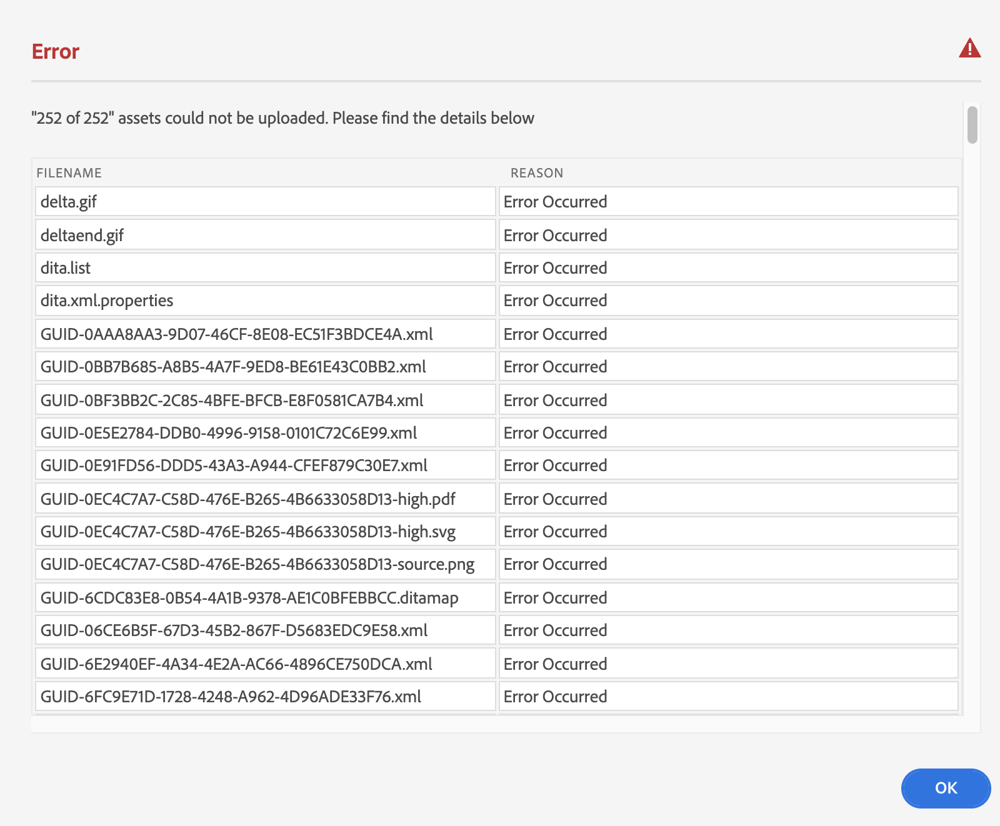

# Hochladen von Dateien {#id176FF000JUI}

Wahrscheinlich hätten Sie ein Repository mit vorhandenen DITA-Inhalten, die Sie mit AEM Guides verwenden möchten. Für solche vorhandenen Inhalte können Sie einen der folgenden Ansätze verwenden, um Ihren Inhalt stapelweise in das AEM-Repository hochzuladen:

>[!IMPORTANT]
>
> Siehe [Hinzufügen digitaler Assets zu Adobe Experience Manager as a Cloud Service Assets](https://experienceleague.adobe.com/docs/experience-manager-cloud-service/assets/manage/add-assets.html) für detaillierte Informationen zu den unterstützten Methoden zum Hochladen von Inhalten in AEM.

## Benutzeroberfläche der Assets-Konsole

Sie können Inhalte auf Ihrem Desktop auswählen und über die AEM-Benutzeroberfläche \(Webbrowser\) in den Zielordner ziehen. Weitere Informationen finden Sie unter [Hochladen von Assets](https://experienceleague.adobe.com/docs/experience-manager-cloud-service/assets/manage/add-assets.html#upload-assets) in der AEM-Dokumentation.

## AEM-Desktop-Programm

Verwenden Sie das AEM-Desktop-Programm, wenn Sie ein Kreativprofi sind und die Assets auf Ihrem lokalen Desktop verwalten möchten. Sie können diese Assets mit Ihren Desktop-Programmen öffnen und bearbeiten. Sie können auch Versionen verwalten und Ihre Dateien für andere Benutzer freigeben. Weitere Informationen finden Sie unter [AEM Desktop App](https://experienceleague.adobe.com/docs/experience-manager-desktop-app/using/using.html?lang=de).

## Asset-Massenaufnahme

Bei umfangreichen Migrationen und gelegentlichen Massenaufnahmen von Assets können Sie Ihre Inhalte mit dem Asset-Bulk-Ingest hochladen. Mit diesem Tool können Sie Masseninhalte aus unterstützten Datenspeichern wie Azure oder S3 hochladen. Weitere Informationen finden Sie unter [Asset-Massenaufnahme](https://experienceleague.adobe.com/docs/experience-manager-cloud-service/assets/manage/add-assets.html?lang=en#asset-bulk-ingestor).

## Verwenden von FrameMaker für den Massen-Upload

Adobe FrameMaker verfügt über einen leistungsstarken AEM-Connector, mit dem Sie vorhandene DITA- und andere FrameMaker-Dokumente \(`.book` und `.fm`\) einfach in AEM hochladen können. Sie können verschiedene Datei-Upload-Funktionen verwenden, z. B. das Hochladen einer einzelnen Datei, das Hochladen eines vollständigen Ordners mit oder ohne Abhängigkeiten \(z. B. Inhaltsreferenzen, Querverweise und Grafiken\).

Weitere Informationen zur Verwendung der Funktion für den Massen-Upload in FrameMaker finden Sie im Abschnitt *Erstellen eines CRX-Ordners und Hochladen von*) im FrameMaker-Benutzerhandbuch.

## Fehlerbehandlung beim Hochladen von Inhalten {#id201MI0I04Y4}

Wenn es zu einem Fehler beim Hochladen einer oder mehrerer Dateien kommt, wird am Ende des Upload-Prozesses eine Eingabeaufforderung mit einer Liste der Dateien angezeigt, die nicht hochgeladen werden konnten:

{width="650" align="center"}

Weitere Informationen zu den verschiedenen Szenarien für den Datei-Upload finden Sie unter [DITA-Inhalt hochladen](authoring-file-management.md#).

Wenn Sie ein Tool wie das AEM-Desktop-Programm oder das Asset-Bulk-Ingest verwenden, wird die Aktion, die für eine doppelte Datei ausgeführt werden soll, durch eine Einstellung im AEM-Server gesteuert. Wenden Sie sich an Ihren Systemadministrator, um mehr über diese Konfiguration zu erfahren.

**Übergeordnetes Thema:**&#x200B;[ Inhalte verwalten](authoring.md)
