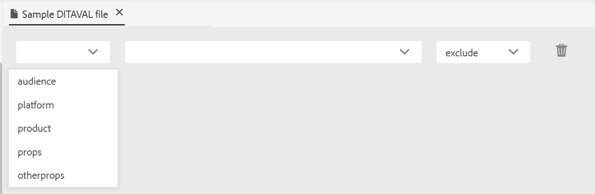

# DITAVAL-Editor {#ditaval-editor}

DITAVAL-Dateien werden zur Erzeugung von bedingten Ausgaben verwendet. In einem einzelnen Thema können Sie Bedingungen mithilfe von Elementattributen hinzufügen, um Inhalte mit Bedingungen zu versehen. Anschließend erstellen Sie eine DITAVAL-Datei, in der Sie die Bedingungen angeben, die aufgenommen werden sollen, um Inhalte zu generieren, und welche Bedingung bei der endgültigen Ausgabe ausgeschlossen werden soll.

Mit AEM Guides können Sie DITAVAL-Dateien mit dem DITAVAL-Editor ganz einfach erstellen und bearbeiten. Der DITAVAL-Editor ruft die in Ihrem System definierten Attribute \(oder tags\) ab, mit denen Sie DITAVAL-Dateien erstellen oder bearbeiten können. Weitere Informationen zum Erstellen und Verwalten von Tags in AEM finden Sie [ Abschnitt „Verwalten von ](https://experienceleague.adobe.com/docs/experience-manager-cloud-service/sites/authoring/features/tags.html?lang=en)&quot; in der Dokumentation zu AEM.

## DITAVAL-Datei erstellen

Führen Sie die folgenden Schritte aus, um eine DITAVAL-Datei zu erstellen:

1. Navigieren Sie in der Assets-Benutzeroberfläche zu dem Speicherort, an dem Sie die DITAVAL-Datei erstellen möchten.

1. Klicken Sie **Erstellen** \> **DITA-Thema**.

1. Wählen Sie auf der Blueprint-Seite DITAVAL-Dateivorlage aus und klicken Sie auf **Weiter**.

1. Geben Sie auf der Seite Eigenschaften die **Titel** und **Name** für die DITAVAL-Datei an.

   >[!NOTE]
   >
   > Der Name wird automatisch basierend auf dem Titel der Datei vorgeschlagen. Wenn Sie den Dateinamen manuell angeben möchten, stellen Sie sicher, dass der Name keine Leerzeichen, Apostrophe oder geschweifte Klammern enthält und mit &quot;.ditaval“ endet.

1. Klicken Sie auf **Erstellen**. Die Meldung Thema erstellt wird angezeigt.

   Sie können die DITAVAL-Datei zur Bearbeitung im DITAVAL-Editor öffnen oder die Themendatei im AEM-Repository speichern.

## DITAVAL-Datei bearbeiten

Führen Sie folgende Schritte aus, um eine DITAVAL-Datei zu bearbeiten:

1. Navigieren Sie in der Assets-Benutzeroberfläche zur DITAVAL-Datei, die Sie bearbeiten möchten.

1. Um eine exklusive Sperre für die Datei zu erhalten, wählen Sie die Datei aus und klicken Sie auf **Auschecken**.

1. Wählen Sie die Datei aus und klicken Sie auf **Bearbeiten**, um die Datei im AEM Guides DITAVAL-Editor zu öffnen.

   Mit dem DITAVAL-Editor können Sie die folgenden Aufgaben ausführen:

   A: Linkes Bedienfeld ein/aus
Linke Bereichsansicht umschalten. Wenn Sie die DITAVAL-Datei über DITA Map geöffnet haben, werden die Karte und das Repository in diesem Bedienfeld angezeigt. Weitere Informationen zum Öffnen einer Datei über DITA Map finden Sie unter [Themen über DITA Map bearbeiten](map-editor-advanced-map-editor.md#id17ACJ0F0FHS).

   B: Speichern
Speichert die in der Datei vorgenommenen Änderungen. Alle Ihre Änderungen werden in der aktuellen Version Ihrer Datei gespeichert.

   C: Eigenschaft hinzufügen
Fügen Sie in Ihrer DITAVAL-Datei eine einzelne Eigenschaft hinzu.

   

   In der ersten Dropdown-Liste werden die zulässigen DITA-Attribute aufgelistet, die Sie in der DITAVAL-Datei verwenden können. Es werden fünf Attribute unterstützt: `audience`, `platform`, `product`, `props` und `otherprops`.

   Die zweite Dropdown-Liste zeigt die für das ausgewählte Attribut konfigurierten Werte an. Anschließend werden in der nächsten Dropdown-Liste die Aktionen angezeigt, die Sie für das ausgewählte Attribut konfigurieren können. Die zulässigen Werte in der Dropdown-Liste Aktion sind `include`, `exclude`, `passthrough` und `flag`. Weitere Informationen zu diesen Werten finden Sie unter Definition des Elements [prop](http://docs.oasis-open.org/dita/dita/v1.3/errata01/os/complete/part3-all-inclusive/langRef/ditaval/ditaval-prop.html#ditaval-prop) in der OASIS DITA-Dokumentation

   D: Alle Eigenschaften hinzufügen
Wenn Sie mit einem Klick alle in Ihrem System definierten bedingten Eigenschaften oder Attribute hinzufügen möchten, verwenden Sie die Funktion Alle Eigenschaften hinzufügen .

   >[!NOTE]
   >
   > Wenn alle definierten bedingten Eigenschaften bereits in der DITAVAL-Datei vorhanden sind, können Sie keine weiteren Eigenschaften hinzufügen. In diesem Szenario wird eine Fehlermeldung angezeigt.

   

1. Nachdem Sie Ihre DITAVAL-Datei bearbeitet haben, klicken Sie auf **Speichern**.

   >[!NOTE]
   >
   > Wenn Sie die Datei schließen, ohne zu speichern, gehen die Änderungen verloren. Wenn Sie die Änderungen nicht in das AEM-Repository übernehmen möchten, klicken Sie auf **Schließen** und anschließend **Ohne Speichern schließen** im Dialogfeld **Nicht gespeicherte Änderungen**.

## DITAVAL editor views

AEM Guides&#39; DITAVAL editor supports viewing DITAVAL files in two different modes or views:

**Author**:   This is a typical What You See is What You Get \(WYSISYG\) view of the DITAVAL editor. You can add or remove properties using the simple user interface, which presents the properties, its values, and actions in drop-down list. In the Author view, you have the options to insert an individual property and insert all properties with a single click.

You can also find the version of the DITAVAL file that you are currently working on by hovering your pointer over the filename.

**Source**:   The Source view displays the underlying XML that makes up the DITAVAL file. In addition to making regular text edits in this view, an author can also add or edit properties using the Smart Catalog.

To invoke the Smart Catalog, place the cursor at the end of any property definition and enter &quot;&lt;&quot;. The editor will show a list of all valid XML elements that you can insert at that location.

