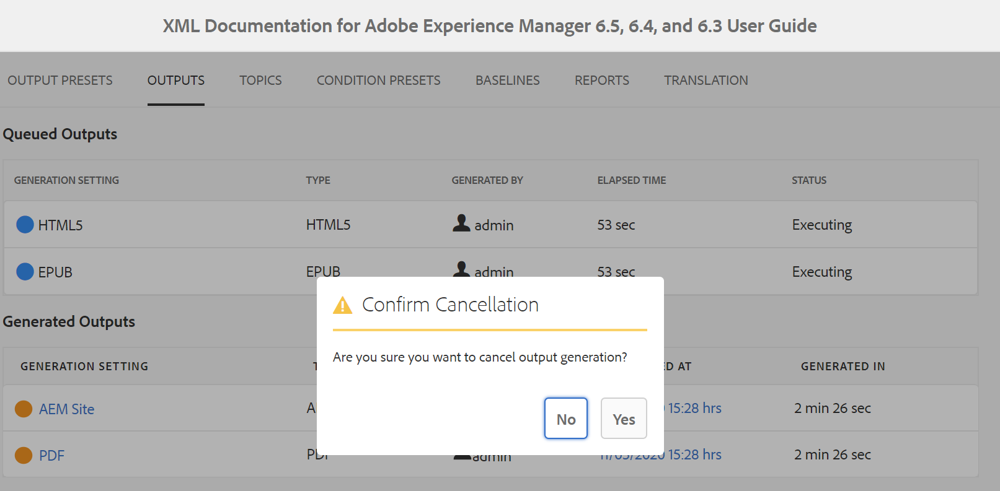

# Generieren einer Ausgabe für eine DITA-Zuordnung über die Zuordnungskonsole {#id1825FG00UHT}

Führen Sie die folgenden Schritte aus, um eine Ausgabe für eine DITA-Zuordnung zu generieren:

1. Navigieren Sie in der Assets-Benutzeroberfläche zu der DITA-Zuordnungsdatei, die Sie veröffentlichen möchten, und klicken Sie darauf.

   Die DITA-Zuordnungskonsole wird mit der Liste der verfügbaren Ausgabevorgaben angezeigt, um eine Ausgabe zu generieren.

1. Wählen Sie eine oder mehrere Ausgabevorgaben aus, die Sie zum Generieren der Ausgabe verwenden möchten.

   {width="800" align="left"}

   >[!NOTE]
   >
   > Wenn Sie die AEM-Site-Ausgabe generieren, verwendet der Veröffentlichungsprozess die in der `.ditamap` definierte Struktur, um die AEM-Site-Struktur zu erstellen.

1. Klicken Sie auf das Symbol Erzeugen , um den Ausgabegenerierungsprozess zu starten.

Sie können den aktuellen Status der Ausgabegenerierungsanfrage anzeigen, indem Sie auf „Ausgaben“ klicken. Weitere Informationen finden Sie unter [Anzeigen des Status der Aufgabe zur Ausgabenerstellung](#viewing_output_history)

>[!IMPORTANT]
>
> Wenn sich ein Ausgabegenerierungsprozess für eine Voreinstellung entweder in der Warteschlange befindet oder in Bearbeitung ist, können Sie für dieselbe Voreinstellung keine andere Ausgabegenerierungsaufgabe starten.

Sie können die PDF-Ausgabe für eine oder mehrere Ausgabevorgaben generieren, die für eine DITA-Zuordnung im Web-Editor erstellt wurden. Weitere Informationen finden Sie unter [Verwenden des Bedienfelds „Schnellgenerierung“, um eine Ausgabe für die Vorgaben zu generieren und anzuzeigen](web-editor-quick-generate-panel.md#).

Sie können auch die AEM-Site-Ausgabe für ein oder mehrere Themen oder die gesamte DITA-Zuordnung aus dem Web-Editor generieren. Weitere Informationen finden Sie unter [Artikelbasierte Veröffentlichung im Web-Editor](web-editor-article-publishing.md#id218CK0U019I).

## Inkrementelle Ausgabegenerierung {#generating_standalone_topic}

>[!NOTE]
>
> Die inkrementelle Ausgabegenerierung ist nur für die AEM Site-Ausgabe geeignet. Außerdem können Sie nur DITA \(.dita/.xml\)-Themen aus einer DITA-Zuordnung oder aus Unterzuordnungen neu generieren. Wenn Sie eine DITA-Zuordnung, eine Unterzuordnung, eine Themengruppe oder ein Thema mit `@processing-role="resource-only"` auswählen, ist die Option zum erneuten Generieren nicht verfügbar.

Es kann eine Reihe von Fällen geben, in denen Sie nur einige Themen in Ihrer DITA-Karte aktualisieren und nur diese aktualisierten Themen live übertragen. Um solche Szenarien zu handhaben, können Sie mit AEM Guides inkrementelle Ausgaben erstellen. Wenn Sie einige Themen aktualisiert haben, müssen Sie nicht die gesamte DITA-Karte neu generieren. Sie können nur die aktualisierten Themen auswählen und neu generieren.

Wenn Ihre Zuordnung aufgeteilt ist und Sie ein einzelnes Thema in dieser Zuordnung aktualisiert haben, müssen Sie die gesamte Zuordnung neu generieren, damit das aktualisierte Thema oder der aktualisierte Inhalt in der Ausgabe widergespiegelt wird. Die Option zur Ausgaberegenerierung wird nicht auf Themenebene angezeigt, sondern nur auf der \(aufgeteilt\) Zuordnungsebene. Dies gilt für die übergeordnete Zuordnung und alle Unterzuordnungen.

Führen Sie die folgenden Schritte aus, um die Ausgabe für ein bestimmtes Thema oder eine Gruppe von Themen neu zu generieren:

>[!IMPORTANT]
>
> Wenn Sie die Ausgabe der AEM-Site neu generieren, wird die Ausgabe anhand der aktuellen Dateiversion und nicht anhand der angehängten Baseline erstellt.

1. Navigieren Sie in der Assets-Benutzeroberfläche zu und klicken Sie auf die DITA-Zuordnungsdatei.

   Die DITA-Zuordnungskonsole wird mit der Liste der verfügbaren Ausgabevorgaben angezeigt, um eine Ausgabe zu generieren.

1. Wählen Sie die **Themen** aus.

   Eine Liste der in der DITA-Karte verfügbaren Themen wird angezeigt.

1. Wählen Sie die Themen aus, die Sie neu generieren möchten.

   >[!NOTE]
   >
   > Wenn Sie neue Themen zur DITA-Karte hinzugefügt haben, können Sie diese neuen Themen von hier aus nicht erstellen. Sie müssen die neu hinzugefügten Themen zuerst veröffentlichen, indem Sie die Veröffentlichungsfunktion DITA-Zuordnung verwenden.

   {width="800" align="left"}

1. Klicken Sie **Regenerieren**.

   Die Seite Ausgewählte Themen neu generieren wird angezeigt.

1. Wählen Sie die Ausgabevorgabe aus, die Sie zum Neugenerieren der ausgewählten Themen verwenden möchten.

1. Klicken Sie **Regenerieren**, um den Ausgabegenerierungsprozess zu starten.

>[!IMPORTANT]
>
> Wenn Sie einen Thementitel umbenennen und das Thema neu generieren, wird der aktualisierte Thementitel nicht im Inhaltsverzeichnis der DITA-Karte angezeigt. Um den Thementitel im Inhaltsverzeichnis zu aktualisieren, müssen Sie die gesamte DITA-Zuordnung generieren.

Sie können den aktuellen Status der Ausgabegenerierungsanfrage anzeigen, indem Sie auf „Ausgaben“ klicken. Weitere Informationen finden Sie unter [Anzeigen des Status der Aufgabe zur Ausgabenerstellung](#viewing_output_history).

## Anzeigen des Status der Ausgabegenerierungsaufgabe {#viewing_output_history}

Nachdem Sie die Ausgabegenerierungsaufgabe für eine Zuordnung initiiert oder ausgewählte Themen neu generiert haben, sendet AEM Guides diese Aufgabe an die Ausgabegenerierungswarteschlange. Diese Warteschlange wird in Echtzeit aktualisiert und zeigt den Status jeder Ausgabegenerierungsaufgabe in der Warteschlange an.

Führen Sie die folgenden Schritte aus, um die Ausgabegenerierungswarteschlange anzuzeigen:

1. Navigieren Sie in der Assets-Benutzeroberfläche zu der Zuordnungsdatei, für die Sie den Status der Ausgabegenerierung überprüfen möchten, und klicken Sie darauf.

1. Klicken Sie auf **Ausgaben**.

   {width="800" align="left"}

   Die Seite „Ausgaben“ ist in zwei Teile unterteilt:

   - **Ausgänge in der Warteschlange:**

     Listet die Ausgaben auf, die entweder auf die Generierung warten oder sich im Generierungsprozess befinden. Die Aufgaben in der Warteschlange oder in Bearbeitung werden mit einem blauen Farbsymbol vor dem Voreinstellungsnamen angezeigt. Sie finden auch die Einstellung für die Ausgabegenerierung oder die Voreinstellung für die Aufgabe in der Warteschlange, den Typ, den Benutzer, der die Aufgabe initiiert hat, den Zeitpunkt, seit dem die Aufgabe in die Warteschlange gestellt wird, und den aktuellen Status.

     Klicken Sie auf den Link, um auf das **Dashboard veröffentlichen** zuzugreifen und den aktuellen Status „Wird ausgeführt“ anzuzeigen. Eine Liste aller aktiven Veröffentlichungsaufgaben ist im Veröffentlichungs-Dashboard verfügbar. Die **Eingereihte Ausgaben** und der **Veröffentlichungs-Dashboard** Link werden nur angezeigt, wenn es Ausgaben gibt, die entweder darauf warten, generiert zu werden, oder sich im Generierungsprozess befinden. Sie werden nicht angezeigt, wenn die Ausgabeaufgaben abgeschlossen wurden. Weitere Informationen zum Veröffentlichungs-Dashboard finden Sie unter [Veröffentlichungsaufgaben mit dem Veröffentlichungs-Dashboard verwalten](generate-output-publish-dashboard.md#).

   - **Erzeugte Ausgaben**

     Listet die abgeschlossenen Ausgabeaufgaben auf. Auch hier sind die Informationen, die angezeigt werden, mit einigen Unterschieden ähnlich wie der Abschnitt „Gereihte Ausgaben“. Sie haben neue Informationen in Form des Ausgabeergebnissymbols und der Ausgabegenerierungszeit.

     In dieser Liste können Sie Aufgaben, die erfolgreich ausgeführt wurden, Aufgaben, die mit einer Nachricht ausgeführt wurden, oder fehlgeschlagene Aufgaben anzeigen. Die erfolgreichen Aufgaben werden mit einem grünen Farbsymbol angezeigt, die Aufgaben mit einer Nachricht haben ein orangefarbenes Farbsymbol und die fehlgeschlagenen Aufgaben werden mit einem roten Farbsymbol angezeigt.

     Für alle Aufgaben erstellt der Veröffentlichungsprozess eine Protokolldatei \(logs.txt\), auf die durch Klicken auf den Link in der Spalte Generiert unter zugegriffen werden kann. Bei fehlgeschlagenen Aufgaben oder bei Meldungen können Sie die Protokolldatei überprüfen. Weitere Informationen hierzu finden Sie im Abschnitt [Anzeigen und Überprüfen der Protokolldatei](generate-output-basic-troubleshooting.md#id1822G0P0CHS).

     >[!NOTE]
     >
     > Wenn Sie auf einen Link der generierten PDF-Ausgabe klicken, werden Sie aufgefordert, die PDF herunterzuladen. Dies ist das Standardverhalten in AEM 6.5 und 6.4.

## Aufgabe zum Erzeugen einer Ausgabe abbrechen {#id2061H100T5Z}

AEM Guides bietet Publishern eine einfache Möglichkeit, laufende Veröffentlichungsaufgaben abzubrechen. Als Herausgeber können Sie eine laufende Veröffentlichungsaufgabe über die DITA Map-Konsole oder das [Dashboard veröffentlichen“ ](generate-output-publish-dashboard.md#).

Führen Sie die folgenden Schritte aus, um eine Aufgabe zur Ausgabegenerierung über die DITA-Zuordnungskonsole abzubrechen:

1. Navigieren Sie in der Assets-Benutzeroberfläche zu der Zuordnungsdatei, für die Sie eine laufende Ausgabegenerierungsaufgabe abbrechen möchten, und klicken Sie darauf.

1. Klicken Sie auf **Ausgaben**.

1. Bewegen Sie in der Liste „Ausgaben in der Warteschlange“ den Mauszeiger über eine Aufgabe, die Sie abbrechen möchten.

1. Klicken Sie auf *Symbol &quot;* abbrechen“.

   {width="800" align="left"}

1. Klicken Sie **der** Abbruchmeldung bestätigen auf „Ja“.

   {width="800" align="left"}

   Wenn die Aufgabe noch nicht gestartet wurde, wird der Abbruchbefehl für die Aufgabe ausgeführt. Für eine Aufgabe, die abgebrochen wird, wird der Status auf Abbruch gesetzt.

   Nachdem die Aufgabe erfolgreich abgebrochen wurde, wird sie in die Liste **Erzeugte Ausgaben** mit dem Status **Abgebrochen** verschoben. Wenn Sie den Mauszeiger über die abgebrochene Aufgabe bewegen, wird der Name des Benutzers angezeigt, der die Aufgabe abgebrochen hat. Im folgenden Screenshot wird die Aufgabe *HTML* abgebrochen.

   {width="800" align="left"}

## Löschen einer Ausgabeaufgabe aus der DITA-Zuordnungskonsole

Wenn Sie mehrere Ausgaben für eine DITA-Zuordnung generieren, wird die Liste Erzeugte Ausgaben für eine solche Zuordnung über einen bestimmten Zeitraum sehr lang. Als Herausgeber können Sie den Ausgabehistorie jeder Zuordnungsdatei bereinigen, indem Sie die veralteten Aufgaben aus der Liste *Erzeugte Ausgaben* entfernen. Beachten Sie, dass die Ausgabe nicht aus dem System entfernt wird, sondern nur der Eintrag der generierten Ausgabe aus der Liste *Generierte Ausgaben* entfernt wird.

Führen Sie die folgenden Schritte aus, um eine Ausgabeaufgabe aus der Liste Erzeugte Ausgabe zu entfernen:

1. Navigieren Sie in der Assets-Benutzeroberfläche zu der Zuordnungsdatei, aus der Sie die Aufgaben löschen möchten, und klicken Sie darauf.

1. Klicken Sie auf **Ausgaben**.

1. Bewegen Sie in der Liste Erzeugte Ausgaben den Mauszeiger über eine Aufgabe, die Sie löschen möchten.

1. Klicken Sie auf das Löschsymbol.

   {width="800" align="left"}

1. Klicken Sie **der Eingabeaufforderung Löschen** bestätigen auf „Ja“.

   Die Aufgabe wird aus der Liste Erzeugte Ausgaben gelöscht.

**Übergeordnetes Thema:**[ Ausgabegenerierung](generate-output.md)
