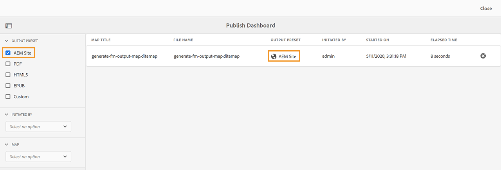

# Verwalten von Veröffentlichungsaufgaben mit dem Dashboard „Veröffentlichen“ {#id205CC08305Z}

When you have a large set of publishing tasks running on your system, it becomes practically impossible to check each DITA map individually to monitor its publishing task. AEM Guides gives the administrators and publishers one unified view of all publishing tasks running in the system. A list of all active publishing tasks is available in the Publish Dashboard.

The Publish Dashboard gives a complete overview of all publishing tasks currently running in the system.

{width="800" align="left"}

The Publish Dashboard contains the following details:

- **Map Title** - The title of a map file that is being currently published or is in the publish queue.

- **File Name** - The file name of the DITA map.

- **Output Preset** - Name of the output preset that is used to generate the output.

- **Initiated By** - Username of the user who initiated the publishing task.

- **Started On** - Date and time when the publishing task was started.

- **Elapsed Time** - Time since when the publishing task is running in the system.

- **Delete icon** - Cancel or terminate a publishing task.

The left panel in the Publish Dashboard provides the following filtering options:

- **Output Preset** - Select one or more output presets for which you want to see the currently active publishing tasks. In the following screenshot, the publishing tasks are filtered to show only those tasks that use the AEM Site output preset:

  {width="800" align="left"}

- **Initiated By** - Select a username from the list to show the publishing tasks initiated by the selected user.

- **Map** - Select a map file from the list to show the publishing tasks running for the selected map.

## Access the Publish Dashboard {#id205CC100DY4}

Perform the following steps to access the Publish Dashboard:

>[!NOTE]
>
> Only an Administrator or Publisher can access the Publish Dashboard.

1. Klicken Sie oben auf den Adobe Experience Manager-Link und wählen Sie **Tools** aus.

1. Wählen Sie **Guides** aus der Liste der Tools aus.

1. Klicken Sie auf die Kachel **Dashboard veröffentlichen**.

   Das Veröffentlichungs-Dashboard wird mit einer Liste aller aktiven Veröffentlichungsaufgaben im System geöffnet.

   Wenn Sie auf den Dateinamen-Link klicken, wird die DITA-Zuordnungskonsole der ausgewählten Zuordnung angezeigt.

   {width="800" align="left"}

>[!NOTE]
>
> Sie können auf das Dashboard Veröffentlichen auch über die Registerkarte Ausgaben zugreifen, während Sie im Dashboard Zuordnung eine Ausgabe generieren. Weitere Informationen finden Sie unter [Anzeigen des Status der Aufgabe zur Ausgabenerstellung](generate-output-for-a-dita-map.md#viewing_output_history).

## Abbrechen einer Veröffentlichungsaufgabe

Führen Sie die folgenden Schritte aus, um eine Aufgabe zur Ausgabegenerierung über das Veröffentlichungs-Dashboard abzubrechen:

1. [Zugriff auf das Veröffentlichungs-Dashboard](#id205CC100DY4).

1. Klicken Sie in der Liste der aktiven Veröffentlichungsaufgaben auf das Löschsymbol einer Aufgabe, die Sie abbrechen möchten.

   {width="800" align="left"}

1. Klicken Sie **der** Abbruchmeldung bestätigen auf „Ja“.

   Der Abbruchsbefehl wird akzeptiert, und der Abbruch wird versucht, solange die Aufgabe aktiv bleibt. Nachdem die Aufgabe erfolgreich beendet wurde, wird sie aus der aktuell aktiven Aufgabenliste entfernt. Der Status der Aufgabe wird auch in der DITA Map-Konsole als Abgebrochen aktualisiert. Im folgenden Screenshot wird die Aufgabe *HTML5* über das Veröffentlichungs-Dashboard abgebrochen, und ihr Status wird auch in der DITA-Zuordnungskonsole geändert.

   {width="800" align="left"}

**Übergeordnetes Thema:**[ Ausgabegenerierung](generate-output.md)
