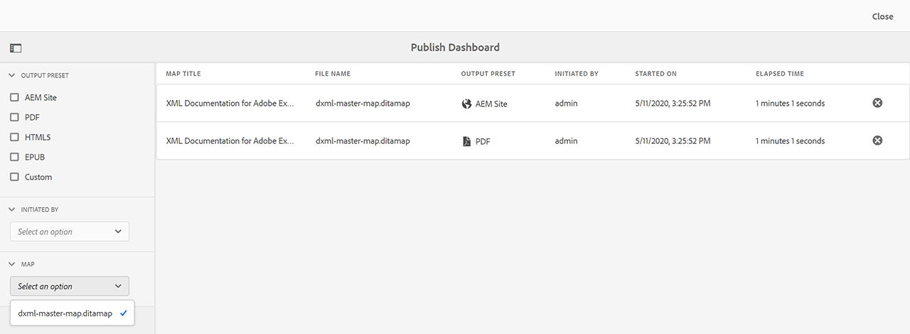
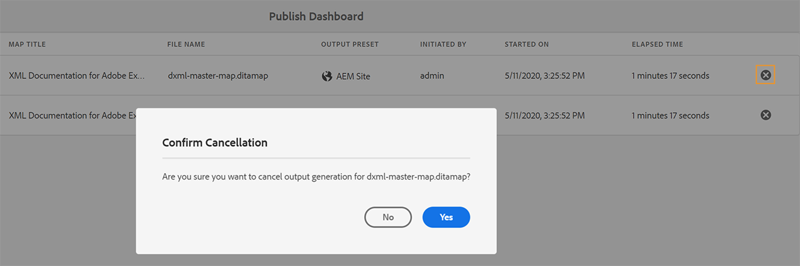

# Verwalten von Veröffentlichungsaufgaben mithilfe des Publish-Dashboards {#id205CC08305Z}

Wenn Sie eine große Anzahl von Veröffentlichungsaufgaben auf Ihrem System ausführen, ist es praktisch unmöglich, jede DITA-Karte einzeln zu überprüfen, um ihre Veröffentlichungsaufgabe zu überwachen. AEM Guides bietet Administratoren und Herausgebern eine einheitliche Ansicht aller Veröffentlichungsaufgaben, die im System ausgeführt werden. Eine Liste aller aktiven Veröffentlichungsaufgaben ist im Publish Dashboard verfügbar.

Das Publish-Dashboard bietet einen vollständigen Überblick über alle Veröffentlichungsaufgaben, die derzeit im System ausgeführt werden.

{width="800" align="left"}

Das Publish Dashboard enthält die folgenden Details:

- **Map Title** - Der Titel einer Map-Datei, die derzeit veröffentlicht wird oder sich in der Veröffentlichungswarteschlange befindet.

- **Dateiname** - Der Dateiname der DITA-Zuordnung.

- **Ausgabevorgabe** - Name der Ausgabevorgabe, mit der die Ausgabe generiert wird.

- **Initiiert von** - Benutzername des Benutzers, der die Veröffentlichungsaufgabe initiiert hat.

- **Gestartet am** - Datum und Uhrzeit des Beginns der Veröffentlichungsaufgabe.

- **Vergangene Zeit** - Zeit seit der Ausführung der Veröffentlichungsaufgabe im System.

- **Löschsymbol** - Abbrechen oder Beenden einer Veröffentlichungsaufgabe.

Das linke Bedienfeld im Publish Dashboard bietet die folgenden Filteroptionen:

- **Ausgabevorgabe** - Wählen Sie eine oder mehrere Ausgabevorgaben aus, für die Sie die derzeit aktiven Veröffentlichungsaufgaben anzeigen möchten. Im folgenden Screenshot werden die Veröffentlichungsaufgaben gefiltert, um nur die Aufgaben anzuzeigen, die die AEM Site-Ausgabevorgabe verwenden:

  {width="800" align="left"}

- **Initiiert von** - Wählen Sie einen Benutzernamen aus der Liste aus, um die Veröffentlichungsaufgaben anzuzeigen, die vom ausgewählten Benutzer initiiert wurden.

- **Zuordnung** - Wählen Sie eine Zuordnungsdatei aus der Liste aus, um die Veröffentlichungsaufgaben anzuzeigen, die für die ausgewählte Zuordnung ausgeführt werden.

## Zugriff auf das Publish-Dashboard {#id205CC100DY4}

Führen Sie die folgenden Schritte aus, um auf das Publish Dashboard zuzugreifen:

>[!NOTE]
>
> Nur ein Administrator oder Herausgeber kann auf das Publish-Dashboard zugreifen.

1. Klicken Sie oben auf den Adobe Experience Manager-Link und wählen Sie **Tools** aus.

1. Wählen Sie **Guides** aus der Liste der Tools aus.

1. Klicken Sie auf die Kachel **Publish Dashboard** .

   Das Publish-Dashboard wird mit einer Liste aller aktiven Veröffentlichungsaufgaben im System geöffnet.

   Wenn Sie auf den Link Dateiname klicken, wird die DITA-Zuordnungskonsole der ausgewählten Zuordnung angezeigt.

   {width="800" align="left"}

>[!NOTE]
>
> Sie können auch über den Tab Ausgaben auf das Publish-Dashboard zugreifen, während Sie die Ausgabe über das Mapping-Dashboard generieren. Weitere Informationen finden Sie unter [Status der Ausgabegenerierungsaufgabe anzeigen](generate-output-for-a-dita-map.md#viewing_output_history).

## Abbrechen einer Veröffentlichungsaufgabe

Führen Sie die folgenden Schritte aus, um eine Ausgabegenerierungsaufgabe im Publish-Dashboard abzubrechen:

1. [Greifen Sie auf das Publish-Dashboard zu](#id205CC100DY4).

1. Klicken Sie in der Liste der aktiven Veröffentlichungsaufgaben auf das Löschsymbol einer Aufgabe, die Sie abbrechen möchten.

   {width="800" align="left"}

1. Klicken Sie in der Meldung Abbruch bestätigen auf **Ja** .

   Der Befehl &quot;Abbrechen&quot;wird akzeptiert und der Abbruch wird versucht, solange die Aufgabe aktiv bleibt. Nachdem die Aufgabe erfolgreich beendet wurde, wird sie aus der Liste der derzeit aktiven Aufgaben entfernt. Der Status der Aufgabe wird auch in der DITA-Zuordnungskonsole als Abgebrochen aktualisiert. Im folgenden Screenshot wird die Aufgabe *HTML5* vom Publish-Dashboard abgebrochen und ihr Status wird auch in der DITA-Map-Konsole geändert.

   {width="800" align="left"}

**Übergeordnetes Thema:**[ Ausgabegenerierung](generate-output.md)
