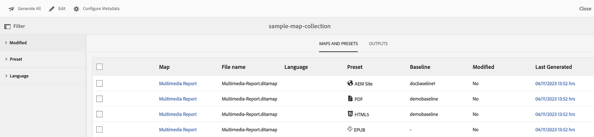
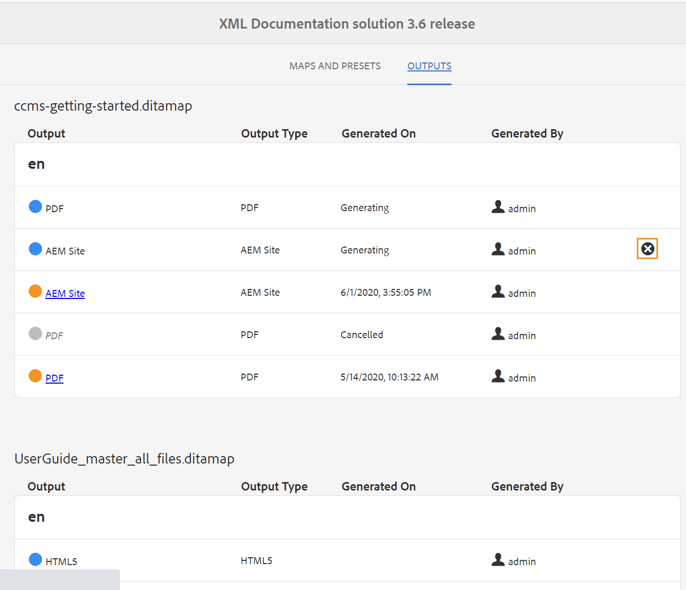

# Verwenden der Zuordnungssammlung für die Ausgabegenerierung {#id1723F20G0HS}

In jeder Organisation kann ein Produkt über mehrere Dokumentationstypen verfügen. Als Publishing-Spezialist möchten Sie steuern, welche Ausgabe Sie für welches Dokument generieren möchten. Außerdem sollte es eine Möglichkeit geben, mehrere Dokumente mit einem einzigen Klick im Batch zu veröffentlichen.

AEM Guides bietet Ihnen die Möglichkeit, Ihre Inhalte für die Veröffentlichung mithilfe eines Dashboards namens „Kartensammlung“ zu organisieren. Mit einer Zuordnungssammlung können Sie alle verschiedenen Arten von Dokumenten in einer Einheit zusammenführen. You can choose what type of output you want to generate for each document in your Map Collection. In addition, you can also generate output and see the output generation progress from the publishing dashboard.

Mit Zuordnungssammlung können Sie anzeigen, ob sich eine Zuordnung seit der letzten Veröffentlichung geändert hat. Sie können die Details auf der Registerkarte Zuordnungen und Vorgaben Ihrer Zuordnungssammlung anzeigen und dann bei Bedarf die Ausgabe erneut veröffentlichen. Weitere Informationen finden Sie unter Hinzufügen einer Zuordnung zu einer Zuordnungssammlung.

## Erstellen einer Kartensammlung und Hinzufügen von DITA-Karten

Um eine Zuordnungssammlung zu erstellen und der Sammlung DITA-Zuordnungen hinzuzufügen, führen Sie die folgenden Schritte aus:

1. Klicken Sie in der Benutzeroberfläche von Assets auf **Sammlungen zuordnen**.

   Wenn der Link Sammlungen zuordnen nicht verfügbar ist, wählen Sie die Option **Navigation** in der linken Leiste aus und klicken Sie dann auf **Sammlungen zuordnen**.

   {width="350" align="left"}

1. Geben Sie einen Titel für Ihre Kartensammlung ein.
1. Klicken Sie auf **Erstellen**.

   Bei der Erstellung der Zuordnungssammlung wird eine Erfolgsmeldung angezeigt.

1. Klicken **auf** Erfolgsmeldung.

   Die neu erstellte Zuordnungsdatei wird auf der Seite Zuordnungssammlungen angezeigt.

1. Klicken Sie auf das graue Feld in der Kachel der Sammlung, die Sie bearbeiten möchten.
1. Klicken Sie **Bearbeiten** und dann auf **Karten hinzufügen**.
1. Suchen Sie die DITA-Karten, die Sie der Kartensammlung hinzufügen möchten, und fügen Sie sie hinzu.

   Standardmäßig werden alle der Zuordnung zugeordneten Vorgaben und Gebietsschemata automatisch hinzugefügt.

1. Wählen Sie den gewünschten Ausgang, indem Sie die Schiebetaste ein- oder ausschalten.
1. Klicken Sie auf **Fertig**.

   Die DITA-Zuordnungsdateien werden Ihrer Zuordnungssammlung hinzugefügt.

   {width="800" align="left"}

Die folgenden Filteroptionen und Zuordnungsdetails werden auf der Sammlungsseite angezeigt:

- **Filter:** Die letzte Leiste zeigt die folgenden Filter:
   - **Geändert**: Sie können „Ja“ oder „Nein“ auswählen. Wenn Sie Ja auswählen, werden nur die geänderten DITA-Zuordnungen in der Tabelle Zuordnungen und Vorgaben angezeigt.
   - **Voreinstellung**: Wählen Sie eine Voreinstellung aus, für die Sie die Zuordnungsdateien herausfiltern möchten. Wenn Sie beispielsweise die Vorgabe *AEM-Site* auswählen, werden nur die Zuordnungen angezeigt, für die die Ausgabevorgabe *AEM-Site* konfiguriert ist.
   - **Sprache**: Sie können einen beliebigen der verfügbaren Sprach-Codes auswählen und nur die ausgewählte Sprache in der Tabelle Zuordnungen und Vorgaben anzeigen.
- **Maps- und Voreinstellungs**-Tabelle: Die Tabelle Maps und Voreinstellungen enthält Informationen in den folgenden Spalten:
   - **Map**: Zeigt den Titel der DITA-Zuordnungsdatei an.
   - **Dateiname**: Zeigt den Dateinamen der DITA-Zuordnung an.
   - **Language**: Zeigt die Sprache der DITA-Karte an.
   - **Voreinstellung**: Zeigt den für die Zuordnungsdatei konfigurierten Vorgabetyp der Ausgabe an.
   - **Baseline**: Zeigt die Baseline an, die von der Ausgabevorgabe verwendet wird.  Wenn keine Grundlinie verwendet wird, wird ein Bindestrich &quot;-&quot; angezeigt.
   - **Geändert**: Gibt an, ob die DITA-Zuordnung nach der letzten Veröffentlichung aktualisiert wird. Basierend auf diesen Informationen können Sie entscheiden, ob Sie die Ausgabe für diese DITA-Zuordnung erneut veröffentlichen möchten oder nicht.
   - **Last Generated**: Shows the date and time of the last generated output.

## Konfigurieren und Generieren der Ausgabe mithilfe einer Zuordnungssammlung

Um die Ausgabe mithilfe einer Zuordnungssammlung zu konfigurieren und zu generieren, führen Sie die folgenden Schritte aus:

1. Öffnen Sie die Zuordnungssammlung. Sie können die verschiedenen Ausgabevorgaben wie die AEM-Site, PDF (einschließlich nativer PDF), HTML5, EPUB und benutzerdefinierte Vorgaben anzeigen. Sie können auch die von Ihrem Administrator erstellten globalen Ordner- und Profilvorgaben anzeigen.

   Das  zeigt eine Vorgabe auf Ordnerprofilebene an.
1. \(Optional\) Führen Sie je nach Ihren Anforderungen einen der folgenden Schritte aus:
   - Wenden Sie Filter aus der linken Leiste an, um die geänderten Zuordnungen, die Ausgabevorgabe oder die Sprache zu filtern.
   - Klicken Sie bei Bedarf **Bearbeiten** und ändern Sie die gewünschte Ausgabe, indem Sie die Schiebetaste ein- oder ausschalten.

     >[!NOTE]
     >  
     > Standardmäßig ist jede neue Vorgabe deaktiviert.

1. Sie können die Voreinstellungen für eine DITA-Zuordnung wie folgt aktivieren:

   - Aktivieren Sie eine beliebige Voreinstellung.
   - Aktivieren **Alle Vorgaben** für eine DITA-Map, um alle Vorgaben auf einmal auszuwählen. Standardmäßig ist diese Option deaktiviert.
   - Aktivieren **Ordnerprofilvorgaben** für eine DITA-Zuordnung, um alle Ordnerprofilvorgaben auszuwählen. Standardmäßig ist diese Option deaktiviert.
     {width="800" align="left"}

1. Führen Sie einen der folgenden Schritte aus:

   - Um eine Ausgabe der ausgewählten Zuordnungen zu generieren, wählen Sie die Zuordnungsdateien aus und klicken Sie auf **Ausgewählte generieren**.
   - Um die Ausgabe aller DITA-Zuordnungen mit den konfigurierten Voreinstellungen zu generieren, klicken Sie auf **Alle generieren**.

   >[!IMPORTANT]
   >
   > Wenn sich ein Prozess zur Ausgabegenerierung für eine Voreinstellung oder DITA-Zuordnung entweder in der Warteschlange befindet oder in Bearbeitung ist, können Sie für dieselbe Voreinstellung oder Zuordnung keine andere Ausgabegenerierungsaufgabe initiieren.

## Configure the metadata properties

In der Zuordnungssammlung können Sie die Metadateneigenschaften für die DITA-Zuordnungen stapelweise konfigurieren. Wählen Sie **Metadaten konfigurieren** aus, um die Seite **Asset-Metadaten** zu öffnen. On the **Asset Metadata** page, all the maps present in the collection are listed on the left.

{width="800" align="left"}

Führen Sie die folgenden Schritte aus, um die Metadateneigenschaften zu konfigurieren:

1. Sie können die Zuordnungen auswählen, für die Sie die Metadaten aktualisieren möchten. Standardmäßig sind alle vorhandenen DITA-Zuordnungen ausgewählt.

1. Sobald Sie die DITA-Zuordnungen ausgewählt haben, können Sie Eigenschaften wie Metadaten, Zeitplan (Deaktivierung), Verweise, den Dokumentstatus und mehr anzeigen.

1. Aktualisieren Sie die Metadateneigenschaften.

1. Klicken Sie **oben auf** Speichern und schließen“, um die Aktualisierungen zu speichern.
1. (Optional) Wenn Sie die Tags aktualisieren, können Sie auch in der Dropdown-Liste **Speichern und schließen** die Option Anhängen auswählen, um die neuen Tags an die vorhandene Liste anzuhängen.
1. Klicken Sie **der Dropdown** Liste **Speichern und schließen** auf Senden .
Die Metadateneigenschaften werden für die DITA-Zuordnungen aktualisiert, die Sie stapelweise aus der Zuordnungssammlung auswählen.

>[!NOTE]
> 
>Für das **Dokumentstatus**-Dropdown können Sie nur die Dokumentstatus auswählen, die für alle ausgewählten DITA-Zuordnungen gemeinsam zulässig sind. Weitere Informationen finden Sie unter [**Dokumentstatus**](./web-editor-document-states.md).

Die Metadateneigenschaften sind mit den Dateieigenschaften synchronisiert. Nachdem Sie sie aktualisiert haben, können Sie sie über das Bedienfeld **Dateieigenschaften** im Web-Editor anzeigen.

## Löschen einer Zuordnungssammlung oder einer DITA-Zuordnung aus der Zuordnungssammlung

- Um eine Zuordnungssammlung zu löschen, wählen Sie eine Sammlung auf der Seite Zuordnungssammlung aus und klicken Sie auf **Löschen**.
- Um eine DITA-Zuordnung aus einer Zuordnungssammlung zu löschen, öffnen Sie die Zuordnungssammlung im Bearbeitungsmodus, wählen Sie die DITA-Zuordnungsdatei aus und klicken Sie auf **Aus Sammlung entfernen**.

Dadurch werden auch alle Vorgaben oder Gebietsschemata entfernt, die mit der DITA-Zuordnung aus der Zuordnungssammlung verknüpft sind.

## Abbrechen einer Ausgabegenerierungsaufgabe aus einer Zuordnungssammlung

Ähnlich wie beim Abbrechen einer Aufgabe zur Ausgabegenerierung über die [DITA Map-Konsole](generate-output-for-a-dita-map.md#id2061H100T5Z) oder das [Dashboard veröffentlichen](generate-output-publish-dashboard.md#) können Sie eine Aufgabe zur Ausgabegenerierung über eine Zuordnungssammlung abbrechen. Rufen Sie die Registerkarte Ausgaben einer Zuordnungssammlung auf, wechseln Sie zur Veröffentlichungsaufgabe, die Sie abbrechen möchten, und klicken Sie auf das Symbol **Diesen Auftrag abbrechen**, um die Veröffentlichungsaufgabe abzubrechen.

{width="800" align="left"}

**Übergeordnetes Thema:**[ Ausgabegenerierung](generate-output.md)
