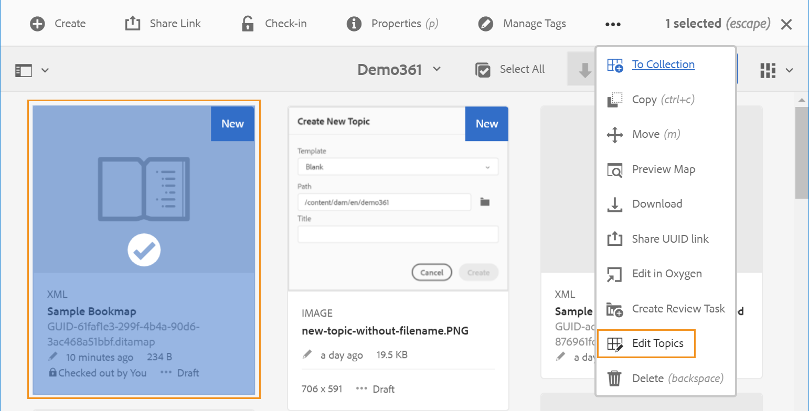
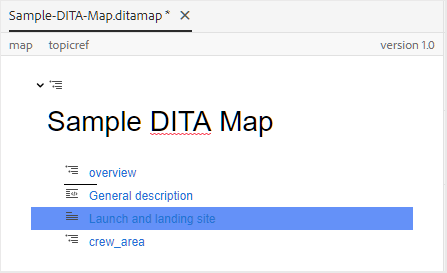
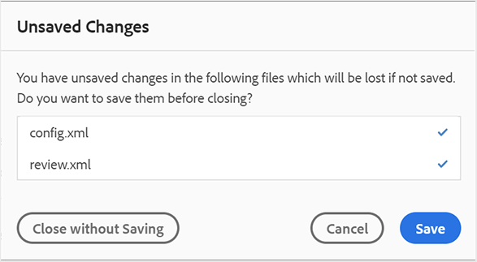

# Arbeiten mit dem erweiterten Zuordnungs-Editor {#id1942D0S0IHS}

Der erweiterte Zuordnungs-Editor verfügt über eine intuitive Benutzeroberfläche und ähnelt dem Web-Editor. Wenn Sie eine Zuordnungsdatei im Web-Editor öffnen, erhalten Sie die Möglichkeit, die Zuordnungsdatei mithilfe der erweiterten Benutzeroberfläche des Zuordnungs-Editors zu bearbeiten. Mit dem erweiterten Zuordnungs-Editor können Sie Themenreferenzen, wichtige Verweise hinzufügen, Inhalte strukturieren und vieles mehr.

Zusätzlich zur Bearbeitung von Zuordnungsdateien direkt über den Web-Editor können Sie auch Themendateien in einer Zuordnung öffnen, um den Web-Editor zu bearbeiten. Dieses Thema führt Sie durch die Funktionen im erweiterten Zuordnungs-Editor und zeigt Ihnen, wie Sie Dateien in einer DITA-Zuordnung im Web-Editor öffnen und bearbeiten können.

## Themen zu einer Zuordnungsdatei hinzufügen

Führen Sie die folgenden Schritte aus, um Ihre Zuordnungsdatei mit dem erweiterten Zuordnungs-Editor zu erstellen:

1. Navigieren Sie in der Assets-Benutzeroberfläche zu der Zuordnungsdatei, die Sie bearbeiten möchten.

   >[!NOTE]
   >
   > Stellen Sie sicher, dass Sie den Asset-Auswahlmodus nicht aktiviert haben.

1. Um eine exklusive Sperre für die Zuordnungsdatei zu erhalten, wählen Sie die Zuordnungsdatei aus und klicken Sie auf **Auschecken**.

   >[!NOTE]
   >
   > Sobald Sie eine exklusive Sperre für eine Zuordnungsdatei haben, können andere Benutzer die Zuordnung nicht mehr bearbeiten. Sie wären jedoch in der Lage, an den Themen innerhalb der Zuordnungsdatei zu arbeiten. Wenn Ihr Admin Ihren Web-Editor so konfiguriert hat, dass Dateien vor der Bearbeitung ausgecheckt werden, können Sie eine Datei erst bearbeiten, nachdem Sie sie ausgecheckt haben. Ebenso werden Sie, falls konfiguriert, aufgefordert, alle ausgecheckten Dateien einzuchecken, bevor Sie sie schließen

1. Klicken Sie bei ausgewählter Zuordnungsdatei auf **Themen bearbeiten**.

   {width="800" align="left"}

   Sie können auch die Option **Themen bearbeiten** aus dem Aktionsmenü in der Zuordnungsdatei auswählen:

   {width="800" align="left"}

   Die Zuordnungsdatei wird im Web-Editor geöffnet und kann dort bearbeitet werden.

1. Klicken Sie auf das Symbol **Bearbeiten**.

   {width="550" align="left"}

   Die Zuordnung wird in der Benutzeroberfläche des erweiterten Zuordnungs-Editors geöffnet. Wenn Sie eine neue Kartendatei geöffnet haben, wird nur der Titel der Karte im Editor angezeigt.

   {width="800" align="left"}

   - **A** - \(*Haupt-Symbolleiste*\): Dies ähnelt der Haupt-Symbolleiste des Web-Editors. Weitere Informationen [ Sie unter ](web-editor-features.md#id2051EA0G05Z) im Web-Editor.

   - **B** - \(*Sekundäre Symbolleiste*\) Dies ist die Sekundäre Symbolleiste, die Ihnen das Arbeiten mit Zuordnungsdateien ermöglicht. Weitere Informationen zu den in der Sekundären Symbolleiste verfügbaren Funktionen finden Sie unter [In der Symbolleiste des erweiterten Zuordnungs-Editors verfügbare Funktionen](#id205DEC0005Z).

   - **C** - \(*Kartenansichten*\): Ermöglicht es Ihnen, im Zuordnungs-Editor zwischen Layout, Autor, Source und Vorschau zu wechseln. Mit **Layout** Ansicht können Sie die Themen in einer DITA-Karte organisieren. Dadurch wird die Baumstruktur oder hierarchische Ansicht der Karte angezeigt. Die **Autor**-Ansicht ermöglicht die Bearbeitung der Themen im Zuordnungs-Editor. Dadurch erhält auch die WYSIWYG-Ansicht der Zuordnungsdatei. Die Ansicht **Source** ermöglicht es Ihnen, mit der zugrunde liegenden XML der Zuordnungsdatei zu arbeiten. Die Vorschau bietet Ihnen eine konsolidierte Ansicht aller Themen und Unterzuordnungen innerhalb der Zuordnungsdatei. Der **Schließen**-Link schließt die Zuordnungsdatei.

   - **D** - \(*Linker Bereich*\): Ermöglicht den Zugriff auf den linken Bereich, in dem Sie Zugriff auf die Favoriten, das Repository, die Zuordnung, die Gliederung und andere Funktionen haben. Sie können sie erweitern oder reduzieren, indem Sie auf das Symbol Seitenleiste erweitern \(\) klicken. Weitere Informationen zu den im linken Bereich verfügbaren Funktionen finden Sie unter [Linkes ](web-editor-features.md#id2051EA0M0HS) im Web-Editor.

   - **E** - \(*Middle Area*\): Inhaltsbearbeitungsbereich zuordnen.

   - **F** - \(*Bereich rechts*\): Ermöglicht den Zugriff auf den Bereich „Eigenschaften“. Sie können die Inhaltseigenschaften und die Zuordnungseigenschaften des ausgewählten Themas oder der ausgewählten Zuordnung anzeigen. Weitere Informationen zu den in diesem Bedienfeld verfügbaren Funktionen finden Sie unter [Rechtes Bedienfeld](web-editor-features.md#id2051EB003YK) im Web-Editor.

1. Wechseln Sie im linken Bedienfeld zur **Repository-Ansicht**.

1. Navigieren Sie im AEM-Repository zu dem Ordner, der die Themen oder Unterzuordnungen enthält, die Sie hinzufügen möchten.

1. Wählen Sie das Thema oder die Zuordnungsdatei in der **Repository-Ansicht** aus und ziehen Sie sie per Drag-and-Drop in den Bearbeitungsbereich für die \(mittlere\)-Zuordnungsinhalte.

   Das Thema wird der Karte hinzugefügt.

   {width="800" align="left"}

1. Um weitere Themen oder eine Unterkarte hinzuzufügen, ziehen Sie das Thema oder die Unterkarte per Drag-and-Drop an die gewünschte Position in der Karte.

   Beachten Sie beim Erstellen Ihrer Zuordnungsdatei die folgenden Punkte:

   - Die Datei wird an der Stelle hinzugefügt, an der die horizontale Leiste im Bereich für die Kartenbearbeitung angezeigt wird. Im folgenden Screenshot wird das Thema *Übersicht* zwischen den Themen *Allgemeine Beschreibung* und *Launch und Landing Site* hinzugefügt.

     {width="350" align="left"}

   - Um ein Thema zu ersetzen, platzieren Sie das Thema oben, links oder rechts neben dem Thema, das Sie ersetzen möchten. Ein vertikaler Balken links oder rechts neben einem Thema zeigt an, dass dieses durch das Thema ersetzt wird, das darauf abgelegt wird.

     {width="550" align="left"}

     Bevor Sie jedoch ein Thema ersetzen, erhalten Sie eine Bestätigungsaufforderung. Das Thema wird erst nach der Bestätigung ersetzt.

     {width="300" align="left"}

   - Wenn Sie eine Unter-Map zu Ihrer DITA-Map hinzufügen, wird die Unter-Map als Link in der DITA-Map angezeigt. Um alle Themen der Unterzuordnung anzuzeigen, klicken Sie bei gedrückter Strg-Taste auf den Link der Unterzuordnung. Der Inhalt der Unter-Zuordnung wird auf einer neuen Registerkarte angezeigt. Um ein Thema über die DITA-Karte zu öffnen, klicken Sie bei gedrückter Strg-Taste auf den Themen-Link, um es in der neuen Registerkarte zu öffnen.

   - Sie können die Tastaturbefehle Strg+Z und Strg+Y oder die entsprechenden Symbole in der Symbolleiste verwenden, um Änderungen in der Karte rückgängig zu machen oder wiederherzustellen.

   - Um die Position eines Themas zu ändern, wählen Sie das Thema \(durch Klicken auf das Themensymbol\) aus und ziehen Sie es dann per Drag-and-Drop an die gewünschte Position in der Zuordnungsdatei. Stellen Sie sicher, dass die horizontale Leiste an der Stelle sichtbar ist, an der Sie das Thema platzieren möchten. Im folgenden Screenshot wird das Thema *Launch und Landing Site* nach dem Thema *Übersicht* verschoben.

     {width="350" align="left"}

   - Um die Eigenschaften Ihrer Zuordnungsdatei zu überprüfen, klicken Sie mit der rechten Maustaste auf eine beliebige Stelle im Bereich der Zuordnungsbearbeitung und wählen Sie **Eigenschaften** aus dem Kontextmenü aus. Abhängig von Ihrer AEM-Version können Sie Eigenschaften wie Metadaten, Zeitplan \(de\)aktivierung, Verweise, Dokumentstatus und mehr sehen.

1. Klicken Sie auf **Speichern**.

## In der Symbolleiste des erweiterten Zuordnungs-Editors verfügbare Funktionen {#id205DEC0005Z}

Die Symbolleiste im erweiterten Zuordnungs-Editor ähnelt dem Themen-Web-Editor. Grundlegende Vorgänge wie das Umschalten des linken Bedienfelds, das Speichern der Zuordnung, das Erstellen einer neuen Version der Zuordnung, das Rückgängigmachen/Wiederholen des letzten Vorgangs und das Löschen der ausgewählten Elemente sind in beiden Editoren häufig. Weitere Informationen zur Funktionsweise dieser Vorgänge finden Sie [ Abschnitt „Kennen Sie die Funktionen ](web-editor-features.md#) Web-Editors“.

Die folgenden zuordnungsspezifischen Vorgänge sind auch auf der Symbolleiste in den Ansichten Layout und Autor verfügbar:

## Layout-Ansicht {#id205DEC0005Z_layout_view}

Wenn Sie eine Karte zur Bearbeitung öffnen, wird die Layout-Ansicht des Karten-Editors geöffnet. Die Layout-Ansicht zeigt die Kartenhierarchie in einer Baumansicht an und ermöglicht es Ihnen, die Themen in einer Karte zu organisieren.

>[!NOTE]
>
> In der Layout-Ansicht werden nur die Verweise angezeigt, die in einer Zuordnung vorhanden sind. Wenn Referenzen beschädigt sind, wird links neben der Referenz ein kleines Kreuz-Symbol angezeigt

In der Layout-Ansicht können Sie die folgenden Aufgaben ausführen:

**Themenreferenz einfügen** - 

Zeigt den Dialog für die Themensuche an. Navigieren Sie zu der Themen-/Zuordnungsdatei, die Sie einfügen möchten, und klicken Sie auf Auswählen , um sie der Zuordnung hinzuzufügen.
{width="800" align="left"}

**Themengruppe einfügen** - 

Fügen Sie das `topicgroup` ein. Weitere Informationen zur Gruppierung von Themen finden Sie in der [Themengruppe](https://docs.oasis-open.org/dita/v1.0/langspec/topicgroup.html) Dokumentation in OASIS DITA Language Specification.

**Schlüsseldefinition einfügen** - 

Zeigt das Dialogfeld Keydef einfügen an. Verwenden Sie dieses Dialogfeld, um eine beliebige Schlüsseldefinition zu definieren, die Sie in der Zuordnung verwenden möchten.

{width="300" align="left"}

**Einfügen vor/Einfügen nach** - /

Zeigt das Dialogfeld Element einfügen an. Wählen Sie das Element aus, das Sie in die Zuordnung einfügen möchten. Je nach Vorgang wird das neue Element vor oder nach dem aktuellen Element in der Zuordnung eingefügt.

**Vordere Materie einfügen** - 

Dieses Symbol wird angezeigt, wenn Sie eine Bookmap zur Bearbeitung öffnen. Sie können Komponenten wie ein Inhaltsverzeichnis, einen Index und eine Liste von Tabellen am Anfang des Buches einfügen.

**Einfügen der Materie** - 

Dieses Symbol wird angezeigt, wenn Sie eine Bookmap zur Bearbeitung öffnen. Sie können Komponenten für ein Ende des Buches wie einen Index, ein Glossar und eine Liste von Figuren einfügen.

**Ausgewähltes Element nach links/rechts verschieben** - /

Klicken Sie auf den Pfeil nach links, um das Thema in der Hierarchie nach links zu verschieben. Dadurch wird das jeweilige Thema in der Hierarchie wesentlich um eine Ebene nach oben gefördert. Wenn Sie beispielsweise auf den Pfeil nach links klicken, während ein untergeordnetes Thema ausgewählt ist, wird es zum gleichrangigen Thema über diesem. Wenn Sie auf den Pfeil nach rechts klicken, wird das Thema ebenfalls nach rechts verschoben, was es zum untergeordneten Thema des darüber liegenden Themas macht.

**Ausgewähltes Element nach oben/unten verschieben** - / 

Klicken Sie auf die Pfeile nach oben oder unten, um das Thema in der Hierarchie nach oben oder unten zu verschieben.

>[!NOTE]
>
> Sie können die Verweise auch per Drag-and-Drop in eine Karte verschieben.

**Sperren/Entsperren** - /

Ruft eine Sperre für die Zuordnungsdatei ab und löst die Sperre. Wenn Sie ungespeicherte Änderungen in Ihrer Zuordnungsdatei haben, werden Sie zum Zeitpunkt der Aufhebung der Sperre aufgefordert, die Zuordnungsdatei zu speichern. Die Änderungen werden in der aktuellen Version der Zuordnungsdatei gespeichert.

**Zusammenführen** - 

Weitere Informationen zum Zusammenführen von Inhalten aus einer anderen Version derselben oder einer anderen Datei finden Sie unter [Zusammenführen](web-editor-features.md#id205DF04E0HS) im Web-Editor.

**Versionsverlauf** - 

Überprüfen Sie die verfügbaren Versionen und Beschriftungen für Ihr aktives Thema und stellen Sie eine Version aus dem Editor selbst wieder her.

**Versionsbezeichnung** - 

Zeigt das Dialogfeld Versionsbezeichnung-Verwaltung an. Wählen Sie eine Version aus der Dropdown-Liste aus. Wählen Sie die Bezeichnung aus, die Sie auf die ausgewählte Version anwenden möchten, und klicken Sie auf **Bezeichnung hinzufügen**, um sie hinzuzufügen.

**Anzeigeoptionen** - 

Zeigt eine Dropdown-Liste an, in der Sie die Optionen Zeilennummern, Kontrollkästchen anzeigen und Dateinamen anzeigen auswählen können.

- **Zeilennummern anzeigen**

Blendet die Zeilennummer für jedes Thema ein oder aus. Die Zeilennummern werden je nach Ebene in der Hierarchie angezeigt.

- **Kontrollkästchen anzeigen**

Blendet für jedes Thema ein Kontrollkästchen ein oder aus. Sie können das Kontrollkästchen verwenden, um das/die Thema(e) auszuwählen und mithilfe des Menüs Optionen verschiedene Aufgaben auszuführen. Weitere Informationen finden Sie im Menü [Optionen](#id228ID8006H8).

- **Dateinamen anzeigen**

Zeigt den Dateinamen der Titel der Themen an.

>[!NOTE]
>
> Wenn Sie den Mauszeiger über den Titel eines Themas bewegen, wird der Dateipfad angezeigt.

**Themen basierend auf bedingten Filtern anzeigen** Wenn Sie Bedingungen auf ein Thema angewendet haben, wird rechts neben dem Thema ein Filtersymbol angezeigt. Wenn Sie den Mauszeiger über ein Filtersymbol bewegen, werden die angewendete Bedingung und ihr Attributwert angezeigt.

**Menü „Optionen“ in der Layout-Ansicht**

Neben der Organisation von Themen in der Zuordnungsdatei können Sie auch die folgenden Aktionen über das Menü Optionen ausführen, das für ein Element in der Layout-Ansicht verfügbar ist:

{width="650" align="left"}

- **Hinzufügen**: Im Zuordnungs-Editor können Sie ein neues Thema oder eine leere Referenz hinzufügen:
   - **Leere Referenz**: Mit dieser Option können Sie eine leere Referenz in Ihre DITA-Zuordnung einfügen. Sie können später auf den eingefügten leeren Verweis doppelklicken und die Themendetails hinzufügen. Weitere Informationen finden Sie unter [Thema erstellen](web-editor-features.md#id228ICI0105U) im Web-Editor.
   - **Neues Thema**: Wenn Sie im Menü ein neues Thema erstellen, wird das Dialogfeld Neues Thema erstellen angezeigt. Geben Sie im Dialogfeld Neues Thema erstellen die erforderlichen Details ein und klicken Sie auf Erstellen . Weitere Informationen finden Sie unter [Thema erstellen](web-editor-features.md#id228ICI0105U) im Web-Editor.
- **Verschieben**: Sie können ein Thema in der Hierarchie nach oben/unten/rechts/links verschieben. Sie können ein Thema oder eine Karte auch aus dem Repository-Bereich auf die im Karten-Editor geöffnete Karte ziehen und dort ablegen.
- **Rückgängig**: Macht den letzten Vorgang in der Layout-Ansicht rückgängig.
- **Wiederholen**: Wiederholt den letzten Vorgang in der Layout-Ansicht.
- **Kopieren**: Kopiert den ausgewählten Verweis aus der Zuordnungsdatei.

  >[!NOTE]
  >
  > Sie können die Kontrollkästchen anzeigen und aktivieren, um mehrere Verweise zu kopieren.

- **Einfügen**: Einfügen der kopierten Verweise an der aktuellen Position in der Hierarchie.
- **Löschen**: Löscht die ausgewählten Verweise aus der Zuordnungsdatei.

  >[!NOTE]
  >
  > Sie können mehrere Verweise anzeigen und dann die Kontrollkästchen aktivieren, um sie zu löschen.

## Rechtes Bedienfeld im Karten-Editor

Im rechten Bedienfeld werden die Inhaltseigenschaften und die Zuordnungseigenschaften in der Layout-Ansicht des Zuordnungs-Editors angezeigt.

**Inhaltseigenschaften**

Das Bedienfeld Inhaltseigenschaften enthält Informationen zum Typ des aktuell in der Zuordnung ausgewählten Themas, zur zugehörigen Link-URL und zu den zugehörigen Attributen. Weitere Informationen finden Sie unter [Inhaltseigenschaften](web-editor-features.md#id228IDB00HMM) im Web-Editor.

- **Andere Attribute** Wenn Ihr Administrator ein Profil für Attribute erstellt hat, erhalten Sie diese Attribute zusammen mit den konfigurierten Werten. Im Bedienfeld Inhaltseigenschaften können Sie diese Attribute auswählen und sie relevanten Inhalten in Ihrem Thema zuweisen. Sie können auch Attribute zuweisen, die von Ihrem Administrator unter der Registerkarte **Attribute anzeigen** in den Editor-Einstellungen konfiguriert wurden. Die für ein Element definierten Attribute werden im Layout- und Gliederungsansicht angezeigt. Dies hilft Ihnen, einen kurzen Blick auf alle Themen in einer Zuordnung zu werfen, für die ein bestimmtes Attribut definiert ist. Beispielsweise alle Themen, bei denen das Plattformattribut als &quot;Android&quot; definiert ist.

  {width="650" align="left"}

  Weitere Informationen finden Sie unter *Attribute anzeigen* im Abschnitt *Editor-Einstellungen* -Funktionsbeschreibung [Linkes Bedienfeld](web-editor-features.md#id2051EA0M0HS).

- **Metadaten** Mithilfe der Metadaten können Sie die Metadateninformationen festlegen. Sie können den Navigationstitel, den Link-Text, die Kurzbeschreibung und die Keywords definieren.

Weitere Informationen zu den Standardattributen und Metadaten für Themen finden Sie in der Dokumentation [topicref](https://docs.oasis-open.org/dita/v1.2/os/spec/langref/topicref.html) in der OASIS DITA Language Specification.

**Eigenschaften zuordnen**

Zeigt das Dialogfeld Zuordnungseigenschaften an, in dem Sie die Attribute und Metadateninformationen für die Zuordnung festlegen können.

## Autorenansicht {#id205DEC0005Z_author_view}

Die **Autor**-Ansicht ermöglicht es Ihnen, Ihre DITA-Karte im Web-Editor zu bearbeiten. Hier wird die WYSIWYG-Ansicht des Karten-Editors angezeigt. Einige der in der Autorenansicht angezeigten Symbole sind mit der Layout-Ansicht identisch. Weitere Informationen finden Sie unter [Layout-Ansicht](#id205DEC0005Z_layout_view). Darüber hinaus können Sie die folgenden Symbole anzeigen und die zugehörigen Aufgaben von der Autorenansicht aus ausführen:

**Einfügen vor/Einfügen nach** - /

Zeigt das Dialogfeld Element einfügen an. Wählen Sie das Element aus, das Sie in die Zuordnung einfügen möchten. Je nach Vorgang wird das neue Element vor oder nach dem aktuellen Element in der Zuordnung eingefügt.

**Element einfügen** - 

Zeigt das Dialogfeld Element einfügen an. Wählen Sie das Element aus, das Sie einfügen möchten. Sie können die Tastatur verwenden, um durch die Liste der Elemente zu scrollen, und die Eingabetaste drücken, um das gewünschte Element einzufügen. Alternativ können Sie direkt auf das Element klicken, um es in die Karte einzufügen.

**Beziehungstabelle einfügen** - 

Fügt eine Beziehungstabelle in die Zuordnung ein. Da das Konzept der Arbeit mit der Beziehungstabelle identisch ist, wie im Abschnitt Grundlegender Zuordnungs-Editor erläutert, finden [ unter „Arbeiten mit Beziehungstabellen im ](map-editor-basic-map-editor.md#id1944B0I0COB) Zuordnungs-Editor“ weitere Details.

**Wiederverwendbaren Inhalt einfügen** - 

Zeigt das Dialogfeld Inhalt wiederverwenden an. Verwenden Sie dieses Dialogfeld, um den Inhalt, den Sie wiederverwenden möchten, in Ihre Karte einzufügen.

**Navigationstitelattribut aktualisieren** - 

Synchronisiert das `title` einer referenzierten Datei in einer Zuordnung mit dem in ihrem `@navtitle` angegebenen Wert. Sie können einer Zuordnung verschiedene Arten von Referenzdateien hinzufügen, z. B. Themen-, Referenz-, Aufgaben-, \(Unter\)-Zuordnungen usw. Die meisten dieser Dateien unterstützen das `@navtitle`. Wenn eine Datei das Attribut `@navtitle` enthält, wird das Attribut `@navtitle` für dieselbe Datei in der Zuordnung aktualisiert. Falls das `@navtitle` nicht vorhanden ist, wird das `@navtitle`-Attribut zu dieser Referenzdatei hinzugefügt und seine `title` wird ebenfalls aktualisiert, um die `@navtitle` anzuzeigen.

>[!NOTE]
>
> Ihr Administrator kann das automatische Hinzufügen `@navtitle` Attributs zu jeder Referenzdatei konfigurieren, die Sie einer Zuordnung hinzufügen. Weitere Informationen zum Konfigurieren des automatischen Hinzufügens `@navtitle` Attributs finden Sie unter *@navtitle Attribut standardmäßig einschließen* unter Installieren und Konfigurieren von Adobe Experience Manager Guides as a Cloud Service.

Klicken Sie auf das Symbol Navigationstitelattribut aktualisieren , um die Werte des `title` und des `@navtitle` zu synchronisieren.

**Tag-Ansicht ein/aus** - 

Blendet die XML-Tags ein oder aus. Die Tags dienen als visuelle Hinweise auf die Begrenzung eines Elements. Wenn Sie in diesem Modus einen Topic/Map-Verweis einfügen möchten, ziehen Sie die gewünschte Datei per Drag-and-Drop vor oder nach dem Tag. Die horizontale Leiste wird im Tag-Ansichtsmodus nicht angezeigt.

**Änderungen verfolgen/deaktivieren** - 

Sie können alle Aktualisierungen in der Zuordnungsdatei verfolgen, indem Sie den Modus Änderungen verfolgen aktivieren. Nach der Aktivierung der Tracking-Änderungen werden alle Einfügungen und Löschungen im Dokument erfasst. Weitere Informationen finden Sie unter &quot;[ aktivieren/deaktivieren](web-editor-features.md#id205DF0203Y4) im Web-Editor.

**Prüfungsaufgabe erstellen** - 

Sie können eine Prüfungsaufgabe des aktuellen Themas oder der Zuordnungsdatei direkt im Web-Editor erstellen. Öffnen Sie die Datei, für die Sie die Prüfungsaufgabe erstellen möchten, und klicken Sie auf Prüfungsaufgabe erstellen , um den Erstellungsprozess der Überprüfung zu starten. Befolgen Sie die Anweisungen unter [Themen oder Karten überprüfen](review.md#) für weitere Details.

## Themen über DITA-Map bearbeiten {#id17ACJ0F0FHS}

Das Bearbeiten eines einzelnen Themas gibt dem Autor nicht den vollständigen Kontext. Ein Autor hätte keine Informationen darüber, wo ein Thema in einer DITA-Karte platziert ist. Ohne diese kontextuellen Informationen wird es für Autoren ein wenig schwierig, Inhalte zu erstellen.

Mit AEM Guides können Autorinnen und Autoren eine DITA-Zuordnung im Web-Editor öffnen und die Platzierung von Themen innerhalb der Zuordnung sehen. Dies hilft Autoren zu wissen, wo genau das Thema in der Karte platziert ist, und relevantere Inhalte zu erstellen. Wenn mehrere Autoren an einem Projekt arbeiten, können sie außerdem wissen, welche Themen in der Karte verfügbar sind, und Inhalte bei Bedarf wiederverwenden.

Um Themen über eine DITA-Zuordnung zu bearbeiten, führen Sie die folgenden Schritte aus:

1. Navigieren Sie in der Assets-Benutzeroberfläche zu der DITA-Karte, die die Themen enthält, die Sie bearbeiten möchten.
1. Klicken Sie auf die DITA-Map, um sie in der DITA-Map-Konsole zu öffnen.
1. Wählen Sie die **Themen** aus, um eine Liste der in der DITA-Karte verfügbaren Themen anzuzeigen.

   >[!TIP]
   >
   > Auf der Registerkarte Themen haben Sie die Möglichkeit, die Zuordnungsdatei mit den abhängigen Elementen herunterzuladen. Weitere Informationen finden Sie unter [Exportieren einer DITA-Zuordnungsdatei](authoring-download-assets.md#id218UBA00IXA).

1. Klicken Sie in der Hauptsymbolleiste auf **Themen bearbeiten**.

   Die DITA-Karte wird im Web-Editor geöffnet.

   >[!NOTE]
   >
   > Sie können auch die DITA-Zuordnungsdatei in der Assets-Benutzeroberfläche auswählen und auf **Themen bearbeiten** in der Hauptsymbolleiste klicken, um den Web-Editor zu starten.

   {width="350" align="left"}

1. \(*Optional*\) Sie können auch ein Thema aus der Karte auswählen und die Datei vor der Bearbeitung auschecken. Um Datei(en) auszuchecken, wählen Sie eine oder mehrere Dateien im linken Bereich aus und klicken Sie auf **Auschecken**. Sie können die Sperre für eine Datei auch aufheben, indem Sie die ausgecheckte Datei auswählen und auf das Symbol **Auschecken abbrechen und Entsperren** in der Kartenansicht klicken.

   >[!IMPORTANT]
   >
   > Wenn Ihr Administrator die Option **Bearbeitung ohne Auschecken deaktivieren** konfiguriert hat, müssen Sie die Datei vor der Bearbeitung auschecken. Wenn Sie die Datei nicht auschecken, wird das Dokument im Editor im schreibgeschützten Modus geöffnet.

   Im folgenden Screenshot sind die Symbole für Auschecken und Sperren \(A\), Auschecken abbrechen und Entsperren \(B\), Als neue Version speichern und Entsperren \(C\), Bearbeiten \(D\), Vorschau \(E\), verschiedene Symbole mit verschiedenen DITA-Dateitypen \(F\) und Dateien, die ausgecheckt sind \(G\), hervorgehoben.

   {width="550" align="left"}

1. Klicken Sie auf einen Themenlink, um ihn im Web-Editor zur Bearbeitung zu öffnen.

   Sie können mehrere Themen im Editor öffnen, wobei jedes Thema auf einer neuen Registerkarte im Editor geöffnet wird. Selbst wenn Ihre DITA-Karte Unter-Maps enthält, werden Themen aus den Unter-Maps ebenfalls auf einer neuen Registerkarte zur Bearbeitung geöffnet. Wenn Sie die Themen unter einer Unterkarte anzeigen möchten, können Sie auf die Unterkarte klicken und sie erweitern.

   {width="800" align="left"}

   Wenn Sie auf eine Zuordnungsdatei klicken, wird die Zuordnung in einer neuen Registerkarte des Webbrowsers geöffnet.

1. Nachdem Sie die Bearbeitung der Themen abgeschlossen haben, können Sie Folgendes tun:

   - Sie können sie einzeln speichern. Wenn Sie auf **Ohne Speichern schließen** klicken, wird ein Dialogfeld angezeigt, in dem Sie aufgefordert werden, die nicht gespeicherten Themen zu speichern:

     {width="550" align="left"}

     Sie können alle ausgewählten Themen speichern oder die Auswahl der Themen aufheben, die Sie nicht speichern möchten.

   - Sie können das Thema mit der Schaltfläche **Als neue Version speichern und entsperren** einchecken. Wenn Sie eine Version des Themas speichern, wird eine neue Version erstellt und die Sperre wird ebenfalls aufgehoben.

     Es wird empfohlen, Ihre Änderungen zu speichern, bevor Sie die Dateien einchecken.  Beim Speichern der Änderungen wird die XML-Datei validiert.

   - Sie können auch mehrere Themen mithilfe der Schaltfläche **Als neue Version speichern und entsperren** auswählen und einchecken. Wenn Sie eine Version der Themen speichern, wird für jedes Thema eine neue Version erstellt und die Sperre wird ebenfalls aufgehoben. Sie können den Fortschritt des Eincheckens der Themen auch im Dialogfeld **Als neue Version speichern und entsperren** anzeigen. Beim Einchecken der Dateien wird eine Erfolgsmeldung angezeigt.

   - Wenn Ihr Administrator die Option zum Einchecken von Dateien beim Schließen aktiviert hat, wird eine Aufforderung zum Speichern von Dateien angezeigt, sobald die ausgecheckten Dateien geschlossen werden. Wenn diese Option aktiviert ist, wird beim Schließen des Editors mit geänderten Dateien die Liste der ausgecheckten Dateien angezeigt, die gespeichert werden müssen. Die ausgecheckten Dateien werden mit einem Sperrsymbol angezeigt:

     {width="550" align="left"}

      - Durch Klicken auf **Schließen ohne Speichern** werden die Dateien geschlossen, ohne dass Änderungen gespeichert werden.

      - Durch Klicken auf **Speichern** werden die Änderungen gespeichert, die Dateien werden jedoch nicht eingecheckt.

      - Wenn Sie die Option **Dateien überprüfen** auswählen und dann auf die Schaltfläche **Speichern** klicken, werden die Dateien eingecheckt (erstellt eine weitere Version) und die Dateien werden ebenfalls gespeichert.

## Vorschau einer Karte

Um die Position der einzelnen Themendateien innerhalb einer Zuordnung anzeigen zu können, ist es wünschenswert, den Zuordnungsinhalt in einem aufeinander folgenden Fluss zu sehen. Mit der Funktion „Zuordnungsvorschau“ können Sie den gesamten Inhalt der Zuordnungsdatei mit einem Klick anzeigen. Sie müssen keine Ausgabe der Zuordnungsdatei generieren, um zu sehen, wie die gesamte Zuordnung nach der Veröffentlichung aussieht. Sie können einfach auf die Vorschau der Karte zugreifen und alle Themen und Unterkarten werden in Form eines Buches gerendert.

Sie können auf die Vorschau einer Karte zugreifen über:

- **Benutzeroberfläche von Assets**: Navigieren Sie in der Benutzeroberfläche von Assets zum Speicherort der Zuordnung, wählen Sie die Zuordnungsdatei aus und wählen Sie **Vorschau der Zuordnung** in der Symbolleiste aus. Die Vorschau der Karte wird auf einer neuen Registerkarte angezeigt. Sie können den Inhalt aller Themen im Vorschaumodus anzeigen. In dieser Ansicht können Sie kein Thema bearbeiten.

  >[!NOTE]
  >
  > Wenn die *Vorschau der Karte* Option in der Hauptsymbolleiste nicht sichtbar ist, wurde sie möglicherweise unter das Symbolleistenmenü **Mehr** verschoben.

- **Erweiterter Karten-Editor**: Klicken Sie im erweiterten Karten-Editor auf das Vorschausymbol, um die Vorschau der aktuellen Karte anzuzeigen.

  {width="350" align="left"}

  Im Vorschaumodus können Sie die folgenden zusätzlichen Aufgaben ausführen:

   - Klicken Sie mit der rechten Maustaste auf ein Thema und wählen Sie **Bearbeiten**, um das Thema zur Bearbeitung in einer neuen Registerkarte zu öffnen.

     >[!NOTE]
     >
     > Wenn Sie keine Bearbeitungsrechte haben, wird das Thema im schreibgeschützten Modus geöffnet.

   - Springen Sie zum gewünschten Thema, indem Sie auf den Thementitel in der Zuordnungsstruktur (im linken Bereich) klicken.

   - Das aktuelle Thema in der Kartenvorschau ist auch in der Kartenstruktur hervorgehoben.

**Übergeordnetes Thema:**[ Arbeiten mit dem Zuordnungs-Editor](map-editor.md)
