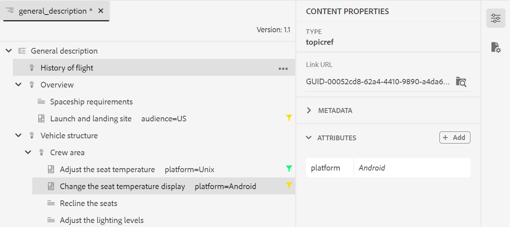

# Arbeiten mit dem erweiterten Map-Editor {#id1942D0S0IHS}

Der erweiterte Map-Editor verfügt über eine intuitive Benutzeroberfläche und ähnelt dem Web-Editor. Wenn Sie eine Zuordnungsdatei im Web-Editor öffnen, erhalten Sie eine Option, die Zuordnungsdatei mithilfe der Benutzeroberfläche des erweiterten Map-Editors zu bearbeiten. Der erweiterte Map-Editor ermöglicht das Hinzufügen von Themenverweisen, Schlüsselverweisen, die Strukturierung Ihres Inhalts und mehr.

Neben der direkten Bearbeitung von Zuordnungsdateien im Web-Editor können Sie auch Themendateien in einer Zuordnung zur Bearbeitung des Web-Editors öffnen. Dieses Thema führt Sie durch die Funktionen im erweiterten Map-Editor und wie Sie Dateien in einer DITA-Map im Web Editor öffnen und bearbeiten können.

## Hinzufügen von Themen zu einer Map-Datei

Führen Sie die folgenden Schritte aus, um Ihre Zuordnungsdatei mit dem erweiterten Zuordnungseditor zu erstellen:

1. Navigieren Sie in der Assets-Benutzeroberfläche zu der Zuordnungsdatei, die Sie bearbeiten möchten.

   >[!NOTE]
   >
   > Vergewissern Sie sich, dass Sie den Asset-Auswahlmodus nicht aktiviert haben.

1. Um eine exklusive Sperre für die Zuordnungsdatei zu erhalten, wählen Sie die Zuordnungsdatei aus und klicken Sie auf **Auschecken**.

   >[!NOTE]
   >
   > Sobald Sie eine exklusive Sperre für eine Map-Datei haben, können andere Benutzer die Karte nicht mehr bearbeiten. Sie können jedoch an den Themen in der Map-Datei arbeiten. Wenn Ihr Administrator Ihren Web Editor so konfiguriert hat, dass Dateien vor der Bearbeitung ausgecheckt werden, können Sie eine Datei erst bearbeiten, wenn Sie sie auschecken. Ebenso werden Sie bei entsprechender Konfiguration aufgefordert, alle ausgecheckten Dateien einzuchecken, bevor Sie sie schließen

1. Klicken Sie bei ausgewählter Zuordnungsdatei auf **Themen bearbeiten**.

   {width="800" align="left"}

   Sie können auch die Option **Themen bearbeiten** im Aktionsmenü der Zuordnungsdatei auswählen:

   {width="800" align="left"}

   Die Zuordnungsdatei wird im Web Editor zur Bearbeitung geöffnet.

1. Klicken Sie auf das Symbol **Bearbeiten**.

   {width="550" align="left"}

   Die Karte wird in der Benutzeroberfläche des erweiterten Map-Editors geöffnet. Wenn Sie eine neue Zuordnungsdatei geöffnet haben, wird nur der Titel der Zuordnung im Editor angezeigt.

   {width="800" align="left"}

   - **A** - \(*Hauptsymbolleiste*\): Dies ähnelt der Hauptsymbolleiste des Web-Editors. Weitere Informationen finden Sie unter [Hauptsymbolleiste](web-editor-features.md#id2051EA0G05Z) im Web-Editor.

   - **B** - \(*Sekundäre Symbolleiste*\) Dies ist die Sekundäre Symbolleiste, mit der Sie mit Zuordnungsdateien arbeiten können. Weitere Informationen zu den Funktionen, die über die Sekundäre Symbolleiste verfügbar sind, finden Sie unter [Funktionen, die in der Symbolleiste des erweiterten Map-Editors verfügbar sind](#id205DEC0005Z).

   - **C** - \(*Zuordnungsansichten*\): Ermöglicht es Ihnen, den Zuordnungs-Editor zwischen Layout, Autor, Source und Vorschau zu wechseln. Mit der Ansicht **Layout** können Sie die Themen in einer DITA-Zuordnung organisieren. Dadurch erhält der Baum oder die hierarchische Ansicht der Karte. Mit der Ansicht **Autor** können Sie die Themen im Map Editor bearbeiten. Dadurch erhalten Sie auch die WYSIWYG-Ansicht der Zuordnungsdatei. Mit der Ansicht **Source** können Sie mit der zugrunde liegenden XML der Zuordnungsdatei arbeiten. Die Vorschau bietet eine konsolidierte Ansicht aller Themen und Unterkarten innerhalb der Zuordnungsdatei. Der Link **Close** schließt die Zuordnungsdatei.

   - **D** - \(*Linkes Bedienfeld*\): Ermöglicht Zugriff auf das linke Bedienfeld, über das Sie auf die Funktionen Favoriten, Repository, Map, Gliederung und andere Funktionen zugreifen können. Sie können sie erweitern oder reduzieren, indem Sie auf das Symbol Seitenleiste erweitern klicken \(\). Weitere Informationen zu den im linken Bereich verfügbaren Funktionen finden Sie unter [Linker Bereich](web-editor-features.md#id2051EA0M0HS) im Web Editor.

   - **E** - \(*Middle Area*\): Zuordnungsinhaltsbearbeitungsbereich.

   - **F** - \(*Rechter Bereich*\): Ermöglicht Zugriff auf den Bereich &quot;Eigenschaften&quot;. Sie können die Inhaltseigenschaften und die Zuordnungseigenschaften des ausgewählten Themas oder der ausgewählten Zuordnung sehen. Weitere Informationen zu den in diesem Bedienfeld verfügbaren Funktionen finden Sie unter [Rechtes Bedienfeld](web-editor-features.md#id2051EB003YK) im Web Editor.

1. Wechseln Sie im linken Bereich zur Ansicht **Repository**.

1. Navigieren Sie im AEM-Repository zu dem Ordner, der die Themen oder Unterkarten enthält, die Sie hinzufügen möchten.

1. Wählen Sie das Thema oder die Zuordnungsdatei in der **Repository-Ansicht** aus und ziehen Sie sie per Drag-and-Drop in den Bearbeitungsbereich für den Inhalt der \(Mitte\) Zuordnung.

   Das Thema wird der Karte hinzugefügt.

   {width="800" align="left"}

1. Um nachfolgende Themen oder eine Unterzuordnung hinzuzufügen, ziehen Sie das Thema oder die Unterzuordnung per Drag-and-Drop an die gewünschte Position in der Zuordnung.

   Beachten Sie beim Erstellen Ihrer Zuordnungsdatei die folgenden Punkte:

   - Die Datei wird an einer Stelle hinzugefügt, an der die horizontale Leiste im Kartenbearbeitungsbereich angezeigt wird. Im folgenden Screenshot wird das Thema *Überblick* zwischen den Themen *Allgemeine Beschreibung* und *Launch und Landingpage* hinzugefügt.

     {width="350" align="left"}

   - Um ein Thema zu ersetzen, platzieren Sie das Thema oben, links oder rechts neben dem Thema, das Sie ersetzen möchten. Eine vertikale Leiste links oder rechts neben einem Thema zeigt an, dass es durch das Thema ersetzt wird, das darauf abgelegt wird.

     {width="550" align="left"}

     Bevor Sie ein Thema ersetzen, erhalten Sie jedoch eine Bestätigungsaufforderung. Das Thema wird erst nach der Bestätigung ersetzt.

     {width="300" align="left"}

   - Wenn Sie Ihrer DITA-Zuordnung eine Unterzuordnung hinzufügen, wird die Unterzuordnung als Link in der DITA-Zuordnung angezeigt. Um alle Themen der Unterzuordnung anzuzeigen, klicken Sie bei gedrückter Strg-Taste auf den Unterzuordnungslink. Der Inhalt der Unterkarte wird in einem neuen Tab angezeigt. Um ein Thema aus der DITA-Zuordnung zu öffnen, klicken Sie bei gedrückter Strg-Taste auf den Themenlink und öffnen Sie es auf der neuen Registerkarte.

   - Sie können die Tastenkombinationen Strg+Z und Strg+Y oder ihre jeweiligen Symbole in der Symbolleiste verwenden, um jede Änderung in der Zuordnung rückgängig zu machen oder wiederherzustellen.

   - Um die Position eines Themas zu ändern, wählen Sie das Thema \(durch Klicken auf das Themensymbol\) aus und ziehen Sie es per Drag-and-Drop an die gewünschte Position in der Map-Datei. Stellen Sie sicher, dass die horizontale Leiste an der Stelle sichtbar ist, an der Sie das Thema platzieren möchten. Im folgenden Screenshot wird das Thema *Launch und Landingpage* nach dem Thema *Überblick* verschoben.

     {width="350" align="left"}

   - Um die Eigenschaften Ihrer Zuordnungsdatei zu überprüfen, klicken Sie mit der rechten Maustaste auf eine beliebige Stelle im Zuordnungsbearbeitungsbereich und wählen Sie im Kontextmenü die Option **Eigenschaften** aus. Basierend auf Ihrer AEM können Sie Eigenschaften wie Metadaten, Aktivierung planen \(de\), Verweise, Dokumentstatus und mehr sehen.

1. Klicken Sie auf **Speichern**.

## In der Symbolleiste des Erweiterten Map-Editors verfügbare Funktionen {#id205DEC0005Z}

Die Symbolleiste im Editor für erweiterte Zuordnungen ähnelt dem Thema Web Editor. Die grundlegenden Vorgänge wie das Umschalten des linken Bedienfelds, das Speichern der Zuordnung, das Erstellen einer neuen Version der Zuordnung, das Rückgängigmachen/Wiederholen des letzten Vorgangs und das Löschen der ausgewählten Elemente sind in beiden Editoren üblich. Ausführliche Informationen zur Funktionsweise dieser Vorgänge finden Sie im Abschnitt [Funktionsweise des Web-Editors kennenlernen](web-editor-features.md#) .

Die folgenden zuordnungsspezifischen Vorgänge sind auch in der Symbolleiste in den Layoutansichten und Autorenansichten verfügbar:

## Layoutansicht {#id205DEC0005Z_layout_view}

Wenn Sie eine Karte zur Bearbeitung öffnen, wird die Layoutansicht des Map-Editors geöffnet. In der Layout-Ansicht wird die Zuordnungshierarchie in einer Baumansicht angezeigt, sodass Sie die Themen in einer Zuordnung organisieren können.

>[!NOTE]
>
> In der Ansicht &quot;Layout&quot;werden nur die in einer Zuordnung vorhandenen Verweise angezeigt. Wenn Verweise fehlen, wird links neben der Referenz ein kleines Kreuzsymbol angezeigt

Sie können die folgenden Aufgaben in der Ansicht &quot;Layout&quot;ausführen:

**Themenreferenz einfügen** - 

Zeigt das Dialogfeld &quot;Themensuche&quot;an. Navigieren Sie zur Themen-/Zuordnungsdatei, die Sie einfügen möchten, und klicken Sie auf Auswählen , um sie der Zuordnung hinzuzufügen.
{width="800" align="left"}

**Themengruppe einfügen** - 

Fügen Sie das Element `topicgroup` ein. Weitere Informationen zu Gruppierungsthemen finden Sie in der Dokumentation zu [topicgroup](https://docs.oasis-open.org/dita/v1.0/langspec/topicgroup.html) in der OASIS DITA-Sprachspezifikation.

**Schlüsseldefinition einfügen** - 

Zeigt das Dialogfeld Keydef einfügen an. Verwenden Sie dieses Dialogfeld, um eine beliebige Schlüsseldefinition zu definieren, die Sie in der Zuordnung verwenden möchten.

{width="300" align="left"}

**Einfügen vor/Einfügen nach** -  / 

Zeigt das Dialogfeld Element einfügen an. Wählen Sie das Element aus, das Sie in die Zuordnung einfügen möchten. Je nach Vorgang wird das neue Element vor oder nach dem aktuellen Element in die Zuordnung eingefügt.

**Vorne Frage einfügen** - 

Dieses Symbol wird angezeigt, wenn Sie eine Lesekarte zur Bearbeitung öffnen. Sie können Komponenten wie Inhaltsverzeichnisse, Indexe und Tabellen am Anfang des Buches einfügen.

**Rücken Matter einfügen** - 

Dieses Symbol wird angezeigt, wenn Sie eine Lesekarte zur Bearbeitung öffnen. Sie können Komponenten für ein Ende des Buches einfügen, z. B. einen Index, ein Glossar und eine Liste von Abbildungen.

**Verschieben des ausgewählten Elements nach links/rechts** -  / 

Klicken Sie auf den Pfeil nach links, um das Thema in der Hierarchie nach links zu verschieben. Dies fördert im Wesentlichen das jeweilige Thema auf einer Ebene in der Hierarchie. Wenn Sie beispielsweise auf den Pfeil nach links klicken, während ein untergeordnetes Thema ausgewählt ist, wird es zum gleichrangigen Thema. Wenn Sie auf den Pfeil nach rechts klicken, wird das Thema auf die rechte Seite verschoben, sodass es zum untergeordneten Element des Themas darüber wird.

**Verschieben des ausgewählten Elements nach oben/unten** - / 

Klicken Sie auf die Pfeilsymbole nach oben oder unten, um das Thema in der Hierarchie nach oben oder unten zu verschieben.

>[!NOTE]
>
> Sie können die Verweise auch per Drag &amp; Drop in eine Karte verschieben.

**Sperren/Entsperren** -  / 

Ruft eine Sperre in der Zuordnungsdatei ab und lässt die Sperre los. Wenn Sie nicht gespeicherte Änderungen in Ihrer Zuordnungsdatei haben, werden Sie zum Zeitpunkt der Freigabe der Sperre aufgefordert, die Zuordnungsdatei zu speichern. Die Änderungen werden in der aktuellen Version der Map-Datei gespeichert.

**Merge** - 

Weitere Informationen zum Zusammenführen von Inhalten aus einer anderen Version derselben oder einer anderen Datei finden Sie unter [Zusammenführen](web-editor-features.md#id205DF04E0HS) im Web Editor.

**Versionsverlauf** - 

Überprüfen Sie die verfügbaren Versionen und Beschriftungen für Ihr aktives Thema und stellen Sie im Editor selbst eine beliebige Version wieder her.

**Versionsbezeichnung** - 

Zeigt das Dialogfeld zur Verwaltung der Versionsbeschriftungen an. Wählen Sie eine Version aus der Dropdownliste aus. Wählen Sie die Bezeichnung aus, die Sie auf die ausgewählte Version anwenden möchten, und klicken Sie auf **Titel hinzufügen** , um sie hinzuzufügen.

**Anzeigeoptionen** - 

Zeigt eine Dropdown-Liste an, in der Sie die Option &quot;Zeilennummern anzeigen&quot;, &quot;Kontrollkästchen anzeigen&quot;und &quot;Dateinamen anzeigen&quot;wählen können.

- **Zeilennummern anzeigen**

Blendet die Zeilennummer für jedes Thema ein oder aus. Die Zeilennummern werden in Abhängigkeit von der Hierarchieebene angezeigt.

- **Kontrollkästchen anzeigen**

Blendet ein Kontrollkästchen für jedes Thema ein oder aus. Sie können das Kontrollkästchen verwenden, um das/die Thema(e\) auszuwählen und mithilfe des Menüs &quot;Optionen&quot;verschiedene Aufgaben auszuführen. Weitere Informationen finden Sie im Menü [Optionen](#id228ID8006H8) .

- **Dateinamen anzeigen**

Zeigt den Dateinamen der Titel der Themen an.

>[!NOTE]
>
> Wenn Sie den Mauszeiger über den Titel eines Themas bewegen, wird Ihnen der Dateipfad angezeigt.

**Themen basierend auf bedingten Filtern anzeigen** Wenn Sie Bedingungen auf ein Thema angewendet haben, wird rechts neben dem Thema ein Filtersymbol angezeigt. Wenn Sie den Mauszeiger über ein Filtersymbol bewegen, werden Ihnen die angewendete Bedingung und ihr Attributwert angezeigt.

**Menü &quot;Optionen&quot;in der Layoutansicht**

Neben der Organisation von Themen in der Map-Datei können Sie auch die folgenden Aktionen über das Menü Optionen durchführen, das für ein Element in der Layout-Ansicht verfügbar ist:

{width="650" align="left"}

- **Hinzufügen**: Sie können ein neues Thema oder einen leeren Verweis aus dem Map Editor hinzufügen:
   - **Leere Referenz**: Mit dieser Option können Sie in Ihrer DITA-Zuordnung eine leere Referenz hinzufügen. Sie können später auf den eingefügten leeren Verweis doppelklicken und die Themendetails hinzufügen. Weitere Informationen finden Sie unter [Thema erstellen](web-editor-features.md#id228ICI0105U) im Web Editor.
   - **Neues Thema**: Wenn Sie ein neues Thema aus dem Menü erstellen, erhalten Sie das Dialogfeld Neues Thema erstellen . Geben Sie im Dialogfeld Neues Thema erstellen die erforderlichen Details ein und klicken Sie auf Erstellen . Weitere Informationen finden Sie unter [Thema erstellen](web-editor-features.md#id228ICI0105U) im Web Editor.
- **Verschieben**: Sie können ein Thema in der Hierarchie nach oben/unten/rechts/links verschieben. Sie können auch ein Thema oder eine Zuordnung per Drag-and-Drop aus dem Repository-Bereich in die im Map Editor geöffnete Karte ziehen.
- **Rückgängig**: Rückgängig machen des letzten Vorgangs in der Layout-Ansicht.
- **Wiederholen**: Wiederholen Sie den letzten Vorgang in der Ansicht &quot;Layout&quot;.
- **Kopieren**: Kopieren Sie den ausgewählten Verweis aus der Zuordnungsdatei.

  >[!NOTE]
  >
  > Sie können die Kontrollkästchen anzeigen und dann auswählen, um mehrere Verweise zu kopieren.

- **Einfügen**: Fügen Sie die kopierten Verweise an der aktuellen Position in der Hierarchie ein.
- **Löschen**: Löschen Sie die ausgewählten Verweise aus der Zuordnungsdatei.

  >[!NOTE]
  >
  > Sie können die Kontrollkästchen anzeigen und dann auswählen, um mehrere Verweise zu löschen.

## Rechter Bereich im Map Editor

Im rechten Bereich werden die Inhaltseigenschaften und die Zuordnungseigenschaften in der Ansicht &quot;Layout&quot;des Map-Editors angezeigt.

**Inhaltseigenschaften**

Der Bereich &quot;Inhaltseigenschaften&quot;enthält Informationen zum Typ des aktuell ausgewählten Themas in der Zuordnung, zur Link-URL und zu den Attributen. Weitere Informationen finden Sie unter [Inhaltseigenschaften](web-editor-features.md#id228IDB00HMM) im Web-Editor.

- **Andere Attribute** Wenn Ihr Administrator ein Profil für Attribute erstellt hat, erhalten Sie diese Attribute zusammen mit den konfigurierten Werten. Im Bereich &quot;Inhaltseigenschaften&quot;können Sie diese Attribute auswählen und sie relevanten Inhalten in Ihrem Thema zuweisen. Sie können auch Attribute zuweisen, die von Ihrem Administrator auf der Registerkarte **Anzeigenattribute** in den Editor-Einstellungen konfiguriert wurden. Die für ein Element definierten Attribute werden im Layout und in der Gliederungsansicht angezeigt. Auf diese Weise können Sie sich alle Themen in einer Zuordnung, für die ein bestimmtes Attribut definiert ist, kurz ansehen. Beispielsweise alle Themen, für die das Plattformattribut als &quot;Android&quot;definiert ist.

  {width="650" align="left"}

  Weitere Informationen finden Sie unter *Attribute anzeigen* in der Funktionsbeschreibung *Editor Settings* im Abschnitt [Left Panel](web-editor-features.md#id2051EA0M0HS) .

- **Metadaten** Mithilfe der Metadaten können Sie die Metadateninformationen festlegen. Sie können den Navigationstitel, den Linktext, die Kurzbeschreibung und die Suchbegriffe definieren.

Weitere Informationen zu den standardmäßigen Themenattributen und Metadaten finden Sie in der Dokumentation zu [topicref](https://docs.oasis-open.org/dita/v1.2/os/spec/langref/topicref.html) in der OASIS DITA-Sprachspezifikation.

**Zuordnungseigenschaften**

Zeigt das Dialogfeld Zuordnungseigenschaften an, in dem Sie die Attribute und Metadateninformationen für die Zuordnung festlegen können.

## Autorenansicht {#id205DEC0005Z_author_view}

Mit der Ansicht **Autor** können Sie Ihre DITA-Zuordnung im Web Editor bearbeiten. Dies zeigt die WYSIWYG-Ansicht des Map-Editors und einige der in der Autorenansicht angezeigten Symbole sind mit der Layout-Ansicht identisch. Weitere Informationen finden Sie unter [Layout-Ansicht](#id205DEC0005Z_layout_view). Darüber hinaus können Sie die folgenden Symbole sehen und die entsprechenden Aufgaben in der Autorenansicht ausführen:

**Einfügen vor/Einfügen nach** -  / 

Zeigt das Dialogfeld Element einfügen an. Wählen Sie das Element aus, das Sie in die Zuordnung einfügen möchten. Je nach Vorgang wird das neue Element vor oder nach dem aktuellen Element in die Zuordnung eingefügt.

**Element einfügen** - 

Zeigt das Dialogfeld Element einfügen an. Wählen Sie das Element aus, das Sie einfügen möchten. Mit der Tastatur können Sie durch die Liste der Elemente blättern und die Eingabetaste drücken, um das gewünschte Element einzufügen. Alternativ können Sie direkt auf das Element klicken, um es in die Zuordnung einzufügen.

**Beziehungstabelle einfügen** - 

Fügt eine Beziehungstabelle in die Zuordnung ein. Da das Konzept der Arbeit mit der Beziehungstabelle mit dem im Abschnitt &quot;Grundlegender Map-Editor&quot;erläuterten Konzept übereinstimmt, finden Sie weitere Informationen unter [Arbeiten mit Beziehungstabellen im Grundlageneditor](map-editor-basic-map-editor.md#id1944B0I0COB) .

**Wiederverwendbaren Inhalt einfügen** - 

Zeigt das Dialogfeld Inhalt wiederverwenden an. Verwenden Sie dieses Dialogfeld, um den Inhalt, den Sie wiederverwenden möchten, in Ihre Zuordnung einzufügen.

**Navigationstitel-Attribut aktualisieren** - 

Synchronisiert das Element `title` einer referenzierten Datei in einer Zuordnung mit dem im Attribut `@navtitle` angegebenen Wert. Sie können verschiedene Arten von Referenzdateien zu einer Zuordnung hinzufügen, z. B. Themen-, Referenz-, Aufgaben-, \(Unter-)Maps usw. Die meisten dieser Dateien unterstützen das Attribut `@navtitle` . Wenn eine Datei das Attribut `@navtitle` enthält, wird das Attribut `@navtitle` für dieselbe Datei in der Zuordnung aktualisiert. Wenn das Attribut `@navtitle` nicht vorhanden ist, wird das Attribut `@navtitle` dieser Referenzdatei hinzugefügt und ihr `title` wird ebenfalls aktualisiert, um den Wert `@navtitle` anzuzeigen.

>[!NOTE]
>
> Ihr Administrator kann das automatische Hinzufügen des Attributs `@navtitle` zu jeder Referenzdatei konfigurieren, die Sie einer Zuordnung hinzufügen. Weitere Informationen zum Konfigurieren des automatischen Hinzufügens des Attributs `@navtitle` finden Sie unter *Standardmäßig @navtitle-Attribut einschließen* in Installieren und Konfigurieren von Adobe Experience Manager Guides as a Cloud Service.

Klicken Sie auf das Symbol Navigationstitel-Attribut aktualisieren , um die Werte der Attribute `title` und `@navtitle` zu synchronisieren.

**Tag-Ansicht ein/aus** - 

Blendet die XML-Tags ein oder aus. Die Tags dienen als visuelle Hinweise zur Begrenzung eines Elements. Wenn Sie in diesem Modus einen Thema-/Zuordnungsverweis einfügen möchten, ziehen Sie die gewünschte Datei vor oder nach dem Tag per Drag-and-Drop. Die horizontale Leiste wird im Modus Tags-Ansicht nicht angezeigt.

**Verfolgungsänderungen aktivieren/deaktivieren** - 

Sie können alle in der Zuordnungsdatei vorgenommenen Aktualisierungen verfolgen, indem Sie den Modus Änderungen verfolgen aktivieren. Nachdem Sie die Verfolgungsänderungen aktiviert haben, werden alle Einfügungen und Löschungen im Dokument erfasst. Weitere Informationen finden Sie unter [Tracking-Änderungen aktivieren/deaktivieren](web-editor-features.md#id205DF0203Y4) im Web Editor.

**Prüfungsaufgabe erstellen** - 

Sie können eine Prüfungsaufgabe des aktuellen Themas oder der Zuordnungsdatei direkt im Web-Editor erstellen. Öffnen Sie die Datei, für die Sie die Prüfungsaufgabe erstellen möchten, und klicken Sie auf Prüfungsaufgabe erstellen , um den Überprüfungserstellungsprozess zu starten. Befolgen Sie die Anweisungen in den [Prüfungsthemen oder -zuordnungen](review.md#) , um weitere Details zu erhalten.

## Themen über DITA-Map bearbeiten {#id17ACJ0F0FHS}

Die Bearbeitung eines einzelnen Themas gibt dem Autor keinen vollständigen Kontext. Ein Autor hätte keine Informationen darüber, wo ein Thema in einer DITA-Zuordnung platziert wird. Ohne diese kontextbezogenen Informationen wird es für Autoren ein wenig schwierig, Inhalte zu erstellen.

Mit AEM Guides können Autoren eine DITA-Map im Web Editor öffnen und die Platzierung von Themen in der Map anzeigen. Auf diese Weise können Autoren erkennen, wo genau das Thema in der Zuordnung platziert wird, und relevantere Inhalte erstellen. Wenn mehrere Autoren an einem Projekt arbeiten, können sie außerdem wissen, welche Themen in der Karte verfügbar sind, und Inhalte wiederverwenden, wo immer dies erforderlich ist.

Um Themen über eine DITA-Zuordnung zu bearbeiten, führen Sie die folgenden Schritte aus:

1. Navigieren Sie in der Assets-Benutzeroberfläche zu der DITA-Zuordnung, die die Themen enthält, die Sie bearbeiten möchten.
1. Klicken Sie auf die DITA-Karte, um sie in der DITA-Map-Konsole zu öffnen.
1. Wählen Sie die Registerkarte **Themen** aus, um eine Liste der in der DITA-Map verfügbaren Themen anzuzeigen.

   >[!TIP]
   >
   > Im Tab Themen können Sie die Zuordnungsdatei mit ihren abhängigen Elementen herunterladen. Weitere Informationen finden Sie unter [Exportieren einer DITA-Map-Datei](authoring-download-assets.md#id218UBA00IXA).

1. Klicken Sie in der Hauptsymbolleiste auf **Themen bearbeiten** .

   Die DITA-Zuordnung wird im Web-Editor geöffnet.

   >[!NOTE]
   >
   > Sie können auch die DITA-Zuordnungsdatei in der Assets-Benutzeroberfläche auswählen und in der Hauptsymbolleiste auf **Themen bearbeiten** klicken, um den Web Editor zu starten.

   {width="350" align="left"}

1. \(*Optional*\) Sie können auch ein Thema aus der Zuordnung auswählen und die Datei vor der Bearbeitung auschecken. Um die Datei\(en\) auszuchecken, wählen Sie mindestens eine Datei im linken Bereich aus und klicken Sie auf **Auschecken**. Sie können die Sperre auch für jede Datei freigeben, indem Sie die ausgecheckte Datei auswählen und in der Kartenansicht auf das Symbol **Auschecken abbrechen und Entsperren** klicken.

   >[!IMPORTANT]
   >
   > Wenn Ihr Administrator die Option **Bearbeitung ohne Checkout deaktivieren** konfiguriert hat, müssen Sie die Datei vor der Bearbeitung auschecken. Wenn Sie die Datei nicht auschecken, wird das Dokument im schreibgeschützten Modus im Editor geöffnet.

   Im folgenden Screenshot werden die Symbole für Auschecken und Sperren \(A\), Auschecken abbrechen und Entsperren \(B\), Als neue Version speichern und Entsperren \(C\), Bearbeiten \(D\), Vorschau \(E\), verschiedene Symbole mit verschiedenen DITA-Dateitypen \(F\) und Dateien, die ausgecheckt werden \(G\), hervorgehoben.

   {width="550" align="left"}

1. Klicken Sie auf einen beliebigen Themenlink, um ihn im Webeditor zur Bearbeitung zu öffnen.

   Sie können mehrere Themen im Editor öffnen und jedes Thema wird in einer neuen Registerkarte im Editor geöffnet. Selbst wenn Ihre DITA-Map Unterkarten enthält, werden Themen aus den Unterkarten auch in einer neuen Registerkarte zur Bearbeitung geöffnet. Wenn Sie die Themen unter einer Unterkarte anzeigen möchten, können Sie auf klicken und die Unterkarte erweitern.

   {width="800" align="left"}

   Wenn Sie auf eine Zuordnungsdatei klicken, wird die Zuordnung in einer neuen Registerkarte des Webbrowsers geöffnet.

1. Nachdem Sie die Bearbeitung der Themen abgeschlossen haben, haben Sie folgende Möglichkeiten:

   - Sie können sie einzeln speichern. Wenn Sie auf **Schließen ohne Speichern** klicken, werden Sie in einem Dialogfeld aufgefordert, die nicht gespeicherten Themen zu speichern:

     {width="550" align="left"}

     Sie können festlegen, dass alle ausgewählten Themen gespeichert werden, oder Sie können die Themen, die Sie nicht speichern möchten, deaktivieren.

   - Sie können das Thema mit der Schaltfläche **Als neue Version speichern und entsperren** einchecken. Wenn Sie eine Version des Themas speichern, wird eine neue Version erstellt und die Sperre wird ebenfalls freigegeben.

     Es wird empfohlen, die Änderungen zu speichern, bevor Sie die Dateien einchecken.  Wenn Sie die Änderungen speichern, wird die XML-Datei validiert.

   - Mit der Schaltfläche &quot;**Als neue Version speichern&quot;und &quot;Entsperren&quot;** können Sie auch mehrere Themen auswählen und einchecken. Wenn Sie eine Version der Themen speichern, wird für jedes Thema eine neue Version erstellt und die Sperre wird ebenfalls freigegeben. Sie können auch den Fortschritt der Überprüfung in den Themen im Dialogfeld **Als neue Version speichern und Entsperren** anzeigen. Beim Einchecken der Dateien wird eine Erfolgsmeldung angezeigt.

   - Wenn Ihr Administrator die Option zum Einchecken von Dateien beim Schließen aktiviert hat, wird Ihnen eine Eingabeaufforderung zum Speichern von Dateien angezeigt, sobald die ausgecheckten Dateien geschlossen werden. Wenn diese Option aktiviert ist, wird Ihnen beim Schließen des Editors mit geänderten Dateien die Liste der ausgecheckten Dateien angezeigt, die gespeichert werden müssen. Die ausgecheckten Dateien werden mit einem Sperrsymbol angezeigt:

     {width="550" align="left"}

      - Wenn Sie auf die Schaltfläche **Ohne Speichern schließen** klicken, werden die Dateien geschlossen, ohne die Änderungen zu speichern.

      - Durch Klicken auf die Schaltfläche **Speichern** werden die Änderungen gespeichert, die Dateien werden jedoch nicht eingecheckt.

      - Wenn Sie die Option **Überprüfen der Dateien** auswählen und dann auf die Schaltfläche **Speichern** klicken, werden die Dateien eincheckt \(erstellt eine andere Version\) und auch die Dateien gespeichert.

## Vorschau einer Landkarte

Zusätzlich zur Möglichkeit, die Position jeder Themendatei in einer Zuordnung zu sehen, ist es wünschenswert, den Zuordnungsinhalt in einem aufeinander folgenden Fluss zu sehen. Mit der Funktion &quot;Zuordnungsvorschau&quot;können Sie den gesamten Inhalt der Zuordnungsdatei mit einem Klick anzeigen. Sie müssen keine Ausgabe der Map-Datei generieren, um zu sehen, wie die gesamte Karte nach der Veröffentlichung aussehen wird. Sie können einfach auf die Vorschau der Karte zugreifen und alle Themen und Unterkarten werden in Form eines Buches gerendert.

Sie können auf die Vorschau einer Karte wie folgt zugreifen:

- **Assets UI**: Navigieren Sie in der Assets-Benutzeroberfläche zum Zuordnungsspeicherort, wählen Sie die Zuordnungsdatei aus und wählen Sie in der Symbolleiste **Zuordnungsvorschau** aus. Die Vorschau der Karte wird in einem neuen Tab angezeigt. Sie können den Inhalt aller Themen im Vorschaumodus anzeigen. In dieser Ansicht können Sie kein Thema bearbeiten.

  >[!NOTE]
  >
  > Wenn die Option *Vorschau der Karte* nicht in der Hauptsymbolleiste angezeigt wird, wurde sie möglicherweise unter das Symbolleistenmenü **Mehr** verschoben.

- **Erweiterter Map-Editor**: Klicken Sie im erweiterten Map-Editor auf das Symbol Vorschau , um die Vorschau der aktuellen Zuordnung anzuzeigen.

  {width="350" align="left"}

  Sie können die folgenden zusätzlichen Aufgaben im Vorschaumodus ausführen:

   - Klicken Sie mit der rechten Maustaste auf ein Thema und wählen Sie **Bearbeiten** aus, um das Thema zur Bearbeitung auf einer neuen Registerkarte zu öffnen.

     >[!NOTE]
     >
     > Wenn Sie keine Bearbeitungsrechte haben, wird das Thema im schreibgeschützten Modus geöffnet.

   - Springen Sie zum gewünschten Thema, indem Sie auf den Thementitel in der Zuordnungsstruktur klicken \(im linken Bereich\).

   - Das aktuelle Thema in der Zuordnungsvorschau wird ebenfalls in der Zuordnungsstruktur hervorgehoben.

**Übergeordnetes Thema:**[ Arbeiten mit dem Map-Editor](map-editor.md)
