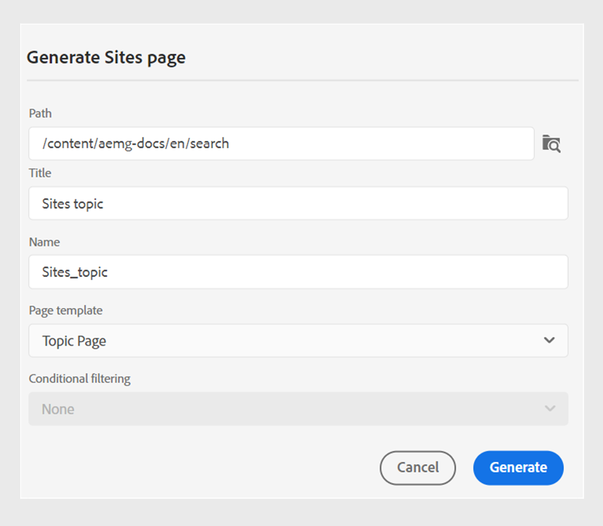

# Publish Adobe Experience Manager Sites-Seiten

Experience Manager Sites-Seite bezieht sich auf Inhalte, die auf der Adobe Experience Manager-Website veröffentlicht wurden. Mit Experience Manager Guides können Sie ein eigenständiges Thema auf einer Sites-Seite veröffentlichen.

Mit dieser Funktion können Sie ein Thema und seine Elemente veröffentlichen, ohne eine DITA-Zuordnung und die Ausgabevorgaben zu erstellen. Sie können das Thema einfach aktualisieren, die Sites-Seite erneut veröffentlichen und über verschiedene Web-Seiten hinweg wiederverwenden. Mit dieser Funktion können Sie mühelos eigenständige Artikel oder Marketing-Inhalte veröffentlichen.

Um eine Sites-Seite zu generieren, führen Sie die folgenden Schritte aus:

1. Wählen Sie **Neue Ausgabe**  aus dem Abschnitt **Ausgaben** in der **Dateieigenschaften** eines Themas aus.
1. Wählen Sie **Sites-Seite** aus.

1. Geben **im Dialogfeld &quot;** generieren“ die folgenden Details ein:
   {width="500" align="left"}

   *Fügen Sie Pfad, Titel, Namen und Vorlagendetails hinzu, um ein Thema oder seine Elemente als Sites-Seite zu veröffentlichen. *

   * **Pfad**: Durchsuchen und wählen Sie den Pfad des Ordners aus, in dem Sie die Sites-Seite veröffentlichen möchten.
   * **Titel**: Geben Sie den Titel der Sites-Seite ein. Standardmäßig wird der Titel mit dem Titel des Themas gefüllt. Sie können ihn bearbeiten. Dieser Titel wird verwendet, um den Namen der Sites-Seite zu generieren.
   * **Name**: Geben Sie den Namen der Sites-Seite ein. Standardmäßig wird der Name mit dem Thementitel ausgefüllt und nicht zulässige Zeichen wie Leerzeichen und Sonderzeichen werden durch „_“ ersetzt. Beispiel: *sample_sites_page*. Sie können ihn bearbeiten. Mit diesem Namen wird die URL für die Sites-Seite generiert.
   * **Seitenvorlage**: Wählen Sie die Seitenvorlage Sites aus, um Ihre Sites-Seite zu erstellen. Sie können die Vorlagen im Ordner unter dem ausgewählten Pfad anzeigen. Ihr Administrator kann auch benutzerdefinierte Vorlagen hochladen.

   * Sie können auch verschiedene Bedingungen zum Veröffentlichen des Inhalts auswählen.  Wählen Sie eine der folgenden Optionen aus:

      * **Keine**: Wählen Sie diese Option aus, wenn Sie keine Bedingung auf die veröffentlichte Ausgabe anwenden möchten.
      * **Verwenden von DITAVAL**: Wählen Sie die DITAVAL-Datei aus, um personalisierte Inhalte zu generieren. Sie können die DITAVAL-Datei über das Dialogfeld „Durchsuchen“ oder durch Eingabe des Dateipfads auswählen.
      * **Verwendung von Attributen**: Sie können Bedingungsattribute in Ihren DITA-Themen definieren. Wählen Sie dann das Bedingungsattribut aus, um den relevanten Inhalt zu veröffentlichen.

     >[!NOTE]
     > 
     >Bedingungen werden nur aktiviert, wenn im Thema Bedingungsattribute definiert sind.

1. Klicken Sie **Generieren**, um die Sites-Seite zu veröffentlichen.
1. Sie können die Sites-Seite für ein Thema unter dem Abschnitt **Ausgaben** im Abschnitt **Dateieigenschaften** anzeigen. Die Sites-Seiten werden nach dem Datum und der Uhrzeit ihrer Veröffentlichung angezeigt, wobei die neueste als erste angezeigt wird.

   {width=300 align=„left“}

   *Zeigen Sie die Sites-Seite für ein Thema an und veröffentlichen Sie sie erneut.*

Nachdem Sie die Sites-Seite veröffentlicht haben, können Sie sie auch auf jeder beliebigen Adobe Experience Manager-Site verwenden.

## Optionsmenü für eine Experience Manager Sites

Sie können auch die folgenden Aktionen für eine Experience Manager Sites über das Menü **Optionen** ausführen:

* **Generieren**: Veröffentlichen Sie die Sites-Seite erneut, um sie mit dem neuesten Inhalt aus dem DITA-Thema zu aktualisieren. Wenn Sie die Ausgabe neu generieren, ohne den Pfad, den Namen, den Titel, die Vorlage und die Bedingungen zu ändern, wird die Sites-Seite einfach mit dem neuesten Inhalt aktualisiert.

* **Duplizieren**: Duplizieren Sie eine Sites-Seite. Sie können den Pfad, den Namen, den Titel und die Vorlage ändern. Sie können auch andere Bedingungen auswählen, wenn Sie eine Sites-Seite duplizieren.

* **Entfernen**: Eine Sites-Seite aus der Ausgabeliste entfernen. Eine Bestätigungsaufforderung wird angezeigt. Sobald Sie bestätigen, wird die Sites-Seite aus der Liste **Ausgaben** entfernt. Die Sites-Seite wird jedoch nicht dauerhaft gelöscht.

* **Anzeigen**: Anzeigen des Sites-Seiteneditors. Sie können auch Änderungen vornehmen und speichern.
