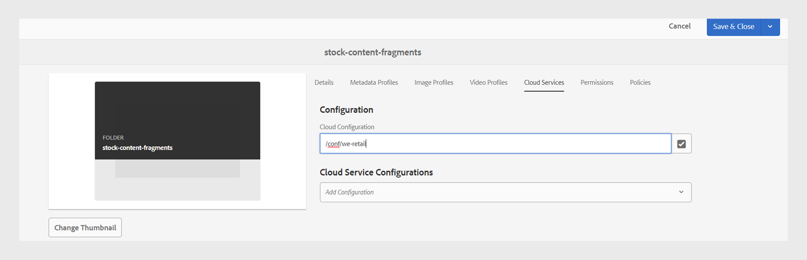

# Veröffentlichen von Inhaltsfragmenten

Inhaltsfragmente sind separate Inhaltsfragmente in Adobe Experience Manager. Sie sind strukturierte Inhalte, die auf einem Inhaltsmodell basieren. Inhaltsfragmente sind reine Inhalte ohne Design- oder Layoutinformationen. Sie können unabhängig von den von Adobe Experience Manager unterstützten Kanälen erstellt und verwaltet werden. Inhaltsfragmente sind modular, wobei Inhalte in kleinere Komponenten unterteilt werden.

Mit Experience Manager Guides können Sie ein Thema oder dessen Elemente in einem Inhaltsfragment veröffentlichen.

>[!NOTE]
>
>Sie können nur die Elemente in einem Thema auswählen, für die ein ID-Attribut definiert ist.

Gehen Sie wie folgt vor, um ein Inhaltsfragment zu erstellen:

1. Erstellen Sie ein [Inhaltsfragmentmodell](https://experienceleague.adobe.com/docs/experience-manager-65/assets/content-fragments/content-fragments-models.html?lang=de) in Adobe Experience Manager Assets.
1. Erstellen Sie einen Ordner, in dem Sie die Inhaltsfragmente speichern möchten, die Sie basierend auf dem Inhaltsfragmentmodell erstellen. Beispiel: &quot;stock-content-fragments&quot;.
1. Bearbeiten Sie die Eigenschaften des Ordners (z. B. &quot;stock-content-fragments&quot;) und fügen Sie den Pfad des Ordners hinzu, der das Inhaltsfragmentmodell in der Cloud-Konfiguration enthält.
Fügen Sie beispielsweise `/conf/we-retail` in der Cloud-Konfiguration hinzu. Diese Konfiguration verbindet alle Inhaltsfragmentmodelle mit dem Ordner .\
   {width="650" align="left"}
   *Fügen Sie die Cloud-Konfiguration in den Ordnereigenschaften hinzu, um sie mit den Fragmentmodellen zu verbinden.*

1. Um ein Inhaltsfragment zu generieren, wählen Sie **Neue Ausgabe**  aus dem Abschnitt **Ausgaben** in den **Dateieigenschaften** eines Themas.
1. Wählen Sie **Inhaltsfragment** aus.\
   Registerkarte ](./images/file-properties-outputs-tab.png) {width="300" align="left"} Optionen für Dateieigenschaften 
   *Fügen Sie die Filter Pfad, Name, Titel und Bedingung hinzu, um ein Thema oder seine Elemente als Inhaltsfragment zu veröffentlichen.*

   * **Pfad**: Durchsuchen Sie den Pfad des Ordners, in dem Sie das Inhaltsfragment veröffentlichen möchten, und wählen Sie ihn aus. Wenn Sie ein vorhandenes Inhaltsfragment auswählen, wird der Inhalt der zugeordneten Felder überschrieben.
   * **Titel**: Geben Sie den Titel des Inhaltsfragments ein. Standardmäßig wird der Titel mit dem Titel des Themas gefüllt. Sie können sie bearbeiten. Mit diesem Titel wird der Name des Inhaltsfragments generiert.
   * **Name**: Geben Sie den Namen des Inhaltsfragments ein. Standardmäßig wird der Name mit dem Titel des Themas ausgefüllt und die Leerzeichen werden durch &quot;_&quot;ersetzt. Beispiel: *sample_content_fragment*. Sie können sie bearbeiten.  Mit diesem Namen wird die URL für das Inhaltsfragment generiert.

   * Sie können verschiedene Bedingungen auswählen, um Inhaltsfragmentvarianten zu erstellen. Wählen Sie eine der folgenden Optionen aus:
     >[!NOTE]
     > 
     > Bedingungen werden nur aktiviert, wenn im Thema Bedingungsattribute definiert sind.

      * **None**: Wählen Sie diese Option, wenn Sie keine Bedingung auf die veröffentlichte Ausgabe anwenden möchten.
      * **DITAVAL verwenden**: Wählen Sie die DITAVAL-Datei aus, um bestimmten Inhalt in die generierte Ausgabe einzuschließen oder auszuschließen. Sie können die DITAVAL-Datei über das Dialogfeld &quot;Durchsuchen&quot;oder durch Eingabe des Dateipfads auswählen.
      * **Verwenden von Attributen**: Sie können Bedingungsattribute in Ihren DITA-Themen definieren. Wählen Sie dann das Bedingungsattribut aus, um den relevanten Inhalt zu veröffentlichen.

   Registerkarte **Mapping**

   

   *Wählen Sie das Inhaltsfragmentmodell aus und fügen Sie die Zuordnungsdetails hinzu, um ein Thema oder seine Elemente als Inhaltsfragment zu veröffentlichen.*

   * **Modell**: Wählen Sie das Inhaltsfragmentmodell aus, das Sie zum Erstellen Ihres Inhaltsfragments verwenden möchten. Die Modelle werden aus dem Ordner ausgewählt, den Sie auf dem Experience Manager Guides-Server konfiguriert haben.
   * **Zuordnung**: Sie können die Themenelemente anzeigen, auf die ein ID-Attribut angewendet wurde. Ziehen Sie die Themenelemente in die Felder, die im Inhaltsfragmentmodell vorhanden sind.
Auf der rechten Seite werden die veröffentlichten Inhaltsfragmentinhalte im Fall eines vorhandenen Inhaltsfragments eingefügt. Diese können bei Bedarf mit den Themeninhalten überschrieben werden. Sie können auch **Rückgängig** auswählen, um die Zuordnungsänderungen wiederherzustellen.

     >[!NOTE]
     >
     > Wenn Sie Version 4.4 oder frühere Versionen verwenden, wählen Sie eine Zuordnung aus der Dropdown-Liste aus. Die Zuordnungen werden aus der Datei *contentFragmentMapping.json* ausgewählt.  Ihr Administrator kann die Zuordnungen zur Datei *contentFragmentMapping.json* hinzufügen. Weitere Informationen zum Erstellen einer Zuordnung zwischen einem Thema und einem Inhaltsfragment](../cs-install-guide/conf-content-fragment-mapping-cs.md) finden Sie im Installations- und Konfigurationshandbuch.[

1. Klicken Sie auf **Erzeugen** , um das Inhaltsfragment zu veröffentlichen.

1. Sie können die Inhaltsfragmente für ein Thema im Abschnitt **Ausgaben** in den **Dateieigenschaften** anzeigen.

   {width="300" align="left"}

   *Zeigen Sie die für ein Thema vorhandenen Inhaltsfragmente an und veröffentlichen Sie sie erneut.*

Nachdem Sie die Inhaltsfragmente veröffentlicht haben, können Sie sie auch auf jeder beliebigen Adobe Experience Manager-Site verwenden.

## Menü &quot;Optionen&quot;für ein Inhaltsfragment

Sie können auch die folgenden Aktionen für ein Inhaltsfragment über das Menü **Optionen** durchführen:

* **Generieren**: Veröffentlichen Sie das Inhaltsfragment erneut, um es mit dem neuesten Inhalt aus dem DITA-Thema zu aktualisieren. Wenn Sie die Ausgabe neu generieren, können Sie Pfad, Namen, Titel, Modell und Zuordnung des Inhaltsfragments ändern. Sie können auch verschiedene Bedingungen auswählen, während Sie die Ausgabe neu generieren.

* **Duplizieren**: Duplizieren Sie ein Inhaltsfragment. Sie können den Pfad, Namen, Titel, Modell und die Zuordnung ändern. Sie können beim Duplizieren eines Inhaltsfragments auch verschiedene Bedingungen auswählen, um eine Inhaltsfragmentvariante zu erstellen.

* **Entfernen**: Entfernt ein Inhaltsfragment aus der Ausgabeliste. Eine Bestätigungsaufforderung wird angezeigt. Nach der Bestätigung wird das Inhaltsfragment aus der Liste **Ausgaben** entfernt.

  >[!NOTE]
  >
  > Durch diese Aktion wird kein Inhalt aus dem Inhaltsfragment gelöscht.

* **Ansicht**: Zeigen Sie den Inhaltsfragment-Editor an. Sie können auch Änderungen vornehmen und speichern.

## Verbesserte Migration von Nicht-UUID-Inhalten zu UUID

Das neue UUID-Migrationsskript für Inhalte wurde erheblich optimiert, sodass die Inhaltsmigration von Nicht-UUID zu UUID 30-mal schneller ist als das vorherige Skript. Es enthält Funktionen wie die Wiederaufnahme von Tests an Checkpoints, Live-Einblicke, geschätzte Fertigstellungszeiten und detaillierte Berichte, die einen harmonischen Migrationsprozess gewährleisten. Der Migrationsprozess bewahrt insbesondere Asset-Metadaten ohne Änderungen auf. Das Skript wurde mit einem großen Datensatz mit 3 Millionen Assets getestet und überprüft, um seine Effizienz und Zuverlässigkeit bei umfangreichen Migrationen zu bestätigen.

Erfahren Sie mehr über die Migration von [Nicht-UUID-zu-UUID-Inhalten](../install-guide/migrate-non-uuid-uuid.md).