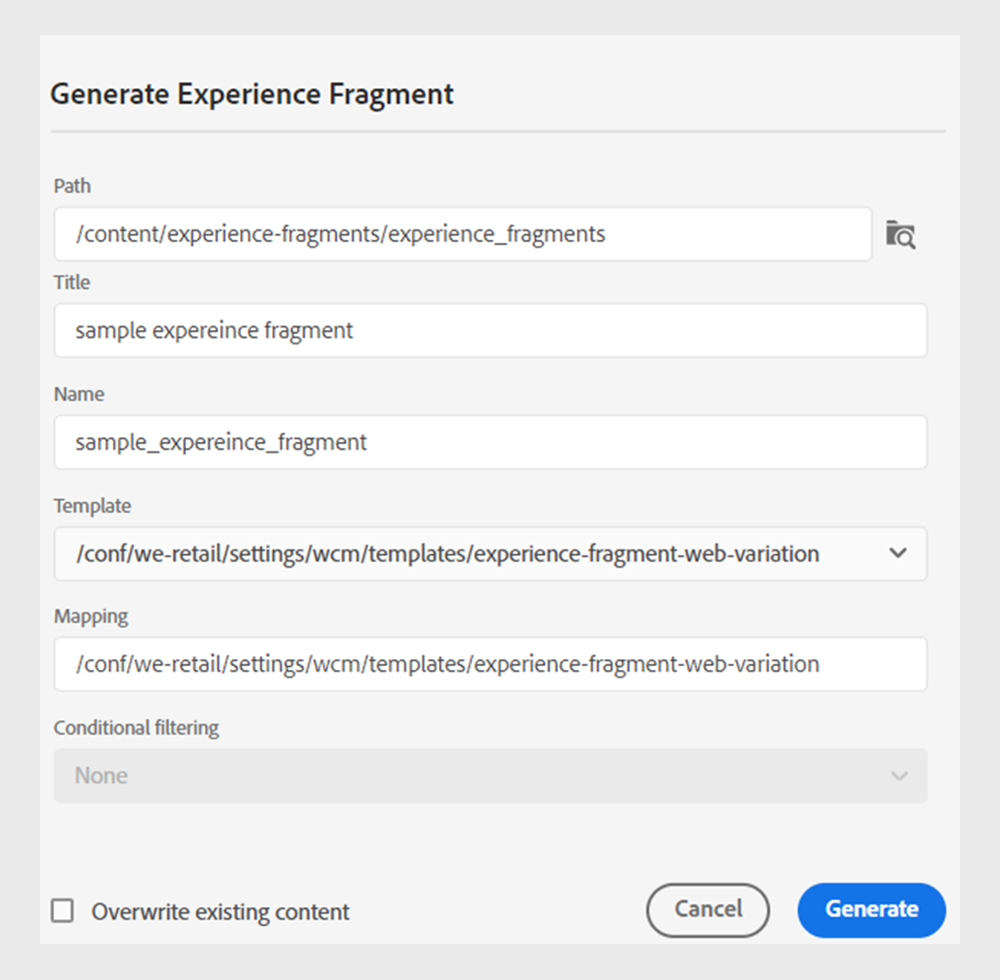

# Veröffentlichen von Experience Fragments

Experience Fragments are pieces of modular content in Adobe Experience Manager. These content blocks are based on templates and encapsulate both the content and its layout. These reusable pieces of content allow content creators to assemble and deliver consistent, scalable experiences across multiple channels that Experience Manager supports. This feature helps you easily create consistent marketing experiences efficiently, such as newsletters, promotion banners, and customer testimonials.

Experience Manager Guides allow you to publish a topic or its elements to an Experience Fragment. You can create a JSON-based mapping between a topic and its elements in an Experience Fragment. Then, use the mapping to publish a topic or its elements to an Experience Fragment. You can then use Experience Fragments in any Experience Manager Site or extract the details via APIs supported by Experience Fragments.

To generate an Experience Fragment, perform the following steps:

1. Create a folder in the Experience Fragments. Use this folder to save the Experience Fragments that you create based on the Experience Fragment templates. For example, *sales-experience-fragments*.
1. Select the folder and then select the **Properties** icon from the top.
1. Edit the folder&#39;s properties (for example, *sales-experience-fragments*).

   * **Title**: View or edit the title of the folder.

   * **Allowed Templates**: Contains the list of templates that can be added as child pages of the experiencefragment. To add the allowed template, specify the regular expression for retrieving the required templates in the **Allowed Templates** field.
Beispiel:
     `/libs/cq/experience-fragments/components/experiencefragment/template`

     If you do not define an allowed template for a folder, the templates are picked from the parent folder or the templates folder by default.
   * **Orderable**: Allows you to change the order of the assets inside a folder.
     {width="650" align="left"}
     *Add the cloud configuration in the folder properties to connect it with the fragment templates.*
1. Um ein Experience Fragment zu generieren, wählen Sie **Neue Ausgabe**  aus dem Abschnitt **Ausgaben** im Abschnitt **Dateieigenschaften** eines Themas aus.
1. Wählen Sie **Experience Fragment** aus.\
   {width="300" align="left"}

   *Ein neues Experience Fragment aus den Dateieigenschaften eines Themas hinzufügen*.

   >[!NOTE]
   >
   > Sie können ein Experience Fragment auch über die „Repository **Ansicht“**. Wählen Sie das Thema aus, das Sie als Experience Fragment veröffentlichen möchten. Wählen Sie dann im Menü **Optionen** die Option **Veröffentlichen als** > **Experience Fragment**.

1. Füllen Sie **Dialogfeld Experience Fragment** generieren die folgenden Details aus:
   {width="500" align="left"}

   *Fügen Sie den Pfad, die Vorlage und die Zuordnungsdetails hinzu, um ein Thema oder seine Elemente als Experience Fragment zu veröffentlichen. Sie können ein vorhandenes Experience Fragment überschreiben.*

   * **Path**: Durchsuchen Sie den Ordner und wählen Sie den Pfad aus, in dem Sie das Experience Fragment veröffentlichen möchten. Sie können auch ein vorhandenes Experience Fragment auswählen und erneut veröffentlichen.
   * **Titel**: Geben Sie den Titel des Experience Fragments ein. Standardmäßig wird der Titel mit dem Titel des Themas gefüllt. Sie können ihn bearbeiten. Dieser Titel wird verwendet, um den Namen des Experience Fragments zu generieren.
   * **Name**: Geben Sie den Namen des Experience Fragments ein. Standardmäßig wird der Name mit dem Titel des Themas gefüllt und die Leerzeichen werden durch „_“ ersetzt. Beispiel: *sample_experience_fragment*. Sie können ihn bearbeiten. Dieser Name wird verwendet, um die URL für das Experience Fragment zu generieren.
   * **Vorlage**: Wählen Sie die Experience Fragment-Vorlage aus, die Sie zum Erstellen Ihres Experience Fragments verwenden möchten. Die Vorlagen werden aus dem Ordner ausgewählt, den Sie in den Eigenschaften konfiguriert haben.
   * **Mapping**: Die Zuordnung wird aus der Datei *experienceFragmentMapping.json* ausgewählt und angezeigt.

     Ihr Administrator kann die Zuordnungen in der Datei *experienceFragmentMapping.json* hinzufügen.  Learn more about how to [create a mapping between a topic and an Experience Fragment](/help/product-guide/cs-install-guide/conf-experience-fragment-mapping-cs.md) in the Installation and Configuration Guide.

   * You can also select different conditions to publish the content.  Wählen Sie eine der folgenden Optionen aus:

      * **None**: Select this option if you don&#39;t want to apply any condition on the published output.
      * **Using DITAVAL**: Select the DITAVAL file to generate personalized content. You can select the DITAVAL file using the browse dialog or by typing the file path.
      * **Using attributes**: You can define condition attributes in your DITA topics. Then, select the condition attribute to publish the relevant content.

     >[!NOTE]
     > 
     >Conditions are enabled only if condition attributes are defined in the topic.

   * Select the **Overwrite existing content** checkbox if your Experience Fragment already exists and you wish to overwrite it. Experience Manager Guides displays an error if you don&#39;t select the checkbox and your Experience Fragment already exists.
1. Click **Generate** to publish the Experience Fragment.
1. You can view the Experience Fragments for a topic under the **Outputs** section in the **File Properties**. The Experience Fragments appear according to the date and time of their publishing, with the latest as the first.

   {width=300 align="left"}

   *View the Experience Fragments present for a topic and republish them.*

Once you&#39;ve published the Experience Fragments, you can also use them on any Adobe Experience Manager Site.

## Options menu for an Experience Fragment

You can also perform the following actions for an Experience Fragment from the **Options** menu:

* **Generate**: Republish the Experience Fragment to update it with the latest content from the DITA topic. When you regenerate the output, you cannot change the path, name, title, and template of the Experience Fragment. However, you can select different conditions while regenerating the output.

* **Duplicate**: Duplicate an Experience Fragment. You can change the path, name, title, and the template. You can also select different conditions when you duplicate an Experience Fragment.

* **Remove**: Remove an Experience Fragment from the outputs list. Eine Bestätigungsaufforderung wird angezeigt. Sobald Sie bestätigen, wird das Experience Fragment aus der Liste **Ausgaben** entfernt. Das Experience Fragment wird jedoch nicht aus dem Ordner gelöscht.

* **Anzeigen**: Anzeigen des Experience Fragment-Editors. Sie können auch Änderungen vornehmen und speichern.
