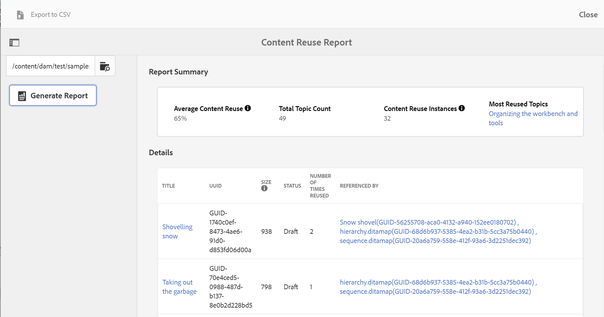

# Bericht zur Wiederverwendung von Inhalt {#id205BB900OQD}

<table style="border-collapse: collapse;">
  <tr>
    <td style="width:150px; white-space: nowrap;">Gilt für:</td>
    <td style="width:500px; white-space: nowrap;">Experience Manager Guides as a Cloud Service, Experience Manager Guides On-Premise</td>
  </tr>
  <tr>
    <td style="width:150px; white-space: nowrap;">Version:</td>
    <td style="width:500px; white-space: nowrap;">2025.11.0, 2025.12.0</td>
  </tr>
  <tr>
    <td style="width:150px; white-space: nowrap;">Version:</td>
    <td style="width:500px; white-space: nowrap;">4.6.0, 5.1.0</td>
  </tr>
</table>

Ein weiterer nützlicher Bericht, den Sie generieren können, ist der Bericht zur Wiederverwendung von Inhalten. Dieser Bericht berechnet den durchschnittlichen Prozentsatz der Inhaltsnutzung, was für Projekt-Manager und Geschäftsinhaber sehr nützlich ist, um die Menge der wiederverwendeten Inhalte zu sehen.

>[!TIP]
>
> Um das ordnungsgemäße Funktionieren des Berichts zur Wiederverwendung von Inhalten sicherzustellen, müssen Sie den Nachbearbeitungs-Workflow aktivieren. Wenden Sie sich an Ihren Systemadministrator, um Nachbearbeitungs-Workflows zu aktivieren.

Führen Sie die folgenden Schritte aus, um den Bericht zur Wiederverwendung von Inhalten anzuzeigen:

1. Klicken Sie oben auf den Adobe Experience Manager-Link und wählen Sie **Tools** aus.

1. Wählen Sie **Guides** aus der Liste der Tools aus.

1. Klicken Sie auf die **Bericht zur Wiederverwendung von Inhalten**.

1. Klicken Sie **Durchsuchen**, um einen Pfad auszuwählen, in dem sich Ihre Themen befinden, oder geben Sie den Pfad manuell ein.

   Der Bericht wird durch Überprüfen des Inhalts in den übergeordneten und allen untergeordneten Ordnern erstellt.

1. Klicken Sie **Bericht generieren**, um den Bericht zur Wiederverwendung von Inhalten abzurufen.

   {width="800" align="left"}

   Die Berichtseite ist in zwei Teile unterteilt:

   - **Berichtszusammenfassung:**

     Listet die durchschnittliche Wiederverwendung von Inhalten auf, die als Instanzen der Inhaltswiederverwendung/Gesamtzahl der Themen berechnet wird. Dieser Bericht berücksichtigt alle direkten Inhaltsreferenzen und Themenreferenzen der ersten Ebene für die Berechnung. Die Instanzen zur Wiederverwendung von Inhalten werden als Summe der Werte im Feld Anzahl der Wiederverwendungen berechnet. Das Thema, das am häufigsten wiederverwendet wird, wird auch in der Zusammenfassung des Berichts aufgeführt. Wenn Sie im am häufigsten wiederverwendeten Thema auf den Link zum Thema klicken, wird die Vorschau des Themas geöffnet.

   - **Details:**

     Der Abschnitt Details enthält die folgenden Spalten:

      - **Titel**: Der Titel des Themas. Wenn Sie auf den Link Titel des Themas klicken, wird die Themenvorschau geöffnet.

      - **UUID**: Die universell eindeutige Kennung \(UUID\) der Datei.

      - **size**: Dateigröße in Byte.

      - **Status**: Der aktuelle Status des Dokuments - Entwurf, In Überprüfung oder Überarbeitet.

      - **Häufigkeit der Wiederverwendung**: Gibt an, wie oft das entsprechende Thema wiederverwendet wurde. Dies wird als Summe der Einträge in den Spalten „Referenziert von“ minus 1 berechnet.

      - **Referenziert von**: Die Themen, in denen das entsprechende Thema referenziert wurde. Hier werden nur die direkten \(first level\)-Verweise berücksichtigt. Mehrere Themen werden durch Kommas getrennt. Die UUID der referenzierten Datei wird ebenfalls in Klammern aufgeführt. Wenn Sie auf den Titel-Link des Themas klicken, wird die Themenvorschau geöffnet.

>[!NOTE]
>
> Sie können auch den Bericht zur Wiederverwendung von Inhalten im CSV-Format exportieren. Klicken Sie dazu auf den Link In CSV exportieren in der linken oberen Ecke des Bildschirms und wählen Sie einen Speicherort für die CSV-Datei aus. Sie können diese CSV-Datei dann in einem beliebigen CSV-Editor öffnen.

**Übergeordnetes Thema:**[ Reports](reports-intro.md)
