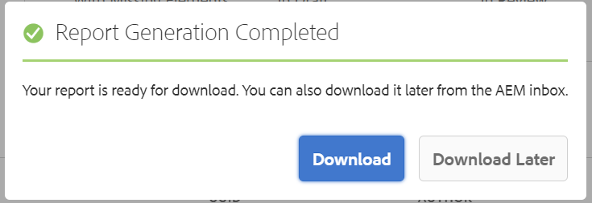

# DITA-Mapping-Bericht aus dem Mapping-Dashboard {#id205BB800EEN}

AEM Guides bietet Ihren Administratoren die Berichterstellungsfunktionen, mit denen sie die Gesamtintegrität der Dokumentation überprüfen können, bevor sie live geschaltet oder für Endbenutzer verfügbar gemacht wird. Der DITA-Map-Bericht aus dem Map-Dashboard in AEM Guides bietet wertvolle Informationen wie fehlende Themen, Themen mit fehlenden Elementen, UUID referenzierter Themen und Mediendateien sowie Prüfungsstatus der einzelnen Themen. Ein detaillierter Bericht auf Themenebene liefert auch inhaltsbezogene DITA-Informationen wie Inhaltsreferenzen und fehlende Bilder oder Querverweise.

>[!NOTE]
>
> AEM Guides aktualisiert diesen Bericht bei jedem Ereignis, das zu einer Änderung Ihrer Zuordnungsdatei führt oder bei dem ein Verweis in Ihrer Themendatei aktualisiert wird.

Führen Sie die folgenden Schritte aus, um den DITA Map-Bericht anzuzeigen:

1. Navigieren Sie in der Assets-Benutzeroberfläche zu der DITA-Map-Datei, für die Sie den Bericht anzeigen möchten, und klicken Sie darauf.

1. Klicken Sie auf **Berichte**.

   {width="800" align="left"}

   Die Seite Berichte ist in zwei Teile unterteilt:

   - **Themenzusammenfassung:**

     Führt die Zusammenfassung der ausgewählten Zuordnungsdatei auf. Wenn Sie sich die Zusammenfassung ansehen, können Sie schnell die Gesamtanzahl der Themen in der Karte, fehlende Themen, die Anzahl der Themen, die fehlende Elemente enthalten, den Status der Themen - In Entwurf, In Überprüfung oder Überprüfen.

   - **Details:**

     Wenn Sie auf ein Thema klicken, wird ein detaillierter Bericht des ausgewählten Themas angezeigt.

     {width="800" align="left"}

     Die unter **A**, **B**, **C** und **D** hervorgehobenen Elemente werden nachfolgend beschrieben:

      - **Thema**: Der Titel des Themas, das in der DITA-Zuordnung angegeben ist. Wenn Sie den Mauszeiger über den Titel des Themas bewegen, wird der vollständige Pfad des Themas angezeigt. Wenn es Probleme im Thema gibt, z. B. fehlende Verweise oder Bilder, wird vor dem Titel des Themas ein roter Punkt angezeigt.

      - **Dateiname**: Name der Datei.

      - **UUID**: Die universelle eindeutige Kennung \(UUID\) der Datei.

      - **Autor**: Benutzer, der zuletzt an diesem Thema gearbeitet hat.

      - **Dokumentenstatus**: Der aktuelle Status des Dokuments - Entwurf, In Überprüfung oder überprüft.

      - **Fehlende Themen \(B\)**: Wenn Themen mit fehlerhaften Verweisen vorhanden sind, werden diese Themen unter der Liste Fehlende Themen aufgeführt.

      - **Fehlende Elemente**: Listet die Anzahl fehlender Bilder oder beschädigter Querverweise auf, sofern vorhanden.

      - **Im Editor öffnen \(D\)**: Durch Klicken auf dieses Symbol wird das Thema im Web Editor geöffnet.

   Die unter **E** hervorgehobenen Elemente werden nachfolgend beschrieben:

   - **Multimedia**: Der Pfad der im Thema verwendeten Bilder wird zusammen mit seiner UUID angezeigt. Wenn Sie auf den Bildpfad klicken, wird das entsprechende Bild in einem Popup-Fenster geöffnet. Fehlerhafte Bildlinks werden rot angezeigt.

   - **Inhaltsreferenzen**: Der Pfad des Inhalts, auf den im Thema verwiesen wird, wird zusammen mit seiner UUID angezeigt. Wenn Sie auf den Titel des referenzierten Inhalts klicken, wird das entsprechende Thema im Vorschaumodus geöffnet.

   - **Querverweis**: Der Pfad des referenzierten Inhalts wird zusammen mit seiner UUID angezeigt. Wenn Sie auf den Titel des referenzierten Inhalts klicken, wird das entsprechende Thema im Vorschaumodus geöffnet. Fehlerhafte Querverweise werden rot angezeigt.

   - **Überprüfen**: Zeigt den Status der Prüfungsaufgabe des Themas an. Sie können den Status \(Öffnen oder Schließen\), das Fälligkeitsdatum und den Bevollmächtigten für das zu überprüfende Thema anzeigen. Wenn Sie auf den Themenlink klicken, wird das Thema im Überprüfungsmodus geöffnet.

   - **Verwendet in**: Zeigt eine Liste anderer Themen oder Zuordnungen an, in denen das Thema verwendet wird. Die UUID aller dieser Themen und Karten wird ebenfalls aufgelistet.

Neben dem Bericht für jedes einzelne Thema haben Administratoren auch Zugriff auf Informationen wie den Veröffentlichungsverlauf einer DITA-Map. Weitere Informationen zum Verlauf der generierten Ausgaben finden Sie unter [Status der Ausgabegenerierungsaufgabe anzeigen](generate-output-for-a-dita-map.md#viewing_output_history).

## CSV des DITA-Map-Berichts generieren

Sie können die CSV-Datei eines DITA-Map-Berichts herunterladen und exportieren. Die CSV-Datei enthält den detaillierten DITA-Zuordnungsbericht.

Führen Sie die folgenden Schritte aus, um die CSV-Datei eines DITA-Map-Berichts zu generieren:

1. Klicken Sie oben links auf **Bericht erzeugen** , um den DITA-Map-Bericht zu generieren.

   {width="800" align="left"}

1. Sie erhalten eine Benachrichtigung, sobald der Bericht heruntergeladen werden kann. Klicken Sie auf **Herunterladen** , um die CSV-Datei des erstellten Berichts herunterzuladen.

   {width="550" align="left"}

   Sie können die CSV-Datei des erstellten Berichts auch später aus dem AEM Benachrichtigungs-Posteingang herunterladen.

   Klicken Sie im Posteingang auf den erstellten Bericht, um den Bericht herunterzuladen.

   {width="300" align="left"}

Nachdem der Bericht im Posteingang heruntergeladen wurde, können Sie auch den Bericht auswählen und oben das Symbol Öffnen verwenden, um den ausgewählten Bericht zu öffnen.

**Übergeordnetes Thema:**[ Berichte](reports-intro.md)
