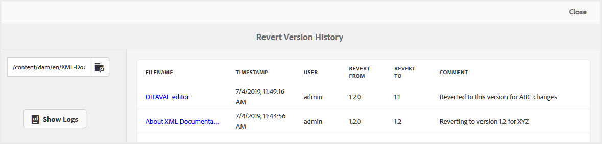

# Versionsverlaufsbericht für zurückgesetzte Dateien {#id205BBC00PRK}

Wenn Sie an mehreren gleichzeitigen Versionen zusammen mit mehreren Autoren arbeiten, müssen Ihre Inhalte mehrere Versionen haben. Es könnte einige gemeinsame Informationen in mehreren Versionen geben, die verschiedene Autoren in ihrem Projekt verwenden könnten. Bei solchen Arbeitsaufträgen könnten Autoren mehrere Versionen von Dateien erhalten. Bei diesen Versionen kann es sich einfach um eine neuere Version einer Datei oder um eine Wiederherstellung auf eine frühere Version handeln. Es ist eine komplexe Aufgabe, herauszufinden, wann und warum eine Datei zurückgesetzt wurde.

Mit AEM Guides können Sie einen Versionsverlaufsbericht für eine einzelne Datei oder für alle Dateien in einem Ordner generieren. Dieser Versionsverlauf bietet Ihnen eine konsolidierte Ansicht aller Versionen einer Datei, die zurückgesetzt wurden, und der Personen, die diese Versionen erstellt haben, sowie den Grund für die Erstellung dieser Versionen.

Sie können auf diesen Bericht an den folgenden Stellen zugreifen:

- **Benutzeroberfläche von Assets**: durch Auswahl einer Datei und Öffnen des **Versionsverlaufs** über die linke Leiste. Die **Versionsverlauf** enthält den Link **Versionslogs zurücksetzen** am unteren Rand des Bedienfelds. Wenn Sie auf diesen Link klicken, wird das Protokoll der ausgewählten Datei mit den zurückgesetzten Versionen angezeigt.

  {width="300" align="left"}

- **Themenvorschau**: Wenn Sie ein Thema in der Vorschau anzeigen, können Sie auch das Bedienfeld **Versionsverlauf** in der linken Leiste aufrufen. Es wird ein der Assets-Benutzeroberfläche ähnliches Bedienfeld angezeigt, von dem aus Sie auf den Link **Versionslogs zurücksetzen** klicken können, um auf den zurückgesetzten Versionsverlauf des aktiven Dokuments zuzugreifen.

- **Abschnitt „Tools“ von AEM**: Sie können auf diesen Bericht auch über den Abschnitt „Tools“ von AEM zugreifen. Im folgenden Verfahren wird erläutert, wie Sie im Abschnitt Tools von AEM auf den Versionsverlauf zurücksetzen können.

Führen Sie die folgenden Schritte aus, um auf den Bericht „Verlauf zurücksetzen“ zuzugreifen:

1. Klicken Sie oben auf den Adobe Experience Manager-Link und wählen Sie **Tools** aus.

1. Wählen Sie **Guides** aus der Liste der Tools aus.

1. Klicken Sie auf die Kachel **Versionsverlauf wiederherstellen**.

   Es wird eine leere Seite „Versionsverlauf zurücksetzen“ angezeigt, auf der Sie zu einer Datei oder einem Ordner navigieren und sie auswählen müssen, um den Bericht zu generieren.

1. Klicken Sie **Protokolle anzeigen**, um den Bericht für die ausgewählte Datei oder den ausgewählten Ordner zu generieren.

   {width="800" align="left"}

   Der Bericht enthält folgende Einzelheiten:

   - **Dateiname**: Der Titel des Themas. Wenn Sie auf den Link Titel des Themas klicken, wird die Themenvorschau geöffnet.

   - **Zeitstempel**: Datum und Uhrzeit, zu der das Thema auf eine frühere Version zurückgesetzt wurde.

   - **Benutzer**: Name des Benutzers, der auf eine frühere Version zurückgesetzt wurde.

   - **Wiederherstellen von**: Die ursprüngliche Versionsnummer der Datei, von der aus sie zurückgesetzt wurde.

   - **Wiederherstellen zu**: Die Version, auf die die Datei zurückgesetzt wurde.

   - **Kommentar**: Jeder Kommentar, der von der Person abgegeben wurde, die die Datei zurückgesetzt hat.

**Übergeordnetes Thema:**[ Reports](reports-intro.md)
