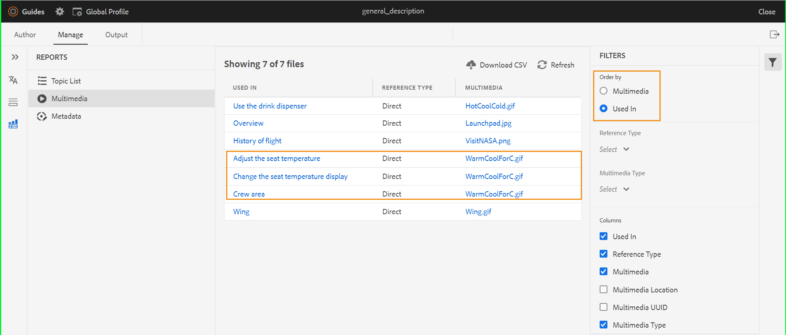

# DITA Map-Bericht über den Web-Editor {#id231HF0Z0NXA}

AEM Guides verfügt über eine Funktion im Web-Editor, mit der Sie die allgemeine Integrität Ihrer Verweise überprüfen und Berichte für sie generieren können.

Sie können die Themenliste, die Metadaten aller Verweise und die Multimedialiste für die aktuelle Zuordnung auf der Registerkarte **Berichte** im Web-Editor anzeigen.

## CSV aus der Themenlistenansicht generieren

Die **Themenliste** enthält detaillierte Informationen zu Ihren Themen, z. B. den Referenztyp, den Dokumentstatus und den Autor.

Sie können einen Bericht zu den Themen erstellen, indem Sie die folgenden Schritte ausführen:

1. Öffnen Sie **Bedienfeld** Repository“ die DITA-Zuordnungsdatei in der Zuordnungsansicht.
1. Klicken Sie auf die **Verwalten**.
1. Doppelklicken Sie auf **Themenliste** links. Die Liste der in der DITA-Karte vorhandenen Themen wird angezeigt.

   {width="800" align="left"}

1. Im Bedienfeld **Filter** können Sie Ihre Themen nach dem **Verweistyp** \(direkt oder indirekt\), **Dokumentstatus** \(dem aktuellen Status Ihrer Themen) filtern. Wenn sich Ihre Themen beispielsweise im Status Bearbeiten, In Überprüfung oder Überprüft befinden, werden diese aufgeführt\) oder der **Autor** des Themas.

1. Sie können auch die folgenden Themenfilteroptionen verwenden, um die folgenden Spalten in der Liste anzuzeigen:

   - **Thema** Der Titel des Themas wird in der DITA-Zuordnung angegeben. Sie können auf das Thema klicken, um es zu bearbeiten.
   - **Dateiname** Name der Datei.
   - **UUID** Die universell eindeutige Kennung \(UUID\) der Datei.
   - **Dateispeicherort** Der vollständige Pfad des Themas.
   - **Referenztyp** Der Referenztyp - direkt oder indirekt.
   - **Dokumentstatus** Der aktuelle Status des Themas.
   - **Autor** Der Benutzer, der zuletzt an dem Thema gearbeitet hat.
   - **Übergeordnete Zuordnung** Die Liste aller Zuordnungen, auf die das Thema direkt verwiesen wird.
   >[!NOTE]
   >
   > Klicken Sie **Aktualisieren**, um eine neue Themenliste zu erhalten und Änderungen in Ihrer Zuordnungsdatei oder Verweise in Ihrer Themendatei anzuzeigen.

1. Klicken Sie **CSV herunterladen**, um den aktuellen Schnappschuss der Themen in der DITA-Karte herunterzuladen. Die CSV-Datei enthält die ausgewählten Spalten und die in der Ansicht **Themenliste** gefilterten Themen. Sie können diese Themenlisten-CSV-Datei dann in einem beliebigen CSV-Editor öffnen.

**Metadaten stapelweise aus dem Metadatenbericht verwalten**

Mit AEM Guides können Sie DITA-Inhalte über den Web-Editor taggen. Sie können Tags auf ein einzelnes Thema anwenden oder die Bulk-Tagging-Funktion verwenden, um mehrere Tags auf mehrere Themen, eine DITA-Karte oder eine Unterzuordnung anzuwenden. Sie können auch den Dokumentstatus aller ausgewählten Themen in den nächstmöglichen allgemeinen Dokumentstatus ändern.

## Anzeigen von Metadaten

Führen Sie die folgenden Schritte aus, um die Metadaten Ihrer Verweise in der aktuellen DITA-Zuordnung anzuzeigen:

1. Öffnen Sie im Repository-Bereich die DITA-Zuordnungsdatei in der Zuordnungsansicht.
1. Klicken Sie auf die **Verwalten**.
1. Doppelklicken Sie auf **Metadaten** links. Die Metadatenliste aller Verweise in der DITA-Zuordnung wird angezeigt. Dazu gehören auch die Medienverweise.

   {width="800" align="left"}

1. Im Bedienfeld **Filter** können Sie Ihre Themen nach dem **Dokumentstatus** \(dem aktuellen Status Ihrer Themen) filtern. Wenn sich Ihre Themen beispielsweise im Status Bearbeiten, In-Überprüfung oder Überprüft befinden, werden diese aufgelistet\), **Verweise** \(direkt oder indirekt\), **Dateityp** \(Zuordnung, Thema und Bild\) der Referenz.
1. Sie können auch festlegen, dass nur die **Dateien ohne Tags“ angezeigt werden**, oder auch bestimmte Tags aus dem Filter **Tags** auswählen, um die zugehörigen Dateien anzuzeigen.
   1. Sie können auch die folgenden Themenfilteroptionen verwenden, um die folgenden Spalten in der Metadatenliste anzuzeigen:
      - **Titel** \(standardmäßig ausgewählt\) Der Titel der referenzierten Datei wird in der DITA-Zuordnung angegeben. Sie können auf die Datei klicken, um sie zu bearbeiten. Sie können auch auf eine Audio- oder Videodatei klicken und sie im Web-Editor wiedergeben. Sie können die Lautstärke oder die Ansicht des Videos ändern. Im Kontextmenü haben Sie außerdem die Möglichkeit, Bilder herunterzuladen, die Wiedergabegeschwindigkeit zu ändern oder sie in einem Bild anzuzeigen.

        >[!NOTE]
        >
        > Ein ausgechecktes Symbol wird auch neben dem Titel einer ausgecheckten Datei angezeigt. Sie können den Mauszeiger über das Symbol bewegen, um den Namen des Benutzers anzuzeigen.

      - **Dateiname** Der Name der Datei.
      - **Dateispeicherort** Der vollständige Pfad der Datei.
      - **Tags** \(standardmäßig ausgewählt\) Auf die Datei angewendete Tags.

        >[!NOTE]
        >
        > Standardmäßig können Sie zwei Tags für eine Datei anzeigen. Um weitere Tags anzuzeigen, klicken Sie auf **Mehr anzeigen**. Klicken Sie **Weniger anzeigen**, um die Liste erneut zu verkleinern.

      - **Referenztyp** Der Referenztyp - direkt oder indirekt
      - **Dokumentstatus** \(standardmäßig ausgewählt\) Der aktuelle Status der Referenzdatei.
      - **Dateityp** \(standardmäßig ausgewählt) Typ der Quelldatei. Die verfügbaren Optionen sind „Zuordnung“, „Thema“ und „Bild“.
      - **Ausgecheckt von** Der Benutzer, der die Datei ausgecheckt hat.
1. Klicken Sie **CSV herunterladen**, um den aktuellen Schnappschuss der Verweise in der DITA-Karte herunterzuladen. Die CSV-Datei enthält die ausgewählten Spalten und die in der Ansicht Themenliste gefilterten Verweise. Sie können diese Metadaten-CSV-Datei dann in einem beliebigen CSV-Editor öffnen.

**Aktualisieren von Metadaten**

1. Um Metadaten zu aktualisieren, wählen Sie die Dateien aus, für die Sie sie aktualisieren möchten.

   >[!NOTE]
   >
   > Sie können keine ausgecheckten Dateien auswählen. Ein ausgechecktes Symbol wird auch neben dem Titel einer ausgecheckten Datei angezeigt. Sie können den Mauszeiger über das Symbol bewegen, um den Namen des Benutzers anzuzeigen.

1. Wählen **oben** Verwalten“ aus.

   {width="350" align="left"}

1. Wenn Sie neue Tags hinzufügen möchten, wählen Sie in der Dropdown-Liste neue Tags aus, um sie auf alle ausgewählten Themen anzuwenden. Sie können auch jedes Tag löschen, indem Sie auf das Kreuz-Symbol neben dem Tag klicken.

   >[!NOTE]
   >
   > Die allgemeinen Tags, die auf alle ausgewählten Themen angewendet werden, werden aufgelistet.

1. Wählen Sie einen neuen Dokumentstatus aus, wenn Sie den Dokumentstatus aller ausgewählten Verweise ändern möchten. Die Dropdown-Liste zeigt den allgemeinen möglichen Status für alle ausgewählten Themen an. Wenn der aktuelle Status Ihrer Themen beispielsweise In Überprüfung ist, können Sie den Status Entwurf, Genehmigt oder Überprüft anzeigen.
1. Klicken Sie auf **Aktualisieren**, um die Metadaten zu aktualisieren. Für die Metadaten wird eine Bestätigungsmeldung angezeigt, unabhängig davon, ob sie erfolgreich aktualisiert wurden oder ob Aktualisierungen fehlgeschlagen sind. Sie können auch auf **Bericht herunterladen** klicken, um die Metadaten-CSV aus dem Bestätigungsdialogfeld herunterzuladen. Diese CSV-Datei enthält die Details des Aktualisierungsstatus für die ausgewählten Referenzen.

## Erstellen eines Multimedia-Berichts

Der **Multimedia** Bericht enthält detaillierte Informationen zu den in Ihrer Zuordnung verwendeten Multimedia-Dateien, wie z. B. den Titel, den Typ \(Audio, Video und Bilder\), die Dateien, in denen Multimedia verwendet wird, und den Referenztyp der Dateien, in denen sie verwendet wurden. Sie können auch die UUID und den Speicherort des Multimediums im Repository anzeigen. Sie können einen Bericht über die Multimedia-Inhalte erstellen, indem Sie die folgenden Schritte ausführen:

1. Öffnen Sie **Bedienfeld** Repository“ die DITA-Zuordnungsdatei in der Zuordnungsansicht.
1. Klicken Sie auf die **Verwalten**.
1. Doppelklicken Sie auf **Multimedia** links. Die Liste der in der DITA-Karte vorhandenen Multimedia-Inhalte wird angezeigt.
1. Im Bedienfeld **Filter** können Sie die Liste nach Multimedia oder nach den in Verweisen verwendeten Namen sortieren.

   - Wenn Sie nach **Multimedia** sortieren, wird der ****-Name des Multimediums in der ersten Spalte angezeigt und dann werden die Namen aller Verweise, in denen sie verwendet wurden, in einer anderen Spalte in derselben Zeile angezeigt. Der folgende Screenshot zeigt beispielsweise die Multimedia-Datei „WarmCoolForC.gif“ in der ersten Spalte und drei Verweise, in denen sie verwendet wird, werden in der dritten Spalte in derselben Zeile angezeigt.

     {width="650" align="left"}

   - Wenn Sie nach **Verwendet in** Spalte sortieren, sehen Sie die transponierte Ansicht, in der die Namen der Verweise, in denen Multimedia verwendet wurde, in der ersten Spalte aufgeführt sind, während die Multimedianamen in einer anderen Spalte in separaten Zeilen aufgeführt sind. Beispiel: Der folgende Screenshot zeigt die Namen von drei Verweisen \(Sitztemperatur anpassen, Sitztemperaturanzeige ändern und Besatzungsbereich\) in der ersten Spalte und die Multimedia-Datei WarmCoolForC.gif wird in der dritten Spalte in drei separaten Zeilen angezeigt.

     {width="650" align="left"}

1. Sie können Ihre Multimedia-Dateien nach **Multimediatyp** und **Verweistyp** filtern. Die Liste der Multimediadateien wird basierend auf Ihrer Auswahl in der Dropdown-Liste angezeigt. Beispielsweise können Sie festlegen, dass nur die Audioreferenzen in Ihrer DITA-Karte angezeigt werden sollen und dass eine Datei nur die darin verwendeten Audioreferenzen anzeigt.

   >[!NOTE]
   >
   > Je nach dem in Ihrer Zuordnung verwendeten Multimediatyp werden Bild, Video und Audio in der Dropdown-Liste **Multimediatyp** und Direkt oder Indirekt in der **Verweistyp** aufgeführt.

1. Sie können auch die folgenden Filteroptionen verwenden, um die folgenden Spalten in der Liste anzuzeigen:

   - **Multimedia** \(standardmäßig ausgewählt\) Der Titel des Multimediums wird in der DITA-Zuordnung angegeben. Sie können auf das Multimedia klicken, um es zu bearbeiten.
   - **Multimedia-Speicherort** Der vollständige Pfad des Multimedia-Elements.
   - **Multimedia-UUID** Die universell eindeutige Kennung \(UUID\) der Datei.
   - **Multimediatyp** \(standardmäßig ausgewählt) Typ des Multimediums. Die verfügbaren Optionen sind Audio, Video oder Bild.
   - **Verwendet in** \(standardmäßig ausgewählt\) Die Referenzen, in denen das Multimedia verwendet wurde. Sie können auf den Verweis klicken, um ihn zu bearbeiten.
   - **Referenztyp** \(standardmäßig ausgewählt\) Der Referenztyp - direkt oder indirekt.
   >[!NOTE]
   >
   > Klicken Sie **Aktualisieren**, um eine neue Multimedia-Liste zu erhalten und Änderungen in Ihrer Kartendatei oder Multimedia-Dateien in Ihrer DITA-Karte anzuzeigen.

1. Sie können auch auf eine Audio- oder Videodatei klicken und sie im Web-Editor wiedergeben. Sie können die Lautstärke oder die Ansicht des Videos ändern. Im Kontextmenü haben Sie außerdem die Möglichkeit, Bilder herunterzuladen, die Wiedergabegeschwindigkeit zu ändern oder sie in einem Bild anzuzeigen.

   {width="800" align="left"}

1. Klicken Sie **CSV herunterladen**, um den aktuellen Schnappschuss des Multimedias in der DITA-Karte herunterzuladen. Die CSV-Datei enthält die ausgewählten Spalten und die Multimedia-Dateien, die in der Ansicht **Multimedia** gefiltert wurden. Sie können diese Multimedia-CSV-Datei dann in einem beliebigen CSV-Editor öffnen.

## Anzeigen und Beheben der fehlerhaften Links{#report-broken-links}

Der **Beschädigte Links** ist ein nützlicher Bericht, der Ihnen die Details der beschädigten Links in Ihrer aktuellen Karte bereitstellt. Sie können die fehlerhaften Links anzeigen, die für DITA-Themen, Multimedia-Dateiverweise, Inhaltsschlüsselverweise usw. verwendet werden können. Sie haben auch die Möglichkeit, sie hier selbst zu reparieren.
Der Bericht enthält detaillierte Informationen wie den fehlerhaften Link, den Link-Typ, die Dateien, in denen der Verweis verwendet wird, und den Typ der Dateien, in denen sie verwendet wurden.
Sie können den Bericht nach fehlerhaften Links anzeigen, indem Sie die folgenden Schritte ausführen:
1. Öffnen Sie **Bedienfeld** Repository“ die DITA-Zuordnungsdatei in der Zuordnungsansicht.
1. Klicken Sie auf die **Verwalten**.
1. Doppelklicken Sie links **Beschädigte**). Die Liste der fehlerhaften Links oder Verweise, die in der DITA-Zuordnung vorhanden sind, wird angezeigt.
1. Im Bedienfeld **Filter** können Sie die Liste nach Links oder nach den in Verweisen verwendeten Namen sortieren.

   - Bei der Sortierung nach **Ungültiger Link** werden die Pfade der fehlerhaften Links in der ersten Spalte und anschließend die Namen aller Verweise, in denen sie verwendet wurden, in einer anderen Spalte in separaten Zeilen angezeigt. Wenn derselbe fehlerhafte Link in mehreren Dateien verwendet wird, werden sie in einer Zeile angezeigt und als gruppierte oder untergeordnete Zeilen angezeigt. Der folgende Screenshot zeigt beispielsweise drei fehlerhafte Links in der ersten Spalte und die Referenz, in der sie verwendet werden, `TestMap.ditamap` in der dritten Spalte in drei separaten Zeilen angezeigt wird.
   {width="800" align="left"}

   - Bei Sortierung nach Spalte **Verwendet in** wird die transponierte Ansicht angezeigt, in der die Namen der Verweise, in denen die fehlerhaften Links verwendet wurden, in der ersten Spalte aufgeführt sind, während die fehlerhaften Links in einer anderen Spalte in derselben Zeile aufgeführt sind. Der folgende Screenshot zeigt beispielsweise den Verweis (in dem der fehlerhafte Link verwendet wird) `TestMap.ditamap` in der ersten Spalte, während die fehlerhaften Links in der dritten Spalte in derselben Zeile angezeigt werden.
   {width="800" align="left"}
1. Sie können Ihre fehlerhaften Links nach den **Dateityp** und **Verknüpfungstyp** filtern. Die Liste der fehlerhaften Links wird je nach Auswahl in der Dropdown-Liste angezeigt. Beispielsweise können Sie festlegen, dass nur die Inhaltsreferenzen in Ihrer DITA-Karte angezeigt werden sollen und dass eine Datei nur die darin verwendeten Inhaltsreferenzen anzeigt.

   Je nach dem in Ihrer Zuordnung verwendeten Verweistyp werden Dateiverweis, Schlüsselverweis, Inhaltsreferenz, Inhaltsschlüsselverweis, Bildverweis und Multimedia-Dateiverweis in der Dropdown-Liste **Link-Typ** aufgeführt. **DITA-Thema** oder **DITA-** werden im Dropdown-Menü **Dateityp** aufgeführt.
1. Sie können auch die folgenden Filteroptionen verwenden, um die folgenden Spalten in der Liste anzuzeigen:

   - **Beschädigter Link** (standardmäßig ausgewählt) Der Pfad des beschädigten Links ist in der DITA-Zuordnung angegeben.

   - **Verknüpfungstyp** (standardmäßig ausgewählt) Der Typ der Links. Die verfügbaren Optionen sind Content Key Reference, Content Reference, DITA Topic, File Reference, Image Reference, Key Reference und Multimedia File Reference.

   - **Verwendet in** (standardmäßig ausgewählt) Die Referenzen, in denen der fehlerhafte Link verwendet wurde. Sie können auf den Verweis klicken, um ihn im Autorenmodus anzuzeigen.

   - **Dateityp** (standardmäßig ausgewählt) Der Referenztyp - DITA-Map oder DITA-Thema.
Klicken Sie **Aktualisieren** um eine neue Liste fehlerhafter Links zu erhalten und Änderungen in Ihrer Kartendatei anzuzeigen oder um festzustellen, ob ein fehlerhafter Link in Ihrer DITA-Karte aktualisiert wurde.
1. Sie können auf das Symbol **Link reparieren** () klicken, um den fehlerhaften Link zu beheben.

   >[!NOTE]
   >
   > Bewegen Sie den Mauszeiger über den Pfad des fehlerhaften Links unter der Spalte Beschädigter Link , um das Symbol Link reparieren () anzuzeigen.

   Sie können einen Link in beiden Ansichten reparieren - wenn Sie nach (fehlerhaften **) oder** Verwendet in **sortiert**.

   >[!NOTE]
   >
   > Wenn Sie einen fehlerhaften Link reparieren, während Sie nach fehlerhaften Links sortiert haben, wird der Link in allen Dateien korrigiert, in denen er verwendet wird (die in einer einzigen Zeile gruppiert sind).

1. Sie müssen die erforderlichen Referenzdetails im Dialogfeld **Link aktualisieren** aktualisieren. Welche Details im Dialogfeld **Link aktualisieren** erforderlich sind, hängt vom Referenztyp ab.\
   Nachdem Sie einen Link korrigiert haben, wird er nicht mehr unter der Liste der fehlerhaften Links angezeigt. Stattdessen können Sie sie unter der Themenliste oder den Metadaten anzeigen.

1. Klicken Sie **CSV herunterladen**, um den aktuellen Schnappschuss der fehlerhaften Links in der DITA-Karte herunterzuladen. Die CSV-Datei enthält die ausgewählten Spalten und die fehlerhaften Links, die in der Ansicht Beschädigte Links gefiltert wurden. Sie können diese CSV-Datei dann in einem beliebigen CSV-Editor öffnen und anzeigen.

**Übergeordnetes Thema:**[ Reports](reports-intro.md)
