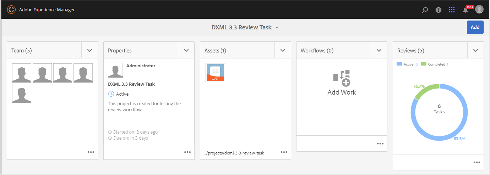
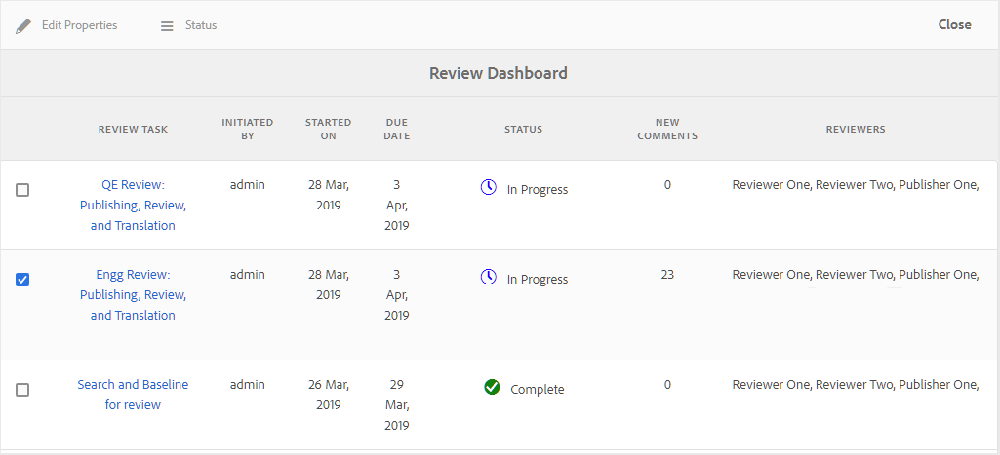
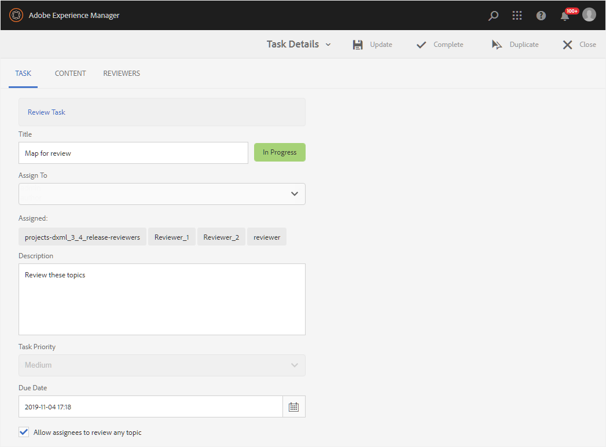
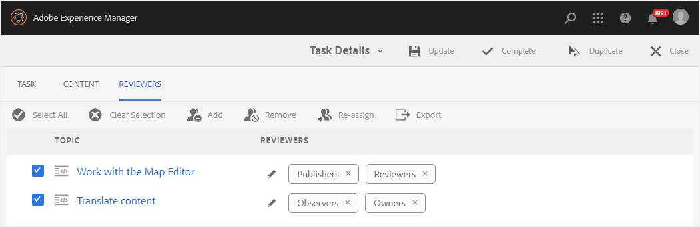
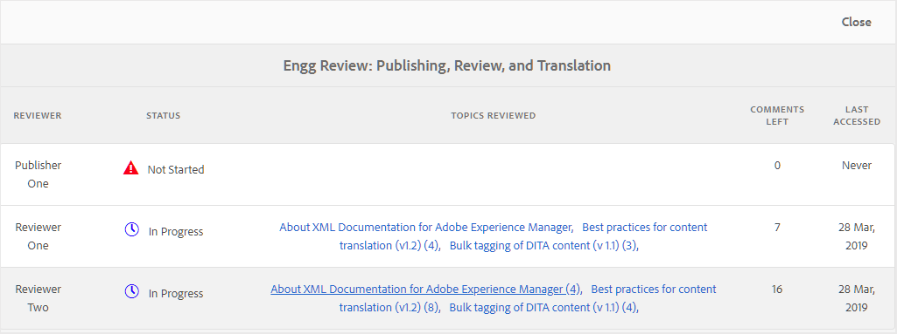

# Verwalten von Prüfungsaufgaben mithilfe des Überprüfungs-Dashboards {#id2056B0Y70X4}

Der Workflow zur Überprüfungsverwaltung kann eine Vielzahl von Aufgaben enthalten. Beispielsweise können Sie Reviewer für ein bestimmtes Thema hinzufügen oder die Frist für eine Überprüfung verlängern. Sie können die Prüfungsaufgabe auch als abgeschlossen markieren, wenn Sie der Meinung sind, dass alle Beteiligten ihr Feedback gegeben haben. Diese Aufgaben können über das Überprüfungs-Dashboard verwaltet werden.

Führen Sie die folgenden Schritte aus, um auf das Überprüfungs-Dashboard zuzugreifen und es zu verwenden:

>[!NOTE]
>
> Prüfungsaufgaben können nur für die Projekte verwaltet werden, für die Sie Autor \(oder Initiator\) sind. Selbst wenn Sie ein Reviewer oder Publisher (Benutzer\) sind, haben Sie keinen Zugriff auf eine der Projektaufgaben.

1. Klicken Sie in **Projekte**-Konsole auf das Überprüfungsprojekt, das Sie verwalten möchten.

   Ein Projektbedienfeld mit Aufgabenkacheln wird angezeigt.

   {width="800" align="left"}

1. Klicken Sie auf die drei Punkte in der Kachel **Reviews**.

   Das Überprüfungs-Dashboard wird angezeigt. Im Dashboard werden alle von Ihnen erstellten Prüfungsaufgaben aufgelistet.

   {width="800" align="left"}

   Im Überprüfungs-Dashboard werden Details zur Überprüfungsaufgabe angezeigt, z. B. Name der Aufgabe, wer die Überprüfung gestartet hat, Datum, an dem die Überprüfung gestartet wurde, Fälligkeitsdatum, Status, Anzahl neuer Kommentare, die vom Autor nicht akzeptiert oder abgelehnt wurden, und Name der Validierungsverantwortlichen. Die Aufgaben werden in der Reihenfolge der neu erstellten Aufgaben zu den älteren Aufgaben aufgelistet.

   >[!NOTE]
   >
   > Wenn Sie auf den Link Prüfungsaufgabe klicken, wird die zur Überprüfung gesendete Themen- oder Zuordnungsdatei geöffnet.

1. Eine Prüfungsaufgabe auswählen.

   In der Symbolleiste werden die Optionen Eigenschaften bearbeiten [Status](#check-review-status-id199RF0A0UHS) angezeigt.

1. Wenn Sie auf **Eigenschaften bearbeiten** klicken, wird die Seite mit den Aufgabendetails angezeigt.

   Auf der Seite „Aufgabendetails“ gibt es drei Registerkarten: „Aufgabe“, „Inhalt“ und „Prüfer“. In den folgenden Abschnitten werden die verschiedenen Funktionen erläutert, die auf den einzelnen Registerkarten verfügbar sind.

## Registerkarte „Aufgabe“

{width="800" align="left"}

Sie können die folgenden Aktionen auf der Registerkarte **Aufgabe** ausführen:

- Ändern Sie den Titel der Aufgabe im Feld **Titel** .
- Fügen Sie Standardbevollmächtigte in der Dropdown **Liste „Zuweisen an** hinzu. Die Reviewer, die Sie von hier hinzufügen, erhalten Zugriff, um alle Themen zu überprüfen, die Teil dieser Prüfungsaufgabe sind. Sie können auf der Registerkarte „Validierungsverantwortliche“ wählen, ob Sie zu bestimmten Themen [&#x200B; oder selektiv weitere Validierungsverantwortliche &#x200B;](#reviewer-tab-id199RF0N0MUI).
- Aktualisieren Sie die Beschreibung der Aufgabe im Feld **Beschreibung** .
- Ändern Sie das **Fälligkeitsdatum**. Sie können die Frist für den Abschluss der Aufgabe vorziehen oder verschieben.
- Wählen Sie die Option aus, um Benutzer darauf zu beschränken, nur die Themen anzusehen, die ihnen zugewiesen sind.
- Klicken Sie **Aktualisieren**, um die geänderten Details zu aktualisieren.
- Klicken Sie **Abschließen**, um die Prüfungsaufgabe vor dem Fälligkeitsdatum als abgeschlossen zu markieren. Wenn die Aufgabe eines einzelnen Themas als Abgeschlossen markiert ist, wird die Überprüfung des ausgewählten Themas abgeschlossen. Bei Themen, die über eine DITA-Zuordnung zur Überprüfung freigegeben wurden, wird durch Markierung der DITA-Zuordnungsaufgabe als abgeschlossen jedoch die Überprüfung aller Themen innerhalb der Zuordnung geschlossen, die zur Überprüfung freigegeben wurden.
- Klicken Sie **Duplizieren**, um eine Kopie der Prüfungsaufgabe zu erstellen. Der Prozess des Erstellens einer doppelten Prüfungsaufgabe ähnelt dem Erstellen einer neuen Prüfungsaufgabe. Nachdem Sie den Workflow für doppelte Aufgaben gestartet haben, wird die Seite Prüfungsaufgabe erstellen angezeigt. Sie müssen die neuen Aufgabendetails angeben, wie unter [Senden von Themen zur Überprüfung](review-send-topics-for-review.md#) beschrieben.

  Wenn Sie eine Prüfungsaufgabe ausgewählt haben, die aus einer DITA-Map erstellt wurde, werden die Themen angezeigt, die Teil der Map sind. Anschließend können Sie die Themen auswählen, die Sie in die neue Prüfungsaufgabe aufnehmen möchten.

  Im Falle einer Prüfungsaufgabe, die aus einem oder mehreren Prüfungsthemen dupliziert wurde, werden nur diese Themen in der Prüfungsaufgabenliste angezeigt. Sie können diese Themen zur Überprüfung für eine andere Gruppe von Validierungsverantwortlichen freigeben.

- Klicken Sie **Schließen**, um zur Seite „Posteingang“ zu wechseln.

## Registerkarte „Inhalt“

{width="800" align="left"}

Sie können die folgenden Aktionen auf der Registerkarte **Inhalt** ausführen:

- Ändern der Version des Themas, das zur Überprüfung gesendet wird. You can choose the latest version of the topic, version as on date, version with specific label, or version with a specific baseline \(for a DITA map\).

- Click **Update** to share the updated version of the topic with the reviewers. The reviewers get an email notification stating that the newer version of topic has been sent for review. The next time a reviewer opens the topic, they see the updated version of the topic.

  >[!NOTE]
  >
  > In case of an updated version of a topic, the old comments are retained in the newer version as well. Reviewers can also see the differences between the two versions.

- Klicken Sie **Abschließen**, um die Prüfungsaufgabe vor dem Fälligkeitsdatum als abgeschlossen zu markieren. Wenn die Aufgabe eines einzelnen Themas als Abgeschlossen markiert ist, wird die Überprüfung des ausgewählten Themas abgeschlossen. Bei Themen, die über eine DITA-Zuordnung zur Überprüfung freigegeben wurden, wird durch Markierung der DITA-Zuordnungsaufgabe als abgeschlossen jedoch die Überprüfung aller Themen innerhalb der Zuordnung geschlossen, die zur Überprüfung freigegeben wurden.

- Click **Duplicate** to create a new review task using the current task as the base.

## Reviewers tab {#reviewer-tab-id199RF0N0MUI}

{width="800" align="left"}

You can perform the following actions under the **Reviewers** tab:

- **Select All**: Selects all topics in the topic list. You can easily perform a batch operation after selecting all topics.
- **Clear Selection**: Deselects the topics selected in the topics list.

  >[!NOTE]
  >
  > You can also individually select or deselect a topic by clicking on the checkbox next to the topic.

- **Add**: Displays the Add Reviewers dialog. You can type the name of a reviewer or user role \(or group\) that you want to add as a reviewer to the selected topics.
- **Remove**: Displays the Remove Reviewers dialog. You can type the name of a reviewer or user role \(or group\) that you want to remove as reviewer from the selected topics.
- **Re-Assign**: Displays the Re-Assign Reviewers dialog. You can type the name of a reviewer or user role \(or group\) that you want to assign the review task to. This removes all existing reviewers from the selected topics and assigns the newly selected reviewers to those topics.
- **Export**: Allows you to export the review task details in a CSV file. The file contains details such as the path and title of the topic, name of reviewer, and version of topics sent for review.
- **Edit Reviewers**: Clicking the icon in the topic list displays the Edit Reviewers dialog. You can add or remove reviewers for the selected topic from this dialog.

## Check the status of a review task {#check-review-status-id199RF0A0UHS}

From the main Review Dashboard page, if you select a review task and click **Status**, the status report of the review task is shown:

{width="800" align="left"}

The status report for the review task contains the following details:

- Name\(s\) of the reviewer to whom the review task is assigned.
- The Status column indicates the review status. The Status could be one of the following:
   - **Not Started**: The reviewer has not yet opened the review link.
   - **In Progress**: The reviewer has opened the review link and is in the process of reviewing the topic.
   - **Complete**: The reviewer has completed the review by completing the review task assigned to them. The review task is in the AEM notification Inbox for each reviewer.
- When a reviewer opens a review link and navigates to a particular topic that topic is added to the Topics Reviewed list. This helps authors to determine if the reviewers had opened their respective sections or not. If any comments are given, those are shown in brackets.
- Total number of comments made on all topics. In case of multiple topics under review, the number of comments for each topic is mentioned \(in brackets\) against the topic name.
- The date when any topic was last accessed by the reviewer.

**Übergeordnetes Thema:**&#x200B;[&#x200B; Themen oder Karten überprüfen](review.md)
