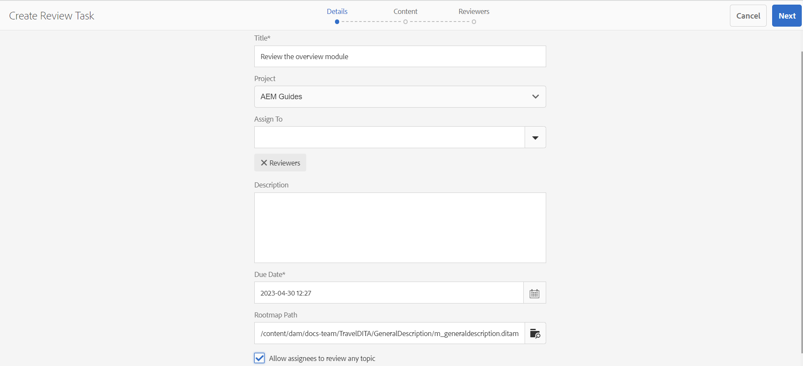
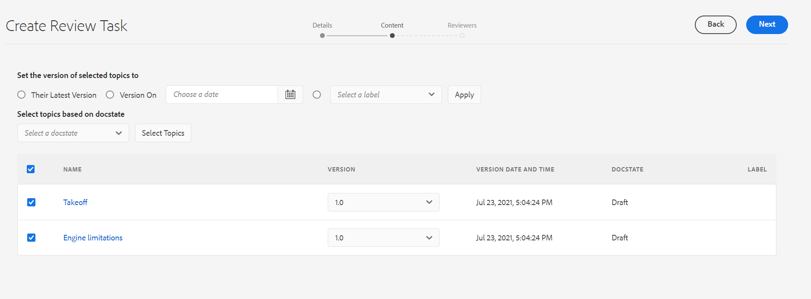
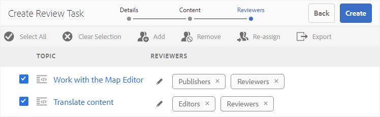
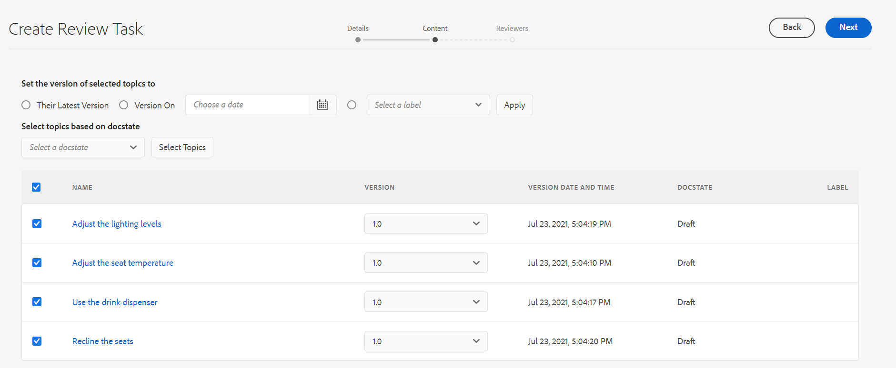

# Send topics for review {#id199RD0S035Z}

The review workflow creates a multi-reviewer environment wherein the initiator specifies a list of topics for review, add multiple reviewers, and assigns a timeline for the review task. AEM Guides allows users belonging to the Authors and Publishers groups to initiate a review.

As the review workflow is project-specific, the initiator of review must be a part of the project team or have rights to create a project. At the time of creating a project, you define the team members for the project and assign them various roles or groups. For more information about projects, see [Create a DITA project](authoring-create-dita-project.md#).

You can create a review task from:

- **Web Editor**: Allows you to send an individual topic or DITA map for review. Note that the workflow for creating a review task is common across the Web Editor and Assets UI. Only the method of launching the review workflow differs. For information about launching the review workflow from the Web Editor, see the [Create Review Task](web-editor-features.md#id215OCJ00JXA) feature in the Web Editor.

- **Assets UI**: Allows you to send one or multiple topics and DITA map for review. Sharing documents for review from Assets UI workflow is covered under this topic.

From the Assets UI, there are two ways in which an Author/Publisher can create a review task:

- Send one or more topics for review
- Send multiple topics from a DITA map for review

## Send one or more topics for review {#id1721E600FY4}

>[!IMPORTANT]
>
> Before you create a review task, ensure that you have created a project and added reviewers to that project.

To create a review task and send topics for review, perform the following steps:

>[!NOTE]
>
> You can create a review task only if you are an author or publisher in a DITA project.

1. Navigate to the required folder in the Assets UI.

1. Click the Select icon in the quick action and select the topics you want to send for review.

   {width="300" align="left"}

1. In the toolbar, click **Create Review Task**. The review task creation page is displayed.

   >[!NOTE]
   >
   > You can create a review task for only those topics that have a revision. In case the selected topic does not have a revision, you will be shown a prompt.

   {width="650" align="left"}

1. Enter a **Title** for the task and select a DITA **Project** from the drop-down list.

1. In the **Assign To** drop-down field, select the reviewers to whom you want to send the topics for review.

   You can assign a review task to individual users of the project or to user groups. Note that you can assign a review task to individual users only when you are a part of the project&#39;s administrator group, else you will only see the user groups in the Assign To field.

   >[!NOTE]
   >
   > Review workflow is project-specific. When you create projects, you add the team members to the project and assign them to groups. So when you select the project here, you get to choose the members who are a part of that project. For more information about projects, see [Create a DITA project](authoring-create-dita-project.md#).

1. Enter a **Description** for the task.

   This description is used as the body of the notification email sent to the reviewers.

1. Select the **Due Date** and time to mark the deadline for the review.

   >[!NOTE]
   >
   > On reaching the deadline, an email is sent to the initiator notifying that the review task has completed. The initiator can extend the deadline of the review task from the [Review Dashboard](review-manage-tasks-review-dashboard.md#).

1. Select the root map from the **Rootmap path**. This rootmap is used to resolve all the key references and glossary terms used in the review content. If you do not select the rootmap then the key references or glossary terms associated with the DITA topic, are not resolved before sending the topic for review.

   If you are creating the review for a DITA map, then by default **Rootmap path** is set to that map&#39;s path. If you are creating the review for a single or multiple topics, then by default the **Rootmap path** is set to the map defined in the User Preferences.

   >[!NOTE]
   >
   > The selected root map takes the highest precedence to resolve key references. For more details, see [Resolve key references](map-editor-other-features.md#id176GD01H05Z).

1. As you can assign different reviewers to different topics, **Allow Assignees to Review Any Topic** option controls whether reviewers can review all topics in a review task or only those topics that they are assigned to review.

   If you want to allow all reviewers to review any topic in the review task, select **Allow Assignees to Review Any Topic**.

   If you do not select this option then reviewers added in the **Assign To** field will have access to review only those topics that are assigned to them.

1. Klicken Sie auf **Weiter**.

   The Content page is displayed.

   {width="800" align="left"}

1. On the Content page, select a version of the topic that you want to share for review.

   You can use one of the following methods to select a version:

   - *\(Default\)* Choose the option **Their Latest Version** to select the last saved revision of the topics.
   - Choose the **Version On** option and specify the date and time to select a version as on the specified date and time. If there is no version of topic available on the specified date, then a version available immediately after the specified date and time is selected.
   - Choose the **Select a Label** option and select a label from the drop-down list.
1. After making your selection for choosing a version, click **Apply**.

   The version based on the selected option is chosen for the topics.

   >[!NOTE]
   >
   > You can also manually select the desired version from the **Version** drop-down list of each topic.

1. Klicken Sie auf **Weiter**.

   The Reviewers page is displayed wherein you can add or remove reviewers. By default, the reviewers added in the Assign To field are auto-added to each topic selected for the review.

   {width="650" align="left"}

1. On the Reviewers page, you can add or remove reviewers. The following operations are available on the Reviewers page:

   - **Select All**: Selects all topics in the topic list. You can easily perform a batch operation after selecting all topics.
   - **Clear Selection**: Deselects the topics selected in the topics list.

     >[!NOTE]
     >
     > You can also individually select or deselect a topic by clicking on the checkbox next to the topic.

   - **Add**: Displays the Add Reviewers dialog. You can type the name of a reviewer or user role \(or group\) that you want to add as a reviewer to the selected topics.
   - **Remove**: Displays the Remove Reviewers dialog. You can type the name of a reviewer or user role \(or group\) that you want to remove as reviewer from the selected topics.

     >[!NOTE]
     >
     > You can also remove a review from a topic by clicking the cross sign in the reviewer&#39;s box.

   - **Neu zuweisen**: Zeigt das Dialogfeld „Reviewer neu zuweisen“ an. Sie können den Namen eines Reviewers oder einer Benutzerrolle \(oder einer Gruppe\) eingeben, dem bzw. der die Überprüfungsaufgabe zugewiesen werden soll. Dadurch werden alle vorhandenen Reviewer aus den ausgewählten Themen entfernt und die neu ausgewählten Reviewer diesen Themen zugewiesen.
   - **Exportieren**: Ermöglicht den Export der Aufgabendetails für die Überprüfung in eine CSV-Datei. Die Datei enthält Details wie den Pfad und Titel des Themas, den Namen des Reviewers und die Version der Themen, die zur Überprüfung gesendet werden.
   - **Reviewer bearbeiten**: Wenn Sie in der Themenliste auf das Symbol klicken, wird das Dialogfeld „Reviewer bearbeiten“ angezeigt. Sie können Reviewer für ausgewählte Themen in diesem Dialogfeld hinzufügen oder entfernen.
1. Klicken Sie **Erstellen**, um die Prüfungsaufgabe zu erstellen.

   Eine Bestätigungsmeldung wird angezeigt, wenn die Prüfungsaufgabe erfolgreich erstellt wurde. Der [Dokumentstatus](web-editor-document-states.md#) für die zur Überprüfung gesendeten Themen wird auf „In Überprüfung“ festgelegt.

   >[!NOTE]
   >
   > Sie können auch oben rechts im Bildschirm auf Benachrichtigungsglocke klicken und bestätigen, dass die Prüfungsaufgabe erfolgreich erstellt wurde. Im Benachrichtigungsbereich finden Sie jeweils eine Benachrichtigung für die Reviewer, die Teil der Prüfungsaufgabe waren, und eine Benachrichtigung für den Initiator der Überprüfung.

Allen Reviewern wird eine E-Mail gesendet, in der sie darüber informiert werden, dass ihnen ein oder mehrere Themen zur Überprüfung zugewiesen wurden. Die E-Mail enthält einen direkten Link, auf den sie klicken und auf das Thema in einem Browser-Fenster zugreifen können.

Falls mehrere Themen zugewiesen sind, können die Reviewer sie in einer Dropdown-Liste mit Themen im Webbrowser anzeigen und auswählen.

## Senden mehrerer Themen zur Überprüfung von einer DITA-Karte

Eine DITA-Karte ist eine logische Organisation von Themen innerhalb eines Buches. Wenn Sie ein einzelnes Thema zur Überprüfung senden, erhält der Reviewer keine Informationen über die Position dieses Themas im Buch. Wenn ein Reviewer Informationen über den genauen Ort des zu überprüfenden Themas hat, erhält er einen besseren Kontext des zu überprüfenden Themas.

Mit AEM Guides können Sie ein oder mehrere Themen in einer DITA-Karte gleichzeitig zur Überprüfung senden. Der Reviewer erhält die vollständige Zuordnungsdatei zusammen mit Themen, die zur Überprüfung freigegeben wurden. Dadurch wird es für den Prüfer einfacher, einen Kontext des Themas in der Karten- oder Buchdatei zu erhalten.

Sie können dieselbe DITA-Zuordnung in zur Überprüfung in mehreren Prüfungsaufgaben freigeben. Beispiel: In einer DITA-Zuordnung gibt es Themen A, B, C, D und E. In einer Prüfungsaufgabe können Sie A, B und C zur Überprüfung freigeben und in einer anderen Prüfungsaufgabe können Sie die Themen C, D und E zur Überprüfung senden. Der Überprüfungsprozess ermöglicht die Freigabe desselben Themas und einer Zuordnungsdatei in mehreren Überprüfungsaufgaben. Für das allgemeine Thema in mehreren Prüfungsaufgaben überschreiben die Kommentare, die in einer Prüfungsaufgabe abgegeben werden, nicht die Kommentare in den anderen Prüfungsaufgaben und führen auch nicht mit diesen zusammen.

>[!IMPORTANT]
>
> Wenn ein Thema einer Zuordnungsdatei in mehreren Prüfungsaufgaben freigegeben wurde, wird sein Status In Überprüfung angezeigt, bis alle Prüfungsaufgaben abgeschlossen sind.

Um ein oder mehrere Themen zusammen mit der Zuordnungsdatei zur Überprüfung zu senden, führen Sie die folgenden Schritte aus:

>[!IMPORTANT]
>
> Nachdem Sie eine Überprüfung über eine Zuordnungsdatei initiiert haben, dürfen Sie die Struktur der Zuordnungsdatei nicht ändern, indem Sie neue Themen hinzufügen oder vorhandene Themen entfernen.

1. Navigieren Sie zum gewünschten Ordner in der Assets-Benutzeroberfläche.

   >[!NOTE]
   >
   > Stellen Sie sicher, dass die Ansicht der Konsole entweder auf Kartenansicht oder auf Listenansicht eingestellt ist.

1. Wählen Sie die Karte aus, von der aus Sie die Themen zur Überprüfung senden möchten.

1. Klicken Sie in der Symbolleiste auf **Prüfungsaufgabe erstellen**. Die Seite zur Erstellung der Prüfungsaufgabe wird angezeigt.

1. Geben Sie einen **Titel** für die Aufgabe ein und wählen Sie ein **Projekt** aus der Dropdown-Liste aus.

   >[!NOTE]
   >
   > Sie können eine Prüfungsaufgabe nur für Themen mit einer Revision erstellen. Falls Ihre Karte Themen enthält, die keine Revision haben, wird Ihnen eine Eingabeaufforderung mit einer Liste solcher Dateien angezeigt. Dateien ohne Revision sind von der Prüfungsaufgabe ausgeschlossen.

1. Wählen **in der Dropdown** Liste „Zuweisen an“ die Validierungsverantwortlichen aus, denen Sie die Themen zur Überprüfung senden möchten.

   Sie können einzelnen Benutzern des Projekts oder Benutzergruppen eine Prüfungsaufgabe zuweisen. Beachten Sie, dass Sie eine Prüfungsaufgabe nur dann einzelnen Benutzern zuweisen können, wenn Sie der Administratorgruppe des Projekts angehören. Andernfalls sehen Sie nur die Benutzergruppen im Feld Zuweisen an .

   >[!NOTE]
   >
   > Der Überprüfungs-Workflow ist projektspezifisch. Beim Erstellen von Projekten fügen Sie die Team-Mitglieder zum Projekt hinzu und weisen sie Gruppen zu. Wenn Sie also hier das Projekt auswählen, können Sie die Mitglieder auswählen, die Teil dieses Projekts sind. Weitere Informationen zu Projekten finden Sie unter [Erstellen eines DITA-Projekts](authoring-create-dita-project.md#).

1. Geben Sie eine **Beschreibung** für die Aufgabe ein.

   Diese Beschreibung wird als Text der Benachrichtigungs-E-Mail verwendet, die an die Validierungsverantwortlichen gesendet wird.

1. Wählen Sie das **Fälligkeitsdatum** und die Uhrzeit aus, um den Termin für die Überprüfung festzulegen.

   >[!NOTE]
   >
   > Bei Erreichen der Frist wird der Initiator per E-Mail darüber informiert, dass die Prüfungsaufgabe abgeschlossen ist. Der Initiator kann die Frist für die Prüfungsaufgabe über das [Überprüfungs-Dashboard“ &#x200B;](review-manage-tasks-review-dashboard.md#).

1. Da Sie verschiedenen Themen unterschiedliche Reviewer zuweisen können, steuert die Option **Zulassen, dass Verantwortliche jedes Thema überprüfen**, ob Reviewer alle Themen in einer Prüfungsaufgabe oder nur die Themen überprüfen können, denen sie zugewiesen sind.

   Wenn Sie allen Reviewern erlauben möchten, ein beliebiges Thema in der Prüfungsaufgabe zu überprüfen, wählen Sie **Zulassen, dass Verantwortliche ein beliebiges Thema überprüfen können**.

   Wenn Sie diese Option nicht auswählen, haben Prüfer, die im Feld **Zuweisen zu** hinzugefügt wurden, Zugriff, um nur die Themen zu überprüfen, die ihnen zugewiesen sind.

1. Klicken Sie auf **Weiter**.

   Die Inhaltsseite wird mit allen Themen angezeigt, auf die in der Zuordnungsdatei verwiesen wird. Wenn Ihre DITA-Karte verschachtelte Karten enthält, werden hier auch Themen aus den verschachtelten Karten aufgeführt.

   {width="800" align="left"}

1. Wählen Sie auf der Inhaltsseite eine Version des Themas aus, das Sie zur Überprüfung freigeben möchten.

   Sie können eine der folgenden Methoden verwenden, um eine Version auszuwählen:

   - *\(Standard\)* Wählen Sie die Option **Aktuelle Version**, um die zuletzt gespeicherte Revision der Themen auszuwählen.
   - Wählen Sie die Option **Version ein** und geben Sie das Datum und die Uhrzeit an, zu der eine Version gemäß dem Datum und der Uhrzeit ausgewählt werden soll. Wenn am angegebenen Datum keine Version des Themas verfügbar ist, wird eine Version ausgewählt, die unmittelbar nach dem angegebenen Datum und der angegebenen Uhrzeit verfügbar ist.
   - Wählen Sie die **Bezeichnung auswählen** und wählen Sie eine Bezeichnung aus der Dropdown-Liste aus. Alle Themen, die die ausgewählte Bezeichnung enthalten, werden in der Dropdown **Liste** Version) ausgewählt.
   - Wählen Sie die **Baseline auswählen** und wählen Sie eine Baseline aus der Dropdown-Liste aus. Alle Themenversionen, die Teil der ausgewählten Grundlinie sind, werden in der Dropdown-Liste **Version** ausgewählt.
1. Nachdem Sie eine Version ausgewählt haben, klicken Sie auf **Anwenden**.

   Die auf der ausgewählten Option basierende Version wird für die Themen ausgewählt.

   >[!NOTE]
   >
   > Sie können die gewünschte Version auch manuell aus der Dropdown-Liste **Version** jedes Themas auswählen.

1. Klicken Sie auf **Weiter**.

   Die Seite Reviewer wird angezeigt, auf der Sie Reviewer hinzufügen oder entfernen können. Standardmäßig werden die im Feld Zuweisen an hinzugefügten Reviewer automatisch zu jedem für die Überprüfung ausgewählten Thema hinzugefügt.

1. Auf der Seite „Validierungsverantwortliche“ können Sie Validierungsverantwortliche hinzufügen oder entfernen. Die folgenden Vorgänge sind auf der Seite Validierungsverantwortliche verfügbar:

   - **Alle auswählen**: Wählt alle Themen in der Themenliste aus. Nach Auswahl aller Themen können Sie ganz einfach einen Batch-Vorgang durchführen.
   - **Auswahl aufheben**: Hebt die Auswahl der Themen in der Themenliste auf.

     >[!NOTE]
     >
     > Sie können ein Thema auch einzeln auswählen oder die Auswahl aufheben, indem Sie auf das Kontrollkästchen neben dem Thema klicken.

   - **Hinzufügen**: Zeigt das Dialogfeld „Reviewer hinzufügen“ an. Sie können den Namen eines Reviewers oder einer Benutzerrolle \(oder einer Gruppe\) eingeben, den bzw. die Sie als Reviewer zu den ausgewählten Themen hinzufügen möchten.
   - **Entfernen**: Zeigt das Dialogfeld „Reviewer entfernen“ an. Sie können den Namen eines Reviewers oder einer Benutzerrolle \(oder einer Gruppe\) eingeben, den bzw. die Sie als Reviewer aus den ausgewählten Themen entfernen möchten.
   - **Neu zuweisen**: Zeigt das Dialogfeld „Reviewer neu zuweisen“ an. Sie können den Namen eines Reviewers oder einer Benutzerrolle \(oder einer Gruppe\) eingeben, dem bzw. der die Überprüfungsaufgabe zugewiesen werden soll. Dadurch werden alle vorhandenen Reviewer aus den ausgewählten Themen entfernt und die neu ausgewählten Reviewer diesen Themen zugewiesen.
   - **Exportieren**: Ermöglicht den Export der Aufgabendetails für die Überprüfung in eine CSV-Datei. Die Datei enthält Details wie den Pfad und Titel des Themas, den Namen des Reviewers und die Version der Themen, die zur Überprüfung gesendet werden.
   - **Reviewer bearbeiten**: Wenn Sie in der Themenliste auf das Symbol klicken, wird das Dialogfeld „Reviewer bearbeiten“ angezeigt. Sie können Reviewer für ausgewählte Themen in diesem Dialogfeld hinzufügen oder entfernen.
   >[!IMPORTANT]
   >
   > Sie müssen mindestens einen Validierungsverantwortlichen zuweisen, um die Prüfungsaufgabe zu erstellen.

1. Klicken Sie **Erstellen**, um die Prüfungsaufgabe zu erstellen.

   Eine Bestätigungsmeldung wird angezeigt, wenn die Prüfungsaufgabe erfolgreich erstellt wurde. Der [Dokumentstatus](web-editor-document-states.md#) für die zur Überprüfung gesendeten Themen wird auf „In Überprüfung“ festgelegt.

   >[!NOTE]
   >
   > Sie können auch oben rechts in der Benutzeroberfläche auf den Benachrichtigungsbereich klicken und bestätigen, dass die Aufgabe erfolgreich erstellt wurde. Im Benachrichtigungsbereich finden Sie jeweils eine Benachrichtigung für die Überprüfungen, die Teil der Prüfungsaufgabe waren, und eine Benachrichtigung für den Initiator der Überprüfung.

   >[!IMPORTANT]
   >
   > Nachdem Sie eine Überprüfung initiiert haben, dürfen Sie die DITA-Karte oder -Themen nicht an einen anderen Speicherort verschieben oder löschen. Dies führt zu einer Unterbrechung des Überprüfungsprozesses.

Alle validierungsverantwortlichen Personen werden per E-Mail darüber informiert, dass ihnen zu überprüfende Themen zugewiesen wurden. Die E-Mail enthält einen direkten Link, auf den sie klicken und auf das Thema in einem Browser-Fenster zugreifen können. Die Themen werden zusammen mit der DITA-Karte im Review-Modus geöffnet.

**Übergeordnetes Thema:**&#x200B;[&#x200B; Themen oder Karten überprüfen](review.md)
