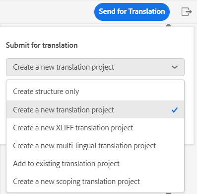

# Übersetzen von Dokumenten aus dem Web Editor {#id21BKF0Z0YZF}

>[!TIP]
>
> Es wird empfohlen, diese Übersetzungsfunktion im Web Editor zu verwenden, wenn Sie ein Upgrade auf AEM Guides as a Cloud Service Version vom Februar 2022 oder höher durchgeführt haben.

AEM Guides verfügt über eine leistungsstarke Funktion im Web Editor, mit der Sie Ihre Inhalte in mehrere Sprachen übersetzen können. Sie können ein neues Übersetzungsprojekt erstellen und die Übersetzungsaufträge später dem vorhandenen Übersetzungsprojekt hinzufügen. Sie können auch ein mehrsprachiges Übersetzungsprojekt erstellen, das Übersetzungsaufträge für alle ausgewählten Sprachen enthält.

>[!NOTE]
>
> Ihr Administrator kann die Registerkarte Verwalten \(für die Übersetzung verwendet\) im Web Editor konfigurieren. Weitere Informationen finden Sie unter *Konfigurieren der Übersetzungsfunktion im Web-Editor* im Abschnitt Installieren und Konfigurieren von Adobe Experience Manager Guides as a Cloud Service .

## Voraussetzungen

Stellen Sie vor dem Ausführen der Schritte in diesem Verfahren sicher, dass Sie den erforderlichen Sprachstamm und die Zielordner erstellt haben.

1. Erstellen Sie einen Stammordner zum Speichern des Quellinhalts. Der Stammordner muss mit dem Sprachnamen \(z. B. Englisch\) oder dem Sprachcode \(en\) erstellt werden.
1. Erstellen Sie die Zielordner, in die Sie den Inhalt übersetzen möchten. Wenn Sie beispielsweise Ihren Inhalt in Deutsch oder Französisch übersetzen möchten, müssen Sie einen Ordner mit dem Namen &quot;-de \(für Deutsch\)&quot;oder &quot;-fr \(für Französisch\)&quot;erstellen.

>[!NOTE]
>
> Der Stammordner und die Zielordner müssen auf derselben Ebene erstellt werden.

## Ein Übersetzungsprojekt erstellen

1. Öffnen Sie im Bedienfeld **Repository** die DITA-Zuordnungsdatei in der Zuordnungsansicht.
1. Klicken Sie auf die Registerkarte **Verwalten**. Im Bereich **Übersetzung** werden die verfügbaren Sprachgruppen angezeigt.

1. Als Benutzer können Sie die für Ihr Ordnerprofil konfigurierten Sprachgruppen anzeigen. Die Sprachgruppen zeigen die Sprachordner zusammen mit ihren Sprachcodes an. Beispielsweise enthält die Sprachgruppe G1 die Ordner Italienisch \(it\), Deutsch \(de\), Französisch \(fr\) und Englisch \(en\).

   {width="300" align="left"}

   *Wählen Sie die Sprachgruppen oder Sprachen aus, in die Sie Ihre Dokumente übersetzen möchten.*

   >[!IMPORTANT]
   >
   > Sie können nur die Sprachen auswählen und übersetzen, für die Sie den Zielordner parallel zur Ausgangssprache erstellt haben. Ein auf einer anderen Ebene erstellter Sprachordner, z. B. eine Ebene weiter ab dem Ordner für die Ausgangssprache, wird ebenfalls nicht angezeigt. Stellen Sie sicher, dass Sie alle Zielsprachordner auf derselben Ebene wie Ihren Ausgangssprachordner erstellen.

1. Sie können eine beliebige Sprachgruppe als Ziel für die Übersetzung auswählen. Wenn Sie **Alle auswählen**, werden die ausgewählten Dateien in alle verfügbaren Sprachen innerhalb der vorhandenen Sprachgruppen übersetzt.

   Die Option Sprachordner wird ausgegraut und zeigt ein Warnzeichen an:

   - Wenn der Zielordner für eine Sprache fehlt.
   - Wenn die Zielsprache mit der Quelle identisch ist.

   >[!NOTE]
   >
   > Wenn Sie den Zielordner für eine Sprache erstellen, nachdem Sie die Sprachgruppe erstellt haben, aktualisieren Sie den Browser, um die Sprache in den Sprachgruppen zu aktivieren.

1. Wenn Sie eine bestimmte Sprache auswählen, wird diese wie ausgewählt unter allen ausgewählten Sprachgruppen angezeigt. Wenn man also in eine Sprache übersetzt, wird es für alle Sprachgruppen auf einmal übersetzt. Wenn beispielsweise Deutsch sowohl in G1- als auch in G2-Sprachgruppen vorhanden ist, wird es für beide Sprachen ausgewählt.

1. Unter **Andere Sprachen** können Sie eine beliebige Sprache auswählen, für die Sie den Zielordner erstellt haben, die jedoch nicht zu einer Sprachgruppe gehört.

1. Sie können auch eine der folgenden Optionen auswählen, um Ihr Projekt zu übersetzen:

   **None** Wählen Sie diese Option, um die Standardversionen der Dateien zu übersetzen. Standardmäßig ist diese Option aktiviert.

   **Grundlinie verwenden:** Sie können eine Grundlinie auswählen, um Ihr Projekt zu übersetzen. Klicken Sie auf Grundlinie verwenden und wählen Sie eine auf der Karte erstellte Grundlinie aus. Alle Dateien, die Teil der ausgewählten Grundlinie sind, werden auf der Seite Übersetzung angezeigt. Sobald Ihr Inhalt übersetzt wurde, können Sie die übersetzte Grundlinie exportieren. Weitere Informationen zum Exportieren der übersetzten Grundlinie finden Sie unter [Exportieren der übersetzten Grundlinie](generate-output-use-baseline-for-publishing.md#id196SE600GHS).

   **Verwenden Sie die neueste Version wie auf**: Wählen Sie diese Option, um die Version der Themen nach Erstellungsdatum und -zeit zu filtern. Wenn Sie ein Datum und eine Uhrzeit auswählen, wird nur die neueste Version der Dateien angezeigt, die am oder vor dem ausgewählten Datum und der ausgewählten Uhrzeit erstellt wurden.

1. Klicken Sie auf **Anwenden**. Eine Liste mit Details zu Themen und zugehörigen Assets wird angezeigt.
1. Wählen Sie die Themen aus, die Sie zur Übersetzung senden möchten. Sie können auch die Themenfilteroptionen für die folgenden Spalten verwenden:

   - **Titel**: Titel der Quelldatei.  Bewegen Sie den Mauszeiger über den Titel der Quelldatei, um den Titel der Zieldatei oder der übersetzten Datei anzuzeigen.
   - **Dateiname**: Name der Quelldatei
   - **Dateityp**: Typ der Quelldatei. Die verfügbaren Optionen sind &quot;Zuordnung&quot;, &quot;Thema&quot;und &quot;Bild&quot;.
   - **Verweistyp**: Direkte oder indirekte Verweise
   - **Version**: Versionsnummer der Quelldatei
   - **Versionsbezeichnung**: Beschriftung für die ausgewählte Version der Quelldatei
   - **Zielversion**: Versionsnummer der Zieldatei
   - **Dokumentenstatus**: Status der Quelldatei. Die verfügbaren Optionen sind &quot;Entwurf&quot;, &quot;In-Review&quot;und &quot;Überprüfen&quot;.
   - **Zielsprache**: Die Sprache, in die Sie die Quelldatei übersetzen möchten
   - **Übersetzungsstatus**: Die verfügbaren Optionen sind: &quot;Nicht synchronisiert&quot;, &quot;Kopie fehlt&quot;, &quot;Wird ausgeführt&quot;und &quot;Synchronisiert&quot;.
   - **Zielbeschriftung**: Beschriftung für die ausgewählte Version der Zieldatei
1. Klicken Sie oben rechts auf **Zur Übersetzung senden** .

   {width="800" align="left"}

1. Wählen Sie im Dropdown-Menü **Neues Übersetzungsprojekt erstellen** aus.

   {width="350" align="left"}

   Neben einem neuen Übersetzungsprojekt können Sie auch aus den folgenden Optionen auswählen:

   - Sie können festlegen, dass nur **eine Struktur erstellen** für das Übersetzungsprojekt verwendet werden soll.
   - Sie können **Neues XLIFF-Übersetzungsprojekt erstellen** auswählen, um den XML-Inhalt in das XML Localization Interchange File Format (XLIFF) zu konvertieren. XLIFF ist ein offenes XML-basiertes Format, das verwendet wird, um die Datenübertragung zwischen verschiedenen Tools zu standardisieren, die im Prozess der Inhaltsübersetzung verwendet werden. AEM Guides unterstützt XLIFF-Version 1.2.
In einem XLIFF-Projekt wird der Inhalt in das XLIFF-Format des Branchenstandards exportiert, das Übersetzungsagenturen zur Verfügung gestellt werden kann. Das XLIFF-Format ermöglicht die potenzielle Wiederverwendung von Segmenten, die Sie bereits während der Übersetzungsphase übersetzt haben.\
     Nachdem der XLIFF-Inhalt übersetzt wurde, kann er in AEM Guides importiert werden und eine übersetzte Version des ursprünglichen DITA-Projekts erstellen.

     >[!NOTE]
     >
     > Der XLIFF-Export funktioniert nur mit der Konfiguration menschlicher Übersetzungen.

   - Sie können **Neues mehrsprachiges Übersetzungsprojekt erstellen** auswählen, das Übersetzungsaufträge für alle Sprachen enthält, die Sie für die Übersetzung ausgewählt haben. Wenn Sie beispielsweise Französisch, Deutsch und Spanisch ausgewählt haben, wird ein Projekt erstellt, das Übersetzungsaufträge für alle drei Sprachen enthält.
   - Wenn Sie bereits über ein Übersetzungsprojekt verfügen, können Sie diesem Projekt Themen hinzufügen. Wählen Sie in der Liste Projekt die Option Zu **vorhandenem Übersetzungsprojekt hinzufügen** aus und wählen Sie ein Projekt aus der Liste Vorhandenes Übersetzungsprojekt aus. Sie können diese Projekte nach der neuesten, aufsteigenden oder absteigenden Reihenfolge sortieren.

- Wenn Sie &quot;**Vorhandenes Übersetzungsprojekt**&quot;auswählen, aktualisiert dieser Vorgang den vorhandenen Asset-Eintrag im Projekt, wenn das Asset bereits hinzugefügt wurde und sich der zugehörige Übersetzungsauftragsstatus im Status &quot;*Entwurf*&quot;befindet.
   - Wenn die Zielsprache im Projekt nicht vorhanden ist, wird ein neues Projekt für das Übersetzungsprojekt mit einer Sprache erstellt und ein neuer Auftrag für mehrsprachige Übersetzungsprojekte erstellt.
   - Wenn der Auftrag bereits für die Zielsprache vorhanden ist und sich der Auftragsstatus nicht im Status &quot;*Entwurf*&quot;befindet, wird innerhalb desselben Projekts ein neuer Auftrag erstellt, um die Assets zur Übersetzung hinzuzufügen.

  >[!NOTE]
  >
  > Wenn es sich bei Ihrem vorhandenen Projekt um ein Scoping-Projekt handelt, ist in seinem Namen &quot;\(Scoping\)&quot;angehängt.

- Wenn Sie den Umfang für die Übersetzung eines Projekts erstellen müssen, können Sie **Neues Scoping-Übersetzungsprojekt erstellen** auswählen. Dadurch werden die Kopien nicht zur Übersetzung gesendet und der ursprüngliche Übersetzungsstatus der Dateien wird beibehalten. Die Zielsprachkopie der referenzierten Themen, die zum Scoping gesendet werden, hat keine Auswirkungen.
1. Geben Sie im Feld **Projekttitel** einen Namen für das Projekt ein.
1. Klicken Sie auf **Erstellen** , um ein neues Übersetzungsprojekt zu erstellen.

   Ein neues Übersetzungsprojekt wird mit der ausgewählten Version der Themen erstellt. Zu diesem Zeitpunkt wird eine Popup-Meldung angezeigt, die bestätigt, dass das Übersetzungsprojekt erstellt wurde. Sobald alle Zielsprachkopien im Übersetzungsprojekt verfügbar sind, erhalten Sie eine Benachrichtigung im Posteingang. Sobald die Zielsprachkopien im Übersetzungsprojekt verfügbar sind, können Sie den Übersetzungsauftrag starten. Weitere Informationen finden Sie unter [Starten des Übersetzungsauftrags](translation-first-time.md#id225IK030OE8).

   >[!NOTE]
   >
   > Wenn Sie die Übersetzung für ein oder mehrere Themen in einem Übersetzungsauftrag ablehnen, wird der Übersetzungsstatus **In Bearbeitung** aller abgelehnten Themen wieder auf den ursprünglichen Status zurückgesetzt. Der Status der referenzierten Themen wird überprüft und entsprechend dem aktuellen Übersetzungsstatus zurückgesetzt. Außerdem werden die im Zielprojekt erstellten Übersetzungsdateien nicht gelöscht, selbst wenn die Übersetzung für sie abgelehnt wurde.

## Übersetzungsregeln hinzufügen

Mit AEM Guides können Ihre Administratoren die Übersetzungsregeln konfigurieren. Das SRX-Format (Segmentation Rules eXchange) ist ein Standard für den Austausch von Segmentierungsregeln zwischen verschiedenen Benutzern und verschiedenen Übersetzungsumgebungen. Sie können einen Ordner erstellen und Ihre benutzerdefinierten SRX-Dateien hinzufügen.

SRX-Dateien sollten als `<language-code>.srx` benannt werden. Beispiel: en-US oder ar-AE.

>[!NOTE]
>Bei diesem Titel wird nicht zwischen Groß- und Kleinschreibung unterschieden, sodass Sie &quot;en-US&quot;, &quot;en-us&quot;oder &quot;EN-us&quot;haben können. Außerdem können AEM Hilfslinien &#39;-&#39; (Bindestrich) oder &#39;_&#39; (Unterstrich) auflösen. Sie können also &quot;en-US&quot;oder &quot;en_US&quot;haben.

Sie können diese Dateien auch in einen beliebigen Ordner unter AEM Asset-Stamm einfügen, der &quot;`./content/dam`&quot;lautet.

Nachdem Sie den Ordner erstellt haben, der die SRX-Dateien enthält, können Sie den Ordnerpfad in der Konfiguration des SRX-Speicherorts für Übersetzungen in Ihrem Ordnerprofil hinzufügen.

Es wird empfohlen, für eine bessere Leistung nur SRX-Dateien im Ordner zu belassen, der im Ordnerprofil konfiguriert ist.

AEM Guides wählt die SRX-Regeln entsprechend der Ausgangssprache des Übersetzungsprojekts aus. Es sucht nach einer benutzerdefinierten SRX-Datei für eine Sprache. Wenn Sie keine benutzerdefinierte SRX-Datei definieren, werden die Regeln gemäß den vordefinierten Übersetzungsregeln ausgewählt.

Weitere Informationen zum Einrichten von globalen Profilen und Profilen auf Ordnerebene finden Sie im Abschnitt *Bearbeitungsvorlagen konfigurieren* unter Installieren und Konfigurieren von Adobe Experience Manager Guides as a Cloud Service.

## Übergeben der Versionsbezeichnung an die Zielversion

Mit AEM Guides können Sie den Titel der Quelldatei an die Zieldatei übergeben. Auf diese Weise können Sie die Quellversion der übersetzten Datei leicht identifizieren.

Um die Beschriftung der Quellversion zur Zielkopie hinzuzufügen, muss der Systemadministrator die Option **Quellversionsbeschriftungen zur Zielversion weiterleiten** auf der Registerkarte **Übersetzung** in den **Editor-Einstellungen** auswählen.

Wenn Sie beispielsweise Quelldateien mit dem Versionstitel `Release 1.0` haben, können Sie auch den Quelltitel \(`Release 1.0`\) an die übersetzte Datei übergeben.

{width="650" align="left"}

>[!NOTE]
>
> Der Quelltitel wird nur an eine Zielversion angehängt. Wenn Sie die Quellbeschriftung in eine andere Version verschieben, wird sie automatisch in der neuesten Zielbeschriftung angezeigt.

## Versionsunterschied für nicht synchronisierte Dateien anzeigen 

AEM Guides bietet die Funktion, um die Unterschiede zwischen der ausgewählten Version und der zuletzt übersetzten Quellversion der Themen zu überprüfen. Sie können die **Nicht synchronisierten** Dateien anhand der vorgenommenen Änderungen übersetzen.

{width="650" align="left"}

Wählen Sie das Symbol &quot;**Unterschied anzeigen**\(\)&quot;für ein Thema aus, um die Unterschiede zwischen der zuletzt übersetzten Version und der aktuellen Version der ausgewählten Datei anzuzeigen.

>[!NOTE]
>
> Das Symbol &quot;**Unterschied anzeigen**&quot;\(\) wird nur für DITA-Dateien mit dem Übersetzungsstatus &quot;**Nicht synchronisiert&quot;** angezeigt.

Das Dialogfeld **Versionsunterschied** wird angezeigt. Es werden die Nummer **Zuletzt übersetzte Version** und die Nummer **Ausgewählte Version** auf der linken Seite angezeigt. Im Vorschaufenster werden die Unterschiede zwischen der zuletzt übersetzten Version und der ausgewählten Version des Themas angezeigt.

{width="650" align="left"}

## Nicht synchronisierte Assets schließen

Wenn Sie Änderungen an einigen Assets vornehmen, werden diese Assets nicht mehr synchronisiert. Sie können die geänderten Assets entweder erneut übersetzen oder den Status Nicht synchronisiert verwerfen auswählen. Wenn Sie beispielsweise einige sehr geringfügige Änderungen vorgenommen haben, die eigentlich keine Übersetzung benötigen, können Sie ihren Status auf In Sync markieren.

So schließen Sie den Status Nicht synchronisiert :

1. Wählen Sie die nicht synchronisierten Assets aus, für die Sie den Status ändern möchten.
1. Wählen Sie oben die Schaltfläche &quot;**In Sync markieren**&quot;\(\). Das Dialogfeld &quot;**In Sync markieren**&quot;wird angezeigt.

   {width="550" align="left"}

1. Klicken Sie auf **Synchronisierung erzwingen**. Für die ausgewählten nicht synchronisierten Assets wird der Status auf Synchronisiert gesetzt.

>[!NOTE]
>
> Die Schaltfläche &quot;**In Synchronisation markieren**&quot;\(\) wird nur für Assets angezeigt, deren Übersetzungsstatus &quot;Nicht synchronisiert&quot;lautet.

## In Bearbeitung befindliche Übersetzungsprojekte für eine Zuordnung oder ein Thema anzeigen

Einige Verweise auf Ihr Übersetzungs-Dashboard befinden sich möglicherweise in Bearbeitung. Diese Verweise haben einen Link **In Bearbeitung** unter der Spalte **Übersetzungsstatus** . Wenn Sie auf den Link klicken, wird das Dialogfeld &quot;**In Bearbeitung befindliche Projekte**&quot;geöffnet. Im Dialogfeld sehen Sie die Liste aller laufenden Übersetzungsprojekte \(zusammen mit der Zielsprache\), die die ausgewählte Referenz enthalten.

>[!NOTE]
>
> Sie können den Link In Bearbeitung für die übersetzten Projekte sehen, die in der AEM Guides as a Cloud Service-Version vom Februar 2023 oder höher erstellt wurden.

Klicken Sie im Dialogfeld auf den Namen der Referenz, um sie im Vorschaumodus zu öffnen. Sie können auch auf das Übersetzungsprojekt klicken, um die Übersetzung zu starten.

{width="550" align="left"}

## Automatisches Löschen oder Deaktivieren eines abgeschlossenen Übersetzungsprojekts

>[!NOTE]
> 
>Diese Funktion steht für die neuen Übersetzungsprojekte zur Verfügung, die Sie mit Experience Manager Guides-Version 2404 oder höher erstellen.  Es hat keine Auswirkungen auf bestehende Projekte.

Ihr Administrator kann die Option **Bereinigung des Übersetzungsprojekts nach Abschluss** auf der Registerkarte **Übersetzung** in den **Editor-Einstellungen** konfigurieren, um die Übersetzungsprojekte automatisch zu deaktivieren oder zu löschen.

Für die Verwaltung von Dokumenten bietet Experience Manager Guides die Möglichkeit, die Übersetzungsprojekte nach Abschluss der Übersetzung zu löschen.

Sie können die Übersetzungsprojekte auch deaktivieren, wenn Sie sie später verwenden möchten. Beim Löschen eines Projekts werden alle im Projekt vorhandenen Dateien und Ordner gelöscht. Durch das Deaktivieren eines Projekts wird es nicht gelöscht, sondern im Repository beibehalten. Sie können ein deaktiviertes Projekt jedoch nicht aktualisieren oder bearbeiten.  Das Löschen oder Deaktivieren eines Projekts hat keine Auswirkungen auf den Übersetzungsstatus von Verweisen.

**Übergeordnetes Thema:**[ Arbeiten mit dem Web-Editor](web-editor.md)
