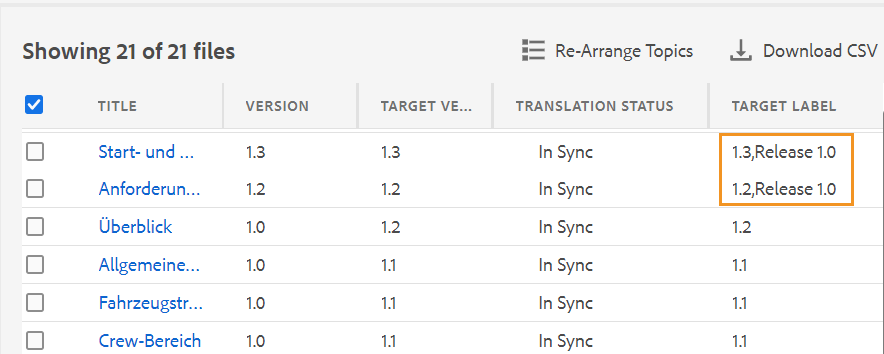
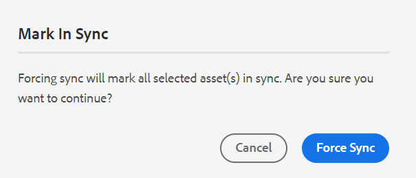

# Übersetzen von Dokumenten aus dem Web-Editor {#id21BKF0Z0YZF}

>[!TIP]
>
> Es wird empfohlen, diese Übersetzungsfunktion aus dem Web-Editor zu verwenden, wenn Sie auf AEM Guides as a Cloud Service Version Februar 2022 oder höher aktualisiert haben.

AEM Guides verfügt über eine leistungsstarke Funktion im Web-Editor, mit der Sie Ihre Inhalte in mehrere Sprachen übersetzen können. Sie können ein neues Übersetzungsprojekt erstellen und die Übersetzungsaufträge später zum vorhandenen Übersetzungsprojekt hinzufügen. Sie können auch ein mehrsprachiges Übersetzungsprojekt erstellen, das Übersetzungsaufträge für alle ausgewählten Sprachen enthält.

>[!NOTE]
>
> Ihre bzw. Ihr Admin kann die Registerkarte Verwalten (für die Übersetzung verwendet) im Web-Editor konfigurieren. Weitere Informationen finden Sie *Abschnitt „Konfigurieren der Übersetzungsfunktion im Web-Editor* im Abschnitt Installieren und Konfigurieren von Adobe Experience Manager Guides as a Cloud Service.

## Voraussetzungen

Before performing steps in this procedure, ensure that you have created the required language root and target folders

1. Erstellen Sie einen Stammordner, um Ihre Quellinhalte zu speichern. Der Stammordner muss mit dem Namen der Sprache \(z. B. Englisch\) oder dem Sprach-Code \(en\) erstellt werden.
1. Erstellen Sie die Zielordner, in die Sie Ihre Inhalte übersetzen möchten. Wenn Sie beispielsweise Ihre Inhalte in Deutsch oder Französisch übersetzen möchten, müssen Sie einen Ordner mit dem Namen -de \(für Deutsch\) oder -fr \(für Französisch\) erstellen.

>[!NOTE]
>
> Der Stammordner und die Zielordner müssen auf derselben Ebene erstellt werden.

## Ein Übersetzungsprojekt erstellen

1. Öffnen Sie **Bedienfeld** Repository“ die DITA-Zuordnungsdatei in der Zuordnungsansicht.
1. Klicken Sie auf die **Verwalten**. The **Translation panel** displays the available language groups.

1. Als Benutzer können Sie die für Ihr Ordnerprofil konfigurierten Sprachgruppen anzeigen. Die Sprachgruppen zeigen die Sprachordner zusammen mit ihren Sprachcodes an. Beispielsweise enthält die Sprachgruppe G1 die Sprachordner Italienisch \(it\), Deutsch \(de\), Französisch \(fr\) und Englisch \(en\).

   {width="300" align="left"}

   *Wählen Sie die Sprachgruppen oder Sprachen aus, in die Sie Ihre Dokumente übersetzen möchten.*

   >[!IMPORTANT]
   >
   > Sie können nur die Sprachen auswählen und in diese übersetzen, für die Sie den Zielordner parallel zur Quellsprache erstellt haben. Ein auf einer anderen Ebene erstellter Sprachordner, z. B. eine Ebene unterhalb des Ordners der Ausgangssprache, wird ebenfalls nicht angezeigt. Stellen Sie sicher, dass Sie alle Zielsprachordner auf derselben Ebene wie den Ordner für die Ausgangssprache erstellen.

1. Sie können eine beliebige Sprachgruppe als Ziel für die Übersetzung auswählen. Wenn Sie **Alle auswählen** werden die ausgewählten Dateien in alle verfügbaren Sprachen innerhalb der vorhandenen Sprachgruppen übersetzt.

   Die Option „Sprachordner“ ist ausgegraut und zeigt ein Warnzeichen an:

   - Wenn der Zielordner für eine Sprache fehlt.
   - Wenn die Zielsprache mit der Ausgangssprache identisch ist.

   >[!NOTE]
   >
   > Wenn Sie den Zielordner für eine Sprache erstellen, nachdem Sie die Sprachgruppe erstellt haben, aktualisieren Sie den Browser, um die Sprache in den Sprachgruppen zu aktivieren.

1. Wenn Sie eine bestimmte Sprache auswählen, wird sie in allen ausgewählten Sprachgruppen als ausgewählt angezeigt. Wenn man in eine Sprache übersetzt, wird es in einem Schritt für alle Sprachgruppen übersetzt. Wenn beispielsweise Deutsch sowohl in den G1- als auch in den G2-Sprachgruppen vorhanden ist, wird es für beide ausgewählt.

1. Unter **Andere Sprachen** können Sie eine beliebige Sprache auswählen, für die Sie den Zielordner erstellt haben, die jedoch nicht zu Sprachgruppen gehört.

1. Sie können auch eine der folgenden Optionen auswählen, um Ihr Projekt zu übersetzen:

   **Keine** Wählen Sie diese Option, um die Standardversionen der Dateien zu übersetzen. Standardmäßig ist diese Option aktiviert.

   **Baseline verwenden** Sie können für die Übersetzung Ihres Projekts eine Baseline auswählen. Klicken Sie auf Baseline verwenden und wählen Sie eine auf der Karte erstellte Baseline aus. Alle Dateien, die Teil der ausgewählten Baseline sind, werden auf der Seite Übersetzung angezeigt. Nach der Übersetzung Ihrer Inhalte können Sie die übersetzten Baselines exportieren. Weitere Informationen zum Exportieren der übersetzten Baseline finden Sie unter [Exportieren der übersetzten Baseline](generate-output-use-baseline-for-publishing.md#id196SE600GHS).

   **Neueste Version verwenden als ein**: Wählen Sie diese Option, um die Version der Themen nach Erstellungsdatum und -uhrzeit zu filtern. Wenn Sie Datum und Uhrzeit auswählen, wird nur die neueste Version der Dateien angezeigt, die am oder vor dem ausgewählten Datum und der ausgewählten Uhrzeit erstellt wurden.

1. Klicken Sie auf **Übernehmen**. Eine Liste mit Details zu Themen und zugehörigen Assets wird angezeigt.
1. Wählen Sie die Themen aus, die Sie zur Übersetzung senden möchten. Sie können auch die Themenfilteroptionen für die folgenden Spalten verwenden:

   - **Title**: Titel der Quelldatei.  Bewegen Sie den Mauszeiger über den Titel der Quelldatei, um den Titel der Zieldatei oder der übersetzten Datei anzuzeigen.
   - **File Name**: Name of the source file
   - **File Type**: Type of the source file. Die verfügbaren Optionen sind „Zuordnung“, „Thema“ und „Bild“.
   - **Reference Type**: Direct or Indirect references
   - **Version**: Version number of the source file
   - **Version Label**: Label for the selected version of the source file
   - **Target Version**: Version number of the target file
   - **Document State**: State of the source file. The available options are Draft, In-Review, and Reviewed.
   - **Target Language**: The language to which you want to translate the source file
   - **Translation Status**: The available options are: Out of Sync, Missing Copy, In Progress, and In Sync.
   - **Target Label**: Label for the selected version of the target file
1. Click **Send for Translation** on the top right corner.

   {width="800" align="left"}

1. From the dropdown, select **Create a New Translation Project**.

   {width="350" align="left"}

   Besides a new translation project, you also can select from the following options:

   - You can choose to **Create a structure** only for the translation project.
   - You can choose to **Create a new XLIFF translation project** to convert the XML content into the XML Localization Interchange File Format (XLIFF). XLIFF is an open XML-based format that is used to standardize the data transfer between various tools used in the content translation process. AEM Guides supports XLIFF version 1.2.
In an XLIFF project, the content is exported to the industry standard XLIFF format, which can be provided to Translation vendors. XLIFF format empowers potential reuse of segments that you have already translated during the translation phase.\
     After the XLIFF content is translated, it can be imported into AEM Guides, creating a translated version of the original DITA project.

     >[!NOTE]
     >
     > XLIFF export only works with human translation configuration.

   - You can select **Create a new multi-lingual translation project** which will include translation jobs for all languages that you have selected for translation. For example, if you have selected French, German, and Spanish it will create a project which contains translation jobs for all three languages.
   - Wenn Sie bereits über ein Übersetzungsprojekt verfügen, können Sie diesem Projekt Themen hinzufügen. Select Add to **Existing Translation Project** option from the Project list and choose a project from the Existing Translation Project list. You can sort these projects by most recent, ascending, or descending order.

- If you select **Existing Translation Project**, this operation updates the existing asset entry in the project if the asset is already added and the related translation job state is in the *Draft* state.
   - If the destination language is not present in the project, a new project is created for the single-language translation project, and a new job is created for multi-language translation project.
   - If the job is already present for the destination language and the job status isn&#39;t in the *Draft* state, a new job is created within the same project to add the assets for translation.

  >[!NOTE]
  >
  > If your existing project is a scoping project, it has &#39;\(Scoping\)&#39; appended in its name.

- If you need to create the scope for a project to be translated, you can select **Create a new scoping translation project**. This will not send the copies for translation and the original translation status of the files is maintained. There is no impact on the destination language copy of the referred topics which are sent for scoping.
1. Geben Sie im Feld **Projekttitel** einen Namen für das Projekt ein.
1. Click **Create** to create a new translation project.

   Ein neues Übersetzungsprojekt wird mit der ausgewählten Version der Themen erstellt. Zu diesem Zeitpunkt wird eine Popup-Meldung angezeigt, die bestätigt, dass das Übersetzungsprojekt erstellt wurde. Sobald alle Kopien der Zielsprache im Übersetzungsprojekt verfügbar sind, erhalten Sie eine Benachrichtigung im Posteingang. Once the target language copies are available in the translation project, you can then go ahead and start the translation job. For details see, [Start the translation job](translation-first-time.md#id225IK030OE8).

   >[!NOTE]
   >
   > Wenn Sie die Übersetzung für ein oder mehrere Themen in einem Übersetzungsauftrag ablehnen, wird der **In Bearbeitung** Übersetzungsstatus aller abgelehnten Themen auf ihren ursprünglichen Status zurückgesetzt. Der Status der referenzierten Themen wird entsprechend dem aktuellen Übersetzungsstatus überprüft und zurückgesetzt. Außerdem werden die im Zielprojekt erstellten Übersetzungsdateien nicht gelöscht, selbst wenn die Übersetzung dafür abgelehnt wird.

## Add the translation rules

AEM Guides allows your administrators to configure the translation rules. The SRX (Segmentation Rules eXchange) format is a standard for exchanging segmentation rules between different users and different translation environments. You can create a folder and add your custom SRX files to it.

SRX files should be named as `<language-code>.srx`. For example, en-US, or ar-AE.

>[!NOTE]
>Beim Titel wird nicht zwischen Groß- und Kleinschreibung unterschieden. Daher kann „en-US“, „en-us“ oder „en-us“ verwendet werden. AEM-Handbücher können auch &quot;-&quot; (Bindestrich) oder „_“ (Unterstrich) auflösen. Sie können also „en-US“ oder „en_US“ verwenden.

Außerdem können Sie diese Dateien in jedem Ordner unter dem `./content/dam` AEM Assets-Stammordner ablegen.

Nachdem Sie den Ordner erstellt haben, der die SRX-Dateien enthält, können Sie den Ordnerpfad in der Konfiguration des SRX-Speicherorts für Übersetzungen in Ihrem Ordnerprofil hinzufügen.

Es wird empfohlen, für eine bessere Leistung nur SRX-Dateien in dem Ordner zu behalten, der im Profilordner konfiguriert ist.

AEM Guides wählt die SRX-Regeln entsprechend der Quellsprache des Übersetzungsprojekts aus. Es wird nach einer benutzerdefinierten SRX-Datei für eine Sprache gesucht. Wenn Sie keine benutzerdefinierte SRX-Datei definieren, werden die Regeln gemäß den vordefinierten Übersetzungsregeln ausgewählt.

Weitere Informationen zum Einrichten globaler Profile und Profile auf Ordnerebene finden Sie unter *Konfigurieren von Authoring-Vorlagen* unter Installieren und Konfigurieren von Adobe Experience Manager Guides as a Cloud Service.

## Übergeben Sie die Versionsbezeichnung an die Zielversion

Mit AEM Guides können Sie die Bezeichnung der Quelldatei an die Zieldatei übergeben. Auf diese Weise können Sie die Quellversion für die übersetzte Datei leicht identifizieren.

Um die Bezeichnung der Quellversion in der Zielkopie hinzuzufügen, muss der Systemadministrator die Option **Quellversionsbezeichnungen in die Zielversion übertragen** auf der Registerkarte **Übersetzung** in **Editor-Einstellungen** auswählen.

Wenn Sie beispielsweise Quelldateien haben, auf die die Versionsbezeichnung `Release 1.0` angewendet wurde, können Sie auch die Quellbezeichnung \(`Release 1.0`\) an die übersetzte Datei übergeben.

{width="650" align="left"}

>[!NOTE]
>
> Die Quellbeschriftung ist nur an eine Zielversion angehängt. Wenn Sie die Quellbeschriftung in eine andere Version verschieben, wird sie automatisch in der neuesten Zielbeschriftung angezeigt.

## Versionsunterschied für nicht synchronisierte Dateien anzeigen 

AEM Guides bietet die Funktion, die Unterschiede zwischen der ausgewählten Version und der letzten übersetzten Quellversion der Themen zu überprüfen. Sie können die **nicht synchron)** basierend auf den vorgenommenen Änderungen übersetzen.

{width="650" align="left"}

Klicken Sie auf **Unterschied anzeigen** Symbol \(\) für ein Thema, um die Unterschiede zwischen der zuletzt übersetzten Version und der aktuellen Version der ausgewählten Datei anzuzeigen.

>[!NOTE]
>
> **Unterschied anzeigen** wird das Symbol \(\) nur für DITA-Dateien angezeigt, die den Übersetzungsstatus &quot;**&quot;**.

Das **Versionsunterschied** wird angezeigt. Hier werden die **Letzte übersetzte Version** und die **Ausgewählte Version** Nummer auf der linken Seite angezeigt. Im Vorschaufenster werden die Unterschiede zwischen der zuletzt übersetzten Version und der ausgewählten Themenversion angezeigt.

{width="650" align="left"}

## Nicht synchronisierte Assets schließen

Wenn Sie Änderungen an einigen Assets vornehmen, werden diese Assets nicht mehr synchronisiert. Sie können die geänderten Assets entweder erneut übersetzen oder den Status „Nicht synchronisiert“ verwerfen. Wenn Sie zum Beispiel einige sehr geringfügige Änderungen vorgenommen haben, die wirklich keine Übersetzung benötigen, können Sie deren Status als „Synchronisiert“ markieren.

Um den Status „Nicht synchronisiert“ zu schließen, führen Sie die folgenden Schritte aus:

1. Wählen Sie die Assets aus, für die Sie den Status ändern möchten.
1. Klicken Sie **oben auf die Schaltfläche** Mark In Sync \(\). Das **Als synchronisiert markieren** wird angezeigt.

   {width="550" align="left"}

1. Klicken Sie **Synchronisierung erzwingen**. Für die ausgewählten nicht synchronisierten Assets wird der Status auf „Synchronisiert“ festgelegt.

>[!NOTE]
>
> **Synchronisiert markieren** wird die Schaltfläche \(\) nur für Assets angezeigt, deren Übersetzungsstatus „Nicht synchronisiert“ lautet.

## Anzeigen laufender Übersetzungsprojekte für eine Karte oder ein Thema

Einige der Verweise auf Ihrem Übersetzungs-Dashboard befinden sich möglicherweise im Status In Bearbeitung . Diese Verweise haben einen Link **In Bearbeitung** unter der Spalte **Übersetzungsstatus**. Wenn Sie auf den Link klicken, wird das Dialogfeld **In Bearbeitung** Projekte“ geöffnet. Im Dialogfeld wird eine Liste aller laufenden Übersetzungsprojekte (zusammen mit der Zielsprache\) angezeigt, die die ausgewählte Referenz enthalten.

>[!NOTE]
>
> Sie können den Link In Bearbeitung für die übersetzten Projekte sehen, die in AEM Guides as a Cloud Service ab Version Februar 2023 erstellt wurden.

Klicken Sie im Dialogfeld auf den Namen der Referenz, um sie im Vorschaumodus zu öffnen. Sie können auch auf das Übersetzungsprojekt klicken, um die Übersetzung zu starten.

{width="550" align="left"}

## Abgeschlossenes Übersetzungsprojekt automatisch löschen oder deaktivieren

>[!NOTE]
> 
>Diese Funktion ist für neue Übersetzungsprojekte verfügbar, die Sie mit Experience Manager Guides Version 2404 oder höher erstellen.  Dies hat keine Auswirkungen auf bestehende Projekte.

Ihr Administrator kann die Option **Bereinigung des Übersetzungsprojekts nach Abschluss** auf der Registerkarte **Übersetzung** in den **Editor-Einstellungen** konfigurieren, um die Übersetzungsprojekte automatisch zu deaktivieren oder zu löschen.

Für die Dokumentverwaltung bietet Experience Manager Guides die Möglichkeit, die Übersetzungsprojekte nach Abschluss der Übersetzung zu löschen.

Sie können die Übersetzungsprojekte auch deaktivieren, wenn Sie sie später verwenden möchten. Beim Löschen eines Projekts werden alle im Projekt vorhandenen Dateien und Ordner gelöscht. Disabling a project doesn&#39;t delete it but maintains it in the repository. But you can&#39;t update or edit a disabled project.  Deletion or disabling a project will not impact the translation status of any references.

**Übergeordnetes Thema:**&#x200B;[&#x200B; Arbeiten mit dem Web-Editor](web-editor.md)
