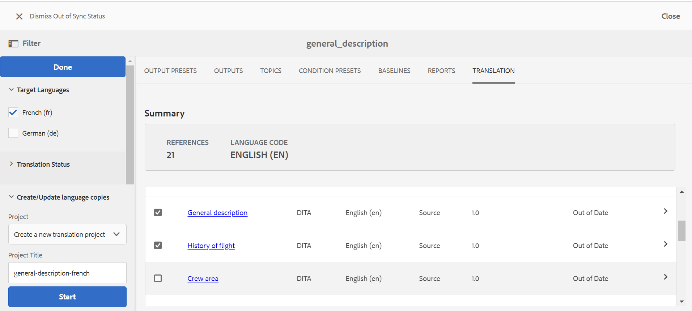

# Best Practices für die Übersetzung von Inhalten {#id1678G0S702F}

Consider the following point for translating content:

- The folder and file names must comply with the file naming standards such as—there should be no spaces, apostrophe, braces, equals sign, special or non-ASCII characters.

- If you translate content in different languages, you must create folders corresponding to each language. Each of these language folders will contain the content corresponding to that language. For example, you can create folders using the language designator like `de` for German, `fr` for French, and so on. Or, you can create folders using the language and region designators like `fr-FR` for French as used in France or `fr-CA` for French as used in Canada.
- The target language should also have the actual locales selected as per the target language folders on their instance.
- The cloud configuration should be same as that of the source folder and there should be only one cloud configuration in one folder. You can create multiple folders under /conf, if you want to use multiple translation connectors.
- A folder should not have more than 1000 files in it.
- Ensure that the user tasked with initiating the translation process has Read, Modify, Create, and Delete permissions on the source and target language folders.
- As translating content requires creation of a translation project, the user must have access to create project in AEM.
- If you want to use Conditional Presets with your map, you must create them before initiating the translation process. As Conditional Presets are also bundled in the translated version of the map, creating the presets before initiating the translation process ensure that they are available in the translated version.
- Content translation process must be started from DITA map console and not the AEM Assets UI.
- The Component-Based DITA Translation Workflow must not be used if you are translating content via human translation. However, this option must be used for machine translation.
- The globally used content and media that don&#39;t require localization, should be kept out of the language copies.
- All the common content that has to be localized, should be kept in a common folder under the language folder.

The following illustration shows an example of a folder structure in AEM when you have globally used content and three language copies.

{width="800" align="left"}

## Konfigurieren des Übersetzungsdienstes

Führen Sie die folgenden Schritte aus, um den Service für menschliche oder maschinelle Übersetzung zu konfigurieren:

1. Wählen Sie in der Benutzeroberfläche von Assets den Ordner für die Ausgangssprache aus.

1. Öffnen Sie die Ordnereigenschaften und navigieren Sie zur Registerkarte **Cloud-Services** .

1. Konfigurieren **auf der Registerkarte** Cloud-Services“ den Übersetzungs-Service, den Sie verwenden möchten.

   Sie können maschinelle oder menschliche Übersetzung konfigurieren.

   Stellen Sie sicher, dass sich in einem Ordner nur eine Konfiguration für den Übersetzungs-Connector befindet. Unter /conf können mehrere Ordner erstellt werden, wenn mehrere Übersetzungs-Connectoren vorhanden sind. Für den Ordner der Ausgangssprache muss eine Cloud-Konfiguration ausgewählt sein, bevor der Übersetzungsprozess gestartet wird.

   >[!NOTE]
   >
   > Siehe [Konfigurieren des Translation Integration Framework](https://experienceleague.adobe.com/docs/experience-manager-cloud-service/sites/administering/reusing-content/translation/integration-framework.html?lang=en) in der Dokumentation zu AEM für Details zur Integration mit Übersetzungsdiensten von Drittanbietern.

1. Klicken Sie auf **Speichern und schließen** um die aktualisierten Ordnereigenschaften zu speichern.

>[!TIP]
>
> Im Abschnitt *Übersetzung* des Best Practices-Handbuchs finden Sie die Best Practices für die Übersetzung von Inhalten.

## Erstellen eines neuen Übersetzungsprojekts

Führen Sie die folgenden Schritte aus, um ein Übersetzungsprojekt zu erstellen:

>[!NOTE]
>
> Bevor Sie die Schritte in diesem Verfahren ausführen, stellen Sie sicher, dass Sie die erforderlichen Sprachstamm- und Zielordner erstellt haben, wie in [Best Practices für die Inhaltsübersetzung](#id1678G0S702F) beschrieben.

1. Klicken Sie in der Assets-Benutzeroberfläche auf die DITA-Zuordnungsdatei.

1. Klicken Sie auf die **Übersetzung**.

1. Wählen Sie in der **Target Languages** das Gebietsschema aus, in das Sie Ihr Projekt übersetzen möchten, und klicken Sie auf **Done**.

   Eine Zusammenfassung und Details zu Themen und zugehörigen Assets werden angezeigt.

   >[!IMPORTANT]
   >
   > Die **Zielsprachen** zeigen nur die Sprachen an, für die parallel zur Quellsprache ein Sprachordner erstellt wird. Ein auf einer anderen Ebene erstellter Sprachordner, z. B. eine Ebene unterhalb des Ordners der Ausgangssprache, wird ebenfalls nicht angezeigt. Stellen Sie sicher, dass Sie alle Zielsprachordner auf derselben Ebene wie den Ordner für die Ausgangssprache erstellen.

1. Wählen Sie die Themen aus, die Sie zur Übersetzung senden möchten.

   Sie können auch die folgenden Themenfilteroptionen verwenden:

   >[!NOTE]
   >
   > Nachdem Sie den erforderlichen Filter angewendet haben, klicken Sie im Bedienfeld **Filter** auf „Fertig“, um Themen basierend auf Ihrer Auswahl zu filtern.

   - **Übersetzungsstatus**: Themen nach ihrem Übersetzungsstatus filtern. Die verfügbaren Optionen sind: Nicht synchronisiert, Fehlende Kopie, In Bearbeitung und Synchronisiert.
   - **Suche**: Geben Sie einen oder mehrere Begriffe ein, um nach den Thementiteln zu suchen.
   - **Source-Typ**: Wählen Sie diese Option, um Themen nach ihren Dateitypen zu filtern. Die verfügbaren Optionen sind: Alle, DITA, DITA Map, Ressource.
   - **Source-Version geändert nach**: Wählen Sie diese Option, um das Thema nach Änderungsdatum und -uhrzeit zu filtern. Alle Themen, die nach dem angegebenen Datum und der angegebenen Uhrzeit geändert wurden, werden in der Liste angezeigt.
   - **Baseline**: Klicken Sie auf „Baseline verwenden“ und wählen Sie eine auf der Karte erstellte Baseline aus. Alle Dateien, die Teil der ausgewählten Baseline sind, werden auf der Seite Übersetzung angezeigt. Sie können die gewünschten Dateien aus der Grundlinie auswählen und mit dem Übersetzungsprozess fortfahren. Nach der Übersetzung Ihrer Inhalte können Sie die übersetzten Baselines exportieren. Weitere Informationen zum Exportieren der übersetzten Baseline finden Sie unter [Exportieren der übersetzten Baseline](generate-output-use-baseline-for-publishing.md#id196SE600GHS).
1. Klicken **unten** Filterbedienfeld auf „Sprachkopien erstellen/aktualisieren“.

1. Wählen Sie in **Liste** Projekt **die Option „Neues Übersetzungsprojekt erstellen** aus.

   >[!NOTE]
   >
   > Wenn Sie bereits über ein Übersetzungsprojekt verfügen, können Sie diesem Projekt Themen hinzufügen. Wählen Sie **Option „Zu vorhandenem Übersetzungsprojekt hinzufügen** aus der Liste **Projekt** und wählen Sie ein Projekt aus der Liste **Vorhandenes Übersetzungsprojekt** aus.

1. Geben Sie im Feld **Projekttitel** einen Namen für das Projekt ein.

1. Wählen Sie die Option **DITA-Map einschließen**, um die Map zur Übersetzung zu senden.
1. Klicken Sie **Starten**, um ein neues Übersetzungsprojekt zu erstellen.

   Ein neues Übersetzungsprojekt wird mit der ausgewählten Version der Themen erstellt. Zu diesem Zeitpunkt wird eine Popup-Meldung angezeigt, die bestätigt, dass das Übersetzungsprojekt erstellt wurde. Sobald alle Kopien der Zielsprache im Übersetzungsprojekt verfügbar sind, erhalten Sie eine Benachrichtigung im Posteingang. Sobald der Bereich für die Zielsprachenkopien im Übersetzungsprojekt verfügbar ist, können Sie mit dem Übersetzungsauftrag beginnen.

   {width="800" align="left"}

Die Registerkarte Übersetzung enthält die folgenden Abschnitte:

- **Zusammenfassung**: Zeigt die Anzahl der referenzierten Themen und die Ausgangssprache zusammen mit dem Code an.
- **Details**: Zeigt den Thementitel, den Thementyp, den Sprach-Code des Themas, die Quellsprache, die Version des Quellthemas, die dem Thema hinzugefügte Beschriftung und den Übersetzungsstatus an.

## Übersetzungsauftrag starten {#id225IK030OE8}

Führen Sie die folgenden Schritte aus, um den Übersetzungsauftrag zu starten:

1. Navigieren Sie in **Projekte**-Konsole zu dem Projektordner, den Sie für die Lokalisierung erstellt haben.

1. Klicken Sie auf das Lokalisierungsprojekt, um die Detailseite zu öffnen.

1. Klicken Sie auf der Kachel **Übersetzungsauftrag** auf den Pfeil und wählen Sie **Starten** aus der Liste aus, um den Übersetzungs-Workflow zu starten.

   >[!NOTE]
   >
   > Wenn Sie den menschlichen Übersetzungs-Service verwenden, müssen Sie die Inhalte für die Übersetzung exportieren. Sobald Sie die übersetzten Inhalte haben, müssen Sie sie wieder in das Übersetzungsprojekt importieren.

1. Um den Status des Übersetzungsauftrags anzuzeigen, klicken Sie unten auf der Kachel **Übersetzungsauftrag** auf das Auslassungszeichen.

Nach Abschluss der Übersetzung ändert sich der Status des Übersetzungsauftrags in *Bereit für Überprüfung*. Um den Übersetzungsprozess abzuschließen, müssen Sie die übersetzte Kopie und die Asset-Metadaten aus der Kachel Übersetzungsauftrag in der Projektkonsole akzeptieren.

>[!NOTE]
>
> Wenn Sie die Übersetzung für ein oder mehrere Themen in einem Übersetzungsauftrag ablehnen, wird der **In Bearbeitung** Übersetzungsstatus aller abgelehnten Themen auf ihren ursprünglichen Status zurückgesetzt. Der Status der referenzierten Themen wird entsprechend dem aktuellen Übersetzungsstatus überprüft und zurückgesetzt. Außerdem werden die im Zielprojekt erstellten Übersetzungsdateien nicht gelöscht, selbst wenn die Übersetzung dafür abgelehnt wird.

**Übergeordnetes Thema:**[ Inhalte übersetzen](translation.md)
