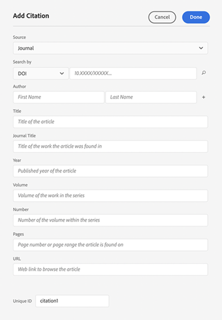
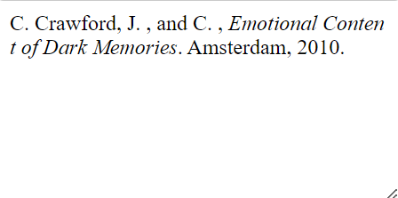

# Hinzufügen und Verwalten von Zitaten in Ihren Inhalten

Zitate sind Verweise auf die Quelle von Informationen, die Ihrem Inhalt hinzugefügt werden. Mithilfe von Zitaten können Sie den Autoren die Quellinformationen zuschreiben und den Lesern helfen, die Quellinformationen zu verfolgen. Das Hinzufügen von Zitaten macht Ihre Inhalte zuverlässiger und verhindert Plagiate. Sie ermöglichen es Ihnen auch, gut recherchierte Inhalte anzuzeigen.

In AEM Guides können Sie Zitate hinzufügen, importieren und sie auf Ihre Inhalte anwenden. Sie können diese Zitate aus jeder Quelle von Büchern, Websites und Zeitschriften hinzufügen.

Mit AEM Guides können Sie Ihre Zitate bearbeiten, in der Vorschau anzeigen und sortieren. Nachdem Sie Ihre Zitate zum Inhalt hinzugefügt haben, können Sie die Ausgabe mit dem nativen PDF generieren. Sie können die Bibliografie- oder Verweisseite auch in der nativen PDF-Ausgabe hinzufügen.

AEM Guides unterstützt verschiedene Zitatstile, wie die Modern Language Association (MLA), die American Psychological Association (APA), Chicago, das Institute for Electrical and Electronics Engineers (IEEE) und die American Heart Association (AHA). Es wird empfohlen, diese klar und konsequent anzuwenden.

>[!NOTE]
>
>Derzeit unterstützt AEM Guides nur native PDF für Zitate.

## Zitate hinzufügen

Gehen Sie wie folgt vor, um Zitate hinzuzufügen:

1. Wählen Sie **linken Bedienfeld** Symbol  aus.
Das **Zitate**-Bedienfeld wird geöffnet.

   {width="300" align="left"}

1. Wählen Sie im **Zitate**-Bedienfeld  aus. Aus dem Dropdown-Menü können Sie ein neues Zitat hinzufügen oder ein Zitat importieren.

1. Wählen Sie **Neues Zitat** aus, um ein neues Zitat hinzuzufügen.
Das **Zitat hinzufügen** wird geöffnet.

    {width="300" align="left"}

1. Füllen Sie die Felder im Dialogfeld **Zitat hinzufügen** aus.

   >[!NOTE]
   >
   >Sie können auch die ISBN-, DOI- oder PubMed-ID hinzufügen. AEM Guides füllt die anderen Felder automatisch aus.

   | Buch | Website | Journal |
   | --- | ---|---|
   | **Source**   Wählen Sie aus der Dropdown-Liste die Quelle des Zitats als Buch aus. | **Source**  Wählen Sie in der Dropdown-Liste die Quelle des Zitats als Website aus. | **Source**   Wählen Sie in der Dropdown-Liste die Quelle des Zitats als Journal aus. |
   | **Suchen nach**   Wählen Sie **ISBN** oder **DOI** aus der Dropdown-Liste aus, um nach der digitalen ID zu suchen, die mit dem Zitat verknüpft ist.    DOI: Digitale Objektkennung   ISBN: Eindeutige numerische Buchkennung | **Suchen nach**   Wählen Sie **DOI** aus der Dropdown-Liste aus, um nach der digitalen ID zu suchen, die mit dem Zitat verknüpft ist. | **Suchen nach**   Wählen Sie **DOI** oder PubMed ID aus der Dropdown-Liste aus, um nach der digitalen ID zu suchen, die mit der Zitatangabe verknüpft ist.      |
   | **Autor**   Fügen Sie den Vor- und Nachnamen des Autors des Zitats hinzu. Wählen Sie  aus, um weitere Namen hinzuzufügen. | **Autor**   Fügen Sie den Vor- und Nachnamen des Autors des Zitats hinzu. Wählen Sie  aus, um weitere Namen hinzuzufügen. | **Autor**   Fügen Sie den Vor- und Nachnamen des Autors des Zitats hinzu. Wählen Sie aus, um weitere Namen hinzuzufügen. |
   | **Titel**   Fügen Sie den Titel des Buchs hinzu. | **Titel**   Fügen Sie den Titel der Web-Seite hinzu. | **Titel**   Fügen Sie den Titel des Artikels hinzu. |
   | **Editor**   Fügen Sie den Editor des Buchs hinzu. | **Website-Name**   Fügen Sie den Namen der Website hinzu. | **Journaltitel**   Fügen Sie den Titel des Werks hinzu, in dem der Artikel gefunden wird. |
   | **Edition**   Fügen Sie die Ausgabe des Buches hinzu. | **URL**   Fügen Sie den Weblink der Website hinzu, um den Inhalt zu durchsuchen. | **Jahr**   Fügen Sie das Jahr hinzu, in dem der Artikel veröffentlicht wird. |
   | **Stadt**   Fügen Sie die Stadt der Veröffentlichung hinzu. | **Zugriffsdatum**  Fügen Sie das Datum hinzu, an dem der Inhalt der Website aufgerufen wird. | **Volumen**   Fügen Sie das Volumen der Arbeit in der Reihe hinzu. |
   | **Publisher**   Add the name of the publisher of the book. | **Veröffentlichungsdatum**   Fügen Sie das Datum hinzu, an dem der Inhalt der Website veröffentlicht wird. | **Number**   Fügen Sie die Nummer des Volumes innerhalb der Serie hinzu. |
   | **Year**   Fügen Sie das Jahr hinzu, in dem das Buch veröffentlicht wird. | **Aktualisierungsdatum**   Fügen Sie das Datum hinzu, an dem der Inhalt der Website aktualisiert wird. | **Seiten**   Fügen Sie die Seitennummer oder den Seitenbereich hinzu, in dem der Artikel gefunden wird. |
   | **Version**   Fügen Sie die Version des Buches hinzu. | **Eindeutige ID**   Fügen Sie eine eindeutige ID für die Zitierung hinzu. Eine eindeutige ID ist eine eindeutige Kennung für dieses Zitat. | **URL**  Fügen Sie den Weblink zum Protokoll hinzu. |
   | **Serie**  Fügen Sie die Serie des Buches hinzu. |  | **Eindeutige ID**   Fügen Sie eine eindeutige ID für das Zitat hinzu. Eine eindeutige ID ist eine eindeutige Kennung für dieses Zitat. |
   | **URL**   Fügen Sie den Weblink zum Buch hinzu. |  |  |
   | **Eindeutige ID**   Fügen Sie eine eindeutige ID für die Zitierung hinzu. Eine eindeutige ID ist eine eindeutige Kennung für dieses Zitat. |  |  |

1. Wählen Sie **Fertig** aus.

   Dem Zitatbereich wird ein neues Zitat hinzugefügt.

>[!NOTE]
>
> Das Hinzufügen einer eindeutigen ID für das Zitatfeld ist obligatorisch.  Sie können die eindeutige ID nicht mehr ändern, nachdem die Zitierung hinzugefügt wurde.

## Zitate importieren

Gehen Sie wie folgt vor, um Zitate zu importieren:

1. Wählen Sie im linken Bedienfeld die Option **Zitate**  aus.

   Das **Zitate**-Bedienfeld wird geöffnet.

1. Wählen Sie **Bedienfeld** Zitate“ die Option  und wählen Sie dann **Importieren** aus der Dropdown-Liste aus.
1. Durchsuchen Sie eine .bib-Datei aus Ihrem System und importieren Sie sie .

   >[!TIP]
   >
   > Eine Dateinamenerweiterung .bib ist eine BibTeX-Bibliografische Datenbankdatei. Es ist eine speziell formatierte Textdatei, die Referenzen zu einer bestimmten Informationsquelle auflistet.

   Nachdem die Datei erfolgreich importiert wurde, können Sie die Verweise im Bereich „Zitate“ anzeigen.

   >[!NOTE]
   > <ol><li> AEM Guides importiert nur die Zitate, die eindeutig und noch nicht vorhanden sind.
    &gt; <li> AEM Guides kann Zitate aus einem Buch, einem Journal oder einer Website importieren. Derzeit werden Zitate aus anderen Quellen nicht unterstützt.

## Zitate verwalten

Die Zitate werden im linken Bereich alphabetisch sortiert. Suchen Sie nach den Zitaten entsprechend den Quellen, die in Ihrem Thema verwendet werden sollen.

### Filter

Wählen Sie **Symbol** Filter neben der Suchleiste aus und wählen Sie die Quelloptionen aus der Dropdown-Liste aus, um die Zitatliste zu filtern. Es ermöglicht sowohl eine einzelne als auch mehrere Auswahlen.

* **Alle Quellen**: Hier wird eine vollständige Liste der Zitate angezeigt, einschließlich aller Quellen.

* **Buch**: Es zeigt die Liste der Zitate aus Büchern.

* **Website**: Zeigt die Liste der Zitate von Websites an.

* **Journal**: Zeigt die Liste der Zitate aus Journalen an.

### Suchen

Suchen Sie die Zitierung für Ihren Inhalt.

1. Wählen Sie im linken Bedienfeld Zitate aus.
Das **Zitate**-Bedienfeld wird geöffnet.

1. Verwenden Sie die Suchleiste, um aus einer langen Liste nach dem entsprechenden Zitat zu suchen.

### Zitatstil ändern {#change-citation-style}

Ihre bzw. Ihr Systemadmin kann den Stil der Zitate über das Dropdown **Zitate** auf der Registerkarte **Allgemeine Einstellungen** im **Editor-Einstellungen** ändern.
Diese Stile bestimmen, wie Zitate im Vorschaubereich oder in der nativen PDF-Ausgabe angezeigt werden.

Die folgenden Optionen sind in der Dropdown-Liste verfügbar:

| MLA | APA | Chicago | IEEE | AHA |
|---|---|---|---|---|
| Moderne   | American Psychological Association Stil | Chicago Manual of Style | Institut für Elektro- und Elektronikingenieure | American Heart Association-Stil |
| Beispiel:   Crawford, Claire, et al. *Emotional Content of Dark Memories*.Edited by Memory, Band 16, 2010, Amsterdam. | Beispiel:   Crawford, C., J., &amp; , C. (2010). *Emotional Content of Dark Memories* (505-16 ed.). 10.1080/ 09658210902067289 | Beispiel:   Crawford, Claire, et al. *Emotionaler Inhalt dunkler Erinnerungen*. 505-16, 2010. | Beispiel:   C. Crawford, J. , und C. , *Emotionaler Inhalt dunkler Erinnerungen*. Amsterdam, 2010. | Beispiel:   C. Crawford, J. , und C. , *Emotionaler Inhalt dunkler Erinnerungen*. Amsterdam, 2010. |

## Zitat bearbeiten

Gehen Sie wie folgt vor, um das Zitat zu bearbeiten:

1. Bewegen Sie den Mauszeiger über den Namen des Zitats in der Liste. Wählen Sie  Symbol **Optionen** aus.

1. Wählen Sie **Bearbeiten** aus.

Das **Zitat bearbeiten** wird geöffnet.

1. Nehmen Sie die erforderlichen Änderungen vor. Klicken Sie auf **Fertig**.
Das ausgewählte Zitat wird bearbeitet.

>[!NOTE]
>
>Sie können die eindeutige ID nicht mehr ändern, nachdem die Zitierung hinzugefügt wurde.

## Vorschau eines Zitats anzeigen

Gehen Sie wie folgt vor, um eine Vorschau eines Zitats anzuzeigen:

Bewegen Sie den Mauszeiger über den Namen des Zitats in der Liste. Auswählen      Symbol **Optionen**.

1. Wählen Sie **Vorschau**.
Sie können den Inhalt und das Format des Zitats im Vorschaubereich in der Vorschau anzeigen.

   >[!NOTE]
   >
   >Die Vorschau basiert auf dem Zitatstil, den Ihr Administrator in den **Editor-Einstellungen“ ausgewählt**.

1. Klicken Sie auf eine beliebige Stelle auf dem Bildschirm, um das Vorschaufeld zu schließen.

   {width="550" align="left"}

>[!NOTE]
>
> Sie können ein in ein Thema eingefügtes Zitat auch über die Assets-Benutzeroberfläche oder die Registerkarte Vorschau des Web-Editors in der Vorschau anzeigen.

## Zitate einfügen

Führen Sie die folgenden Schritte aus, um Zitate in ein Thema einzufügen:
1. Wählen Sie das Thema im Repository-Bereich aus und doppelklicken Sie dann darauf, um es im Bearbeitungsfenster zu öffnen.
1. Platzieren Sie den Cursor an der Position des Themas, an der das Zitat hinzugefügt werden soll.

Sie können Zitate zum Thema aus der Hauptsymbolleiste oder dem linken Bereich einfügen.

### In der Haupt-Symbolleiste

1. Wählen Sie das Symbol **Zitate**  in der Hauptsymbolleiste aus.
1. Wählen Sie **Dialogfeld**Zitate“ das Zitat aus. Sie können auch mehrere Zitate auswählen.
   {width="300" align="left"}
1. You can filter citations by typing the first few alphabets in the search panel of the **Citation** dialog box.

1. Klicken Sie auf **Fertig**.
The selected citation is added at the cursor location in your topic.

### From the left panel

>[!NOTE]
> 
>To view the **Citations** icon from the left panel, your system administrator must select the **Citations** option in the **Panels** tab in **Editor Settings**.

1. Select **Citations**  icon in the left panel.
1. Drag the citation from the **Citations** panel and drop it at the appropriate location in the topic.

   You can also select **Insert** from   **Options** to insert a citation.

   
1. To select multiple citations, right-click a citation in the topic and select **Modify Citation** from the shortcut menu.
1. Select the citations that you want to insert from the **Citation** dialog.
1. Select **Done** to add them to the topic.

Once you have inserted citations in the topic, you can preview them in the Web Editor. You can also publish content with citations using Native PDF.

## Delete a citation

You can delete a citations from the Citaitons panel or from a topic where you have inserted.

### Delete a Citation from Citations panel

To delete a citation from the Citations panel, follow these steps:

1. Bewegen Sie den Mauszeiger über den Namen des Zitats in der Liste.
1. Select the  **Options** icon.
1. Select the   **Delete** .
The confirmation dialog box opens.
1. Wählen Sie **Ja** aus.
The selected citation is deleted from the citations panel.

### Delete a Citation from a Topic

To delete a citation that is already used in the topic, follow these steps:

In the topic, place your cursor at the end of the citation.

1. Right-click a citation in the topic and select **Modify Citation** from the shortcut menu. The Citation dialog opens.
   

1. You can choose the citations you want to insert into the document.

   >[!NOTE]
   >
   >The citations that are already used in the topic are replaced with the ciations that you select from the dialog.

1. Wählen Sie **Fertig** aus.

## Generate output of content with citations

Once you have inserted citations in the topic, you can publish content with citations using Native PDF.

In the Native PDF output, the citations appear within the content where you have inserted them. You can also create a Bibliography page. When you click any citation, you are redirected to the bibliography page.

Create a **Citations** page layout in the PDF templates, and include it in your document. All the citations used in the book get listed on one page that appears in the PDF output. To learn more about creating a page layout, view [Create a page layout](/help/product-guide/native-pdf/components-pdf-template.md#create-page-layout).

To change the view and feel of the citation page, view [Customize PDF templates](/help/product-guide/native-pdf/pdf-template.md).

### Apply content style to a citation

Apply formatting to the citation when added to the topic.

1. Select **Stylesheets** in the **Templates** panel of a Native PDF output preset.   It opens the **STYLES** panel that contains all the styling options.

1. In the Search panel, search for `<cite>`.

To learn more about styles, view [Work with the common content styles](/help/product-guide/native-pdf/stylesheet.md).
