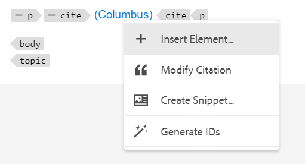

# Hinzufügen und Verwalten von Zitaten in Ihrem Inhalt

Zitate sind Verweise auf die Informationsquelle, die zu Ihrem Inhalt hinzugefügt wird. Mithilfe von Zitaten können Sie den Autoren die Quellinformationen zuschreiben und Lesern dabei helfen, die Quellinformationen zu verfolgen. Das Hinzufügen von Zitaten macht Ihren Inhalt zuverlässiger und verhindert Plagiate. Sie ermöglichen es Ihnen auch, gut recherchierte Inhalte anzuzeigen.

In AEM Guides können Sie Zitate hinzufügen und importieren und auf Ihre Inhalte anwenden. Sie können diese Zitate aus jeder Quelle von Büchern, Websites und Zeitschriften hinzufügen.

AEM Guides unterstützt Sie bei der Bearbeitung, Vorschau und Sortierung Ihrer Zitate. Nachdem Sie Ihre Zitate in den Inhalt eingefügt haben, können Sie die Ausgabe mithilfe der nativen PDF generieren. Sie können auch die Bibliografie- oder Referenzseite in der Ausgabe Native PDF hinzufügen.

AEM Guides unterstützt mehrere Arten von Zitaten, wie etwa die Modern Language Association (MLA), die American Psychological Association (APA), Chicago, Institute for Electrical and Electronics Engineers (IEEE) und American Heart Association (AHA). Es wird empfohlen, sie klar und konsistent zu verwenden.

>[!NOTE]
>
>Derzeit unterstützt AEM Guides nur natives PDF für Zitate.

## Zitate hinzufügen

Gehen Sie wie folgt vor, um Zitate hinzuzufügen:

1. Wählen Sie im linken Fensterbereich das Symbol **Zitate**  aus.
Das Bedienfeld **Zitate** wird geöffnet.

   {width="300" align="left"}

1. Wählen Sie im Bedienfeld **Zitate** die Option  aus. Im Dropdown-Menü haben Sie die Möglichkeit, einen neuen Zitat hinzuzufügen oder einen Zitat zu importieren.

1. Wählen Sie **New Citation** aus, um einen neuen Zitat hinzuzufügen.
Das Dialogfeld **Citation hinzufügen** wird geöffnet.

    {width="300" align="left"}

1. Füllen Sie die Felder im Dialogfeld **Zitat hinzufügen** aus.

   >[!NOTE]
   >
   >Sie können auch die ISBN-, DOI- oder PubMed-ID hinzufügen. AEM Guides füllt die anderen Felder automatisch aus.

   | Buch | Website | Journal |
   | --- | ---|---|
   | **Source**   Wählen Sie aus der Dropdown-Liste die Quelle des Zitats als Buch aus. | **Source**  Wählen Sie aus der Dropdown-Liste die Quelle des Zitats als Website aus. | **Source**   Wählen Sie aus der Dropdown-Liste die Quelle des Zitats als Journal aus. |
   | **Suche nach**   Wählen Sie **ISBN** oder **DOI** aus der Dropdown-Liste aus, um nach der digitalen ID zu suchen, die mit der Erwähnung verknüpft ist.    DOI: Digital Object Identifier   ISBN: Unique Numeric Book Identifier | **Suche nach**   Wählen Sie **DOI** aus der Dropdown-Liste aus, um nach der digitalen ID zu suchen, die mit der Erwähnung verknüpft ist. | **Suche nach**   Wählen Sie **DOI** oder die PubMed-ID aus der Dropdown-Liste aus, um nach der digitalen ID zu suchen, die mit der Erwähnung verknüpft ist.      |
   | **Autor**   Fügen Sie den Vor- und Nachnamen des Autors der Erwähnung hinzu. Wählen Sie  aus, um weitere Namen hinzuzufügen. | **Autor**   Fügen Sie den Vor- und Nachnamen des Autors der Erwähnung hinzu. Wählen Sie  aus, um weitere Namen hinzuzufügen. | **Autor**   Fügen Sie den Vor- und Nachnamen des Autors der Erwähnung hinzu. Wählen Sie aus, um weitere Namen hinzuzufügen. |
   | **Titel**   Fügen Sie den Titel des Buches hinzu. | **Titel**   Fügen Sie den Titel der Webseite hinzu. | **Titel**   Fügen Sie den Titel des Artikels hinzu. |
   | **Bearbeiter**   Fügen Sie den Editor des Buches hinzu. | **Website-Name**   Fügen Sie den Namen der Website hinzu. | **Journaltitel**   Fügen Sie den Titel des Werkes hinzu, in dem der Artikel gefunden wird. |
   | **Edition**   Fügen Sie die Ausgabe des Buches hinzu. | **URL**   Fügen Sie den Weblink der Website hinzu, um den Inhalt zu durchsuchen. | **Jahr**   Fügen Sie das Jahr hinzu, in dem der Artikel veröffentlicht wird. |
   | **Stadt**   Fügen Sie die Stadt der Veröffentlichung hinzu. | **Aufrufdatum**  Fügen Sie das Datum hinzu, an dem auf den Inhalt der Website zugegriffen wird. | **Lautstärke**   Fügen Sie das Volumen des Werkes in der Serie hinzu. |
   | **Herausgeber**   Fügen Sie den Namen des Herausgebers des Buches hinzu. | **Veröffentlichungsdatum**   Fügen Sie das Datum hinzu, an dem der Inhalt der Website veröffentlicht wird. | **Zahl**   Fügen Sie die Anzahl der Lautstärke innerhalb der Serie hinzu. |
   | **Jahr**   Fügen Sie das Jahr hinzu, in dem das Buch veröffentlicht wird. | **Aktualisiertes Datum**   Fügen Sie das Datum hinzu, an dem der Inhalt der Website aktualisiert wird. | **Seiten**   Fügen Sie die Seitennummer oder den Seitenbereich hinzu, in dem der Artikel gefunden wird. |
   | **Version**   Fügen Sie die Version des Buches hinzu. | **Eindeutige ID**   Fügen Sie eine eindeutige ID für die Erwähnung hinzu. Eine eindeutige ID ist eine eindeutige Kennung für diese Erwähnung. | **URL**  Fügen Sie den Web-Link zum Protokoll hinzu. |
   | **Series**  Fügen Sie die Reihe des Buches hinzu. |  | **Eindeutige ID**   Fügen Sie eine eindeutige ID für die Erwähnung hinzu. Eine eindeutige ID ist eine eindeutige Kennung für diese Erwähnung. |
   | **URL**   Fügen Sie den Web-Link zum Buch hinzu. |
   | **Eindeutige ID**   Fügen Sie eine eindeutige ID für die Erwähnung hinzu. Eine eindeutige ID ist eine eindeutige Kennung für diese Erwähnung. |

1. Wählen Sie **Fertig**.

   Dem Feld &quot;Zitat&quot;wird ein neuer Zitat hinzugefügt.

>[!NOTE]
>
> Das Hinzufügen einer eindeutigen ID für das Feld &quot;citation&quot;ist obligatorisch.  Sie können die eindeutige ID nicht mehr ändern, nachdem die Referenz hinzugefügt wurde.

## Einfuhrauflistungen

Gehen Sie wie folgt vor, um Zitate zu importieren:

1. Wählen Sie im linken Bereich das Symbol **Zitate**  aus.

   Das Bedienfeld **Zitate** wird geöffnet.

1. Wählen Sie im Bedienfeld **Zitate** die Option  und dann **Import** aus der Dropdown-Liste.
1. Durchsuchen Sie eine .bib-Datei von Ihrem System und importieren Sie sie .

   >[!TIP]
   >
   > Eine .bib-Dateinamenerweiterung ist eine BibTeX Bibliografische Datenbankdatei. Es handelt sich dabei um eine speziell formatierte Textdatei, die Verweise auf eine bestimmte Informationsquelle auflistet.

   Nachdem die Datei erfolgreich importiert wurde, können Sie die Verweise im Fenster &quot;Zitate&quot;anzeigen.

   >[!NOTE]
   > <ol><li> AEM Guides importiert nur die Zitate, die eindeutig sind und noch nicht vorhanden sind.
    &gt; <li> AEM Guides kann Zitate aus einem Buch, einer Zeitschrift oder einer Website importieren. Derzeit werden Zitate aus anderen Quellen nicht unterstützt.

## Zitate verwalten

Die Zitate werden in der linken Leiste alphabetisch sortiert. Suchen Sie nach den Zitaten entsprechend den Quellen, die für Ihr Thema verwendet werden sollen.

### Filter

Wählen Sie das Symbol **Filter**  neben der Suchleiste aus und wählen Sie die Quelloptionen aus der Dropdown-Liste aus, um die Zitationsliste zu filtern. Sie ermöglicht sowohl eine als auch mehrere Auswahlen.

* **Alle Quellen**: Es wird eine vollständige Liste der Zitate einschließlich aller Quellen angezeigt.

* **Buch**: Es zeigt die Liste der Zitate aus Büchern.

* **Website**: Zeigt die Liste der von Websites stammenden Zitate an.

* **Journal**: Es zeigt die Liste der Zitate aus Journalen an.

### Suchen

Durchsuchen Sie die Zitate nach Ihrem Inhalt.

1. Wählen Sie im linken Bereich die Option &quot;Zitate&quot;.
Das Bedienfeld **Zitate** wird geöffnet.

1. Verwenden Sie die Suchleiste, um in einer langen Liste nach der entsprechenden Erwähnung zu suchen.

### Bearbeitungsstil ändern {#change-citation-style}

Ihr Systemadministrator kann den Stil von Zitaten aus dem Dropdown-Menü **Zitate** auf der Registerkarte **Allgemeine Einstellungen** in den **Editor-Einstellungen** ändern.
Diese Stile bestimmen, wie Zitate im Vorschaufenster oder in der nativen PDF-Ausgabe angezeigt werden.

Die folgenden Optionen sind im Dropdown-Menü verfügbar:

| MLA | APA | Chicago | IEEE | AHA |
|---|---|---|---|---|
| Modern Language Association Style   | American Psychology Association Style | Chicago Manual of Style | Institut für Elektrotechnik und Elektroniktechnik | American Heart Association Style |
| Beispiel:  Crawford, Claire usw. *Emotionaler Inhalt dunkler Erinnerungen*.Bearbeitet durch Speicher, Vol. 16, 2010, Amsterdam. | Beispiel:   Crawford, C., J., &amp;, C. (2010). *Emotionaler Inhalt dunkler Erinnerungen* (505-16 ed.). 10.1080/ 09658210902067289 | Beispiel:   Crawford, Claire usw. *Emotionaler Inhalt dunkler Erinnerungen*. 16.5.2010. | Beispiel:   C. Crawford, J. und C. , *Emotionaler Inhalt dunkler Erinnerungen*. Amsterdam, 2010. | Beispiel:   C. Crawford, J. und C. , *Emotionaler Inhalt dunkler Erinnerungen*. Amsterdam, 2010. |

## Bearbeiten von Zitaten

Gehen Sie wie folgt vor, um die Zitate zu bearbeiten:

1. Bewegen Sie den Mauszeiger über den Namen der Zitation aus der Liste. Wählen Sie  das Symbol **Optionen** aus.

1. Wählen Sie **Bearbeiten** aus.

Das Dialogfeld **Zitat bearbeiten** wird geöffnet.

1. Nehmen Sie die erforderlichen Änderungen vor. Wählen Sie **Fertig** aus.
Die ausgewählte Zitat wird bearbeitet.

>[!NOTE]
>
>Sie können die eindeutige ID nicht mehr ändern, nachdem die Referenz hinzugefügt wurde.

## Vorschau einer Zitation anzeigen

Gehen Sie wie folgt vor, um eine Zitate in der Vorschau anzuzeigen:

Bewegen Sie den Mauszeiger über den Namen der Zitation aus der Liste. Auswählen     Symbol  **Optionen**.

1. Wählen Sie **Vorschau** aus.
Sie können den Inhalt und das Format der Zitate im Vorschaufenster in der Vorschau anzeigen.

   >[!NOTE]
   >
   >Die Vorschau basiert auf dem Referenzstil, den Ihr Administrator in den **Editor-Einstellungen** ausgewählt hat.

1. Klicken Sie auf eine beliebige Stelle auf dem Bildschirm, um das Vorschaufenster zu schließen.

   {width="550" align="left"}

>[!NOTE]
>
> Sie können auch eine Vorschau einer in ein Thema eingefügten Zitation über die Benutzeroberfläche von Assets oder die Registerkarte Vorschau des Webeditors anzeigen.

## Zitate einfügen

Führen Sie die folgenden Schritte aus, um Zitate in ein Thema einzufügen:
1. Wählen Sie das Thema im Repository-Bedienfeld aus und doppelklicken Sie dann auf , um es im Bearbeitungsfenster zu öffnen.
1. Setzen Sie den Cursor an die Stelle des Themas, an der Sie die Referenz hinzufügen möchten.

Sie können Zitate zum Thema über die Hauptsymbolleiste oder das linke Bedienfeld einfügen.

### In der Symbolleiste

1. Wählen Sie in der Hauptsymbolleiste das Symbol **Zitate**  aus.
1. Wählen Sie im Dialogfeld **Zitate** die Zitate aus. Sie können auch mehrere Zitate auswählen.
   {width="300" align="left"}
1. Sie können Zitate filtern, indem Sie die ersten Buchstaben im Suchbereich des Dialogfelds **Zitat** eingeben.

1. Klicken Sie auf **Fertig**.
Die ausgewählte Erwähnung wird an der Cursorposition in Ihrem Thema hinzugefügt.

### Im linken Bereich

>[!NOTE]
> 
>Um das Symbol **Zitate** im linken Bereich anzuzeigen, muss Ihr Systemadministrator die Option **Zitate** auf der Registerkarte **Bedienfelder** in den **Editor-Einstellungen** auswählen.

1. Wählen Sie im linken Fensterbereich das Symbol **Zitate**  aus.
1. Ziehen Sie die Erwähnung aus dem Bedienfeld **Zitate** und legen Sie sie an der entsprechenden Stelle im Thema ab.

   Sie können auch **Einfügen** aus  **Optionen** auswählen, um einen Verweis einzufügen.

   
1. Um mehrere Zitate auszuwählen, klicken Sie mit der rechten Maustaste auf einen Zitat im Thema und wählen Sie im Kontextmenü die Option **Zitat ändern** aus.
1. Wählen Sie im Dialogfeld **Zitat** die einzufügenden Zitate aus.
1. Wählen Sie **Fertig** aus, um sie dem Thema hinzuzufügen.

Nachdem Sie die Zitate in das Thema eingefügt haben, können Sie sie im Web-Editor in der Vorschau anzeigen. Sie können auch Inhalte mit Zitaten mithilfe des nativen PDF veröffentlichen.

## Zitat löschen

Sie können Zitate aus dem Bereich &quot;Zitate&quot;oder aus einem Thema löschen, das Sie eingefügt haben.

### Zitate aus dem Bereich &quot;Zitate&quot;löschen

Gehen Sie wie folgt vor, um eine Zitate aus dem Bereich &quot;Zitate&quot;zu löschen:

1. Bewegen Sie den Mauszeiger über den Namen der Zitation aus der Liste.
1. Wählen Sie das Symbol  **Optionen** aus.
1. Wählen Sie die   **Löschen** .
Das Bestätigungsdialogfeld wird geöffnet.
1. Wählen Sie **Ja** aus.
Die ausgewählte Zitation wird aus dem Zitate-Panel gestrichen.

### Zitate aus einem Thema löschen

Gehen Sie wie folgt vor, um eine bereits im Thema verwendete Zitation zu löschen:

Platzieren Sie im Thema den Cursor am Ende des Zitats.

1. Klicken Sie mit der rechten Maustaste auf einen Zitat im Thema und wählen Sie **Zitat ändern** aus dem Kontextmenü. Das Dialogfeld Zitat wird geöffnet.
   

1. Sie können die Zitate auswählen, die Sie in das Dokument einfügen möchten.

   >[!NOTE]
   >
   >Die bereits im Thema verwendeten Zitate werden durch die im Dialogfeld ausgewählten Aktionen ersetzt.

1. Wählen Sie **Fertig**.

## Generieren der Ausgabe von Inhalten mit Zitaten

Nachdem Sie Zitate in das Thema eingefügt haben, können Sie Inhalte mit Zitaten mithilfe von Native PDF veröffentlichen.

In der nativen PDF-Ausgabe erscheinen die Zitate in dem Inhalt, in den Sie sie eingefügt haben. Sie können auch eine Bibliografie-Seite erstellen. Wenn Sie auf eine beliebige Erwähnung klicken, werden Sie zur bibliography-Seite weitergeleitet.

Erstellen Sie ein Seitenlayout für **Zitate** in den PDF-Vorlagen und fügen Sie es in Ihr Dokument ein. Alle im Buch verwendeten Zitate werden auf einer Seite aufgelistet, die in der PDF-Ausgabe erscheint. Weitere Informationen zum Erstellen eines Seitenlayouts finden Sie unter [Erstellen eines Seitenlayouts](/help/product-guide/native-pdf/components-pdf-template.md#create-page-layout).

Um die Ansicht und das Erscheinungsbild der Referenzseite zu ändern, sehen Sie sich [PDF-Vorlagen anpassen](/help/product-guide/native-pdf/pdf-template.md) an.

### Anwenden des Inhaltsstils auf eine Erwähnung

Wenden Sie Formatierungen auf die Zitate an, wenn sie zum Thema hinzugefügt werden.

1. Wählen Sie **Stylesheets** im Bereich **Vorlagen** einer Nativen PDF-Ausgabevorgabe aus.   Dadurch wird der Bereich **STILE** geöffnet, der alle Stiloptionen enthält.

1. Suchen Sie im Suchbereich nach `<cite>`.

Weitere Informationen zu Stilen finden Sie unter [Arbeiten mit den gängigen Inhaltsstilen](/help/product-guide/native-pdf/stylesheet.md).
