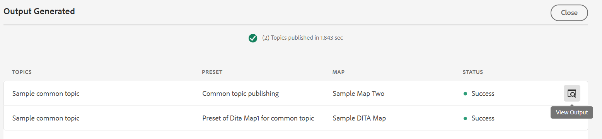
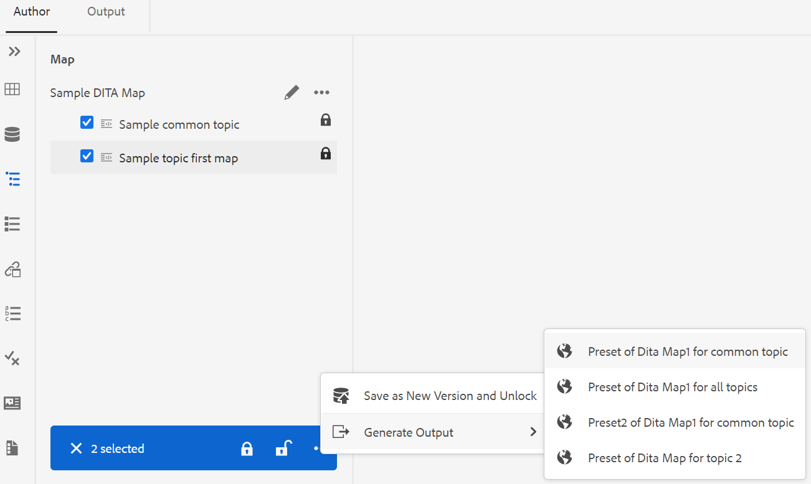

# Generieren Sie die Ausgabe aus dem Repository-Bedienfeld oder dem Bedienfeld &quot;Map View&quot; {#id218CL6010AE}

Sie können auch die für Ihre DITA-Zuordnung erstellten Ausgabevorgaben verwenden, um die Ausgabe aus dem Repository-Bedienfeld oder dem Map View-Bedienfeld zu generieren.

- Verwenden Sie die Funktion **Quick Generate** im Repository-Bereich oder im Bereich &quot;Map View&quot;, um die Ausgabe für das ausgewählte Thema oder die gesamte DITA Map zu generieren.

  >[!NOTE]
  >
  > Sie können auch über das Bedienfeld &quot;Favoriten&quot;oder das Bedienfeld &quot;Suche&quot;auf die Funktion &quot;**Quick Generate**&quot;zugreifen.

- Verwenden Sie die Funktion **Ausgabe generieren** im Bereich &quot;Map View&quot;, um die Ausgabe für die ausgewählten mehreren Themen zu generieren.

## Publish ein Thema, das über eine oder mehrere DITA-Maps verwendet wird

Führen Sie die folgenden Schritte aus, um die Ausgabe für ein oder mehrere Themen in Ihrer DITA-Zuordnung zu generieren:

1. Wählen Sie auf der Registerkarte **Autor** das Thema in Ihrer DITA-Zuordnung aus, das Sie veröffentlichen möchten.

1. Wählen Sie **Quick Generate** aus dem Menü &quot;Optionen&quot;des ausgewählten Themas.
   {width="650" align="left"}

1. Um ein Thema zu veröffentlichen, das in einer einzelnen DITA-Zuordnung verwendet wird, wählen Sie die Ausgabevorgaben Ihrer Zuordnung aus, die Sie zum Veröffentlichen verwenden möchten, und klicken Sie auf **Erzeugen**.
   {width="350" align="left"}

1. Sie sehen den Status des Generierungsprozesses der Ausgabe. Um die Ausgabe anzuzeigen, bewegen Sie den Mauszeiger über das Thema und klicken Sie auf Ausgabe anzeigen .

1. Wenn Sie ein gemeinsames Thema haben, das über mehrere Themen hinweg verwendet wird, wählen Sie die verschiedenen DITA-Maps sowie die Ausgabevorgaben aus, die Sie zur Veröffentlichung verwenden möchten, und klicken Sie auf **Erzeugen**.

   {width="350" align="left"}

1. Sie sehen den Status des Generierungsprozesses der Ausgabe.

   - **Themen**: Listet die ausgewählten Themen auf, für die die Ausgabe generiert wird.
   - **Vorgabe**: Zeigt die Ausgabevorgaben an, die die ausgewählten Themen enthalten.
   - **Zuordnung**: Listet die DITA-Maps auf, die das ausgewählte Thema enthalten.
   - **Status**: Zeigt den Veröffentlichungsstatus der einzelnen Themen an.
Um die Ausgabe anzuzeigen, bewegen Sie den Mauszeiger über das Thema und klicken Sie auf Ausgabe anzeigen .
     {width="800" align="left"}

## Generieren der Ausgabe für eine DITA-Zuordnung aus dem Web-Editor

Führen Sie die folgenden Schritte aus, um die Ausgabe für die gesamte DITA-Zuordnung zu generieren:

1. Wählen Sie auf der Registerkarte **Autor** die DITA-Zuordnung aus, die Sie veröffentlichen möchten.

1. Wählen Sie **Quick Generate** aus dem Menü &quot;Optionen&quot;Ihrer DITA-Map.

   {width="650" align="left"}

1. Wählen Sie die Ausgabevorgaben Ihrer DITA-Zuordnung aus, die Sie zum Veröffentlichen verwenden möchten, und klicken Sie auf **Erzeugen.**

1. Sie sehen den Status des Generierungsprozesses der Ausgabe. Um die Ausgabe anzuzeigen, bewegen Sie den Mauszeiger über das Thema und klicken Sie auf Ausgabe anzeigen .

## Ausgabe für mehr als ein Thema generieren

Führen Sie die folgenden Schritte aus, um die Ausgabe für mehr als ein Thema in Ihrer DITA-Map über das Bedienfeld Kartenansicht zu generieren:

1. Wählen Sie auf der Registerkarte **Autor** die Themen aus, die Sie veröffentlichen möchten.

1. Wählen Sie im Menü &quot;Optionen&quot;unten **Ausgabe generieren** aus.

1. Wählen Sie die Ausgabevorgabe Ihrer DITA-Map aus, die Sie zum Veröffentlichen verwenden möchten.

   >[!NOTE]
   >
   > Es werden nur die Ausgabevorgaben der aktuellen DITA-Zuordnung angezeigt, die alle ausgewählten Themen enthalten.

   {width="650" align="left"}

1. Sie sehen den Status des Prozesses zur Ausgabegenerierung. Um die Ausgabe anzuzeigen, bewegen Sie den Mauszeiger über das Thema und klicken Sie auf Ausgabe anzeigen .

**Übergeordnetes Thema:**[ Artikelbasierte Veröffentlichung aus dem Web-Editor](web-editor-article-publishing.md)
