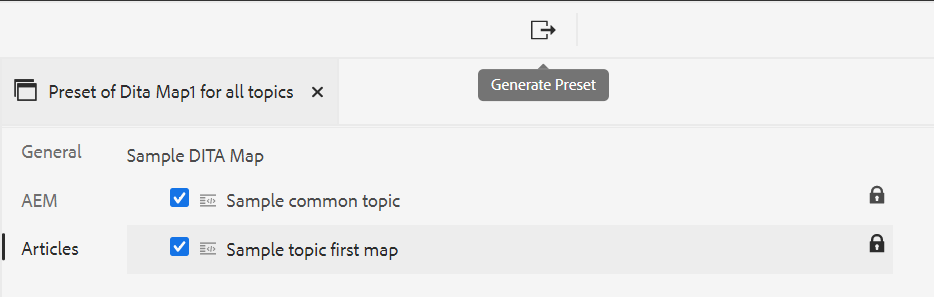

# Erstellen von Ausgabevorgaben aus dem Web-Editor {#id218CL400JW3}

Führen Sie die folgenden Schritte aus, um Ausgabevorgaben für Ihre DITA-Zuordnung zu erstellen:

1. Navigieren Sie in der Assets-Benutzeroberfläche zu der Zuordnungsdatei, die Sie bearbeiten möchten.

1. Um eine exklusive Sperre für die Zuordnungsdatei zu erhalten, wählen Sie die Zuordnungsdatei aus und klicken Sie auf **Auschecken**.

1. Wählen Sie die **Themen bearbeiten** aus dem Aktionsmenü in der Zuordnungsdatei aus.

   Die Zuordnungsdatei wird zur Bearbeitung im Web-Editor geöffnet.

   >[!NOTE]
   >
   > Sie können mit dem erweiterten Zuordnungs-Editor ein beliebiges Thema zur Karte hinzufügen oder daraus löschen. Weitere Informationen finden Sie unter [Arbeiten mit dem erweiterten Zuordnungs-Editor](map-editor-advanced-map-editor.md#).

1. Wählen **auf der Registerkarte** Ausgabe“ das Symbol + aus, um eine Ausgabevorgabe für Ihre DITA-Zuordnung zu erstellen.

   {width="350" align="left"}

1. Geben Sie den Namen der Vorgabe im Dialogfeld „Vorgabe hinzufügen“ ein und klicken Sie dann auf **Hinzufügen**.

1. Geben Sie die folgenden Konfigurationsdetails ein.

   1. Wählen Sie die erforderlichen Optionen auf der Registerkarte **Allgemein** aus. Sie können eine Ausgabevorgabe mit oder ohne Bedingungen erstellen. Sie können auch eine DITVAL-Datei verwenden. Mit AEM Guides können Sie auch eine Grundlinie zum Veröffentlichen einer bestimmten Version Ihrer DITA-Zuordnung auswählen.
   1. Geben Sie die Details der AEM-Site auf der Registerkarte **AEM** ein. **Site** zeigt die Liste der AEM Sites an, die in Ihrem AEM-Repository verfügbar sind. **Kategorie**, **Abschnittsvorlage** und **Artikelvorlage** sind die Strukturkomponenten, mit denen das Erscheinungsbild Ihrer Ausgabe organisiert wird. Diese sind in der AEM-Site-Vorlage vordefiniert.

      >[!NOTE]
      >
      > Aktualisieren Sie jedes Dropdown, um die weitere Klassifizierung in der nächsten Dropdown-Liste zu erhalten.

   1. Wählen Sie auf der **Artikel**-Registerkarte die Themen aus, für die Sie die Ausgabe generieren möchten.
1. Wählen Sie oben **das Symbol** Voreinstellung generieren) aus, um die Ausgabe zu generieren.

   {width="800" align="left"}

1. You will see the status of the output generation process. The **Topics** column lists the topics for which output is being generated while the **Status** column displays the publishing status of each topic.

   To view the output, hover the mouse pointer over the topic and click View Output.

   {width="800" align="left"}

>[!NOTE]
>
> You can also Edit, Rename, Duplicate, or Delete an existing output preset from the Options menu.

{width="550" align="left"}

**Parent topic:**&#x200B;[&#x200B; Article-based publishing from the Web Editor](web-editor-article-publishing.md)
