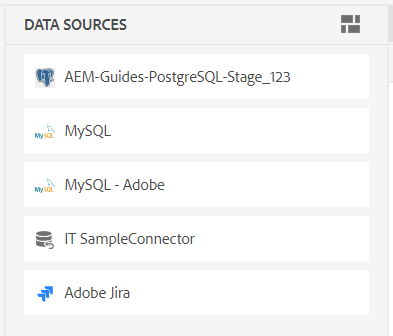
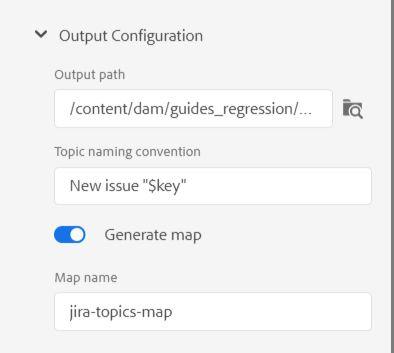

# Verwenden von Daten aus Ihrer Datenquelle

Eine **Datenquelle** ist ein System, in dem Sie die Daten für Ihr Unternehmen speichern und verwalten. Hierbei handelt es sich um Datensatzsysteme wie JIRA, SQL-Datenbanken, PIM oder PLM. AEM Guides bietet die Funktion, eine Verbindung mit Ihrer Datenquelle herzustellen und die Daten aus ihr zu verwenden.

Sie können auch eine Verbindung zu JSON-Datendateien über einen Datei-Connector herstellen. Laden Sie die JSON-Datei von Ihrem Computer hoch oder durchsuchen Sie sie über die Adobe Experience Manager-Assets. Erstellen Sie dann Inhaltsfragmente oder Themen mithilfe der Generatoren.

## Bedienfeld „Datenquellen“

Wählen Sie **Datenquellen**  im linken Bereich aus, um die verbundenen Datenquellen anzuzeigen. Das Bedienfeld Datenquellen wird geöffnet und zeigt alle verbundenen Datenquellen an.

Abhängig von Ihrem Setup kann Ihr Administrator einen Datenquellen-Connector konfigurieren:

 Cloud Services 

- Wenn Sie die Version vom Oktober 2023 oder höher verwenden, erfahren Sie, wie Sie [einen Datenquellen-Connector über die Benutzeroberfläche konfigurieren](/help/product-guide/cs-install-guide/conf-data-source-connector-tools.md) im Installations- und Konfigurationshandbuch für Cloud Services finden.

- Wenn Sie die Version vom Juli 2023 oder September 2023 verwenden, erfahren Sie im Installations- und Konfigurationshandbuch für Cloud Services, wie [ einen Datenquellen-Connector ](/help/product-guide/cs-install-guide/conf-data-source-connector.md).

    

  On-Premise Software 

- Wenn Sie Version 4.3.1 oder höher verwenden, erfahren Sie im On-Premise[Installations- und Konfigurationshandbuch , wie Sie einen Datenquellen-Connector über ](/help/product-guide/cs-install-guide/conf-data-source-connector-tools.md) Benutzeroberfläche konfigurieren.

- Wenn Sie Version 4.3 verwenden, erfahren Sie im On-[-Installations- und Konfigurationshandbuch , wie Sie ](/help/product-guide/cs-install-guide/conf-data-source-connector.md) Datenquellen-Connector konfigurieren.

>[!NOTE]
>
> Es werden die Datenquellen angezeigt, für die Ihr Administrator den Connector konfiguriert hat.

## Listenansicht oder Kachelansicht anzeigen

Sie können zwischen der Listen- oder Kachelansicht wechseln, um die verschiedenen Datenquellen in Form einer Liste oder als Kacheln anzuzeigen.

Wählen Sie eine Datenquelle aus, um die Inhaltsfragmentgeneratoren und die Themengeneratoren anzuzeigen, die für die ausgewählte Datenquelle verfügbar sind.

###  der Listenansicht

{width="300" align="left"}

*Liste der verbundenen Datenquellen.*

### Kachelansicht   

{width="300" align="left"}

*Anzeigen der verbundenen Datenquellen als Kacheln.*

Sie haben zwei Möglichkeiten, um Daten aus Datenquellen zu verwenden:
- Einfügen eines Inhaltsausschnitts
- Thema erstellen

## Einfügen eines Inhaltsausschnitts aus Ihrer Datenquelle

AEM Guides bietet die Funktion zum Verbinden mit Ihrer Datenquelle. Sie können Ihre Daten abrufen, in Ihre Themen einfügen und bearbeiten. Sie können ein Inhaltsfragment einfach mit dem Inhaltsfragment-Generator erstellen und es in Ihren Themen wiederverwenden.

Führen Sie die folgenden Schritte aus, um einen Inhaltsausschnitt mit dem Inhaltsausschnitt-Generator zu erstellen und in Ihr Thema einzufügen:

1. Wählen Sie **Datenquellen**    Im linken Bereich, um die verbundenen Datenquellen anzuzeigen.

1. Wählen Sie eine Datenquelle aus, um die für die ausgewählte Datenquelle verfügbaren Inhaltsfragment-Generatoren anzuzeigen.

   {width="300" align="left"}

   *Im Bedienfeld „Datenquellen“ werden die verfügbaren Inhaltsfragment-Generatoren aufgelistet.*

1. Wählen Sie **Hinzufügen**, um einen neuen Inhaltsausschnitt-Generator hinzuzufügen. Das Bedienfeld **Inhaltsfragmentgenerator hinzufügen** wird geöffnet.

1. Geben Sie die Abfrage in das Textfeld **Datenabfrage** ein.  Wählen Sie **Beispielabfrage kopieren** aus, um eine Datenabfrage schnell zu kopieren. Anstatt die Abfrage manuell zu erstellen, können Sie die Beispielabfrage kopieren und in das Textfeld **Datenabfrage** einfügen. Bearbeiten Sie dann einfach die Abfrage gemäß Ihren Datenanforderungen.

   >[!NOTE]
   >
   >Experience Manager bietet verschiedene Beispielabfragen für alle Ressourcen in den verschiedenen Datenquellen. Diese werden der Datenquelle zugeordnet, aus der Sie die Daten abrufen.

1. Wenn Sie einen Datei-Connector verwenden, können Sie die JSON-Datei von Ihrem Computer hochladen oder eine JSON-Datei aus Adobe Experience Manager Assets durchsuchen.

   >[!NOTE]
   >
   > Sie sehen die Optionen zum Hochladen oder Durchsuchen von Dateien anstelle einer Datenabfrage, wenn Sie einen Datei-Connector verwenden.

1. Wählen Sie im Dropdown-Menü **Datenzuordnungsvorlage“ die Vorlage aus, die Ihrer Datenquelle**.
Die vordefinierten Vorlagen für die ausgewählte Datenquelle werden in der Dropdown-Liste angezeigt. Sie können beispielsweise die Vorlage „sql-table“ für die Datenquelle „PostgreSQL“ anzeigen.

   >[!NOTE]
   >  
   > Wenn Ihr Administrator benutzerdefinierte Vorlagen konfiguriert hat, werden Ihnen diese Vorlagen auch in der Dropdown-Liste angezeigt (basierend auf den Vorlagenpfadkonfigurationen, die von Ihrem Administrator durchgeführt wurden).
   >   
   >Sie können auch Velocity-Tools in den Vorlagen verwenden. Erfahren Sie mehr über die Verwendung [ Velocity-Tools](#use-velocity-tools).

1. Das **Ressource**-Dropdown wird für einige Connectoren wie REST-Client, Salsify, Akeneo und Microsoft ADO angezeigt.  Wählen Sie eine Ressource aus dem Dropdown-Menü aus und stellen Sie eine Verbindung mit ihr her, um ein Inhaltsfragment oder ein Thema mithilfe des Generators dafür zu erstellen.

   >[!NOTE]
   >
   > Ihr Administrator kann beim Konfigurieren der Datenquellen-Connectoren Standardressourcen konfigurieren oder Ressourcen für mehrere URLs hinzufügen.

1. Klicken Sie **Abrufen**, um die Daten aus der Datenquelle abzurufen und die Vorlage auf die Daten anzuwenden, die aus der SQL-Abfrage resultieren.

1. Sie können die Daten in der Vorschau oder in der DITA-Quellansicht anzeigen.

   1. Die Vorschau zeigt, wie die Daten angezeigt werden, wenn sie in den Inhalt eingefügt werden. Die Vorschau zeigt einen kleinen Bruchteil der Daten im Format der ausgewählten Vorlage an.
Zum Beispiel:
      - Wenn Sie die SQL-Tabellenvorlage ausgewählt haben, können Sie die SQL-Daten im Tabellenformat anzeigen.
      - Wenn Sie die Vorlage Jira-ordered-list ausgewählt haben, können Sie eine geordnete Liste für die Jira-Probleme anzeigen.

   1. Die Quellansicht zeigt die Daten in der DITA-Quellansicht an.

      {width="800" align="left"}
      *Fügen Sie einen Inhaltsfragment-Generator hinzu. Zeigen Sie die Daten im Quell- oder Vorschaumodus an.*

1. Geben Sie zum Speichern der Abfrageergebnisse den Namen des Generators ein und klicken Sie dann auf **HINZUFÜGEN**.   Der Liste wird ein neuer Inhaltsausschnitt-Generator hinzugefügt.

   >[!NOTE]
   >
   > Für den Namen des neuen Inhaltsgenerators müssen Sie die Dateibenennungskonvention befolgen. Im Namen des Inhaltsfragment-Generators darf kein Leerzeichen enthalten sein. Außerdem können Sie keinen neuen Inhaltsgenerator mit dem Namen eines vorhandenen Inhaltsgenerators speichern. Ein Fehler tritt auf.

### Optionen für einen Inhaltsausschnitt-Generator

Klicken Sie mit der rechten Maustaste auf einen Inhaltsfragment-Generator, um die Optionen zu öffnen. Mit den Optionen können Sie die folgenden Vorgänge ausführen:

- **Vorschau**: Verwenden Sie diese Option, um einen Bereich zu öffnen und einen kleinen Teil der Anzeige der Daten in der Ausgabe anzuzeigen.
- **Einfügen**: Verwenden Sie diese Option, um das ausgewählte Inhaltsfragment in das im Web-Editor geöffnete Thema einzufügen. Da die Daten als Ausschnitt eingefügt werden, können Sie die Daten innerhalb Ihres Themas auch im Web-Editor bearbeiten.

  >[!NOTE]
  > 
  > Die Option „Einfügen“ wird nur beim Bearbeiten eines Themas angezeigt.

- **Bearbeiten**: Verwenden Sie diese Option, um Änderungen im Inhaltsfragment-Generator vorzunehmen und zu speichern.
- **Löschen**: Verwenden Sie diese Option, um den ausgewählten Inhaltsausschnitt-Generator zu löschen.
- **Duplizieren**: Verwenden Sie diese Option, um ein Duplikat oder eine Kopie des ausgewählten Inhaltsfragment-Generators zu erstellen. Das Duplikat wird standardmäßig mit einem Suffix (wie generator_1) erstellt.

### Einfügen eines Abfrageausschnitts

Sie können auch den  **Abfragenausschnitt einfügen** verwenden   in der Hauptsymbolleiste aus, um das Datenfragment in die Themen einzufügen.  Sie können einen Generator aus dem Dropdown-Menü auswählen, Ihre Abfrage bearbeiten oder die Vorlage ändern und die Daten in Ihr Thema einfügen.

{width="800" align="left"}

*Bearbeiten und Einfügen eines Datenausschnitts.*

## Erstellen eines Themas mithilfe des Themengenerators

Mit einem Themengenerator können Sie Themen erstellen, die Daten aus Ihren Quellen enthalten. Sie können schnell einen Themengenerator erstellen und dann die Themen mithilfe des Generators generieren. Jedes Thema kann Daten in verschiedenen Formaten enthalten, z. B. Tabellen, Listen und Absätze.   Beispielsweise können Sie zu einem Thema eine Tabelle mit den Details aller neuen Produkte und eine Liste aller Produkte hinzufügen, die nicht mehr zum Verkauf angeboten werden.

Der Themengenerator kann für alle Themen die Themen mit den Daten und eine DITA-Zuordnung erstellen. Sie können diese Themen auch in Ihren Inhalten `<conref>`. Auf diese Weise bleiben Ihre Daten mit der Datenquelle synchron und Sie können sie einfach aktualisieren.

### Thema erstellen

Führen Sie die folgenden Schritte aus, um mithilfe des Themengenerators ein Thema zu erstellen:

1. Wählen Sie eine Datenquelle aus, um die Inhaltsfragmentgeneratoren und die Themengeneratoren anzuzeigen, die für die ausgewählte Datenquelle verfügbar sind.

   {width="300" align="left"}

   *Hinzufügen eines Themengenerators für eine verbundene Datenquelle.*

1. Wählen Sie **Hinzufügen**  und wählen Sie **Themengenerator** aus der Dropdown-Liste aus, um einen neuen Themengenerator hinzuzufügen. Das Bedienfeld **Themengenerator hinzufügen** wird geöffnet.

1. Geben Sie die Werte in die Felder unter den folgenden drei Registerkarten des Bedienfelds **Themengenerator hinzufügen** ein:

   **Konfiguration abrufen**

   {width="300" align="left"}

   *Fügen Sie die Datenabfrage, die Datenzuordnungsvorlage und die Stammknotendetails für den Themengenerator hinzu und geben Sie ihm im Bedienfeld Konfiguration abrufen einen eindeutigen Namen.*

   1. Geben Sie die Abfrage in das Textfeld **Datenabfrage** ein. Wählen Sie **Beispielabfrage kopieren** aus, um eine Datenabfrage schnell zu kopieren. Anstatt die Abfrage manuell zu erstellen, können Sie die Beispielabfrage kopieren und in das Textfeld **Datenabfrage** einfügen. Bearbeiten Sie dann einfach die Abfrage gemäß Ihren Datenanforderungen.

      >[!NOTE]
      >
      >Experience Manager bietet verschiedene Beispielabfragen für alle Ressourcen in den verschiedenen Datenquellen. Diese werden der Datenquelle zugeordnet, aus der Sie die Daten abrufen.

   1. Wenn Sie einen Datei-Connector verwenden, können Sie die JSON-Datei von Ihrem Computer hochladen oder eine JSON-Datei aus Adobe Experience Manager Assets durchsuchen.

      >[!NOTE]
      >
      > Sie sehen die Optionen zum Hochladen oder Durchsuchen von Dateien anstelle einer Datenabfrage, wenn Sie einen Datei-Connector verwenden.

   1. Wählen Sie im Dropdown-Menü **Datenzuordnungsvorlage“ die Vorlage aus, die Ihrer Datenquelle**.

      >[!NOTE]
      >
      > Wenn Ihr Administrator benutzerdefinierte Vorlagen konfiguriert hat, werden Ihnen diese Vorlagen auch in der Dropdown-Liste angezeigt (basierend auf den Vorlagenpfadkonfigurationen, die von Ihrem Administrator durchgeführt wurden). Sie können beispielsweise eine Themenvorlage erstellen, die eine sortierte Liste, Tabellen, Absätze oder andere DITA-Elemente enthält.

   1. Geben Sie den **Stammknoten“**. Dies ist der Knoten, auf dem Sie auf Ihre Daten zugreifen möchten. Der Themengenerator erstellt dann jedes Thema auf der im Stammknoten definierten Ebene. Sie können beispielsweise „Probleme“ als Stammknoten in Jira hinzufügen. Wenn eine Abfrage also 13 Probleme zurückgibt, erhalten Sie 13 Themen, ein Thema für jedes Problem.

   1. Klicken Sie **Abrufen**, um die Daten aus der Datenquelle abzurufen und die Vorlage auf die Daten anzuwenden, die aus der SQL-Abfrage resultieren. Die Vorschau zeigt einen kleinen Bruchteil des Themas im Format der ausgewählten Vorlage an. Sie können beispielsweise ein einzelnes Jira-Problem mit allen Feldern anzeigen, die aus der Abfrage resultieren.
   1. Geben Sie den Namen des Themengenerators ein.

      >[!NOTE]
      > 
      > Für den Namen des neuen Themengenerators müssen Sie die Dateibenennungskonvention befolgen. Im Namen des Themengenerators darf kein Leerzeichen stehen. Außerdem können Sie keinen neuen Themengenerator mit dem Namen eines vorhandenen Themengenerators speichern. Ein Fehler tritt auf.

   **Ausgabekonfiguration**

   {width="300" align="left"}

   *Geben Sie Details zum Ausgabepfad und zur Themenbenennungskonvention im Bedienfeld „Ausgabekonfiguration“ ein. DITA-Map erstellen und benennen.*

   1. Geben Sie den **Ausgabepfad** ein, in dem Sie Ihre Themen speichern möchten.
   1. In der **Themennamenskonvention** können Sie einen Wert oder eine Variable mit Velocity-Tags eingeben. Die neuen Themen folgen dem Konvent. Sie können beispielsweise den `$key` eingeben, um Themen basierend auf Jira-Schlüsseln zu erstellen.
   1. Aktivieren Sie die **Zuordnung erstellen**, wenn Sie eine Zuordnung erstellen möchten, die alle generierten Themen enthält.
   1. Geben Sie den Namen der neuen DITA-Zuordnung ein.

   >[!NOTE]
   >
   > Der Themengenerator generiert die DITA-Zuordnung auf demselben Ausgabepfad wie die Themen.

   **Metadaten**

   Wählen Sie aus der Dropdown-Liste die Metadateneigenschaften aus, die an die Themen übergeben werden sollen. **Name** Dropdown-Liste listet sowohl die benutzerdefinierten als auch die Standardeigenschaften auf.

   Im folgenden Screenshot sind beispielsweise `dc:description`, `dc:language`, `dc:title` und `docstate` die Standardeigenschaften, für die Sie die Werte definieren können. Sie können eine benutzerdefinierte Eigenschaft wie „author“ erstellen und ihren Wert definieren.

   {width="300" align="left"}

   *Fügen Sie die Metadateneigenschaften im Bedienfeld „Metadaten“ hinzu, die an die Themen übergeben werden.*

1. Geben Sie den Namen des Generators ein und klicken Sie auf **Speichern** um die Abfrageergebnisse zu speichern. Der Liste wird ein neuer Themengenerator hinzugefügt.

1. Klicken Sie **Speichern und**), um den Themengenerator zu speichern und neue Themen aus dem Themengenerator zu generieren.

   {width="650" align="left"}

   *Generieren neuer Themen aus einem vorhandenen Themengenerator.*

   >[!NOTE]
   >
   > Wenn die Themen bereits vorhanden sind, aktualisiert der Generator die Daten in den vorhandenen Themen.

### Optionen für einen Themengenerator

Klicken Sie mit der rechten Maustaste auf einen Themengenerator, um die **Optionen** zu öffnen. Mit den Optionen können Sie die folgenden Vorgänge ausführen:

- **Generieren**: Mit dieser Option werden die Themen für den ausgewählten Themengenerator generiert. Sie können diese Option auch verwenden, um die vorhandenen Themen zu aktualisieren. Es stellt eine Verbindung zur Datenquelle her und ruft die aktualisierten Daten ab. Beim Generieren des Inhalts ist diese Option deaktiviert und Sie sehen ein Ladeprogramm.
  >[!NOTE]
  >
  >Wenn das Thema bereits vorhanden ist, können Sie die Daten im Thema überschreiben oder als neue Version speichern.

  

  *Generieren Sie ein Thema. Wenn die Datei bereits vorhanden ist, speichern Sie sie als neue Version oder überschreiben Sie sie.*
- **Protokoll anzeigen**: Wählen Sie diese Option, um die Protokolldatei für die Inhaltserstellung anzuzeigen. Die Protokolldatei wird auf einer neuen Registerkarte geöffnet. Sie können die Fehler, Warnungen, Informationsmeldungen und Ausnahmen in der Protokolldatei anzeigen. Diese Option ist aktiviert, wenn Sie den Inhalt für den ausgewählten Themengenerator generiert haben.

- **Vorschau**: Verwenden Sie diese Option, um einen Bereich zu öffnen und einen kleinen Teil der Anzeige der Daten in der Ausgabe anzuzeigen.

- **Bearbeiten**: Verwenden Sie diese Option, um den Themengenerator zu ändern und zu speichern. Diese Option ist beim Generieren des Inhalts deaktiviert.
- **Löschen**: Verwenden Sie diese Option, um den ausgewählten Themengenerator zu löschen. Diese Option ist beim Generieren des Inhalts deaktiviert.
- **Duplizieren**: Mit dieser Option wird ein Duplikat oder eine Kopie des ausgewählten Themengenerators erstellt. Das Duplikat wird standardmäßig mit einem Suffix (wie `topic-sample_1`) erstellt.

## Verwenden von Velocity-Tools in Datenquellenvorlagen {#use-velocity-tools}

Experience Manager-Vorlagen unterstützen auch die Velocity-Tools (Version 2.0). Mit diesen Tools können Sie verschiedene Funktionen auf die Daten anwenden, die Sie aus den Datenquellen abrufen. Erfahren Sie mehr über die Verwendung der [Velocity-Tools](https://velocity.apache.org/tools/2.0/generic.html) und die Funktionen, die Sie anwenden können.

Führen Sie die folgenden Schritte aus, um ein Velocity-Tool in einer Vorlage zu verwenden:
1. Bearbeiten Sie eine Velocity-Vorlage im Web-Editor.
1. Fügen Sie ein Tool und seine Funktion im `<tool.function>` hinzu. Zum Beispiel:
   - Verwenden Sie `$mathTool.random`, um mit dem mathematischen Tool eine zufällige Zahl zu generieren.
   - Um die Summe der Zahlen mithilfe des mathematischen Tools zu erzeugen, verwenden Sie `$mathTool.add(num1, num2)`.
1. Verwenden Sie die Vorlage, um ein Inhaltsfragment oder Thema zu erstellen.
1. Nachdem Sie die Vorlage auf die Daten angewendet haben, können Sie die Daten in der Vorschau oder in der DITA-Quellansicht anzeigen.

Sie können die folgenden Tools in den Velocity-Vorlagen verwenden, um verschiedene Funktionen auf die Daten anzuwenden, die Sie aus dem Connector abrufen:
-`$alternatorTool`
- `$classTool`
- `$contextTool`
- `$conversionTool`
- `$dateTool`
- `$comparisonDateTool`
- `$displayTool`
- `$escapeTool`
- `$fieldTool`
- `$loopTool`
- `$linkTool`
- `$listTool`
- `$mathTool`
- `$numberTool`
- `$renderTool`
- `$resourceTool`
- `$sortTool`
