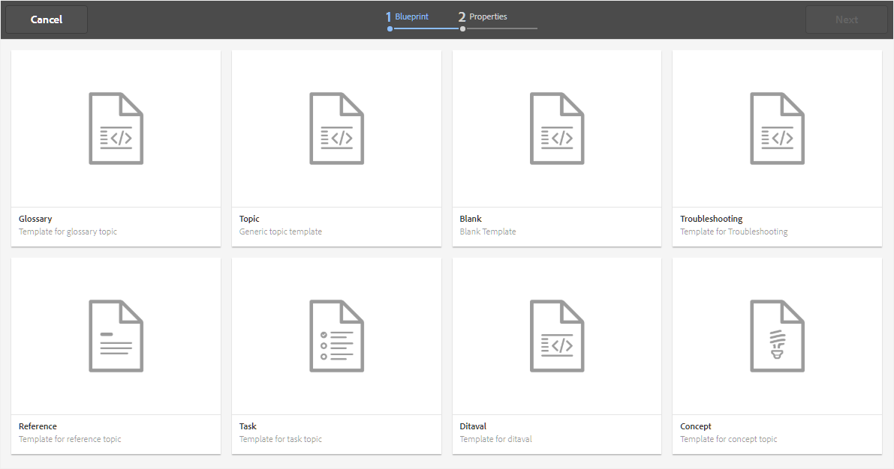

# Erstellen von Themen {#id2056AL00O5Z}

Mit AEM Guides können Sie DITA-Themen des Typs „Thema“, „Aufgabe“, „Konzept“, „Referenz“, „Glossar“, „DITAVAL“ und mehr erstellen. Sie können nicht nur Themen auf der Grundlage von vordefinierten Vorlagen erstellen, sondern auch benutzerdefinierte Vorlagen definieren. Diese Vorlagen müssen dem Profilordner hinzugefügt werden, damit sie in der Blueprint zur Vorlagenauswahl und im Web-Editor angezeigt werden.

Beachten Sie, dass die Konfiguration globaler und Ordnerprofile nur für Administratoren auf Ordnerebene verfügbar ist. Weitere Informationen zum Einrichten globaler Profile und Profile auf Ordnerebene finden Sie unter *Konfigurieren von Authoring-Vorlagen* unter Installieren und Konfigurieren von Adobe Experience Manager Guides für Ihr Setup.

Führen Sie die folgenden Schritte aus, um ein Thema zu erstellen:

1. Navigieren Sie in der Assets-Benutzeroberfläche zu dem Speicherort, an dem Sie das Thema erstellen möchten.

1. Um ein neues Thema zu erstellen, klicken Sie auf **Erstellen** \> **DITA-Thema**.

1. Wählen Sie auf der Blueprint-Seite den Typ des zu erstellenden DITA-Dokuments aus und klicken Sie auf **Weiter**.

   {width="800"}

   Standardmäßig stellt AEM Guides die am häufigsten verwendeten DITA-Themenvorlagen bereit. Weitere Themenvorlagen können entsprechend Ihren Unternehmensanforderungen konfiguriert werden. Weitere Informationen finden Sie unter *Konfigurieren von Authoring* Vorlagen in „Installieren und Konfigurieren von Adobe Experience Manager Guides für Ihr Setup“.

   >[!NOTE]
   >
   > In der Listenansicht der Assets-Benutzeroberfläche wird der DITA-Topic-Typ in der Spalte Typ als Thema, Aufgabe, Konzept, Referenz, Glossentry oder DITAVAL angezeigt. Die DITA-Karte wird als Karte angezeigt.

1. Geben Sie auf der Seite Eigenschaften das Dokument **Titel** an.

1. \(Optional\) Geben Sie die Datei **Name** an.

   Wenn Ihr Admin einen automatischen Dateinamen basierend auf einer UUID-Einstellung konfiguriert hat, wird die Option zum Angeben des Dateinamens nicht angezeigt. Ein UUID-basierter Dateiname wird der Datei automatisch zugewiesen.

   Wenn die Option zur Dateibenennung verfügbar ist, wird auch der Name basierend auf dem **Titel** Ihres Dokuments automatisch vorgeschlagen. Wenn Sie den Dokumentnamen manuell angeben möchten, stellen Sie sicher, dass **Name** keine Leerzeichen, Apostrophe oder geschweifte Klammern enthält und mit .xml oder.dita endet. Standardmäßig ersetzt AEM Guides alle Sonderzeichen durch Bindestriche. Best Practices für die Benennung von DITA-Dateien finden Sie im Abschnitt Dateinamen im Handbuch zu Best Practices.

1. Klicken Sie auf **Erstellen**. Die Meldung Thema erstellt wird angezeigt.

   Sie können das Thema zur Bearbeitung im Web-Editor öffnen oder die Themendatei im AEM-Repository speichern.

   Jedem neuen Thema, das Sie über die Assets-Benutzeroberfläche **Erstellen** \> **DITA-Thema** oder den Web-Editor erstellen, wird eine eindeutige Themen-ID zugewiesen. Der Wert dieser ID ist der Dateiname selbst. Außerdem wird ein neues Dokument als neueste Arbeitskopie des Themas in DAM gespeichert. Bis zum Speichern einer Revision eines neu erstellten Themas wird im Versionsverlauf keine Versionsnummer angezeigt. Wenn Sie das Thema zur Bearbeitung öffnen, werden die Versionsinformationen in der rechten oberen Ecke der Registerkarte der Themendatei angezeigt:

   {width="550"}

   Die Versionsinformationen für ein neu erstelltes Thema werden als *none* angezeigt. Wenn Sie eine neue Version speichern, wird ihr eine Versionsnummer als 1.0 zugewiesen. Weitere Informationen zum Speichern einer neuen Version finden Sie unter [Als neue Version speichern](web-editor-features.md#save-as-new-version-id209ME400GXA).

>[!NOTE]
>
> Wenn Ihr Admin Ihren Web-Editor so konfiguriert hat, dass Dateien vor der Bearbeitung ausgecheckt werden, können Sie eine Datei erst bearbeiten, nachdem Sie sie ausgecheckt haben. Ebenso werden Sie, falls konfiguriert, aufgefordert, alle ausgecheckten Dateien einzuchecken, bevor Sie sie schließen.

>[!IMPORTANT]
>
> Nachdem Sie Ihr DITA-Thema erstellt haben, speichern Sie die Änderungen in Ihrer Arbeitskopie weiter und erstellen Sie eine neue Version, sobald Sie die Aktualisierungen für Ihr Thema abgeschlossen haben.

**Übergeordnetes Thema:**&#x200B;[&#x200B; Erstellen und Vorschau von Themen](create-preview-topics.md)
