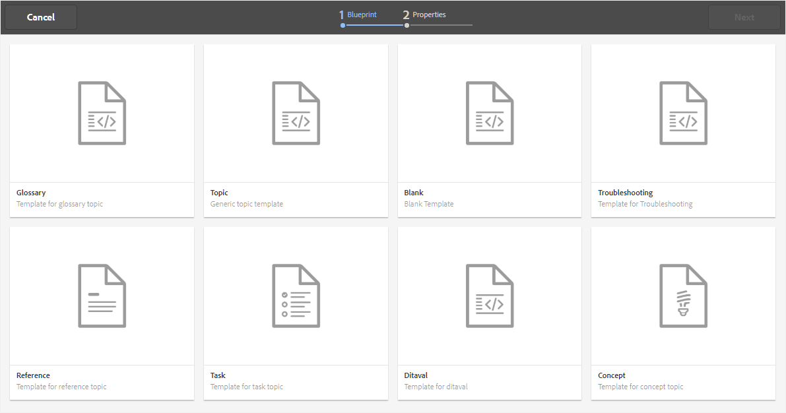

# Erstellen von Themen {#id2056AL00O5Z}

Mit AEM Guides können Sie DITA-Themen vom Typ - Thema, Aufgabe, Konzept, Referenz, Glossar, DITAVAL und mehr erstellen. Neben der Erstellung von Themen basierend auf vordefinierten Vorlagen können Sie auch benutzerdefinierte Vorlagen definieren. Diese Vorlagen müssen dem Ordnerprofil hinzugefügt werden, damit sie in der Vorlagenauswahl-Blueprint und im Web-Editor angezeigt werden.

Beachten Sie, dass die Konfiguration Globales Profil und Ordnerprofil nur für Administratoren auf Ordnerebene verfügbar ist. Weitere Informationen zum Einrichten von globalen Profilen und Profilen auf Ordnerebene finden Sie unter *Konfigurieren von Bearbeitungsvorlagen* in Installieren und Konfigurieren von Adobe Experience Manager Guides für Ihre Einrichtung.

Führen Sie die folgenden Schritte aus, um ein Thema zu erstellen:

1. Navigieren Sie in der Assets-Benutzeroberfläche zu dem Speicherort, an dem Sie das Thema erstellen möchten.

1. Um ein neues Thema zu erstellen, klicken Sie auf **Erstellen** \> **DITA-Thema**.

1. Wählen Sie auf der Blueprint-Seite den Typ des DITA-Dokuments aus, das Sie erstellen möchten, und klicken Sie auf **Weiter**.

   {width="800" align="left"}

   Standardmäßig stellt AEM Guides die am häufigsten verwendeten DITA-Themenvorlagen bereit. Sie können entsprechend Ihren organisatorischen Anforderungen weitere Themenvorlagen konfigurieren. Informationen dazu finden Sie unter *Konfigurieren von Bearbeitungsvorlagen* in Installieren und Konfigurieren von Adobe Experience Manager Guides für Ihre Einrichtung.

   >[!NOTE]
   >
   > In der Listenansicht der Assets-Benutzeroberfläche wird der DITA-Thementyp in der Spalte Typ als Thema, Aufgabe, Konzept, Referenz, Glossar oder DITAVAL angezeigt. Die DITA-Karte wird als Karte angezeigt.

1. Geben Sie auf der Seite Eigenschaften das Dokument **Titel** an.

1. \(Optional\) Geben Sie die Datei **Name** an.

   Wenn Ihr Administrator einen automatischen Dateinamen basierend auf der UUID-Einstellung konfiguriert hat, wird Ihnen die Option zum Angeben des Dateinamens nicht angezeigt. Der Datei wird automatisch ein UUID-basierter Dateiname zugewiesen.

   Wenn die Dateibenennungsoption verfügbar ist, wird auch der Name basierend auf dem **Titel** Ihres Dokuments automatisch vorgeschlagen. Wenn Sie den Dokumentnamen manuell angeben möchten, stellen Sie sicher, dass der **Name** keine Leerzeichen, Apostroph oder Klammern enthält und mit .xml oder .dita endet. Standardmäßig ersetzt AEM Guides alle Sonderzeichen durch Bindestriche. Best Practices zum Benennen von DITA-Dateien finden Sie im Abschnitt Dateinamen im Best Practices-Handbuch .

1. Klicken Sie auf **Erstellen**. Die Meldung Thema erstellt wird angezeigt.

   Sie können das Thema zur Bearbeitung im Web-Editor öffnen oder die Themendatei im AEM Repository speichern.

   Jedem neuen Thema, das Sie über die Assets-Benutzeroberfläche **Erstellen** \> **DITA-Thema** oder den Web Editor erstellen, wird eine eindeutige Themen-ID zugewiesen. Der Wert dieser ID ist der Dateiname selbst. Außerdem wird ein neues Dokument als neueste Arbeitskopie des Themas in DAM gespeichert. Bis Sie eine Revision eines neu erstellten Themas speichern, wird keine Versionsnummer im Versionsverlauf angezeigt. Wenn Sie das Thema zur Bearbeitung öffnen, werden die Versionsinformationen in der rechten oberen Ecke der Registerkarte der Themendatei angezeigt:

   {width="550" align="left"}

   Die Versionsinformationen für ein neu erstelltes Thema werden als *none* angezeigt. Wenn Sie eine neue Version speichern, wird ihr die Versionsnummer 1.0 zugewiesen. Weitere Informationen zum Speichern einer neuen Version finden Sie unter [Als neue Version speichern](web-editor-features.md#save-as-new-version-id209ME400GXA).

>[!NOTE]
>
> Wenn Ihr Administrator Ihren Web-Editor so konfiguriert hat, dass Dateien vor der Bearbeitung ausgecheckt werden, können Sie eine Datei erst bearbeiten, wenn Sie sie auschecken. Ebenso werden Sie bei entsprechender Konfiguration aufgefordert, eine ausgecheckte Datei einzuchecken, bevor Sie sie schließen.

>[!IMPORTANT]
>
> Nachdem Sie Ihr DITA-Thema erstellt haben, speichern Sie die Änderungen in Ihrer Arbeitskopie und erstellen Sie eine neue Version, sobald Sie die Aktualisierungen an Ihrem Thema abgeschlossen haben.

**Übergeordnetes Thema:**[ Themen erstellen und in der Vorschau anzeigen](create-preview-topics.md)
