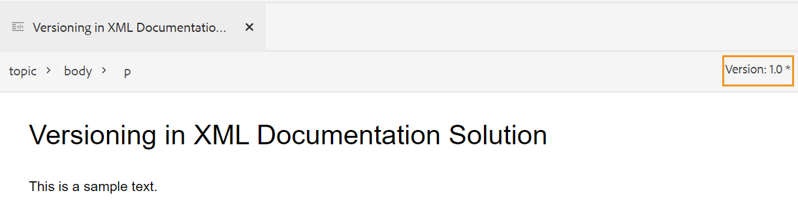

# Bearbeiten von Themen im Web-Editor {#id2056B040VUI}

Der Web Editor verfügt über eine Reihe von Bearbeitungsfunktionen, mit denen Sie Themendateien einfach erstellen oder ändern können. Im Großen und Ganzen führen Sie die folgenden Schritte aus, um ein Thema im Web Editor zu bearbeiten.

>[!IMPORTANT]
>
> Wenn bei der Arbeit mit dem Web Editor ein Anwendungsfehler auftritt, aktualisieren Sie die Seite, damit sie weiterhin funktioniert.

1. Um Änderungen an Ihrem Thema vorzunehmen, klicken Sie auf den Textbereich des erforderlichen Elements und nehmen Sie Änderungen vor.

1. Um ein bestimmtes Element einzufügen, klicken Sie auf das Ende des Elements, nach dem Sie das neue Element einfügen möchten, und klicken Sie in der Symbolleiste auf das Symbol für das gewünschte Element. Sie können auch den Tastaturbefehl `Alt+Enter` verwenden, um das Popup-Fenster **Element einfügen** aufzurufen.

   Es wird eine Liste mit Elementen angezeigt, die im Thema verwendet werden können. AEM Guides führt eine intelligente Platzierung von Elementen gemäß ihrer gültigen Position im Thema durch.

   >[!NOTE]
   >
   > Sie können auch auswählen, welches Symbol in der Symbolleiste angezeigt werden soll, indem Sie die Datei &quot;`ui_config.json`&quot;unter &quot;- `/etc/designs/fmdita/clientlibs/xmleditor/`&quot;konfigurieren. Weitere Informationen zum Anpassen von Funktionen erhalten Sie von Ihrem Systemadministrator.

1. Nachdem Sie die Bearbeitung des Dokuments abgeschlossen haben, klicken Sie auf **Speichern**.

   >[!NOTE]
   >
   > Wenn Sie keine Änderungen in AEM Repository übertragen möchten, klicken Sie auf **Schließen** und dann im Dialogfeld &quot;Nicht gespeicherte Änderungen&quot;auf **Schließen ohne Speichern** .

## Teilauswahl von Inhalten über Elemente hinweg

In Experience Manager Guides können Sie auch Inhalte über Elemente hinweg auswählen. Nach Auswahl des Inhalts können Sie die folgenden Vorgänge ausführen:

- Formatierung und Löschen: Machen Sie den ausgewählten Inhalt fett, kursiv, unterstrichen oder löschen Sie ihn sogar. Der Inhalt der gültigen offenen Tags wird dann zusammengeführt und unter einem einzelnen Element angezeigt. Sie können beispielsweise den Inhalt eines Absatzes auswählen und die Auswahl auf einen anderen Absatz erweitern. Wenn Sie dann den ausgewählten Inhalt fett formatieren, werden alle fett gedruckten Inhalte der geöffneten Tags zusammengeführt und unter einem einzigen Absatzelement angezeigt.

Wenn Sie den ausgewählten Inhalt löschen, wird der verbleibende Inhalt nach dem Löschen in den geöffneten Tags zusammengeführt.

- Um den Inhalt mit einem gültigen Element zu umgeben: Führen Sie die folgenden Schritte aus, um den Inhalt mit einem gültigen Element zu umgeben:

   - Wählen Sie den Inhalt eines Elements aus.
   - Wählen Sie in der sekundären Symbolleiste oben das Symbol  aus, um das Dialogfeld **Umgeben mit Element** anzuzeigen. Im Dialogfeld werden die gültigen Elemente für den ausgewählten Inhalt aufgelistet.
     >[!NOTE]
     >
     > Sie können auch das Dialogfeld Umfrage mit Element anzeigen, indem Sie das Kontextmenü des ausgewählten Inhalts auswählen.

   - Wählen Sie im Dialogfeld ein Element aus. Der ausgewählte Inhalt wird unter diesem Element eingeschlossen. Wenn Sie beispielsweise den Inhalt in einem Absatz auswählen und dann das Element `<note>` aus dem Dialogfeld **Mit Element umgeben** wählen, wird der ausgewählte Inhalt unter einem Hinweis angezeigt.\
      {width="300" align="left"}

## Aktualisieren des Browsers beim Bearbeiten der Dateien

Experience Manager Guides unterstützt die Aktualisierung des Browsers während der Bearbeitung des Inhalts im Web-Editor. Mit dieser Funktion können Sie die Bearbeitung von Inhalten fortsetzen, falls bei der Arbeit ein Anwendungsfehler auftritt. Wenn Sie auf die Browseraktualisierung klicken, während eine oder mehrere Dateien mit nicht gespeicherten Änderungen zur Bearbeitung geöffnet sind, werden Sie gewarnt, dass die nicht gespeicherten Änderungen möglicherweise verloren gehen. Sie erhalten die Möglichkeit, den Aktualisierungsvorgang abzubrechen und Ihre Dateien zu speichern, um Ihre Änderungen beizubehalten.

Selbst beim Aktualisieren des Browsers werden die Ansichten des linken und des rechten Bereichs im Web Editor beibehalten. Experience Manager Guides stellt beim Aktualisieren des Browsers den zuletzt gespeicherten Status der im Web Editor geöffneten Dateien wieder her. Beispielsweise werden die im Repository-Bedienfeld geöffneten Dateien erneut geöffnet. Das Zuordnungsbedienfeld wird zusammen mit der zuvor geöffneten Karte beibehalten.

Das aktive Thema oder die DITA-Zuordnung wird im Inhaltsbearbeitungsbereich erneut geöffnet.

Das rechte Bedienfeld wird ebenfalls neu geöffnet und zeigt dieselbe Ansicht an wie vor der Aktualisierung.

## Arbeitskopierer

AEM Guides bietet die Arbeitskopie-Anzeige, die anzeigt, ob die aktuelle \(Arbeitskopie\) der Datei mit der gespeicherten Version synchronisiert ist oder nicht. Wenn Sie Änderungen an Ihrer aktuellen Kopie vorgenommen und Ihre Datei nicht gespeichert haben, wird auf der Registerkarte &quot;Datei&quot;des Themas ein \*-Zeichen mit dem Titel angezeigt. Dieser Indikator dient als Erinnerung, um Ihre Änderungen zu speichern, und verschwindet, wenn Sie Ihre Datei speichern.

{width="550" align="left"}

AEM Guides gibt auch an, ob die letzte gespeicherte \(Work\) Kopie der Datei mit der gespeicherten Version synchronisiert ist oder nicht. Wenn Sie einige nicht gespeicherte Änderungen zwischen der Arbeitskopie und der zuletzt gespeicherten Version haben, wird ein \*-Zeichen zusammen mit den Versionsinformationen angezeigt, die in der rechten oberen Ecke der Registerkarte &quot;Datei&quot;des Themas angezeigt werden. Dieser Indikator dient als Erinnerung zum Speichern und Erstellen einer Version aus Ihrer aktuellen \(funktionierenden\) Kopie der Datei.

{width="550" align="left"}

## Öffnen gesperrter Dateien im Authoring- und Source-Modus

Wenn eine DITA- oder Markdown-Datei von einem anderen Benutzer gesperrt oder ausgecheckt wird, ist das Bearbeiten oder Ändern des Inhalts nicht möglich. Sie können die Datei jedoch zusätzlich zum Modus **Vorschau** weiterhin im schreibgeschützten Format sowohl im Modus **Autor** als auch im Modus **Source** anzeigen.

Im schreibgeschützten Modus können Sie Inhalt, Tags und Attribute im Modus **Autor** oder **Source** anzeigen. Sie können auch die Dateieigenschaften ändern.

In der Symbolleiste werden die folgenden Symbole für schreibgeschützten Zugriff angezeigt:

- Ansicht &quot;Tags ein/aus&quot;
- Versionsverlauf
- Versions-Label

Experience Manager Guides zeigt außerdem einen Indikator **Schreibgeschützter Zugriff** neben der Versionsnummer an.

Sie können auf die Ansicht **Layout** für schreibgeschützte DITA-Maps zugreifen. In dieser Ansicht können Sie die DITA-Zuordnung und ihre Eigenschaften anzeigen, aber Bearbeitungen verhindern.

>[!NOTE]
>
> Ihre Benutzer mit Administratorrechten auf Ordnerebene müssen *ui_config.json* aktualisieren, damit Sie harmonisch auf die schreibgeschützten Dateien im Author-, Source- und Layout-Modus zugreifen können.

## Suchen einer geöffneten Datei in der Repository-Ansicht

Während Sie eine Datei im Web Editor öffnen, bietet Experience Manager Guides die Funktion zum Suchen der Datei in der Repository-Ansicht. Beispielsweise wird das aktuelle Thema beim Bearbeiten gesucht.

Sie können die Funktion deaktivieren, um die Datei mit der Option **Dateien im Repository immer suchen** auf der Registerkarte **Erscheinungsbild** der **Benutzereinstellungen** zu finden.

**Übergeordnetes Thema:**[ Arbeiten mit dem Web-Editor](web-editor.md)
