# Die Funktionen des Web-Editors kennen {#id176NC500V5Z}

Dieser Abschnitt führt Sie durch die verschiedenen Funktionen, die im Web-Editor verfügbar sind. Wir können den Web-Editor in die folgenden Abschnitte oder Bereiche unterteilen:

- [Haupt-Symbolleiste](#id2051EA0G05Z)
- [Sekundäre Symbolleiste](#id2051EA0J0Y4)
- [Linkes Bedienfeld](#id2051EA0M0HS)
- [Inhaltsbearbeitungsbereich](#id2051EB000UI)
- [Rechtes Bedienfeld](#id2051EB003YK)

Im folgenden Unterabschnitt werden die verschiedenen Abschnitte des Web-Editors detailliert beschrieben.

## Haupt-Symbolleiste {#id2051EA0G05Z}

Die Hauptsymbolleiste befindet sich am oberen Rand der Benutzeroberfläche des Web-Editors und bietet Funktionen auf Dateiebene und verschiedene Authoring-Modi, die im Web-Editor verfügbar sind. Die in der oberen Symbolleiste verfügbaren Funktionen werden wie folgt erläutert:

**Alle speichern** - 

Speichert die von Ihnen vorgenommenen Änderungen in allen geöffneten Themen. Wenn mehrere Themen im Web-Editor geöffnet sind und Sie auf **Alle speichern** klicken oder die Tastenkombinationen **Strg**+**S** verwenden, werden alle Dokumente mit einem Klick gespeichert. Sie müssen nicht jedes Dokument einzeln speichern.

>[!NOTE]
>
> Mit dem Speichervorgang wird keine neue Version der Themen erstellt. Um eine neue Version zu erstellen, wählen Sie Als neue Version speichern.

**Als neue Version speichern** - 

Speichert die im Thema vorgenommenen Änderungen und erstellt außerdem eine neue Version des Themas. Wenn Sie an einem neu erstellten Thema arbeiten, werden die Versionsinformationen als &quot;**&quot;**.

{width="800" align="left"}

Die Versionsnummer ändert sich mit jeder neuen Version, die für das Thema oder die Zuordnungsdatei erstellt wird.

Wenn Sie ein Thema oder eine Zuordnung mit „Als **Version speichern“**, wird das folgende Dialogfeld angezeigt:

{width="300" align="left"}

Geben Sie Kommentare und Versionsbezeichnungen ein, um die Änderungen zu identifizieren, und **Sie auf** Speichern“, um eine neue Version Ihrer Datei zu erstellen.

Wenn Sie die Option *Als neue Version speichern* auswählen, wird die erste Version des Themas in DAM erstellt, was auch zur derzeit aktiven Version Ihres Themas wird. Wenn Sie später zu einer älteren Version des Themas zurückkehren, wird diese zu Ihrer aktuellen aktiven Version des Themas.

Wenn Ihr Administrator über vorkonfigurierte Versionsbezeichnungen verfügt, sehen Sie diese Bezeichnungen in einer Dropdown-Liste. Sie können einen Titel aus der Liste der verfügbaren Bezeichnungen auswählen und Ihr Dokument speichern.

{width="300" align="left"}

Beim Speichern eines Themas können Sie einen Kommentar hinzufügen, der die im Thema vorgenommenen Änderungen angibt. Dieser Kommentar wird im Versionsverlauf des Themas angezeigt.

Wenn Ihr Thema überprüft wird, erhalten Ihre Reviewer eine Benachrichtigung, dass eine neuere Version des Themas verfügbar ist. Er kann einfach auf die neueste Version Ihres Dokuments zugreifen und mit der Überprüfung der neuesten Version Ihres Themas fortfahren.

Wenn Sie den Mauszeiger über den Titel eines Themas bewegen, werden der Dateipfad und die Versionsnummer angezeigt.

{width="800" align="left"}

>[!NOTE]
>
> Sobald eine Version Ihres Themas verfügbar ist, können Sie Ihrem Thema auch Beschriftungen hinzufügen. Diese Beschriftungen können dann verwendet werden, um eine Grundlinie für die Veröffentlichung einer bestimmten Version Ihres Dokuments zu erstellen. Weitere Informationen zur Verwendung von Beschriftungen in Ihren Themen finden Sie unter [Verwenden von Beschriftungen](web-editor-use-label.md#).

**Rückgängig und Wiederholen** - /

Letzte Aktion rückgängig machen oder wiederholen.

**Element löschen** - 

Löscht das aktuell ausgewählte Element oder das Element, in dem sich der Cursor befindet.

**Suchen und Ersetzen** - 

Die Funktion zum Suchen und Ersetzen ist im Authoring- und Source-Ansichtsmodus verfügbar. Die Textleiste Suchen und Ersetzen wird am unteren Rand des Themenbearbeitungsbereichs angezeigt. Sie können die Tastenkombinationen (**+**+**F) verwenden** um die Leiste „Suchen und Ersetzen“ aufzurufen.

{width="800" align="left"}

Über das Einstellungssymbol \(\) können Sie die Suchoptionen **Groß-/Kleinschreibung ignorieren** und **Nur ganzes Wort** umschalten. Um die Suche ohne Berücksichtigung der Groß-/Kleinschreibung durchzuführen, aktivieren Sie die Option \(oder wählen Sie\) **Groß-/Kleinschreibung ignorieren**. Andernfalls müssen Sie, wenn Sie die Suche unter Berücksichtigung der Groß-/Kleinschreibung durchführen möchten, die Option \(oder deselect\) **Groß-/Kleinschreibung ignorieren** deaktivieren. Sie können auch ein ganzes Wort suchen.

Die Suche erfolgt sofort, d. h. wenn Sie den Suchbegriff oder das Wort in das Feld **Suchen** eingeben, wird der Begriff sofort durchsucht und im Thema ausgewählt. Um einen Text in Ihrem Thema zu ersetzen, geben Sie den Suchbegriff und seine Ersetzung in die entsprechenden Felder ein und klicken Sie auf die Schaltfläche **Ersetzen** oder **Alle ersetzen**.

In der Source-Ansicht ist Suchen und Ersetzen extrem nützlich für die Suche nach einem bestimmten Element oder Attribut. Wenn Sie beispielsweise den Wert des `@product`-Attributs ersetzen möchten, kann dies einfach über die Source-Ansicht erfolgen. In der Autorenansicht können Sie nicht anhand eines Attributs oder Elements suchen. Bei Verwendung der Funktion „Alle ersetzen **müssen Sie jedoch mit Vorsicht vorgehen** da dadurch der XML-Code überschrieben werden könnte.

**Editor-Einstellungen** - 

Die Editor-Einstellungen stehen nur Benutzenden mit Administratorrechten zur Verfügung. Unter Verwendung der Voreinstellungen kann ein Administrator die folgenden Einstellungen konfigurieren:

>[!NOTE]
>
> Wenn Sie Standardeinstellungen aktualisieren, sollten Sie die Dokumente erneut öffnen, damit die Änderungen wirksam werden.

- **Allgemein**: Mit den allgemeinen Einstellungen können Sie das Wörterbuch konfigurieren, das mit dem Web-Editor verwendet werden soll. Diese Registerkarte enthält drei Abschnitte: **Rechtschreibprüfung**, **Bedingung** und **Authoring**.

  {width="650" align="left"}

   - **Rechtschreibprüfung**: Es gibt zwei Optionen: **AEM-** und **Browser-**. Standardmäßig verwendet der Editor die Rechtschreibprüfung des Browsers, wobei die Rechtschreibprüfung mit dem integrierten Wörterbuch des Browsers durchgeführt wird. Sie können zur AEM-Rechtschreibprüfung wechseln, um das AEM-Wörterbuch zu verwenden, das auch angepasst werden kann, um Ihre benutzerdefinierte Wortliste hinzuzufügen. Weitere Informationen zum Anpassen des AEM-Wörterbuchs finden Sie *Abschnitt „Anpassen des Standardwörterbuchs von AEM* im Abschnitt Installieren und Konfigurieren von Adobe Experience Manager Guides as a Cloud Service.


   - **Bedingung**

      - **Bedingten Text in der Autorenansicht hervorheben**: Wählen Sie diese Option, um den bedingten Text in der Autorenansicht hervorzuheben. Der bedingte Inhalt wird mit der für die Bedingung definierten Farbe hervorgehoben.

      - **Mit Bedingungsattributen validieren**: Wählen Sie diese Option, um die Validierung der für die Attribute definierten Werte zu ermöglichen. Dadurch wird verhindert, dass Sie einen falschen Wert hinzufügen.

      - **Schlüssel mit Titel im Bedienfeld „Betreffschema“ anzeigen**: Wählen Sie diese Option aus, um die Schlüssel zusammen mit den Titeln im Betreffschema anzuzeigen. Wenn Sie diese Option nicht auswählen, werden nur die Titel angezeigt. Hier werden beispielsweise die Schlüssel „os“, „audience“ und „other“ zusammen mit Titeln angezeigt.

        {width="550" align="left"}

      - **Betreffschema im Bedienfeld „Bedingungen“ anzeigen**: Wählen Sie diese Option, um ein Betreffschema im Bedienfeld „Bedingungen“ anzuzeigen. Wenn Sie diese Option deaktivieren, werden die definierten Bedingungen im Bedienfeld Bedingungen angezeigt.

   - **Authoring**

      - **Alle ersetzen aktivieren**: Wählen Sie diese Option aus, um das Symbol „Alle ersetzen“ im Bedienfeld „Suchen und Ersetzen“ anzuzeigen.


   - **Zitate**
Ändern des Stils von Zitaten. Wählen Sie in der Dropdown-Liste den Zitatstil aus, den Sie in Ihrem Projekt verwenden möchten. Weitere Informationen finden Sie unter [Ändern von Zitierstilen](./web-editor-apply-citations.md#change-citation-style).


**Bedienfelder**: Mit dieser Einstellung werden die Bedienfelder gesteuert, die im linken Bedienfeld des Editors angezeigt werden. Sie können den Schalter umschalten, um das gewünschte Bedienfeld ein- oder auszublenden.

{width="650" align="left"}

>[!NOTE]
>
> Wenn ein benutzerdefiniertes Bedienfeld konfiguriert wurde, wird es auch in der Liste der Bedienfelder angezeigt. Sie können den Schalter umschalten, um das benutzerdefinierte Bedienfeld ein- oder auszublenden. Weitere Informationen zur Konfiguration finden Sie im Abschnitt *Konfigurieren eines benutzerdefinierten Bedienfelds im linken Bedienfeld* unter Installieren und Konfigurieren von Adobe Experience Manager Guides as a Cloud Service.

- **Elementliste**: Als Administrator können Sie die Liste der Elemente steuern, die ein Autor mithilfe des Popup-[Element einfügen](#id204SG30105Z) einfügen kann, und auch den Anzeigenamen für das Element definieren. Mit der Einstellung Elementliste können Sie den Namen des Elements gemäß DITA-Spezifikationen und eine Beschriftung angeben, die Sie anstelle des von DITA definierten Elementnamens verwenden möchten:

  {width="650" align="left"}

Im obigen Screenshot wurde dem `b` Element die Beschriftung Fett zugewiesen, `codeblock` neben einigen anderen Elementen die Beschriftung Code-Block. Wenn Sie die Option **Nur übergeordnete Elemente verwenden** auswählen, werden nur die gültigen Elemente \(bei der aktuellen Einfügemarke\) aus dieser Liste im Popup-Fenster Element einfügen angezeigt.

Im folgenden Screenshot werden im aktuellen Kontext nur 3 von 4 konfigurierten Elementen aus dem vorherigen Screenshot angezeigt:

{width="300" align="left"}

- **Attributliste**: Ähnlich wie bei der Elementliste können Sie die Liste der Attribute und deren Anzeigenamen steuern, die in der Attributliste eines Elements angezeigt werden sollen. Im folgenden Screenshot wurden nur drei Attribute so konfiguriert, dass sie in der Attributliste eines Elements angezeigt werden:

  {width="650" align="left"}

  Bei dieser Einstellung wird beim Versuch, einem Element ein Attribut hinzuzufügen, nur die Liste der in der Liste konfigurierten Attribute angezeigt.

  {width="300" align="left"}

- **Veröffentlichungsprofil**: Enthält die Veröffentlichungsprofile, die zum Veröffentlichen der Ausgabe der **Wissensdatenbank** verwendet werden können. Sie können ein neues Profil für eine Ziel-Wissensdatenbank erstellen. Beispiel: Salesforce oder ServiceNow.

   - **Erstellen eines Salesforce-Veröffentlichungsprofils**

     **Voraussetzungen**

      - Erstellen Sie eine verbundene App für Salesforce. Weitere Informationen finden Sie unter [OAuth-Einstellungen für API-Integration aktivieren](https://help.salesforce.com/s/articleView?id=sf.connected_app_create_api_integration.htm&amp;type=5).

      - Stellen Sie beim Konfigurieren der verbundenen App Folgendes sicher:

         - Geben Sie den Callback an.

           `URL: http://<server name>:<port>/bin/dxml/thirdparty/callback/salesforce`

         - Wählen Sie die folgenden OAuth-Bereiche aus:
            - Vollständiger Zugriff (vollständig)
            - Wählen Sie Benutzerdaten über APIs verwalten (API) aus

  Sobald die App konfiguriert ist, stellt Salesforce einen **Consumer Key** und **Consumer Secret** bereit.

  Diese können zum Erstellen des Salesforce-Veröffentlichungsprofils verwendet werden.


   - Um ein Salesforce-Veröffentlichungsprofil zu erstellen, wählen Sie die **Salesforce** Knowledge Base aus der Dropdown-Liste **Server-Typ** aus. Geben Sie einen Profilnamen ein. Geben Sie **Site-URL** die Verbraucherwebsite ein, mit der Sie die Ausgabe veröffentlichen möchten, und fügen Sie dann den **Consumer Key** und **Consumer Secret** hinzu, die von der Salesforce-Verbraucherwebsite bereitgestellt werden. Wählen Sie dann **Validieren** und **Speichern** das neu erstellte Profil aus.
     {width="550" align="left"}

     >[!NOTE]
     >
     >Verwenden Sie zum Konfigurieren eines Proxys für Salesforce in Experience Manager Guides die Apache-HTTP-Komponenten-Proxy-Konfiguration in AEM. Erfahren Sie, wie [Proxy für den AEM Link Checker konfigurieren](https://helpx.adobe.com/experience-manager/kb/How-to-configure-proxy-for-the-AEM-Link-Checker-AEM.html).


   - **Erstellen eines ServiceNow-Veröffentlichungsprofils**

     **Voraussetzungen**

     Konfigurieren Sie den ServiceNow-Server, um die Assets hochzuladen.
      - Stellen Sie eine Verbindung mit dem **ServiceNow**-Server her.
      - Navigieren Sie **Systemeigenschaften** > **Sicherheit**.
      - Deaktivieren Sie die folgende Option:

        **Diese Eigenschaft muss so eingestellt sein, dass die MIME-Typprüfung für Uploads (alle Versionen von Eureka und höher) aktiviert wird. Aktiviert (true) oder deaktiviert (false) die Validierung des MIME-Typs für die Dateianhänge. Dateierweiterungen, die über glide.attachment.extensions konfiguriert werden, werden während des Uploads auf MIME-Typ überprüft.**

      - Klicken Sie auf **Speichern**.

     Nachdem Sie die App konfiguriert haben, erstellen Sie das **ServiceNow**-Veröffentlichungsprofil.
   - Um ein Veröffentlichungsprofil zu erstellen, wählen Sie die ServiceNow-Wissensdatenbank aus der Dropdown-Liste **Servertyp** aus. Geben Sie ein Profil **Name** ein. Geben Sie unter **ServiceNow** URL die Verbraucherwebsite ein, die Sie für die Veröffentlichung der Ausgabe verwenden möchten, und fügen Sie dann den **Benutzernamen** und das **Kennwort** hinzu, die von der ServiceNow-Verbraucherwebsite bereitgestellt werden. Wählen Sie dann **Validieren** und **Speichern** das neu erstellte Profil aus.

     {width="550" align="left"}

  Nach der Validierung können Sie das Veröffentlichungsprofil in den Ausgabevorgaben einer DITA-Zuordnung auswählen und es zum Generieren der Ausgabe für den ausgewählten **Salesforce**- oder **ServiceNow**-Server verwenden.

  Erfahren Sie mehr über die [Wissensdatenbank](../user-guide/generate-output-knowledge-base.md)-Ausgabevorgabe.


- **Validierung**: Diese Registerkarte enthält Optionen zum Konfigurieren der Schematron-Validierungen im Web-Editor. Sie können die folgenden Funktionen aktivieren:

   - **Validierungsprüfung vor dem Speichern der Datei ausführen**: Wählen Sie diese Option, um vor einem Speichervorgang Schematron-Validierungen unter Verwendung der ausgewählten Schematron-Datei(en) auszuführen. Sie können eine Schematron-Datei hinzufügen, indem Sie auf das Plussymbol (+) klicken. Die ausgewählten Schematron-Dateien werden aufgelistet.

     >[!NOTE]
     >Die ausgewählte(n) Schematron-Datei(en) bleiben für das ausgewählte Ordnerprofil erhalten.

     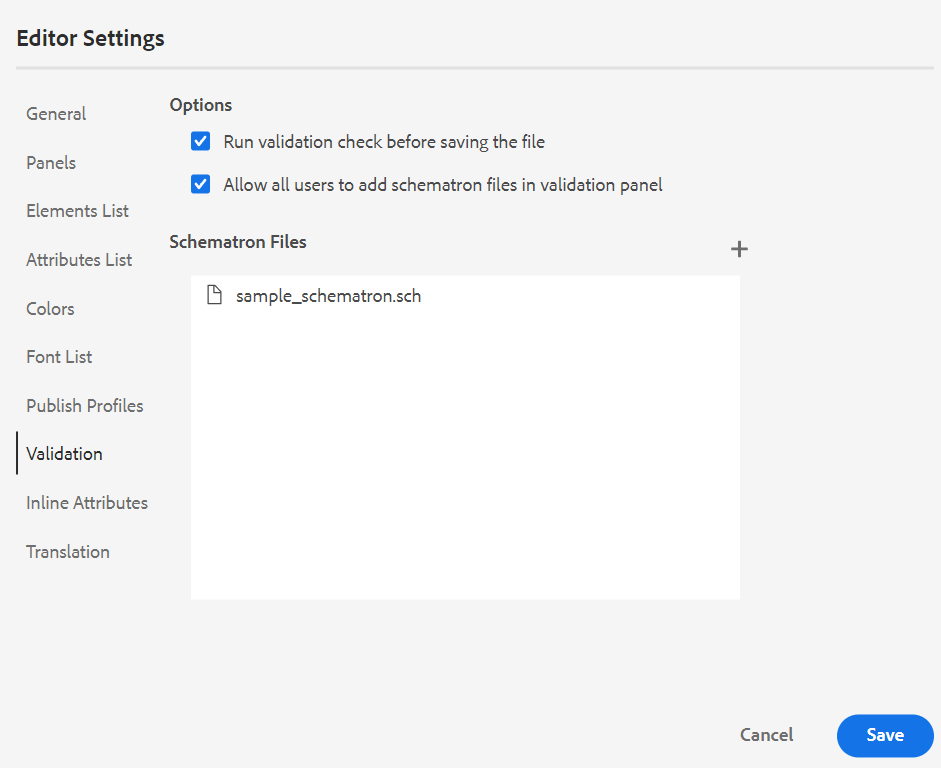{width="550" align="left"}
Dies verhindert, dass Benutzer eine Datei speichern, die gegen eine in der/den ausgewählten Schematron-Datei(en) definierte Regel verstößt. Wenn diese Option nicht ausgewählt ist, wird die Datei vor dem Speichern der Änderungen nicht validiert.

   - **Zulassen, dass alle Benutzer Schematron-Dateien im Validierungsbereich hinzufügen**: Wählen Sie diese Option aus, damit die Benutzer im Validierungsbereich des Web-Editors beliebige Schematron-Dateien hinzufügen können. Auf diese Weise können Benutzer Schematron-Dateien hinzufügen und dann die Themen anhand der Schematron-Datei validieren. Ist diese Option nicht ausgewählt **steht die Schaltfläche** Schematrondatei hinzufügen“ den Benutzenden im **Validierungsbereich** des Web-Editors nicht zur Verfügung.


- **Attribute anzeigen**: Wie die Attributliste können Sie die Liste der Attribute steuern, die in der Attributliste eines Elements angezeigt werden sollen. Standardmäßig wurden vier **Anzeigeattribute** - Zielgruppe, Plattform, Produkt und Eigenschaften so konfiguriert, dass sie in der Attributliste eines Elements angezeigt werden. Sie können ein Anzeigeattribut auch mit dem Symbol **Hinzufügen** oben hinzufügen. Sie können auch jedes der Anzeigeattribute über das Symbol **Löschen** löschen.

  Die für ein Element definierten Attribute werden im Layout- und Gliederungsansicht angezeigt.

  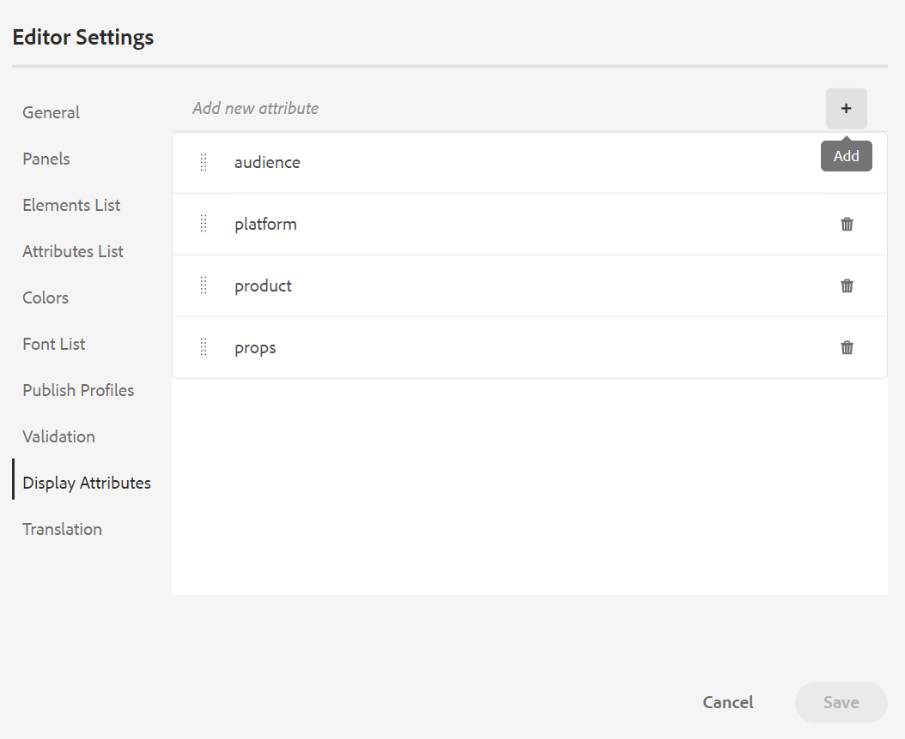{width="550" align="left"}

- **Übersetzung**: Diese Registerkarte enthält die Optionen zum Erstellen von Sprachgruppen, zum Übertragen der Quellkennzeichnungen in die Zielversion und zum Bereinigen des Übersetzungsprojekts.
  {width="550" align="left"}

   - **Sprachgruppen**: Als Administrator können Sie eine Gruppe von Sprachen erstellen und sie als Gruppe verwenden, um die Inhalte zu übersetzen.\
     Führen Sie die folgenden Schritte aus, um eine neue Sprachgruppe zu erstellen:
      1. Wählen Sie das Symbol  aus.
      1. Geben Sie den Namen der Sprachgruppe ein. Jede Sprache sollte einen eindeutigen Namen haben. Sie können einen Fehler anzeigen, wenn das Namensfeld leer oder der Name nicht eindeutig ist.
      1. Wählen Sie die Sprachen aus dem Dropdown-Menü aus. Sie können mehrere Sprachen auswählen.

     Geben Sie die ersten Zeichen der Sprache oder den Sprach-Code ein, um die gewünschten Sprachen zu filtern. Geben Sie beispielsweise „en“ ein, um alle Sprachen zu filtern, die „en“ am Anfang ihres Namens oder Codes enthalten.
      1. Wählen Sie **Fertig** aus, um der Gruppe die ausgewählten Sprachen hinzuzufügen. Die Sprachen werden angezeigt. Wenn Sie drei oder mehr Sprachen hinzufügen, wird **Mehr anzeigen** angezeigt. Sie können auf **Mehr anzeigen** klicken, um alle in der Gruppe vorhandenen Sprachen anzuzeigen.

         >[!TIP]
         >
         > Schalten Sie **Mehr anzeigen** auf **Weniger anzeigen** um und zeigen Sie nur einige Sprachen an.

      1. Bewegen Sie den Mauszeiger über die Sprachen in einer Gruppe, um Bearbeiten-Symbol.
      1. Speichern Sie die **Editor-Einstellungen**.

         >[!NOTE]
         >
         >Als Benutzer können Sie die für Ihr Ordnerprofil konfigurierten Sprachgruppen anzeigen.

   - **Beschriftungen der Quellversion an die Zielversion weitergeben**: Wählen Sie diese Option, um den Titel der Quelldateiversion an die übersetzte Datei weiterzugeben. Standardmäßig ist dies deaktiviert.
   - **Bereinigung des Übersetzungsprojekts nach Abschluss**: Wählen Sie diese Option, um die Übersetzungsprojekte so zu konfigurieren, dass sie nach der Übersetzung automatisch deaktiviert oder gelöscht werden. Standardmäßig ist **Keine** ausgewählt, sodass das Projekt nach der Übersetzung vorhanden ist.

     Sie können die Übersetzungsprojekte deaktivieren, wenn Sie sie später verwenden möchten. Durch das Löschen eines Projekts werden alle im Projekt vorhandenen Dateien und Ordner endgültig gelöscht.


- **Metadaten**: Sie können die Versionsmetadaten des Themas und deren Werte steuern, die im Dialogfeld „Versionsverlauf **angezeigt**.  Geben Sie im Metadatenpfad den Speicherort der Knoten an, aus denen Sie die Metadaten auswählen möchten. Sie können auch einen benutzerdefinierten Namen für die Metadaten als Beschriftung definieren. Die Standardeigenschaften sind Titel, Dokumentstatus und Tags.

  Die Metadaten können aus jeder Eigenschaft unter dem `/jcr:content` des Assets ausgewählt werden, sodass Sie den Pfad der Eigenschaft als Metadatenpfad hinzufügen können.


  Wenn der Metadatenpfad leer ist, wird ein Fehler angezeigt. Wenn Sie das Feld leer lassen, wird das letzte Element als Titel ausgewählt.


  {width="550" align="left"}

  *Konfigurieren der Metadaten für das Dialogfeld **Versionsverlauf**.*


  Sie können auch die Reihenfolge festlegen, in der diese Metadaten-Tags angezeigt werden. Um die Standardreihenfolge dieser Tags zu ändern, wählen Sie die gepunkteten Balken aus, um die Tags per Drag-and-Drop an die gewünschte Position zu ziehen.
Die Metadatenbeschriftungen werden in der gleichen Reihenfolge im **Versionsverlauf** des Web-Editors angezeigt.


**Benutzervoreinstellungen** - 

Die Benutzereinstellungen stehen allen Autoren zur Verfügung. Über die Voreinstellungen kann ein Autor die folgenden Einstellungen konfigurieren:


- **Allgemein** Auf der Registerkarte Allgemein können Sie die folgenden Einstellungen konfigurieren:

  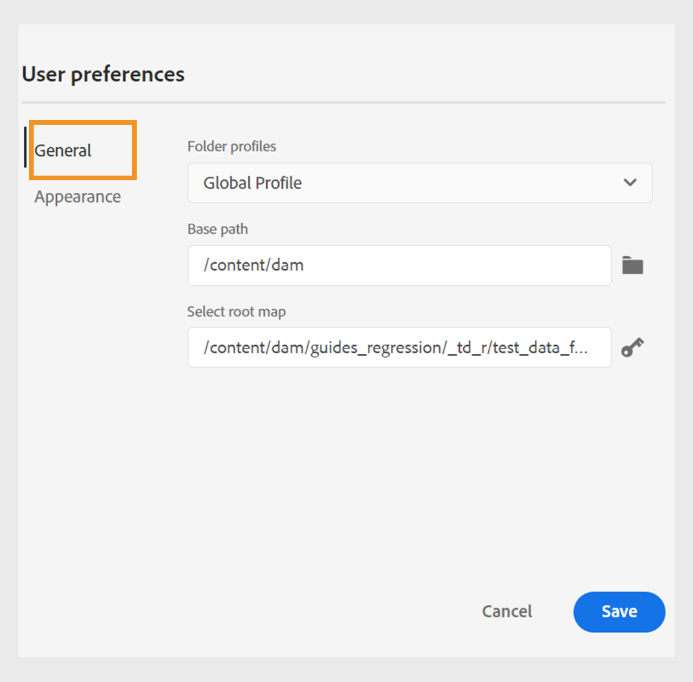{width="550" align="left"}

   - **Ordnerprofile**: Das Ordnerprofil steuert verschiedene Konfigurationen im Zusammenhang mit bedingten Attributen, Autorenvorlagen, Ausgabevorgaben und den Web-Editor-Konfigurationen. Das globale Profil wird standardmäßig angezeigt. Wenn Ihr Administrator Ordnerprofile im System konfiguriert hat, werden diese Ordnerprofile außerdem in der Liste Ordnerprofile angezeigt.

     Zu den Konfigurationen des Web-Editors, die ein Administrator im Ordnerprofil definieren kann, gehören: Anpassen der Benutzeroberfläche einschließlich der Symbolleistensymbole, das Layout des Web-Editors, Ausschnitte und Stammzuordnung. Weitere Informationen finden Sie unter *Konfigurieren von globalen Profilen oder Profilen auf Ordnerebene* im Abschnitt Installieren und Konfigurieren von Adobe Experience Manager Guides as a Cloud Service.

     >[!NOTE]
     >
     > Der Name des aktuellen Ordnerprofils wird als Bezeichnung für das Symbol Benutzereinstellungen in der Hauptsymbolleiste angezeigt.

   - **Basispfad**: Wenn Sie über den Web-Editor auf das AEM-Repository zugreifen, werden Ihnen standardmäßig Assets über den Speicherort /content/dam angezeigt. Ihr Arbeitsordner würde höchstwahrscheinlich aus einigen Ordnern im Ordner /content/dam/ bestehen. Es würde jedes Mal ein paar Klicks dauern, bis der Arbeitsordner erreicht ist. Sie können den Basispfad zu Ihrem Arbeitsordner festlegen und die Repository-Ansicht zeigt Ihnen dann den Inhalt von diesem Speicherort im Voraus an. Dadurch wird die Zeit für den Zugriff auf den Arbeitsordner verkürzt. Wenn Sie einen Verweis oder eine Mediendatei in Ihr Thema einfügen, beginnt der Dateispeicherort außerdem mit dem Ordner, der im Basispfad festgelegt ist.

   - **Stammzuordnung auswählen**: Wählen Sie eine DITA-Zuordnungsdatei aus, um Schlüsselverweise oder Glossareinträge aufzulösen. Die ausgewählte Stammzuordnung hat die höchste Priorität, um Schlüsselverweise aufzulösen. Weitere Informationen finden Sie unter [Auflösen von Schlüsselverweisen](map-editor-other-features.md#id176GD01H05Z).

     >[!NOTE]
     >    
     > Wenn Sie keine Stammzuordnung verwenden möchten, stellen Sie sicher, dass das Feld **Stammzuordnung auswählen** leer ist.

- **Erscheinungsbild**: Wählen Sie die Designs für die Web-Editor-Anwendung und die Quellansicht des Inhaltsbearbeitungsbereichs aus.

  {width="550" align="left"}

   - **Dateien anzeigen nach**: Wählen Sie die Standardmethode zum Anzeigen der Dateien im Web-Editor aus. Sie können die Liste der Dateien anhand der Titel oder der Dateinamen aus den verschiedenen Bedienfeldern in der Ansicht **Autor** anzeigen.

     >[!NOTE]
     >
     > Standardmäßig werden die Dateien nach Titel im Web-Editor angezeigt.

   - **Anwendungsdesign**: Sie können aus den **Hell** oder **Dunkel** Designs für die Anwendung wählen. Beim Design **Licht** verwenden die Symbolleisten und Bereiche einen hellgrauen Hintergrund. Beim Design &quot;**&quot; verwenden** Symbolleisten und Bereiche einen schwarzen Farbhintergrund. Wählen Sie **Gerätedesign verwenden**, damit Experience Manager Guides helle und dunkle Designs basierend auf dem Design Ihres Geräts auswählen kann.  Bei allen Designs wird der Inhaltsbearbeitungsbereich in der Ansicht **Autor“ mit weißem** angezeigt.

   - **Source-Ansichtsdesign**: - Sie können aus den **Hell**- oder **Dunkel**-Designs für den Inhaltsbearbeitungsbereich in der Quellansicht wählen. Beim Design **Light** wird im Inhaltsbearbeitungsbereich ein hellgrauer Farbhintergrund für die Quellansicht verwendet, während beim Design **Dark** ein schwarzer Farbhintergrund verwendet wird. Wählen Sie **Gerätedesign verwenden**, damit Experience Manager Guides helle und dunkle Designs basierend auf dem Design Ihres Geräts auswählen kann.

   - **Dateien immer im Repository suchen**: Wählen Sie diese Option, um den Speicherort einer Datei im Repository anzuzeigen, während sie im Web-Editor bearbeitet wird.

   - **Anzeige der Leerzeichen ohne Unterbrechung im Autorenmodus anzeigen**: Wählen Sie diese Option, um einen Indikator für die Leerzeichen ohne Unterbrechung beim Bearbeiten im Web-Editor anzuzeigen. Er ist standardmäßig aktiviert.

**Autoren-, Source- und Vorschaumodi**

Weitere Informationen zu den verschiedenen Bearbeitungsmodi und Ansichten von Dokumenten finden Sie unter [Web-Editor-Ansichten](web-editor-views.md#).

## Sekundäre Symbolleiste {#id2051EA0J0Y4}

Die sekundäre Symbolleiste wird angezeigt, wenn Sie ein Thema zur Bearbeitung im Web-Editor öffnen. Die in der sekundären Symbolleiste verfügbaren Funktionen werden wie folgt erläutert:

**Element einfügen** - 

Fügt ein gültiges Element an der aktuellen oder nächsten gültigen Position ein. Sie können auch den Tastaturbefehl ***Alt***+***Eingabetaste*** verwenden, um das Popup-Fenster Element einfügen zu öffnen. Wenn Sie beispielsweise einen Absatz bearbeiten, wird im Popup-Fenster **Element einfügen** eine Liste von Elementen angezeigt, die in den Absatz eingefügt werden können. Wählen Sie das Element aus, das Sie einfügen möchten. Sie können die Tastatur verwenden, um durch die Liste der Elemente zu scrollen und die Eingabetaste ***,*** das gewünschte Element einzufügen.

Sie können zwei Arten gültiger Elemente anzeigen:

- **Gültige Elemente am aktuellen Speicherort**: Die Liste zeigt die Elemente an, die Sie am aktuellen Cursor-Speicherort selbst einfügen können.

- **Gültige Elemente außerhalb des aktuellen Speicherorts**: Die Liste zeigt die Elemente an, die Sie für das aktuelle Element innerhalb der Elementhierarchie nach einem der übergeordneten Elemente einfügen können.


Wenn Sie sich beispielsweise im Inline-`<b>` befinden, können Sie Elemente wie `<u>`, `<xref>` `<i>` an der aktuellen Position einfügen. Im Gegensatz dazu können Sie Elemente wie `<table>` und `<topic>` außerhalb des aktuellen Speicherorts einfügen.

Sie können auch ein Zeichen oder eine Zeichenfolge in das Suchfeld eingeben und nach den Elementen suchen, die damit beginnen.


{width="300" align="left"}

*Geben Sie &#39;t&#39; ein, um nach allen gültigen Elementen zu suchen, die mit &#39;t&#39; beginnen.*

Wenn Sie in einem Blockelement wie einem `note` arbeiten, verwenden Sie das Symbol Element einfügen , um ein neues Element nach dem `note` Element einzufügen. Im folgenden Screenshot wurde ein Element NOTE in das Element p \(Absatz\) eingefügt:

{width="800" align="left"}

Wenn Sie im Notizelement die Eingabetaste drücken, wird ein neuer Absatz innerhalb des Notizelements selbst erstellt. Um ein neues Element außerhalb der Anmerkung einzufügen, klicken Sie auf das p-Element \(im Screenshot hervorgehoben\) im Breadcrumb Elemente und klicken Sie auf das Symbol Element einfügen oder drücken Sie ***Alt***+***Eingabetaste***, um das Popup Element einfügen zu öffnen. Wählen Sie anschließend das gewünschte Element aus und drücken Sie die Eingabetaste, um das ausgewählte Element nach dem Element Notiz einzufügen.

Sie können auch ein -Element zwischen zwei -Elementen hinzufügen, wenn ein blinkender Blockcursor angezeigt wird.

{width="300" align="left"}

Wenn Sie beispielsweise an einem DITA-Thema arbeiten und der Blockcursor zwischen der Kurzbeschreibung und dem Textkörper blinkt, können Sie `prolog` Element hinzufügen und dann Copyright, Autor und andere Details hinzufügen.

Eine andere Möglichkeit, ein neues Element einzugeben, ist die Verwendung des Kontextmenüs. Klicken Sie mit der rechten Maustaste auf eine beliebige Stelle in Ihrem Dokument, um das Kontextmenü aufzurufen. Wählen Sie in diesem Menü **Element einfügen**, um das Dialogfeld **Element einfügen** anzuzeigen, und wählen Sie das Element aus, das Sie einfügen möchten.

{width="300" align="left"}

**Absatz einfügen** - 

Fügen Sie das Absatzelement an der aktuellen oder nächsten gültigen Position ein.

**Nummerierte Liste einfügen/entfernen** - 

Erstellt eine nummerierte Liste am aktuellen oder nächsten gültigen Speicherort. Wenn Sie sich auf einer nummerierten Liste befinden und auf dieses Symbol klicken, wird das Element in einen normalen Absatz konvertiert.

**Aufzählungsliste einfügen/entfernen** - 

Erstellt eine Liste mit Aufzählungszeichen am aktuellen oder nächsten gültigen Speicherort. Wenn Sie sich auf einer Aufzählungsliste befinden und auf dieses Symbol klicken, wird das Element in einen normalen Absatz konvertiert.

>[!NOTE]
>
>Sie können auch die Option **Liste teilen** aus dem Kontextmenü eines Listenelements auswählen, um die aktuelle Liste zu teilen und eine neue Liste auf derselben Ebene zu beginnen.

**Tabelle einfügen** - 

Fügt eine Tabelle am aktuellen oder nächsten gültigen Speicherort ein. Klicken Sie auf das Symbol Tabelle einfügen , um das Dialogfeld Tabelle einfügen zu öffnen:

{width="550" align="left"}

Sie können die Anzahl der Zeilen und Spalten angeben, die in der Tabelle erforderlich sind. Wenn Sie die erste Zeile als Tabellenüberschrift beibehalten möchten, wählen Sie die Option Erste Zeile als Überschrift festlegen aus. Um der Tabelle einen Titel hinzuzufügen, geben Sie ihn im Feld Titel ein.

Nachdem eine Tabelle eingefügt wurde, können Sie die Tabelle mit dem Kontextmenü ändern.

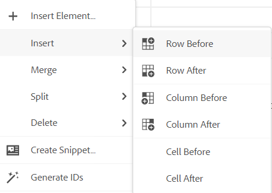{width="550" align="left"}

Über das Kontextmenü der Tabelle haben Sie folgende Möglichkeiten:

- Zellen, Zeilen oder Spalten einfügen

- Zusammenführen von Zellen in Rechts- und Abwärtsrichtung

- Zellen horizontal oder vertikal teilen

- Zellen, Zeilen oder Spalten löschen

- Erstellen eines Ausschnitts aus der Tabelle

- IDs generieren


Sie können auch Attribute für mehrere Zellen, die gesamte Zeile oder Spalte einer Tabelle definieren. Um beispielsweise eine Tabellenzelle auszurichten, ziehen Sie die gewünschte Zelle und wählen Sie sie aus. Im Bedienfeld Inhaltseigenschaften (auf der rechten Seite) ändert sich die Eigenschaft **Typ** in **Mehrfacheintrag**.

1. Klicken Sie **Abschnitt** Attribute“ auf **+Hinzufügen**.
1. Wählen Sie das `@valign` Attribut aus der Dropdown **Liste „Attribut** aus.
1. Wählen Sie aus der Dropdown-Liste Wert die gewünschte Textausrichtung aus, die Sie auf die ausgewählten Tabellenzellen anwenden möchten.
1. Klicken Sie auf **Hinzufügen.**

{width="800" align="left"}

**Bild einfügen** - 

Fügt ein Bild am aktuellen oder nächsten gültigen Speicherort ein. Klicken Sie auf das Symbol Bild einfügen , um das Dialogfeld Bild einfügen zu öffnen, und suchen Sie dann das Bild, das Sie einfügen möchten, und wählen Sie es aus.

>[!NOTE]
>
> Sie können auch ein Bild hinzufügen, indem Sie es aus Ihrem lokalen System auf Ihren Artikel ziehen und ablegen. In diesem Fall wird die Bilddatei mithilfe des Workflows **Assets hochladen** hinzugefügt.  Weitere Informationen finden Sie unter **Assets hochladen** im Abschnitt [Linkes Bedienfeld](web-editor-features.md#id2051EA0M0HS).


{width="650" align="left"}

Sie können Bild-/Figurtitel und Alternativtext für das Bild im Dialogfeld Bild einfügen hinzufügen.

Sie können nach der gewünschten Bilddatei suchen, indem Sie oben in der Suchleiste in der Liste „Typ zu“ den Dateinamen eingeben und die Suchergebnisse nach Pfad \(suchen in\), Sammlungen, Dateityp und Tags filtern. Nachdem Sie die gewünschte Bilddatei gefunden haben, wählen Sie die Datei aus und klicken Sie auf Auswählen , um das Bild in Ihr Dokument einzufügen. Sie können verschiedene Formate von Bilddateien einfügen, z. B. `.png`, `.svg`, `.gif`, `.jpg`, `.eps`, `.ai`, `.psd` und mehr.

Nachdem Sie ein Bild eingefügt haben, können Sie die Attribute für Höhe, Breite, Platzierung und Inhalt im Bedienfeld Inhaltseigenschaften ändern. Klicken Sie auf eine Bilddatei und nehmen Sie dann Änderungen im Bedienfeld Inhaltseigenschaften in der rechten Leiste vor.

{width="800" align="left"}

Das Feld Source zeigt die UUID der eingefügten Bilddatei an. Sie können den vollständigen Pfad der eingefügten Bilddatei finden, indem Sie den Mauszeiger über das Source-Feld bewegen. Der Pfad wird in der QuickInfo angezeigt.

Sie können die Größe eines Bildes ändern, indem Sie entweder den Wert für Höhe oder Breite für die Bilddatei angeben. Das Seitenverhältnis des Bildes wird automatisch beibehalten. Sie können auch das Seitenverhältnis der Bilddatei nicht beibehalten, indem Sie auf das Schlosssymbol \(von Seitenverhältnis beibehalten\) klicken und die Werte für Höhe und Breite angeben.

Sie können die Platzierungseinstellung für das Bild auch als Inline- oder Break-Einstellung festlegen. Wenn Sie die Option Platzierung aufheben verwenden, können Sie anschließend auswählen, wo das Bild ausgerichtet werden soll (links, zentriert oder rechts).

Sie können auch andere Eigenschaften für eine Bilddatei hinzufügen, indem Sie die erforderlichen Eigenschaften im Feld **Attribute** auswählen.

>[!NOTE]
>
>Sie können auch anklickbare Bereiche \(Imagemap\) in Ihrem Bild definieren. Weitere Informationen finden Sie in der Beschreibung **Funktion &quot;** einfügen/bearbeiten“ im Abschnitt [Linkes ](web-editor-features.md#id2051EA0M0HS)&quot;.

**Kontextmenü für Bild- oder Mediendateien**

Sie können auch einige allgemeine Vorgänge für Bilder und Mediendateien über das Kontextmenü durchführen. Klicken Sie mit der rechten Maustaste auf eine beliebige Stelle auf Ihrem Bild, um das Kontextmenü aufzurufen.

Das Kontextmenü bietet Optionen zum Ausschneiden, Kopieren oder Einfügen des Bildes oder Mediums. Sie können ein Element vor oder nach dem ausgewählten Element einfügen. Sie haben auch die Möglichkeit, ein Element umzubenennen oder seinen Wrapper zu entfernen. Sie können das ausgewählte Bild oder die ausgewählten Medien im Repository finden oder die Vorschau der Datei in der Assets-Benutzeroberfläche anzeigen.

Die anderen Optionen im Kontextmenü ermöglichen es Ihnen, einen Pfad zu kopieren, eine Imagemap zu bearbeiten, einen Ausschnitt zu erstellen oder IDs für das ausgewählte Element zu generieren.

**Multimedia einfügen** - 

Fügt verschiedene Arten von Multimediadateien ein. Klicken Sie auf das Symbol Multimedia einfügen und wählen Sie den Dateityp aus, den Sie einfügen möchten. Folgende Multimediaformate werden unterstützt:

- Audiodatei
- Videodatei
- YouTube
- Vimeo

Bei Auswahl der Option Audio- oder Videodatei wird die Repository-Ansicht angezeigt, in der Sie die gewünschte Datei suchen und auswählen können. Wenn Sie YouTube oder Vimeo wählen, erhalten Sie den Dialog Multimedia einfügen. Fügen Sie den Link der Videodatei in das Feld Weblink ein und klicken Sie auf Einfügen , um das Video an der aktuellen oder nächsten gültigen Position in Ihrem Dokument hinzuzufügen.

>[!NOTE]
>
> Beim Hinzufügen eines YouTube-Video-Links müssen Sie die Zeichenfolge `watch?v=` durch `embed` in der URL ersetzen. Um beispielsweise einen YouTube-Video-Link hinzuzufügen: `https://www.youtube.com/**watch?v**=WlIKQOrmZcs`, müssen Sie ihn wie folgt hinzufügen: `https://www.youtube.com/**embed/**WlIKQOrmZcs`. Durch diese Änderung wird sichergestellt, dass das Video in die AEM-Site und die PDF-Ausgabe eingebettet wird.

Sie können die Audio- oder Videodatei auch über das Dialogfeld „Multimedia einfügen“ hinzufügen. Wählen Sie die Option Audio-/Videodatei aus und klicken Sie auf das Symbol „Durchsuchen“, um die Repository-Ansicht zu starten. Wählen Sie die Audio- oder Videodatei aus dem Repository aus und klicken Sie auf Auswählen , um den Link der Datei in das Feld Audio-/Videodatei einzufügen. Wenn Sie eine Videodatei auswählen, wird auch eine Vorschau der Datei im Bereich Vorschau angezeigt. Sie können die Videodatei abspielen, um ihre Vorschau zu sehen.

{width="650" align="left"}

**Querverweis einfügen** - 

Fügen Sie Verweise vom Typ ein - Inhaltsreferenz, Inhaltsschlüsselreferenz, Schlüsselreferenz, Dateireferenz, Weblink oder E-Mail-Link.

Klicken Sie auf das Symbol **Datei auswählen** \(für Inhaltsreferenz und Dateireferenz\) oder **Zuordnungssymbol auswählen** \(für Inhaltsschlüsselreferenz und Schlüsselreferenz\) und wählen Sie die gewünschte Datei oder den gewünschten Inhalt aus, zu der bzw. dem eine Verknüpfung hergestellt werden soll.

{width="650" align="left"}

Dem Dokument wird ein Link der ausgewählten Referenz hinzugefügt. Das Kontextmenü für den Link bietet die folgenden Optionen:

- **Element einfügen**: Zeigt eine Liste gültiger Elemente an, die Sie im jeweiligen Kontext einfügen können.
- **UUID kopieren**: Kopiert die UUID der eingefügten Referenz.
- **Pfad kopieren**: Kopiert den vollständigen Pfad der eingefügten Referenz.
- **Ausschnitt erstellen**: Erstellt einen wiederverwendbaren Ausschnitt aus der eingefügten Referenz.
- **IDs generieren**: Generiert eine eindeutige ID für den eingefügten Verweis.

Sie können auch anhand der UUID der Datei suchen, auf die Sie verweisen möchten. Geben Sie für Links zu Inhalten und Schlüsselreferenzen die UUID der Datei ein, mit der Sie eine Verknüpfung herstellen möchten. Die Datei wird dann automatisch im Abschnitt Vorschau durchsucht und angezeigt. Wenn Sie die UUID der Datei angeben, müssen Sie die Dateierweiterung für XML-Dateien nicht explizit angeben. Die Erweiterung .xml wird automatisch an die UUID angehängt.

{width="650" align="left"}

Wenn Ihr Admin die Option UUIDs in *XMLEditorConfig* aktiviert hat, wird die UUID des referenzierten Inhalts in der Eigenschaft **Link** angezeigt.

{width="800" align="left"}

>[!NOTE]
>
> Wenn die Option **UUIDs aktivieren** nicht aktiviert ist, wird der relative Pfad des referenzierten Inhalts angezeigt.

>[!IMPORTANT]
>
> Obwohl der relative Pfad des referenzierten Inhalts in der Eigenschaft **Link** angezeigt wird, wird der Link intern mithilfe der UUID des referenzierten Inhalts erstellt.

>[!TIP]
>
> Im Abschnitt „Verweise“ des Best Practices-Handbuchs finden Sie Best Practices für das Verweisen auf Inhalte.

**Filtersuche**

Sie können in den Dateien im ausgewählten Pfad des AEM-Repositorys nach Text suchen. Im folgenden Screenshot wird beispielsweise „Allgemein“ durchsucht. Sie können Ihre Suche auch mithilfe erweiterter Filter eingrenzen. Sie können nach allen DITA-Dateien wie DITA-Themen und DITA-Karten suchen, die im ausgewählten Pfad vorhanden sind.

Sie können im ausgewählten Pfad nach Nicht-DITA-Dateien wie Bilddateien, Multimedia und Dokumenten suchen. Sie können auch in den Attributen von DITA-Elementen nach bestimmten Werten suchen. Sie können auch nach Dateien suchen, die vom angegebenen Benutzer ausgecheckt wurden.

{width="650" align="left"}

>[!NOTE]
>
> Ihre bzw. Ihr Systemadmin kann auch die Textfilter konfigurieren und andere Filter ein- oder ausblenden. Weitere Informationen finden Sie im Abschnitt Konfigurieren von Textfiltern im Abschnitt Installieren und Konfigurieren von Adobe Experience Manager Guides as a Cloud Service .

Die Liste der gefilterten Dateien, die den gesuchten Text enthalten, wird angezeigt. Im obigen Screenshot werden beispielsweise die Dateien aufgelistet, die den Text „Allgemein“ enthalten. Sie können auch eine Vorschau des Inhalts der Datei anzeigen.

**Wiederverwendbaren Inhalt einfügen** - 

Inhalte wiederverwenden, die in einem anderen Dokument in Ihrem Projekt vorhanden sind. Sie können Inhalte einfügen, indem Sie eine direkte Verknüpfung mit dem Inhalt in einer Datei herstellen oder einen Schlüsselverweis verwenden, siehe [Auflösen von Schlüsselverweisen](map-editor-other-features.md#id176GD01H05Z). Wenn Sie auf das Symbol Wiederverwendbaren Inhalt einfügen klicken, wird das Dialogfeld Wiederverwenden von Inhalten angezeigt:

{width="650" align="left"}

Wählen Sie im Dialogfeld Inhalt wiederverwenden die Option DITA-Datei für Dateiverweise oder die DITA-Zuordnungsdatei mit den Schlüsselverweisen aus. Nach der Auswahl werden die Themen- oder Schlüsselverweise im Dialogfeld angezeigt. Sie können die ID/den Schlüssel des Themas auswählen, das Sie einfügen möchten, und auf Fertig klicken, um den Inhalt in Ihr Thema einzufügen.

Zum Einfügen der Inhaltsreferenz können Sie auch die UUID der Datei eingeben. Der wiederverwendbare Inhalt dieser Datei wird dann im Abschnitt Vorschau aufgeführt.

Je nach Einstellung für das Einfügen von Links können Sie entweder die UUID des eingefügten Inhalts oder den relativen Pfad im Bedienfeld Eigenschaften oder in der Source-Code-Ansicht sehen. Der Link wird immer mit der UUID des referenzierten Inhalts erstellt. Siehe Konfigurieren von UUID-basierten Links in der Datei Installieren und Konfigurieren von Adobe Experience Manager Guides as a Cloud Service.

>[!NOTE]
>
> Um Inhalte vor oder nach dem referenzierten Inhalt hinzuzufügen, verwenden Sie *Alt*+*Nach-*-Taste oder Alt+*Nach-*-Taste, um den Cursor an die gewünschte Position zu verschieben.

Sie können den referenzierten Inhalt auch innerhalb des Themas einbetten, indem Sie mit der rechten Maustaste auf den referenzierten Inhalt klicken und **Verweis durch Inhalt ersetzen** aus dem Kontextmenü auswählen.

**Sonderzeichen einfügen** - 

Fügt Sonderzeichen in das Thema ein. Klicken Sie auf das Symbol Sonderzeichen einfügen , um den Dialog Sonderzeichen einfügen zu öffnen.

>[!NOTE]
>
> AEM Guides bietet verschiebbare und in der Größe veränderbare Dialogfelder. Die Größe von Dialogfeldern mit zwei Querlinien in der rechten unteren Ecke kann geändert werden. Die Querlinien im Dialogfeld Sonderzeichen werden unten angezeigt.

{width="550" align="left"}

Im Dialogfeld Sonderzeichen einfügen können Sie anhand des Namens nach einem Sonderzeichen suchen. Alle Sonderzeichen werden in verschiedenen Kategorien gespeichert. Wählen Sie in der Dropdown-Liste Kategorie auswählen eine Kategorie aus. Die in der ausgewählten Kategorie verfügbaren Sonderzeichen werden angezeigt. Sie können mit den Pfeiltasten durch die Liste der Sonderzeichen navigieren oder auf das gewünschte Zeichen klicken, das Sie einfügen möchten. Der Name und der Hexadezimalcode des ausgewählten Sonderzeichens werden unter der Liste angezeigt. Klicken Sie auf Einfügen , um das ausgewählte Zeichen in Ihr Dokument einzufügen.

**Keyword einfügen** - 

Fügen Sie das in Ihrer DITA-Karte definierte Keyword ein. Klicken Sie auf das Symbol Keyword einfügen , um das Dialogfeld Schlüsselreferenz zu öffnen.

{width="550" align="left"}

Die Suchbegriffe werden in alphabetischer Reihenfolge aufgelistet. Sie können auch nach einem oder mehreren Suchbegriffen suchen, indem Sie eine Suchzeichenfolge in das Suchfeld eingeben. Das Suchergebnis gibt die Keywords zurück, die die Zeichenfolge in der ID oder im Wert enthalten. Die in Ihrer DITA-Zuordnung definierten Keywords werden in diesem Dialogfeld aufgeführt. Wählen Sie das Keyword aus, das Sie einfügen möchten, und klicken Sie auf **Einfügen**.

Sie können auch die Attribute des eingefügten Keywords ändern, indem Sie mit der rechten Maustaste auf das Keyword klicken und die Option Attribute auswählen. Das Dialogfeld Attribute für Keyword wird geöffnet:

{width="550" align="left"}

Sie können die Attribute des Keywords ändern oder dem Keyword ein neues Attribut hinzufügen.

**Snippet einfügen** - 

Fügen Sie ein Snippet an der aktuellen oder der nächsten gültigen Position ein. Damit diese Funktion funktioniert, müssen Snippets in Ihrem System definiert sein. Weitere Informationen zum Hinzufügen eines Snippets finden Sie in der **Snippet**-Funktionsbeschreibung im Abschnitt [Linkes Bedienfeld](web-editor-features.md#id2051EA0M0HS).

Wenn Sie auf das Symbol Snippet einfügen klicken, wird der Snippet-Katalog Einfügen angezeigt. Der Katalog ist kontextsensitiv, was bedeutet, dass die Snippets nur angezeigt werden, wenn sie am aktuellen Speicherort zulässig sind.

Das folgende Beispiel zeigt zwei vorkonfigurierte Snippets - „Warnung“ und „Fehler“, die an der aktuellen Position im Dokument eingefügt werden können.

{width="300" align="left"}

Wenn Sie einen Ausschnitt aus der Liste auswählen, wird er an der aktuellen oder nächsten gültigen Position im Dokument eingefügt. Der folgende Screenshot zeigt das in das Dokument eingefügte Fehler-Snippet:

{width="400" align="left"}

**Imagemap einfügen/bearbeiten** - 

Fügt eine Imagemap in das ausgewählte Bild ein. Ein Bild mit klickbaren Bereichen, die auf Themen oder Web-Seiten verlinken, wird als Imagemap bezeichnet.

Wählen Sie ein Bild im aktuellen Thema aus und klicken Sie auf das Symbol „Image-Map einfügen/bearbeiten“, um das Dialogfeld „Image-Map einfügen“ zu öffnen.

{width="650" align="left"}

Wählen Sie die bevorzugte Form aus ,  oder Polygon-, um einen Bereich über einem Bild zu definieren, den Sie als Link verwenden möchten. Nach der Definition eines Bereichs wird das Dialogfeld Referenz angezeigt, in dem Sie den Link zu internen oder externen Inhalten angeben müssen:

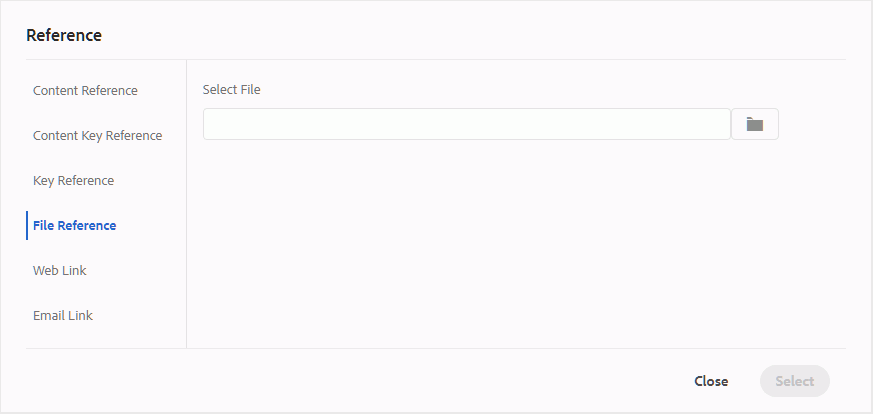{width="650" align="left"}

Wenn sich Bereiche überschneiden, können Sie die Form nach vorne bringen oder durch Klicken auf das entsprechende Symbol in der Symbolleiste nach hinten senden. Sie können einen Bereich auch entfernen, indem Sie ihn auswählen und auf das Symbol Löschen klicken. Durch Doppelklicken auf einen Bereich wird das Dialogfeld Referenz geöffnet, in dem Sie den Ziel-Link ändern können. Nachdem Sie die erforderlichen Bereiche auf dem Bild markiert haben, speichern Sie die Änderungen, indem Sie auf Fertig klicken.

**Auschecken/Einchecken** - / 

Checkt die aktuelle Datei aus oder ein. Beim Auschecken einer Datei erhält der Benutzer exklusiven Schreibzugriff auf die Datei. Wenn die Datei eingecheckt wird, werden die Änderungen in der aktuellen Version der Datei gespeichert.

Wenn Sie sich in der Kartenansicht befinden und die übergeordnete Karte erweitern, können Sie mit einem Klick alle Dateien in der Karte auschecken. Erweitern Sie einfach die übergeordnete Zuordnungsdatei und wählen Sie die übergeordnete Datei aus. Dadurch werden alle Dateien in der Zuordnung ausgewählt. Dann können Sie auf **Auschecken**  klicken, um alle Dateien in der Zuordnung zu sperren.

>[!NOTE]
>
> Wenn Sie eine Datei einchecken, die noch nicht gespeicherte Änderungen enthält, werden Sie aufgefordert, die Änderungen zu speichern. Wenn Sie Ihre Änderungen nicht speichern, wird nur die Datei eingecheckt.

Die QuickInfo für das Ein-/Auschecken wird durch die title-Eigenschaft in der `ui_config.json` bestimmt.

Weitere Informationen finden Sie unter [Konfigurieren des Titels für die Symbole zum Ein- und Auschecken](/help/product-guide/install-guide/conf-checkin-checkout-title.md) im On-Premise-Installations- und Konfigurationshandbuch.


**Tag-Ansicht ein/aus** - 

Tags sind visuelle Hinweise auf die Begrenzungen eines Elements. Eine Elementgrenze markiert den Anfang und das Ende eines Elements. Sie können diese Umgrenzungen dann als visuellen Hinweis verwenden, um die Einfügemarke zu platzieren oder den Text innerhalb einer Umrandung auszuwählen. Wenn Sie vor oder nach einem Element im Dokument ein weiteres Element einfügen möchten, können Sie die Einfügemarke vor oder nach der öffnenden oder schließenden Umrandung des Elements platzieren.

Der folgende Screenshot zeigt ein Dokument mit der Tag-Ansicht in:

{width="650" align="left"}

Die folgenden Vorgänge können in einem Dokument mit Tag-Ansicht in ausgeführt werden:

- **Element auswählen**: Klicken Sie auf das öffnende oder schließende Tag eines Elements, um dessen Inhalt auszuwählen.

- **Tags erweitern oder reduzieren**: Klicken Sie auf das + oder - melden Sie ein Tag an, um es zu erweitern oder zu reduzieren.

- **Kontextmenü verwenden**: Das Kontextmenü bietet Optionen zum Ausschneiden, Kopieren oder Einfügen des ausgewählten Elements. Sie können ein Element auch vor oder nach dem ausgewählten Element einfügen. Die anderen Optionen ermöglichen es Ihnen, für das ausgewählte Element eine ID zu generieren oder den Bereich „Eigenschaften“ zu öffnen.

- **Elemente per Drag-and-Drop verschieben**: Wählen Sie das Tag eines Elements aus und ziehen Sie es einfach per Drag-and-Drop in Ihr Dokument. Wenn der Ablageort ein gültiger Ort ist, an dem das Element zulässig ist, wird das Element an dem abgelegten Ort platziert.


>[!NOTE]
>
> Wenn ein(e) Benutzende(r) die Tag-Ansicht im Web-Editor aktiviert, bleibt sie auch sitzungsübergreifend aktiviert. Das bedeutet, dass Sie die Tag-Ansicht nicht erneut aktivieren müssen, um später darauf zuzugreifen. Der Standardwert für die Tag-Ansicht für die Sitzung eines neuen Benutzers wird durch die TagView-Eigenschaft in der Datei ui\_config.json bestimmt. Weitere Informationen finden Sie im *Konfigurieren des Standardwerts für die Tag-Ansicht* unter Installieren und Konfigurieren von Adobe Experience Manager Guides as a Cloud Service.

**Änderungen verfolgen/deaktivieren** 

Sie können alle an einem Dokument vorgenommenen Aktualisierungen nachverfolgen, indem Sie den Modus Änderungen nachverfolgen aktivieren. Nach der Aktivierung der Tracking-Änderungen werden alle Einfügungen und Löschungen im Dokument erfasst. Der gesamte gelöschte Inhalt wird mithilfe von Durchgestrichen hervorgehoben, und alle Einfügungen werden in grünem Text hervorgehoben. Darüber hinaus werden die Änderungsleisten am Rand der Themenseite angezeigt. Auch hier wird ein roter Balken für gelöschte Inhalte und ein grüner Balken für hinzugefügte Inhalte angezeigt. Wenn sich Hinzufügen und Löschen auf derselben Zeile befinden, werden sowohl grüne als auch rote Balken angezeigt.

Der folgende Screenshot zeigt den gelöschten und eingefügten Inhalt zusammen mit den Änderungsleisten:

{width="650" align="left"}

Ein typischer Anwendungsfall für das Tracking von Änderungen in einem Dokument kann die Durchführung einer Peer Review sein. Sie können Änderungen nachverfolgen und Ihr Dokument zur Überprüfung freigeben. Die Überprüfenden nehmen dann Änderungen vor, wenn die Nachverfolgung aktiviert ist. Wenn Sie das Dokument erhalten, sollten Sie über einen Mechanismus verfügen, mit dem Sie die vorgeschlagenen Aktualisierungen anzeigen können und bequem Änderungen akzeptieren oder ablehnen können.

AEM Guides bietet die Funktion „Nachverfolgte Änderungen“, die Informationen zu den im Dokument vorgenommenen Aktualisierungen enthält. Die Funktion „Nachverfolgte Änderungen“ enthält Informationen dazu, welche Aktualisierungen vorgenommen wurden, wer sie vorgenommen hat und zu welchem Zeitpunkt. Mit der Funktion „Nachverfolgte Änderungen“ können Sie die vorgeschlagenen Aktualisierungen im Dokument auch einfach akzeptieren oder ablehnen.

Um auf die Funktion zuzugreifen, klicken Sie auf das Symbol Getrackte Änderungen im rechten Bedienfeld.

{width="300" align="left"}

Durch Klicken auf eine Änderung wird der geänderte Inhalt im Dokument ausgewählt. Sie können eine Änderung annehmen, indem Sie auf das Symbol Änderung akzeptieren klicken, oder sie ablehnen, indem Sie die Änderung ablehnen auswählen.

Wenn Sie alle Änderungen mit einem Klick akzeptieren oder ablehnen möchten, wählen Sie **Alle akzeptieren** oder **Alle ablehnen**.

>[!NOTE]
>
> Im Vorschaumodus können Sie das Dokument mit oder ohne Markierungen des geänderten Inhalts anzeigen. Weitere Informationen finden Sie unter [Vorschau](web-editor-views.md#preview-mode-id19AAGL00163).

**Zusammenführen** - 

Wenn Sie in einer Umgebung mit mehreren Autoren arbeiten, wird es schwierig zu verfolgen, welche Änderungen die anderen Autoren in einem Thema oder einer Zuordnung vorgenommen haben. Mit der Zusammenführungsfunktion haben Sie nicht nur mehr Kontrolle über die Anzeige der Änderungen, sondern auch darüber, welche Änderungen in der neuesten Version des Dokuments beibehalten werden.

**Zusammenführen von Themendateien**

Um Änderungen in einem Thema zusammenzuführen, führen Sie die folgenden Schritte aus:

1. Öffnen Sie ein Thema im Web-Editor.

1. Klicken Sie auf **Zusammenführen**.

   Das Dialogfeld „Zusammenführen“ wird angezeigt.

   {width="550" align="left"}

1. *\(Optional\)* Sie können auch eine neue Datei an einem anderen Speicherort im Repository suchen und auswählen.

1. Wählen Sie eine Version der Datei aus, mit der Sie die aktuelle Version der Datei vergleichen möchten.

1. Wählen Sie unter Optionen Folgendes aus:

   - **Änderungen aus ausgewählter Version verfolgen**: Mit dieser Option werden alle Inhaltsaktualisierungen in Form von Änderungen nachverfolgt. Sie können dann Änderungen im Dokument einzeln oder in einem Schritt akzeptieren oder ablehnen.

   - **Auf ausgewählte Version zurücksetzen**: Diese Option setzt die aktuelle Version des Dokuments auf die ausgewählte Version zurück. Mit dieser Option haben Sie keine Kontrolle darüber, welche Inhalte akzeptiert oder abgelehnt werden.

1. Klicken Sie auf **Fertig**.

1. Wenn Sie die Option **Geänderte aus ausgewählter Version nachverfolgen** ausgewählt haben, werden alle Änderungen aus der ausgewählten Version in der Funktion „Nachverfolgte Änderungen“ im rechten Bedienfeld angezeigt.

   Sie können alle Kommentare im Bedienfeld „Getrackte Änderungen“ akzeptieren oder ablehnen oder einzelne Kommentare akzeptieren oder ablehnen.


**Zusammenführen von Zuordnungsdateien**

Um Änderungen in einer Zuordnungsdatei zusammenzuführen, führen Sie die folgenden Schritte aus:

1. Öffnen Sie eine Zuordnung im Web-Editor.

1. Klicken Sie auf **Zusammenführen**.

   Das Dialogfeld „Zusammenführen“ wird angezeigt.

   {width="550" align="left"}

1. *\(Optional\)* Sie können auch eine neue Datei an einem anderen Speicherort im Repository suchen und auswählen.

1. Wählen Sie eine Version der Datei aus, mit der Sie die aktuelle Version der Datei vergleichen möchten.

1. Wählen Sie unter Optionen Folgendes aus:

   - **Änderungen aus ausgewählter Version verfolgen**: Mit dieser Option werden alle Inhaltsaktualisierungen in Form von Änderungen nachverfolgt. Sie können dann Änderungen im Dokument einzeln oder in einem Schritt akzeptieren oder ablehnen.

   - **Auf ausgewählte Version zurücksetzen**: Diese Option setzt die aktuelle Version des Dokuments auf die ausgewählte Version zurück. Mit dieser Option haben Sie keine Kontrolle darüber, welche Inhalte akzeptiert oder abgelehnt werden.

1. Klicken Sie auf **Fertig**.

   1. Wenn Sie die Option **Änderung aus ausgewählter Version nachverfolgen** ausgewählt haben, werden alle Änderungen aus der ausgewählten Version im Bedienfeld Nachverfolgte Änderungen angezeigt \(rechts\).

      Sie können alle Änderungen im Bedienfeld „Nachverfolgte Änderungen“ annehmen oder ablehnen oder einzelne Änderungen in der Zuordnungsdatei akzeptieren oder ablehnen.


**Versionsverlauf** - 


Mit **Funktion „Versionsverlauf** im Web-Editor können Sie die verfügbaren Versionen Ihrer DITA-Dateien überprüfen, vergleichen und auf eine beliebige Version aus dem Editor selbst zurücksetzen.

Im Versionsverlauf können Sie den Inhalt und die Metadaten der aktuellen Version (die auch eine Arbeitskopie sein kann) mit jeder früheren Version derselben Datei vergleichen. Sie können auch die Beschriftungen und Kommentare für die verglichenen Versionen anzeigen.

Um auf den Versionsverlauf zuzugreifen und auf eine bestimmte Version Ihres Themas zurückzukehren, führen Sie die folgenden Schritte aus:

1. Öffnen Sie ein Thema im Web-Editor.

1. Klicken Sie **Versionsverlauf**.

   Das **Versionsverlauf** wird angezeigt.

   {width="550" align="left"}
   *Vorschau der Änderungen in den verschiedenen Versionen eines Themas.*

1. Wählen Sie in der Dropdown-Liste „Vergleichen mit“ eine Version des Themas aus **mit dem Sie vergleichen oder** möchten.

   >[!NOTE]
   >
   > Wenn einer Version Beschriftungen zugewiesen sind, werden diese ebenfalls \(in Klammern\) zusammen mit der Versionsnummer angezeigt.


1. Aktivieren Sie **Option „Beschriftungen und Kommentare**&quot;, um die Beschriftungen und Kommentare anzuzeigen, die auf die aktuelle und die verglichene Version angewendet wurden.

1. Sie können die folgenden Informationen auch im Dialogfeld **Versionsverlauf** anzeigen:

   **Vorschau**-Registerkarte: Der neu hinzugefügte Inhalt ist in grüner Schriftart, und der gelöschte Inhalt ist in roter Schriftart.

   Registerkarte **Metadaten**: Die neu hinzugefügten Metadaten sind in grüner Schrift, die gelöschten Metadaten in roter Schrift.
   {width="550" align="left"}
   *Vergleichen der Metadaten verschiedener Versionen im Versionsverlauf.*

   >[!NOTE]
   >
   > Ihr Systemadministrator kann die Metadaten ändern, die über die Registerkarte Metadaten in den Editor-Einstellungen angezeigt werden sollen.

   Sie können auch die Benutzer- und Zeitdetails der aktuellen und der verglichenen Version anzeigen.


1. Nachdem Sie eine Version aus der Dropdown-Liste ausgewählt haben, wird **Option „Auf ausgewählte Version**&quot; verfügbar gemacht. Im Vorschaufenster werden die Unterschiede zwischen der aktuellen Version und der ausgewählten Version des Themas angezeigt.


1. Klicken Sie **Auf ausgewählte Version**, um Ihre Arbeitskopie mit der ausgewählten Version des Themas wiederherzustellen.

   Das Dialogfeld „Version zurücksetzen“ wird angezeigt.

   {width="550" align="left"}

1. \(*Optional*\) Geben Sie einen Grund für die Rückkehr zu einer früheren Version an. Sie können auch eine neue Version der derzeit aktiven Arbeitskopie Ihres Themas erstellen.

1. Klicken Sie auf **Bestätigen.**

   Ihre Arbeitskopie der Datei wird auf die ausgewählte Version zurückgesetzt. Wenn Sie eine neue Version der derzeit aktiven Arbeitskopie erstellen, wird auch eine neue Version der Datei mit allen Arbeitsänderungen erstellt.


Wenn Sie zu einer früheren Version zurückkehren, wird ein visueller Hinweis angezeigt, der angibt, dass die Version, an der Sie gerade arbeiten, nicht die neueste Version ist.

{width="800" align="left"}

**Versionskennzeichenverwaltung** - 

Beschriftungen helfen Ihnen bei der Identifizierung des Stadiums, in dem sich ein bestimmtes Thema im DDLC befindet (Document Development Life Cycle). Wenn Sie beispielsweise an einem Thema arbeiten, können Sie die Bezeichnung als „Genehmigt“ festlegen. Sobald ein Thema veröffentlicht und Kunden zur Verfügung gestellt wurde, können Sie diesem Thema die Bezeichnung „Freigegeben“ zuweisen.

Mit AEM Guides können Sie Beschriftungen in einem Freiformtextformat angeben oder einen Satz vordefinierter Beschriftungen verwenden. Mit der benutzerdefinierten Beschriftung können alle Autorinnen und Autoren im System eine Beschriftung gemäß ihrer Auswahl angeben. Dies bietet Flexibilität, führt jedoch zu inkonsistenten Beschriftungen im System. Um dieses Problem zu beheben, können Admins einen Satz vordefinierter Kennzeichnungen konfigurieren. Weitere Informationen zum Konfigurieren vordefinierter Kennzeichnungen finden Sie unter *Konfigurieren und Anpassen des XML-Web* Editors in der Adobe Experience Manager Guides as a Cloud Service installieren und konfigurieren.

Diese Beschriftungen werden Autoren in Form einer Dropdown-Liste angezeigt, wenn sie eine Beschriftung angeben müssen. Dadurch wird sichergestellt, dass im System nur vordefinierte, konsistente Kennzeichnungen verwendet werden.

Es gibt verschiedene Methoden, mit denen Sie Beschriftungen auf Ihre Themen anwenden können - [Versionsverlauf](web-editor-use-label.md) Bedienfeld in der Assets-Benutzeroberfläche, [Baselines](/help/product-guide/user-guide/generate-output-use-baseline-for-publishing.md)-Benutzeroberfläche und im Web-Editor. Mit der Funktion „Versionsbeschriftung“ im Web-Editor können Autoren ihren Themen schnell und einfach Beschriftungen zuweisen.

Um Ihrem Thema Beschriftungen aus dem Web-Editor hinzuzufügen, führen Sie die folgenden Schritte aus:

1. Öffnen Sie ein Thema im Web-Editor.

1. Klicken Sie **Versionsbezeichnung**.

   Das Dialogfeld Versionsbeschriftungs-Verwaltung wird angezeigt.

   {width="650" align="left"}

   Das Dialogfeld Versionsbeschriftungsverwaltung ist in zwei Teile unterteilt: Das linke Bedienfeld enthält eine Liste der für das Thema verfügbaren Versionen zusammen mit der Dropdown-Liste Beschriftung \(oder einem Textfeld zur Eingabe einer Beschriftung\) und das rechte Bedienfeld mit einer Vorschau des Themas.

1. Wählen Sie eine Version aus, auf die Sie Kennzeichnungen anwenden möchten.

   Wenn Sie in der Versionsliste eine andere Version des Themas auswählen, werden im Vorschaubereich die Änderungen zwischen der aktuellen Version und der ausgewählten Version des Themas angezeigt

   >[!NOTE]
   >
   > Wenn eine Beschriftung bereits auf eine Version angewendet wird, wird sie neben der Versionsnummer in der Dropdown-Liste und unter der Liste Version auswählen angezeigt. Sie können eine vorhandene Beschriftung entfernen, indem Sie auf das Symbol \(**x**\) neben der Beschriftung klicken.

1. Wenn Ihr Administrator eine Liste von Kennzeichnungen definiert hat, wird eine Dropdown-Liste der Kennzeichnungen angezeigt, aus der Sie die Kennzeichnungen auswählen können, die Sie anwenden möchten. Sie können mehrere Bezeichnungen aus der Dropdown-Liste auswählen.

   Andernfalls wird ein Textfeld angezeigt, in das Sie die Beschriftungen eingeben können, die Sie zu Ihrem Thema hinzufügen möchten.

   >[!NOTE]
   >
   > Eine Bezeichnung kann nicht auf mehrere Versionen eines Themas angewendet werden. Wenn Sie versuchen, eine vorhandene Beschriftung zu verknüpfen, erhalten Sie die Möglichkeit, sie aus der vorhandenen Version zu entfernen und auf die ausgewählte Version des Themas anzuwenden.

1. Klicken Sie **Bezeichnung hinzufügen**.

1. Wählen Sie in der Bestätigungsmeldung Kennzeichnung anwenden die Option **Kennzeichnung verschieben**, um Kennzeichnungen von einer vorhandenen Version in die ausgewählte Version zu verschieben. Wenn Sie diese Option nicht auswählen und es Beschriftungen gibt, die einer anderen Version des Themas zugewiesen sind, werden diese nicht in die Version des ausgewählten Themas verschoben. Solche Kennzeichnungen werden beim Bezeichnungsantrag ignoriert.


**Prüfungsaufgabe erstellen** - 

Sie können eine Prüfungsaufgabe des aktuellen Themas oder der Zuordnungsdatei direkt im Web-Editor erstellen. Öffnen Sie die Datei, für die Sie die Prüfungsaufgabe erstellen möchten, und klicken Sie auf Prüfungsaufgabe erstellen , um den Erstellungsprozess der Überprüfung zu starten.

>[!NOTE]
>
> Sie können eine Prüfungsaufgabe auch im Bedienfeld Überprüfen (auf der rechten Seite\) erstellen.

Befolgen Sie die Anweisungen unter [Themen oder Karten überprüfen](review.md#) für weitere Details.

## Linkes Bedienfeld {#id2051EA0M0HS}

Das linke Bedienfeld ist ein beständiges Bedienfeld. Sie können sie erweitern oder reduzieren, indem Sie auf das Symbol Seitenleiste erweitern \(\) klicken. In der erweiterten Ansicht werden die Namen der Symbole angezeigt, die in der reduzierten Ansicht als QuickInfos angezeigt werden.

>[!NOTE]
>
> Die Größe des linken Bedienfelds kann geändert werden. Um die Größe des Bereichs zu ändern, bringen Sie den Cursor auf die Bereichsgrenze, der Cursor ändert sich in einen Doppelpfeil, klicken und ziehen Sie, um die Breite des Bereichs zu ändern.

Das linke Bedienfeld bietet Zugriff auf die folgenden Funktionen:

**Favoriten** - 

Wenn Sie an einem Satz von Dateien oder Ordnern arbeiten, können Sie diese Ihrer Favoritenliste hinzufügen, um schnell darauf zuzugreifen. Die Favoritenliste zeigt die Liste der von Ihnen hinzugefügten Dokumente sowie andere öffentlich zugängliche Favoritendokumente der anderen Benutzer an.

Standardmäßig können Sie die Dateien nach Titeln anzeigen. Wenn Sie mit dem Mauszeiger auf eine Datei zeigen, können Sie den Dateititel und den Dateipfad als QuickInfo anzeigen.

>[!NOTE]
>
> Als Administrator können Sie die Liste der Dateien nach Dateinamen im Web-Editor anzeigen. Wählen Sie die **Dateiname** im Abschnitt **Dateien anzeigen nach** in **Benutzereinstellungen** .

Um eine Favoritenliste oder Sammlung zu erstellen, klicken Sie auf das Plussymbol (+) neben dem Bereich Favoriten , um das Dialogfeld Neue Sammlung aufzurufen:

{width="300" align="left"}

Geben Sie einen Titel und eine Beschreibung für die Lieblingssammlung ein, die Sie erstellen möchten. Wenn Sie **Öffentlich** auswählen, wird dieser Favorit auch anderen Benutzern angezeigt.

Um eine Datei zu Ihrer bevorzugten Sammlung hinzuzufügen, verwenden Sie eine der folgenden Methoden:

- Navigieren Sie zur gewünschten Datei oder zum gewünschten Ordner in der Repository-Ansicht, klicken Sie auf das *Optionen*-Symbol, um das Kontextmenü zu öffnen, und wählen Sie **Zu Favoriten hinzufügen** aus. Im Dialogfeld Zu Favoriten hinzufügen können Sie die Datei/den Ordner zu einem vorhandenen Favoriten hinzufügen oder einen neuen erstellen.

  {width="300" align="left"}

- Klicken Sie im Editor mit der rechten Maustaste auf die Registerkarte einer Datei, um das Kontextmenü zu öffnen. Wählen Sie **Hinzufügen zu** > **Favoriten**, um die Datei Ihrer Favoritenliste hinzuzufügen.

  {width="400" align="left"}

>[!NOTE]
>
> - Um ein Element aus der Favoritenliste zu entfernen, klicken Sie auf das Optionssymbol neben dem Element in einer Favoritensammlung und wählen Sie **Aus Favoriten entfernen**.
> - Um die Datei in der Vorschau anzuzeigen, ohne sie zu öffnen, wählen Sie eine Datei aus und wählen **dann** Vorschau“ aus dem Menü „Optionen“.


**Optionsmenü für die Favoritensammlung**\
Sie können auch viele Aktionen über das Menü Optionen ausführen, das für eine Favoritensammlung verfügbar ist:

{width="400" align="left"}

- **Umbenennen**: Umbenennen der ausgewählten Sammlung.
- **Löschen**: Löscht die ausgewählte Sammlung.
- **Aktualisieren**: Erstellt eine neue Liste mit Dateien und Ordnern aus dem Repository.
- **In Assets-Benutzeroberfläche anzeigen**: Den Datei- oder Ordnerinhalt in der Assets-Benutzeroberfläche anzeigen.

>[!NOTE]
>
> Sie können die Liste auch mithilfe des Aktualisierungssymbols oben aktualisieren.


**Repository-Ansicht** - 

Wenn Sie auf das Symbol „Repository-Ansicht“ klicken, erhalten Sie eine Liste der in DAM verfügbaren Dateien und Ordner. Standardmäßig können Sie die Dateien nach Titeln anzeigen. Wenn Sie mit dem Mauszeiger auf eine Datei zeigen, können Sie den Dateititel und den Dateinamen als QuickInfo anzeigen.

>[!NOTE]
>
> Als Administrator können Sie die Liste der Dateien nach Dateinamen im Web-Editor anzeigen. Wählen Sie die **Dateiname** im Abschnitt **Dateien anzeigen nach** in **Benutzereinstellungen** .


Es werden 75 Dateien gleichzeitig geladen. Bei jedem Klick auf **Mehr laden**… werden 75 Dateien geladen und die Schaltfläche wird nicht mehr angezeigt, wenn alle Dateien aufgelistet wurden. Dieses Laden im Batch ist effizient, und Sie können schneller auf die Dateien zugreifen als alle Dateien, die in einem Ordner vorhanden sind.

Sie können einfach zur gewünschten Datei in DAM navigieren und sie im Web-Editor öffnen. Wenn Sie über die erforderlichen Zugriffsrechte zum Bearbeiten der Datei verfügen, können Sie dies tun.

Sie können auch auf eine Audio- oder Videodatei klicken und sie im Web-Editor wiedergeben. Sie können die Lautstärke oder
Die Ansicht des Videos. Im Kontextmenü haben Sie auch die Optionen zum Herunterladen, Ändern der Wiedergabe
Geschwindigkeit oder Bild im Bild anzeigen.


Wählen Sie eine Karte aus und drücken Sie die Eingabetaste oder doppelklicken Sie, um sie in der **Kartenansicht“** öffnen. Weitere Informationen finden Sie in der **Kartenansicht** Funktionsbeschreibung im Abschnitt [Linkes ](web-editor-features.md#id2051EA0M0HS)). Wählen Sie ein Thema aus und drücken Sie die Eingabetaste oder doppelklicken Sie, um es im [Inhaltsbearbeitungsbereich“ ](#id2051EB000UI) öffnen. Die direkte Navigation und das Öffnen einer Datei über den Web-Editor spart Zeit und steigert die Produktivität.

**Filtersuche**

Der Web-Editor bietet erweiterte Filter für die Textsuche. Sie können in den Dateien im ausgewählten Pfad des Adobe Experience Manager-Repositorys nach einem Text suchen und filtern. Dabei werden Titel, Dateiname und Inhalt in den Dateien durchsucht.


{width="300" align="left"}

*Filter anwenden, um nach den Dateien zu suchen, die den`general purpose.`* enthalten

Wählen Sie das Symbol **Suche filtern** \(\) aus, um das Popup-Fenster Filtern nach zu öffnen.

>[!NOTE]
>
> Wenn Sie nach Text suchen oder Dateien filtern, wird auf dem Symbol **Suche filtern** \(\) ein blauer Punkt angezeigt, um anzugeben, dass wir uns im Suchbereich befinden und dass einige Filter angewendet wurden.


Sie haben die folgenden Optionen, um die Dateien zu filtern und Ihre Suche im Adobe Experience Manager-Repository einzugrenzen:

- **DITA-Dateien**: Sie können nach allen **DITA-** und **DITA-Karten** suchen, die im ausgewählten Pfad vorhanden sind. Diese sind standardmäßig ausgewählt.
- **Nicht-DITA-Dateien**: Sie können im ausgewählten Pfad nach **DITAVAL-**, **Image-**, **Multimedia**, **Documents** und **JSON** suchen.

 {width="300" align="left"}

*Verwenden Sie die Filter für die schnelle Suche, um nach DITA- und Nicht-DITA-Dateien zu suchen.*

**Erweiterte Filterung**

Wählen Sie das Symbol **Erweiterte** aus, um das Dialogfeld **Erweiterte Filter** anzuzeigen.

Sie können die folgenden Optionen auf den Registerkarten **Allgemein** und **Erweitert** anzeigen.

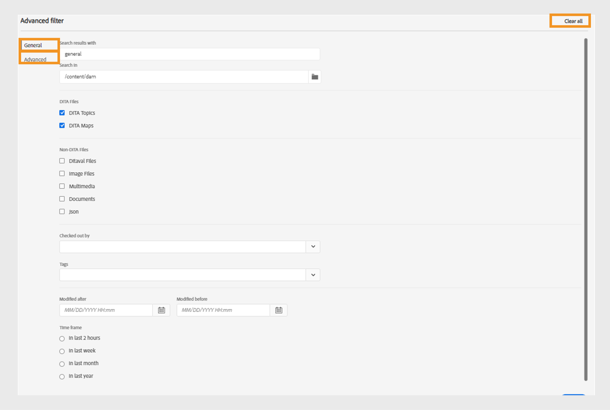 {width="800" align="left"}


**Allgemein**

- **Die Suchergebnisse lauten wie folgt**: Suchen Sie nach Text in den Dateien, die im ausgewählten Pfad des Adobe Experience Manager-Repositorys vorhanden sind. Der Text wird im Titel, im Dateinamen und im Inhalt der Dateien durchsucht.

Dies ist mit dem Suchfeld im Repository-Fenster synchronisiert. Wenn Sie beispielsweise `general purpose` in das Suchfeld im Repository-Bereich eingeben, wird es auch im Dialogfeld **Erweiterter Filter** angezeigt und umgekehrt.

- **Suchen in**: Wählen Sie den Pfad aus, unter dem Sie die Dateien im Adobe Experience Manager-Repository suchen möchten.

- **Ausgecheckt von**: Sie können nach Dateien suchen, die der angegebene Benutzer ausgecheckt hat.
- **Zuletzt geändert**: Sie können nach Dateien suchen, die zuletzt nach einem ausgewählten Datum, aber vor einem ausgewählten Datum geändert wurden.
- **Geändert vor**: Sie können nach Dateien suchen, die zuletzt vor einem ausgewählten Datum geändert wurden.
- **Zeitrahmen**: Sie können auch nach Dateien suchen, die in den letzten zwei Stunden, in der letzten Woche, im letzten Monat oder im letzten Jahr zuletzt geändert wurden.
- **Tags**: Sie können nach Dateien suchen, auf die bestimmte Tags angewendet wurden. Sie können das Tag entweder eingeben oder aus der Dropdown-Liste auswählen.

**Erweitert**

- **DITA-Elemente**: Sie können auch in den Attributen der angegebenen DITA-Elemente nach bestimmten Werten suchen.
   - Wählen Sie **Element hinzufügen**  aus, um die Elemente, Attribute und Werte hinzuzufügen.
   - Wenden Sie die ausgewählten Filter an.

- Wählen Sie **Alle löschen**, um alle angewendeten Filter zu löschen.


- Wählen Sie das Symbol **Filter schließen**  aus, um den Filter zu schließen und zur Strukturansicht des Repositorys zurückzukehren.

  >[!NOTE]
  >
  >Ihre bzw. Ihr Systemadmin kann auch die Textfilter konfigurieren und andere Filter ein- oder ausblenden. Weitere Informationen finden Sie *Abschnitt „Konfigurieren von Textfiltern* im Abschnitt Installieren und Konfigurieren von Adobe Experience Manager Guides as a Cloud Service.
  >
  >Die Liste der gefilterten Dateien, die den gesuchten Text enthalten, wird angezeigt. Beispielsweise werden die Dateien, die die `general purpose` enthalten, im vorherigen Screenshot aufgelistet. Sie können mehrere Dateien aus der gefilterten Liste auswählen, um sie per Drag-and-Drop auf eine Karte zu ziehen, die zur Bearbeitung geöffnet ist.


**Menü „Optionen**

Neben dem Öffnen von Dateien über den linken Bereich können Sie auch viele Aktionen über das Menü Optionen in der Repository-Ansicht ausführen. Je nachdem, ob Sie einen Ordner, eine Themendatei oder eine Mediendatei auswählen, werden unterschiedliche Optionen angezeigt.

**Optionen für einen Ordner**

Sie können die folgenden Aktionen mithilfe des Menüs Optionen ausführen, das für einen *Ordner* in der Repository-Ansicht verfügbar ist:

{width="550" align="left"}


- **Erstellen**: Erstellen Sie ein neues DITA-Thema, eine neue DITA-Karte oder einen neuen Ordner. Weitere Informationen finden Sie unter **Erstellen von Themen aus der Repository** Ansicht im Abschnitt [Linkes Bedienfeld](web-editor-features.md#id2051EA0M0HS).


- **Assets hochladen**: Laden Sie eine Datei aus Ihrem lokalen System in den ausgewählten Ordner im Adobe Experience Manager-Repository hoch. Sie können auch Dateien aus Ihrem lokalen System per Drag-and-Drop auf das aktuelle Arbeitsthema ziehen. Dies ist sehr nützlich, wenn Sie Bilder aus Ihrem lokalen System in Ihr Thema einfügen möchten.

  {width="550" align="left"}

  Sie können einen Ordner auswählen, in den Sie die Datei hochladen möchten, und es wird auch eine Vorschau des Bildes angezeigt. Wenn Sie die Datei umbenennen möchten, können Sie dies im Textfeld Dateiname tun. Klicken Sie auf Hochladen , um den Datei-Upload abzuschließen. Wenn Sie eine Bilddatei per Drag-and-Drop auf ein Thema gezogen haben, wird die Bilddatei zum Artikel hinzugefügt und auch hochgeladen.

  Wenn Ihr Admin die Option UUIDs in *XMLEditorConfig* aktiviert hat, wird die UUID des hochgeladenen Bildes in der Eigenschaft **Source** angezeigt.

  {width="800" align="left"}

- **Dateien im Ordner suchen**: Versetzt den Fokus auf die Repository-Suche, bei der Sie den Suchbegriff eingeben können. Die Suche wird unter dem ausgewählten Ordner im Repository durchgeführt. Sie können auch einen Filter anwenden, um DITA-Dateien, Bilddateien oder beides zurückzugeben.

  {width="400" align="left"}

  Sie können auch mit der UUID einer Datei suchen. In diesem Fall zeigen die Suchergebnisse den Titel der DITA/XML-Datei an. Wenn es sich bei der Datei um eine Bilddatei handelt, wird die UUID der Datei angezeigt. Im folgenden Suchbeispiel wird die UUID einer Bilddatei durchsucht und in den Suchergebnissen die UUID der Originalbilddatei sowie der Thementitel der Datei angezeigt, in der auf dieses Bild verwiesen wird.

  {width="300" align="left"}

- **Alle reduzieren**: Alle geöffneten Ordner im Repository minimieren und nur die Stammordner anzeigen.

  >[!NOTE]
  >
  > Erweitern Sie den Ordner mit dem Symbol **\>** neben einem Ordner.

- **Zu Favoriten hinzufügen**: Fügt den ausgewählten Ordner zu den Favoriten hinzu. Sie können ihn zu einer vorhandenen oder neuen Favoritensammlung hinzufügen.

- **Aktualisieren**: Erstellt eine neue Liste mit Dateien und Ordnern aus dem Repository.
- **In Assets-Benutzeroberfläche anzeigen**: Zeigt den Ordnerinhalt in der Assets-Benutzeroberfläche an.

**Optionen für eine Datei**

Je nachdem, ob Sie eine Mediendatei oder eine DITA-Datei auswählen, werden im Menü Optionen unterschiedliche Optionen angezeigt. Einige gängige Optionen für Medien- und DITA-Dateien sind:

- Duplizieren
- Auschecken/Einchecken
- Vorschau
- Verschieben nach
- Umbenennen
- Löschen
- Kopieren
- Alle reduzieren
- Zu Favoriten hinzufügen
- Eigenschaften
- In der Assets-Benutzeroberfläche anzeigen

{width="550" align="left"}

Die verschiedenen Optionen im Menü „Optionen“ werden nachfolgend erläutert:

- **Bearbeiten**: Öffnen Sie die Datei zur Bearbeitung. Im Falle einer .ditamap/.bookmap-Datei wird diese zur Bearbeitung im [Erweiterten Karten-Editor](map-editor-advanced-map-editor.md#) geöffnet.

- **Duplizieren**: Mit dieser Option erstellen Sie ein Duplikat oder eine Kopie der ausgewählten Datei. Sie haben außerdem die Möglichkeit, die doppelte Datei in der Aufforderung Asset duplizieren umzubenennen. Standardmäßig wird die Datei mit dem Suffix \ (wie Dateiname\_1.extension\) erstellt. Der Titel der Datei bleibt gleich wie der der Quelldatei, und die neue Datei beginnt mit Version 1.0. Alle Verweise, Tags und Metadaten werden kopiert, während die Baselines nicht in die doppelte Datei kopiert werden.
- **Auschecken**: Die ausgewählte Datei zur Bearbeitung sperren. Bei gesperrten Dateien ändert sich diese Option in **Einchecken**.

  >[!NOTE]
  >
  > - Wenn eine Datei von einem Benutzer gesperrt oder ausgecheckt wurde, wird durch Bewegen des Mauszeigers über dem Sperrsymbol der Benutzer \(name\) angezeigt, der die Datei gesperrt hat.
  > - Wenn Sie eine Datei einchecken, die noch nicht gespeicherte Änderungen enthält, werden Sie aufgefordert, die Änderungen zu speichern. Wenn Sie Ihre Änderungen nicht speichern, wird nur die Datei eingecheckt.

- **Vorschau**: Erhalten Sie eine schnelle Vorschau der Datei (.dita, .xml, Audio, Video oder Bild), ohne sie zu öffnen. Sie können die Größe des Vorschaubereichs ändern. Wenn der Inhalt `<xref>` oder `<conref>` enthält, können Sie diese auswählen, um sie in einer neuen Registerkarte zu öffnen. Der Titel der Datei wird im Fenster angezeigt. Wenn kein Titel vorhanden ist, wird der Dateiname angezeigt. Um den Fensterbereich **Vorschau** zu schließen, können Sie entweder das Symbol zum Schließen auswählen oder auf eine beliebige Stelle außerhalb des Fensterbereichs klicken.

  {width="800" align="left"}

- **Umbenennen**: Verwenden Sie diese Option, um die ausgewählte Datei umzubenennen. Geben Sie den Namen der neuen Datei im Dialogfeld **Asset umbenennen** ein.
   - Sie können eine Datei beliebigen Typs umbenennen.
   - Die Dateierweiterung kann nicht geändert werden.
   - Zwei Dateien dürfen nicht denselben Namen haben. Sie können also eine Datei nicht in einen bereits vorhandenen Namen umbenennen. Ein Fehler wird angezeigt.

- **Verschieben nach**: Verwenden Sie diese Option, um die ausgewählte Datei in einen anderen Ordner zu verschieben.
   - Sie können entweder den Namen des Zielordners eingeben oder **Pfad auswählen** um den Zielordner auszuwählen.
   - Sie können eine Datei beliebigen Typs an ein beliebiges Ziel im Inhaltsordner verschieben.
   - Zwei Dateien dürfen nicht denselben Namen haben. Daher können Sie eine Datei nicht in einen Ordner verschieben, in dem bereits eine Datei mit demselben Namen vorhanden ist.

  Wenn Sie versuchen, eine Datei in einen Ordner zu verschieben, in dem eine Datei mit demselben Namen, aber einem anderen Titel vorhanden ist, wird das Dialogfeld Umbenennen und Datei verschieben angezeigt, und Sie müssen die Datei vor dem Verschieben umbenennen. Die verschobene Datei im Zielordner hat den neuen Dateinamen.

  {width="550" align="left"}

  >[!NOTE]
  >
  > Sie können eine Datei auch per Drag-and-Drop in einen anderen Zielordner ziehen.

  **Ausschlussszenarien**

  In AEM Guides ist es in den folgenden Szenarien nicht zulässig, eine Datei umzubenennen oder zu verschieben:

   - Sie können eine Datei nicht verschieben oder umbenennen, wenn sie Teil eines Überprüfungs- oder Übersetzungs-Workflows ist.

   - Wenn die Datei von einem anderen Benutzer ausgecheckt wird, ist ein Umbenennen oder Verschieben der Datei nicht möglich. Die Optionen Umbenennen oder Verschieben nach für die Datei werden nicht angezeigt.

  >[!NOTE]
  >
  > Wenn Ihnen der Administrator Berechtigungen für einen Ordner erteilt hat, werden nur die Optionen **Umbenennen** oder **Verschieben nach** angezeigt.

  <details>
    <summary> Cloud Services </summary>

  Beim Umbenennen oder Verschieben einer Datei werden vorhandene Verweise von oder auf die Datei nicht beschädigt, da jede Datei eine eindeutige UUID hat.
  </details>


- **Löschen**: Mit dieser Option können Sie die ausgewählte Datei löschen. Vor dem Löschen der Datei wird eine Bestätigungsaufforderung angezeigt.

   - Vor dem Löschen der Datei wird eine Bestätigungsaufforderung angezeigt.
   - Wenn keine andere Datei auf die Datei verweist, wird sie gelöscht und eine Erfolgsmeldung wird angezeigt.
   - Wenn die Datei ausgecheckt ist, kann sie nicht gelöscht werden, und es wird eine Fehlermeldung angezeigt.

     >[!NOTE]
     >
     > Wenn Ihr Administrator das Löschen ausgecheckter Dateien verhindert hat, wird nur die Fehlermeldung angezeigt. Weitere Informationen finden Sie im Abschnitt *Verhindern des Löschens ausgecheckter Dateien* im Abschnitt Installieren und Konfigurieren von Adobe Experience Manager Guides as a Cloud Service.

   - Wenn die Datei zu einer Favoritensammlung hinzugefügt wird, wird das **Löschen erzwingen** angezeigt, und Sie können sie erzwingen.
   - Wenn die Datei von einer anderen Datei referenziert wird, wird **Löschen erzwingen** Dialogfeld mit der Bestätigungsmeldung angezeigt, und Sie können die Datei erzwingen:

     {width="550" align="left"}

     >[!NOTE]
     >
     > Wenn der Administrator die Berechtigung zum Löschen von Dateien erteilt hat, ist **Löschen erzwingen** aktiviert. Andernfalls ist **Löschen erzwingen** deaktiviert und es wird eine Meldung angezeigt, dass Sie nicht berechtigt sind, referenzierte Dateien zu löschen. Weitere Informationen finden Sie *Abschnitt „Verhindern des Löschens referenzierter*&quot; im Abschnitt Installieren und Konfigurieren von Adobe Experience Manager Guides as a Cloud Service.

   - Wenn Sie ein referenziertes Thema löschen und die Datei mit Verweisen zur Bearbeitung geöffnet haben, wird der fehlerhafte Link für die referenzierte Datei angezeigt.

  >[!NOTE]
  >
  > Sie können die ausgewählte Datei auch auf ähnliche Weise mit der Löschen -Taste der Tastatur löschen.

- **Kopieren**: Sie können aus den folgenden Optionen auswählen:

   - **UUID kopieren**: Kopieren Sie die UUID der ausgewählten Datei in die Zwischenablage.

   - **Pfad kopieren**: Kopieren Sie den vollständigen Pfad der ausgewählten Datei in die Zwischenablage.

- **Alle reduzieren**: Alle Dateien im Repository reduzieren. Es werden nur die Ordner der obersten Ebene im Repository angezeigt.
- **Hinzufügen zu**: Sie können aus den folgenden Optionen auswählen:
   - **Favoriten**: Fügt die ausgewählte Datei zu den Favoriten hinzu. Sie können ihn zu einer vorhandenen oder neuen Favoritensammlung hinzufügen.

   - **Wiederverwendbarer Inhalt**: Fügt die ausgewählte Datei der Liste Wiederverwendbarer Inhalt im linken Bereich hinzu.

- **Eigenschaften**: Hiermit können Sie die Eigenschaftsseite der ausgewählten Datei öffnen. Sie können auf diese Eigenschaftsseite auch über die Assets-Benutzeroberfläche zugreifen, indem Sie eine Datei auswählen und in der Symbolleiste auf das Symbol Eigenschaften klicken.

- **Zuordnungs-Dashboard öffnen**: Wenn die ausgewählte Datei eine DITA-Zuordnung ist, wird durch diese Option das Zuordnungs-Dashboard geöffnet.

- **In Sauerstoff bearbeiten**: Wählen Sie diese Option, um die ausgewählte Datei im Oxygen Connector-Plug-in zu bearbeiten. Die Datei wird zur Bearbeitung geöffnet.

  >[!NOTE]
  >
  >Wenden Sie sich an Ihr Customer Success-Team , um diese Funktion in der Umgebung aktivieren zu lassen. Dies ist nicht als Teil der vordefinierten Unterstützung aktiviert. Weitere Informationen finden Sie im Abschnitt [Konfigurieren der Option zur Bearbeitung in Oxygen](/help/product-guide/cs-install-guide/conf-edit-in-oxygen.md) im Installations- und Konfigurationshandbuch.


- **In Assets-Benutzeroberfläche anzeigen**: Verwenden Sie diese Option, um eine Vorschau einer .dita/.xml-Datei in der Assets-Benutzeroberfläche anzuzeigen. Bei einer .ditamap/.bookmap-Datei werden alle Themendateien innerhalb der Karte in einer einzigen einheitlichen Seitenansicht angezeigt.

- **Als PDF herunterladen**: Verwenden Sie die Option, um die PDF-Ausgabe zu generieren und herunterzuladen.

- **Veröffentlichen als**: Verwenden Sie die Option, um ein Thema oder die Elemente innerhalb eines Themas in einem Inhaltsfragment zu veröffentlichen.

- **Schnellerstellung**: Generiert die Ausgabe für die ausgewählte Datei. Die Ausgabe kann nur für Dateien generiert werden, die Teil einer Ausgabevorgabe sind. Weitere Informationen finden Sie unter [Artikelbasierte Veröffentlichung im Web-Editor](web-editor-article-publishing.md#id218CK0U019I).


**Erstellen von Themen aus der Repository-Ansicht**

Sie können ein neues Thema, eine neue Zuordnung oder einen neuen Ordner über das Symbol + neben dem Repository-Bedienfeld oder über das Kontextmenü eines Ordners in der Repository-Ansicht erstellen.

***Thema erstellen***

Wenn Sie im Menü *Neues Thema erstellen* auswählen, wird das folgende Dialogfeld angezeigt:

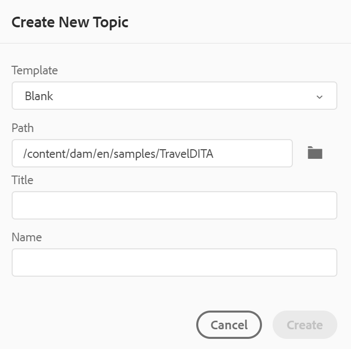{width="300" align="left"}

Geben **im Dialogfeld** Neues Thema erstellen“ die folgenden Details an:

- Eine Vorlage, auf der das Thema basieren soll. Bei einem vorkonfigurierten Setup können Sie beispielsweise aus den Vorlagen „Leer“, „Konzept“, „DITAVAL“, „Referenz“, „Aufgabe“, „Thema“ und „Fehlerbehebung“ wählen.

  Wenn für Ihren Ordner ein Ordnerprofil konfiguriert ist, werden nur die Themenvorlagen angezeigt, die für das Ordnerprofil konfiguriert sind.

- Pfad zum Speichern der Themendatei. Standardmäßig wird der Pfad des aktuell ausgewählten Ordners im Repository im Feld Pfad angezeigt.
- Ein Titel für das Thema.

- *\(Optional\)* Der Dateiname für das Thema. Der Dateiname wird basierend auf dem Thementitel automatisch vorgeschlagen.

  Wenn Ihr Administrator automatische Dateinamen auf der Grundlage von UUID-Einstellungen aktiviert hat, wird das Feld Name nicht angezeigt, wie im folgenden Screenshot gezeigt:

  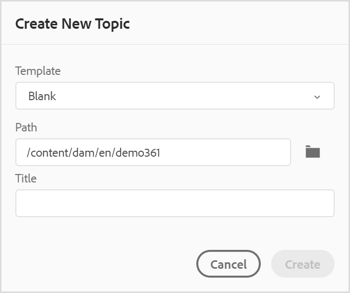{width="300" align="left"}


Wenn Sie auf **Erstellen** klicken, wird das Thema unter dem angegebenen Pfad erstellt. Außerdem wird das Thema im Web-Editor zur Bearbeitung geöffnet.

***Erstellen einer DITA-Karte***

Wenn Sie sich für *Erstellen einer neuen DITA-*&quot; entscheiden, wird das folgende Dialogfeld angezeigt:

{width="300" align="left"}

Geben **im Dialogfeld** Neue Zuordnung erstellen“ die folgenden Details an:

- Eine Vorlage, auf der die Zuordnung basieren soll. Für ein vorkonfiguriertes Setup können Sie beispielsweise aus den Vorlagen „Bookmap“ oder „DITA Map“ auswählen.

- Pfad, in dem die Zuordnungsdatei gespeichert werden soll. Standardmäßig wird der Pfad des aktuell ausgewählten Ordners im Repository im Feld Pfad angezeigt.
- Ein **Titel** für die Karte.

- *\(Optional\)* Der Dateiname für die Zuordnung. Der Dateiname wird basierend auf dem Zuordnungstitel automatisch vorgeschlagen.

  Wenn Ihr Administrator automatische Dateinamen basierend auf der UUID-Einstellung aktiviert hat, wird das Feld Name nicht angezeigt.


Wenn Sie auf **Erstellen** klicken, wird die Zuordnung innerhalb des im Feld Pfad angegebenen Ordners erstellt und hinzugefügt. Außerdem wird die Karte in der Kartenansicht geöffnet. Sie können die Zuordnungsdatei im Zuordnungs-Editor öffnen und ihr ein Thema hinzufügen. Weitere Informationen zum Hinzufügen von Themen zu einer Zuordnungsdatei finden Sie unter [Erstellen einer Zuordnung](map-editor-create-map.md#).

***Erstellen eines Ordners***

Wenn Sie sich für *Erstellen eines neuen Ordners* entscheiden, wird das Dialogfeld **Neuen Ordner erstellen** angezeigt:

{width="300" align="left"}

Geben Sie einen **Titel** für den Ordner ein, der automatisch in den Ordnernamen konvertiert wird. Pfad ist der Ort, an dem Sie die Zuordnungsdatei speichern möchten. Standardmäßig wird der Pfad des aktuell ausgewählten Ordners im Repository im Feld Pfad angezeigt. Wenn Sie auf **Erstellen** klicken, wird der Ordner in dem Ordner erstellt und hinzugefügt, in dem die Option „Ordner erstellen“ ausgeführt wurde.

**Kartenansicht** - 

Wenn Sie auf das Symbol Kartenansicht klicken, erhalten Sie eine Liste von Themen in der Kartendatei. Wenn Sie keine Zuordnungsdatei geöffnet haben, erscheint die Zuordnungsansicht leer. Ein Doppelklick auf eine Kartendatei öffnet die Kartendatei in dieser Ansicht. Sie können auf eine Datei innerhalb der Zuordnung doppelklicken, um sie im Web-Editor zu öffnen.

Standardmäßig können Sie die Dateien nach Titeln anzeigen. Wenn Sie mit dem Mauszeiger auf eine Datei zeigen, können Sie den Dateititel und den Dateipfad als QuickInfo anzeigen.

>[!NOTE]
>
>Als Administrator können Sie auch den Dateinamen der übergeordneten Zuordnung anzeigen, die derzeit in der Zuordnungsansicht geöffnet ist. Wählen Sie die **Dateiname** im Abschnitt **Dateien anzeigen nach** in **Benutzereinstellungen** .


Wenn Sie eine Karte in der Kartenansicht öffnen, wird der Titel der aktuellen Karte in der Mitte der Symbolleiste angezeigt. Wenn der Titel zu lang ist, werden Auslassungspunkte angezeigt. Sie können auch den Mauszeiger über den Titel bewegen, um den vollständigen Titel in der QuickInfo anzuzeigen.

Wenn Sie Schlüsselattribute für die Themen- oder Zuordnungsreferenzen definieren, können Sie den Titel, das entsprechende Symbol und den Schlüssel im linken Bereich anzeigen. Die Taste wird als `keys=<key-name>` angezeigt.

{width="300" align="left"}

Wenn Sie Bearbeitungsrechte für die Zuordnungsdateien haben, können Sie auch die Dateien bearbeiten. Weitere Informationen zum Öffnen und Bearbeiten eines Themas über DITA Map finden Sie unter [Themen über DITA Map bearbeiten](map-editor-advanced-map-editor.md#id17ACJ0F0FHS).


Mit dem Menü Optionen der Zuordnungsdatei können Sie die folgenden Aktionen ausführen:

{width="550" align="left"}

- **Bearbeiten**: Öffnen Sie die Zuordnungsdatei zur Bearbeitung im erweiterten Zuordnungs-Editor.

- **Alle auswählen** Wählen Sie alle Dateien in der Zuordnung aus.

- **Auswahl aufheben**: Heben Sie die Auswahl der ausgewählten Dateien in der Zuordnung auf.

- **Auschecken und Sperren**: Auschecken und Sperren der ausgewählten Dateien in der Zuordnung.

- **Auschecken und Entsperren abbrechen**: Entsperrt die Zuordnungsdatei und stellt sie zur Bearbeitung bereit. Die Änderungen werden nicht auf eine frühere Version zurückgesetzt.

- **Als neue Version speichern und entsperren**: Erstellen Sie eine neuere Version und lösen Sie die Sperre für die ausgewählten Dateien in der Zuordnung auf.

- **Vorschau**: Öffnet eine Vorschau der Zuordnungsdatei. In dieser Ansicht werden alle Themendateien innerhalb der Zuordnung in einer einzigen, einheitlichen Seitenansicht angezeigt.

- **Kopieren**: Sie können aus den folgenden Optionen auswählen:
   - **UUID kopieren**: Kopieren Sie die UUID der Zuordnungsdatei in die Zwischenablage.
   - **Pfad kopieren**: Kopieren Sie den vollständigen Pfad der Zuordnungsdatei in die Zwischenablage.

- **Im Repository suchen**: Zeigt den Speicherort der Zuordnungsdatei im Repository \(oder DAM\) an.

- **Hinzufügen zu**: Sie können aus den folgenden Optionen auswählen:
   - **Favoriten**: Fügt die Zuordnungsdatei zu den Favoriten hinzu. Sie können ihn zu einer vorhandenen oder neuen Favoritensammlung hinzufügen.

   - **Wiederverwendbarer Inhalt**: Fügt die Zuordnungsdatei zur Liste der wiederverwendbaren Inhalte im linken Bereich hinzu.

- **Eigenschaften**: Verwenden Sie diese Option, um die Eigenschaftenseite der Zuordnungsdatei zu öffnen. Sie können auf diese Eigenschaftsseite auch über die Assets-Benutzeroberfläche zugreifen, indem Sie eine Datei auswählen und in der Symbolleiste auf das Symbol Eigenschaften klicken.

- **Map-Dashboard öffnen**: Öffnet das Map-Dashboard.

- **In Assets-Benutzeroberfläche anzeigen**: Verwenden Sie diese Option, um eine Vorschau der Zuordnungsdatei in der Assets-Benutzeroberfläche anzuzeigen. In dieser Ansicht werden alle Themendateien innerhalb der Zuordnung in einer einzigen, einheitlichen Seitenansicht angezeigt.
- **Karte herunterladen**: Wählen Sie diese Option, um das Dialogfeld **Karte herunterladen** zu öffnen.

Im **Karte herunterladen** können Sie die folgenden Optionen auswählen:

- **Baseline verwenden**: Wählen Sie diese Option, um eine Liste der Baselines zu erhalten, die für die DITA-Zuordnung erstellt wurden. Wenn Sie die Zuordnungsdatei und deren Inhalte basierend auf einer bestimmten Baseline herunterladen möchten, wählen Sie die Baseline aus der Dropdown-Liste aus. Weitere Informationen zum Arbeiten mit Grundlinien finden Sie unter [Arbeiten mit Grundlinien](./generate-output-use-baseline-for-publishing.md).
- **Dateihierarchie reduzieren**: Wählen Sie diese Option, um alle referenzierten Themen und Mediendateien in einem Ordner zu speichern.

  Sie können die Zuordnungsdatei auch herunterladen, ohne eine Option auszuwählen. In diesem Fall werden die letzten persistierten Versionen der referenzierten Themen und Mediendateien heruntergeladen.

  Nachdem Sie auf die Schaltfläche **Herunterladen** geklickt haben, wird die Anfrage für das Zuordnungspaket in die Warteschlange gestellt. Das **Erfolg**-Dialogfeld wird angezeigt, wenn das Paket erfolgreich erstellt wurde.  Sie können auf die Schaltfläche **Herunterladen** im Dialogfeld **Erfolg** klicken.

  Sie erhalten die Benachrichtigung „Map-Download bereit“, wenn die Karte zum Herunterladen bereit ist. Falls der Download fehlschlägt, erhalten Sie die Benachrichtigung, dass der Map-Download fehlgeschlagen ist.

  Sie können auf den Download-Link über den AEM-Benachrichtigungs-Posteingang zugreifen. Wählen Sie die generierte Zuordnungsbenachrichtigung im Posteingang aus, um die Zuordnung im ZIP-Format herunterzuladen.

  >[!NOTE]
  >
  >  Standardmäßig bleiben die heruntergeladenen Zuordnungen fünf Tage lang im AEM-Benachrichtigungs-Posteingang.

- **Ausgabe generieren**: Generiert die Ausgabe für die ausgewählte Zuordnungsdatei. Die Ausgabe kann nur für Dateien generiert werden, die Teil einer Ausgabevorgabe sind. Weitere Informationen finden Sie unter [Artikelbasierte Veröffentlichung im Web-Editor](web-editor-article-publishing.md#id218CK0U019I).
- **Schließen**: Schließt die Zuordnungsdatei.


Der folgende Screenshot zeigt das Optionsmenü für eine Datei in der DITA-Kartenansicht:

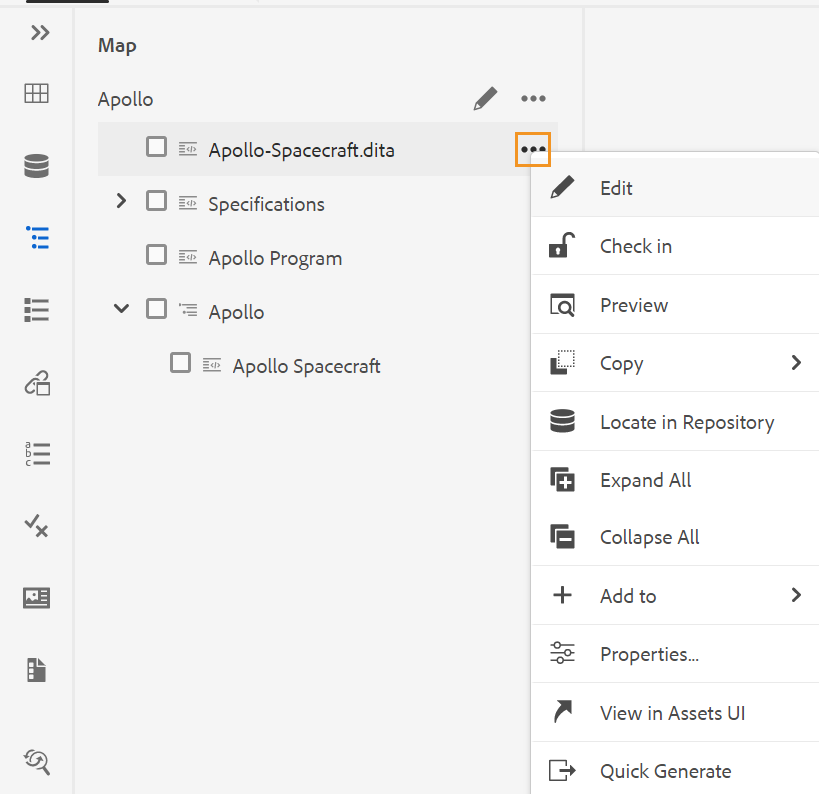{width="550" align="left"}

Mit dem Menü Optionen können Sie die folgenden Aktionen ausführen:

- **Bearbeiten**: Öffnen Sie die Datei zur Bearbeitung. Im Falle einer .ditamap/.bookmap-Datei wird diese zur Bearbeitung im [Erweiterten Karten-Editor](map-editor-advanced-map-editor.md#) geöffnet.

- **Auschecken**: Ausgewählte Datei auschecken. Bei einer ausgecheckten Datei ändert sich diese Option in **Einchecken**.


  >[!NOTE]
  >
  > - Wenn eine Datei von einem Benutzer gesperrt oder ausgecheckt wurde, wird durch Bewegen des Mauszeigers über dem Sperrsymbol der Benutzer \(name\) angezeigt, der die Datei gesperrt hat.
  > - Wenn Sie eine Datei einchecken, werden Sie aufgefordert, die Änderungen zu speichern. Wenn Sie Ihre Änderungen nicht speichern, wird nur die Datei eingecheckt.

- **Vorschau**: Erhalten Sie eine schnelle Vorschau der Datei (.dita, .xml, Audio, Video oder Bild), ohne sie zu öffnen. Sie können die Größe des Vorschaubereichs ändern. Wenn der Inhalt `<xref>` oder `<conref>` enthält, können Sie diese auswählen, um sie in einer neuen Registerkarte zu öffnen.  Der Titel der Datei wird im Fenster angezeigt. Wenn kein Titel vorhanden ist, wird der Dateiname angezeigt. Um den Fensterbereich **Vorschau** zu schließen, können Sie entweder das Symbol zum Schließen auswählen oder auf eine beliebige Stelle außerhalb des Fensterbereichs klicken.
- **Kopieren**: Sie können aus den folgenden Optionen auswählen:
   - **UUID kopieren**: Kopieren Sie die UUID der ausgewählten Datei in die Zwischenablage.
   - **Pfad kopieren**: Kopieren Sie den vollständigen Pfad der ausgewählten Datei in die Zwischenablage.


- **Im Repository suchen**: Zeigt den Speicherort der ausgewählten Datei im Repository \(oder DAM\) an.
- **Alle erweitern**: Alle Themen in den Zuordnungsdateien erweitern.

- **Alle reduzieren**: Alle Themen ausblenden, die Teil der aktuellen Zuordnungsdatei sind.

- **Hinzufügen zu**: Sie können aus den folgenden Optionen auswählen:
   - **Favoriten**: Fügt die ausgewählte Datei zu den Favoriten hinzu. Sie können ihn zu einer vorhandenen oder neuen Favoritensammlung hinzufügen.

   - **Wiederverwendbarer Inhalt**: Fügt die ausgewählte Datei der Liste Wiederverwendbarer Inhalt im linken Bereich hinzu.

- **Eigenschaften**: Hiermit können Sie die Eigenschaftsseite der ausgewählten Datei öffnen. Sie können auf diese Eigenschaftsseite auch über die Assets-Benutzeroberfläche zugreifen, indem Sie eine Datei auswählen und in der Symbolleiste auf das Symbol Eigenschaften klicken.

- **In Assets-Benutzeroberfläche anzeigen**: Verwenden Sie diese Option, um eine Vorschau einer .dita/.xml-Datei in der Assets-Benutzeroberfläche anzuzeigen. Bei einer .ditamap/.bookmap-Datei werden alle Themendateien innerhalb der Karte in einer einzigen einheitlichen Seitenansicht angezeigt.

- **Schnellerstellung**: Generiert die Ausgabe für die ausgewählte Datei. Die Ausgabe kann nur für Dateien generiert werden, die Teil einer Ausgabevorgabe sind. Weitere Informationen finden Sie unter [Artikelbasierte Veröffentlichung im Web-Editor](web-editor-article-publishing.md#id218CK0U019I).

>[!NOTE]
>
> Sie können die Eigenschaften ausgewählter Themen in einer DITA-Karte auch über das Menü **Weitere Optionen** unten in der Kartenansicht öffnen und bearbeiten.

**Gliederungsansicht** - 

Wenn Sie auf das Symbol Gliederungsansicht klicken, erhalten Sie die hierarchische Ansicht der im Dokument verwendeten Elemente.

{width="300" align="left"}

Die Gliederungsansicht bietet die folgenden Funktionen:

- Eine Baumansicht aller im Dokument verwendeten Elemente.

- Wenn ein Element eine ID, ein Attribut und einen Text hat, können Sie diese zusammen mit dem Element sehen.

- Greifen Sie in der Autoren- und Source-Ansicht auf die Gliederungsansicht zu.

- Verwenden Sie die Dropdown-Liste Filter , um alle Elemente oder nur die beschädigten Verweise anzuzeigen:

- Durch Klicken auf ein Element in der Gliederungsansicht wird der Inhalt des Elements in der Authoring- oder Source-Ansicht ausgewählt. Die Gliederungsansicht bleibt mit der Authoring- und Source-Ansicht synchronisiert. Wenn Sie Änderungen in einer Ansicht vornehmen, werden diese in der Gliederungsansicht angezeigt. Wenn Sie beispielsweise einen Absatz hinzufügen oder ein Element in der Autorenansicht aktualisieren, wird dies in der Gliederungsansicht angezeigt.

  {width="650" align="left"}

- Elemente per Drag-and-Drop verschieben. Sie können ein Element einfach ersetzen, indem Sie ein anderes Element darauf ablegen. Wenn Sie ein Element per Drag-and-Drop über ein anderes Element ziehen und ein quadratisches Feld um das Element sehen, bedeutet dies, dass das Element ersetzt wird. Es ersetzt das Element, auf dem das Element abgelegt wird.

  {width="300" align="left"}

  Wenn Sie ein Element per Drag-and-Drop ziehen, zeigt ein gestricheltes Rechteck an, dass das Element an der aktuellen Position platziert werden kann. Wenn Drag-and-Drop ungültig ist, wird eine Fehlermeldung angezeigt, die darauf hinweist, dass der Vorgang nicht zulässig ist.

  {width="300" align="left"}

- Das Menü **Optionen** in der *Gliederungsansicht* ermöglicht Ihnen die Durchführung allgemeiner Vorgänge wie Ausschneiden, Kopieren, Löschen, ID generieren, Element vor oder nach dem aktuellen Element einfügen, ein Element umbenennen oder ersetzen, Element einschließen, Element entpacken und ein Snippet aus dem ausgewählten Element erstellen.

>[!NOTE]
>
>Weitere Informationen zum Generieren einer ID, zum Einfügen eines Elements vor oder nach dem aktuellen Element und zum Entpacken eines Elements finden Sie unter [Weitere Funktionen im Web-Editor](web-editor-other-features.md#).

**Anzeigeoptionen für das Bedienfeld Gliederungsansicht**

Über das Dropdown-Menü „Anzeigeoptionen“ können Sie Folgendes anzeigen, wenn das Element über diese verfügt:

- **ID anzeigen**: Zeigt die ID des Elements an.
- **Attribut anzeigen**: Zeigt das Attribut zusammen mit seinem Wert an.
- **Text anzeigen**: Zeigt den Text an. Wenn der Text länger als 20 Zeichen ist, wird ein Auslassungszeichen angezeigt.

Wenn ein Blockelement über einen eigenen Text verfügt, wird er zusammen mit diesem Blockelement angezeigt. Wenn er keinen eigenen Text hat, wird der Text des ersten untergeordneten Elements zusammen mit diesem Blockelement angezeigt.

{width="550" align="left"}

Wenn Ihr Administrator ein Profil für Attribute erstellt hat, erhalten Sie diese Attribute zusammen mit den konfigurierten Werten. Sie können auch von Ihrem Administrator konfigurierte Anzeigeattribute auf der Registerkarte **Anzeigeattribute** in den Editor-Einstellungen zuweisen. Die für ein Element definierten Attribute werden im Layout- und Gliederungsansicht angezeigt.


Weitere Informationen finden Sie unter *Attribute anzeigen* im Abschnitt *Editor-Einstellungen* -Funktionsbeschreibung [Linkes Bedienfeld](web-editor-features.md#id2051EA0M0HS).

**Suchfunktion**
Mithilfe der Suchfunktion können Sie nach einem Element anhand seines Namens, seiner ID, seines Textes oder seines Attributwerts suchen.

Bei der Suche wird nicht zwischen Groß- und Kleinschreibung unterschieden und die Zeichenfolge wird genau zurückgegeben. Die Suchergebnisse werden nach der Position des Elements im Dokument sortiert.

Sie können im Element nach einer Zeichenfolge suchen, wenn diese im Bereich Gliederungsansicht angezeigt wird. Wenn beispielsweise die Zeichenfolge &quot;Adobe&quot; im Elementtext vorhanden und im Bedienfeld Gliederungsansicht angezeigt wird (wie Sie **Text anzeigen** aus dem Dropdown-Menü „Anzeigeoptionen“ ausgewählt haben), wird das enthaltende Element gefiltert. Wenn der Text jedoch nicht im Gliederungsansichtsbereich angezeigt wird (da Sie **Text anzeigen** in der Dropdown-Liste „Ansichtsoptionen“ nicht ausgewählt haben), wird das enthaltende Element nicht gefiltert. Ebenso finden Sie die Zeichenfolge in der ID oder den Attributen, sofern Sie sie ausgewählt haben.


**Wiederverwendbarer Inhalt** - 

Eines der Hauptmerkmale von DITA ist die Möglichkeit, Inhalte wiederzuverwenden. Im Bedienfeld Wiederverwendbarer Inhalt können Sie Ihre DITA-Dateien speichern, von wo aus Sie in der Regel wiederverwendbare Inhalte einfügen. Nach dem Hinzufügen verbleiben die DITA-Dateien sitzungsübergreifend im Bedienfeld Wiederverwendbare Inhalte . Das bedeutet, dass Sie Ihre DITA-Dateien nicht erneut hinzufügen müssen, um später darauf zuzugreifen.

Sie können wiederverwendbare Inhalte einfach per Drag-and-Drop aus dem Bedienfeld auf Ihr aktuelles Thema ziehen und es wird einfach und schnell eingefügt. Sie können auch eine Vorschau des Inhalts erhalten, bevor Sie ihn in Ihr Dokument einfügen.

Standardmäßig können Sie die Dateien nach Titeln anzeigen. Wenn Sie mit dem Mauszeiger auf eine Datei zeigen, können Sie den Dateititel und den Dateipfad als QuickInfo anzeigen.

>[!NOTE]
>
> Als Administrator können Sie die Liste der Dateien nach Dateinamen im Web-Editor anzeigen. Wählen Sie die **Dateiname** im Abschnitt **Dateien anzeigen nach** in **Benutzereinstellungen** .

Um eine DITA-Datei zu Ihrem Bedienfeld Wiederverwendbarer Inhalt hinzuzufügen, verwenden Sie eine der folgenden Methoden:

- Klicken Sie auf das Symbol + neben Wiederverwendbare Inhalte , um das Dialogfeld Datei durchsuchen zu öffnen. Wählen Sie die Datei aus, die Sie hinzufügen möchten, und klicken Sie auf **Hinzufügen**, um den Vorgang abzuschließen.

  {width="650" align="left"}

- Klicken Sie in der Repository-Ansicht auf das Symbol „Optionen“ der gewünschten Datei und wählen Sie **Zu wiederverwendbarem Inhalt hinzufügen** aus dem Kontextmenü aus.

- Klicken Sie im Editor mit der rechten Maustaste auf die Registerkarte einer Datei, um das Kontextmenü zu öffnen, und wählen Sie **Zu wiederverwendbarem Inhalt hinzufügen**.


Nachdem die Datei hinzugefügt wurde, können Sie alle wiederverwendbaren Inhaltselemente aus der Datei im Bedienfeld „Wiederverwendbarer Inhalt“ sehen. Wiederverwendbare Inhalte werden mit ihren IDs und Elementnamen angezeigt.

Wenn Sie eine Datei zur Liste Wiederverwendbarer Inhalt hinzufügen, wird der Titel der Datei anstelle der UUID der Datei angezeigt. Um die UUID der Datei zu überprüfen, bewegen Sie den Mauszeiger über den Titel der Datei, und die UUID der Datei wird in der QuickInfo angezeigt.

{width="300" align="left"}

>[!NOTE]
>
> Sie können der Liste wiederverwendbarer Inhalte mehrere Dateien hinzufügen. Anschließend können Sie den gewünschten Inhalt aus dem Bedienfeld Wiederverwendbare Inhalte in Ihr Dokument einfügen.

**Aktualisieren**: Überprüft erneut alle wiederverwendbaren Inhalte und zeigt eine neue Liste der wiederverwendbaren Inhalte an.

Verwenden Sie eine der folgenden Methoden, um Inhalte aus dem Bedienfeld Wiederverwendbarer Inhalt einzufügen:

- Bewegen Sie den Mauszeiger über ein Element, das Sie einfügen möchten, klicken Sie auf das Optionssymbol und wählen Sie **Wiederverwendbaren Inhalt einfügen**.

  {width="400" align="left"}

  >[!NOTE]
  >
  > Wählen Sie eine Datei aus und wählen Sie **Vorschau** aus dem Menü **Optionen**, um eine Vorschau der Datei anzuzeigen, ohne sie zu öffnen. Sie können auch eine Vorschau der in einem Thema vorhandenen Verweise anzeigen. Die Referenz-ID wird im Fenster angezeigt.
  >
  > Die **Vorschau**-Option ist auch im Menü **Optionen** eines Elements verfügbar, das Ihnen vor dem Einfügen eine kurze Vorschau des Elements liefert.

- Ziehen Sie das wiederverwendbare Inhaltselement per Drag-and-Drop aus dem Bedienfeld an die gewünschte Position in Ihrem Dokument.


**Glossar** - 

AEM Guides ermöglicht die einfache Erstellung und Verwendung von Glossardokumenten. Sie können Glossarthemendateien erstellen und sie dann in eine gemeinsame Glossarzuordnung einbinden. Sobald diese Zuordnung als Stammzuordnung hinzugefügt wurde, werden die Glossareinträge im Glossar-Bedienfeld angezeigt.

{width="650" align="left"}

Um einen Begriff aus dem Glossar einzufügen, ziehen Sie den Eintrag einfach per Drag-and-Drop aus dem Bedienfeld an die gewünschte Position in Ihrem Thema. Das Menü Optionen eines Glossarbegriffs bietet einen schnellen Überblick **Vorschau** des Eintragsbegriffs, **Pfad kopieren** der Eintragsbegriffdatei oder Auffinden der Eintragsbegriffdatei im Repository.

Führen Sie die folgenden Schritte aus, um nach Textausdrücken zu suchen und sie durch Glossarabkürzungen zu ersetzen:

1. Öffnen Sie das DITA-Thema oder die DITA-Karte, in dem bzw. der Sie den Text oder die Begriffe suchen und konvertieren möchten.
1. Wählen Sie das Glossar-Bedienfeld aus, um die in der Stammzuordnung vorhandenen Glossarbegriffe anzuzeigen. Sie können diese Begriffe per Drag-and-Drop in das geöffnete Thema einfügen.
1. Wählen Sie das **Hotspot**-Tool \( \) im Glossar-Bedienfeld, um bestimmte Textbegriffe zu suchen und in verknüpfte Glossar-Abkürzungen zu konvertieren. Umgekehrt können Sie damit auch nach Glossarkürzeln suchen und diese in Textbegriffe konvertieren.

{width="300" align="left"}

Sie können die folgenden Einstellungen des Hotspot-Tools konfigurieren:

{width="300" align="left"}

- **Glossarschlüssel**: Wählen Sie die Glossarschlüssel aus der DITA-Karte aus, die Sie für die Suche im ausgewählten Thema verwenden möchten. Die ausgewählten Tasten werden unten angezeigt. Sie können eine ausgewählte Taste entfernen, indem Sie auf das Symbol **Entfernen** klicken.

- **Themen**: Wählen Sie entweder das **Aktuelles Thema**, das im Web-Editor geöffnet ist, alle **Geöffneten Themen** in der aktuellen Karte oder die **Aktuelle Karte**, die im Karten-Editor bearbeitet wird, um die Begriffe zu suchen.
- **Themen nach Status filtern**: Sie können die Suche auf Themen mit dem ausgewählten Dokumentstatus beschränken. Die Themen können den Status Entwurf, Bearbeiten, In-Überprüfung, Genehmigt, Überprüft, Fertig oder einen der von der Organisation konfigurierten Status aufweisen.
- **Aktion**: Sie können die Glossarschlüssel entweder &quot;**für jedes Thema“** &quot;**für alle Themen“**. Wenn Sie **Manuell für jedes Thema** auswählen, werden Sie aufgefordert, dies zu bestätigen, bevor Sie jeden Begriff in jedem Thema konvertieren. Wenn Sie **Automatisch für alle Themen** auswählen, werden alle Begriffe in allen Themen automatisch konvertiert.
- **Konvertieren**: Sie können entweder einen gesuchten **Text in Glossarbegriff** oder **Glossarbegriff in Text konvertieren.**
- **Optionen**: Sie können aus den folgenden Optionen auswählen:
   - **Übereinstimmung unter Berücksichtigung von Groß**- und Kleinschreibung: Sucht nach einem Begriff, um die Übereinstimmung mit derselben Groß-/Kleinschreibung zu finden. „USB“ entspricht beispielsweise nicht „USB“.
   - **Nur die erste Instanz konvertieren**: Wenn mehrere Instanzen des gesuchten Begriffs in einem Thema vorhanden sind, wird nur die erste Instanz konvertiert.
   - **Datei vor der Konvertierung auschecken**: Die gesuchte Datei wird ausgecheckt, bevor die Begriffe konvertiert werden.
   - **Neue Version nach Konvertierung erstellen**: Nach Abschluss der Konvertierung von Begriffen wird eine neue Version des Themas erstellt.
- **Weiter** wird angezeigt, wenn Sie die Option **Manuell für jedes Thema** auswählen. Klicken Sie **Weiter**, um die Begriffe für jedes Thema basierend auf den ausgewählten Einstellungen zu konvertieren. Es fordert bei jedem Thema zur Konvertierung der Begriffe auf und wechselt zur nächsten Datei. Sie können einen Begriff konvertieren oder überspringen und zum nächsten Begriff wechseln.

  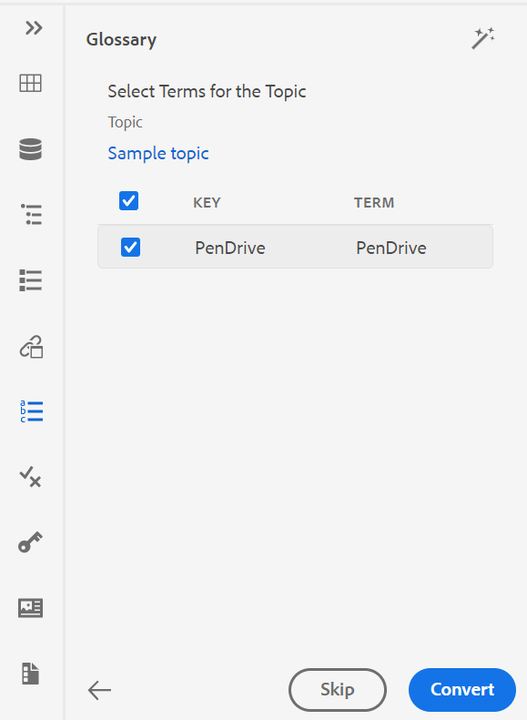{width="300" align="left"}

- **Konvertieren** wird angezeigt, wenn Sie die Option **Automatisch für alle Themen** auswählen. Wählen Sie **Konvertieren** aus, um alle im Dokument enthaltenen Begriffe in verknüpfte Glossarabkürzungen zu konvertieren.

Eine Liste der **Themen aktualisiert** mit den konvertierten Begriffen und **Themen mit Fehler** wird angezeigt. Bewegen Sie den Mauszeiger über das Symbol \( \) neben Themen mit Fehler , um die Details des Fehlers anzuzeigen.

{width="300" align="left"}

>[!NOTE]
>
> Aktualisieren Sie das Thema, um die konvertierten Begriffe anzuzeigen.

**Bedingungen** - 

Im Bedienfeld Bedingungen werden die von Ihrem Administrator definierten bedingten Attribute im globalen Profil oder im Profil auf Ordnerebene angezeigt. Sie können Bedingungen zu Ihrem Inhalt hinzufügen, indem Sie die gewünschte Bedingung einfach per Drag-and-Drop auf Ihren Inhalt ziehen. Der bedingte Inhalt wird mit der für die Bedingung definierten Farbe hervorgehoben, damit er leicht identifiziert werden kann.

Sie können auch mehrere Bedingungen auf ein Element anwenden, indem Sie mehrere Bedingungen auf ein Element ziehen und dort ablegen. Wenn Sie mehrere Bedingungen auf ein Element anwenden, zeigt das Bedienfeld Eigenschaften die angewendeten Bedingungen getrennt durch ein Komma an.

{width="800" align="left"}

In der Code-Ansicht werden die Bedingungen jedoch durch ein Leerzeichen getrennt. Wenn Sie eine Bedingung in der Code-Ansicht hinzufügen oder bearbeiten, stellen Sie sicher, dass mehrere Bedingungen durch ein Leerzeichen getrennt werden.

>[!IMPORTANT]
>
> Der folgende Screenshot zeigt einen Benutzer mit Administratorrechten. Als Benutzer mit Administratorrechten können Sie Bedingungen hinzufügen, bearbeiten und löschen. Andernfalls haben Sie als normaler Autor nur die Möglichkeit, Bedingungen anzuwenden.

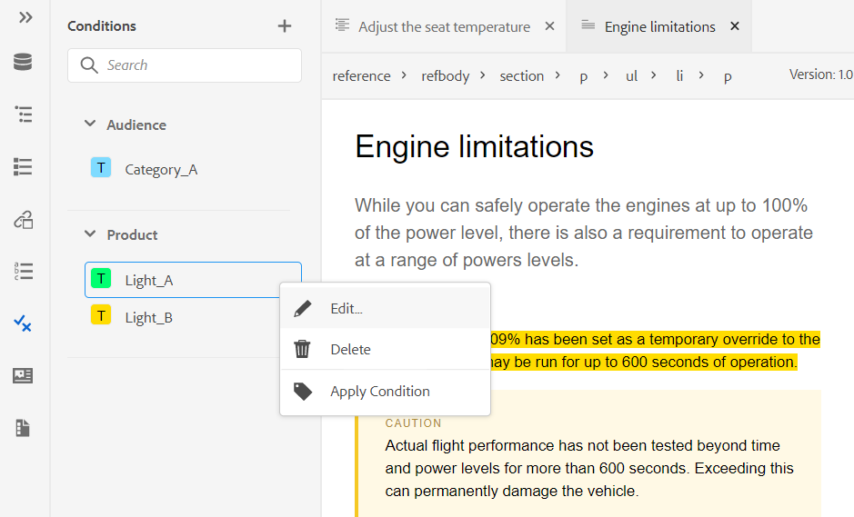{width="800" align="left"}

Um eine Bedingung hinzuzufügen oder zu definieren, klicken Sie auf das Symbol + neben dem Bedienfeld Bedingungen , um das Dialogfeld Bedingung definieren aufzurufen:

{width="400" align="left"}

Wählen Sie aus der Liste Attribut das bedingte Attribut aus, das Sie definieren möchten, geben Sie einen Wert für die Bedingung ein und geben Sie dann die Bezeichnung an, die im Bedienfeld Bedingungen angezeigt wird. Definieren Sie eine Gruppe für die Bedingung. Sie können einer Gruppe mehrere Bedingungen hinzufügen. Sie können auch eine Farbe für die Bedingung definieren. Diese Farbe wird als Hintergrundfarbe des Inhalts festgelegt, auf den die Bedingung angewendet wird.

Sie können die Bedingungen gruppieren und in verschachtelten Ordnern strukturieren. Mit Gruppen können Sie Bedingungen auf mehreren Ebenen erstellen und sie besser für die Verwendung im Inhalt organisieren.

Beispielsweise können Sie Bedingungsgruppen von Produkten wie *Acrobat* und *AEM Guides* erstellen. Sie können die bedingten Attribute für beide Gruppen auswählen. Unter jeder Gruppe können Sie bestimmte Werte wie *Benutzer*, *Admin*, *Prüfer* und *Autor* haben.

>[!NOTE]
>
> Geben Sie entweder ein, um eine neue Gruppe zu erstellen, oder wählen Sie eine vorhandene Gruppe für ein bestimmtes Attribut aus.

Sie können `/` verwenden und Untergruppen definieren, um Untergruppen wie `AEM Guides/Cloud Service` zu definieren.


{width="300" align="left"}


Um eine Bedingung zu bearbeiten, wählen Sie **Bearbeiten** aus dem Menü „Optionen“. Das Dialogfeld „Bedingung bearbeiten“ wird angezeigt:

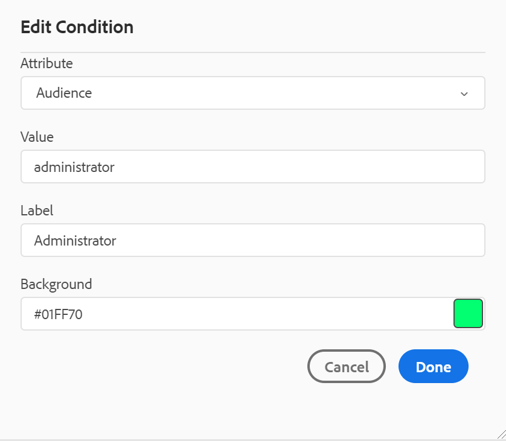{width="400" align="left"}

Geben Sie die Details auf die gleiche Weise an wie bei der Konfiguration bei der Definition einer neuen Bedingung.

**Schema** - 

Subject Scheme maps sind eine spezielle Form von DITA-Karten, mit denen taxonomische Themen und kontrollierte Werte definiert werden können. Je nach Ihren Anforderungen können Sie eine Zuordnung für das Betreffschema erstellen und in Ihrer Stammzuordnungsdatei darauf verweisen. Mit AEM Guides können Sie die Hierarchie der Betreffdefinitionen in Ihrem Betreffschema auf verschachtelter Ebene definieren.

Sie können das Betreffschema einfach in einer Zuordnung des Betreffschemas erstellen und dann verwenden. Nachdem diese Zuordnung als Stammzuordnung hinzugefügt wurde, wird das Betreffschema im Bedienfeld „Betreffschema“ angezeigt. Das Bedienfeld „Betreffschema“ zeigt das verfügbare Betreffschema verschachtelt oder hierarchisch an.

AEM Guides unterstützt auch verschachtelte Zuordnungen von Betreffschemata. Außerdem können unter der Stamm-Zuordnung des Betreffschemas mehrere Betreffschemata definiert sein.

Das folgende Beispiel zeigt die Verwendung des Betreffschemas in AEM Guides.

1. Erstellen Sie eine Datei mit einem Schema in einem Tool Ihrer Wahl. Der folgende XML-Code erstellt ein Betreffschema, das Werte für das `platform`-Attribut bindet.

   ```XML
   <?xml version="1.0" encoding="UTF-8"?>
   <!DOCTYPE subjectScheme PUBLIC "-//OASIS//DTD DITA Subject Scheme Map//EN" "subjectScheme.dtd">
   <subjectScheme id="GUID-4f942f63-9a20-4355-999f-eab7c6273270">
       <title>rw</title>
       <!-- Define new OS values that are merged with those in the unixOS scheme -->
       <subjectdef keys="os">
           <subjectdef keys="linux">    </subjectdef>
           <subjectdef keys="mswin">    </subjectdef>
           <subjectdef keys="zos">    </subjectdef>
       </subjectdef>
       <!-- Define application values -->
       <subjectdef keys="app" navtitle="Applications">
           <subjectdef keys="apacheserv">    </subjectdef>
           <subjectdef keys="mysql">    </subjectdef>
       </subjectdef>
       <!-- Define an enumeration of the platform attribute, equal to       each value in the OS subject. This makes the following values       valid for the platform attribute: linux, mswin, zos -->
       <enumerationdef>
           <attributedef name="platform">    </attributedef>
           <subjectdef keyref="os">    </subjectdef>
       </enumerationdef>
       <!-- Define an enumeration of the otherprops attribute, equal to       each value in the application subjects.       This makes the following values valid for the otherprops attribute:       apacheserv, mysql -->
       <enumerationdef>
           <attributedef name="otherprops">    </attributedef>
           <subjectdef keyref="app">    </subjectdef>
       </enumerationdef>
   </subjectScheme>
   ```

   {width="300" align="left"}

1. Speichern Sie die Datei mit der Erweiterung a.ditamap und laden Sie sie in einen beliebigen Ordner in DAM hoch.

   >[!NOTE]
   >
   > Sie können der Schemadatei einen Verweis in der übergeordneten DITA-Zuordnung hinzufügen.

   {width="550" align="left"}

1. Legen Sie die übergeordnete Zuordnung als Stammzuordnung in „Benutzereinstellungen **fest**. Nachdem diese Zuordnung als Stammzuordnung hinzugefügt wurde, wird das Betreffschema im Bedienfeld „Betreffschema“ angezeigt.

   {width="400" align="left"}

1. Öffnen Sie im Web-Editor die Datei, in der Sie die Definitionen des Betreffschemas verwenden möchten.
1. Wenden Sie das Betreffschema auf Ihre Inhalte an, indem Sie einfach das gewünschte Betreffschema per Drag-and-Drop auf Ihren Inhalt ziehen. Der Inhalt wird dann in der definierten Farbe hervorgehoben.

   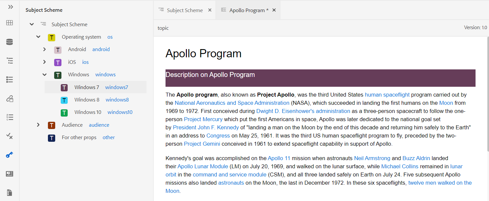{width="650" align="left"}

**Umgang mit hierarchischen Definitionen von Betreffdefinitionen und Auflistungen**

AEM Guides verarbeitet nicht nur die Auflistungen und die Objektdefinitionen in derselben Zuordnung, sondern bietet auch die Funktion zum Definieren von Auflistungen und Objektdefinitionen in zwei separaten Zuordnungen. Sie können eine oder mehrere Betreffdefinitionen in einer Zuordnung und die Auflistungsdefinitionen in einer anderen Zuordnung definieren und dann die Zuordnungsreferenz hinzufügen. Beispielsweise erstellt der folgende XML-Code Betreffdefinitionen und Auflistungsdefinitionen in zwei separaten Zuordnungen.

Die Definitionen des Betreffs sind in `subject_scheme_map_1.ditamap` definiert.


```XML
  <?xml version="1.0" encoding="UTF-8"?> 
    <!DOCTYPE subjectScheme PUBLIC "-//OASIS//DTD DITA Subject Scheme Map//EN" "../dtd/libs/fmdita/dita_resources/DITA-1.3/dtd/subjectScheme/dtd/subjectScheme.dtd"> 
    <subjectScheme id="subject-scheme.ditamap_f0bfda58-377b-446f-bf49-e31bc87792b3"> 

    <title>subject_scheme_map_1</title> 
    
    <subjectdef keys="os" navtitle="Operating system">
        <subjectdef keys="linux" navtitle="Linux">
        <subjectdef keys="redhat" navtitle="RedHat Linux">
        </subjectdef>
        <subjectdef keys="suse" navtitle="SuSE Linux">
        </subjectdef>
        </subjectdef>
        <subjectdef keys="windows" navtitle="Windows">
        </subjectdef>
        <subjectdef keys="zos" navtitle="z/OS">
        </subjectdef>
        </subjectdef>
        <subjectdef keys="deliveryTargetValues">
        <subjectdef keys="print">
        </subjectdef>
        <subjectdef keys="online">
        </subjectdef>
    </subjectdef>
    <subjectdef keys="mobile" navtitle="Mobile">
        <subjectdef keys="android" navtitle="Android">
        </subjectdef>
        <subjectdef keys="ios" navtitle="iOS">
    </subjectdef>
    </subjectdef>
    <subjectdef keys="cloud" navtitle="Cloud">
        <subjectdef keys="aws" navtitle="Amazon Web Services">
        </subjectdef>
        <subjectdef keys="azure" navtitle="Microsoft Azure">
        </subjectdef>
        <subjectdef keys="gcp" navtitle="Google Cloud Platform">
        </subjectdef>
    </subjectdef>
    </subjectScheme>
```

Die Definition der Auflistung ist vorhanden in    subject_scheme_map_2.ditamap.

```XML
    ?xml version="1.0" encoding="UTF-8"?> 
        <!DOCTYPE subjectScheme PUBLIC "-//OASIS//DTD DITA Subject Scheme Map//EN" "../dtd/libs/fmdita/dita_resources/DITA-1.3/dtd/subjectScheme/dtd/subjectScheme.dtd"> 
        <subjectScheme id="subject-scheme.ditamap_17c433d9-0558-44d4-826e-3a3373a4c5ae"> 
        <title>subject_scheme_map_2</title> 
        <mapref format="ditamap" href="subject_scheme_map_1.ditamap" type="subjectScheme"> 
        </mapref> 
        <enumerationdef>
        <attributedef name="platform">
        </attributedef>
        <subjectdef keyref="mobile">
        </subjectdef>
        <subjectdef keyref="cloud">
        </subjectdef>
        </enumerationdef>
        </subjectScheme>
```

Hier werden die Betreffdefinitionen in `subject_scheme_map_1.ditamap` definiert, während die Auflistung def in `subject_scheme_map_2.ditamap` vorhanden ist. Der Verweis auf `subject_scheme_map_1.ditamap` wird auch in `subject_scheme_map_2.ditamap` hinzugefügt.

>[!NOTE]
>
> Da die `subject_scheme_map_1.ditamap` und `subject_scheme_map_2.ditamap` miteinander referenziert werden, werden die Themenschemata aufgelöst.

Die Verweise auf die Auflistung des Antragstellers werden in der folgenden Prioritätsreihenfolge aufgelöst:

1. Gleiche Zuordnung
1. Referenzierte Zuordnung


Die Verweise werden nicht aufgelöst, wenn die Auflistung nicht in derselben Zuordnung und in der referenzierten Zuordnung gefunden wird.


**Werte auf ein bestimmtes Element beschränken**

Sie können die Bedingungen auch auf einige Elemente innerhalb eines Themas beschränken. Verwenden Sie das Tag `<elementdef>` , um das Element zu definieren, und das Tag `<attributedef>` , um die Bedingung zu definieren, die auf das Element angewendet werden kann.  Wenn Sie das Tag `<elementdef>` nicht hinzufügen, können Sie die Bedingungen auf alle Elemente anwenden.
Verwenden Sie beispielsweise die folgende Auflistung, um das Attribut `@platform` auf das Element `<shortdesc>` zu beschränken.  Die anderen Bedingungen sind für alle Elemente sichtbar.

```XML
<enumerationdef>
    <elementdef name="shortdesc">
    </elementdef>
    <attributedef name="platform">
    </attributedef>
    <subjectdef keyref="deliveryTargetValues">
    </subjectdef>
    <subjectdef keyref="os">
    </subjectdef>
  </enumerationdef>
```

</details>


**Attribute** Dropdown

Sie können den Wert des Betreffschemas auch über die Dropdown-Liste **Attribute** im Bedienfeld **Inhaltseigenschaften** in der Ansicht **Autor** ändern.
{width="200" align="left"}
Führen Sie die folgenden Schritte aus, um den Wert zu ändern:

1. Wählen Sie ein Attribut aus der Dropdown **Liste „Attribut** aus.
1. Wählen Sie **Bearbeiten**  aus.
1. Wählen Sie den erforderlichen Wert aus der Dropdown-Liste **Wert** aus.
1. Klicken Sie auf **Aktualisieren**.


Sie können auch Werte für ein Attribut anwenden, indem Sie mehrere Werte aus dem Dropdown-Menü auswählen.

**Source-Ansicht**

Sie können die Werte auch aus der Dropdown-Liste des Attributs in der Source-Ansicht ändern. Die Source-Ansicht verhindert auch, dass Sie einen falschen Wert hinzufügen.

{width="550" align="left"}

**Anzeigen und Anwenden des Betreffschemas im Bedienfeld „Bedingungen“**

Sie können das Betreffschema auch im Bedienfeld Bedingungen anzeigen und anwenden.

Um das Betreffschema im Bedienfeld Bedingungen anzuzeigen, muss Ihr Systemadministrator die Option **Betreffschema im Bedienfeld Bedingungen anzeigen** auf der Registerkarte Bedingung in den Editor-Einstellungen auswählen. Weitere Informationen finden Sie unter [Registerkarte „Bedingung](#id21BMNE0602V).

Im Bedienfeld Bedingungen wird die flache vertikale Struktur der Objektdefinitionen innerhalb des Themenschemas angezeigt.

{width="300" align="left"}

Sie können Bedingungen zu Ihrem Inhalt hinzufügen, indem Sie die gewünschte Bedingung auf Ihren Inhalt ziehen und dort ablegen. Der bedingte Inhalt wird mit der für die Bedingung definierten Farbe hervorgehoben.

**Snippets** - 

Snippets sind kleine Inhaltsfragmente, die in verschiedenen Themen in Ihrem Dokumentationsprojekt wiederverwendet werden können. Das Bedienfeld „Ausschnitte“ zeigt eine Sammlung von Inhaltsausschnitten an, die Sie erstellt haben. Um einen Ausschnitt einzufügen, ziehen Sie den Ausschnitt aus dem Bedienfeld an die gewünschte Position im Thema. Im Snippets-Bedienfeld können Sie Snippets hinzufügen, bearbeiten, löschen, in der Vorschau anzeigen und einfügen.

>[!IMPORTANT]
>
> Der folgende Screenshot zeigt einen Benutzer mit Administratorrechten. Als Benutzer mit Administratorrechten können Sie Snippets hinzufügen, bearbeiten und löschen. Andernfalls haben Sie als normaler Autor nur die Möglichkeit, ein Snippet in der Vorschau anzuzeigen und einzufügen.

{width="400" align="left"}

Um einen Ausschnitt hinzuzufügen, verwenden Sie eine der folgenden Methoden:

- Klicken Sie auf das Symbol + neben Snippets , um das Dialogfeld Neues Snippet zu öffnen.

  {width="550" align="left"}

  Geben Sie im Dialogfeld Neues Snippet einen Titel, der im Snippets-Bereich angezeigt wird, eine Beschreibung und einen XML-Code für den Snippet-Inhalt an, den Sie erstellen möchten. Klicken Sie auf **Erstellen**, um das Snippet zu speichern und zu erstellen.

- Klicken Sie im Inhaltsbearbeitungsbereich mit der rechten Maustaste auf den Breadcrumb des Elements, das Sie als Snippet verwenden möchten, und wählen Sie **Snippet erstellen** aus dem Kontextmenü. Das Dialogfeld Neues Snippet wird angezeigt, wobei der XML-Code des ausgewählten Elements im Feld **Inhalt** ausgefüllt wird. Geben Sie **Titel** und **Beschreibung** für den Ausschnitt ein und klicken Sie auf **Erstellen**, um den Ausschnitt zu speichern.

- Klicken Sie im Inhaltsbearbeitungsbereich mit der rechten Maustaste an eine beliebige Stelle auf den Inhalt, den Sie als Snippet verwenden möchten, und wählen Sie **Snippet erstellen** aus dem Kontextmenü. Das Dialogfeld Neues Snippet wird angezeigt, wobei der XML-Code des ausgewählten Elements im Feld **Inhalt** ausgefüllt wird. Geben Sie **Titel** und **Beschreibung** für den Ausschnitt ein und klicken Sie auf **Erstellen**, um den Ausschnitt zu speichern.

  Im folgenden Screenshot werden der Breadcrumb und der Inhaltsbereich hervorgehoben, von dem aus Sie das Kontextmenü aufrufen können.

  {width="350" align="left"}


Verwenden Sie eine der folgenden Methoden, um einen Ausschnitt einzufügen:

- Wählen Sie einen Ausschnitt aus dem Snippets -Bedienfeld aus und ziehen Sie ihn per Drag-and-Drop an die gewünschte Position im Thema.

- Platzieren Sie die Einfügemarke an der Stelle, an der Sie den Ausschnitt einfügen möchten, und wählen Sie im Menü Optionen des gewünschten Ausschnitts die Option Ausschnitt einfügen aus.


>[!NOTE]
>
> Im Kontextmenü eines Snippet-Eintrags können Sie auch „Bearbeiten“, „Löschen“, „Vorschau“ oder „Snippet einfügen“ auswählen.

**Vorlagen** - 

Das Bedienfeld Vorlagen ist nur für Administratoren verfügbar. Mit diesem Bedienfeld können Administratoren mühelos Vorlagen erstellen und verwalten, die dann von den Autoren verwendet werden können. Standardmäßig werden die Vorlagen unter den Vorlagen vom Typ *Zuordnung* und *Thema* kategorisiert.

{width="550" align="left"}

Standardmäßig können Sie die Dateien nach Titeln anzeigen. Wenn Sie mit dem Mauszeiger auf eine Vorlage zeigen, können Sie den Dateititel und den Dateinamen als QuickInfo anzeigen.

>[!NOTE]
>
> Als Administrator können Sie auch die Liste der Dateien im Web-Editor anzeigen. Wählen Sie die **Dateiname** im Abschnitt **Dateien anzeigen nach** in **Benutzereinstellungen** .

Um eine Vorlage zu erstellen, klicken Sie auf das Symbol &quot;+&quot; neben „Vorlagen“ und wählen Sie eine Vorlage aus, die Sie erstellen möchten. Wenn Sie **Themenvorlage** auswählen, wird das Dialogfeld Neue Themenvorlage erstellen angezeigt:

{width="400" align="left"}

Wählen Sie in der Dropdown-Liste **Vorlage“ den Vorlagentyp aus** den Sie erstellen möchten. Geben Sie den **Titel** ein, der im Bereich Vorlagen angezeigt wird. Der **Name** der Vorlage wird basierend auf dem Titel automatisch vorgeschlagen. Sie können jedoch einen anderen Dateinamen angeben.

>[!NOTE]
>
> Wenn Ihr Administrator automatische Dateinamen basierend auf der UUID-Einstellung aktiviert hat, wird das Feld Name nicht angezeigt.

Nachdem die Vorlage erstellt wurde, müssen Sie sie zu Ihrem globalen Profil oder Ihrem Profil auf Ordnerebene hinzufügen. Nachdem die Vorlage hinzugefügt wurde, sehen Ihre Autoren die neue Vorlage im Prozess der Themen-/Kartenerstellung.

Über das Menü Optionen einer vorhandenen Vorlage können Sie **Vorlage auswählen** sie **Duplizieren**. Im Falle einer Duplizierung werden Struktur und Typ \(des Dokuments\) der Vorlage beibehalten und Sie können sie wiederverwenden, um eine andere Vorlage daraus zu erstellen.

**Überprüfen** - 

AEM Guides bietet die Funktion zum Anzeigen aller Prüfungsaufgaben in Ihren Projekten. Sie können alle Überprüfungsprojekte und die aktiven Überprüfungsaufgaben innerhalb der Überprüfungsprojekte, zu denen Sie gehören, im Bedienfeld **Überprüfen** anzeigen.  Anschließend können Sie die Prüfungsaufgaben öffnen, um die Kommentare der verschiedenen Validierungsverantwortlichen anzuzeigen.

Im Überprüfungsfenster werden die Überprüfungsaufgaben angezeigt. Standardmäßig können Sie die Dateien nach Titeln anzeigen. Wenn Sie mit dem Mauszeiger auf eine Datei zeigen, können Sie den Dateititel und den Dateipfad als QuickInfo anzeigen.

>[!NOTE]
>
> Als Administrator können Sie die Liste der Dateien nach Dateinamen im Web-Editor anzeigen. Wählen Sie die **Dateiname** im Abschnitt **Dateien anzeigen nach** in **Benutzereinstellungen** .

Als Autor können Sie die Kommentare in einem Thema mit dem Web-Editor bearbeiten.


Führen Sie die folgenden Schritte aus, um die Prüfungskommentare in den aktiven Prüfungsaufgaben anzuzeigen, die in Ihren Projekten vorhanden sind:

1.  auswählen   im linken Bedienfeld. Das Bedienfeld **Überprüfen** wird geöffnet.  Alle Überprüfungsprojekte und die aktiven Überprüfungsaufgaben innerhalb der Überprüfungsprojekte, zu denen Sie gehören, werden angezeigt.

   {width="300" align="left"}
1. Wählen Sie ein Überprüfungsprojekt aus und wählen Sie dann eine Überprüfungsaufgabe aus der Liste aus, um sie zu öffnen.
1. Sie können Ihre Projekte auch wie folgt filtern:

   - Geben Sie den Suchbegriff oder Text ein, den Sie im Titel des Projekts finden möchten. Drücken Sie dann die Eingabetaste, um die Suche durchzuführen. Sie können beispielsweise alle Projekte mit dem Begriff „Leerzeichen“ im Titel durchsuchen.

   - Wählen Sie  aus, um das Dialogfeld **Filter** zu öffnen. Sie können alle oder nur bestimmte Projekte auswählen. Die ausgewählten Projekte werden im Bedienfeld **Überprüfen** aufgelistet.
     {width="300" align="left"}

     Die **Aufgaben, die von mir initiiert wurden** ist standardmäßig aktiviert. Dadurch können Sie nur die Aufgaben anzeigen, die Sie initiiert haben. Der Umschaltstatus dieser Option wird auch nach dem Aktualisieren der Seite beibehalten.

1. Standardmäßig werden Sie in Ihrem Überprüfungsprojekt eine flache Liste von Themen anzeigen, denen Kommentare zugeordnet sind. Wenden Sie die erforderlichen Filter in der linken Leiste an, um die Themen basierend auf den darin enthaltenen Überprüfungskommentaren zu filtern:

   - **Alle Themen anzeigen**: Listet alle in den Projekten vorhandenen Themen auf.
   - **Themen mit Kommentaren anzeigen**: Listet nur die Themen auf, die Prüfungskommentare enthalten.
1. Sie können auch den Suchbegriff oder Text eingeben, den Sie im Titel oder Dateipfad des Themas finden möchten. Die Themen, die den Begriff im Titel oder im Dateipfad enthalten, werden aufgelistet.
1. Doppelklicken Sie auf ein Thema, um es in der Autorenansicht zu öffnen. Sie können die Kommentare im Bedienfeld **Kommentare** anzeigen.
   {width="800" align="left"}


   >[!NOTE]
   > 
   > Das Bedienfeld **Überprüfen** und das Bedienfeld **Kommentare** sind immer synchron. Im Bedienfeld Kommentare werden die Kommentare basierend auf der im Bedienfeld Überprüfung geladenen Prüfungsaufgabe geladen.
   >
   > Weitere Informationen zum Umgang mit den Kommentaren finden Sie unter [Kommentare zur Adressenüberprüfung](review-address-review-comments.md#).

**Suchen und Ersetzen** - 

Das Symbol Suchen und Ersetzen befindet sich unten im linken Bereich. Im Bedienfeld „Suchen und Ersetzen“ können Sie über Dateien in einer Zuordnung oder einem Ordner innerhalb Ihres Repositorys hinweg nach Text suchen und diesen ersetzen. Sie finden und ersetzen in allen Themen einer Karte sowie Themen, die in den Unter-Karten innerhalb der Karte vorhanden sind.

{width="800" align="left"}

Standardmäßig können Sie die Dateien nach Titeln anzeigen. Wenn Sie mit dem Mauszeiger auf eine Datei zeigen, können Sie den Dateititel und den Dateipfad als QuickInfo anzeigen.

>[!NOTE]
>
> Als Administrator können Sie auch die Liste der Dateinamen im Web-Editor anzeigen. Wählen Sie die **Dateiname** im Abschnitt **Dateien anzeigen nach** in **Benutzereinstellungen** .

Um die globale Suche und Ersetzung durchzuführen, führen Sie die folgenden Schritte aus:

1. Öffnen Sie das globale Bedienfeld **Suchen und Ersetzen**.
1. Klicken Sie auf **Suchen in** und wählen Sie eine der folgenden Optionen aus, um die Suche durchzuführen.

   - **Aktuelle Karte**: Zum Suchen in der aktuell geöffneten Karte

     >[!NOTE]
     >
     > Diese Option wird angezeigt, wenn Sie bereits eine Karte zur Bearbeitung geöffnet haben.

   - **Path**: Zum Suchen nach dem ausgewählten Pfad
   - **Karte auswählen**: Zum Suchen in der ausgewählten Karte

1. Sie können auf das **Optionen**-Dropdown-Menü klicken und aus den folgenden Optionen auswählen:

   - **Datei vor Ersetzen auschecken**: Wählen Sie diese Option, wenn Sie eine Datei vor dem Ersetzen automatisch auschecken möchten. Diese Einstellung ist relevanter, wenn Ihr Administrator die Konfiguration aktiviert hat, um eine Datei vor der Bearbeitung auszuchecken. Wenn die Backend-Einstellung aktiviert ist, sollten Sie diese Option auswählen. Dadurch wird verhindert, dass das Dialogfeld zum Auschecken der Datei Sie auffordert, jede Datei auszuchecken, bevor Sie Änderungen vornehmen. Wenn Sie diese Option nicht auswählen, wird eine Eingabeaufforderung angezeigt, bevor eine Datei zur Bearbeitung geöffnet wird.
   - **Nur ganzes Wort**: Wählen Sie diese Option aus, wenn Sie nach der gesamten Suchzeichenfolge suchen möchten. Wenn Sie beispielsweise über in der Suchzeichenfolge eingeben, gibt das Suchergebnis alle Dateien zurück, die Wörter wie über und Überblick enthalten. Wählen Sie diese Option aus, wenn Sie die Suche auf den eingegebenen Begriff beschränken möchten.
   - **Neue Version nach Ersetzen erstellen**: Wählen Sie diese Option aus, wenn Sie eine neue Version des Themas erstellen möchten, in dem Sie den Text ersetzen möchten. Sie können auch Versionskommentare angeben, die mit jeder aktualisierten Datei hinzugefügt werden.

     Wenn Sie diese Option nicht auswählen, werden die Änderungen in der aktuellen Version des Themas gespeichert und es wird keine neue Version erstellt.

   - **Indirekte Referenz einschließen**: Wählen Sie diese Option, wenn Sie die Zeichenfolge in den indirekten Referenzen auch innerhalb der DITA-Zuordnung suchen möchten. Standardmäßig ist dies deaktiviert, sodass die Suche nur für die direkten Verweise durchgeführt wird.

1. Geben Sie den Suchbegriff oder Text ein, den Sie suchen möchten.
1. Geben Sie den Text ein, durch den Sie den Suchbegriff ersetzen möchten.
1. Drücken Sie die Eingabetaste oder wählen Sie **Suchen** Symbol \( \) aus, um die Suche durchzuführen.
1. Wählen Sie eine Datei aus der Suchergebnisliste aus. Die Datei wird im Inhaltsbearbeitungsbereich geöffnet, wobei der gesuchte Begriff im Inhalt hervorgehoben wird.
1. Öffnen Sie das globale Bedienfeld **Suchen und Ersetzen**.
1. Klicken Sie auf **Suchen in** und wählen Sie eine der folgenden Optionen aus, um die Suche durchzuführen.

   - **Aktuelle Karte**: Zum Suchen in der aktuell geöffneten Karte

     >[!NOTE]
     >
     > Diese Option wird angezeigt, wenn Sie bereits eine Karte zur Bearbeitung geöffnet haben.

   - **Path**: Zum Suchen nach dem ausgewählten Pfad
   - **Karte auswählen**: Zum Suchen in der ausgewählten Karte

1. Sie können auf das **Optionen**-Dropdown-Menü klicken und aus den folgenden Optionen auswählen:

   - **Datei vor Ersetzen auschecken**: Wählen Sie diese Option, wenn Sie eine Datei vor dem Ersetzen automatisch auschecken möchten. Diese Einstellung ist relevanter, wenn Ihr Administrator die Konfiguration aktiviert hat, um eine Datei vor der Bearbeitung auszuchecken. Wenn die Backend-Einstellung aktiviert ist, sollten Sie diese Option auswählen. Dadurch wird verhindert, dass das Dialogfeld zum Auschecken der Datei Sie auffordert, jede Datei auszuchecken, bevor Sie Änderungen vornehmen. Wenn Sie diese Option nicht auswählen, wird eine Eingabeaufforderung angezeigt, bevor eine Datei zur Bearbeitung geöffnet wird.

   - **Nur ganzes Wort**: Wählen Sie diese Option aus, wenn Sie nach der gesamten Suchzeichenfolge suchen möchten. Wenn Sie beispielsweise über in der Suchzeichenfolge eingeben, gibt das Suchergebnis alle Dateien zurück, die Wörter wie über und Überblick enthalten. Wählen Sie diese Option aus, wenn Sie die Suche auf den eingegebenen Begriff beschränken möchten.

   - **Neue Version nach Ersetzen erstellen**: Wählen Sie diese Option aus, wenn Sie eine neue Version des Themas erstellen möchten, in dem Sie den Text ersetzen möchten. Sie können auch Versionskommentare angeben, die mit jeder aktualisierten Datei hinzugefügt werden.

     Wenn Sie diese Option nicht auswählen, werden die Änderungen in der aktuellen Version des Themas gespeichert und es wird keine neue Version erstellt.

   - **Indirekte Referenz einschließen**: Wählen Sie diese Option, wenn Sie die Zeichenfolge in den indirekten Referenzen auch innerhalb der DITA-Zuordnung suchen möchten. Standardmäßig ist dies deaktiviert, sodass die Suche nur für die direkten Verweise durchgeführt wird.

1. Geben Sie den Suchbegriff oder Text ein, den Sie suchen möchten.

1. Geben Sie den Text ein, durch den Sie den Suchbegriff ersetzen möchten.

1. Drücken Sie die Eingabetaste oder wählen Sie **Suchen** Symbol \( \) aus, um die Suche durchzuführen.
1. Wählen Sie eine Datei aus der Suchergebnisliste aus. Die Datei wird im Inhaltsbearbeitungsbereich geöffnet, wobei der gesuchte Begriff im Inhalt hervorgehoben wird.
1. Klicken Sie auf **Einzelnes Vorkommen ersetzen** \( \), um den aktuell hervorgehobenen Suchbegriff im Thema zu ersetzen, oder klicken Sie auf Nächste Übereinstimmung  oder  vorherige Übereinstimmung, um zum nächsten oder vorherigen Vorkommen des Textes zu wechseln.
1. Klicken Sie auf **Alle ersetzen in**: \( \), um alle Vorkommen des gesuchten Begriffs in einer Datei durch den Ersetzungsbegriff in einem einzigen Klick zu ersetzen. Eine Benachrichtigung wird angezeigt, nachdem alle Vorkommen in der ausgewählten Datei ersetzt wurden.

   >[!NOTE]
   >
   > Bewegen Sie den Mauszeiger über eine Datei in der Suchergebnisliste, um das Symbol Alle ersetzen in der Datei rechts daneben zu sehen. Sie erhalten auch das Symbol Datei ignorieren , um die Datei aus dem Suchergebnis zu entfernen. Die Dateien, die Sie ignorieren, werden aus der Liste entfernt und der gesuchte Begriff wird in ihnen nicht ersetzt.

1. Klicken Sie **Alle ersetzen** \( \) oben rechts in der Liste, um alle Vorkommen des gesuchten Begriffs in allen Dateien mit einem einzigen Klick durch den Ersetzungsbegriff zu ersetzen.

   >[!NOTE]
   >
   > Um das Symbol **Alle ersetzen** zu aktivieren, muss Ihr Systemadministrator die Option **Alle ersetzen aktivieren** auf der Registerkarte **Allgemein** in **Editor-Einstellungen** auswählen.


Im gesamten System kann jeweils nur ein Vorgang zum Ersetzen aller Vorgänge ausgeführt werden. Bis zum Ausführen des Vorgangs wird der Status „Alle laufenden Vorgänge ersetzen“ angezeigt. Sie können auch den Vorgang „Alle ersetzen“ dazwischen abbrechen oder den Protokollbericht anzeigen. Wenn Sie den Vorgang abbrechen, erhalten Sie eine Benachrichtigung darüber in Ihrem Posteingang. Nachdem Sie alle Vorkommen in der ausgewählten Datei ersetzt haben, wird eine Erfolgsbenachrichtigung angezeigt.

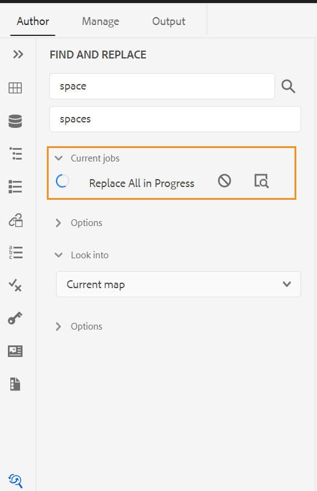{width="400" align="left"}

Sie können auch die Option **In Karte suchen** im Menü **Optionen** einer Karte verwenden, um Text in einer Karte zu suchen und zu ersetzen. Diese Option wird für eine Zuordnung angezeigt, die im Repository-Bereich oder in der Zuordnungsansicht geöffnet ist.

{width="550" align="left"}

## Inhaltsbearbeitungsbereich {#id2051EB000UI}

Im Inhaltsbearbeitungsbereich wird der Inhalt des Themas oder der Karte angezeigt. Sie nehmen alle Inhaltsbearbeitungen in diesem Bereich vor. Es bietet eine WYSIWYG-Ansicht des Inhalts, den Sie bearbeiten. Sie können mehrere Themen gleichzeitig öffnen, die auf den jeweiligen Registerkarten angezeigt werden.

Standardmäßig können Sie die Dateititel auf den Registerkarten einsehen. Wenn Sie mit dem Mauszeiger auf eine Datei zeigen, können Sie den Dateititel und den Dateipfad als QuickInfo anzeigen.

>[!NOTE]
>
> Als Administrator können Sie auch festlegen, dass die Liste der Dateien nach Dateinamen auf den Registerkarten angezeigt wird. Wählen Sie die **Dateiname** im Abschnitt **Dateien anzeigen nach** in **Benutzereinstellungen** .

Unter der Registerkarte der Datei befindet sich der Breadcrumb des Elements an der aktuellen Cursorposition. In der oberen rechten Ecke des Inhaltsbearbeitungsbereichs wird die Versionsnummer des aktuellen Themas angezeigt.

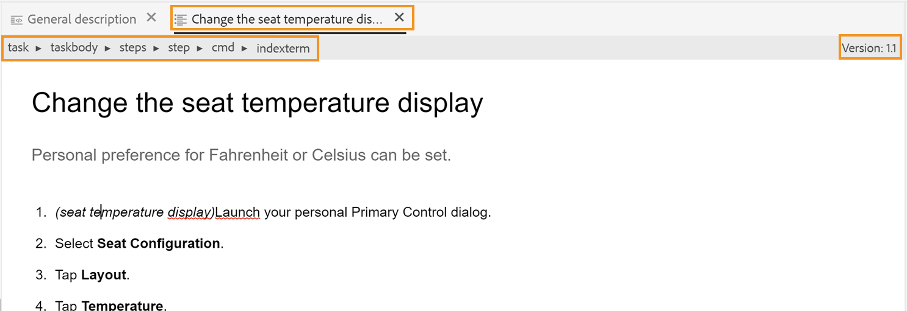{width="650" align="left"}

## Rechtes Bedienfeld {#id2051EB003YK}

Der rechte Bereich ist ein persistenter Bereich, der Informationen zum aktuell ausgewählten Dokument enthält.

>[!NOTE]
>
> Die Größe des rechten Bedienfelds kann geändert werden. Um die Größe des Bereichs zu ändern, bringen Sie den Cursor auf die Bereichsgrenze, der Cursor ändert sich in einen Doppelpfeil, klicken und ziehen Sie, um die Breite des Bereichs zu ändern.

Das rechte Bedienfeld bietet Zugriff auf die folgenden Funktionen:

**Inhaltseigenschaften** - 

Sie können auf die Funktion **Inhaltseigenschaften** zugreifen, indem Sie im rechten Bedienfeld auf **Inhaltseigenschaften** klicken. Das Bedienfeld **Inhaltseigenschaften** enthält Informationen zum Typ des aktuell im Dokument ausgewählten Elements und zu dessen Attributen.

**Typ**: Sie können die Tags der vollständigen Hierarchie für das aktuelle Tag aus der Dropdown-Liste anzeigen und auswählen.

**Attribute**: Das **Attribute** Dropdown-Menü ist in den Ansichten „Layout“, „Autor“ und &quot;Source&quot; verfügbar. Sie können die Attribute einfach hinzufügen, bearbeiten oder löschen.

1. Klicken Sie auf **+ Hinzufügen**.

   {width="300" align="left"}

1. Wählen **im Dropdown** Bedienfeld „Attribut“ das Attribut aus der Dropdown-Liste aus und geben Sie den Wert eines Attributs an.  Klicken Sie dann auf **Hinzufügen**.

   {width="300" align="left"}

1. Um das Attribut zu bearbeiten, halten Sie den Mauszeiger darüber und wählen Sie **Bearbeiten**  aus.
   {width="300" align="left"}

1. Um das Attribut zu löschen, halten Sie den Mauszeiger darüber und wählen Sie **Löschen** .


>[!NOTE]
>
> Selbst wenn das Thema referenzierten Inhalt enthält, können Sie ihm mithilfe des Bedienfelds „Eigenschaften“ Attribute hinzufügen.

Wenn Ihr Administrator ein Profil für Attribute erstellt hat, erhalten Sie diese Attribute zusammen mit den konfigurierten Werten. Im Bedienfeld Inhaltseigenschaften können Sie diese Attribute auswählen und sie relevanten Inhalten in Ihrem Thema zuweisen. Auf diese Weise können Sie auch bedingte Inhalte erstellen, die dann zur Erstellung einer bedingten Ausgabe verwendet werden können. Weitere Informationen zum Generieren der Ausgabe mithilfe von bedingten Vorgaben finden Sie [Verwenden von Bedingungsvorgaben](generate-output-use-condition-presets.md#).


**Dateieigenschaften** - 

Zeigen Sie die Eigenschaften der ausgewählten Datei an, indem Sie im rechten Bedienfeld auf das  Dateieigenschaften klicken. Die Funktion „Dateieigenschaften“ ist in allen vier Modi oder Ansichten verfügbar: Layout, Autor, Source und Vorschau.

Die Dateieigenschaften umfassen die beiden folgenden Abschnitte:

**Allgemein**

Im Abschnitt Allgemein haben Sie Zugriff auf die folgenden Funktionen:

{width="300" align="left"}

- **Name**: Zeigt den Dateinamen des ausgewählten Themas an. Der Dateiname ist mit der Eigenschaftenseite der ausgewählten Datei per Hyperlink verknüpft.
- **ID**: Zeigt die ID des ausgewählten Themas an.
- **Tags**: Dies sind die Metadaten-Tags des Themas. Sie werden über das Feld Tags auf der Seite Eigenschaften festgelegt. Sie können sie in der Dropdown-Liste eingeben oder auswählen.  Die Tags werden unter dem Dropdown-Menü angezeigt. Um ein Tag zu löschen, klicken Sie auf das Kreuzsymbol neben dem Tag.
- **Weitere Eigenschaften bearbeiten**: Sie können auf der Seite mit den Dateieigenschaften weitere Eigenschaften bearbeiten.
- **Language**: Zeigt die Sprache des Themas an. Sie wird im Feld Sprache auf der Seite Eigenschaften festgelegt.
- **Erstellt am**: Zeigt Datum und Uhrzeit der Erstellung des Themas an.
- **Ausgecheckt von**: Zeigt den Benutzer an, der das Thema ausgecheckt hat.
- **Dokumentstatus**: Sie können den Dokumentstatus des aktuell geöffneten Themas auswählen und aktualisieren. Weitere Informationen finden Sie unter [Dokumentstatus ](web-editor-document-states.md#)*.*

**Hinweis** Sie können die Attributwerte der verschiedenen Felder in den Dateieigenschaften in die Zwischenablage kopieren.

**Verweise**

Der Abschnitt Verweise bietet Ihnen Zugriff auf die folgenden Funktionen:

{width="300" align="left"}

- **Verwendet in**: Die Option Verwendet in Verweisen listet die Dokumente auf, auf die die aktuelle Datei verwiesen oder verwendet wird.
- **Ausgehende Links** Unter Ausgehende Links werden die Dokumente aufgelistet, auf die im aktuellen Dokument verwiesen wird.

Standardmäßig können Sie die Dateien nach Titeln anzeigen. Wenn Sie mit dem Mauszeiger auf eine Datei zeigen, können Sie den Dateititel und den Dateipfad als QuickInfo anzeigen.

>[!NOTE]
>
> Als Administrator können Sie die Liste der Dateien nach Dateinamen im Web-Editor anzeigen. Wählen Sie die **Dateiname** im Abschnitt **Dateien anzeigen nach** in **Benutzereinstellungen** .

**Hinweis:** Alle verwendeten In- und Outgoing-Referenzen sind mit den Dokumenten per Hyperlink verbunden. Sie können die verknüpften Dokumente einfach öffnen und bearbeiten.

Neben dem Öffnen von Dateien können Sie auch viele Aktionen über das Menü **Optionen** im Abschnitt Verweise durchführen. Zu den Aktionen, die Sie ausführen können, gehören Bearbeiten, Vorschau, UUID kopieren, Pfad kopieren, Zu Favoriten hinzufügen, Eigenschaften und Open Map-Dashboard.

**Überprüfen** - 

Wenn Sie auf das Symbol Überprüfen klicken, wird das Review-Fenster geöffnet, in dem Sie eine Prüfungsaufgabe für das aktuell geöffnete Dokument erstellen können.

{width="300" align="left"}

Wenn Sie mehrere Überprüfungsprojekte erstellt haben, können Sie eines aus der Dropdown-Liste auswählen und auf die Überprüfungskommentare zugreifen.

Im Überprüfungsbereich können Sie Antworten zu den Kommentaren zum Thema anzeigen und posten. Sie können die Kommentare einzeln akzeptieren oder ablehnen.

Weitere Informationen finden Sie unter [Kommentare zur Adressenüberprüfung](review-address-review-comments.md#).

**Getrackte Änderungen** - 

Mit der Funktion „Nachverfolgte Änderungen“ im rechten Bereich können Sie die Informationen zu allen Aktualisierungen in einem Dokument anzeigen. Sie können auch nach bestimmten Aktualisierungen des Dokuments suchen.

>[!NOTE]
>
> Die Funktion „Nachverfolgte Änderungen“ zeigt alle Aktualisierungen an, die mit der Funktion „Änderungen nachverfolgen“ in der Hauptsymbolleiste aktiviert/deaktiviert wurden. Weitere Informationen finden Sie unter [Änderungen verfolgen/deaktivieren](#id205DF0203Y4).

**Übergeordnetes Thema:**[ Arbeiten mit dem Web-Editor](web-editor.md)
