# Funktionen des Web Editors kennen {#id176NC500V5Z}

Dieser Abschnitt erläutert Ihnen die verschiedenen Funktionen, die im Web Editor verfügbar sind. Wir können den Web-Editor in die folgenden Abschnitte oder Bereiche unterteilen:

- [Hauptleiste](#id2051EA0G05Z)
- [Sekundäre Symbolleiste](#id2051EA0J0Y4)
- [Linke Leiste](#id2051EA0M0HS)
- [Inhaltsbearbeitungsbereich](#id2051EB000UI)
- [Rechtes Bedienfeld](#id2051EB003YK)

Der folgende Unterabschnitt behandelt die verschiedenen Abschnitte des Web-Editors im Detail.

## Hauptleiste {#id2051EA0G05Z}

Die Hauptsymbolleiste befindet sich oben auf der Benutzeroberfläche des Web-Editors und bietet Funktionen auf Dateiebene sowie verschiedene Bearbeitungsmodi, die im Web Editor verfügbar sind. Die in der oberen Symbolleiste verfügbaren Funktionen werden wie folgt beschrieben:

**Alle speichern** - 

Speichert die Änderungen, die Sie in allen geöffneten Themen vorgenommen haben. Wenn Sie mehrere Themen im Web Editor geöffnet haben, werden durch Klicken auf die Tastenkombination **Alle speichern** oder **Strg**+**S** alle Dokumente mit einem Klick gespeichert. Sie müssen nicht jedes Dokument einzeln speichern.

>[!NOTE]
>
> Beim Speichern wird keine neue Version Ihrer Themen erstellt. Um eine neue Version zu erstellen, wählen Sie &quot;Als neue Version speichern&quot;.

**Als neue Version speichern** - 

Speichert die Änderungen, die Sie an Ihrem Thema vorgenommen haben, und erstellt auch eine neue Version Ihres Themas. Wenn Sie an einem neu erstellten Thema arbeiten, werden die Versionsinformationen als **none** angezeigt.

{width="800" align="left"}

Die Versionsnummer ändert sich mit jeder neuen Version, die für die Themen- oder Zuordnungsdatei erstellt wird.

Wenn Sie ein Thema oder eine Zuordnung mit **Als neue Version speichern** auswählen, wird das folgende Dialogfeld angezeigt:

{width="300" align="left"}

Geben Sie Kommentare und Versionsbezeichnungen ein, um die Änderungen zu identifizieren, und klicken Sie auf **Speichern** , um eine neue Version Ihrer Datei zu erstellen.

Wenn Sie &quot;*Als neue Version speichern*&quot;auswählen, wird die erste Version des Themas in DAM erstellt, wodurch auch die derzeit aktive Version Ihres Themas wird. Wenn Sie später zu einer älteren Version des Themas zurückkehren, wird dies zu Ihrer aktuellen aktiven Version des Themas.

Wenn Ihr Administrator über vorkonfigurierte Versionsbezeichnungen verfügt, werden diese Bezeichnungen in einer Dropdown-Liste angezeigt. Sie können einen Titel aus der Liste der verfügbaren Beschriftungen auswählen und Ihr Dokument speichern.

{width="300" align="left"}

Zum Zeitpunkt der Speicherung eines Themas können Sie einen Kommentar hinzufügen, in dem Sie die Änderungen angeben, die Sie am Thema vorgenommen haben. Dieser Kommentar wird im Versionsverlauf des Themas angezeigt.

Wenn Ihr Thema überprüft wird, erhalten Ihre Prüfer eine Benachrichtigung, dass eine neuere Version des Themas verfügbar ist. Sie können einfach auf die neueste Version Ihres Dokuments zugreifen und die aktuelle Version Ihres Themas überprüfen.

Wenn Sie den Mauszeiger über den Titel eines Themas bewegen, werden Ihnen der Dateipfad und die Versionsnummer angezeigt.

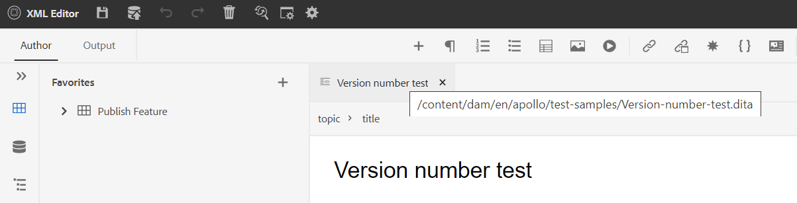{width="800" align="left"}

>[!NOTE]
>
> Sobald eine Version Ihres Themas verfügbar ist, können Sie Ihrem Thema auch Beschriftungen hinzufügen. Diese Beschriftungen können dann verwendet werden, um eine Grundlinie für die Veröffentlichung einer bestimmten Version Ihres Dokuments zu erstellen. Weitere Informationen zur Verwendung von Bezeichnungen in den Themen finden Sie unter [Bezeichnungen verwenden](web-editor-use-label.md#).

**Rückgängig und Wiederholen** -  / 

Rückgängig oder Wiederherstellen der letzten Aktion

**Element löschen** - 

Löscht das aktuell ausgewählte Element oder das Element, in dem der Cursor platziert wird.

**Suchen und Ersetzen** - 

Die Funktion &quot;Suchen und Ersetzen&quot;ist in den Ansichtsmodi &quot;Autor&quot;und &quot;Source&quot;verfügbar. Die Textleiste Suchen und Ersetzen wird unten im Themenbearbeitungsbereich angezeigt. Sie können die Tastaturbefehle **STRG**+**F** verwenden, um die Leiste &quot;Suchen und Ersetzen&quot;aufzurufen.

{width="800" align="left"}

Mit dem Einstellungssymbol \(\) können Sie die Suchoptionen **Groß-/Kleinschreibung ignorieren** und **Nur ganzes Wort** umschalten. Um die Suche ohne Unterscheidung zwischen Groß- und Kleinschreibung durchzuführen, aktivieren Sie die Option &quot;**Groß-/Kleinschreibung ignorieren**&quot;. Wenn Sie andernfalls die Suche unter Berücksichtigung der Groß-/Kleinschreibung durchführen möchten, deaktivieren Sie die Option &quot;**Groß-/Kleinschreibung ignorieren**&quot;. Sie können auch ein ganzes Wort suchen.

Die Suche erfolgt sofort, d. h. wenn Sie den Suchbegriff oder das Wort in das Feld **Suchen** eingeben, wird der Begriff sofort gesucht und im Thema ausgewählt. Um einen Text in Ihrem Thema zu ersetzen, geben Sie den Suchbegriff und dessen Ersetzung in die entsprechenden Felder ein und klicken Sie auf die Schaltfläche **Ersetzen** oder **Alle ersetzen** .

In der Source-Ansicht ist &quot;Suchen und Ersetzen&quot;äußerst nützlich für die Suche nach einem bestimmten Element oder Attribut. Wenn Sie beispielsweise den Wert des Attributs `@product` ersetzen möchten, ist dies über die Source-Ansicht einfach möglich. In der Autorenansicht können Sie nicht anhand eines Attributs oder Elements suchen. Bei Verwendung der Funktion **Alle ersetzen** müssen Sie jedoch vorsichtig vorgehen, da sie den XML-Code möglicherweise überschreiben kann.

**Editor Settings** - 

Die Editor-Einstellungen stehen nur Admin-Benutzern zur Verfügung. Mithilfe der Voreinstellungen kann ein Administrator die folgenden Einstellungen konfigurieren:

>[!NOTE]
>
> Wenn Sie Standardeinstellungen aktualisieren, sollten Sie Dokumente erneut öffnen, damit die Änderungen wirksam werden.

- **Allgemein**: Mit den allgemeinen Einstellungen können Sie das Wörterbuch für die Verwendung mit dem Web Editor konfigurieren. Diese Registerkarte enthält drei Abschnitte: **Rechtschreibprüfung**, **Bedingung** und **Bearbeitung**.

  {width="650" align="left"}

   - **Rechtschreibprüfung**: Es gibt zwei Optionen: **AEM Rechtschreibprüfung** und **BrowserRechtschreibprüfung**. Standardmäßig verwendet der Editor die Funktion &quot;Rechtschreibprüfung des Browsers&quot;, bei der die Rechtschreibprüfung mithilfe des integrierten Wörterbuchs des Browsers durchgeführt wird. Sie können zur Rechtschreibprüfung wechseln, um AEM Wörterbuch zu verwenden, das auch angepasst werden kann, um Ihre benutzerdefinierte Wortliste hinzuzufügen. Weitere Informationen zum Anpassen AEM Wörterbuchs finden Sie im Abschnitt *AEM Standardwörterbuch anpassen* im Abschnitt Installieren und Konfigurieren von Adobe Experience Manager Guides as a Cloud Service.


   - **Bedingung**

      - **Bedingten Text in der Autorenansicht markieren**: Wählen Sie diese Option aus, um den bedingten Text in der Autorenansicht zu markieren. Der bedingte Inhalt wird in der für die Bedingung definierten Farbe hervorgehoben.

      - **Mit Bedingungsattributen validieren**: Wählen Sie diese Option aus, um die Überprüfung der für die Attribute definierten Werte zu ermöglichen. Dadurch wird verhindert, dass Sie einen falschen Wert hinzufügen.

      - **Schlüssel mit Titel im Betreff-Schema anzeigen**: Wählen Sie diese Option aus, um die Schlüssel zusammen mit den Titeln im Betreffschema anzuzeigen. Wenn Sie diese Option nicht auswählen, werden nur die Titel angezeigt. Hier werden beispielsweise die Schlüssel &quot;os&quot;, &quot;audience&quot;und &quot;other&quot;zusammen mit den Titeln angezeigt.

        {width="550" align="left"}

      - **Betreffschema im Bedienfeld &quot;Bedingungen&quot;anzeigen**: Wählen Sie dies aus, um ein Subjekt im Bedienfeld &quot;Bedingungen&quot;anzuzeigen. Wenn Sie diese Option deaktivieren, werden die definierten Bedingungen im Bedingungsfeld angezeigt.

   - **Authoring**

      - **Alle ersetzen aktivieren**: Wählen Sie diese Option aus, um das Symbol Alle ersetzen im Bereich Suchen und Ersetzen anzuzeigen.


   - **Zitate**
Ändern Sie den Stil der Zitate. Wählen Sie aus der Dropdown-Liste den Zitierungsstil aus, den Sie in Ihrem Projekt verwenden möchten. Weitere Informationen finden Sie unter [Ändern von Referenzstilen](./web-editor-apply-citations.md#change-citation-style).


**Bedienfelder**: Diese Einstellung steuert die Bedienfelder, die im linken Bedienfeld des Editors angezeigt werden. Sie können den Schalter umschalten, um das gewünschte Bedienfeld ein- oder auszublenden.

{width="650" align="left"}

>[!NOTE]
>
> Wenn ein benutzerdefiniertes Bedienfeld konfiguriert wurde, wird es auch in der Liste der Bedienfelder angezeigt. Sie können den Schalter umschalten, um das benutzerdefinierte Bedienfeld ein- oder auszublenden. Weitere Informationen zur Konfiguration finden Sie im Abschnitt *Benutzerdefiniertes Bedienfeld im linken Bedienfeld konfigurieren* im Abschnitt Installieren und Konfigurieren von Adobe Experience Manager Guides as a Cloud Service .

- **Elementliste**: Als Administrator können Sie die Liste der Elemente, die ein Autor einfügen kann, mithilfe des Popup-Fensters [Element einfügen](#id204SG30105Z) steuern und auch den Anzeigenamen für das Element definieren. Mit der Einstellung Elementliste können Sie den Namen des Elements gemäß DITA-Spezifikationen und eine Beschriftung angeben, die Sie anstelle des definierten DITA-Elementnamens verwenden möchten:

  {width="650" align="left"}

Im obigen Screenshot wurde dem Element `b` die Bezeichnung &quot;Fett&quot;zugewiesen, `codeblock` wird die Bezeichnung &quot;Codeblock&quot;zusammen mit einigen anderen Elementen zugewiesen. Wenn Sie die Option &quot;**Nur über Elemente verwenden**&quot;auswählen, werden nur die gültigen Elemente \(am aktuellen Einfügepunkt\) aus dieser Liste im Popup &quot;Element einfügen&quot;angezeigt.

Im folgenden Screenshot werden im aktuellen Kontext nur 3 von 4 konfigurierten Elementen aus dem vorherigen Screenshot angezeigt:

{width="300" align="left"}

- **Attributliste**: Wie die Elementliste können Sie die Liste der Attribute und deren Anzeigenamen steuern, die in der Attributliste eines Elements angezeigt werden sollen. Im folgenden Screenshot wurden nur drei Attribute so konfiguriert, dass sie in der Attributliste eines Elements angezeigt werden:

  {width="650" align="left"}

  Wenn Sie mit dieser Einstellung versuchen, einem Element ein Attribut hinzuzufügen, sehen Sie nur die Liste der Attribute, die in der Liste konfiguriert sind.

  {width="300" align="left"}

- **Publish-Profil**: Enthält die Publish-Profile, die zum Veröffentlichen der Ausgabe der **Knowledge Base** verwendet werden können. Sie können ein neues Profil für eine Ziel-Wissensdatenbank erstellen. Beispielsweise Salesforce oder ServiceNow.

   - **Erstellen eines Salesforce Publish-Profils**

     **Voraussetzungen**

      - Erstellen Sie eine verbundene App für Salesforce. Weitere Informationen finden Sie unter [Aktivieren der OAuth-Einstellungen für die API-Integration](https://help.salesforce.com/s/articleView?id=sf.connected_app_create_api_integration.htm&amp;type=5).

      - Stellen Sie beim Konfigurieren der verbundenen App Folgendes sicher:

         - Geben Sie den Rückruf an.

           `URL: http://<server name>:<port>/bin/dxml/thirdparty/callback/salesforce`

         - Wählen Sie die folgenden OAuth-Bereiche aus:
            - Vollständiger Zugriff (vollständig)
            - Wählen Sie Benutzerdaten über APIs verwalten (API) aus.

  Nachdem die App konfiguriert wurde, stellt Salesforce einen **Consumer Key** und einen **Consumer Secret** bereit.

  Diese können zum Erstellen des Salesforce Publish-Profils verwendet werden.


   - Um ein Salesforce Publish-Profil zu erstellen, wählen Sie die Wissensdatenbank **Salesforce** aus der Dropdown-Liste **Servertyp** aus. Geben Sie einen Profilnamen ein. Geben Sie in die **Site-URL** die Verbraucher-Site ein, mit der Sie die Ausgabe veröffentlichen möchten, und fügen Sie dann den von der Salesforce-Verbraucherseite bereitgestellten **Consumer Key** und den **Consumer Secret** hinzu. Dann **Validieren** und **Speichern** das neu erstellte Profil.
     {width="550" align="left"}

     >[!NOTE]
     >
     >Um einen Proxy für Salesforce in Experience Manager Guides zu konfigurieren, verwenden Sie die Apache HTTP Components Proxy Configuration in AEM. Erfahren Sie, wie Sie den Proxy für den AEM Link Checker](https://helpx.adobe.com/experience-manager/kb/How-to-configure-proxy-for-the-AEM-Link-Checker-AEM.html) konfigurieren.[


   - **Erstellen eines ServiceNow Publish-Profils**

     **Voraussetzungen**

     Konfigurieren Sie den ServiceNow-Server, um die Assets hochzuladen.
      - Stellen Sie eine Verbindung zum Server **ServiceNow** her.
      - Navigieren Sie zu **Systemeigenschaften** > **Sicherheit**.
      - Deaktivieren Sie die folgende Option:

        **Diese Eigenschaft muss festgelegt sein, um die MIME-Typüberprüfung für Uploads zu aktivieren (alle Versionen Eureka und höher). Aktiviert (true) oder deaktiviert (false) die Überprüfung des MIME-Typs für die Dateianlagen. Über glide.attachment.extensions konfigurierte Dateierweiterungen werden beim Hochladen auf den MIME-Typ überprüft.**

      - Klicken Sie auf **Speichern**.

     Nachdem Sie die App konfiguriert haben, erstellen Sie das Publish-Profil **ServiceNow** .
   - Um ein Publish-Profil zu erstellen, wählen Sie die ServiceNow-Wissensdatenbank aus der Dropdown-Liste **Servertyp** aus. Geben Sie ein Profil ein: **Name**. Geben Sie in die **ServiceNow-URL** die Verbraucher-Site ein, die Sie zum Veröffentlichen der Ausgabe verwenden würden, und fügen Sie dann den von der ServiceNow-Consumer-Site bereitgestellten **Benutzernamen** und das **Kennwort** hinzu. Dann **Validieren** und **Speichern** das neu erstellte Profil.

     {width="550" align="left"}

  Nach der Validierung können Sie das Publish-Profil in den Ausgabevorgaben einer DITA Map auswählen und es verwenden, um die Ausgabe auf dem von Ihnen ausgewählten **Salesforce** - oder **ServiceNow** -Server zu generieren.

  Erfahren Sie mehr über die Ausgabevorgabe [Knowledge Base](../user-guide/generate-output-knowledge-base.md).


- **Validierung**: Diese Registerkarte enthält Optionen zum Konfigurieren der Schematronenvalidierungen im Web-Editor. Sie können die folgenden Funktionen aktivieren:

   - **Führen Sie vor dem Speichern der Datei eine Validierungsprüfung durch**: Wählen Sie diese Option aus, um Schematron-Überprüfungen mit den ausgewählten Schematron-Dateien vor einem Speichervorgang durchzuführen. Sie können eine Schematron-Datei hinzufügen, indem Sie auf das Symbol + klicken. Die ausgewählten Schematron-Dateien werden aufgelistet.

     >[!NOTE]
     >Die ausgewählten Schematron-Dateien bleiben für das ausgewählte Ordnerprofil bestehen.

     {width="550" align="left"}
Dadurch wird verhindert, dass Benutzer Dateien speichern, die eine Regel beschädigen, die in den ausgewählten Schematron-Dateien definiert ist. Wenn diese Option nicht ausgewählt ist, wird die Datei vor dem Speichern der Änderungen nicht validiert.

   - **Alle Benutzer dürfen Schematrondateien im Überprüfungsfenster hinzufügen**: Wählen Sie diese Option aus, damit die Benutzer jede Schemadatron-Datei im Überprüfungsfenster des Webeditors hinzufügen können. Dadurch können Benutzer Schematron-Dateien hinzufügen und die Themen dann anhand der Schematron-Datei validieren. Wenn diese Option nicht ausgewählt ist, steht den Benutzern im **Validierungsfenster** des Webeditors die Schaltfläche **Schematrondatei hinzufügen** nicht zur Verfügung.


- **Attribute anzeigen**: Wie die Attributliste können Sie die Liste der Attribute steuern, die in der Attributliste eines Elements angezeigt werden sollen. Standardmäßig wurden vier **Anzeigeattribute** - Zielgruppe, Plattform, Produkt und Eigenschaften - so konfiguriert, dass sie in der Attributliste eines Elements angezeigt werden. Sie können ein Anzeigenattribut auch über das Symbol **Hinzufügen** oben hinzufügen. Mit dem Symbol **Löschen** können Sie auch jedes der Anzeigenattribute löschen.

  Die für ein Element definierten Attribute werden im Layout und in der Gliederungsansicht angezeigt.

  {width="550" align="left"}

- **Übersetzung**: Diese Registerkarte enthält die Optionen zum Erstellen von Sprachgruppen, zum Übertragen der Quellbezeichnungen auf die Zielversion und zum Bereinigen des Übersetzungsprojekts.
  {width="550" align="left"}

   - **Sprachgruppen**: Als Administrator können Sie eine Gruppe von Sprachen erstellen und diese als Satz verwenden, um den Inhalt zu übersetzen.\
     Führen Sie die folgenden Schritte aus, um eine neue Sprachgruppe zu erstellen:
      1. Wählen Sie das Symbol  aus.
      1. Geben Sie den Namen der Sprachgruppe ein. Jede Sprache sollte einen eindeutigen Namen haben. Sie können einen Fehler anzeigen, wenn das Namensfeld leer ist oder wenn der Name nicht eindeutig ist.
      1. Wählen Sie die Sprachen aus der Dropdown-Liste aus. Sie können mehrere Sprachen auswählen.

     Geben Sie die ersten Zeichen der Sprache oder den Sprachcode ein, um die gewünschten Sprachen zu filtern. Geben Sie beispielsweise &quot;en&quot;ein, um alle Sprachen zu filtern, die &quot;en&quot;am Anfang ihres Namens oder Codes enthalten.
      1. Wählen Sie **Fertig** aus, um die ausgewählten Sprachen zur Gruppe hinzuzufügen. Die Sprachen werden angezeigt. Wenn Sie drei oder mehr Sprachen hinzufügen, wird **Mehr anzeigen** angezeigt. Sie können **Mehr anzeigen** auswählen, um alle Sprachen der Gruppe anzuzeigen.

         >[!TIP]
         >
         > Umschalten von **Mehr anzeigen** auf **Weniger anzeigen** und Anzeigen nur einiger Sprachen.

      1. Bewegen Sie den Mauszeiger über die Sprachen in einer Gruppe, um das  zu bearbeiten oder  der Sprachgruppen zu löschen.
      1. Speichern Sie die **Editor-Einstellungen**.

         >[!NOTE]
         >
         >Als Benutzer können Sie die für Ihr Ordnerprofil konfigurierten Sprachgruppen anzeigen.

   - **Quellversionsbeschriftungen an die Zielversion weiterleiten**: Wählen Sie diese Option aus, um den Titel der Quelldateiversion an die übersetzte Datei zu übergeben. Standardmäßig ist dies deaktiviert.
   - **Bereinigung des Übersetzungsprojekts nach Abschluss**: Wählen Sie diese Option, um die Übersetzungsprojekte zu konfigurieren, die nach der Übersetzung automatisch deaktiviert oder gelöscht werden sollen. Standardmäßig ist &quot;**None**&quot;ausgewählt, sodass das Projekt nach der Übersetzung vorhanden ist.

     Sie können die Übersetzungsprojekte deaktivieren, wenn Sie sie später verwenden möchten. Durch das Löschen eines Projekts werden alle im Projekt vorhandenen Dateien und Ordner dauerhaft gelöscht.


- **Metadaten**: Sie können die Versionsmetadaten des Themas und deren Werte steuern, die im Dialogfeld **Versionsverlauf** angezeigt werden.  Geben Sie im Metadatenpfad den Speicherort der Knoten an, von denen Sie die Metadaten auswählen möchten. Sie können auch einen benutzerdefinierten Namen für die Metadaten als Beschriftung definieren. Die Standardeigenschaften sind Titel, Dokumentstatus und Tags.

  Die Metadaten können aus jeder Eigenschaft unter dem Knoten `/jcr:content` des Assets ausgewählt werden, sodass Sie den Pfad der Eigenschaft als Metadatenpfad hinzufügen können.


  Wenn der Metadatenpfad leer ist, wird ein Fehler angezeigt. Wenn Sie die Beschriftung leer lassen, wird das letzte Element als Beschriftung ausgewählt.


  Registerkarte {width="550" align="left"}

  *Konfigurieren Sie die Metadaten für das Dialogfeld **Versionsverlauf**.*


  Sie können auch die Reihenfolge definieren, in der diese Metadaten-Tags angezeigt werden. Um die Standardreihenfolge dieser Tags zu ändern, wählen Sie die gepunkteten Balken aus, um die Tags per Drag-and-Drop an die gewünschte Position zu ziehen.
Die Metadatenbeschriftungen werden in derselben Sequenz im **Versionsverlauf** des Web Editors angezeigt.


**Benutzereinstellungen** - 

Die Benutzereinstellungen stehen allen Autoren zur Verfügung. Mithilfe der Voreinstellungen kann ein Autor die folgenden Einstellungen konfigurieren:


- **Allgemein**: Auf der Registerkarte &quot;Allgemein&quot;können Sie die folgenden Einstellungen konfigurieren:

  {width="550" align="left"}

   - **Ordnerprofile**: Das Ordnerprofil steuert verschiedene Konfigurationen im Zusammenhang mit bedingten Attributen, Bearbeitungsvorlagen, Ausgabevorgaben und Web-Editor-Konfigurationen. Das globale Profil wird standardmäßig angezeigt. Wenn Ihr Administrator außerdem Ordnerprofile im System konfiguriert hat, werden diese ebenfalls in der Liste Ordnerprofile angezeigt.

     Zu den Konfigurationen des Web-Editors, die ein Administrator im Ordnerprofil definieren kann, gehören: Anpassung der Benutzeroberfläche einschließlich der Symbolleistensymbole, Layout des Web-Editors, Snippets und Root Map. Weitere Informationen finden Sie unter *Konfigurieren von globalen Profilen oder Profilen auf Ordnerebene* im as a Cloud Service Installieren und Konfigurieren von Adobe Experience Manager Guides .

     >[!NOTE]
     >
     > Der Name des aktuellen Ordnerprofils wird als Beschriftung für das Symbol Benutzereinstellungen in der Hauptsymbolleiste angezeigt.

   - **Basispfad**: Standardmäßig werden beim Zugriff auf das AEM-Repository über den Web Editor Assets vom Speicherort /content/dam angezeigt. Ihr Arbeitsordner würde höchstwahrscheinlich einige Ordner im Ordner /content/dam/ enthalten. Es würde einige Klicks dauern, den Arbeitsordner jedes Mal zu erreichen. Sie können den Basispfad auf Ihren Arbeitsordner festlegen und die Repository-Ansicht zeigt Ihnen dann den Inhalt von diesem Speicherort vorab an. Dadurch wird der Zugriff auf Ihren Arbeitsordner verkürzt. Wenn Sie eine Referenz- oder Mediendatei in Ihr Thema einfügen, beginnt der Speicherort für die Dateisuche mit dem Ordner, der im Basispfad festgelegt ist.

   - **Stammzuordnung auswählen**: Wählen Sie eine DITA-Zuordnungsdatei aus, um wichtige Verweise oder Glossareinträge aufzulösen. Die ausgewählte Stammzuordnung hat die höchste Priorität, um Schlüsselverweise aufzulösen. Weitere Informationen finden Sie unter [Schlüsselreferenzen auflösen](map-editor-other-features.md#id176GD01H05Z).

     >[!NOTE]
     >    
     > Wenn Sie keine Stammzuordnung verwenden möchten, stellen Sie sicher, dass das Feld **Stammzuordnung auswählen** leer ist.

- **Erscheinungsbild**: Wählen Sie die Designs für die Web Editor-Anwendung und die Quellansicht des Inhaltsbearbeitungsbereichs aus.

  Registerkarte {width="550" align="left"}

   - **Dateien anzeigen nach**: Wählen Sie die Standardmethode zum Anzeigen der Dateien im Web Editor aus. Sie können die Liste der Dateien anhand der Titel oder Dateinamen aus den verschiedenen Bereichen in der Ansicht **Autor** anzeigen.

     >[!NOTE]
     >
     > Standardmäßig werden die Dateien nach Titel im Web Editor angezeigt.

   - **Anwendungsdesign**: Sie können aus den Designs **Hell** oder **Dark** für die Anwendung wählen. Im Falle des Designs **Licht** verwenden die Symbolleisten und Bedienfelder einen hellgrauen Farbhintergrund. Im Falle des Designs **dunkel** verwenden die Symbolleisten und Bedienfelder einen schwarzen Farbhintergrund. Wählen Sie **Gerätedesign verwenden** aus, damit Experience Manager Guides die hellen und dunklen Designs anhand des Designs Ihres Geräts auswählen kann.  In allen Designs wird der Inhaltsbearbeitungsbereich in der Ansicht **Autor** im weißen Farbhintergrund angezeigt.

   - **Source-Ansichtsdesign**: - Sie können aus den Designs **Hell** oder **Dunkel** für den Inhaltsbearbeitungsbereich in der Quellansicht wählen. Im Falle des Designs **Hell** verwendet der Inhaltsbearbeitungsbereich einen hellgrauen Farbhintergrund für die Quellansicht, während im Fall des Designs **Dunkel** ein schwarzer Farbhintergrund verwendet wird. Wählen Sie **Gerätedesign verwenden** aus, damit Experience Manager Guides die hellen und dunklen Designs anhand des Designs Ihres Geräts auswählen kann.

   - **Immer Dateien im Repository suchen**: Wählen Sie diese Option, um den Speicherort einer Datei im Repository anzuzeigen, während Sie sie im Web Editor bearbeiten.

   - **Anzeigen einer geschützten Leerzeichen im Autorenmodus**: Wählen Sie diese Option, um eine Anzeige für die geschützten Leerzeichen anzuzeigen, während Sie sie im Web Editor bearbeiten. Sie ist standardmäßig aktiviert.

**Autoren-, Source- und Vorschaumodi**

Weitere Informationen zu den verschiedenen Bearbeitungs- und Dokumentanzeigemodi finden Sie unter [Ansichten des Web-Editors](web-editor-views.md#).

## Sekundäre Symbolleiste {#id2051EA0J0Y4}

Die sekundäre Symbolleiste wird angezeigt, wenn Sie ein Thema zur Bearbeitung im Web-Editor öffnen. Die in der sekundären Symbolleiste verfügbaren Funktionen werden wie folgt beschrieben:

**Element einfügen** - 

Fügt ein gültiges Element an der aktuellen oder nächsten gültigen Position ein. Sie können auch den Tastaturbefehl ***Alt***+***Enter*** verwenden, um das Popup &quot;Element einfügen&quot;zu öffnen. Wenn Sie beispielsweise einen Absatz bearbeiten, wird im Popup **Element einfügen** eine Liste mit Elementen angezeigt, die in den Absatz eingefügt werden können. Wählen Sie das Element aus, das Sie einfügen möchten. Sie können die Tastatur verwenden, um durch die Liste der Elemente zu scrollen und ***Enter*** drücken, um das erforderliche Element einzufügen.

Sie können zwei Typen gültiger Elemente anzeigen:

- **Gültige Elemente an der aktuellen Position**: Die Liste zeigt die Elemente an, die Sie an der aktuellen Cursorposition selbst einfügen können.

- **Gültige Elemente außerhalb der aktuellen Position**: Die Liste zeigt die Elemente an, die Sie nach den übergeordneten Elementen für das aktuelle Element in der Elementhierarchie einfügen können.


Wenn Sie sich beispielsweise im Inline-Element `<b>` befinden, können Sie Elemente wie `<u>`, `<xref>` und `<i>` an der aktuellen Position einfügen. Im Gegensatz dazu können Sie Elemente wie `<table>` und `<topic>` außerhalb der aktuellen Position einfügen.

Sie können auch ein Zeichen oder eine Zeichenfolge in das Suchfeld eingeben und nach den Elementen suchen, die damit beginnen.


{width="300" align="left"}

*Geben Sie &quot;t&quot;ein, um nach allen gültigen Elementen zu suchen, die mit &quot;t&quot;beginnen.*

Wenn Sie innerhalb eines Block-Elements wie `note` arbeiten, verwenden Sie das Symbol Element einfügen , um ein neues Element nach dem Element `note` einzufügen. Im folgenden Screenshot wurde ein Hinweis-Element in das Element p \(paragraph\) eingefügt:

{width="800" align="left"}

Wenn Sie im Notizelement die Eingabetaste drücken, wird im Notizelement selbst ein neuer Absatz erstellt. Um ein neues Element außerhalb der Notiz einzufügen, klicken Sie auf das p-Element \(hervorgehoben im Screenshot\) im Breadcrumb der Elemente und klicken Sie auf das Symbol Element einfügen oder drücken Sie die Taste ***Alt***+***Enter*** , um das Popup-Fenster Element einfügen zu öffnen. Wählen Sie dann das gewünschte Element aus und drücken Sie die Eingabetaste , um das ausgewählte Element nach dem Notizelement einzufügen.

Sie können auch ein Element zwischen zwei Elementen hinzufügen, wenn ein blinkender Block-Cursor angezeigt wird.

{width="300" align="left"}

Wenn Sie beispielsweise an einem DITA-Thema arbeiten und der Block-Cursor zwischen der kurzen Beschreibung und dem Text blinkt, können Sie das Element `prolog` hinzufügen und dann Copyright, Autor und andere Details hinzufügen.

Eine weitere Möglichkeit, ein neues Element einzugeben, ist die Verwendung des Kontextmenüs. Klicken Sie mit der rechten Maustaste auf eine beliebige Stelle im Dokument, um das Kontextmenü aufzurufen. Wählen Sie in diesem Menü **Element einfügen** aus, um das Dialogfeld **Element einfügen** anzuzeigen und das Element auszuwählen, das Sie einfügen möchten.

{width="300" align="left"}

**Absatz** -  einfügen

Fügen Sie am aktuellen oder nächsten gültigen Speicherort ein Absatzelement ein.

**Nummerierte Liste einfügen/entfernen** - 

Erstellt eine nummerierte Liste am aktuellen oder nächsten gültigen Speicherort. Wenn Sie sich in einer nummerierten Liste befinden und auf dieses Symbol klicken, wird das Element in einen normalen Absatz umgewandelt.

**Aufzählungsliste einfügen/entfernen** - 

Erstellt eine Liste mit Aufzählungszeichen an der aktuellen oder nächsten gültigen Position. Wenn Sie sich auf einer Liste mit Aufzählungszeichen befinden und auf dieses Symbol klicken, wird das Element in einen normalen Absatz umgewandelt.

>[!NOTE]
>
>Sie können auch die Option **Aufspaltungsliste** im Kontextmenü eines Listenelements auswählen, um die aktuelle Liste aufzuteilen und eine neue Liste auf derselben Ebene zu beginnen.

**Tabelle einfügen** - 

Fügt eine Tabelle an der aktuellen oder nächsten gültigen Position ein. Klicken Sie auf das Symbol Tabelle einfügen , um das Dialogfeld Tabelle einfügen zu öffnen:

{width="550" align="left"}

Sie können die Anzahl der in der Tabelle erforderlichen Zeilen und Spalten angeben. Wenn Sie die erste Zeile als Tabellenüberschrift beibehalten möchten, wählen Sie die Option &quot;Erste Zeile als Kopfzeile festlegen&quot;aus. Um Ihrer Tabelle einen Titel hinzuzufügen, geben Sie ihn im Feld Titel ein.

Nach dem Einfügen einer Tabelle können Sie die Tabelle über das Kontextmenü ändern.

{width="550" align="left"}

Im Kontextmenü der Tabelle haben Sie folgende Möglichkeiten:

- Zellen, Zeilen oder Spalten einfügen

- Zellen in Rechts- und Abwärtsrichtung zusammenführen

- Zelle horizontal oder vertikal teilen

- Löschen von Zellen, Zeilen oder Spalten

- Erstellen eines Snippets aus der Tabelle

- Generieren von IDs


Sie können Attribute auch für mehrere Zellen, ganze Zeilen oder Spalten einer Tabelle definieren. Um beispielsweise die Tabellenzelle auszurichten, ziehen Sie die gewünschte Zelle und wählen Sie sie aus. Im Bereich &quot;Inhaltseigenschaften&quot;(rechts) ändert sich die Eigenschaft &quot;**Typ**&quot;in &quot;**Mehrfacheintrag**&quot;.

1. Klicken Sie im Abschnitt **Attribute** auf **+Add**.
1. Wählen Sie das Attribut `@valign` aus der Dropdownliste **Attribut** aus.
1. Wählen Sie in der Wert-Dropdown-Liste die gewünschte Textausrichtung aus, die Sie auf die ausgewählten Tabellenzellen anwenden möchten.
1. Klicken Sie auf **Hinzufügen.**

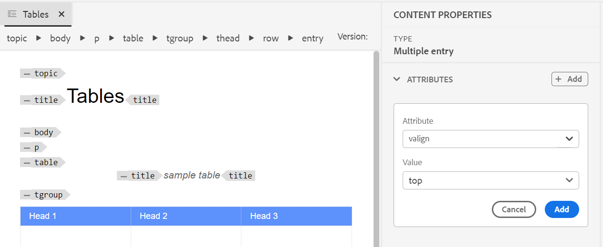{width="800" align="left"}

**Bild einfügen** - 

Fügt ein Bild an der aktuellen oder nächsten gültigen Position ein. Klicken Sie auf das Symbol Bild einfügen , um das Dialogfeld Bild einfügen zu öffnen. Suchen Sie dann nach dem Bild, das Sie einfügen möchten, und wählen Sie es aus.

>[!NOTE]
>
> Sie können auch ein Bild hinzufügen, indem Sie es aus Ihrem lokalen System in Ihren Artikel ziehen und dort ablegen. In diesem Fall wird die Bilddatei mit dem Workflow **Assets hochladen** hinzugefügt.  Weitere Informationen finden Sie im Workflow **Assets hochladen** im Abschnitt [Linkes Bedienfeld](web-editor-features.md#id2051EA0M0HS) .


{width="650" align="left"}

Sie können Bild-/Bildtitel und Alternativtext für das Bild im Dialogfeld Bild einfügen hinzufügen.

Sie können nach der erforderlichen Bilddatei suchen, indem Sie oben in der Suchleiste den Dateinamen in &quot;Typ&quot;eingeben und die Suchergebnisse auch nach Pfad \(für die Suche in\), Sammlungen, Dateityp und Tags filtern. Nachdem Sie die gewünschte Bilddatei gefunden haben, wählen Sie die Datei aus und klicken Sie auf Auswählen , um das Bild in das Dokument einzufügen. Sie können verschiedene Formate von Bilddateien einfügen, z. B. `.png`, `.svg`, `.gif`, `.jpg`, `.eps`, `.ai`, `.psd` und mehr.

Nachdem Sie ein Bild eingefügt haben, können Sie die Höhe, Breite, Platzierung und Attribute im Bereich &quot;Inhaltseigenschaften&quot;ändern. Klicken Sie auf eine Bilddatei und nehmen Sie dann in der rechten Leiste im Bereich Inhaltseigenschaften Änderungen vor.

{width="800" align="left"}

Im Feld Source wird die UUID der eingefügten Bilddatei angezeigt. Sie können den vollständigen Pfad der eingefügten Bilddatei finden, indem Sie mit dem Mauszeiger über das Source-Feld fahren. Der Pfad wird in der QuickInfo angezeigt.

Sie können die Größe eines Bildes ändern, indem Sie für die Bilddatei den Wert Höhe oder Breite angeben. Das Seitenverhältnis des Bildes wird automatisch beibehalten. Bei Bedarf können Sie auch das Seitenverhältnis der Bilddatei beibehalten, indem Sie auf das Sperrsymbol \(Seitenverhältnis beibehalten\) klicken und die Werte für Höhe und Breite angeben.

Sie können auch die Platzierungseinstellung für das Bild als Inline- oder Umbruch festlegen. Wenn Sie die Platzierungsoption &quot;Platzierung umbrechen&quot;verwenden, können Sie festlegen, wo das Bild ausgerichtet werden soll (links, zentriert oder rechts).

Sie können auch andere Eigenschaften für eine Bilddatei hinzufügen, indem Sie die erforderlichen Eigenschaften im Feld **Attribute** auswählen.

>[!NOTE]
>
>Sie können auch anklickbare Bereiche \(Imagemap\) in Ihrem Bild definieren. Weitere Informationen finden Sie in der Beschreibung der Funktion **Imagemap einfügen/bearbeiten** im Abschnitt [Linkes Bedienfeld](web-editor-features.md#id2051EA0M0HS) .

**Kontextmenü für Bild- oder Mediendateien**

Sie können auch einige gängige Vorgänge für Bilder und Mediendateien über das Kontextmenü ausführen. Klicken Sie mit der rechten Maustaste auf eine beliebige Stelle im Bild, um das Kontextmenü aufzurufen.

Das Kontextmenü bietet Optionen zum Ausschneiden, Kopieren oder Einfügen des Bildes oder Mediums. Sie können ein Element vor oder nach dem ausgewählten Element einfügen. Sie haben auch die Möglichkeit, ein Element umzubenennen oder zu entfernen. Sie können das ausgewählte Bild oder Medium im Repository suchen oder die Vorschau der Datei in der Assets-Benutzeroberfläche anzeigen.

Die anderen Optionen im Kontextmenü ermöglichen es Ihnen, den Pfad zu kopieren, eine Imagemap zu bearbeiten, einen Ausschnitt zu erstellen oder IDs für das ausgewählte Element zu generieren.

**Multimedia einfügen** - 

Fügt verschiedene Arten von Multimedia-Dateien ein. Klicken Sie auf das Symbol Multimedia einfügen und wählen Sie den Dateityp aus, den Sie einfügen möchten. Folgende Multimediaformate werden unterstützt:

- Audiodatei
- Videodatei
- YouTube
- Vimeo

Bei Auswahl der Option Audio- oder Videodatei wird Ihnen die Repository-Ansicht angezeigt, in der Sie die gewünschte Datei durchsuchen und auswählen können. Wenn Sie YouTube oder Vimeo auswählen, wird das Dialogfeld Multimedia einfügen angezeigt. Fügen Sie den Link der Videodatei in das Feld Web-Link ein und klicken Sie auf Einfügen , um das Video an der aktuellen oder nächsten gültigen Position im Dokument hinzuzufügen.

>[!NOTE]
>
> Beim Hinzufügen eines YouTube-Video-Links müssen Sie die Zeichenfolge `watch?v=` durch `embed` in der URL ersetzen. Um beispielsweise einen YouTube-Video-Link hinzuzufügen: `https://www.youtube.com/**watch?v**=WlIKQOrmZcs`, müssen Sie ihn wie folgt hinzufügen: `https://www.youtube.com/**embed/**WlIKQOrmZcs`. Durch diese Änderung wird sichergestellt, dass das Video in die AEM Site und die PDF-Ausgabe eingebettet wird.

Sie können die Audio- oder Videodatei auch über das Dialogfeld &quot;Multimedia einfügen&quot;hinzufügen. Wählen Sie die Option Audio-/Videodatei aus und klicken Sie auf das Symbol Durchsuchen , um die Repository-Ansicht zu starten. Wählen Sie die Audio- oder Videodatei aus dem Repository aus und klicken Sie auf Auswählen , um den Link der Datei im Feld Audio-/Videodatei hinzuzufügen. Wenn Sie eine Videodatei auswählen, wird auch im Vorschaubereich eine Vorschau der Datei angezeigt. Sie können die Videodatei abspielen, um die Vorschau anzuzeigen.

{width="650" align="left"}

**Querverweis einfügen** - 

Fügen Sie Verweise des Typs &quot;Content Reference&quot;, &quot;Content Key Reference&quot;, &quot;Key Reference&quot;, &quot;File Reference&quot;, &quot;Web Link&quot;oder &quot;Email Link&quot;ein.

Klicken Sie auf das Symbol &quot;**Datei auswählen**&quot;\(für Inhaltsreferenz und Dateiverweis\) oder auf das Symbol &quot;**Zuordnung auswählen**&quot;\(für Inhaltsschlüsselverweis und Schlüsselreferenz\) und wählen Sie die gewünschte Datei oder den Inhalt aus, mit der/dem eine Verknüpfung hergestellt werden soll.

{width="650" align="left"}

Im Dokument wird eine Verknüpfung der ausgewählten Referenz hinzugefügt. Im Kontextmenü des Links haben Sie folgende Möglichkeiten:

- **Element einfügen**: Zeigt eine Liste gültiger Elemente an, die Sie in den angegebenen Kontext einfügen können.
- **UUID kopieren**: Kopiert die UUID des eingefügten Verweises.
- **Pfad kopieren**: Kopiert den vollständigen Pfad des eingefügten Verweises.
- **Snippet erstellen**: Erstellt einen wiederverwendbaren Snippet aus der eingefügten Referenz.
- **IDs generieren**: Generiert eindeutige IDs für den eingefügten Verweis.

Sie können auch mit der UUID der Datei suchen, die Sie referenzieren möchten. Geben Sie für Links &quot;Inhalt&quot;und &quot;Schlüsselreferenz&quot;die UUID der Datei ein, mit der Sie eine Verknüpfung herstellen möchten. Die Datei wird dann automatisch durchsucht und im Bereich &quot;Vorschau&quot;angezeigt. Wenn Sie die UUID der Datei angeben, müssen Sie die Dateierweiterung für .xml-Dateien nicht explizit angeben. Die .xml-Erweiterung wird automatisch an die UUID angehängt.

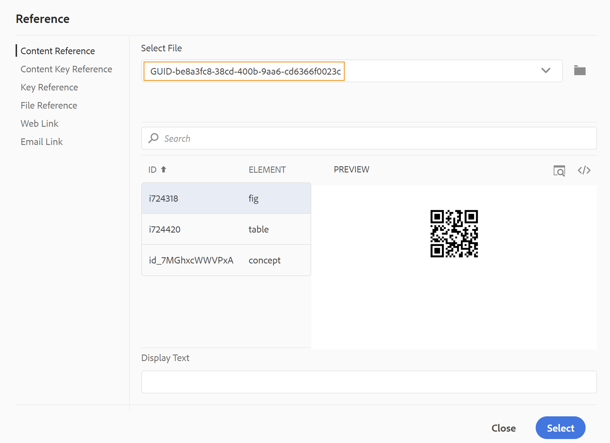{width="650" align="left"}

Wenn Ihr Administrator die Option UUIDs in *XMLEditorConfig* aktiviert hat, wird die UUID des referenzierten Inhalts in der Eigenschaft **Link** angezeigt.

{width="800" align="left"}

>[!NOTE]
>
> Wenn die Option **UUIDs aktivieren** nicht aktiviert ist, wird der relative Pfad des referenzierten Inhalts angezeigt.

>[!IMPORTANT]
>
> Obwohl der relative Pfad des referenzierten Inhalts in der Eigenschaft **Link** angezeigt wird, wird der Link intern mithilfe der UUID des referenzierten Inhalts erstellt.

>[!TIP]
>
> Best Practices zum Referenzieren von Inhalten finden Sie im Abschnitt Verweise im Handbuch Best Practices .

**Suche filtern**

Sie können in den Dateien, die im ausgewählten Pfad des AEM-Repositorys vorhanden sind, nach Text suchen. Beispielsweise wird im folgenden Screenshot nach &quot;general&quot;gesucht. Sie können die Suche auch mit erweiterten Filtern einschränken. Sie können nach allen DITA-Dateien wie DITA-Themen und DITA-Maps suchen, die auf dem ausgewählten Pfad vorhanden sind.

Sie können im ausgewählten Pfad nach Nicht-DITA-Dateien wie Bilddateien, Multimedia und Dokumenten suchen. Sie können auch nach bestimmten Werten in den Attributen von DITA-Elementen suchen. Sie können auch nach Dateien suchen, die vom angegebenen Benutzer ausgecheckt wurden.

{width="650" align="left"}

>[!NOTE]
>
> Ihr Systemadministrator kann auch die Textfilter konfigurieren und andere Filter ein- oder ausblenden. Weitere Informationen finden Sie unter Konfigurieren von Textfiltern im Abschnitt Installieren und Konfigurieren von Adobe Experience Manager Guides as a Cloud Service .

Die Liste der gefilterten Dateien mit dem gesuchten Text wird angezeigt. Im obigen Screenshot werden beispielsweise die Dateien mit dem Text &#39;general&#39; aufgelistet. Sie können auch eine Vorschau des Dateiinhalts anzeigen.

**Wiederverwendbaren Inhalt einfügen** - 

Wiederverwenden von Inhalten, die in einem anderen Dokument in Ihrem Projekt vorhanden sind. Sie können Inhalte einfügen, indem Sie eine direkte Verknüpfung zum Inhalt in einer Datei herstellen oder einen Schlüsselverweis verwenden, siehe [Schlüsselverweise auflösen](map-editor-other-features.md#id176GD01H05Z). Wenn Sie auf das Symbol Wiederverwendbaren Inhalt einfügen klicken, wird das Dialogfeld Inhalt wiederverwenden angezeigt:

{width="650" align="left"}

Wählen Sie im Dialogfeld Inhalt wiederverwenden die Option DITA-Datei für Dateiverweise oder die DITA-Map-Datei, die die Schlüsselverweise enthält. Nach der Auswahl werden das Thema oder die Schlüsselverweise im Dialogfeld angezeigt. Sie können die Kennung/den Schlüssel des Themas auswählen, das Sie einfügen möchten, und auf Fertig klicken, um den Inhalt in Ihr Thema einzufügen.

Zum Einfügen der Inhaltsreferenz können Sie auch die UUID der Datei eingeben. Der wiederverwendbare Inhalt aus dieser Datei wird im Abschnitt Vorschau aufgelistet.

Basierend auf der Einstellung zum Einfügen von Links können Sie entweder die UUID des eingefügten Inhalts oder den relativen Pfad im Bereich Eigenschaften oder in der Codeansicht von Source sehen. Der Link wird immer mit der UUID des referenzierten Inhalts erstellt. Siehe UUID-basierte Links konfigurieren im as a Cloud Service Installieren und Konfigurieren von Adobe Experience Manager Guides .

>[!NOTE]
>
> Um Inhalte vor oder nach dem referenzierten Inhalt hinzuzufügen, verwenden Sie die Pfeiltasten *Alt*+*Links* oder Alt+*Rechts* , um den Cursor an die gewünschte Position zu verschieben.

Sie können den referenzierten Inhalt auch in das Thema einbetten, indem Sie mit der rechten Maustaste auf den referenzierten Inhalt klicken und im Kontextmenü die Option **Verweis durch Inhalt ersetzen** auswählen.

**Sonderzeichen einfügen** - 

Fügt Sonderzeichen in Ihr Thema ein. Klicken Sie auf das Symbol Sonderzeichen einfügen , um das Dialogfeld Sonderzeichen einfügen zu öffnen.

>[!NOTE]
>
> AEM Guides bietet Dialogfelder für bewegliche und anpassbare Elemente. Die Größe von Dialogfeldern mit zwei Kreuzlinien unten rechts kann geändert werden. Die Linien im Dialogfeld Sonderzeichen sind unten dargestellt.

{width="550" align="left"}

Im Dialogfeld &quot;Sonderzeichen einfügen&quot;können Sie mithilfe des Namens nach einem Sonderzeichen suchen. Alle Sonderzeichen werden unter verschiedenen Kategorien gespeichert. Wählen Sie in der Dropdownliste Kategorie auswählen eine Kategorie aus. Die in der ausgewählten Kategorie verfügbaren Sonderzeichen werden angezeigt. Mithilfe der Pfeiltasten können Sie durch die Liste der Sonderzeichen navigieren oder auf das gewünschte Zeichen klicken, das Sie einfügen möchten. Der Name und der Hex-Code des ausgewählten Sonderzeichens werden unter der Liste angezeigt. Klicken Sie auf Einfügen , um das ausgewählte Zeichen in das Dokument einzufügen.

**Suchbegriff einfügen** - 

Fügen Sie einen in Ihre DITA-Zuordnung definierten Suchbegriff ein. Klicken Sie auf das Symbol Suchbegriff einfügen , um das Dialogfeld Schlüsselreferenz zu öffnen.

{width="550" align="left"}

Die Suchbegriffe werden in alphabetischer Reihenfolge aufgelistet. Sie können auch Suchbegriffe\(s\) suchen, indem Sie eine Suchzeichenfolge in das Suchfeld eingeben. Das Suchergebnis gibt die Suchbegriffe zurück, die die Zeichenfolge in ID oder Wert enthalten. Die in Ihrer DITA-Zuordnung definierten Suchbegriffe werden in diesem Dialogfeld aufgelistet. Wählen Sie den einzufügenden Suchbegriff aus und klicken Sie auf **Einfügen**.

Sie können auch die Attribute des eingefügten Suchbegriffs ändern, indem Sie mit der rechten Maustaste auf den Suchbegriff klicken und die Option Attribute auswählen. Das Dialogfeld Attribute for Keyword wird geöffnet:

{width="550" align="left"}

Sie können die Attribute des Suchbegriffs ändern oder dem Suchbegriff ein neues Attribut hinzufügen.

**Snippet einfügen** - 

Fügen Sie ein Snippet an der aktuellen oder nächsten gültigen Position ein. Damit diese Funktion funktioniert, müssen in Ihrem System Snippets definiert sein. Weitere Informationen zum Hinzufügen eines Snippets finden Sie in der Beschreibung der Funktion **Snippet** im Abschnitt [Linkes Bedienfeld](web-editor-features.md#id2051EA0M0HS) .

Wenn Sie auf das Symbol &quot;Snippet einfügen&quot;klicken, wird der Katalog &quot;Snippet einfügen&quot;angezeigt. Der Katalog ist kontextsensitiv, was bedeutet, dass die Snippets nur angezeigt werden, wenn sie an der aktuellen Position zulässig sind.

Das folgende Beispiel zeigt zwei vorkonfigurierte Snippets - Warnung und Fehler , die an der aktuellen Position im Dokument eingefügt werden können.

{width="300" align="left"}

Wenn Sie ein Snippet aus der Liste auswählen, wird es an der aktuellen oder nächsten gültigen Position im Dokument eingefügt. Der folgende Screenshot zeigt das in das Dokument eingefügte Fehler-Snippet:

{width="400" align="left"}

**Image Map einfügen/bearbeiten** - 

Fügt eine Imagemap auf das ausgewählte Bild ein. Ein Bild mit klickbaren Bereichen, die mit Themen oder Webseiten verknüpft sind, wird als Imagemap bezeichnet.

Wählen Sie ein Bild im aktuellen Thema aus und klicken Sie auf das Symbol &quot;Imagemap einfügen/bearbeiten&quot;, um das Dialogfeld &quot;Imagemap einfügen&quot;zu öffnen.

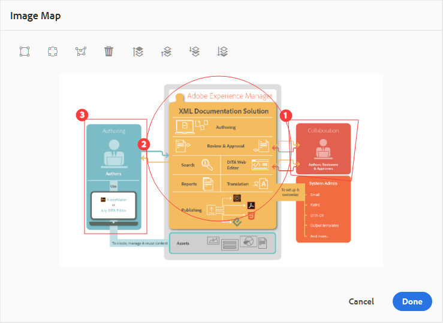{width="650" align="left"}

Wählen Sie das bevorzugte Formrechteck , den Kreis  oder den Polygon  aus, um einen Bereich über einem Bild zu definieren, den Sie als Link verwenden möchten. Nach der Definition eines Bereichs wird das Dialogfeld &quot;Referenz&quot;angezeigt, in dem Sie den Link zu internen oder externen Inhalten angeben müssen:

{width="650" align="left"}

Wenn sich Bereiche überschneiden, können Sie die Form vorwärts bringen oder rückwärts senden, indem Sie auf das entsprechende Symbol in der Symbolleiste klicken. Sie können einen Bereich auch entfernen, indem Sie ihn auswählen und auf das Symbol Löschen klicken. Durch Doppelklicken auf einen Bereich wird das Dialogfeld Verweis geöffnet, in dem Sie den Ziel-Link ändern können. Nachdem Sie die erforderlichen Bereiche auf Ihrem Bild markiert haben, speichern Sie die Änderungen, indem Sie auf Fertig klicken.

**Checkout/Einchecken** - / 

Checkt die aktuelle Datei aus oder checkt sie ein. Durch das Auschecken einer Datei erhält der Benutzer exklusiven Schreibzugriff auf die Datei. Wenn die Datei eingecheckt ist, werden die Änderungen in der aktuellen Version der Datei gespeichert.

Wenn Sie sich in der Kartenansicht befinden und die übergeordnete Zuordnung erweitern, können Sie alle Dateien in der Zuordnung mit einem Klick auschecken. Erweitern Sie einfach die übergeordnete Zuordnungsdatei und wählen Sie die übergeordnete Datei aus, was zur Auswahl aller Dateien innerhalb der Zuordnung führt. Dann können Sie **Auschecken**  auswählen, um die Sperre für alle Dateien in der Zuordnung zu erhalten.

>[!NOTE]
>
> Beim Einchecken einer Datei mit nicht gespeicherten Änderungen werden Sie aufgefordert, die Änderungen zu speichern. Wenn Sie Ihre Änderungen nicht speichern, werden sie nur in der Datei eincheckt.

Die QuickInfo für &quot;Ein-/Auschecken&quot;wird durch die Eigenschaft title in der Datei `ui_config.json` bestimmt.

Weitere Informationen finden Sie unter [Konfigurieren des Titels für &quot;Ein- und Auschecken&quot;-Symbole](../install-guide/conf-checkin-checkout-title.md) im On-Premise-Installations- und Konfigurationshandbuch.


**Tag-Ansicht ein/aus** - 

Tags sind visuelle Hinweise, die die Grenzen eines Elements angeben. Eine Elementgrenze markiert den Anfang und das Ende eines Elements. Sie können diese Begrenzungen dann als visuellen Hinweis verwenden, um den Einfügepunkt zu platzieren oder den Text innerhalb einer Grenze auszuwählen. Wenn Sie ein anderes Element vor oder nach einem Element im Dokument einfügen möchten, können Sie den Einfügepunkt vor oder nach der öffnenden oder schließenden Begrenzung des Elements platzieren.

Der folgende Screenshot zeigt ein Dokument mit der Tag-Ansicht auf:

{width="650" align="left"}

Die folgenden Vorgänge können in einem Dokument mit der Tag-Ansicht auf ausgeführt werden:

- **Element auswählen**: Klicken Sie auf das öffnende oder schließende Tag eines Elements, um dessen Inhalt auszuwählen.

- **Erweitern oder Reduzieren von Tags**: Klicken Sie auf das Pluszeichen (+) oder -, um ein Tag zu erweitern oder zu reduzieren.

- **Kontextmenü verwenden**: Das Kontextmenü bietet Optionen zum Ausschneiden, Kopieren oder Einfügen des ausgewählten Elements. Sie können auch ein Element vor oder nach dem ausgewählten Element einfügen. Mit den anderen Optionen können Sie ID generieren oder den Bereich Eigenschaften für das ausgewählte Element öffnen.

- **Drag-and-Drop von Elementen**: Wählen Sie das Tag eines Elements aus und ziehen Sie es einfach per Drag-and-Drop in das Dokument. Wenn die Ablageposition eine gültige Position ist, an der das Element zulässig ist, wird das Element an der abgelegten Position platziert.


>[!NOTE]
>
> Wenn ein Benutzer die Tags-Ansicht über den Web-Editor aktiviert, bleibt sie auch während der gesamten Sitzungen aktiviert. Dies bedeutet, dass Sie die Tag-Ansicht nicht erneut aktivieren müssen, um später darauf zuzugreifen. Der Standardwert für die Tag-Ansicht für die Sitzung eines neuen Benutzers wird durch die Eigenschaft tagsView in der Datei ui\_config.json bestimmt. Weitere Informationen finden Sie im Abschnitt *Standardwert für die Tag-Ansicht konfigurieren* unter Installieren und Konfigurieren von Adobe Experience Manager Guides as a Cloud Service.

**Verfolgungsänderungen aktivieren/deaktivieren** 

Sie können alle an einem Dokument vorgenommenen Aktualisierungen verfolgen, indem Sie den Modus Änderungen verfolgen aktivieren. Nachdem Sie die Verfolgungsänderungen aktiviert haben, werden alle Einfügungen und Löschungen im Dokument erfasst. Alle gelöschten Inhalte werden mit Durchstreichen hervorgehoben und alle Einfügungen werden in grünem Farbtext hervorgehoben. Darüber hinaus erhalten Sie die Änderungsbalken am Rand der Themenseite. Auch hier wird für gelöschte Inhalte ein roter Balken und für hinzugefügten Inhalt ein grüner Balken angezeigt. Wenn es in derselben Zeile einen Zusatz und eine Löschung gibt, werden sowohl grüne als auch rote Balken angezeigt.

Im folgenden Screenshot wird der gelöschte und eingefügte Inhalt zusammen mit den Änderungsleisten hervorgehoben:

{width="650" align="left"}

Ein typisches Anwendungsbeispiel für die Verfolgung von Änderungen in einem Dokument kann die Durchführung einer Peer Review sein. Sie können Änderungen verfolgen und Ihr Dokument zur Überprüfung freigeben. Der Validierer nimmt dann Änderungen mit Verfolgungsänderungen AN vor. Wenn Sie das Dokument erhalten, sollten Sie über einen Mechanismus verfügen, mit dem Sie die vorgeschlagenen Aktualisierungen anzeigen können, und über eine praktische Möglichkeit, Änderungen zu akzeptieren oder abzulehnen.

AEM Guides bietet die Funktion &quot;Getrackte Änderungen&quot;, die Informationen zu den im Dokument vorgenommenen Aktualisierungen enthält. Die Funktion &quot;Getrackte Änderungen&quot;bietet Informationen darüber, welche Aktualisierungen vorgenommen wurden, wer sie vorgenommen hat und zu welchem Zeitpunkt. Mithilfe der Funktion &quot;Getrackte Änderungen&quot;können Sie die vorgeschlagenen Aktualisierungen im Dokument auch einfach akzeptieren oder ablehnen.

Um auf die Funktion zuzugreifen, klicken Sie im rechten Bereich auf das Symbol Getrackte Änderungen .

{width="300" align="left"}

Wenn Sie auf eine Änderung klicken, wird der geänderte Inhalt im Dokument ausgewählt. Sie können eine Änderung akzeptieren, indem Sie auf das Symbol &quot;Änderung akzeptieren&quot;klicken oder sie ablehnen, indem Sie die Option &quot;Änderung ablehnen&quot;auswählen.

Wenn Sie alle Änderungen mit einem Klick akzeptieren oder ablehnen möchten, wählen Sie **Alle akzeptieren** oder **Alle ablehnen** aus.

>[!NOTE]
>
> Im Vorschaumodus können Sie das Dokument mit oder ohne Markups des geänderten Inhalts anzeigen. Weitere Informationen finden Sie im Modus [Vorschau](web-editor-views.md#preview-mode-id19AAGL00163) .

**Merge** - 

Wenn Sie in einer Umgebung mit mehreren Autoren arbeiten, wird es schwierig, die Änderungen zu verfolgen, die die anderen Autoren in einem Thema oder einer Karte vorgenommen haben. Die Funktion Zusammenführen bietet Ihnen mehr Kontrolle darüber, ob die Änderungen angezeigt werden, aber auch, welche Änderungen in der neuesten Version des Dokuments beibehalten werden.

**Themendateien zusammenführen**

Um Änderungen an einem Thema zusammenzuführen, führen Sie die folgenden Schritte aus:

1. Öffnen Sie ein Thema im Web-Editor.

1. Klicken Sie auf **Zusammenführen**.

   Das Dialogfeld Zusammenführen wird angezeigt.

   {width="550" align="left"}

1. *\(Optional\)* Sie können auch eine neue Datei an einem anderen Speicherort im Repository durchsuchen und auswählen.

1. Wählen Sie eine Version der Datei aus, mit der Sie die aktuelle Version der Datei vergleichen möchten.

1. Wählen Sie unter Optionen Folgendes aus:

   - **Änderungen von ausgewählter Version verfolgen**: Diese Option zeigt alle Inhaltsaktualisierungen in Form von Verfolgungsänderungen an. Anschließend können Sie Änderungen im Dokument einzeln oder in einem Schritt akzeptieren oder ablehnen.

   - **Auf ausgewählte Version zurücksetzen**: Mit dieser Option wird die aktuelle Version des Dokuments auf die ausgewählte Version zurückgesetzt. Mit dieser Option haben Sie keine Kontrolle darüber, welche Inhalte akzeptiert oder abgelehnt werden.

1. Klicken Sie auf **Fertig**.

1. Wenn Sie die Option &quot;**Geänderte Version verfolgen**&quot;ausgewählt haben, werden alle Änderungen der ausgewählten Version in der Funktion &quot;Getrackte Änderungen&quot;im rechten Bereich angezeigt.

   Sie können im Bedienfeld Getrackte Änderungen alle Kommentare akzeptieren oder ablehnen oder einzelne Kommentare akzeptieren oder ablehnen.


**Zuordnungsdateien zusammenführen**

Führen Sie die folgenden Schritte aus, um Änderungen in einer Map-Datei zusammenzuführen:

1. Öffnen Sie eine Karte im Web-Editor.

1. Klicken Sie auf **Zusammenführen**.

   Das Dialogfeld Zusammenführen wird angezeigt.

   {width="550" align="left"}

1. *\(Optional\)* Sie können auch eine neue Datei an einem anderen Speicherort im Repository durchsuchen und auswählen.

1. Wählen Sie eine Version der Datei aus, mit der Sie die aktuelle Version der Datei vergleichen möchten.

1. Wählen Sie unter Optionen Folgendes aus:

   - **Änderungen von ausgewählter Version verfolgen**: Diese Option zeigt alle Inhaltsaktualisierungen in Form von Verfolgungsänderungen an. Anschließend können Sie Änderungen im Dokument einzeln oder in einem Schritt akzeptieren oder ablehnen.

   - **Auf ausgewählte Version zurücksetzen**: Mit dieser Option wird die aktuelle Version des Dokuments auf die ausgewählte Version zurückgesetzt. Mit dieser Option haben Sie keine Kontrolle darüber, welche Inhalte akzeptiert oder abgelehnt werden.

1. Klicken Sie auf **Fertig**.

   1. Wenn Sie die Option &quot;**Geänderte Version verfolgen**&quot;ausgewählt haben, werden alle Änderungen aus der ausgewählten Version im Bereich Getrackte Änderungen angezeigt \(rechts\).

      Sie können alle Änderungen im Bereich Getrackte Änderungen akzeptieren oder ablehnen oder einzelne Änderungen in der Zuordnungsdatei akzeptieren oder ablehnen.


**Versionsverlauf** - 


Mit der Funktion **Versionsverlauf** im Web Editor können Sie die verfügbaren Versionen Ihrer DITA-Dateien überprüfen, sie vergleichen und vom Editor selbst auf eine beliebige Version zurücksetzen.

Im Versionsverlauf können Sie den Inhalt und die Metadaten der aktuellen Version (die auch eine Arbeitskopie sein kann) mit einer früheren Version derselben Datei vergleichen. Sie können auch die Bezeichnungen und Kommentare für die verglichenen Versionen anzeigen.

Um auf den Versionsverlauf zuzugreifen und zu einer bestimmten Version Ihres Themas zurückzukehren, führen Sie die folgenden Schritte aus:

1. Öffnen Sie ein Thema im Web-Editor.

1. Klicken Sie auf **Versionsverlauf**.

   Das Dialogfeld **Versionsverlauf** wird angezeigt.

   {width="550" align="left"}
   *Sehen Sie sich die Änderungen in den verschiedenen Versionen eines Themas in der Vorschau an.*

1. Wählen Sie in der Dropdown-Liste **Mit** eine Version des Themas aus, das Sie vergleichen oder wiederherstellen möchten.

   >[!NOTE]
   >
   > Wenn auf eine Version Bezeichnungen angewendet werden, werden sie auch \(in Klammern\) zusammen mit der Versionsnummer angezeigt.


1. Aktivieren Sie die Option **Bezeichnungen und Kommentare anzeigen** , um die Bezeichnungen und Kommentare anzuzeigen, die auf die aktuelle und die verglichenen Versionen angewendet werden.

1. Sie können auch die folgenden Informationen im Dialogfeld **Versionsverlauf** anzeigen:

   Registerkarte **Vorschau**: Der neu hinzugefügte Inhalt ist grün und der gelöschte Inhalt ist rot.

   Registerkarte **Metadaten**: Die neu hinzugefügten Metadaten sind grün und die gelöschten Metadaten sind rot.
   {width="550" align="left"}
   *Vergleichen Sie die Metadaten verschiedener Versionen im Versionsverlauf.*

   >[!NOTE]
   >
   > Ihr Systemadministrator kann die Metadaten ändern, die auf der Registerkarte Metadaten in den Editor-Einstellungen angezeigt werden sollen.

   Sie können auch die Benutzer- und Uhrzeitdetails der aktuellen und der verglichenen Version anzeigen.


1. Sobald Sie eine Version aus der Dropdownliste auswählen, wird die Option **Auf ausgewählte Version zurücksetzen** verfügbar gemacht. Im Vorschaufenster werden die Unterschiede zwischen der aktuellen Version und der ausgewählten Version des Themas angezeigt.


1. Klicken Sie auf **Zur ausgewählten Version zurückkehren** , um Ihre Arbeitskopie mit der ausgewählten Version des Themas wiederherzustellen.

   Das Dialogfeld Version wiederherstellen wird angezeigt.

   {width="550" align="left"}

1. \(*Optional*\) Geben Sie einen Grund für die Wiederherstellung einer früheren Version an. Sie können auch eine neue Version der derzeit aktiven Arbeitskopie Ihres Themas erstellen.

1. Klicken Sie auf **Bestätigen.**

   Ihre Arbeitskopie der Datei wird auf die ausgewählte Version zurückgesetzt. Wenn Sie eine neue Version der derzeit aktiven Arbeitskopie erstellen möchten, wird auch eine neue Version der Datei mit allen Arbeitsänderungen erstellt.


Wenn Sie zu einer früheren Version zurückkehren, wird ein visueller Hinweis angezeigt, der angibt, dass die Version, an der Sie derzeit arbeiten, nicht die neueste Version ist.

{width="800" align="left"}

**Versionsbeschriftungsverwaltung** - 

Mit Beschriftungen können Sie die Phase identifizieren, in der sich ein bestimmtes Thema im DDLC befindet \(Document Development Life Cycle\). Wenn Sie beispielsweise an einem Thema arbeiten, können Sie die Bezeichnung als &quot;Genehmigt&quot;festlegen. Sobald ein Thema veröffentlicht und Kunden zur Verfügung gestellt wurde, können Sie diesem Thema die Bezeichnung &quot;Veröffentlicht&quot;zuweisen.

Mit AEM Guides können Sie Beschriftungen in einem Freiformtextformat angeben oder vordefinierte Beschriftungen verwenden. Mit der benutzerdefinierten Beschriftung kann jeder Autor im System eine Beschriftung entsprechend seiner Wahl angeben. Dies gibt Flexibilität, führt jedoch zu inkonsistenten Beschriftungen im System. Um dieses Problem zu beheben, können Administratoren eine Reihe vordefinierter Bezeichnungen konfigurieren. Weitere Informationen zum Konfigurieren vordefinierter Beschriftungen finden Sie unter *Konfigurieren und Anpassen des XML-Web-Editors* im as a Cloud Service Installieren und Konfigurieren von Adobe Experience Manager Guides .

Diese Beschriftungen werden Autoren in Form einer Dropdown-Liste angezeigt, wo sie eine Beschriftung angeben müssen. Dadurch wird sichergestellt, dass im System nur vordefinierte, konsistente Beschriftungen verwendet werden.

Es gibt verschiedene Methoden, mit denen Sie Beschriftungen auf Ihre Themen anwenden können: Bedienfeld [Versionsverlauf](web-editor-use-label.md) in der Assets-Benutzeroberfläche, Benutzeroberfläche [Grundlinien](/help/product-guide/user-guide/generate-output-use-baseline-for-publishing.md) und Web-Editor. Mit der Funktion Versionsbezeichnung im Web-Editor können Autoren schnell und einfach Titel zu ihren Themen zuweisen.

So fügen Sie Ihrem Thema im Web Editor Beschriftungen hinzu:

1. Öffnen Sie ein Thema im Web-Editor.

1. Klicken Sie auf **Versionsbezeichnung**.

   Das Dialogfeld Versionsbeschriftungsverwaltung wird angezeigt.

   {width="650" align="left"}

   Das Dialogfeld &quot;Verwaltung der Versionsbeschriftung&quot;ist in zwei Teile unterteilt: Das linke Bedienfeld enthält eine Liste der für das Thema verfügbaren Versionen zusammen mit der Dropdownliste der Titel \(oder ein Textfeld zur Eingabe eines Titels\) und das rechte Bedienfeld mit einer Vorschau des Themas.

1. Wählen Sie eine Version aus, auf die Sie Beschriftungen anwenden möchten.

   Wenn Sie eine andere Version des Themas aus der Versionsliste auswählen, zeigt das Vorschaufenster die Änderungen zwischen der aktuellen Version und der ausgewählten Version des Themas an

   >[!NOTE]
   >
   > Wenn eine Bezeichnung bereits auf eine Version angewendet wurde, wird sie neben der Versionsnummer in der Dropdown-Liste und unter der Liste Version auswählen angezeigt. Sie können eine vorhandene Bezeichnung entfernen, indem Sie auf das Symbol \(**x**\) neben der Bezeichnung klicken.

1. Falls Ihr Administrator eine Liste von Bezeichnungen definiert hat, wird Ihnen eine Dropdownliste mit den Bezeichnungen angezeigt, aus der Sie die Bezeichnungen auswählen können, die Sie anwenden möchten. Sie können aus der Dropdownliste mehrere Beschriftungen auswählen.

   Andernfalls wird Ihnen ein Textfeld angezeigt, in dem Sie die Beschriftungen eingeben können, die Sie zu Ihrem Thema hinzufügen möchten.

   >[!NOTE]
   >
   > Dieselbe Bezeichnung kann nicht auf mehrere Versionen eines Themas angewendet werden. Wenn Sie versuchen, eine vorhandene Bezeichnung zuzuordnen, erhalten Sie eine Option, diese aus der vorhandenen Version zu entfernen und sie auf die ausgewählte Version des Themas anzuwenden.

1. Klicken Sie auf **Titel hinzufügen**.

1. Wählen Sie in der Bestätigungsnachricht Titel anwenden die Option **Titel verschieben** aus, um Beschriftungen von einer vorhandenen Version in die ausgewählte Version zu verschieben. Wenn Sie diese Option nicht auswählen und es Beschriftungen gibt, die einer anderen Version des Themas zugewiesen sind, werden sie nicht in die Version des ausgewählten Themas verschoben. Solche Bezeichnungen werden im Bezeichnungsanwendungsprozess ignoriert.


**Prüfungsaufgabe erstellen** - 

Sie können eine Prüfungsaufgabe des aktuellen Themas oder der Zuordnungsdatei direkt im Web-Editor erstellen. Öffnen Sie die Datei, für die Sie die Prüfungsaufgabe erstellen möchten, und klicken Sie auf Prüfungsaufgabe erstellen , um den Überprüfungserstellungsprozess zu starten.

>[!NOTE]
>
> Sie können eine Prüfungsaufgabe auch über das Überprüfungsbedienfeld erstellen \(rechts\).

Befolgen Sie die Anweisungen in den [Prüfungsthemen oder -zuordnungen](review.md#) , um weitere Details zu erhalten.

## Linke Leiste {#id2051EA0M0HS}

Das linke Bedienfeld ist ein persistentes Bedienfeld. Sie können sie erweitern oder reduzieren, indem Sie auf das Symbol Seitenleiste erweitern klicken \(\). In der erweiterten Ansicht werden die Namen der Symbole angezeigt, die in der ausgeblendeten Ansicht als QuickInfos angezeigt werden.

>[!NOTE]
>
> Die Größe des linken Bereichs kann geändert werden. Um die Größe des Bedienfelds zu ändern, bewegen Sie den Cursor auf die Bereichsgrenze, der Cursor ändert sich in einen Doppelpfeil, klicken Sie auf und ziehen Sie, um die Fensterbreite zu ändern.

Im linken Bereich haben Sie Zugriff auf die folgenden Funktionen:

**Favoriten** - 

Wenn Sie an einer Reihe von Dateien oder Ordnern arbeiten, können Sie diese Ihrer Favoritenliste hinzufügen, um schnell darauf zugreifen zu können. Die Favoritenliste enthält die Liste der Dokumente, die Sie hinzugefügt haben, sowie andere öffentlich zugängliche Dokumente der anderen Benutzer.

Standardmäßig können Sie die Dateien anhand von Titeln anzeigen. Wenn Sie den Mauszeiger über eine Datei bewegen, können Sie den Dateinamen und den Dateipfad als QuickInfo anzeigen.

>[!NOTE]
>
> Als Administrator können Sie auch die Liste der Dateien nach Dateinamen im Web Editor anzeigen. Wählen Sie die Option **Dateiname** im Abschnitt **Dateien nach** in den **Benutzereinstellungen**  aus.

Um eine Favoritenliste oder Sammlung zu erstellen, klicken Sie auf das Symbol + neben dem Bedienfeld Favoriten , um das Protokoll Neue Sammlung - Dialogfeld aufzurufen:

{width="300" align="left"}

Geben Sie einen Titel und eine Beschreibung für die Lieblingssammlung ein, die Sie erstellen möchten. Wenn Sie **Öffentlich** auswählen, wird dieser Favorit auch anderen Benutzern angezeigt.

Verwenden Sie eine der folgenden Methoden, um Ihrer Lieblingssammlung eine Datei hinzuzufügen:

- Navigieren Sie in der Repository-Ansicht zur gewünschten Datei oder zum gewünschten Ordner, klicken Sie auf das Symbol *Optionen* , um das Kontextmenü zu öffnen, und wählen Sie **Zu Favoriten hinzufügen** aus. Im Dialogfeld Zu Favoriten hinzufügen können Sie auswählen, ob die Datei/der Ordner einem vorhandenen Favoriten hinzugefügt oder ein neuer erstellt werden soll.

  {width="300" align="left"}

- Klicken Sie im Editor mit der rechten Maustaste auf die Registerkarte einer Datei, um das Kontextmenü zu öffnen. Wählen Sie **Hinzufügen zu** > **Favoriten** aus, um die Datei Ihrer Favoritenliste hinzuzufügen.

  {width="400" align="left"}

>[!NOTE]
>
> - Um ein Element aus der Favoritenliste zu entfernen, wählen Sie das Symbol &quot;Optionen&quot;neben dem Element in einer Favoritensammlung und dann **Aus Favoriten entfernen** aus.
> - Um eine Vorschau der Datei anzuzeigen, ohne sie zu öffnen, wählen Sie eine Datei aus und klicken Sie dann im Menü &quot;Optionen&quot;auf **Vorschau** .


**Menü &quot;Optionen&quot;für die Favroties-Sammlung**\
Sie können auch viele Aktionen über das Menü &quot;Optionen&quot;ausführen, das für eine Favoriten-Sammlung verfügbar ist:

{width="400" align="left"}

- **Umbenennen**: Benennen Sie die ausgewählte Sammlung um.
- **Löschen**: Löscht die ausgewählte Sammlung.
- **Aktualisieren**: Rufen Sie eine neue Liste von Dateien und Ordnern aus dem Repository ab.
- **In der Assets-Benutzeroberfläche anzeigen**: Zeigt den Datei- oder Ordnerinhalt in der Assets-Benutzeroberfläche an.

>[!NOTE]
>
> Sie können die Liste auch über das Aktualisierungssymbol oben aktualisieren.


**Repository-Ansicht** - 

Wenn Sie auf das Symbol &quot;Repository-Ansicht&quot;klicken, erhalten Sie eine Liste der in DAM verfügbaren Dateien und Ordner. Standardmäßig können Sie die Dateien anhand von Titeln anzeigen. Wenn Sie den Mauszeiger über eine Datei bewegen, können Sie den Dateinamen und den Dateinamen als QuickInfo anzeigen.

>[!NOTE]
>
> Als Administrator können Sie auch die Liste der Dateien nach Dateinamen im Web Editor anzeigen. Wählen Sie die Option **Dateiname** im Abschnitt **Dateien nach** in den **Benutzereinstellungen**  aus.


Es werden 75 Dateien gleichzeitig geladen. Jedes Mal, wenn Sie auf **Mehr laden**... klicken, werden 75 Dateien geladen und die Schaltfläche wird nicht mehr angezeigt, wenn alle Dateien aufgelistet wurden. Diese Stapelladung ist effizient und Sie können schneller auf die Dateien zugreifen, als alle in einem Ordner vorhandenen Dateien zu laden.

Sie können einfach zur gewünschten Datei in DAM navigieren und sie im Web-Editor öffnen. Wenn Sie den erforderlichen Zugriff haben, um die Datei zu bearbeiten, können Sie dies tun.

Sie können auch im Web Editor auf eine Audio- oder Videodatei klicken und diese wiedergeben. Sie können die Lautstärke oder
die Ansicht des Videos. Im Kontextmenü haben Sie auch die Optionen zum Herunterladen, Ändern der Wiedergabe
Geschwindigkeit oder Bild im Bild anzeigen.


Wählen Sie eine Karte aus und drücken Sie die Eingabetaste oder doppelklicken Sie darauf, um sie in der **Kartenansicht** zu öffnen. Weitere Informationen finden Sie in der Beschreibung der Funktion **Kartenansicht** im Abschnitt [Linkes Bedienfeld](web-editor-features.md#id2051EA0M0HS) . Wählen Sie ein Thema aus und drücken Sie die Eingabetaste oder doppelklicken Sie darauf, um es im [Inhaltsbearbeitungsbereich](#id2051EB000UI) zu öffnen. Wenn Sie eine Datei direkt über den Web Editor navigieren und öffnen können, sparen Sie Zeit und erhöhen die Produktivität.

**Suche filtern**

Der Web Editor bietet erweiterte Filter für die Suche nach Text. Sie können in den Dateien, die auf dem ausgewählten Pfad des Adobe Experience Manager-Repositorys vorhanden sind, nach Text suchen und filtern. Sie sucht in den Dateien nach Titel, Dateinamen und Inhalt.


{width="300" align="left"}

*Filter anwenden, um nach Dateien zu suchen, die den Text enthalten`general purpose.`*

Wählen Sie das Symbol **Suche filtern** \(\) aus, um das Popup-Fenster Filter nach zu öffnen.

>[!NOTE]
>
> Wenn Sie nach Text suchen oder Dateien filtern, wird ein blauer Punkt auf dem Symbol **Suche filtern** \(\) angezeigt, der angibt, dass wir uns im Suchbereich befinden und dass einige Filter angewendet wurden.


Sie haben die folgenden Optionen, um die Dateien zu filtern und Ihre Suche im Adobe Experience Manager-Repository einzuschränken:

- **DITA-Dateien**: Sie können nach allen **DITA-Themen** und **DITA-Maps** suchen, die auf dem ausgewählten Pfad vorhanden sind. Diese sind standardmäßig ausgewählt.
- **Nicht-DITA-Dateien**: Sie können im ausgewählten Pfad nach **Ditaval-Dateien**, **Bilddateien**, **Multimedia**, **Dokumenten** und **JSON** suchen.

 {width="300" align="left"}

*Verwenden Sie die Filter für die schnelle Suche, um nach DITA- und Nicht-DITA-Dateien zu suchen.*

**Erweiterte Filterung**

Wählen Sie das Symbol **Erweiterte Filter**  aus, um das Dialogfeld **Erweiterter Filter** anzuzeigen.

Sie können die folgenden Optionen auf den Registerkarten **Allgemein** und **Erweitert** anzeigen.

 {width="800" align="left"}


**Allgemein**

- **Die Suchergebnisse lauten wie folgt**: Suchen Sie in den Dateien, die im ausgewählten Pfad des Adobe Experience Manager-Repositorys vorhanden sind, nach Text. Der Text wird im Titel, Dateinamen und Inhalt der Dateien durchsucht.

Dies wird mit dem Suchfeld im Repository-Fenster synchronisiert. Wenn Sie beispielsweise im Suchfeld im Repository-Bedienfeld &quot;`general purpose`&quot;eingeben, wird dies auch im Dialogfeld &quot;**Erweiterter Filter**&quot;angezeigt und umgekehrt.

- **Suchen in**: Wählen Sie den Pfad aus, in dem Sie die im Adobe Experience Manager-Repository vorhandenen Dateien durchsuchen möchten.

- **Ausgecheckt von**: Sie können nach Dateien suchen, die der angegebene Benutzer auscheckt.
- **Zuletzt geändert**: Sie können nach Dateien suchen, die nach einem ausgewählten Datum, aber vor einem ausgewählten Datum zuletzt geändert wurden.
- **Geändert vor**: Sie können nach Dateien suchen, die vor einem ausgewählten Datum zuletzt geändert wurden.
- **Zeitrahmen**: Sie können auch nach Dateien suchen, die in den letzten zwei Stunden, in der letzten Woche, im letzten Monat oder im letzten Jahr zuletzt geändert wurden.
- **Tags**: Sie können nach Dateien suchen, auf die bestimmte Tags angewendet wurden. Sie können das Tag entweder eingeben oder aus der Dropdown-Liste auswählen.

**Erweitert**

- **DITA-Elemente**: Sie können auch nach bestimmten Werten in den Attributen der angegebenen DITA-Elemente suchen.
   - Wählen Sie **Element hinzufügen**  aus, um die Elemente, Attribute und Werte hinzuzufügen.
   - Wenden Sie die ausgewählten Filter an.

- Wählen Sie **Alle löschen** aus, um alle angewendeten Filter zu löschen.


- Wählen Sie das Symbol **Filter schließen**  aus, um den Filter zu schließen und zur Baumansicht des Repositorys zurückzukehren.

  >[!NOTE]
  >
  >Ihr Systemadministrator kann auch die Textfilter konfigurieren und andere Filter ein- oder ausblenden. Weitere Informationen finden Sie im Abschnitt *Textfilter konfigurieren* im Abschnitt Installieren und Konfigurieren von Adobe Experience Manager Guides as a Cloud Service.
  >
  >Die Liste der gefilterten Dateien, die den gesuchten Text enthalten, wird angezeigt. Beispielsweise werden die Dateien mit dem Text `general purpose` im vorherigen Screenshot aufgelistet. Sie können mehrere Dateien aus der gefilterten Liste auswählen, um sie per Drag-and-Drop in eine zur Bearbeitung geöffnete Karte zu ziehen.


**Menü &quot;Optionen&quot;**

Zusätzlich zum Öffnen von Dateien über das linke Bedienfeld können Sie auch viele Aktionen über das Menü Optionen ausführen, das in der Repository-Ansicht verfügbar ist. Je nachdem, ob Sie einen Ordner, eine Themendatei oder eine Mediendatei auswählen, werden Ihnen unterschiedliche Optionen angezeigt.

**Optionen für einen Ordner**

Sie können die folgenden Aktionen über das Menü &quot;Optionen&quot;ausführen, das für einen *Ordner* in der Repository-Ansicht verfügbar ist:

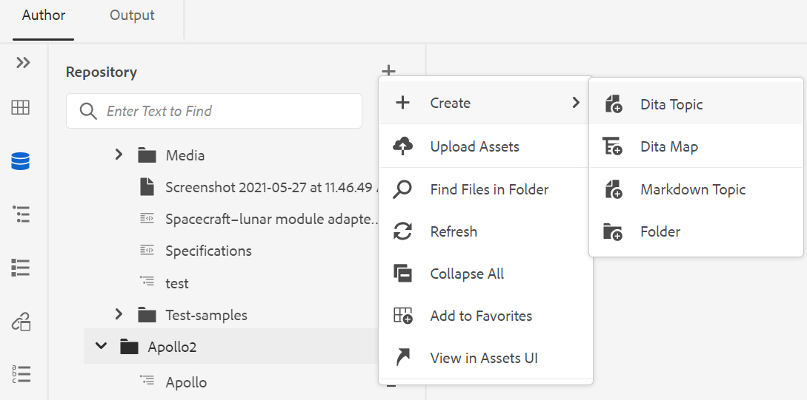{width="550" align="left"}


- **Erstellen**: Erstellen Sie ein neues DITA-Thema, eine DITA-Zuordnung oder einen Ordner. Weitere Informationen finden Sie im Verfahren **Erstellen von Themen aus der Repository-Ansicht** im Abschnitt [Linkes Bedienfeld](web-editor-features.md#id2051EA0M0HS) .


- **Assets hochladen**: Laden Sie eine Datei aus Ihrem lokalen System in den ausgewählten Ordner im Adobe Experience Manager-Repository hoch. Sie können Dateien auch per Drag &amp; Drop aus Ihrem lokalen System in das aktuelle Arbeitsthema ziehen. Dies ist sehr nützlich, wenn Sie Bilder aus Ihrem lokalen System in Ihr Thema einfügen möchten.

  {width="550" align="left"}

  Sie können einen Ordner auswählen, in den Sie die Datei hochladen möchten. Außerdem wird eine Vorschau des Bildes angezeigt. Wenn Sie die Datei umbenennen möchten, können Sie dies im Textfeld Dateiname tun. Klicken Sie auf &quot;Hochladen&quot;, um den Datei-Upload-Vorgang abzuschließen. Wenn Sie eine Bilddatei auf ein Thema gezogen und dort abgelegt haben, wird die Bilddatei dem Artikel hinzugefügt und auch hochgeladen.

  Wenn Ihr Administrator die Option UUIDs in *XMLEditorConfig* aktiviert hat, wird die UUID des hochgeladenen Bildes in der Eigenschaft **Source** angezeigt.

  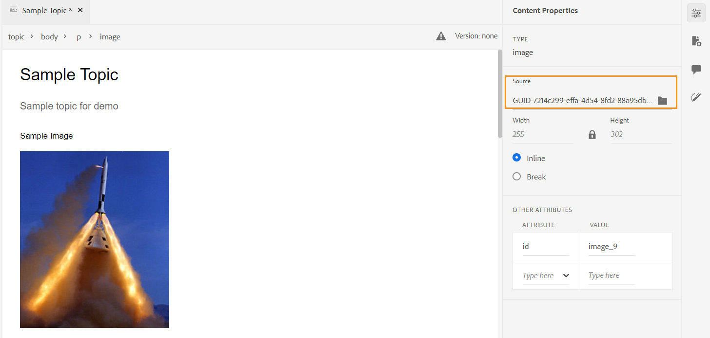{width="800" align="left"}

- **Dateien im Ordner suchen**: Verschiebt den Fokus auf die Repository-Suche, wobei Sie den Suchbegriff eingeben können. Die Suche wird im ausgewählten Ordner im Repository durchgeführt. Sie können auch einen Filter anwenden, um DITA-Dateien, Bilddateien oder beides zurückzugeben.

  {width="400" align="left"}

  Sie können auch mithilfe der UUID einer Datei suchen. In diesem Fall zeigen die Suchergebnisse den Titel der DITA-/XML-Datei an. Wenn es sich bei der Datei um eine Bilddatei handelt, wird die UUID der Datei angezeigt. Im folgenden Suchbeispiel wird die UUID einer Bilddatei durchsucht und die Suchergebnisse zeigen die UUID der Originalbilddatei und den Thementitel der Datei an, in der das Bild referenziert wird.

  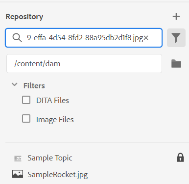{width="300" align="left"}

- **Alle reduzieren**: Reduzieren Sie alle geöffneten Ordner im Repository und zeigen Sie nur die Ordner auf der Stammebene an.

  >[!NOTE]
  >
  > Verwenden Sie das Symbol **\>** neben einem Ordner, um ihn zu erweitern.

- **Zu Favoriten hinzufügen**: Fügt den ausgewählten Ordner zu Favoriten hinzu. Sie können sie einer vorhandenen oder neuen Favoritensammlung hinzufügen.

- **Aktualisieren**: Rufen Sie eine neue Liste von Dateien und Ordnern aus dem Repository ab.
- **In Assets-Benutzeroberfläche anzeigen**: Zeigt den Ordnerinhalt in der Assets-Benutzeroberfläche an.

**Optionen für eine Datei**

Im Menü Optionen werden je nachdem, ob Sie eine Mediendatei oder eine DITA-Datei auswählen, unterschiedliche Optionen angezeigt. Einige häufig verfügbare Optionen für Medien- und DITA-Dateien sind:

- Duplizieren
- Auschecken/Einchecken
- Vorschau
- Verschieben nach
- Umbenennen
- Löschen
- Kopieren
- Alle reduzieren
- Zu Favoriten hinzufügen
- Eigenschaften
- Anzeigen in der Assets-Benutzeroberfläche

{width="550" align="left"}

Die verschiedenen Optionen im Menü Optionen werden nachfolgend beschrieben:

- **Bearbeiten**: Öffnen Sie die Datei zur Bearbeitung. Bei einer .ditamap/.bookmap -Datei wird sie im [erweiterten Map-Editor](map-editor-advanced-map-editor.md#) zur Bearbeitung geöffnet.

- **Duplizieren**: Verwenden Sie diese Option, um ein Duplikat oder eine Kopie der ausgewählten Datei zu erstellen. Sie können die duplizierte Datei auch in der Eingabeaufforderung &quot;Asset duplizieren&quot;umbenennen. Standardmäßig wird die Datei mit dem Suffix \(z. B. filename\_1.extension\) erstellt. Der Titel der Datei bleibt mit der der Quelldatei identisch und die neue Datei beginnt mit Version 1.0. Alle Verweise, Tags und Metadaten werden kopiert, während die Grundlinien nicht in die duplizierte Datei kopiert werden.
- **Auschecken**: Sperrt die ausgewählte Datei für die Bearbeitung. Bei gesperrten Dateien ändert sich diese Option in **Einchecken**.

  >[!NOTE]
  >
  > - Wenn eine Datei von einem Benutzer gesperrt oder ausgecheckt wurde, wird beim Bewegen des Mauszeigers über das Sperrsymbol der Benutzer angezeigt, der die Datei gesperrt hat.
  > - Beim Einchecken einer Datei mit nicht gespeicherten Änderungen werden Sie aufgefordert, die Änderungen zu speichern. Wenn Sie Ihre Änderungen nicht speichern, werden sie nur in der Datei eincheckt.

- **Vorschau**: Erhalten Sie eine schnelle Vorschau der Datei (.dita, .xml, audio, video oder image), ohne sie zu öffnen. Sie können die Größe des Vorschaufensters ändern. Wenn der Inhalt `<xref>` oder `<conref>` enthält, können Sie ihn auswählen, um ihn in einer neuen Registerkarte zu öffnen. Der Titel der Datei wird im Fenster angezeigt. Wenn kein Titel vorhanden ist, wird der Dateiname angezeigt. Um den Bereich **Vorschau** zu schließen, können Sie entweder das Symbol zum Schließen auswählen oder auf eine beliebige Stelle außerhalb des Bereichs klicken.

  {width="800" align="left"}

- **Umbenennen**: Mit dieser Option können Sie die ausgewählte Datei umbenennen. Geben Sie den Namen der neuen Datei im Dialogfeld **Asset umbenennen** ein.
   - Sie können eine Datei beliebigen Typs umbenennen.
   - Sie können die Dateierweiterung nicht ändern.
   - Zwei Dateien dürfen nicht denselben Namen haben. Sie können also eine Datei nicht in einen bereits vorhandenen Namen umbenennen. Es wird ein Fehler angezeigt.

- **Verschieben nach**: Mit dieser Option können Sie die ausgewählte Datei in einen anderen Ordner verschieben.
   - Sie können entweder den Namen des Zielordners eingeben oder **Pfad auswählen** wählen, um den Zielordner auszuwählen.
   - Sie können eine Datei beliebigen Typs in ein beliebiges Ziel im Ordner Inhalt verschieben.
   - Zwei Dateien dürfen nicht denselben Namen haben. Sie können also keine Datei in einen Ordner verschieben, in dem bereits eine Datei mit demselben Namen vorhanden ist.

  Wenn Sie versuchen, eine Datei in einen Ordner zu verschieben, in dem eine Datei mit demselben Namen, aber einem anderen Titel vorhanden ist, wird das Dialogfeld &quot;Datei umbenennen und verschieben&quot;angezeigt. Benennen Sie die Datei um, bevor Sie sie verschieben. Die verschobene Datei im Zielordner hat den neuen Dateinamen.

  {width="550" align="left"}

  >[!NOTE]
  >
  > Sie können eine Datei auch per Drag-and-Drop in einen anderen Zielordner ziehen.

  **Ausschlussszenarien**

  In AEM Guides ist es nicht möglich, eine Datei in folgenden Szenarien umzubenennen oder zu verschieben:

   - Sie können eine Datei nicht verschieben oder umbenennen, wenn sie Teil eines Reviews oder eines Übersetzungs-Workflows ist.

   - Wenn ein anderer Benutzer die Datei auscheckt, können Sie sie nicht umbenennen oder verschieben, wird die Option Umbenennen oder Verschieben nach für die Datei nicht angezeigt.

  >[!NOTE]
  >
  > Wenn Ihnen Ihr Administrator die Berechtigungen für einen Ordner erteilt hat, werden nur die Optionen **Umbenennen** oder **Verschieben nach** angezeigt.

  <details>
    <summary> Cloud Services </summary>

  Beim Umbenennen oder Verschieben einer Datei werden vorhandene Verweise von oder in die Datei nicht beschädigt, da jede Datei über eine eindeutige UID verfügt.
  </details>


- **Löschen**: Mit dieser Option können Sie die ausgewählte Datei löschen. Vor dem Löschen der Datei wird eine Bestätigungsaufforderung angezeigt.

   - Vor dem Löschen der Datei wird eine Bestätigungsaufforderung angezeigt.
   - Wenn keine andere Datei auf die Datei verweist, wird sie gelöscht und es wird eine Erfolgsmeldung angezeigt.
   - Wenn die Datei ausgecheckt ist, kann sie nicht gelöscht werden. Eine Fehlermeldung wird angezeigt.

     >[!NOTE]
     >
     > Wenn Ihr Administrator das Löschen ausgecheckter Dateien verhindert hat, wird nur die Fehlermeldung angezeigt. Weitere Informationen finden Sie im Abschnitt *Löschen ausgecheckter Dateien verhindern* im Abschnitt Installieren und Konfigurieren von Adobe Experience Manager Guides as a Cloud Service.

   - Wenn die Datei zu einer Favoriten-Sammlung hinzugefügt wird, wird das Dialogfeld **Löschen erzwingen** angezeigt und Sie können es erzwungen löschen.
   - Wenn die Datei von einer anderen Datei referenziert wird, wird das Dialogfeld **Löschen erzwingen** mit der Bestätigungsmeldung angezeigt und Sie können die Datei erzwungen löschen:

     {width="550" align="left"}

     >[!NOTE]
     >
     > Wenn Ihr Administrator die Berechtigung zum Löschen der Datei erteilt hat, ist **Löschen erzwingen** aktiviert. Andernfalls ist **Löschen erzwingen** deaktiviert und es wird eine Meldung angezeigt, dass Sie nicht über die Berechtigung zum Löschen referenzierter Dateien verfügen. Weitere Informationen finden Sie im Abschnitt *Löschen referenzierter Dateien verhindern* im Abschnitt Installieren und Konfigurieren von Adobe Experience Manager Guides as a Cloud Service.

   - Wenn Sie ein referenziertes Thema löschen und die Datei mit Verweisen zur Bearbeitung geöffnet haben, wird der fehlerhafte Link für die referenzierte Datei angezeigt.

  >[!NOTE]
  >
  > Sie können die ausgewählte Datei auch auf ähnliche Weise mithilfe der Entf-Taste der Tastatur löschen.

- **Kopieren**: Sie können aus den folgenden Optionen auswählen:

   - **UUID kopieren**: Kopieren Sie die UUID der ausgewählten Datei in die Zwischenablage.

   - **Pfad kopieren**: Kopieren Sie den vollständigen Pfad der ausgewählten Datei in die Zwischenablage.

- **Alle reduzieren**: Reduzieren Sie alle Dateien im Repository. Nur die Ordner der obersten Ebene im Repository werden angezeigt.
- **Hinzufügen zu**: Sie können aus den folgenden Optionen auswählen:
   - **Favoriten**: Fügt die ausgewählte Datei zu Favoriten hinzu. Sie können sie einer vorhandenen oder neuen Favoritensammlung hinzufügen.

   - **Wiederverwendbarer Inhalt**: Fügt die ausgewählte Datei zur Liste Wiederverwendbarer Inhalte im linken Bereich hinzu.

- **Eigenschaften**: Hiermit können Sie die Eigenschaftenseite der ausgewählten Datei öffnen. Auf diese Eigenschaftenseite kann auch über die Benutzeroberfläche von Assets zugegriffen werden, indem Sie eine Datei auswählen und in der Symbolleiste auf das Symbol Eigenschaften klicken.

- **Map-Dashboard öffnen**: Wenn es sich bei der ausgewählten Datei um eine DITA-Zuordnung handelt, öffnet diese Option das Map-Dashboard.

- **In Sauerstoff bearbeiten**: Wählen Sie diese Option, um die ausgewählte Datei im Oxygen-Connector-Plug-in zu bearbeiten. Die Datei wird zur Bearbeitung geöffnet.

  >[!NOTE]
  >
  >Wenden Sie sich an Ihr Customer Success Team, um diese Funktion in der Umgebung aktivieren zu lassen. Dies ist im Rahmen der nativen Unterstützung nicht aktiviert. Weitere Informationen finden Sie im Abschnitt [Konfigurieren der Option zur Bearbeitung in Sauerstoff](../cs-install-guide/conf-edit-in-oxygen.md) im Installations- und Konfigurationshandbuch.


- **Anzeigen in der Assets-Benutzeroberfläche**: Verwenden Sie diese Option, um eine Vorschau einer .dita/.xml-Datei in der Assets-Benutzeroberfläche anzuzeigen. Bei einer .ditamap/.bookmap -Datei werden alle Themendateien in der Zuordnung in einer einheitlichen Seitenansicht angezeigt.

- **Als PDF herunterladen**: Verwenden Sie die Option, um die PDF-Ausgabe zu generieren und sie herunterzuladen.

- **Publish As**: Verwenden Sie die Option, um ein Thema oder die Elemente innerhalb eines Themas in einem Inhaltsfragment zu veröffentlichen.

- **Quick Generate**: Generieren Sie die Ausgabe für die ausgewählte Datei. Die Ausgabe kann nur für Dateien generiert werden, die Teil einer Ausgabevorgabe sind. Weitere Informationen finden Sie unter [Artikelbasierte Veröffentlichung im Web-Editor](web-editor-article-publishing.md#id218CK0U019I).


**Erstellen von Themen aus der Repository-Ansicht**

Sie können ein neues Thema, eine neue Zuordnung oder einen neuen Ordner über das Symbol + neben dem Repository-Bedienfeld oder über das Kontextmenü eines Ordners in der Repository-Ansicht erstellen.

***Erstellen eines Themas***

Wenn Sie *ein neues Thema erstellen* aus dem Menü auswählen, erhalten Sie das folgende Dialogfeld:

{width="300" align="left"}

Geben Sie im Dialogfeld **Neues Thema erstellen** die folgenden Details ein:

- Eine Vorlage, auf der das Thema basieren wird. Beispielsweise können Sie für eine vordefinierte Einrichtung aus den Vorlagen &quot;Leer&quot;, &quot;Konzept&quot;, &quot;DITAVAL&quot;, &quot;Referenz&quot;, &quot;Aufgabe&quot;, &quot;Thema&quot;und &quot;Fehlerbehebung&quot;wählen.

  Wenn für Ihren Ordner ein Ordnerprofil konfiguriert ist, werden nur die Themenvorlagen angezeigt, die im Ordnerprofil konfiguriert sind.

- Pfad, in dem Sie die Themendatei speichern möchten. Standardmäßig wird der Pfad des aktuell ausgewählten Ordners im Repository im Feld Pfad angezeigt.
- Ein Titel für das Thema.

- *\(Optional\)* Der Dateiname für das Thema. Der Dateiname wird basierend auf dem Thementitel automatisch vorgeschlagen.

  Wenn Ihr Administrator automatische Dateinamen basierend auf der UUID-Einstellung aktiviert hat, wird das Feld Name nicht angezeigt, wie im folgenden Screenshot gezeigt:

  {width="300" align="left"}


Wenn Sie auf **Erstellen** klicken, wird das Thema unter dem angegebenen Pfad erstellt. Außerdem wird das Thema im Web Editor zur Bearbeitung geöffnet.

***Erstellen einer DITA-Zuordnung***

Wenn Sie *eine neue DITA-Zuordnung erstellen*, erhalten Sie das folgende Dialogfeld:

{width="300" align="left"}

Geben Sie im Dialogfeld **Neue Karte erstellen** die folgenden Details ein:

- Eine Vorlage, auf der die Zuordnung basieren wird. Beispielsweise können Sie für eine vordefinierte Einrichtung aus den Bookmap- oder DITA-Zuordnungsvorlagen wählen.

- Pfad, in dem Sie die Map-Datei speichern möchten. Standardmäßig wird der Pfad des aktuell ausgewählten Ordners im Repository im Feld Pfad angezeigt.
- Ein **Titel** für die Zuordnung.

- *\(Optional\)* Der Dateiname für die Zuordnung. Der Dateiname wird basierend auf dem Zuordnungstitel automatisch vorgeschlagen.

  Wenn Ihr Administrator automatische Dateinamen basierend auf der UUID-Einstellung aktiviert hat, wird das Feld Name nicht angezeigt.


Wenn Sie auf **Erstellen** klicken, wird die Zuordnung innerhalb des im Feld Pfad angegebenen Ordners erstellt und hinzugefügt. Außerdem wird die Karte in der Kartenansicht geöffnet. Sie können die Map-Datei im Map Editor öffnen und Themen hinzufügen. Weitere Informationen zum Hinzufügen von Themen zu einer Map-Datei finden Sie unter [Erstellen einer Zuordnung](map-editor-create-map.md#).

***Erstellen eines Ordners***

Wenn Sie *einen neuen Ordner erstellen*, erhalten Sie das Dialogfeld **Neuen Ordner erstellen**:

{width="300" align="left"}

Geben Sie einen **Titel** für den Ordner ein, der automatisch in den Ordnernamen konvertiert wird. Der Pfad ist der Ort, an dem Sie die Map-Datei speichern möchten. Standardmäßig wird der Pfad des aktuell ausgewählten Ordners im Repository im Feld Pfad angezeigt. Wenn Sie auf **Erstellen** klicken, wird der Ordner in dem Ordner erstellt und hinzugefügt, aus dem die Option Ordner erstellen ausgeführt wurde.

**Kartenansicht** - 

Wenn Sie auf das Symbol &quot;Kartenansicht&quot;klicken, erhalten Sie eine Liste der Themen in der Map-Datei. Wenn Sie keine Zuordnungsdatei geöffnet haben, wird die Zuordnungsansicht leer angezeigt. Durch Doppelklick auf eine Zuordnungsdatei wird die Zuordnungsdatei in dieser Ansicht geöffnet. Sie können auf eine beliebige Datei in der Karte doppelklicken, um sie im Web Editor zu öffnen.

Standardmäßig können Sie die Dateien anhand von Titeln anzeigen. Wenn Sie den Mauszeiger über eine Datei bewegen, können Sie den Dateinamen und den Dateipfad als QuickInfo anzeigen.

>[!NOTE]
>
>Als Administrator können Sie auch den Dateinamen der übergeordneten Zuordnung anzeigen, die derzeit in der Kartenansicht geöffnet ist. Wählen Sie die Option **Dateiname** im Abschnitt **Dateien nach** in den **Benutzereinstellungen**  aus.


Wenn Sie eine Karte in der Kartenansicht öffnen, wird der Titel der aktuellen Karte in der Mitte der Hauptsymbolleiste angezeigt. Wenn der Titel zu lang ist, wird eine Auslassungszeichen angezeigt, und Sie können auch mit dem Mauszeiger über den Titel fahren, um den vollständigen Titel in der QuickInfo anzuzeigen.

Wenn Sie Schlüsselattribute für das Thema oder die Zuordnungsreferenzen definieren, können Sie den Titel, das entsprechende Symbol und den Schlüssel im linken Bereich anzeigen. Der Schlüssel wird als `keys=<key-name>` angezeigt.

{width="300" align="left"}

Wenn Sie über Bearbeitungsrechte für die Zuordnungsdateien verfügen, können Sie auch die Dateien bearbeiten. Weitere Informationen zum Öffnen und Bearbeiten eines Themas über die DITA-Zuordnung finden Sie unter [Themen über DITA-Map bearbeiten](map-editor-advanced-map-editor.md#id17ACJ0F0FHS).


Sie können die folgenden Aktionen über das Menü Optionen der Zuordnungsdatei ausführen:

{width="550" align="left"}

- **Bearbeiten**: Öffnen Sie die Map-Datei zur Bearbeitung im erweiterten Map-Editor.

- **Alle auswählen**: Wählen Sie alle Dateien in der Zuordnung aus.

- **Auswahl löschen**: Heben Sie die Auswahl der ausgewählten Dateien in der Zuordnung auf.

- **Auschecken und Sperren**: Checkout und Sperren Sie die ausgewählten Dateien in der Zuordnung.

- **Auschecken und Entsperren abbrechen**: Entsperrt die Zuordnungsdatei und stellt sie zur Bearbeitung bereit. Die Änderungen werden nicht auf eine frühere Version zurückgesetzt.

- **Als neue Version speichern und entsperren**: Erstellen Sie eine neuere Version und lassen Sie die Sperre für die ausgewählten Dateien in der Zuordnung los.

- **Vorschau**: Öffnen Sie eine Vorschau der Zuordnungsdatei. In dieser Ansicht werden alle Themendateien in der Zuordnung in einer einzigen einheitlichen Seitenansicht angezeigt.

- **Kopieren**: Sie können aus den folgenden Optionen auswählen:
   - **UUID kopieren**: Kopieren Sie die UUID der Zuordnungsdatei in die Zwischenablage.
   - **Pfad kopieren**: Kopieren Sie den vollständigen Pfad der Zuordnungsdatei in die Zwischenablage.

- **Im Repository suchen**: Zeigt den Speicherort der Zuordnungsdatei im Repository \(oder DAM\) an.

- **Hinzufügen zu**: Sie können aus den folgenden Optionen auswählen:
   - **Favoriten**: Fügt die Zuordnungsdatei zu Favoriten hinzu. Sie können sie einer vorhandenen oder neuen Favoritensammlung hinzufügen.

   - **Wiederverwendbarer Inhalt**: Fügt die Zuordnungsdatei zur Liste Wiederverwendbarer Inhalte im linken Bereich hinzu.

- **Eigenschaften**: Öffnen Sie damit die Eigenschaftenseite der Zuordnungsdatei. Auf diese Eigenschaftenseite kann auch über die Benutzeroberfläche von Assets zugegriffen werden, indem Sie eine Datei auswählen und in der Symbolleiste auf das Symbol Eigenschaften klicken.

- **Map-Dashboard öffnen**: Öffnen Sie das Map-Dashboard.

- **In Assets-Benutzeroberfläche anzeigen**: Verwenden Sie diese Option, um eine Vorschau der Zuordnungsdatei in der Assets-Benutzeroberfläche anzuzeigen. In dieser Ansicht werden alle Themendateien in der Zuordnung in einer einzigen einheitlichen Seitenansicht angezeigt.
- **Karte herunterladen**: Wählen Sie diese Option, um das Dialogfeld **Karte herunterladen** zu öffnen.

Im Dialogfeld **Karte herunterladen** können Sie die folgenden Optionen auswählen:

- **Grundlinie verwenden**: Wählen Sie diese Option, um eine Liste der Grundlinien für die DITA-Zuordnung zu erhalten. Wenn Sie die Zuordnungsdatei und deren Inhalt auf Grundlage einer bestimmten Grundlinie herunterladen möchten, wählen Sie die Grundlinie aus der Dropdownliste aus. Weitere Informationen zum Arbeiten mit Grundlinien finden Sie unter [Arbeiten mit Grundlinie](./generate-output-use-baseline-for-publishing.md).
- **Dateihierarchie reduzieren**: Wählen Sie diese Option, um alle referenzierten Themen und Mediendateien in einem einzigen Ordner zu speichern.

  Sie können auch die Zuordnungsdatei herunterladen, ohne eine Option auszuwählen. In diesem Fall werden die letzten beibehaltenen Versionen der referenzierten Themen und Mediendateien heruntergeladen.

  Nachdem Sie auf die Schaltfläche **Herunterladen** geklickt haben, wird die Anforderung des Map-Export-Pakets in die Warteschlange gestellt. Das Dialogfeld **Erfolg** wird angezeigt, wenn das Paket erfolgreich erstellt wurde.  Sie können im Dialogfeld **Erfolg** auf die Schaltfläche **Herunterladen** klicken.

  Sie erhalten die Download-bereite Benachrichtigung, wenn die Karte zum Herunterladen bereit ist. Wenn der Download fehlschlägt, erhalten Sie die Benachrichtigung, dass der Map-Download fehlgeschlagen ist.

  Sie können über den AEM Benachrichtigungs-Posteingang auf den Downloadlink zugreifen. Wählen Sie die generierte Zuordnungsbenachrichtigung im Posteingang aus, um die Zuordnung im ZIP-Format herunterzuladen.

  >[!NOTE]
  >
  >  Standardmäßig bleiben die heruntergeladenen Maps fünf Tage im AEM Benachrichtigungs-Posteingang.

- **Ausgabe generieren**: Generieren Sie die Ausgabe für die ausgewählte Zuordnungsdatei. Die Ausgabe kann nur für Dateien generiert werden, die Teil einer Ausgabevorgabe sind. Weitere Informationen finden Sie unter [Artikelbasierte Veröffentlichung im Web-Editor](web-editor-article-publishing.md#id218CK0U019I).
- **Close**: Schließt die Zuordnungsdatei.


Der folgende Screenshot zeigt das Menü &quot;Optionen&quot;für eine Datei in der DITA Map-Ansicht:

{width="550" align="left"}

Sie können die folgenden Aktionen über das Menü Optionen ausführen:

- **Bearbeiten**: Öffnen Sie die Datei zur Bearbeitung. Bei einer .ditamap/.bookmap -Datei wird sie im [erweiterten Map-Editor](map-editor-advanced-map-editor.md#) zur Bearbeitung geöffnet.

- **Auschecken**: Checken Sie die ausgewählte Datei aus. Bei einer ausgecheckten Datei ändert sich diese Option in **Einchecken**.


  >[!NOTE]
  >
  > - Wenn eine Datei von einem Benutzer gesperrt oder ausgecheckt wurde, wird beim Bewegen des Mauszeigers über das Sperrsymbol der Benutzer angezeigt, der die Datei gesperrt hat.
  > - Beim Einchecken einer Datei werden Sie aufgefordert, die Änderungen zu speichern. Wenn Sie Ihre Änderungen nicht speichern, werden sie nur in der Datei eincheckt.

- **Vorschau**: Erhalten Sie eine schnelle Vorschau der Datei (.dita, .xml, audio, video oder image), ohne sie zu öffnen. Sie können die Größe des Vorschaufensters ändern. Wenn der Inhalt `<xref>` oder `<conref>` enthält, können Sie ihn auswählen, um ihn in einer neuen Registerkarte zu öffnen.  Der Titel der Datei wird im Fenster angezeigt. Wenn kein Titel vorhanden ist, wird der Dateiname angezeigt. Um den Bereich **Vorschau** zu schließen, können Sie entweder das Symbol zum Schließen auswählen oder auf eine beliebige Stelle außerhalb des Bereichs klicken.
- **Kopieren**: Sie können aus den folgenden Optionen auswählen:
   - **UUID kopieren**: Kopieren Sie die UUID der ausgewählten Datei in die Zwischenablage.
   - **Pfad kopieren**: Kopieren Sie den vollständigen Pfad der ausgewählten Datei in die Zwischenablage.


- **Im Repository suchen**: Zeigt den Speicherort der ausgewählten Datei im Repository \(oder DAM\) an.
- **Alle erweitern**: Erweitern Sie alle Themen in den Zuordnungsdateien.

- **Alle reduzieren**: Reduzieren Sie alle Themen, die Teil der aktuellen Zuordnungsdatei sind.

- **Hinzufügen zu**: Sie können aus den folgenden Optionen auswählen:
   - **Favoriten**: Fügt die ausgewählte Datei zu Favoriten hinzu. Sie können sie einer vorhandenen oder neuen Favoritensammlung hinzufügen.

   - **Wiederverwendbarer Inhalt**: Fügt die ausgewählte Datei zur Liste Wiederverwendbarer Inhalte im linken Bereich hinzu.

- **Eigenschaften**: Hiermit können Sie die Eigenschaftenseite der ausgewählten Datei öffnen. Auf diese Eigenschaftenseite kann auch über die Benutzeroberfläche von Assets zugegriffen werden, indem Sie eine Datei auswählen und in der Symbolleiste auf das Symbol Eigenschaften klicken.

- **Anzeigen in der Assets-Benutzeroberfläche**: Verwenden Sie diese Option, um eine Vorschau einer .dita/.xml-Datei in der Assets-Benutzeroberfläche anzuzeigen. Bei einer .ditamap/.bookmap -Datei werden alle Themendateien in der Zuordnung in einer einheitlichen Seitenansicht angezeigt.

- **Quick Generate**: Generieren Sie die Ausgabe für die ausgewählte Datei. Die Ausgabe kann nur für Dateien generiert werden, die Teil einer Ausgabevorgabe sind. Weitere Informationen finden Sie unter [Artikelbasierte Veröffentlichung im Web-Editor](web-editor-article-publishing.md#id218CK0U019I).

>[!NOTE]
>
> Sie können die Eigenschaften ausgewählter Themen auch in einer DITA-Zuordnung über das Menü **Mehr Optionen** unten in der Kartenansicht öffnen und bearbeiten.

**Gliederung anzeigen** - 

Wenn Sie auf das Symbol für die Gliederungsansicht klicken, erhalten Sie die hierarchische Ansicht der im Dokument verwendeten Elemente.

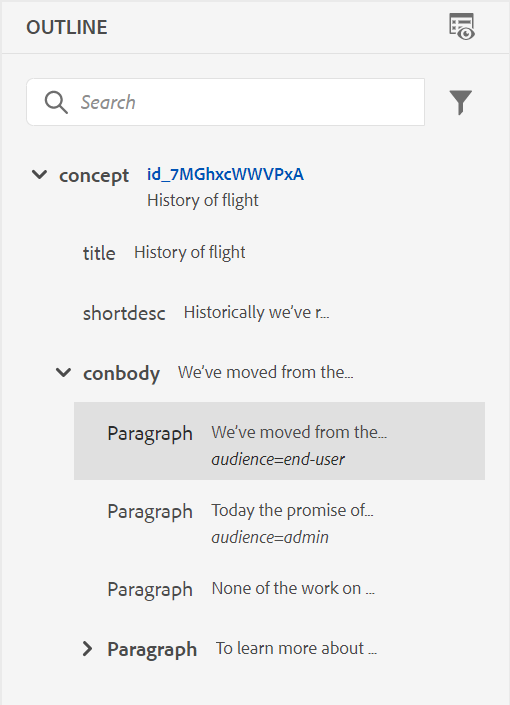{width="300" align="left"}

Die Gliederung bietet die folgenden Funktionen:

- Eine Strukturansicht aller im Dokument verwendeten Elemente.

- Wenn ein Element über eine ID, ein Attribut und Text verfügt, können Sie sie zusammen mit dem Element sehen.

- Greifen Sie sowohl in der Autoren- als auch in der Source-Ansicht auf die Gliederung zu.

- Verwenden Sie die Dropdown-Liste Filter , um alle Elemente oder nur die fehlerhaften Verweise anzuzeigen:

- Wenn Sie in der Gliederung auf ein Element klicken, wird der Elementinhalt in der Autoren- oder Source-Ansicht ausgewählt. Die Gliederungsansicht bleibt mit der Autoren- und Source-Ansicht synchronisiert. Wenn Sie Änderungen in einer Ansicht vornehmen, können Sie diese in der Gliederung anzeigen. Wenn Sie beispielsweise einen Absatz hinzufügen oder ein Element in der Autorenansicht aktualisieren, wird dieser in der Gliederung angezeigt.

  {width="650" align="left"}

- Ziehen Sie Elemente per Drag-and-Drop. Sie können ein Element einfach ersetzen, indem Sie ein anderes Element darauf ablegen. Wenn Sie ein Element per Drag-and-Drop über ein anderes Element ziehen und um das Element ein quadratisches Feld angezeigt wird, deutet dies darauf hin, dass das Element ersetzt wird. Sie ersetzt das Element, auf dem das Element abgelegt wird.

  {width="300" align="left"}

  Wenn Sie ein Element per Drag-and-Drop einfügen, zeigt ein gestricheltes Rechteck an, dass das Element an der aktuellen Position platziert werden kann. Wenn das Drag-and-Drop-Verfahren ungültig ist, wird eine Fehlermeldung angezeigt, die angibt, dass der Vorgang nicht zulässig ist.

  {width="300" align="left"}

- Mit dem Menü **Optionen** in der *Gliederungsansicht* können Sie allgemeine Vorgänge wie Ausschneiden, Kopieren, Löschen, Generieren von ID, Einfügen von Elementen vor oder nach dem aktuellen Element, Umbenennen oder Ersetzen eines Elements, Umbrechen eines Elements, Aufheben der Einbettung eines Elements und Erstellen eines Ausschnitts aus dem ausgewählten Element durchführen.

>[!NOTE]
>
>Weitere Informationen zu &quot;Generate ID&quot;, &quot;Insert element before or after the current element&quot;und &quot;Unwrap an element&quot;finden Sie unter [Weitere Funktionen im Web Editor](web-editor-other-features.md#).

**Anzeigeoptionen für das Bedienfeld &quot;Konturansicht&quot;**

Über das Dropdown-Menü &quot;Anzeigeoptionen&quot;können Sie Folgendes anzeigen, sofern das Element über solche verfügt:

- **ID anzeigen**: Zeigt die ID des Elements an.
- **Attribut anzeigen**: Zeigt das Attribut zusammen mit seinem Wert an.
- **Text anzeigen**: Zeigt den Text an. Wenn der Text länger als 20 Zeichen ist, wird eine Auslassungszeichen angezeigt.

Wenn ein Block-Element einen eigenen Text hat, wird es zusammen mit diesem Block-Element angezeigt. Wenn kein eigener Text vorhanden ist, wird der Text des ersten untergeordneten Elements zusammen mit diesem Block-Element angezeigt.

{width="550" align="left"}

Wenn Ihr Administrator ein Profil für Attribute erstellt hat, erhalten Sie diese Attribute zusammen mit den konfigurierten Werten. Sie können auch von Ihrem Administrator konfigurierte Anzeigenattribute auf der Registerkarte **Anzeigenattribute** in den Editor-Einstellungen zuweisen. Die für ein Element definierten Attribute werden im Layout und in der Gliederungsansicht angezeigt.


Weitere Informationen finden Sie unter *Attribute anzeigen* in der Funktionsbeschreibung *Editor Settings* im Abschnitt [Left Panel](web-editor-features.md#id2051EA0M0HS) .

**Suchfunktion**
Mithilfe der Suchfunktion können Sie nach einem Element anhand seines Namens, seiner ID, seines Textes oder seines Attributwerts suchen.

Bei der Suche wird nicht zwischen Groß- und Kleinschreibung unterschieden und sie stimmt genau mit der Zeichenfolge überein. Die Suchergebnisse werden nach der Position des Elements im Dokument sortiert.

Sie können nach einer Zeichenfolge im Element suchen, wenn sie im Bedienfeld &quot;Konturansicht&quot;angezeigt wird. Wenn beispielsweise die Zeichenfolge &quot;Adobe&quot;im Text des Elements vorhanden und im Bedienfeld &quot;Konturansicht&quot;angezeigt wird (wie Sie **Text anzeigen** aus der Dropdown-Liste &quot;Anzeigeoptionen&quot;ausgewählt haben), wird das übergeordnete Element gefiltert. Wenn der Text jedoch nicht im Bedienfeld &quot;Konturansicht&quot;angezeigt wird (da Sie **Text anzeigen** nicht aus der Dropdown-Liste &quot;Anzeigeoptionen&quot;ausgewählt haben), wird das übergeordnete Element nicht gefiltert. Gleichermaßen finden Sie die Zeichenfolge in der ID oder den Attributen, wenn Sie sie ausgewählt haben.


**Wiederverwendbarer Inhalt** - 

Eine der Hauptfunktionen von DITA ist die Möglichkeit, Inhalte wiederzuverwenden. Im Bedienfeld Wiederverwendbare Inhalte können Sie Ihre DITA-Dateien speichern, aus denen Sie im Allgemeinen wiederverwendbaren Inhalt einfügen. Nach dem Hinzufügen bleiben die DITA-Dateien sitzungsübergreifend im Bereich Wiederverwendbare Inhalte . Das bedeutet, dass Sie Ihre DITA-Dateien nicht erneut hinzufügen müssen, um später darauf zugreifen zu können.

Sie können wiederverwendbaren Inhalt einfach per Drag-and-Drop aus dem Bedienfeld auf das aktuelle Thema ziehen und so einfach und schnell einfügen. Sie können auch eine Vorschau des Inhalts erhalten, bevor Sie ihn in Ihr Dokument einfügen.

Standardmäßig können Sie die Dateien anhand von Titeln anzeigen. Wenn Sie den Mauszeiger über eine Datei bewegen, können Sie den Dateinamen und den Dateipfad als QuickInfo anzeigen.

>[!NOTE]
>
> Als Administrator können Sie auch die Liste der Dateien nach Dateinamen im Web Editor anzeigen. Wählen Sie die Option **Dateiname** im Abschnitt **Dateien nach** in den **Benutzereinstellungen**  aus.

Verwenden Sie eine der folgenden Methoden, um eine DITA-Datei zum Bereich Wiederverwendbare Inhalte hinzuzufügen:

- Klicken Sie auf das Symbol + neben Wiederverwendbare Inhalte , um das Dialogfeld Datei durchsuchen zu öffnen. Wählen Sie die Datei aus, die Sie hinzufügen möchten, und klicken Sie auf **Hinzufügen** , um den Vorgang abzuschließen.

  {width="650" align="left"}

- Klicken Sie in der Repository-Ansicht auf das Symbol Optionen der gewünschten Datei und wählen Sie **Zu wiederverwendbarem Inhalt hinzufügen** aus dem Kontextmenü.

- Klicken Sie mit der rechten Maustaste auf die Registerkarte einer Datei im Editor, um das Kontextmenü zu öffnen und **Zu wiederverwendbarem Inhalt hinzufügen** zu wählen.


Nachdem die Datei hinzugefügt wurde, können Sie alle wiederverwendbaren Inhaltselemente aus der Datei im Bereich Wiederverwendbarer Inhalt sehen. Wiederverwendbare Inhalte werden mit ihren IDs und Elementnamen angezeigt.

Wenn Sie eine Datei zur Liste Wiederverwendbarer Inhalte hinzufügen, wird anstelle der UUID der Datei der Titel der Datei angezeigt. Um die UUID der Datei zu überprüfen, bewegen Sie den Mauszeiger über den Dateinamen und die UUID der Datei wird in der QuickInfo angezeigt.

{width="300" align="left"}

>[!NOTE]
>
> Sie können der Liste der wiederverwendbaren Inhalte mehrere Dateien hinzufügen. Anschließend können Sie den gewünschten Inhalt aus dem Bereich Wiederverwendbare Inhalte in Ihr Dokument einfügen.

**Aktualisieren**: Prüft alle wiederverwendbaren Inhalte erneut und zeigt eine neue Liste wiederverwendbarer Inhalte an.

Verwenden Sie eine der folgenden Methoden, um Inhalte aus dem Bereich Wiederverwendbare Inhalte einzufügen:

- Bewegen Sie den Mauszeiger über ein Element, das Sie einfügen möchten, klicken Sie auf das Symbol &quot;Optionen&quot;und wählen Sie &quot;**Wiederverwendbaren Inhalt einfügen**&quot;.

  {width="400" align="left"}

  >[!NOTE]
  >
  > Wählen Sie eine Datei aus und klicken Sie dann im Menü **Optionen** auf **Vorschau** , um die Datei in der Vorschau anzuzeigen, ohne sie zu öffnen. Sie können auch eine Vorschau der Referenzen in einem Thema anzeigen. Die Referenz-ID wird im Fenster angezeigt.
  >
  > Die Option **Vorschau** ist auch im Menü **Optionen** eines Elements verfügbar, sodass Sie eine schnelle Vorschau des Elements erhalten, bevor Sie es einfügen.

- Ziehen Sie das wiederverwendbare Inhaltselement per Drag-and-Drop aus dem Bedienfeld an die gewünschte Position in Ihrem Dokument.


**Glossar** - 

AEM Guides ermöglicht Ihnen die einfache Erstellung und Verwendung von Glossardokumenten. Sie können Glossar-Themendateien erstellen und sie dann in eine gemeinsame Glossarkarte aufnehmen. Sobald diese Zuordnung als Stammkarte hinzugefügt wurde, werden die Glossareinträge im Glossarbereich angezeigt.

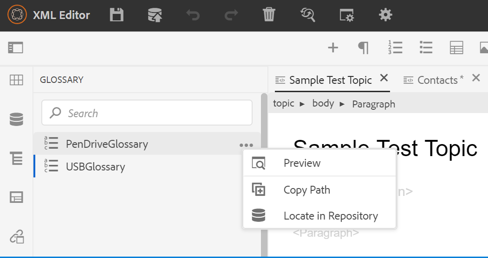{width="650" align="left"}

Um einen Begriff aus dem Glossar einzufügen, ziehen Sie einfach den Eintrag aus dem Bedienfeld an die gewünschte Position in Ihrem Thema. Im Menü Optionen eines Glossarbegriffs können Sie eine schnelle **Vorschau** des Eintragsbegriffs, **Pfad kopieren** der Eintragsbegriffdatei abrufen oder die Eintragsbegriffdatei im Repository suchen.

Führen Sie die folgenden Schritte aus, um Textbegriffe zu suchen und durch Glossar-Abkürzungen zu ersetzen:

1. Öffnen Sie das DITA-Thema oder die Landkarte, in dem Sie den Text oder die Begriffe suchen und konvertieren möchten.
1. Wählen Sie das Glossarbedienfeld aus, um die Glossarbegriffe anzuzeigen, die in der Stammkarte vorhanden sind. Sie können diese Begriffe per Drag &amp; Drop zum offenen Thema hinzufügen.
1. Wählen Sie im Glossarbereich das Tool **Hotspot** \( \) aus, um bestimmte Textbegriffe zu suchen und in verknüpfte Glossarabkürzungen zu konvertieren. Umgekehrt können Sie sie auch verwenden, um Glossar-Abkürzungen zu suchen und sie in Textbegriffe zu konvertieren.

{width="300" align="left"}

Sie können die folgenden Einstellungen des Hotspot-Tools konfigurieren:

{width="300" align="left"}

- **Glossarschlüssel**: Wählen Sie die Glossarschlüssel aus der DITA-Zuordnung aus, die Sie für die Suche im ausgewählten Thema verwenden möchten. Die ausgewählten Schlüssel werden unten angezeigt. Sie können einen ausgewählten Schlüssel entfernen, indem Sie auf das Symbol **Entfernen** klicken.

- **Themen**: Wählen Sie entweder das im Web Editor geöffnete **aktuelle Thema**, alle **geöffneten Themen** in der aktuellen Zuordnung oder die im Map Editor bearbeitete **aktuelle Karte** aus, um die Begriffe zu durchsuchen.
- **Themen nach Status filtern**: Sie können die Suche auf Themen mit dem ausgewählten Dokumentstatus beschränken. Die Themen können sich im Status &quot;Entwurf&quot;, &quot;Bearbeiten&quot;, &quot;In-Review&quot;, &quot;Genehmigt&quot;, &quot;Überprüfen&quot;, &quot;Fertig&quot;oder in einem beliebigen Status befinden, der von der Organisation konfiguriert wurde.
- **Aktion**: Sie können entweder die Glossarschlüssel **Manuell für jedes Thema** oder **Automatisch für alle Themen** durchsuchen. Wenn Sie **Manuell für jedes Thema** auswählen, werden Sie aufgefordert, eine Bestätigung zu erhalten, bevor Sie jeden Begriff in jedes Thema konvertieren. Wenn Sie **Automatisch für alle Themen** auswählen, werden alle Begriffe in allen Themen automatisch konvertiert.
- **Konvertieren**: Sie können einen durchsuchten **Text in einen Glossarbegriff** oder einen **Glossarbegriff in Text konvertieren.**
- **Optionen**: Sie können aus den folgenden Optionen auswählen:
   - **Groß-/Kleinschreibung beachten**: Sucht nach einem Begriff, um die Übereinstimmung zu finden, die dieselbe Groß-/Kleinschreibung aufweist. Beispielsweise entspricht &quot;USB&quot;nicht &quot;usb&quot;.
   - **Nur die erste Instanz konvertieren**: Wenn mehrere Instanzen des gesuchten Begriffs in einem Thema vorhanden sind, wird nur die erste Instanz konvertiert.
   - **Datei vor Konversion auschecken**: Die durchsuchte Datei wird ausgecheckt, bevor die Begriffe konvertiert werden.
   - **Neue Version nach Konversion erstellen**: Eine neue Version des Themas wird erstellt, nachdem die Konvertierung der Begriffe abgeschlossen ist.
- Die Schaltfläche **Weiter** wird angezeigt, wenn Sie für jedes Thema die Option **Manuell** auswählen. Klicken Sie auf **Weiter** , um die Begriffe für jedes Thema auf der Grundlage der ausgewählten Einstellungen zu konvertieren. Es wird zur Konvertierung der Begriffe in den einzelnen Themen aufgefordert und zur nächsten Datei übergegangen. Sie können einen Begriff konvertieren oder überspringen und zum nächsten Begriff wechseln.

  {width="300" align="left"}

- Die Schaltfläche **Konvertieren** wird angezeigt, wenn Sie die Option **Automatisch für alle Themen** auswählen. Wählen Sie **Konvertieren** aus, um alle im Dokument enthaltenen Begriffe in verknüpfte Glossarabkürzungen zu konvertieren.

Eine Liste der **Themen aktualisiert** mit den konvertierten Begriffen und **Themen mit Fehler** wird angezeigt. Bewegen Sie den Mauszeiger über das Symbol \( \) neben Themen mit Fehler , um Details zum Fehler anzuzeigen.

{width="300" align="left"}

>[!NOTE]
>
> Aktualisieren Sie das Thema, um die konvertierten Begriffe anzuzeigen.

**Bedingungen** - 

Im Bedienfeld Bedingungen werden die von Ihrem Administrator im Profil auf globaler Ebene oder auf Ordnerebene definierten bedingten Attribute angezeigt. Sie können Bedingungen zu Ihrem Inhalt hinzufügen, indem Sie einfach die gewünschte Bedingung auf Ihren Inhalt ziehen und dort ablegen. Der bedingte Inhalt wird anhand der für die Bedingung definierten Farbe hervorgehoben, um eine einfache Identifizierung zu ermöglichen.

Sie können auch mehrere Bedingungen auf ein Element anwenden, indem Sie mehrere Bedingungen auf ein Element ziehen und dort ablegen. Wenn Sie mehrere Bedingungen auf ein Element anwenden, werden im Bereich Eigenschaften die angewendeten Bedingungen durch ein Komma getrennt angezeigt.

{width="800" align="left"}

In der Codeansicht werden die Bedingungen jedoch durch ein Leerzeichen getrennt. Wenn Sie eine Bedingung in der Codeansicht hinzufügen oder bearbeiten, stellen Sie sicher, dass mehrere Bedingungen durch ein Leerzeichen getrennt sind.

>[!IMPORTANT]
>
> Der folgende Screenshot zeigt einen Benutzer mit Administratorrechten. Als Benutzer mit Administratorrechten können Sie Bedingungen hinzufügen, bearbeiten und löschen. Als normaler Autor erhalten Sie sonst nur die Option, Bedingungen anzuwenden.

{width="800" align="left"}

Um eine Bedingung hinzuzufügen oder zu definieren, klicken Sie auf das Symbol + neben dem Bereich Bedingungen , um das Dialogfeld Bedingung definieren aufzurufen:

{width="400" align="left"}

Wählen Sie in der Liste Attribut das bedingte Attribut aus, das Sie definieren möchten, geben Sie einen Wert für die Bedingung ein und geben Sie dann die Bezeichnung an, die im Bedienfeld Bedingungen angezeigt werden soll. Definieren Sie eine Gruppe für die Bedingung. Sie können einer Gruppe mehrere Bedingungen hinzufügen. Sie können auch eine Farbe für die Bedingung definieren. Diese Farbe wird als Hintergrundfarbe des Inhalts festgelegt, auf den die Bedingung angewendet wird.

Sie können die Bedingungen gruppieren und in verschachtelten Ordnern strukturieren. Mit Gruppen können Sie Bedingungen auf mehreren Ebenen erstellen und diese besser für die Verwendung im Inhalt organisieren.

Sie können beispielsweise Bedingungsgruppen von Produkten wie *Acrobat* und *AEM Guides* erstellen. Sie können die bedingten Attribute für beide Gruppen auswählen. Unter jeder Gruppe können Sie bestimmte Werte wie *Benutzer*, *Administrator*, *Überprüfer* und *Autor* haben.

>[!NOTE]
>
> Geben Sie entweder ein, um eine neue Gruppe zu erstellen, oder wählen Sie eine bestehende Gruppe für ein bestimmtes Attribut aus.

Sie können `/` verwenden und Untergruppen definieren, um Untergruppen wie `AEM Guides/Cloud Service` zu definieren.


{width="300" align="left"}


Um eine Bedingung zu bearbeiten, wählen Sie **Bearbeiten** aus dem Menü &quot;Optionen&quot;. Das Dialogfeld Bedingung bearbeiten wird angezeigt:

{width="400" align="left"}

Geben Sie die Details auf dieselbe Weise an wie beim Definieren einer neuen Bedingung konfiguriert.

**Betreff-Schema** - 

Themenschemakarten sind eine spezielle Form von DITA-Karten, die zur Definition von taxonomischen Themen und kontrollierten Werten verwendet werden. Je nach Ihren Anforderungen können Sie eine Themenschema-Zuordnung erstellen und in Ihrer Stammzuordnungsdatei darauf verweisen. Mit AEM Guides können Sie die verschachtelte Hierarchie der Betreffdefinitionen in Ihrem Betreffschema definieren.

Sie können das Subjektschema einfach erstellen und dann in einer Subjektschema-Karte verwenden. Sobald diese Karte als Stammkarte hinzugefügt wurde, wird das Subjektschema im Bereich &quot;Subject Scheme&quot;angezeigt. Das Bedienfeld &quot;Themenschema&quot;zeigt das verfügbare Themenschema auf verschachtelte oder hierarchische Weise an.

AEM Guides unterstützt auch verschachtelte Level-Subjektschemas, und Sie können mehrere Subjektschemas unter der Stamm-Subjektschema-Map definieren.

Das folgende Beispiel zeigt die Verwendung des Betreffschemas in AEM Guides.

1. Erstellen Sie eine Betreffschema-Datei in einem Tool Ihrer Wahl. Der folgende XML-Code erstellt ein Subjektschema, das Werte für das Attribut `platform` bindet.

   ```XML
   <?xml version="1.0" encoding="UTF-8"?>
   <!DOCTYPE subjectScheme PUBLIC "-//OASIS//DTD DITA Subject Scheme Map//EN" "subjectScheme.dtd">
   <subjectScheme id="GUID-4f942f63-9a20-4355-999f-eab7c6273270">
       <title>rw</title>
       <!-- Define new OS values that are merged with those in the unixOS scheme -->
       <subjectdef keys="os">
           <subjectdef keys="linux">    </subjectdef>
           <subjectdef keys="mswin">    </subjectdef>
           <subjectdef keys="zos">    </subjectdef>
       </subjectdef>
       <!-- Define application values -->
       <subjectdef keys="app" navtitle="Applications">
           <subjectdef keys="apacheserv">    </subjectdef>
           <subjectdef keys="mysql">    </subjectdef>
       </subjectdef>
       <!-- Define an enumeration of the platform attribute, equal to       each value in the OS subject. This makes the following values       valid for the platform attribute: linux, mswin, zos -->
       <enumerationdef>
           <attributedef name="platform">    </attributedef>
           <subjectdef keyref="os">    </subjectdef>
       </enumerationdef>
       <!-- Define an enumeration of the otherprops attribute, equal to       each value in the application subjects.       This makes the following values valid for the otherprops attribute:       apacheserv, mysql -->
       <enumerationdef>
           <attributedef name="otherprops">    </attributedef>
           <subjectdef keyref="app">    </subjectdef>
       </enumerationdef>
   </subjectScheme>
   ```

   {width="300" align="left"}

1. Speichern Sie die Datei mit der Erweiterung a.ditamap und laden Sie sie in einen beliebigen Ordner in DAM hoch.

   >[!NOTE]
   >
   > Sie können einen Verweis auf die Betreffschema-Datei in der übergeordneten DITA-Zuordnung hinzufügen.

   {width="550" align="left"}

1. Legen Sie die übergeordnete Zuordnung als Stammzuordnung in den **Benutzereinstellungen** fest. Sobald diese Karte als Stammkarte hinzugefügt wurde, wird das Subjektschema im Bereich &quot;Subject Scheme&quot;angezeigt.

   {width="400" align="left"}

1. Öffnen Sie im Web Editor die Datei, in der Sie die Definitionen des Betreffschemas verwenden möchten.
1. Wenden Sie das Betreffschema auf Ihren Inhalt an, indem Sie einfach das gewünschte Betreffschema auf Ihren Inhalt ziehen und dort ablegen. Der Inhalt wird dann in der definierten Farbe hervorgehoben.

   {width="650" align="left"}

**Umgang mit hierarchischen Definitionen von Betreffdefinitionen und Auflistungen**

Neben der Verarbeitung der Auflistungen und der in derselben Zuordnung vorhandenen Betreffdefinitionen bietet AEM Guides auch die Möglichkeit, Auflistungen und Themendefinitionen in zwei separaten Maps zu definieren. Sie können eine oder mehrere Betreffdefinitionen in einer Zuordnung und die Auflistungsdefinitionen in einer anderen Zuordnung definieren und dann die Zuordnungsreferenz hinzufügen. Beispielsweise erstellt der folgende XML-Code in zwei separaten Maps Themendefinitionen und Auflistungsdefinitionen.

Die Themendefinitionen sind in `subject_scheme_map_1.ditamap` definiert.


```XML
  <?xml version="1.0" encoding="UTF-8"?> 
    <!DOCTYPE subjectScheme PUBLIC "-//OASIS//DTD DITA Subject Scheme Map//EN" "../dtd/libs/fmdita/dita_resources/DITA-1.3/dtd/subjectScheme/dtd/subjectScheme.dtd"> 
    <subjectScheme id="subject-scheme.ditamap_f0bfda58-377b-446f-bf49-e31bc87792b3"> 

    <title>subject_scheme_map_1</title> 
    
    <subjectdef keys="os" navtitle="Operating system">
        <subjectdef keys="linux" navtitle="Linux">
        <subjectdef keys="redhat" navtitle="RedHat Linux">
        </subjectdef>
        <subjectdef keys="suse" navtitle="SuSE Linux">
        </subjectdef>
        </subjectdef>
        <subjectdef keys="windows" navtitle="Windows">
        </subjectdef>
        <subjectdef keys="zos" navtitle="z/OS">
        </subjectdef>
        </subjectdef>
        <subjectdef keys="deliveryTargetValues">
        <subjectdef keys="print">
        </subjectdef>
        <subjectdef keys="online">
        </subjectdef>
    </subjectdef>
    <subjectdef keys="mobile" navtitle="Mobile">
        <subjectdef keys="android" navtitle="Android">
        </subjectdef>
        <subjectdef keys="ios" navtitle="iOS">
    </subjectdef>
    </subjectdef>
    <subjectdef keys="cloud" navtitle="Cloud">
        <subjectdef keys="aws" navtitle="Amazon Web Services">
        </subjectdef>
        <subjectdef keys="azure" navtitle="Microsoft Azure">
        </subjectdef>
        <subjectdef keys="gcp" navtitle="Google Cloud Platform">
        </subjectdef>
    </subjectdef>
    </subjectScheme>
```

Die Auflistungsdefinition ist in    subject_schema_map_2.ditamap.

```XML
    ?xml version="1.0" encoding="UTF-8"?> 
        <!DOCTYPE subjectScheme PUBLIC "-//OASIS//DTD DITA Subject Scheme Map//EN" "../dtd/libs/fmdita/dita_resources/DITA-1.3/dtd/subjectScheme/dtd/subjectScheme.dtd"> 
        <subjectScheme id="subject-scheme.ditamap_17c433d9-0558-44d4-826e-3a3373a4c5ae"> 
        <title>subject_scheme_map_2</title> 
        <mapref format="ditamap" href="subject_scheme_map_1.ditamap" type="subjectScheme"> 
        </mapref> 
        <enumerationdef>
        <attributedef name="platform">
        </attributedef>
        <subjectdef keyref="mobile">
        </subjectdef>
        <subjectdef keyref="cloud">
        </subjectdef>
        </enumerationdef>
        </subjectScheme>
```

Hier werden die Definitionen der Betreffs in `subject_scheme_map_1.ditamap` definiert, während die Auflistungsdef in `subject_scheme_map_2.ditamap` vorhanden ist. Der Verweis auf `subject_scheme_map_1.ditamap` wird auch in `subject_scheme_map_2.ditamap` hinzugefügt.

>[!NOTE]
>
> Da die `subject_scheme_map_1.ditamap` und `subject_scheme_map_2.ditamap` miteinander referenziert werden, werden die Betreffschemas aufgelöst.

Die Verweise auf die Betreffauflistung werden in der folgenden Prioritätsreihenfolge aufgelöst:

1. Gleiche Karte
1. Referenzierte Zuordnung


Die Verweise werden nicht aufgelöst, wenn die Auflistung nicht in derselben Zuordnung und der referenzierten Zuordnung gefunden wird.


**Beschränken der Werte auf ein bestimmtes Element**

Sie können die Bedingungen auch auf einige Elemente innerhalb eines Themas beschränken. Verwenden Sie das Tag `<elementdef>` , um das Element und das Tag `<attributedef>` zu definieren, um die Bedingung zu definieren, die auf das Element angewendet werden kann.  Wenn Sie das Tag `<elementdef>` nicht hinzufügen, können Sie die Bedingungen auf alle Elemente anwenden.
Verwenden Sie beispielsweise die folgende Auflistung, um das Attribut `@platform` auf das Element `<shortdesc>` zu beschränken.  Die anderen Bedingungen sind für alle Elemente sichtbar.

```XML
<enumerationdef>
    <elementdef name="shortdesc">
    </elementdef>
    <attributedef name="platform">
    </attributedef>
    <subjectdef keyref="deliveryTargetValues">
    </subjectdef>
    <subjectdef keyref="os">
    </subjectdef>
  </enumerationdef>
```

</details>


Dropdown-Liste **Attribute**

Sie können den Wert des Betreffschemas auch über das Dropdown-Menü **Attribute** im Bereich **Inhaltseigenschaften** in der Ansicht **Autor** ändern.
{width="200" align="left"}
Führen Sie die folgenden Schritte aus, um den Wert zu ändern:

1. Wählen Sie ein Attribut aus dem Dropdown-Menü **Attribut** aus.
1. Wählen Sie **Bearbeiten** .
1. Wählen Sie den erforderlichen Wert aus dem Dropdown-Menü **Wert** aus.
1. Klicken Sie auf **Aktualisieren**.


Sie können auch Werte für ein Attribut anwenden, indem Sie mehrere Werte aus der Dropdown-Liste auswählen.

**Source-Ansicht**

Sie können die Werte auch in der Dropdown-Liste des Attributs in der Source-Ansicht ändern. Die Source-Ansicht verhindert auch, dass Sie einen falschen Wert hinzufügen.

{width="550" align="left"}

**Anzeigen und Anwenden des Betreffschemas im Bedienfeld &quot;Bedingungen&quot;**

Sie können das Themenschema auch im Bedienfeld Bedingungen anzeigen und anwenden.

Um das Betreffschema im Bedienfeld &quot;Bedingungen&quot;anzuzeigen, muss der Systemadministrator die Option &quot;**Betreff-Schema anzeigen&quot;im Bedienfeld &quot;Bedingungen&quot;anzeigen**&quot;auf der Registerkarte &quot;Bedingung&quot;in den Editor-Einstellungen auswählen. Weitere Informationen finden Sie auf der Registerkarte [Bedingung ](#id21BMNE0602V) .

Im Bedienfeld Bedingungen wird die flache vertikale Struktur der Themendefinitionen innerhalb des Betreffschemas angezeigt.

{width="300" align="left"}

Sie können Bedingungen zu Ihrem Inhalt hinzufügen, indem Sie die gewünschte Bedingung auf Ihren Inhalt ziehen und dort ablegen. Der bedingte Inhalt wird in der für die Bedingung definierten Farbe hervorgehoben.

**Snippets** - 

Snippets sind kleine Inhaltsfragmente, die in verschiedenen Themen Ihres Dokumentationsprojekts wiederverwendet werden können. Im Bedienfeld &quot;Snippets&quot;wird eine Sammlung von Inhaltsfragmenten angezeigt, die Sie erstellt haben. Um einen Snippet einzufügen, ziehen Sie den Snippet per Drag-and-Drop aus dem Bedienfeld an die gewünschte Position im Thema. Im Bedienfeld &quot;Snippets&quot;können Sie einen Snippet hinzufügen, bearbeiten, löschen, in der Vorschau anzeigen und einfügen.

>[!IMPORTANT]
>
> Der folgende Screenshot zeigt einen Benutzer mit Administratorrechten. Als Benutzer mit Administratorrechten können Sie Snippets hinzufügen, bearbeiten und löschen. Andernfalls erhalten Sie als normaler Autor nur die Optionen, um ein Snippet in der Vorschau anzuzeigen und einzufügen.

{width="400" align="left"}

Verwenden Sie zum Hinzufügen eines Snippets eine der folgenden Methoden:

- Klicken Sie auf das Symbol + neben Snippets , um das Dialogfeld Neues Snippet zu öffnen.

  {width="550" align="left"}

  Geben Sie im Dialogfeld &quot;Neues Snippet&quot;einen Titel ein, der im Bedienfeld &quot;Snippets&quot;angezeigt wird, eine Beschreibung und den XML-Code des zu erstellenden Snippet-Inhalts. Klicken Sie auf **Erstellen** , um das Snippet zu speichern und zu erstellen.

- Klicken Sie im Inhaltsbearbeitungsbereich mit der rechten Maustaste auf den Breadcrumb des Elements, das Sie als Snippet verwenden möchten, und wählen Sie im Kontextmenü die Option **Snippet erstellen**. Das Dialogfeld &quot;New Snippet&quot;wird mit dem XML-Code des ausgewählten Elements im Feld **Inhalt** angezeigt. Geben Sie den **Titel** und **Beschreibung** für den Ausschnitt ein und klicken Sie auf **Erstellen** , um den Ausschnitt zu speichern.

- Klicken Sie im Inhaltsbearbeitungsbereich mit der rechten Maustaste auf eine beliebige Stelle des Inhalts, den Sie als Ausschnitt verwenden möchten, und wählen Sie im Kontextmenü die Option **Ausschnitt erstellen**. Das Dialogfeld &quot;New Snippet&quot;wird mit dem XML-Code des ausgewählten Elements im Feld **Inhalt** angezeigt. Geben Sie den **Titel** und **Beschreibung** für den Ausschnitt ein und klicken Sie auf **Erstellen** , um den Ausschnitt zu speichern.

  Im folgenden Screenshot werden der Breadcrumb und der Inhaltsbereich hervorgehoben, aus dem Sie das Kontextmenü aufrufen können.

  {width="350" align="left"}


Verwenden Sie zum Einfügen eines Snippets eine der folgenden Methoden:

- Wählen Sie ein Snippet aus dem Bedienfeld &quot;Snippets&quot;aus und ziehen Sie es per Drag-and-Drop an die gewünschte Position im Thema.

- Platzieren Sie die Einfügemarke an der Stelle, an der Sie das Snippet einfügen möchten, und wählen Sie im Menü Optionen des gewünschten Snippets die Option Snippet einfügen aus.


>[!NOTE]
>
> Im Kontextmenü eines Snippet-Eintrags können Sie auch &quot;Bearbeiten&quot;, &quot;Löschen&quot;, &quot;Vorschau abrufen&quot;oder &quot;Snippet einfügen&quot;wählen.

**Vorlagen** - 

Der Bereich &quot;Vorlagen&quot;steht nur Administratoren zur Verfügung. Mithilfe dieses Bedienfelds können Administratoren einfach Vorlagen erstellen und verwalten, die dann von den Autoren verwendet werden können. Standardmäßig werden die Vorlagen unter den Vorlagen vom Typ *Zuordnung* und *Thema* kategorisiert.

{width="550" align="left"}

Standardmäßig können Sie die Dateien anhand von Titeln anzeigen. Wenn Sie den Mauszeiger über eine Vorlage bewegen, können Sie den Dateinamen und den Dateinamen als QuickInfo anzeigen.

>[!NOTE]
>
> Als Administrator können Sie auch die Liste der Dateien im Web Editor anzeigen. Wählen Sie die Option **Dateiname** im Abschnitt **Dateien nach** in den **Benutzereinstellungen**  aus.

Um eine Vorlage zu erstellen, klicken Sie auf das Symbol + neben Vorlagen und wählen Sie eine Vorlage aus, die Sie erstellen möchten. Wenn Sie **Themenvorlage** auswählen, wird das Dialogfeld &quot;Neue Themenvorlage erstellen&quot;angezeigt:

{width="400" align="left"}

Wählen Sie aus der Dropdownliste **Vorlage** den Typ der Vorlage aus, die Sie erstellen möchten. Geben Sie den **Titel** ein, der im Bereich &quot;Vorlagen&quot;angezeigt wird. Der **Name** der Vorlage wird basierend auf dem Titel automatisch vorgeschlagen. Sie können jedoch einen anderen Dateinamen angeben.

>[!NOTE]
>
> Wenn Ihr Administrator automatische Dateinamen basierend auf der UUID-Einstellung aktiviert hat, wird das Feld Name nicht angezeigt.

Nachdem die Vorlage erstellt wurde, müssen Sie sie Ihrem globalen Profil oder Profil auf Ordnerebene hinzufügen. Nachdem die Vorlage hinzugefügt wurde, sehen Ihre Autoren die neue Vorlage im Erstellungsprozess für Themen/Zuordnungen .

Über das Menü &quot;Optionen&quot;einer vorhandenen Vorlage können Sie festlegen, ob die Vorlage **bearbeitet** oder **dupliziert** werden soll. Im Falle einer Duplizierung wird die Struktur und der Typ der Vorlage \(des Dokuments\) beibehalten und Sie können sie erneut verwenden, um daraus eine andere Vorlage zu erstellen.

**Review** - 

AEM Guides bietet die Funktion zum Anzeigen aller Prüfungsaufgaben in Ihren Projekten. Sie können alle Überprüfungsprojekte und die aktiven Prüfungsaufgaben innerhalb der Überprüfungsprojekte anzeigen, die Sie im Bedienfeld **Überprüfen** aufrufen.  Anschließend können Sie die Prüfungsaufgaben öffnen, um die Kommentare der einzelnen Prüfer anzuzeigen.

Im Prüfungsbereich werden die Prüfungsaufgaben angezeigt. Standardmäßig können Sie die Dateien anhand von Titeln anzeigen. Wenn Sie den Mauszeiger über eine Datei bewegen, können Sie den Dateinamen und den Dateipfad als QuickInfo anzeigen.

>[!NOTE]
>
> Als Administrator können Sie auch die Liste der Dateien nach Dateinamen im Web Editor anzeigen. Wählen Sie die Option **Dateiname** im Abschnitt **Dateien nach** in den **Benutzereinstellungen**  aus.

Als Autor können Sie die Kommentare in einem Thema mit dem Web Editor adressieren.


Um die Überprüfungskommentare in den aktiven Prüfungsaufgaben anzuzeigen, die in Ihren Projekten vorhanden sind, führen Sie die folgenden Schritte aus:

1. Überprüfung auswählen    im linken Bereich. Das Bedienfeld **Überprüfen** wird geöffnet.  Alle Überprüfungsprojekte und die aktiven Prüfungsaufgaben innerhalb der Überprüfungsprojekte, zu denen Sie gehören, werden angezeigt.

   {width="300" align="left"}
1. Wählen Sie ein Überprüfungsprojekt aus und wählen Sie dann eine Prüfungsaufgabe aus der Liste aus, um es zu öffnen.
1. Sie können Ihre Projekte auch wie folgt filtern:

   - Geben Sie den Suchbegriff oder Text ein, den Sie im Titel des Projekts finden möchten. Drücken Sie dann die Eingabetaste , um die Suche durchzuführen. Sie können beispielsweise alle Projekte mit dem Begriff &quot;Leerzeichen&quot;im Titel durchsuchen.

   - Wählen Sie  aus, um das Dialogfeld **Filter** zu öffnen. Sie können alle oder nur bestimmte Projekte auswählen. Die ausgewählten Projekte werden im Bedienfeld **Überprüfung** aufgelistet.
     {width="300" align="left"}

     Die Option **Von mir initiierte Aufgaben** ist standardmäßig aktiviert. Damit können Sie nur die Aufgaben anzeigen, die Sie initiiert haben. Der Umschalter-Status dieser Option wird auch nach dem Aktualisieren der Seite beibehalten.

1. Standardmäßig wird in Ihrem Überprüfungsprojekt eine flache Liste von Themen angezeigt, denen Kommentare zugeordnet sind. Wenden Sie die erforderlichen Filter aus der linken Leiste an, um die Themen anhand der darin vorhandenen Überprüfungskommentare zu filtern:

   - **Alle Themen anzeigen**: Führt alle in den Projekten vorhandenen Themen auf.
   - **Themen mit Kommentaren anzeigen**: Zeigt nur die Themen an, die Überprüfungskommentare enthalten.
1. Sie können auch den Suchbegriff oder Text eingeben, den Sie im Titel oder Dateipfad des Themas finden möchten. Die Themen, die den Begriff im Titel oder im Dateipfad enthalten, werden aufgelistet.
1. Doppelklicken Sie auf ein beliebiges Thema, um es in der Autorenansicht zu öffnen. Sie können die Kommentare im Bedienfeld **Kommentare** anzeigen.
   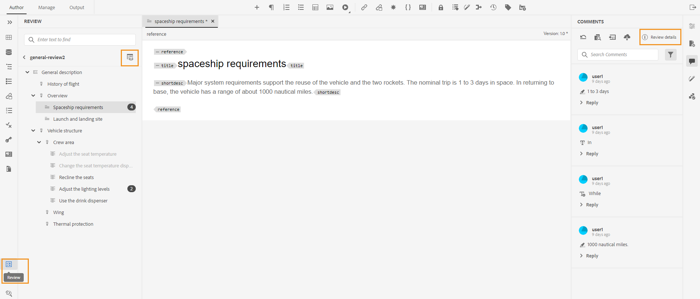{width="800" align="left"}


   >[!NOTE]
   > 
   > Das Bedienfeld **Überprüfen** und das Bedienfeld **Kommentare** sind immer synchronisiert. Im Bereich &quot;Kommentare&quot;werden die Kommentare basierend auf der Überprüfungsaufgabe geladen, die im Überprüfungsbereich geladen wird.
   >
   > Weitere Informationen dazu, wie Sie die Kommentare bearbeiten, finden Sie unter [Kommentare zur Adressenüberprüfung](review-address-review-comments.md#).

**Suchen und Ersetzen** - 

Das Symbol Suchen und Ersetzen befindet sich unten im linken Bereich. Im Bereich Suchen und Ersetzen können Sie nach Text für Dateien in einer Zuordnung oder einem Ordner in Ihrem Repository suchen und diese ersetzen. Sie können in allen Themen einer Landkarte sowie Themen, die in den Unterkarten innerhalb der Landkarte vorhanden sind, suchen und ersetzen.

{width="800" align="left"}

Standardmäßig können Sie die Dateien anhand von Titeln anzeigen. Wenn Sie den Mauszeiger über eine Datei bewegen, können Sie den Dateinamen und den Dateipfad als QuickInfo anzeigen.

>[!NOTE]
>
> Als Administrator können Sie auch die Liste der Dateinamen im Web Editor anzeigen. Wählen Sie die Option **Dateiname** im Abschnitt **Dateien nach** in den **Benutzereinstellungen**  aus.

Führen Sie die folgenden Schritte aus, um die globale Suche durchzuführen und zu ersetzen:

1. Öffnen Sie das globale Bedienfeld **Suchen und Ersetzen** .
1. Klicken Sie auf das Dropdown-Menü **Look into** und wählen Sie eine der folgenden Optionen aus, um die Suche durchzuführen.

   - **Aktuelle Karte**: Um in der aktuell geöffneten Karte zu suchen

     >[!NOTE]
     >
     > Diese Option wird angezeigt, wenn Sie bereits eine Karte zur Bearbeitung geöffnet haben.

   - **Pfad**: Um nach dem ausgewählten Pfad zu suchen
   - **Map auswählen**: Um in der ausgewählten Zuordnung zu suchen

1. Sie können auf das Dropdown-Menü **Optionen** klicken und aus den folgenden Optionen auswählen:

   - **Datei vor Ersetzen auschecken**: Wählen Sie diese Option, wenn Sie eine Datei automatisch auschecken möchten, bevor Sie den Suchbegriff ersetzen. Diese Einstellung ist relevanter, wenn Ihr Administrator die Konfiguration so aktiviert hat, dass vor der Bearbeitung eine Datei ausgecheckt wird. Wenn die Backend-Einstellung aktiviert ist, sollten Sie diese Option auswählen. Dadurch wird verhindert, dass Sie im Dialogfeld zum Auschecken von Dateien aufgefordert werden, jede Datei auszuchecken, bevor Sie Änderungen vornehmen. Wenn Sie diese Option nicht auswählen, wird eine Eingabeaufforderung angezeigt, bevor eine Datei zur Bearbeitung geöffnet wird.
   - **Nur ganzes Wort**: Wählen Sie diese Option aus, wenn Sie nach der gesamten Suchzeichenfolge suchen möchten. Wenn Sie beispielsweise in die Suchzeichenfolge &quot;over&quot;eingeben, gibt das Suchergebnis alle Dateien zurück, die Wörter wie &quot;over&quot;und &quot;overview&quot;enthalten. Wenn Sie die Suche darauf beschränken möchten, den genauen eingegebenen Begriff zurückzugeben, wählen Sie diese Option aus.
   - **Neue Version nach Ersetzen erstellen**: Wählen Sie diese Option aus, wenn Sie eine neue Version des Themas erstellen möchten, in dem Sie den Text ersetzen möchten. Sie können auch Versionskommentare bereitstellen, die mit jeder aktualisierten Datei hinzugefügt werden.

     Wenn Sie diese Option nicht auswählen, werden die Änderungen in der aktuellen Version des Themas gespeichert und es wird keine neue Version erstellt.

   - **Indirekte Referenz einschließen**: Wählen Sie diese Option, wenn Sie die Zeichenfolge in den indirekten Verweisen auch in der DITA-Zuordnung durchsuchen möchten. Standardmäßig ist dies deaktiviert, sodass die Suche nur für direkte Verweise durchgeführt wird.

1. Geben Sie den Suchbegriff oder Text ein, den Sie finden möchten.
1. Geben Sie den Text ein, durch den Sie den Suchbegriff ersetzen möchten.
1. Drücken Sie die Eingabetaste oder wählen Sie das Symbol **Suchen** \( \), um die Suche durchzuführen.
1. Wählen Sie eine Datei aus der Suchergebnisliste aus. Die Datei wird im Inhaltsbearbeitungsbereich geöffnet, wobei der gesuchte Begriff im Inhalt hervorgehoben wird.
1. Öffnen Sie das globale Bedienfeld **Suchen und Ersetzen** .
1. Klicken Sie auf das Dropdown-Menü **Look into** und wählen Sie eine der folgenden Optionen aus, um die Suche durchzuführen.

   - **Aktuelle Karte**: Um in der aktuell geöffneten Karte zu suchen

     >[!NOTE]
     >
     > Diese Option wird angezeigt, wenn Sie bereits eine Karte zur Bearbeitung geöffnet haben.

   - **Pfad**: Um nach dem ausgewählten Pfad zu suchen
   - **Map auswählen**: Um in der ausgewählten Zuordnung zu suchen

1. Sie können auf das Dropdown-Menü **Optionen** klicken und aus den folgenden Optionen auswählen:

   - **Datei vor Ersetzen auschecken**: Wählen Sie diese Option, wenn Sie eine Datei automatisch auschecken möchten, bevor Sie den Suchbegriff ersetzen. Diese Einstellung ist relevanter, wenn Ihr Administrator die Konfiguration so aktiviert hat, dass vor der Bearbeitung eine Datei ausgecheckt wird. Wenn die Backend-Einstellung aktiviert ist, sollten Sie diese Option auswählen. Dadurch wird verhindert, dass Sie im Dialogfeld zum Auschecken von Dateien aufgefordert werden, jede Datei auszuchecken, bevor Sie Änderungen vornehmen. Wenn Sie diese Option nicht auswählen, wird eine Eingabeaufforderung angezeigt, bevor eine Datei zur Bearbeitung geöffnet wird.

   - **Nur ganzes Wort**: Wählen Sie diese Option aus, wenn Sie nach der gesamten Suchzeichenfolge suchen möchten. Wenn Sie beispielsweise in die Suchzeichenfolge &quot;over&quot;eingeben, gibt das Suchergebnis alle Dateien zurück, die Wörter wie &quot;over&quot;und &quot;overview&quot;enthalten. Wenn Sie die Suche darauf beschränken möchten, den genauen eingegebenen Begriff zurückzugeben, wählen Sie diese Option aus.

   - **Neue Version nach Ersetzen erstellen**: Wählen Sie diese Option aus, wenn Sie eine neue Version des Themas erstellen möchten, in dem Sie den Text ersetzen möchten. Sie können auch Versionskommentare bereitstellen, die mit jeder aktualisierten Datei hinzugefügt werden.

     Wenn Sie diese Option nicht auswählen, werden die Änderungen in der aktuellen Version des Themas gespeichert und es wird keine neue Version erstellt.

   - **Indirekte Referenz einschließen**: Wählen Sie diese Option, wenn Sie die Zeichenfolge in den indirekten Verweisen auch in der DITA-Zuordnung durchsuchen möchten. Standardmäßig ist dies deaktiviert, sodass die Suche nur für direkte Verweise durchgeführt wird.

1. Geben Sie den Suchbegriff oder Text ein, den Sie finden möchten.

1. Geben Sie den Text ein, durch den Sie den Suchbegriff ersetzen möchten.

1. Drücken Sie die Eingabetaste oder wählen Sie das Symbol **Suchen** \( \), um die Suche durchzuführen.
1. Wählen Sie eine Datei aus der Suchergebnisliste aus. Die Datei wird im Inhaltsbearbeitungsbereich geöffnet, wobei der gesuchte Begriff im Inhalt hervorgehoben wird.
1. Klicken Sie auf **Einzelnes Vorkommen ersetzen** \( \), um den derzeit hervorgehobenen Suchbegriff im Thema zu ersetzen, oder klicken Sie auf Nächste Übereinstimmung  oder  Vorherige Übereinstimmung , um zum nächsten oder vorherigen Vorkommen des Textes zu wechseln.
1. Klicken Sie auf **Alle in Datei ersetzen** \( \), um alle Vorkommen des gesuchten Begriffs in einer Datei durch den Begriff &quot;Ersetzen&quot;in einem einzigen Klick zu ersetzen. Nachdem Sie alle Vorkommen in der ausgewählten Datei ersetzt haben, wird Ihnen eine Benachrichtigung angezeigt.

   >[!NOTE]
   >
   > Bewegen Sie den Mauszeiger über eine Datei aus der Suchergebnisliste, um das Symbol Alle in Datei ersetzen rechts davon zu sehen. Sie erhalten auch das Symbol Datei ignorieren , um die Datei aus dem Suchergebnis zu entfernen. Die Dateien, die Sie ignorieren, werden aus der Liste entfernt und der gesuchte Begriff wird darin nicht ersetzt.

1. Klicken Sie oben in der Liste rechts auf **Alle ersetzen** \( \), um alle Vorkommen des gesuchten Begriffs in allen Dateien durch den Begriff &quot;Ersetzen&quot;in einem einzigen Klick zu ersetzen.

   >[!NOTE]
   >
   > Um das Symbol **Alle ersetzen** zu aktivieren, muss Ihr Systemadministrator die Option **Alle ersetzen aktivieren** auf der Registerkarte **Allgemein** in den **Editor-Einstellungen** auswählen.


Es kann jeweils nur ein einziges Ersetzen des gesamten Vorgangs im gesamten System durchgeführt werden. Bis zum Ablauf des Zeitraums wird der Status &quot;Ersetzen Sie alle laufenden Prozesse&quot; angezeigt. Sie können auch den Vorgang &quot;Alle ersetzen&quot;zwischen abbrechen oder den Protokollbericht anzeigen. Wenn Sie den Vorgang abbrechen, erhalten Sie in Ihrem Posteingang eine Benachrichtigung darüber. Nach dem Ersetzen aller Vorkommen in der ausgewählten Datei wird Ihnen eine Erfolgsbenachrichtigung angezeigt.

{width="400" align="left"}

Sie können auch die Option **In Zuordnung suchen** aus dem Menü **Optionen** einer Zuordnung verwenden, um Text in einer Zuordnung zu suchen und zu ersetzen. Diese Option wird für eine im Repository-Bereich oder in der Zuordnungsansicht geöffnete Zuordnung angezeigt.

{width="550" align="left"}

## Inhaltsbearbeitungsbereich {#id2051EB000UI}

Im Inhaltsbearbeitungsbereich wird der Inhalt des Themas oder der Zuordnung angezeigt. In diesem Bereich werden alle Inhalte bearbeitet. Er bietet eine WYSIWYG-Ansicht des bearbeiteten Inhalts. Sie können mehrere Themen gleichzeitig öffnen lassen, die auf den jeweiligen Registerkarten angezeigt werden.

Standardmäßig können Sie die Dateinamen in den Registerkarten anzeigen. Wenn Sie den Mauszeiger über eine Datei bewegen, können Sie den Dateinamen und den Dateipfad als QuickInfo anzeigen.

>[!NOTE]
>
> Als Administrator können Sie auch die Liste der Dateien anhand der Dateinamen in den Registerkarten anzeigen. Wählen Sie die Option **Dateiname** im Abschnitt **Dateien nach** in den **Benutzereinstellungen**  aus.

Unter der Registerkarte der Datei befindet sich der Breadcrumb des Elements an der aktuellen Cursorposition. In der oberen rechten Ecke des Inhaltsbearbeitungsbereichs wird die Versionsnummer des aktuellen Themas angezeigt.

{width="650" align="left"}

## Rechtes Bedienfeld {#id2051EB003YK}

Das rechte Bedienfeld ist ein persistentes Bedienfeld, das Informationen zum aktuell ausgewählten Dokument enthält.

>[!NOTE]
>
> Die Größe des rechten Bereichs kann geändert werden. Um die Größe des Bedienfelds zu ändern, bewegen Sie den Cursor auf die Bereichsgrenze, der Cursor ändert sich in einen Doppelpfeil, klicken Sie auf und ziehen Sie, um die Fensterbreite zu ändern.

Im rechten Bereich haben Sie Zugriff auf die folgenden Funktionen:

**Inhaltseigenschaften** - 

Sie können auf die Funktion **Inhaltseigenschaften** zugreifen, indem Sie im rechten Bereich das Symbol **Inhaltseigenschaften** auswählen. Der Bereich **Inhaltseigenschaften** enthält Informationen zum Typ des derzeit ausgewählten Elements im Dokument und dessen Attributen.

**Typ**: Sie können die Tags der vollständigen Hierarchie für das aktuelle Tag aus der Dropdown-Liste anzeigen und auswählen.

**Attribute**: Das Dropdown-Bedienfeld **Attribute** ist in den Ansichten &quot;Layout&quot;, &quot;Autor&quot;und &quot;Source&quot;verfügbar. Sie können Attribute einfach hinzufügen, bearbeiten oder löschen.

1. Klicken Sie auf **+ Hinzufügen**.

   {width="300" align="left"}

1. Wählen Sie im Dropdown-Bedienfeld **Attribut** das Attribut aus der Dropdown-Liste aus und geben Sie den Wert eines Attributs an.  Klicken Sie dann auf **Hinzufügen**.

   {width="300" align="left"}

1. Um das Attribut zu bearbeiten, bewegen Sie den Mauszeiger darüber und wählen Sie **Bearbeiten** .
   {width="300" align="left"}

1. Um das Attribut zu löschen, bewegen Sie den Mauszeiger darüber und wählen Sie **Löschen**  aus.


>[!NOTE]
>
> Selbst wenn Ihr Thema referenzierte Inhalte enthält, können Sie über das Eigenschaftenbedienfeld Attribute hinzufügen.

Wenn Ihr Administrator ein Profil für Attribute erstellt hat, erhalten Sie diese Attribute zusammen mit den konfigurierten Werten. Im Bereich &quot;Inhaltseigenschaften&quot;können Sie diese Attribute auswählen und sie relevanten Inhalten in Ihrem Thema zuweisen. Auf diese Weise können Sie auch bedingte Inhalte erstellen, die dann zur Erstellung einer bedingten Ausgabe verwendet werden können. Weitere Informationen zum Generieren der Ausgabe mithilfe von Bedingungsvorgaben finden Sie unter [Bedingungsvorgaben verwenden](generate-output-use-condition-presets.md#).


**Dateieigenschaften** - 

Zeigen Sie die Eigenschaften der ausgewählten Datei an, indem Sie im rechten Bereich auf das Symbol Dateieigenschaften  klicken. Die Funktion Dateieigenschaften ist in allen vier Modi oder Ansichten verfügbar: Layout, Autor, Source und Vorschau.

Die Dateieigenschaften haben die folgenden beiden Abschnitte:

**Allgemein**

Im Abschnitt Allgemein erhalten Sie Zugriff auf die folgenden Funktionen:

{width="300" align="left"}

- **Name**: Zeigt den Dateinamen des ausgewählten Themas an. Der Dateiname ist mit der Eigenschaftenseite der ausgewählten Datei per Hyperlink verknüpft.
- **ID**: Zeigt die ID des ausgewählten Themas an.
- **Tags**: Dies sind die Metadaten-Tags des Themas. Sie werden über das Feld &quot;Tags&quot;auf der Eigenschaftenseite festgelegt. Sie können sie in der Dropdown-Liste eingeben oder auswählen.  Die Tags werden im Dropdown-Menü angezeigt. Um ein Tag zu löschen, wählen Sie das Kreuzsymbol neben dem Tag aus.
- **Weitere Eigenschaften bearbeiten**: Sie können auf der Seite mit den Dateieigenschaften weitere Eigenschaften bearbeiten.
- **Sprache**: Zeigt die Sprache des Themas an. Sie wird im Sprachfeld auf der Eigenschaftenseite festgelegt.
- **Erstellt am**: Zeigt Datum und Uhrzeit der Erstellung des Themas an.
- **Ausgecheckt von**: Zeigt den Benutzer an, der das Thema ausgecheckt hat.
- **Dokumentstatus**: Sie können den Dokumentstatus des aktuell geöffneten Themas auswählen und aktualisieren. Weitere Informationen finden Sie unter [Dokumentstatus ](web-editor-document-states.md#)*.*

**Hinweis:** Sie können die Attributwerte der verschiedenen Felder in den Dateieigenschaften in die Zwischenablage kopieren.

**Verweise**

Im Abschnitt Verweise haben Sie Zugriff auf folgende Funktionen:

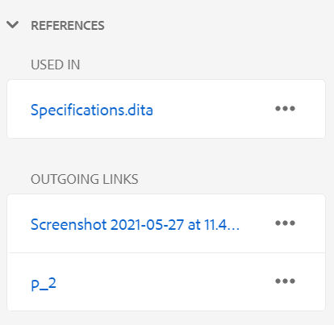{width="300" align="left"}

- **Verwendet in**: Die in-Referenz-Liste listet die Dokumente auf, auf die die aktuelle Datei verwiesen oder verwendet wird.
- **Ausgehende Links:** Die ausgehenden Links listen die Dokumente auf, auf die im aktuellen Dokument verwiesen wird.

Standardmäßig können Sie die Dateien anhand von Titeln anzeigen. Wenn Sie den Mauszeiger über eine Datei bewegen, können Sie den Dateinamen und den Dateipfad als QuickInfo anzeigen.

>[!NOTE]
>
> Als Administrator können Sie auch die Liste der Dateien nach Dateinamen im Web Editor anzeigen. Wählen Sie die Option **Dateiname** im Abschnitt **Dateien nach** in den **Benutzereinstellungen**  aus.

**Hinweis:** Alle in- und ausgehenden Verweise werden mit den Dokumenten per Hyperlink verknüpft. Sie können die verknüpften Dokumente einfach öffnen und bearbeiten.

Neben dem Öffnen von Dateien können Sie auch viele Aktionen über das Menü **Optionen** im Abschnitt &quot;Verweise&quot;ausführen. Zu den Aktionen, die Sie ausführen können, gehören Bearbeiten, Vorschau, UUID kopieren, Pfad kopieren, Zu Favoriten hinzufügen, Eigenschaften und Dashboard Karte öffnen .

**Review** - 

Wenn Sie auf das Symbol Überprüfen klicken, wird der Überprüfungsbereich geöffnet, in dem Sie eine Prüfungsaufgabe für das derzeit geöffnete Dokument erstellen können.

{width="300" align="left"}

Wenn Sie mehrere Überprüfungsprojekte erstellt haben, können Sie eines aus der Dropdown-Liste auswählen und auf die Überprüfungskommentare zugreifen.

Über das Überprüfungsbedienfeld können Sie Antworten auf die zum Thema gegebenen Kommentare anzeigen und posten. Sie können die Kommentare einzeln akzeptieren oder ablehnen.

Weitere Informationen finden Sie unter [Kommentare zur Adressenüberprüfung](review-address-review-comments.md#).

**Getrackte Änderungen** - 

Mithilfe der Funktion &quot;Getrackte Änderungen&quot;im rechten Bereich können Sie die Informationen zu allen in einem Dokument vorgenommenen Aktualisierungen anzeigen. Sie können auch nach bestimmten Aktualisierungen suchen, die am Dokument vorgenommen wurden.

>[!NOTE]
>
> Die Funktion &quot;Getrackte Änderungen&quot;zeigt alle Aktualisierungen an, die mithilfe der Funktion Tracking-Änderungen aktivieren/deaktivieren in der Hauptsymbolleiste verfolgt wurden. Weitere Informationen finden Sie unter [Tracking-Änderungen aktivieren/deaktivieren](#id205DF0203Y4).

**Übergeordnetes Thema:**[ Arbeiten mit dem Web-Editor](web-editor.md)
