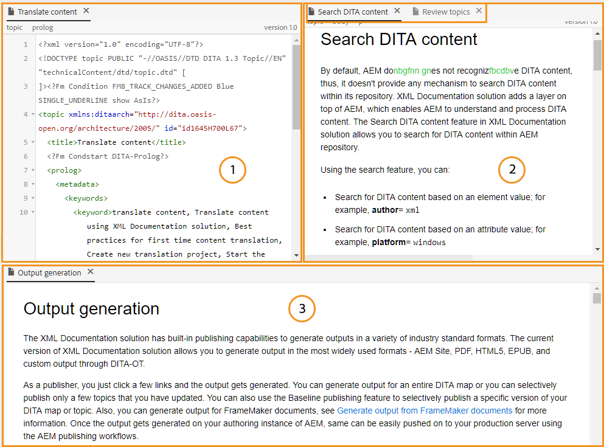
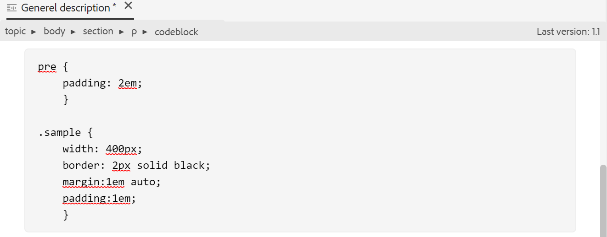

# Weitere Funktionen im Web Editor {#id2056B0B0YPF}

Es gibt einige weitere nützliche Funktionen im Web Editor, die Sie nutzen können:

**Kontextmenüfunktionen auf der Registerkarte einer Datei**

Wenn Sie eine Datei im Web Editor öffnen, können Sie im Kontextmenü verschiedene Aktionen ausführen. Je nachdem, ob Sie eine Mediendatei, eine einzelne DITA-Datei oder mehrere Dateien öffnen, werden Ihnen möglicherweise unterschiedliche Optionen angezeigt.

**Mediendatei**

Sie erhalten die folgenden Funktionen im Kontextmenü der Registerkarte einer geöffneten Mediendatei:

{width="300" align="left"}

**Einzelne DITA-Datei**

Sie erhalten die folgenden Funktionen im Kontextmenü der Registerkarte einer geöffneten Datei:

:   {width="300" align="left"}

**Mehrere Dateien**

Wenn Sie mehrere Dateien geöffnet haben, erhalten Sie weitere Optionen im Kontextmenü:

{width="550" align="left"}

Die verschiedenen Optionen im Kontextmenü werden nachfolgend beschrieben:

***Speichern***: Sie können aus den folgenden Optionen auswählen:

- **Speichern**: Um eine Datei zu speichern, ohne eine neue Version zu erstellen, wählen Sie **Speichern** aus. Wenn Sie ein neues Thema erstellen, wird in DAM eine versionslose Arbeitskopie des Themas erstellt. Durch das Speichern Ihres Dokuments wird die Arbeitskopie Ihres Dokuments in DAM aktualisiert. Durch einfaches Speichern in dieser Version wird keine neue Version eines Themas erstellt. Wenn Ihr Thema geprüft wird, erhalten Ihre Prüfer beim Speichern eines Themas keinen Zugriff auf den geänderten Themeninhalt.

- **Alle speichern**: Wenn im Web Editor mehrere Dokumente geöffnet sind, erhalten Sie auch die Option &quot;**Alle speichern**&quot;, die geöffnet sind.

***Als neue Version speichern***

Um eine neue Version der Datei zu erstellen, wählen Sie **Als neue Version speichern** aus. Weitere Informationen zu **Save** und **Save As New Version** finden Sie unter [Know the Web Editor features](web-editor-features.md#).

***Kopieren***: Sie können aus den folgenden Optionen auswählen:

- **UUID kopieren**: Um die UUID der derzeit aktiven Datei in die Zwischenablage zu kopieren, wählen Sie **Kopieren \> UUID kopieren**.
- **Pfad kopieren**: Um den vollständigen Pfad der derzeit aktiven Datei in die Zwischenablage zu kopieren, wählen Sie **Kopieren \> Pfad kopieren** aus.

***Suchen in***: Sie können aus den folgenden Optionen auswählen:

- **Zuordnung**: Wenn Sie eine große DITA-Zuordnung geöffnet haben und den genauen Speicherort einer Datei in der Zuordnung suchen möchten, wählen Sie **Suchen in \> Karte**. Wenn Sie die Option In Zuordnung lokalisieren auswählen, wird die Datei \(von der aus die Option aufgerufen wird\) in der Zuordnungshierarchie angezeigt und hervorgehoben. Um diese Funktion verwenden zu können, müssen Sie die Zuordnungsdatei im Web-Editor öffnen. Wenn die Kartenansicht ausgeblendet ist, wird beim Aufrufen dieser Funktion die Kartenansicht angezeigt und die Datei in der Zuordnungshierarchie hervorgehoben.

- **Repository**: Ähnlich wie &quot;In Map suchen&quot;, zeigt der Eintrag &quot;**In &quot;\> &quot;Repository&quot;** den Speicherort der Datei im Repository &quot;\&quot;(oder &quot;DAM\&quot;). Die Repository-Ansicht wird geöffnet und die ausgewählte Datei wird im Repository hervorgehoben. Wenn sich die Datei in einem Ordner befindet, wird dieser Ordner erweitert, um den Speicherort der ausgewählten Datei im Repository anzuzeigen.

***Hinzufügen zu***: Sie können aus den folgenden Optionen auswählen:

- **Favoriten**: Um die ausgewählte Datei zur Lieblingssammlung hinzuzufügen, wählen Sie **Zu \> Favoriten hinzufügen**. Weitere Informationen finden Sie in der Beschreibung der Funktion **Favoriten** im Abschnitt [Linkes Bedienfeld](web-editor-features.md#id2051EA0M0HS) .

- **Wiederverwendbare Inhalte**: Um die ausgewählte Datei in die Liste der wiederverwendbaren Inhalte zu kopieren, wählen Sie **Hinzufügen zu \> Wiederverwendbare Inhalte**. Weitere Informationen finden Sie in der Beschreibung der Funktion **Wiederverwendbare Inhalte** im Abschnitt [Linkes Bedienfeld](web-editor-features.md#id2051EA0M0HS) .

***Eigenschaften***

Um die AEM der ausgewählten Datei anzuzeigen, wählen Sie **Eigenschaften** aus.

***Aufspaltung***: Sie können aus den folgenden Optionen auswählen:

**Nach oben, Nach unten, Nach links oder Nach rechts**

Standardmäßig können Sie mit dem Web Editor jeweils ein Thema anzeigen. Es kann Fälle geben, in denen Sie zwei oder mehr Themen gleichzeitig sehen möchten. Durch die Aufteilung des Bildschirms des Editors können Sie mehrere Themen gleichzeitig anzeigen. Wenn Sie beispielsweise zwei Themen haben: A und B werden im Editor geöffnet. Wenn Sie mit der rechten Maustaste auf Thema B klicken und **Aufspaltung \> Nach oben** wählen, wird das Editor-Fenster in zwei Teile unterteilt. Thema B wird in der oberen Hälfte und Thema A in der unteren Hälfte angezeigt. Auf ähnliche Weise können Sie den Bildschirm auch horizontal aufteilen, indem Sie **Aufspaltung \> Links** oder **Aufspaltung \> Rechts** auswählen. Im folgenden Screenshot des Web-Editors werden Themen angezeigt, die horizontal und vertikal geteilt sind. In jeder Aufspaltung können Sie eine andere Ansicht haben. Im folgenden Screenshot befindet sich beispielsweise der Bildschirm 1 im Anzeigemodus Source, der Bildschirm 2 im Autorenmodus und der Bildschirm 3 im Vorschaumodus. Sie können Ihre Dokumente von einem Bildschirm auf den anderen verschieben, indem Sie die Registerkarte &quot;Datei&quot;ziehen und dort ablegen, wo Sie sie platzieren möchten. Auf ähnliche Weise können Sie auch die Dateiregisterkarten neu anordnen, indem Sie sie per Drag-and-drop verschieben.

{width="800" align="left"}

***Quick Generate***

Generieren Sie die Ausgabe für die ausgewählte Datei. Die Ausgabe kann nur für Dateien generiert werden, die Teil einer Ausgabevorgabe sind. Weitere Informationen finden Sie unter [Artikelbasierte Veröffentlichung im Web-Editor](web-editor-article-publishing.md#id218CK0U019I).

***Schließen***: Sie können aus den folgenden Optionen auswählen:

**Close**, **Close Other** oder **Close All**

Wenn Sie die Datei schließen möchten, von der Sie das Kontextmenü aufgerufen haben, wählen Sie **Schließen \> Schließen** aus. Verwenden Sie **Schließen \> Andere schließen** , um alle anderen geöffneten Dateien mit Ausnahme der derzeit aktiven Datei zu schließen. Um alle geöffneten Dateien zu schließen, wählen Sie im Kontextmenü die Option **Schließen \> Alle schließen** oder Sie können auch den Web Editor schließen. Wenn Ihre Sitzung nicht gespeicherte Dateien enthält, werden Sie aufgefordert, diese Dateien zu speichern.

**Szenarien zum Schließen und Speichern von Dateien**

Wenn Sie versuchen, eine im Web Editor geöffnete Datei mithilfe der Schaltfläche **Schließen** auf der Registerkarte der Datei oder der Option **Schließen** im Menü &quot;Optionen&quot;zu schließen, werden Sie von AEM Guides aufgefordert, Ihre Änderungen zu speichern und eine gesperrte Datei zu entsperren.

Die Eingabeaufforderungen basieren auf den folgenden Konfigurationen, die von Ihrem Administrator ausgewählt wurden:

- **Beim Schließen zum Einchecken auffordern:** Sie haben die Möglichkeit, die Datei einzuchecken \(die Sie ausgecheckt haben\), wenn Sie den Editor schließen.
- **Beim Schließen nach einer neuen Version fragen**: Sie haben die Möglichkeit, die Datei \(die Sie bearbeitet haben\) als neue Version zu speichern, wenn Sie den Editor schließen.

Ihr Dateispeichererlebnis hängt von den folgenden drei Szenarien ab, in denen Sie:

- Es wurden keine Änderungen am Inhalt vorgenommen.
- Der Inhalt wurde bearbeitet und die Änderungen wurden gespeichert.
- Der Inhalt wurde bearbeitet, die Änderungen wurden jedoch nicht gespeichert.

Je nachdem, ob die Datei gesperrt/entsperrt ist und gespeicherte oder nicht gespeicherte Änderungen aufweist, werden Ihnen möglicherweise die folgenden Optionen angezeigt:

- **Entsperren und Schließen**: Das Sperrsymbol für die Datei wird entfernt und die Datei wird geschlossen.

  {width="400" align="left"}

- **Als neue Version speichern**: Dadurch werden die Änderungen gespeichert, die Sie in Ihrem Inhalt vorgenommen haben, und eine neue Version Ihrer Datei erstellt. Sie können auch Beschriftungen und Kommentare für die neu gespeicherte Version hinzufügen. Weitere Informationen zum Speichern einer neuen Version finden Sie unter [Als neue Version speichern](web-editor-features.md#save-as-new-version-id209ME400GXA).

- **Datei entsperren**: Wenn Sie eine Datei entsperren, wird die Sperre in Ihrer Datei aufgehoben und die Änderungen werden in der aktuellen Version der Datei gespeichert.

  >[!NOTE]
  >
  > Wenn Sie die Option zum Entsperren der Datei deaktivieren, erhalten Sie auch eine Option, die Datei zu schließen, ohne die Änderungen zu speichern.

  Beispielsweise wird eine der Eingabeaufforderungen im folgenden Screenshot angezeigt:

  {width="400" align="left"}

**Visuelle Hinweise für fehlerhafte Verweise**

- Wenn Ihr Thema fehlerhafte Querverweise oder Inhaltsverweise enthält, werden diese in rotem Text angezeigt.

**Smart copy-paste**

- Sie können mühelos Inhalte in und über Themen hinweg kopieren. Die Quellelementstruktur wird am Ziel beibehalten. Wenn der kopierte Inhalt auch Inhaltsverweise enthält, werden auch diese kopiert.

**Letzten durchsuchten Ort speichern**

- Der Web Editor bietet ein Dialogfeld zum Durchsuchen intelligenter Dateien. Der Editor speichert beim Einfügen eines Verweises oder Inhalts den zuletzt verwendeten Speicherort. Wenn Sie das Dialogfeld zum Durchsuchen der Datei zum ersten Mal aufrufen (über &quot;Einfügereferenz&quot;oder &quot;Wiederverwendungsinhalt einfügen&quot;), gelangen Sie zum Speicherort des aktuellen Dokuments. Wenn Sie in derselben Sitzung versuchen, eine andere Referenz einzufügen, navigiert das Dialogfeld zum Durchsuchen der Datei automatisch zu dem Speicherort, von dem Sie die letzte Referenz eingefügt haben.

>[!NOTE]
>
> Bei Bild-, Audio- oder Videodateien wird im Dialogfeld zum Durchsuchen der Datei standardmäßig der Speicherort der Datei und nicht der zuletzt verwendete Speicherort angegeben.

**Unterstützung für artikelbasierte Veröffentlichung**

- Im Web Editor können Sie die Ausgabe für ein oder mehrere Themen oder die gesamte DITA-Map generieren. Sie müssen Ausgabevorgaben für Ihre DITA-Zuordnung erstellen und dann die Ausgabe für ein oder mehrere Themen einfach generieren. Wenn Sie einige Themen in Ihrer Zuordnung aktualisiert haben, können Sie auch die Ausgabe nur für diese Themen aus dem Web Editor generieren. Weitere Informationen finden Sie unter [Artikelbasierte Veröffentlichung im Web-Editor](web-editor-article-publishing.md#id218CK0U019I).

**Unterstützung für Markdown-Dokumente**

- Mit dem Web Editor können Sie Markdown-Dokumente \(.md\) zusammen mit Ihren DITA-Dokumenten verwenden. Sie können ein Markdown-Dokument einfach im Web-Editor erstellen und in der Vorschau anzeigen und es auch über den DITA-Map-Editor in Ihre Map-Datei einfügen. Weitere Informationen finden Sie unter [Author Markdown documents from the Web Editor](web-editor-markdown-topic.md#).

**Unterstützung für DITA-Glossarbegriff-Thema**

- Der Web Editor unterstützt DITA-Glossarbegriffe, die Sie einfügen können, indem Sie `term` - oder `abbreviated-form` -Elemente hinzufügen.

**MathML-Gleichungen einfügen**

- Experience Manager Guides bietet Ihnen eine vordefinierte Unterstützung für das Einfügen von MathML-Gleichungen durch Integration in die Anwendung [MathType Web](https://docs.wiris.com/en/mathtype/mathtype_web/intro) . Um eine MathML-Gleichung einzufügen, wählen Sie das Symbol **Element einfügen** aus und geben Sie mathml ein. Wenn Sie mathml-Element aus der Liste auswählen, wird das Dialogfeld **MathML einfügen** angezeigt:

{width="550" align="left"}

Erstellen Sie mit den MathML-Gleichungs-Tools Ihre Gleichung und klicken Sie auf **Einfügen** , um sie Ihrem Dokument hinzuzufügen. Die Gleichung wird mit hellgrauem Hintergrund eingefügt, wie unten dargestellt:

{width="400" align="left"}

Sie können eine Gleichung jederzeit aktualisieren, indem Sie mit der rechten Maustaste auf eine vorhandene Gleichung klicken und im Kontextmenü die Option **MathML bearbeiten** auswählen.

- **Validierung von Gleichungen im MathML-Editor**

  Experience Manager Guides validiert MathML-Gleichungen, wenn Sie ein Thema mit ihnen speichern.
Wenn Sie eine Gleichung mit dem MathML-Editor einfügen, markiert Experience Manager Guides die Gleichung rot, wenn Syntaxprobleme auftreten. Sie können sie vor dem Einfügen korrigieren. Wenn Sie keine Änderungen vornehmen, außer **Einfügen**, wird eine Warnung angezeigt.

  {width="400" align="left"}

  Wenn Sie die MathML-Gleichung einfügen, die einen Syntaxfehler enthält, tritt beim Versuch, das Thema zu speichern, ein Überprüfungsfehler auf.

**Fußnoten einfügen**

- Fügen Sie mithilfe des Elements `fn` Fußnoten in Ihren Inhalt ein. Im Authoring-Modus wird der Wert der Fußnote inline mit dem Inhalt angezeigt. Wenn Sie jedoch den Vorschaumodus wechseln oder Ihr Dokument veröffentlichen, wird die Fußnote am Ende des Themas angezeigt.

**Umbenennen oder Ersetzen eines Elements**

- Der Web Editor zeigt den Breadcrumb des Elements oben im Thema an. Wenn Sie ein Element durch ein anderes ersetzen oder tauschen möchten, können Sie dies im Kontextmenü des Breadcrumbs tun. Sie können beispielsweise das Element `p` mit `note` oder einem beliebigen anderen gültigen Element im Kontext tauschen.

{width="400" align="left"}

Klicken Sie im Breadcrumb mit der rechten Maustaste auf den Namen eines Elements, das Sie ersetzen möchten, und wählen Sie dann im Kontextmenü die Option Element umbenennen . Im Dialogfeld Element umbenennen werden alle gültigen Elemente angezeigt, die am aktuellen Speicherort zulässig sind. Wählen Sie im Dialogfeld Element umbenennen das Element aus, das Sie verwenden möchten. Das ursprüngliche Element wird durch das neue Element ersetzt.

Zusätzlich zum Kontextmenü der Breadcrumb-Leiste kann auf das Dialogfeld Element umbenennen auch von anderen Speicherorten aus zugegriffen werden:

- Klicken Sie auf den Elementnamen im Breadcrumb, um den Inhalt des Elements auszuwählen, und klicken Sie mit der rechten Maustaste auf den ausgewählten Inhalt, um das Kontextmenü aufzurufen.

- Aktivieren Sie die Ansicht Tags , klicken Sie auf das öffnende -Tag eines Elements und klicken Sie dann mit der rechten Maustaste auf den ausgewählten Inhalt, um das Kontextmenü aufzurufen.

- Sie können auf das Dialogfeld Element umbenennen zugreifen, indem Sie im Bedienfeld &quot;Umrisse&quot;das Menü &quot;Optionen&quot;eines Elements aufrufen.

**Element einschließen**

- Wenn Sie ein Element umbrechen, können Sie dem ausgewählten Text ein Element-Tag hinzufügen. Sie können den Text nach DITA-Standards in jedes untergeordnete Element einschließen. Wenn Sie beispielsweise Text unter einem Element `note` haben, können Sie den Text in ein Element `p` einschließen.

  Die Option **Element umbrechen** ist im Kontextmenü des Breadcrumbs des Themas verfügbar. Um ein Element einzuschließen, klicken Sie mit der rechten Maustaste auf das Element und öffnen Sie das Kontextmenü. Wählen Sie das Element im Dialogfeld **Element umschließen** aus. Der Text wird im neuen Element angezeigt.

  Sie können auch den Text oder das Element im Inhalt auswählen und dann im Kontextmenü die Option **Element umbrechen** auswählen.

**Aufheben der Einbindung eines Elements**

- Durch das Entpacken eines Elements können Sie das Element-Tag aus dem ausgewählten Text entfernen und mit dem übergeordneten Element zusammenführen. Wenn Sie beispielsweise ein Element `p` in einem Element `note` haben, können Sie das Element `p` entpacken, um den Text direkt im Element `note` zusammenzuführen. Die Option **Element entpacken** ist im Kontextmenü des Breadcrumbs des Themas verfügbar. Um die Einbindung eines Elements aufzuheben, klicken Sie mit der rechten Maustaste auf das Element, um das Kontextmenü zu öffnen, und wählen Sie dann **Element entpacken** aus, um das Element zu entfernen und den Text des Elements mit dem übergeordneten Element zusammenzuführen.

**Umgang mit Leerzeichen für DITA-Elemente**

- In XML umfassen Leerzeichen Leerzeichen, Registerkarten, Zeilenumbrüche und leere Zeilen. Experience Manager Guides konvertiert mehrere aufeinander folgende Leerzeichen in einen Raum. Auf diese Weise können Sie die WYSIWYG-Ansicht des Web Editors beibehalten.

  >[!NOTE]
  >
  >In einigen Elementen, in denen gemäß den DITA-Regeln Leerzeichen beibehalten werden müssen, werden die verschiedenen nachfolgenden Leerzeichen beibehalten. Beispielsweise die Elemente `<pre>` und `<codeblock>`.

**Beibehalten von Zeilenumbrüchen und Einzügen**

- DITA-Elemente, die Zeilenumbrüche und Leerzeichen enthalten, werden gemäß ihrer Definition im Autoren-, Source- oder Vorschaumodus sowie in der endgültigen veröffentlichten Ausgabe unterstützt und gerendert. Der folgende Screenshot zeigt den Inhalt im Element `msgblock` , wobei die Zeilenumbrüche und Leerzeichen \(Einzug\) beibehalten wurden:

{width="500" align="left"}

**Umgang mit geschützten Leerzeichen im Web Editor**

- Sie können unverschlüsselte Leerzeichen in Ihr Dokument einfügen, indem Sie das Symbol **Sonderzeichen einfügen**  oder die Tastenkombination **Alt** + **Leerzeichen** verwenden.  Diese geschützten Leerzeichen werden beim Bearbeiten eines Themas im Web-Editor als Indikator angezeigt. Sie können die Anzeige der geschützten Leerzeichen mit der Option &quot;**Vorgeschriebenen Leerzeichen im Autorenmodus anzeigen**&quot;auf der Registerkarte **Erscheinungsbild** der Registerkarte **Benutzereinstellungen**  deaktivieren.

- Wenn Sie Inhalte mit einem geschützten Leerzeichen aus externen Quellen kopieren und in die Ansicht **Autor** einfügen, wird das nicht brechende Leerzeichen in ein Leerzeichen umgewandelt.
Wenn Sie jedoch Inhalt mit einem geschützten Leerzeichen aus der **Autorenansicht** kopieren und einfügen, bleibt er erhalten.

**Element-ID automatisch generieren**

- Sie können automatisch IDs für die Elemente in Ihrem DITA-Thema generieren. Diese IDs sind innerhalb eines DITA-Themas eindeutig. Wenn Sie beispielsweise IDs für ein Absatzelement generieren, lauten die IDs p\_1, p2, p\_3 usw. Sie können mehrere Elemente auswählen und IDs für jedes ausgewählte Element generieren.

Führen Sie die folgenden Schritte aus, um automatisch eine ID für ein oder mehrere Elemente zu generieren:

1. Öffnen Sie das Thema im Web-Editor.
1. Wählen Sie den Inhalt aus, dem Sie IDs zuweisen möchten.
1. Klicken Sie mit der rechten Maustaste und wählen Sie **IDs generieren aus dem Kontextmenü.**

   Alternativ können Sie mit der rechten Maustaste auf den Breadcrumb klicken und **IDs generieren** auswählen.

**Übergeordnetes Thema:**[ Arbeiten mit dem Web-Editor](web-editor.md)
