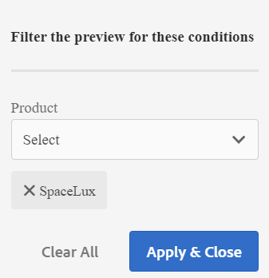
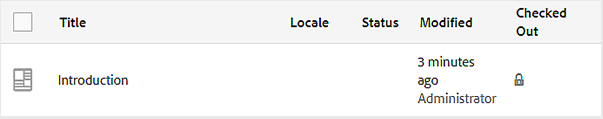

# Vorschau eines Themas {#id1696II000QR}

Nachdem ein Thema erstellt wurde, generiert AEM Guides eine Vorschau des Themas. Der Vorschaumodus bietet verschiedene Funktionen, mit denen Sie mit Ihrem Dokument arbeiten können.

Führen Sie die folgenden Schritte aus, um eine Vorschau eines Themas anzuzeigen:

1. Navigieren Sie in der Assets-Benutzeroberfläche zu dem Thema, das Sie anzeigen möchten.
1. Klicken Sie auf das Thema, das Sie anzeigen möchten.

   Eine Vorschau des Themas wird in der Benutzeroberfläche von Assets angezeigt.

   >[!NOTE]
   >
   > Die Version des aktiven Themas oder der DITA-Zuordnung wird oben rechts auf der Registerkarte Datei des Themas angezeigt.

   >[!IMPORTANT]
   >
   > Die Positionierung der folgenden Funktionen in der Vorschau-Symbolleiste kann je nach Einrichtung Ihres AEM-Servers unterschiedlich sein. Einige der Funktionen sind möglicherweise in der Hauptsymbolleiste verfügbar, während andere möglicherweise im Menü Mehr verfügbar sind.

## Im Vorschaumodus verfügbare Funktionen

{width="800" align="left"}

Im Vorschaumodus können Sie in der Symbolleiste die folgenden Vorgänge ausführen:

**Eigenschaften**

Zeigt die Eigenschaften des ausgewählten Themas an. Abhängig von Ihrer AEM-Version können Sie Eigenschaften wie Metadaten, Zeitplan \(de\)aktivierung, Verweise, Dokumentstatus und mehr sehen.

>[!NOTE]
>
> Die title-Eigenschaft eines Themas wird automatisch aus dem `title`-Tag des DITA-Themas oder der DITA-Zuordnung ausgefüllt. Wenn Sie den Titel mithilfe des Eigenschaftenfensters ändern, geht diese Änderung verloren. Wenn Sie die title-Eigenschaft aktualisieren möchten, sollten Sie dies mit dem Web-Editor tun.

Die Eigenschaftenseite enthält nützliche Informationen zu den Verweisen, z. B. wo eine Zuordnung oder ein Thema verwendet wird oder welche Verweise in einem Dokument enthalten sind. Auf der Seite „Eigenschaften“ werden zwei Arten von Verweisen für ein Dokument aufgelistet: **Verwendet in** und **Ausgehende Verweise**.

Der **Verwendet in** verweist auf die Dokumente, auf die die aktuelle Datei verwiesen oder verwendet wird. Die **Ausgehende Verweise** listet die Dokumente auf, auf die im aktuellen Dokument verwiesen wird.

Mit dem Symbol \(+\) im Abschnitt **Verwendet in** Referenzen können Sie weiter nach oben navigieren, um zu ermitteln, wo dieses Thema verwendet oder referenziert wird.

{width="800" align="left"}

Durch Klicken auf Symbol neben einem Dokument werden die Zuordnungs- oder Themendateien angezeigt, in denen dieses Dokument weiter referenziert wird.

**Bedingte Filterung \(a/b\)**

Wenn Ihr Thema bedingte Inhalte hat, wird in der Symbolleiste das A/B-Symbol angezeigt. Durch Klicken auf dieses Symbol wird ein Popup geöffnet, in dem Sie den Inhalt gemäß den verfügbaren Bedingungen im Thema filtern können.

>[!NOTE]
>
> Der bedingte Inhalt wird mit heller Hintergrundfarbe im Web-Editor hervorgehoben.

{width="300" align="left"}

**Bearbeiten**

- Öffnen Sie das Thema zur Bearbeitung im Web-Editor. Die Option **Bearbeiten** ist nicht verfügbar, wenn Ihr Administrator die Option **Bearbeiten ohne Auschecken deaktivieren** aktiviert hat. Wenn die Option aktiviert ist, wird die Option **Bearbeiten** erst nach dem Auschecken einer Themendatei angezeigt.

**Schlüsselauflösung**

- Wenn Sie eine Schlüsselraumdatei für das Thema verwenden möchten, klicken Sie auf das Symbol „Schlüsselauflösung“. Sie können dann im Popup-Fenster „Schlüsselauflösung“ einen Schlüsselbereich auswählen.

**Quelle**

- Öffnen Sie den XML-Quellcode einer Datei. Sie können den zugrunde liegenden XML-Code einer Zuordnungs-, Thema- oder DITAVAL-Datei anzeigen, indem Sie die Datei im Vorschaumodus öffnen und auf das Source-Symbol klicken. Das Popup-Fenster XML-Source zeigt den XML-Quell-Code an. Sie können einen bestimmten Code aus der Datei auswählen oder `Ctrl`+`a` drücken, um den gesamten Inhalt auszuwählen.

  >[!NOTE]
  >
  > Um die Quell-Code-Ansicht einer DITA-Zuordnungsdatei abzurufen, wählen Sie die Datei in der Assets-Benutzeroberfläche aus und klicken Sie auf Source.

  {width="800" align="left"}

**UUID-Link freigeben**

- Mit AEM Guides können Sie UUID-basierte Links für DITA-Karten, -Themen und -Bilddateien an den folgenden Stellen freigeben:

   - Assets-Benutzeroberfläche
   - DITA Map-Konsole
   - Vorschau des Themas oder Bildes

Eine neue Option **UUID-Link freigeben** wird in der Symbolleiste der oben genannten Bereiche angezeigt. Der folgende Screenshot zeigt die Option **UUID-Link freigeben** im Vorschaumodus eines Themas:

{width="800" align="left"}

In der Asset-Benutzeroberfläche ist diese Option sichtbar, wenn Sie eine Datei auswählen. Im Vorschaumodus ist diese Option standardmäßig in der Hauptsymbolleiste verfügbar. In einer DITA-Zuordnungskonsole ist diese Option im Abschnitt „Ausgabevorgaben“ sichtbar.

Nachdem Sie die URL kopiert haben, können Sie sie für andere Benutzer freigeben, um ihnen direkten Zugriff auf die Datei zu gewähren. Dieser Link bleibt auch dann gültig, wenn die Datei an einen anderen Speicherort im Repository verschoben wird. Der Link schlägt nur dann fehl, wenn die Datei aus dem Repository gelöscht wird.

Wenn Sie den Link von der DITA-Zuordnungskonsole oder dem Vorschaumodus einer Datei freigeben, wird der Benutzer zur gleichen Ansicht der Datei weitergeleitet. Wenn Sie jedoch den Link einer Zuordnungsdatei über die Assets-Benutzeroberfläche freigeben, wird der Benutzer zur Zuordnungskonsole weitergeleitet. Ähnlich wird für ein Thema oder eine Bilddatei die Vorschau der Datei angezeigt.

>[!IMPORTANT]
>
> Der Link kann nicht als Referenz-Link in anderen Themen verwendet werden, sondern bietet nur direkten Zugriff auf die Datei im Repository. Außerdem bleibt der Link gültig, solange die Datei im Repository verfügbar ist. Selbst wenn die Datei an einen anderen Speicherort im Repository verschoben wird, bleibt die Verknüpfung gültig. Der Link schlägt nur fehl, wenn die Datei aus dem Repository gelöscht wird.

**Auschecken/Einchecken**

- Aktiviert bzw. deaktiviert die Funktionen Auschecken und Einchecken . Wenn eine Datei ausgecheckt wird, erhält der aktuelle Benutzer eine exklusive Schreibberechtigung für die Datei. Eine ausgecheckte Datei kann im Web-Editor zur Bearbeitung geöffnet werden. Nachdem Sie die erforderlichen Änderungen vorgenommen haben, klicken Sie auf das Symbol Einchecken , um die Datei in DAM zu speichern.

Wenn Sie ein Thema auschecken, wird der Status der Datei in der Kartenansicht und in der Listenansicht als ausgecheckt angezeigt.

Ausgecheckte Datei in der Kartenansicht:

{width="300" align="left"}

Ausgecheckte Datei in der Listenansicht:

{width="550" align="left"}

Wenn die Spalte Ausgecheckt nicht sichtbar ist, wählen Sie **Anzeigeeinstellungen** unter **Listenansicht** und wählen Sie den **Ausgecheckt** im Dialogfeld **Spalten konfigurieren** aus.

{width="800" align="left"}

>[!TIP]
>
> Best Practices für die Arbeit am Auschecken und Einchecken von Dateien finden Sie im Abschnitt Versionierung von Inhalten im Best Practices-Handbuch.

**Web-basierter Versionsunterschied**

- Wenn an Ihrem Thema einige Änderungen vorgenommen wurden, können Sie die Änderungen in verschiedenen Versionen dieses Themas leicht herausfinden. So ermitteln Sie Änderungen in verschiedenen Versionen eines Themas:

  >[!IMPORTANT]
  >
  > Die im folgenden Verfahren beschriebene Methode ist nur für DITA-Dateien anwendbar. Verwenden Sie für Nicht-DITA-Dateien die Zeitleisten-Ansicht, um Versionen zu erstellen oder eine vorhandene Version einer Datei wiederherzustellen.

   1. Öffnen Sie das Thema im Vorschaumodus.

   1. Klicken Sie in der linken Leiste auf &quot;**&quot;** wählen Sie eine Version aus.

      {width="800" align="left"}

   1. Wählen Sie aus den aufgelisteten Versionen die Version aus, die Sie als Basisversion verwenden möchten, und klicken Sie auf **Vorschauversion**. Die Vorschau der ausgewählten Version wird im Fenster Versionsvorschau angezeigt.

   1. Wählen Sie aus **Liste** anzeigen die Version aus, mit der Sie die Basisversion vergleichen möchten.

      {width="800" align="left"}

      Der geänderte Inhalt wird in der Themenvorschau hervorgehoben. Grün hervorgehobener Inhalt gibt den neu hinzugefügten Inhalt an und rot dargestellt den gelöschten Inhalt.

      {width="800" align="left"}

### Verzweigung, Wiederherstellung und nachfolgende Versionierung {#id193PG0Y051X}

- In einer typischen Authoring-Umgebung müssen Sie einen neuen Zweig eines Themas erstellen, um eine bestimmte Version zu unterstützen. Wie bei jedem anderen Versionsverwaltungssystem können Sie mit AEM Guides eine Verzweigung aus einer bestehenden Themenversion erstellen oder zu einer älteren Themenversion zurückkehren. Mithilfe der von AEM Guides bereitgestellten Versionsverwaltungsfunktionen können Sie die folgenden Aufgaben ausführen:

   - Erstellen einer Verzweigung aus einer vorhandenen Version eines Themas
   - Erstellen nachfolgender Versionen in einer neuen Verzweigung
   - Auf eine bestimmte Version eines Themas zurücksetzen

  Die folgende Abbildung zeigt das typische Verzweigungs- und nachfolgende Versionierungssystem:

  {width="550" align="center"}

  Für jedes neue Thema wird die erste Version als 1.0 nummeriert. Danach wird jede neue Version des Themas mit einer inkrementellen Zahl wie 1.1, 1.2 usw. gespeichert. Nachdem Sie eine Verzweigung eines Themas erstellt haben, wird eine neue Verzweigung erstellt. Dabei wird die Versionsnummer, von der aus die Verzweigung erstellt wird, übernommen und am Ende der Version wird eine 0 hinzugefügt. Wie in der Abbildung gezeigt, wird ab Version 1.1 eines Themas eine neue Verzweigung erstellt. Die neue Verzweigung ist als 1.1.0 versioniert. Jedes Mal, wenn Sie dann eine neue Version des Themas in dieser Verzweigung speichern, wird eine inkrementelle Versionsnummer wie 1.1.1, 1.1.2 usw. angezeigt.

  Ähnlich wie bei einer Verzweigung können Sie auch Ihre aktuelle oder aktuelle Version auf eine beliebige Version zurücksetzen, die im Repository vorhanden ist. Um zu einer Version zurückzukehren, wählen Sie einfach die gewünschte Version des Themas aus und klicken Sie **Auf diese Version zurücksetzen** im Bedienfeld **Versionsverlauf**.

  Führen Sie die folgenden Schritte aus, um eine Verzweigung zu erstellen, zu einer Version zurückzukehren und nachfolgende Versionen eines Themas beizubehalten:

  >[!IMPORTANT]
  >
  > Die im folgenden Verfahren beschriebene Methode ist nur für DITA-Dateien anwendbar. Verwenden Sie für Nicht-DITA-Dateien die Zeitleisten-Ansicht, um Versionen zu erstellen oder eine vorhandene Version einer Datei wiederherzustellen.

   1. Greifen Sie auf das Thema in der Benutzeroberfläche von Assets zu.

      >[!NOTE]
      >
      > Sie können das Thema auch im Vorschaumodus öffnen und mit Schritt 3 fortfahren.

   1. Wählen Sie das Thema aus, für das Sie eine Verzweigung erstellen möchten.

   1. Klicken Sie in der linken Leiste auf **Versionsverlauf**.

      >[!NOTE]
      >
      > Eine Liste der für das ausgewählte Thema verfügbaren Versionen wird angezeigt. Jede Version enthält den Zeitstempel, den Benutzernamen, den Versionskommentar und [label](web-editor-use-label.md#) Informationen.

   1. Wählen Sie eine Version aus, aus der Sie eine Verzweigung erstellen möchten. Im folgenden Screenshot ist Version 1.2 zum Erstellen einer Verzweigung ausgewählt.

      {width="300" align="left"}

      >[!NOTE]
      >
      > Die aktuelle Version eines Themas enthält *\(Current\)* die neben der Versionsnummer erwähnt wird.

   1. Klicken Sie **Auf diese Version zurücksetzen**.

      Es wird eine Meldung angezeigt, in der Sie aufgefordert werden, die Erstellung einer neuen Verzweigung zu bestätigen.

   1. *\(Optional\)* In der Eingabeaufforderung wird die Option zum **Speichern der aktuellen Arbeitskopie als neue Version** angezeigt. Je nach Auswahl dieser Option sind die folgenden beiden Aktionen möglich:

      - Wenn Sie diese Option auswählen, wird ab Version 1.1 eine Verzweigung erstellt. Außerdem wird eine neue Version des Themas aus der aktuellen Arbeitskopie des Themas erstellt und als nächste Version - 1.4 - gespeichert.

        {width="300" align="left"}

        Version 1.2 wird Ihre aktuelle Arbeitskopie des Themas. Jede danach gespeicherte Version wird unter der neuen Verzweigung von 1.1 erstellt. Beispielsweise wird die nachfolgende Version eines neuen Themas in dieser Verzweigung als 1.2.0 gespeichert.

        {width="300" align="left"}

      - Wenn Sie diese Option nicht auswählen, wird keine neue Version aus der aktuellen Arbeitskopie des Themas erstellt. Ab Version 1.2 des Themas wird eine neue Verzweigung erstellt. Jede nachfolgende Version des Themas wird unter der Verzweigung 1.2 als 1.2.0, 1.2.1 usw. gespeichert.

        {width="300" align="left"}

   1. Klicken Sie auf **OK**.

  Aus der ausgewählten Version des Themas wird eine neue Verzweigung erstellt. Der obige Prozess gilt auch für die Wiederherstellung zu einer bestimmten Version eines Themas. Technisch gesehen bedeutet die Wiederherstellung zu einer bestimmten Version, dass Sie aus der ausgewählten Version eine neue Verzweigung erstellen und diese Version zur aktuellen Arbeitskopie des Themas machen. Sie können auch den Verlauf der Dateien anzeigen, die im Bericht Versionsrücksetzverlauf rückgängig gemacht wurden. Weitere Informationen zu diesem Bericht finden Sie unter [Versionsverlaufsbericht für zurückgesetzte Dateien](reports-reverted-file-version-history.md#).

**Übergeordnetes Thema:**&#x200B;[ Erstellen und Vorschau von Themen](create-preview-topics.md)
