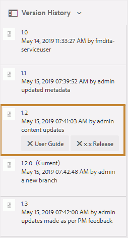

# Kennzeichnungen verwenden {#id164JBG0M0T1}

AEM Guides ermöglicht das Hinzufügen von Beschriftungen zu verschiedenen Dateiversionen. Mit diesen Beschriftungen können Sie die Version angeben, die Sie in eine Baseline für die Veröffentlichung einbeziehen möchten. Weitere Informationen zur Verwendung von Beschriftungen zum Erstellen einer Grundlinie finden Sie unter [Arbeiten mit Grundlinien](generate-output-use-baseline-for-publishing.md#).

Wenn Sie z. B. *Version 1.0* eines Themas in *Version 1.0* und *Version 1.1* desselben Themas in *Version 2.0* verwenden möchten, können Sie *Version 1.0* Bezeichnung auf der *Version 1.0* und *Version 2.0* Bezeichnung auf der *Version 1.1* hinzufügen.

Nachdem Sie die Bezeichnungen hinzugefügt haben, können Sie eine Grundlinie erstellen und festlegen, welche Version des Themas zur Veröffentlichung mithilfe dieser Grundlinie einbezogen werden soll. Um zu sehen, welche Version in eine Baseline ein- oder ausgeschlossen werden soll, können Sie die Option Versionsverlauf verwenden.

## Titel hinzufügen

Führen Sie die folgenden Schritte aus, um Ihrem Thema einen Titel hinzuzufügen:

1. Wählen Sie in der Assets-Benutzeroberfläche ein Thema aus
1. Klicken Sie auf das Auswahlsymbol in der linken Leiste und wählen Sie **Versionsverlauf**.
1. Klicken Sie im Versionsverlauf auf eine Version, der Sie einen Titel hinzufügen möchten.

1. Geben Sie einen Titel für die ausgewählte Version ein und drücken Sie die Eingabetaste. Beispiel: *.6*.

   >[!NOTE]
   >
   > Es ist nicht möglich, den verschiedenen Versionen eines Themas dieselbe Beschriftung hinzuzufügen. Sie können derselben Version eines Themas jedoch mehrere Bezeichnungen hinzufügen.

   Die Beschriftungen werden im Versionsverlauf des ausgewählten Themas angezeigt. Im folgenden Screenshot werden die Bezeichnungen *x.x-Version* und *Benutzerhandbuch* angezeigt, die der hervorgehobenen Version des Themas hinzugefügt wurden.

   {width="300" align="left"}

>[!NOTE]
>
> Mithilfe einer Grundlinie können Sie einen Titel zu mehreren Themen hinzufügen. Weitere Informationen zum Hinzufügen von Beschriftungen mithilfe von Grundlinien finden Sie unter [Hinzufügen von Beschriftungen zu einer Grundlinie](generate-output-use-baseline-for-publishing.md#id184KD0T305Z).

## Löschen eines Titels

Gehen Sie wie folgt vor, um eine Kennzeichnung zu löschen:

1. Wählen Sie in der Benutzeroberfläche von Assets ein Thema aus, dem eine Beschriftung hinzugefügt wurde.
1. Klicken Sie auf das Auswahlsymbol in der linken Leiste und wählen Sie **Versionsverlauf**.

   Im Versionsverlauf werden alle Versionen eines Themas und die mit ihnen verbundenen Beschriftungen angezeigt. Die folgende Abbildung zeigt ein Beispiel für verschiedene Versionen eines Themas, wobei einer Version Beschriftungen hinzugefügt wurden.

   {width="300" align="left"}

1. Klicken Sie auf die Schaltfläche Löschen \(**X**\), um die Bezeichnung zu löschen.

   {width="300" align="left"}

**Übergeordnetes Thema:**&#x200B;[&#x200B; Arbeiten mit dem Web-Editor](web-editor.md)
