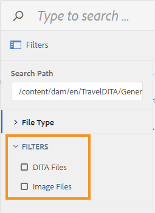

# Filter für das Dialogfeld zum Durchsuchen von Dateien konfigurieren {#id20CIL7009GN}

Beim Arbeiten im Web-Editor müssen Sie das Dialogfeld zum Durchsuchen von Dateien verwenden, um Elemente wie Bilder, Verweise oder Schlüsselverweise einzufügen. Das Standarddialogfeld zum Durchsuchen von Dateien bietet keine Dateifilteroption. Sie können eigene Filter hinzufügen, mit denen Sie einfach und schnell auf die erforderlichen Dateien zugreifen können.

Führen Sie die folgenden Schritte aus, um Ihre benutzerdefinierten Dateifilteroptionen zum Dialogfeld zum Durchsuchen von Dateien hinzuzufügen:

1. Um die Konfigurationsdatei der Benutzeroberfläche herunterzuladen, melden Sie sich bei Adobe Experience Manager als Administrator an.

1. Klicken Sie oben auf den Adobe Experience Manager-Link und wählen Sie **Tools** aus.
1. Wählen Sie **Guides** aus der Liste der Tools aus und klicken Sie auf **Ordnerprofile**.
1. Klicken Sie auf die **Globales Profil**-Kachel.
1. Wählen Sie die Registerkarte **XML** Editor-Konfiguration) aus und klicken Sie **oben auf** Bearbeiten“
1. Klicken Sie auf **Herunterladen**, um die Datei ui\_config.json auf Ihr lokales System herunterzuladen. Anschließend können Sie Änderungen an der Datei vornehmen und diese dann hochladen.
1. Fügen Sie in der `ui_config.json`-Datei die Definition der Filter hinzu, die Sie hinzufügen möchten.

   Das folgende Codefragment zeigt, wie zwei Filteroptionen hinzugefügt werden: DITA-Dateien und Bilddateien.

   ```
   "browseFilters": [
                       {
                       "title": "DITA Files",
                       "property": "jcr:content/metadata/dita_class",
                       "operation": "exists"
                       },
                       {
                       "title": "Image Files",
                       "property": "jcr:content/metadata/dc:format",
                       "value": [
                       "image/jpeg",
                       "image/gif",
                       "image/png"
                       ]
                       }
                       ]
   ```

   Im obigen Code-Snippet ist der erste Filter für DITA-Dateien. Die Filterdefinition akzeptiert die folgenden Parameter:

   Anrede
:   Der Anzeigename des Filters. Dieser Titel wird als Filteroption im Dialogfeld zum Durchsuchen von Dateien angezeigt.

   Eigenschaft
:   Die Eigenschaft, die in den Metadaten der Datei abgeglichen werden soll. Um beispielsweise nur die Dateien zuzulassen, die die `dita_class` Metadaten in ihrer -Eigenschaft enthalten, nimmt der Eigenschaftsfilter &quot;`jcr:content/metadata/dita_class`&quot; als Wert.

   Betrieb
:   Geben Sie &quot;`exists`&quot; an, um eine Übereinstimmung mit dem im Eigenschaftsparameter angegebenen Wert zu erhalten.

   Der zweite Filter betrifft Bilddateien. Die Parameter ähneln dem ersten Filter mit Ausnahme des `value`. Der `value`-Parameter akzeptiert ein Array von Bildtypen als Wert. Alle im Parameter value angegebenen Dateitypen werden gesucht und im Dialogfeld zum Durchsuchen von Dateien angezeigt. Alle anderen Dateitypen werden ignoriert.

1. Speichern Sie die Datei *ui\_config.json* und laden Sie sie hoch. Laden Sie dann den Web-Editor neu.

   Wenn Sie das Dialogfeld zum Durchsuchen von Dateien aufrufen, werden die in der Datei ui\_config.json konfigurierten Filteroptionen angezeigt.

   


**Übergeordnetes Thema:**&#x200B;[ Anpassen des Web-Editors](conf-web-editor.md)
