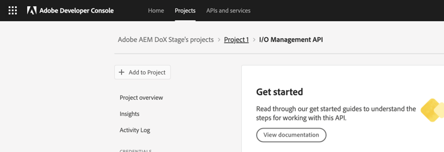

# Konfigurieren der KI-gestützten intelligenten Hilfe für die Inhaltssuche

Als Administrator können Sie die Funktion Smart Help für Autoren konfigurieren. Der Smart Help-Service wird durch die auth-based Authentifizierung von Adobe IMS gesichert. Integrieren Sie Ihre Umgebung in die sicheren Token-basierten Authentifizierungs-Workflows von Adobe und beginnen Sie mit der Verwendung der neuen Smart-Hilfe-Funktion. Mit den folgenden Konfigurationen können Sie die Registerkarte **AI-Konfiguration** zu einem Ordnerprofil hinzufügen. Nach dem Hinzufügen können Sie die Funktion Smart Help im Web Editor verwenden.

## Erstellen von IMS-Konfigurationen in Adobe Developer Console

Führen Sie die folgenden Schritte aus, um IMS-Konfigurationen in Adobe Developer Console zu erstellen:

>[!NOTE]
>
>Wenn Sie bereits ein OAuth-Projekt erstellt haben, um die Funktion für intelligente Vorschläge oder die mikrodienstbasierte Veröffentlichung zu konfigurieren, können Sie die folgenden Schritte überspringen, um das Projekt zu erstellen. Sie können mit Schritt 8 beginnen.

1. Starten Sie [Adobe Developer Console](https://developer.adobe.com/console).
1. Nach erfolgreicher Anmeldung bei Developer Console wird der Bildschirm **Home** angezeigt. Auf dem Bildschirm **Startseite** finden Sie Informationen und schnelle Links, einschließlich der Links zur obersten Navigation zu Projekten und Downloads.
1. Um ein neues leeres Projekt zu erstellen, wählen Sie **Neues Projekt erstellen** aus den Links **Schnellstart** aus.
    {width="550" align="left"}
   *Erstellen Sie ein neues Projekt.*

1. Wählen Sie im Bildschirm **Projekte** die Option **API hinzufügen** aus.  Der Bildschirm **API hinzufügen** wird angezeigt. Auf diesem Bildschirm werden alle verfügbaren APIs, Ereignisse und Dienste für Adobe-Produkte und -Technologien angezeigt, mit denen Sie Anwendungen entwickeln können.

1. Wählen Sie die **I/O Management-API** aus, um sie Ihrem Projekt hinzuzufügen.
   
   *Fügen Sie Ihrem Projekt die I/O-Management-API hinzu.*

1. Erstellen Sie eine neue **OAuth-Berechtigung** und speichern Sie sie.
    {width="3000" align="left"}
   *Konfigurieren Sie die OAuth-Berechtigung für Ihre API.*

1. Wählen Sie auf der Registerkarte **Projekte** die Option **OAuth Server to Server** und wählen Sie dann die neu erstellten Anmeldeinformationen aus.

1. Wählen Sie den Link **OAuth Server-zu-Server** aus, um die Berechtigungsdetails Ihres Projekts anzuzeigen.

    {width="800" align="left"}

   *Stellen Sie eine Verbindung zum Projekt her, um die Berechtigungsdetails anzuzeigen.*

1. Kehren Sie zur Registerkarte **Projekte** zurück und wählen Sie links die Option **Projektübersicht** aus.

   

   *Beginnen Sie mit dem neuen Projekt.*

1. Klicken Sie oben auf die Schaltfläche **Herunterladen** , um die Service-JSON herunterzuladen.

   

   *Laden Sie die Details zum JSON-Dienst herunter.*

Sie haben die OAuth-Authentifizierungsdetails konfiguriert und die Details zum JSON-Dienst heruntergeladen. Halten Sie diese Datei so bereit, wie es im nächsten Abschnitt erforderlich ist.

### Hinzufügen der IMS-Konfiguration zur Umgebung

Führen Sie die folgenden Schritte aus, um der Umgebung die IMS-Konfiguration hinzuzufügen:

1. Öffnen Sie Experience Manager und wählen Sie das Programm aus, das die Umgebung enthält, die Sie konfigurieren möchten.
1. Wechseln Sie zur Registerkarte **Umgebungen** .
1. Wählen Sie den Umgebungsnamen aus, den Sie konfigurieren möchten. Dies sollte Sie zur Seite **Umgebungsinformationen** führen.
1. Wechseln Sie zur Registerkarte **Konfiguration** .
1. Aktualisieren Sie das JSON-Feld SERVICE_ACCOUNT_DETAILS . Stellen Sie sicher, dass Sie denselben Namen und dieselbe Konfiguration wie im folgenden Screenshot verwenden.

{width="800" align="left"}


*Fügen Sie die Umgebungskonfigurationsdetails hinzu.*


Nachdem Sie die IMS-Konfiguration zur Umgebung hinzugefügt haben, führen Sie die folgenden Schritte aus, um diese Eigenschaften mithilfe von OSGi mit AEM Guides zu verknüpfen:

1. Fügen Sie in Ihrem Git-Projektcode für Cloud Manager die folgenden beiden Dateien hinzu (für Dateiinhalte siehe [Anhang](#appendix)).

   * `com.adobe.aem.guides.eventing.ImsConfiguratorService.cfg.json`

1. Stellen Sie sicher, dass die neu hinzugefügten Dateien von Ihrem `filter.xml` abgedeckt werden.
1. Übernehmen Sie Ihre Git-Änderungen und übertragen Sie sie.
1. Führen Sie die Pipeline aus, um die Änderungen auf die Umgebung anzuwenden.

Danach sollten Sie die Funktion **Smart Help** verwenden können.


## Anhang {#appendix}

**Datei**:
`com.adobe.aem.guides.eventing.ImsConfiguratorService.cfg.json`

**Inhalt**:

```
{
 "service.account.details": "$[secret:SERVICE_ACCOUNT_DETAILS]",
}
```


Nach der Konfiguration wird das Symbol **Smart Help**  im rechten Bereich des Web Editors angezeigt. Wählen Sie das Symbol aus, um das Bedienfeld **Smart Help** anzuzeigen.
Weitere Informationen finden Sie im Abschnitt [KI-gestützte intelligente Hilfe zum Durchsuchen von Inhalten](../user-guide/ai-based-smart-help.md) im Benutzerhandbuch für Experience Manager.
