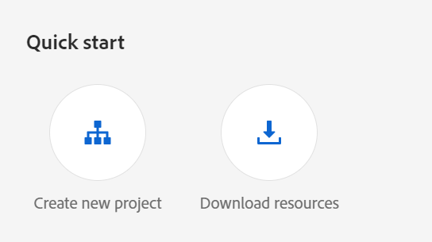

# Konfigurieren des KI-Assistenten

Als Administrator können Sie die Funktion KI-Assistent in Experience Manager Guides konfigurieren. Der KI-Assistent wird durch die authentifizierungsbasierte Adobe IMS-Authentifizierung geschützt. Integrieren Sie Ihre Umgebung mit den sicheren Token-basierten Authentifizierungs-Workflows von Adobe und verwenden Sie die Funktion KI-Assistent . Mit der folgenden Konfiguration können Sie die Registerkarte **KI-Konfiguration** zum Ordnerprofil hinzufügen. Nach dem Hinzufügen können Sie die Funktion KI-Assistent in Experience Manager Guides verwenden.

Führen Sie die folgenden Schritte aus, um den KI-Assistenten zu konfigurieren:

1. [Erstellen Sie die IMS-Konfiguration in Adobe Developer Console](#create-ims-configurations-in-adobe-developer-console).
2. [Hinzufügen von IMS-Konfigurationen zur Umgebung](#add-ims-configuration-to-the-environment)
3. [KI-Markierung in der Umgebung aktivieren](#enable-ai-flag-in-the-environment)
4. [Änderungen auf die Umgebung anwenden](#apply-changes-to-the-environment)
5. [Aktivieren des KI-Assistenten im Ordnerprofil](#enable-ai-assistant-in-folder-profile)
6. [Konfigurieren von Smart-Vorschlägen im Ordnerprofil](./conf-folder-level.md#configure-ai-assistant-for-smart-help-and-authoring)

## Erstellen von IMS-Konfigurationen in Adobe Developer Console

Führen Sie die folgenden Schritte aus, um IMS-Konfigurationen in Adobe Developer Console zu erstellen:

>[!NOTE]
>
>Wenn Sie bereits ein OAuth-Projekt erstellt haben, um die auf Microservices basierende Veröffentlichung zu konfigurieren, können Sie die folgenden Schritte überspringen, um das Projekt zu erstellen.

1. [Adobe Developer Console starten](https://developer.adobe.com/console).
1. Nach erfolgreicher Anmeldung bei Developer Console wird der Bildschirm &quot;**&quot;**. Auf dem **Startseite**-Bildschirm finden Sie mühelos Informationen und Schnelllinks, einschließlich der oberen Navigationslinks zu Projekten und Downloads.
1. Um ein neues leeres Projekt zu erstellen, wählen Sie **Neues Projekt erstellen** aus den **Schnellstart**Links aus.
    {width="550" align="left"}
   *Neues Projekt erstellen.*

1. Wählen **API hinzufügen** auf dem Bildschirm **Projekte** aus.  Der **„API hinzufügen** wird angezeigt. Auf diesem Bildschirm werden alle verfügbaren APIs, Ereignisse und Services für Adobe-Produkte und -Technologien angezeigt, mit denen Sie Anwendungen entwickeln können.

1. Wählen Sie die **I/O Management API** aus, um sie zu Ihrem Projekt hinzuzufügen.
   
   *Fügen Sie Ihrem Projekt die I/O-Management-API hinzu.*

1. Erstellen Sie eine neue **OAuth-Berechtigung** und speichern Sie sie.

   

   *Konfigurieren von OAuth-Anmeldeinformationen für Ihre API.*

1. Wählen Sie auf **Registerkarte** die Option **OAuth-Server zu Server** und wählen Sie dann die neu erstellten Anmeldeinformationen aus.

1. Wählen Sie den **OAuth Server-zu-Server**-Link aus, um die Details der Anmeldeinformationen Ihres Projekts anzuzeigen.

    {width="800" align="left"}

   *Stellen Sie eine Verbindung zum Projekt her, um die Details der Berechtigung anzuzeigen.*

1. Kehren Sie zur Registerkarte **Projekte** zurück und wählen Sie **Projektübersicht** auf der linken Seite aus.

   

   *Erste Schritte mit dem neuen Projekt.*

1. Klicken Sie oben auf **Schaltfläche** Herunterladen“, um die JSON-Datei des Services herunterzuladen.

   

   *JSON-Service-Details herunterladen.*

Sie haben die OAuth-Authentifizierungsdetails konfiguriert und die JSON-Service-Details heruntergeladen. Halten Sie diese Datei bereit, da sie im nächsten Abschnitt benötigt wird.

## Hinzufügen der IMS-Konfiguration zur Umgebung

Führen Sie die folgenden Schritte aus, um die IMS-Konfiguration zur Umgebung hinzuzufügen:

1. Öffnen Sie Experience Manager und wählen Sie dann Ihr Programm aus, das die Umgebung enthält, die Sie konfigurieren möchten.
1. Wechseln Sie zur Registerkarte **Umgebungen**.
1. Wählen Sie den Namen der Umgebung aus, die Sie konfigurieren möchten. Dadurch sollten Sie zur Seite **Umgebungsinformationen** gelangen.
1. Wechseln Sie zur Registerkarte **Konfiguration** .
1. Aktualisieren Sie das JSON-Feld SERVICE_ACCOUNT_DETAILS . Stellen Sie sicher, dass Sie denselben Namen und dieselbe Konfiguration wie im folgenden Screenshot verwenden.

   {width="800" align="left"}

## KI-Markierung in der Umgebung aktivieren

Um die Funktion „KI-Assistent“ in der Experience Manager Guides-Benutzeroberfläche zu aktivieren, fügen Sie die `ENABLES_GUIDES_AI` in der Umgebung hinzu.

Stellen Sie sicher, dass Sie denselben Namen und dieselbe Konfiguration wie im folgenden Screenshot verwenden.

{width="800" align="left"}

Wenn Sie das Flag auf **true** setzen, wird die Funktion aktiviert, wenn Sie sie auf **false** setzen.

## Änderungen auf die Umgebung anwenden

Nachdem Sie die IMS-Konfiguration hinzugefügt und das Flag „KI-Assistent“ für die Umgebung aktiviert haben, führen Sie die folgenden Schritte aus, um diese Eigenschaften mithilfe von OSGi mit AEM Guides zu verknüpfen:

1. Fügen Sie in Ihrem Cloud Manager-Git-Projekt-Code die folgenden beiden Dateien hinzu (für den Dateiinhalt, Ansicht [Anhang](#appendix)).

   * `com.adobe.aem.guides.eventing.ImsConfiguratorService.cfg.json`
   * `com.adobe.guides.ai.config.service.AiConfigImpl.cfg.json`
1. Stellen Sie sicher, dass die neu hinzugefügten Dateien von Ihrem `filter.xml` abgedeckt werden.
1. Übertragen Sie Ihre Git-Änderungen und übertragen Sie sie.
1. Führen Sie die Pipeline aus, um die Änderungen auf die Umgebung anzuwenden.

## Aktivieren des KI-Assistenten im Ordnerprofil

Sobald die Konfigurationsänderungen angewendet wurden, aktivieren Sie die Funktion des KI-Assistenten für das gewünschte Ordnerprofil.

Weitere Informationen finden Sie unter [Die Editor-Funktionen kennen](../user-guide/web-editor-features.md).

{width="300" align="left"}

## Konfigurieren von Smart-Vorschlägen im Ordnerprofil

Konfigurieren Sie nach der Aktivierung der Funktion „KI-Assistent“ die Funktion „Intelligente Vorschläge“ im Ordnerprofil.

Weitere Informationen finden Sie unter [Konfigurieren von Smart-Vorschlägen im ](./conf-folder-level.md#configure-ai-assistant-for-smart-help-and-authoring)&quot;.


## Anhang {#appendix}

**Datei**:
`com.adobe.aem.guides.eventing.ImsConfiguratorService.cfg.json`

**Inhalt**:

```
{
 "service.account.details": "$[secret:SERVICE_ACCOUNT_DETAILS]",
}
```

**Datei**: `com.adobe.guides.ai.config.service.AiConfigImpl.cfg.json`

**Inhalt**:

```
{
  "conref.inline.threshold":0.6,
  "conref.block.threshold":0.7,
  "related.link.threshold":0.5,
  "emerald.url":"https://adobeioruntime.net/apis/543112-smartsuggest/emerald/v1",
  "instance.type":"prod",
  "chat.url":"https://aem-guides-ai.adobe.io"
}
```

## Konfigurationsdetails des KI-Assistenten

| Schlüssel | Beschreibung | Zulässige Werte | Standardwert |
|---|---|---|---|
| conref.inline.threshold | Schwellenwert, der die Präzision/den Abruf von Vorschlägen steuert, die für das Tag abgerufen werden, das der Benutzer derzeit eingibt. | Beliebiger Wert von -1,0 bis 1,0. | 0,6 |
| conref.block.threshold | Schwellenwert, der die Präzision/den Abruf von Vorschlägen steuert, die für Tags in der gesamten Datei abgerufen werden. | Beliebiger Wert von -1,0 bis 1,0. | 0,7 |
| emerald.url | Endpunkt für die Smart Suggestion-Vektordatenbank | [https://adobeioruntime.net/apis/543112-smartsuggest/emerald/v1](https://adobeioruntime.net/apis/543112-smartsuggest/emerald/v1) | [https://adobeioruntime.net/apis/543112-smartsuggest/emerald/v1](https://adobeioruntime.net/apis/543112-smartsuggest/emerald/v1) |
| chat.url | Endpunkt für den KI-Assistenten-Service | [https://aem-guides-ai.adobe.io](https://aem-guides-ai.adobe.io) | [https://aem-guides-ai.adobe.io](https://aem-guides-ai.adobe.io) |
| instance.type | Typ der AEM-Instanz. Stellen Sie sicher, dass dies für jede AEM-Instanz, für die die Smart-Vorschläge konfiguriert sind, eindeutig ist. Ein Anwendungsfall bestünde darin, die Funktion in der Staging-Umgebung mit „instance.type“ = „stage“ zu testen, während die Funktion gleichzeitig auch in „prod“ konfiguriert ist. | Jeder eindeutige Schlüssel, der die Umgebung identifiziert. Nur *alphanumerische* Werte sind zulässig. „dev“/„stage“/„prod“/„test1“/„stage2“ | „prod“ |

Nach der Konfiguration wird das Symbol für den KI-Assistenten auf der Startseite und im Editor der Experience Manager Guides angezeigt. Weitere Informationen finden Sie [ Abschnitt ](../user-guide/ai-assistant.md)KI-Assistent“ im Experience Manager-Benutzerhandbuch.
