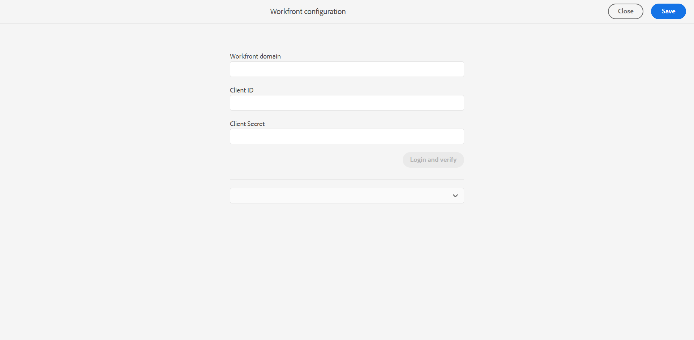

# Konfigurieren von Adobe Workfront

Adobe Workfront ist eine Cloud-basierte Lösung für das Arbeits-Management, mit der Teams und Unternehmen ihre Arbeit effizient planen, verfolgen und verwalten können. Durch die Integration von Experience Manager Guides mit Adobe Workfront erhalten Sie Zugriff auf zuverlässige Projektmanagement-Funktionen, die die zentralen CCMS-Funktionen von Experience Manager Guides ergänzen und es Ihnen ermöglichen, Aufgaben effizient zu planen, zuzuweisen und nachzuverfolgen.

Weitere Informationen zur Integration von [Adobe Workfront](../user-guide/workfront-integration.md) in Experience Manager Guides.

## Voraussetzungen

Bevor Sie beginnen, stellen Sie Folgendes sicher:

1. Sie haben Standardzugriff auf Adobe Workfront und Administratorzugriff auf Experience Manager Guides.
2. Sie [ein neues benutzerdefiniertes Formular in Adobe Workfront erstellen](https://experienceleague.adobe.com/de/docs/workfront/using/administration-and-setup/customize/custom-forms/design-a-form/design-a-form) das für Experience Manager Guides erforderlich ist, indem Sie speziell die folgenden Felder verwenden:

   | Feldtyp | Label | Name | Wahlen (Werte anzeigen aktiviert) |
   |------------|------|------|-------------------------------|
   | Dropdown-Liste mit Einzelauswahl | Aufgabentyp | task-type | Authoring (Wert = AUTOR), Publishing (Wert = PUBLISH), Übersetzung (Wert = ÜBERSETZUNG), Review (Wert = ÜBERPRÜFUNG) |
   | Dropdown-Liste mit Einzelauswahl | Aufgabenstatus | task-state | Authoring (Wert = AUTOR), Publishing (Wert = PUBLISH), Übersetzung (Wert = ÜBERSETZUNG), Review (Wert = ÜBERPRÜFUNG) |
   | Text mit Formatierung | Autorenliste | author-list | – |
   | Text mit Formatierung | Reviewer-Liste | reviewer-list | – |
   | Einzeilentext | URL überprüfen | review-url | – |
   | Einzeilentext | Aufgaben-URL | task-url | – |
   | Einzeilentext | E-Mail-Betreff | email-subject | – |

>[!NOTE]
>
> * In der obigen Tabelle stellen die Optionen dar, die im Feld **Aufgabentyp“ verfügbar**. Für jede Option müssen Sie den **Aufgabennamen“ und** Aufgabenwert **angeben**. Der Name und die Werte für jeden Aufgabentyp müssen genau den in der obigen Tabelle angegebenen Werten entsprechen. Geben Sie beispielsweise für den Aufgabentyp Autor **Authoring** als Namen und **AUTHOR** als entsprechenden Wert an.
> * Stellen Sie bei der Arbeit mit On-Premise-Services immer sicher, dass `localhost` in der Konfiguration **Day CQ Link Externalizer** durch die richtige Server-Adresse ersetzt wird, um den aufgelösten Aufgaben-Link in den E-Mail-Benachrichtigungen ordnungsgemäß zu erhalten.
> * Beim Erstellen einer Prüfungsaufgabe in Workfront müssen Benutzer (Autoren oder Prüfer) zur Gruppe **workflow-users** gehören. Darüber hinaus müssen **als** Teil der Gruppe **content-authors** und **authors** sein, während Sie als **Reviewer** Teil der Gruppe **reviewers** sein müssen.

## Erste Schritte

Führen Sie die folgenden Schritte aus, um Adobe Workfront in Experience Manager Guides zu konfigurieren.

1. Öffnen Sie das **Tools-Bedienfeld** und wählen Sie **Guides** aus.
2. Wählen Sie **Workfront konfigurieren** aus.

   Die Seite **Workfront** Konfiguration“ wird angezeigt.

   

3. Geben Sie auf der Seite **Workfront** Konfiguration die vollständige URL der Workfront-Domain, Client-ID und des geheimen Clientschlüssels Ihres Unternehmens ein.

   Um auf den in **Adobe Workfront-Setup konfigurierten Schlüssel** Client-ID **und** Client-Geheimnis“ zuzugreifen, navigieren Sie zu `Setup >> Systems>> oAuth2 Applications`.

   Weitere Informationen zum Konfigurieren Ihrer Adobe Workfront-Domain finden Sie im Abschnitt Autorisierungs-Code-Fluss in [Erstellen von OAuth2-Anwendungen für Workfront-Integrationen](https://experienceleague.adobe.com/de/docs/workfront/using/administration-and-setup/configure-integrations/create-oauth-application#create-an-oauth2-application-using-user-credentials-authorization-code-flow).

4. Wählen Sie **Anmelden und überprüfen** aus.

   Sie werden zur Anmeldeseite von Adobe Workfront weitergeleitet.
5. Melden Sie sich mit Ihrer Adobe Workfront-E-Mail-Adresse an und wählen Sie **Zugriff zulassen**, damit die OAuth2-Anwendung auf Ihr jeweiliges Adobe Workfront-Konto zugreifen kann.

   Sie werden automatisch zur Workfront-Konfigurationsseite auf Experience Manager Guides weitergeleitet.

6. Wählen Sie in der Dropdown-Liste Benutzerdefiniertes Formular das benutzerdefinierte Adobe Workfront-Formular aus, das Sie für Experience Manager Guides erstellt haben. Ansicht [Voraussetzungen](#prerequisites).
7. Wählen **Speichern und schließen** um die Konfigurationsänderungen von Workfront anzuwenden und zu speichern.

Fügen Sie nach der Konfiguration [Benutzer zu Adobe Workfront hinzufügen](https://experienceleague.adobe.com/de/docs/workfront/using/administration-and-setup/add-users/create-manage-users/add-users) und verwenden Sie dieselben E-Mail-Adressen wie in Experience Manager Guides.
