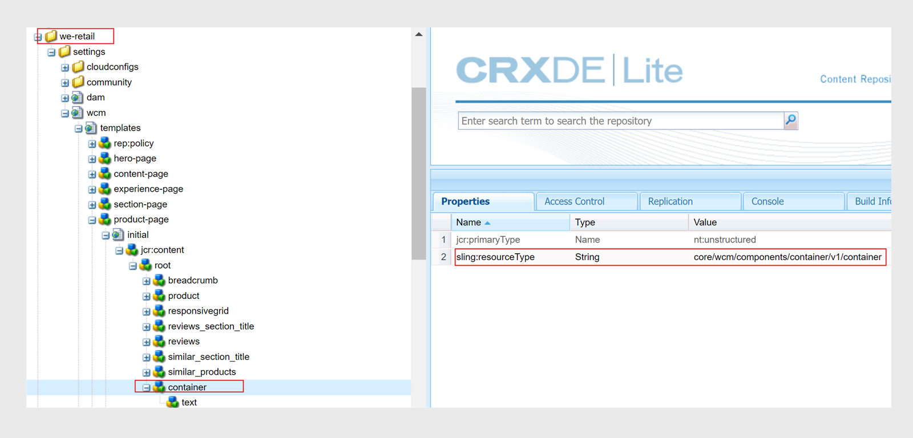

# Herunterladen und Installieren von AEM Sites-Vorlagen

Führen Sie die folgenden Schritte aus, um AEM Sites-Vorlagen auf Experience Manager Guides as Cloud Service herunterzuladen und zu installieren:

## Paketinstallation{#package-installation}

Um die Vorlagen zu verwenden, installieren Sie das Komponentenpaket über die Cloud-Implementierung:
- [guides-components-all.zip](https://github.com/adobe/aemg-sites-components/releases/tag/v1.0.0)

Führen Sie die folgenden Schritte aus, um eine AEM Sites mithilfe der Vorlage zu erstellen:

1. Erstellen Sie AEM Sites mithilfe der Vorlage:
1. Klicken Sie in der Sites-Benutzeroberfläche oben rechts auf die Schaltfläche **Erstellen** .
1. Wählen Sie **Site aus Vorlage** aus dem Dropdown-Menü **Erstellen** aus.

1. Importieren von Sites-Vorlagen: [aemg-docs-1.0.0.zip](https://github.com/adobe/aemg-sites-template/releases/tag/v1.0.0) mit der Option **Import** .
1. Wählen Sie `AEMG Docs 1.0.0` und klicken Sie dann auf **Weiter**.
1. Geben Sie `Site title` und `Site name` ein.
1. Klicken Sie auf **Erstellen**. Das Package wird installiert und eine AEM Sites-Vorlage erstellt.

Erfahren Sie mehr über [Hinzufügen einer Site-Vorlage zu AEM](https://experienceleague.adobe.com/en/docs/experience-manager-cloud-service/content/sites/administering/site-creation/site-templates#adding).

>[!NOTE]
>
>Nachdem Sie die Startseite erstellt haben, können Sie diesen Pfad als **Publish-Pfad** zum Generieren der Ausgabe Ihrer AEM Sites-Vorgaben verwenden. Zum Beispiel: `aemg-docs-en/docs/product-abc`.

## Konfigurieren der Vorlagen für die Verwendung mit AEM Sites-Vorgaben

Nachdem das Paket installiert wurde, wird eine Site mit dem Namen **AEMG** in der Sites-Benutzeroberfläche erstellt. Diese Beispielsite zeigt, wie Sie die Site-Struktur zum Generieren der AEM Sites-Ausgabe einrichten können. Das ist nur ein Beispiel. Sie können benutzerdefinierte Sites entsprechend Ihren Anforderungen erstellen.

**AEMG** enthält die folgenden Komponenten.
- Im Ordner **AEMG** befindet sich ein Ordner für die Sprache Englisch (en). Sie können entsprechend Ihren Anforderungen ähnliche Sprachkopien erstellen. Beispielsweise enthält eine mehrsprachige Website englische (en), deutsche (de) und französische(fr) Sprachkopien.  Erfahren Sie mehr über das Erstellen einer Sprachkopie mit dem [Assistenten für Sprachkopien](https://experienceleague.adobe.com/en/docs/experience-manager-65/content/sites/administering/introduction/tc-wizard).
- Im Ordner für die englische Sprache (en) bietet Experience Manager Guides viele vordefinierte Beispielseiten wie **Suche**, **Anmelden**, **Dokumente** und **Support**.

- **Docs** ist die Beispielseite der Dokumentation. Es dient als zentraler Ort für alle produktbezogenen Dokumentationen.
und zeigt jedes Produkt an, für das die Dokumentation als einzelne Kacheln verfügbar ist.

- Neben der Dokumentations-Homepage gibt es Beispielseiten für **Suche**, **Anmelden** und **Support**. Sie können diese Beispiele entsprechend Ihren Anforderungen anpassen.
- Sie können Startseiten für einzelne Produkte wie Produkt1 haben. Eine Beispielseite &quot;**Produkt1**&quot;befindet sich unter &quot;**Dokumente**&quot;, der Dokumentations-Homepage.

- Experience Manager Guides bietet außerdem die folgenden vordefinierten Vorlagen:

   - Vorlage **Inhaltsseite** : Verwenden Sie diese Vorlage, um die Standardseiten zu erstellen, die den Großteil des Inhalts der Produktseite enthalten. Sie können Text, Bilder, Videos und andere Inhaltselemente enthalten. Diese Vorlage enthält nur die Kopf- und Fußzeile. Passen Sie diese an und erstellen Sie sie entsprechend Ihren Anforderungen. Sie können beispielsweise die Support-Seite oder die Anmeldeseite für Ihr Produkt erstellen.
   - **Homepage** -Vorlage: Die Haupt-Landingpage einer Website, die eine Übersicht, wichtige Abschnitte wie die Schlüsselelemente und Funktionen und Navigationslinks enthält. Beispielsweise stellt die Hauptseite eines Produkts ABC eine Verbindung zu anderen Inhalten oder Funktionsseiten her.
   - Vorlage **Themenseite**: Die Seiten, die zum Organisieren und Präsentieren von themenbasiertem Inhalt verwendet werden. Beispielsweise enthält ein Benutzerhandbuch verschiedene Themenseiten, von denen jedes ein bestimmtes Thema im Zusammenhang mit Funktionen und Fehlerbehebung enthält.

  

Verwenden Sie diese Beispiele und Vorlagen, um Ihre AEM Sites-Ausgaben zu generieren:
- Eine Produkt-Startseite entspricht einer Landkarte-Startseite und wird mithilfe der Vorlage Startseite erstellt. Wählen Sie diesen Pfad in der AEM Sites-Vorgabe aus, um die Inhalte der Zuordnung darunter zu veröffentlichen. Die Produkt-Startseite kann andere Startseiten enthalten.
- Sie haben beispielsweise ein Produkt wie Experience Manager Guides und benötigen drei Handbücher für Benutzer, Administratoren und Entwickler.  Erstellen Sie eine Startseite für jedes Handbuch mithilfe der Vorlage Startseite und wählen Sie dann die entsprechende Startseite in der AEM Sites-Ausgabevorgabe aus.

Erfahren Sie mehr darüber, wie Sie die [AEM Sites-Vorgaben im Web Editor](../user-guide/generate-output-aem-site-web-editor.md) erstellen und konfigurieren.

## Erstellen einer Homepage mithilfe der Vorlage{#create-a-home-page-using-the-template}

Führen Sie die folgenden Schritte aus, um die Startseite für Ihr Produkt zu erstellen:
1. Nachdem das Paket installiert wurde, wählen Sie **Sites** aus der globalen Navigation aus.
1. Wählen Sie die Vorlage &quot;AEMG Docs&quot;aus, die in der Sites-Benutzeroberfläche installiert ist.
1. Klicken Sie in der Sites-Benutzeroberfläche oben rechts auf die Schaltfläche **Erstellen** .
1. Wählen Sie **Seite** aus dem Dropdown-Menü **Erstellen** aus.
1. Wählen Sie **Homepage** und klicken Sie dann auf **Weiter**.
1. Geben Sie den Site-Titel und den Site-Namen ein und klicken Sie oben rechts auf **Erstellen** . Eine AEM-Site-Vorlage wird mithilfe der Site-Vorlage **Homepage** erstellt. Sie können beispielsweise eine Homepage für Ihr Produkt `Product ABC` erstellen.

>[!NOTE]
>
>Nachdem Sie die Startseite erstellt haben, können Sie diesen Pfad als **Publish-Pfad** zum Generieren der Ausgabe Ihrer AEM Sites-Vorgaben verwenden. Zum Beispiel: `aemg-docs-en/docs/product-abc`.

## Bearbeiten von Themenvorlagen für AEM Sites

Sie können auch die Themenvorlagen für Ihre AEM Sites anpassen. Sie können den Inhalt bearbeiten oder die Eigenschaften der verschiedenen AEM in Ihrem Thema konfigurieren. Beispielsweise können Sie Komponenten gemäß Ihren Anforderungen hinzufügen oder entfernen.\
Führen Sie die folgenden Schritte aus, um die Themenvorlagen zu bearbeiten:
1. Wählen Sie die Vorlage aus, die Sie bearbeiten möchten.
1. Wählen Sie oben das Symbol **Bearbeiten** aus.

Der AEM Vorlagen-Editor wird geöffnet. Sie können Ihre Themenvorlage bearbeiten. Erfahren Sie mehr über [Erstellen von Seitenvorlagen](https://experienceleague.adobe.com/en/docs/experience-manager-65/content/sites/authoring/siteandpage/templates#editing-a-template-structure-template-author).

## Vorhandene AEM Sites-Vorlagen anpassen {#customize-existing-aem-sites-templates}

Neben den vordefinierten Vorlagen können Sie auch Ihre vorhandenen Vorlagen mit den AEM Sites-Vorgaben verwenden. Führen Sie die folgenden Schritte aus, um vorhandene AEM Sites-Vorlagen anzupassen:

### Vorlagenerstellung

Sie benötigen die beiden folgenden Vorlagentypen:

- Kategorie oder Einstiegsvorlage: Diese Vorlage wird für die Landingpage der Produktdokumentation verwendet und entspricht einer DITA-Zuordnung.  AEM Site-Seite für eine DITA-Zuordnung wird mithilfe dieser Vorlage generiert. Sie können diese Vorlage auf jeder beliebigen Ebene verwenden.
- Fügen Sie Ihrer vorhandenen Vorlage eine Textkomponente hinzu. Die Textkomponente sollte über die obligatorische Eigenschaft `text="$category.html$"` verfügen.
- Sie können beispielsweise We-Retail-Vorlagen auswählen und die Abschnittsseitenvorlage als Landingpage-Vorlage für die DITA-Map verwenden. Nehmen Sie dazu die Änderungen wie im folgenden Screenshot gezeigt vor:
  
   - Detailseite oder Themenseitenvorlage: Verwenden Sie diese Vorlage für den Inhalt von Themen einer Zuordnung. Alle Sites-Seiten des DITA-/XML-Inhalts werden mithilfe von Themenseitenvorlagen erstellt. Zum Erstellen dieser Vorlagen sind zwei Voraussetzungen erforderlich:
      - Fügen Sie der Vorlage eine Textkomponente mit einer obligatorischen Eigenschaft hinzu, die in einer Container-Komponente enthalten ist. `text="$topic.content$"`.
        
      - Spiegeln Sie denselben Container und dieselbe Textkomponente in der Struktur derselben Vorlage, wie im folgenden Screenshot gezeigt:
        

### Tag-Kategorieseite als Dokumentations-Container

Wenn eine Site-Hierarchie für die Dokumentationsseiten mit der vorherigen Vorlage erstellt wird, wählen Sie eine der Kategorieseiten aus, die in dieser Site-Hierarchie erstellt wurden. Taggen Sie die Kategorieseite als Dokumentations-Container, indem Sie ihr eine ID zuweisen.
Weisen Sie dazu die Eigenschaft `id` dem Wert `category-page` zu. Siehe folgenden Screenshot:

