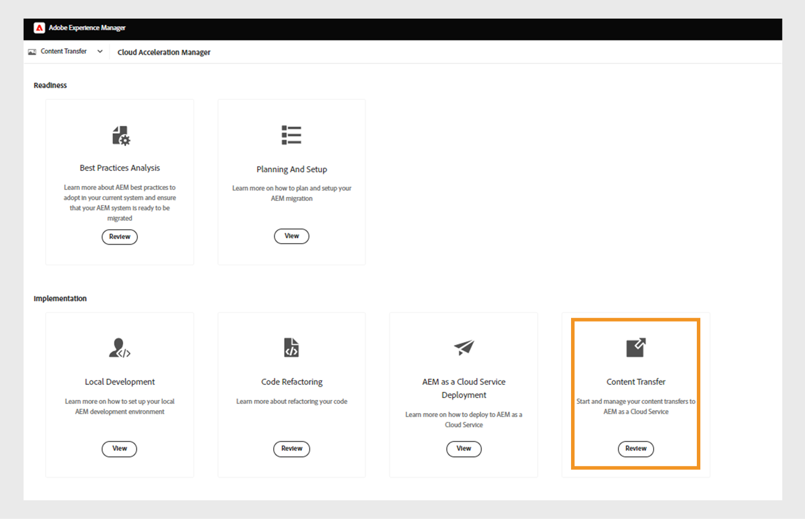

# Migrieren von Inhalten von On-Premise zu Cloud Service

Experience Manager as a Cloud Service bietet eine skalierbare, sichere und agile technologische Grundlage für Experience Manager Guides, Assets, Forms und Screens. Dadurch können sich Marketing-Experten und IT-Experten darauf konzentrieren, skaliert wirkungsvolle Erlebnisse bereitzustellen.
Mit Experience Manager as a Cloud Service können sich Ihre Teams auf Innovationen konzentrieren, anstatt Produktaktualisierungen planen zu müssen. Neue Produktfunktionen werden umfassend getestet und ohne Unterbrechungen für Ihre Teams bereitgestellt, sodass sie immer auf die neueste Version von Adobe Experience Manager zugreifen können.

Dieser Artikel bietet einen detaillierten, schrittweisen Prozess für die Migration Ihrer On-Premise- oder Managed Services Experience Manager Guides-Inhalte zu Cloud Service, um einen reibungslosen Übergang zur Cloud-basierten Plattform sicherzustellen.

## Voraussetzungen

* Adobe Experience Manager 6.4 oder neuere Versionen
* Experience Manager Guides sollte die UUID-Version verwenden. Wenn Sie eine Nicht-UUID-Version von Adobe Experience Manager Guides verwenden, migrieren Sie zunächst mithilfe der Schritte unter [Migrieren von Nicht-DITA-Inhalten](../install-guide/migrate-uuid-non-uuid.md) zu UUID.
* Zugriff auf **Cloud Acceleration Manager** für die Cloud-Instanz, in die Sie die Inhalte migrieren möchten
* Repository-Größe von bis zu 20 TB wird unterstützt
* Gesamtgröße des Lucene-Index von 25 GB
* Die Länge eines Knotennamens muss weniger als 150 Byte betragen

## Migrationsprozess

**Content Transfer Tool** ist ein vom Adobe entwickeltes Tool, mit dem Sie die Migration vorhandener Inhalte von einer Adobe Experience Manager On-Premise- oder Managed Services-Quellinstanz zur Ziel-Experience Manager Cloud Service-Instanz initiieren können.
Dieses Tool überträgt auch Prinzipale (Benutzende oder Gruppen) automatisch.

Sie können das **Content Transfer Tool** als ZIP-Datei vom **Software Distribution**-Portal herunterladen:

1. Wählen Sie die **&#x200B;**&#x200B;AEM as a Cloud Service **im Portal** Software Distribution“ aus.
1. Suchen Sie **Content Transfer Tool**.
1. Wählen Sie **Content Transfer Tool** aus der Liste aus und laden Sie es herunter.

Installieren Sie dann das Paket über **Package Manager** auf Ihrer Adobe Experience Manager-Quellinstanz. Stellen Sie sicher, dass Sie die neueste Version herunterladen.
Weitere Informationen zur neuesten Version finden Sie unter [Versionshinweise](https://experienceleague.adobe.com/docs/experience-manager-cloud-service/content/release-notes/release-notes/release-notes-current.html?lang=de).

>[!NOTE]
> 
> Es wird nur Version 2.0.0 und höher unterstützt und es wird empfohlen, die neueste Version zu verwenden.

Führen Sie die folgenden Schritte aus, um Experience Manager Guides-Inhalte zu Experience Manager as a Cloud Service zu migrieren.

1. Melden Sie sich bei [experience.adobe.com](https://experience.adobe.com/) an und wählen Sie **Experience Manager**.

   

1. Klicken **auf** Kachel **Cloud Acceleration Manager**.
   

1. Erstellen Sie Ihr erstes Projekt.
   

1. Fügen Sie den Namen und die Beschreibung hinzu und klicken Sie auf **Erstellen**. Ihr Projekt wird erstellt.
1. Wählen Sie das erstellte Projekt aus und öffnen Sie den Projektbildschirm.
1. Klicken **auf** Kachel **Inhaltstransfer**.

   

1. Klicken Sie **Migrationssatz erstellen**.

1. Geben Sie den Namen und die Beschreibung für den Migrationssatz an.

   

1. Klicken Sie nach der Erstellung auf die drei Punkte und wählen Sie **Extraktionsschlüssel kopieren**.

1. Klicken Sie **In Zwischenablage kopieren**. Erstellen Sie Ihr erstes Projekt.
   

1. Wählen Sie oben **Adobe Experience Manager** und anschließend die Kachel **Software-Verteilung** aus.
   

1. Wählen Sie im **Software Distribution**-Portal die Registerkarte **Adobe Experience Manager als Cloud Service**, suchen Sie nach „Content Transfer Tool“ und laden Sie das Content Transfer Tool-Paket herunter.

   >[!NOTE]
   >
   >  Stellen Sie sicher, dass Sie die neueste Version herunterladen.

1. Laden Sie das Package `content-transfer.all-3.0.10.zip` in den **Package Manager** Ihrer On-Premise-Instanz hoch und installieren Sie es.
   

1. Wählen Sie auf der On-Premise-Instanz **Tools** > **Vorgänge** > **Inhaltsmigration** > **Inhaltstransfer**.

1. Wählen **Inhaltsübertragung**, erstellen Sie einen Migrationssatz und fügen Sie den aus Cloud Acceleration Manager kopierten Extraktionsschlüssel ein. Dadurch wird eine Verbindung zwischen Quelle und Ziel hergestellt. Anschließend wird der Schlüssel überprüft und die Gültigkeit nach der Eingabe des Werts angezeigt.

1. Aktivieren Sie die Option **Versionen einschließen**, um die Dateiversionen einzuschließen.
   

1. Geben Sie den zu migrierenden Pfad an und klicken Sie auf **Speichern**.
Beispiel: `/content/sites`
oder
   `/content/dam/tech-docs`
   

   >[!NOTE]
   >
   > Die folgenden Pfade müssen für Inhalte des Typs **Experience Manager Guides&rbrace; zwingend** werden.

   * `/content/dam`
   * `/var/dxml`

   Die folgenden Pfade sind beim Erstellen eines Migrationssatzes eingeschränkt:
   * `/apps`
   * `/libs`
   * `/home`
   * `/etc` Sie dürfen einige `/etc` Pfade in CTT auswählen.

1. Klicken Sie auf **Speichern**.
1. Wählen Sie den **Migrationssatz** und wählen Sie dann oben **Extrahieren** aus.
    des Migrationssatzes

1. Überprüfen Sie die Details im Popup **Extraktion des Migrationssatzes** für die ausgewählten Pfade und Konfigurationen und klicken Sie auf **Extrahieren**. Die Extraktion dauert einige Minuten und der Status wird als aktualisiert angezeigt.
   

1. Sobald die Extraktion abgeschlossen und durch den `finished` angezeigt ist, navigieren Sie zu Cloud Acceleration Manager und wählen Sie das Projekt aus, das Sie in Schritt 18 erstellt haben.
Weitere Informationen erhalten Sie, wenn Sie auf die drei Punkte klicken und anschließend auf **Details anzeigen**.

1. Überprüfen Sie im Popup mit den Details zum Migrationssatz die Konfiguration des Migrationssatzes und schließen Sie das Popup. Sie können die Pfade und andere Einstellungen anzeigen, wie im folgenden Screenshot gezeigt:
   

1. Klicken Sie **Aufnahmevorgänge** > **Neue Aufnahme**.
1. Bestätigen Sie die erforderlichen Markierungswerte und klicken Sie auf **Erstellen**.
   

1. Wählen Sie den Migrationssatz aus, wählen Sie den erforderlichen Server Ihrer Umgebung aus und klicken Sie dann auf **Aufnehmen**.

   

## Ausführen des Content Transfer Tools in einer Publish-Instanz

Installieren Sie das Content Transfer Tool auf der Publish-Quellinstanz, um Inhalte in die Publish-Zielinstanz zu verschieben.
Das Content Transfer Tool unterscheidet bei der Aufnahme von Inhalten in eine Publish-Umgebung nicht zwischen veröffentlichten und nicht veröffentlichten Inhalten. Der im Migrationssatz angegebene Inhalt wird in die ausgewählte Zielinstanz aufgenommen. Der Benutzer kann einen Migrationssatz in eine Autoreninstanz, eine Publish-Instanz oder in beide aufnehmen.

### Empfohlener Ansatz

Beachten Sie die folgenden Empfehlungen:

* Verwenden Sie dieselbe Version des **Content Transfer Tool**, die in der Autoreninstanz verwendet wurde.
* Während der Aufnahme in Publish wird die Publish-Ebene nicht herunterskaliert (im Gegensatz zur Autorenebene).
* Migrieren Sie nur einen Publish-Knoten. Bevor Sie mit der Extraktion beginnen, entfernen Sie sie aus dem Lastenausgleich.

>[!NOTE]
>
> Stellen Sie als Vorsichtsmaßnahme sicher, dass keine Schreibvorgänge auf den Publish-Instanzen stattfinden, einschließlich benutzerinitiierter Aktionen wie:
> * Inhaltsverteilung von der AEM as a Cloud Service-Autoren- zur Veröffentlichungsumgebung
> * Benutzersynchronisierung zwischen Publish-Instanzen

## Fehlerbehebung

Wenn die Extraktion aufgrund des folgenden Fehlers fehlschlägt, können Sie dies beheben, indem Sie das entsprechende CA-Zertifikat importieren:

`javax.net.ssl.SSLHandshakeException: sun.security.validator.ValidatorException: PKIX path building failed: sun.security.provider.certpath.SunCertPathBuilderException: unable to find valid certification path to requested target`

**Grund**: Der Adobe Experience Manager-Server unterliegt Firewall-Einschränkungen. Fügen Sie daher den folgenden Endpunkt zur Zulassungsliste hinzu.

`casstorageprod.blob.core.windows.net`

*SSL-Protokollierung aktivieren.*
