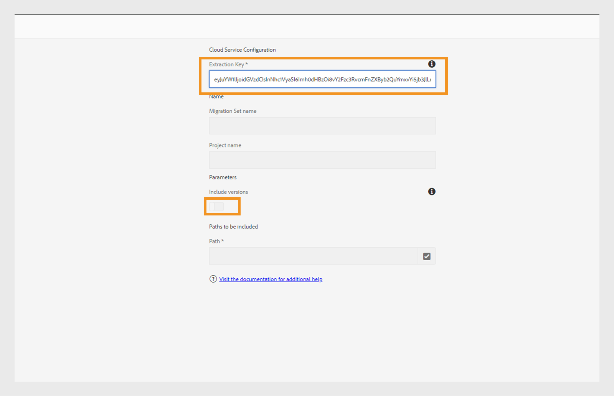

# Migrieren von Inhalten von On-Premise zu Cloud Service

Experience Manager as a Cloud Service bietet eine skalierbare, sichere und agile Technologiegrundlage für Experience Manager Guides, Assets, Forms und Screens. Dadurch können sich Marketing-Experten und IT-Experten darauf konzentrieren, effektive Erlebnisse in großem Maßstab bereitzustellen.
Mit Experience Manager as a Cloud Service können sich Ihre Teams auf Innovationen konzentrieren, anstatt Produktaktualisierungen planen zu müssen. Neue Produktfunktionen werden umfassend getestet und ohne Unterbrechung an Ihre Teams geliefert, damit sie immer auf die neueste Version von Adobe Experience Manager zugreifen können.

Dieser Artikel bietet einen detaillierten Schritt-für-Schritt-Prozess für die Migration Ihrer On-Premise- oder Managed Services Experience Manager Guides-Inhalte auf Cloud Service, um einen reibungslosen Übergang zur Cloud-basierten Plattform zu gewährleisten.

## Anforderungen

* Adobe Experience Manager 6.4 oder höher
* Experience Manager Guides sollte die UUID-Version verwenden. Wenn Sie eine Nicht-UUID-Version von Adobe Experience Manager Guides verwenden, migrieren Sie zunächst mithilfe der Schritte unter [Nicht-DITA-Inhalt migrieren](../install-guide/migrate-uuid-non-uuid.md) zu UUID.
* Zugriff auf **Cloud Acceleration Manager** für die Cloud-Instanz, in die Sie den Inhalt migrieren möchten
* Bis zu 20 TB Repository-Größe wird unterstützt
* Gesamtgröße des Lucene-Index von 25 GB
* Die Länge eines Knotennamens muss weniger als 150 Byte betragen

## Migrationsprozess

Das **Content Transfer Tool** ist ein von Adobe entwickeltes Tool, mit dem Sie die Migration vorhandener Inhalte von einer Adobe Experience Manager On-Premise- oder Managed Services-Quellinstanz in die Ziel-Experience Manager Cloud Service-Instanz initiieren können.
Dieses Tool überträgt auch Prinzipale (Benutzende oder Gruppen) automatisch.

Sie können das **Content Transfer Tool** als ZIP-Datei vom Portal **Software Distribution** herunterladen:

1. Wählen Sie die Registerkarte **AEM as a Cloud Service** im Portal **Softwareverteilung** aus.
1. Suchen Sie das **Content Transfer Tool**.
1. Wählen Sie **Content Transfer Tool** aus der Liste aus und laden Sie es herunter.

Installieren Sie dann das Paket über den **Package Manager** auf Ihrer Adobe Experience Manager-Quellinstanz. Laden Sie unbedingt die neueste Version herunter.
Weitere Informationen zur neuesten Version finden Sie unter [Versionshinweise](https://experienceleague.adobe.com/docs/experience-manager-cloud-service/content/release-notes/release-notes/release-notes-current.html?lang=en).

>[!NOTE]
> 
> Es wird nur Version 2.0.0 und höher unterstützt. Es wird empfohlen, die neueste Version zu verwenden.

Führen Sie die folgenden Schritte aus, um Experience Manager Guides-Inhalte in Experience Manager as a Cloud Service zu migrieren.

1. Melden Sie sich bei [experience.adobe.com](https://experience.adobe.com/) an und wählen Sie **Experience Manager** aus.

   

1. Klicken Sie auf der Kachel **Cloud Acceleration Manager** auf **Launch** .
   

1. Erstellen Sie Ihr erstes Projekt.
   

1. Fügen Sie den Namen und die Beschreibung hinzu und klicken Sie auf **Erstellen**. Ihr Projekt wird erstellt.
1. Wählen Sie das erstellte Projekt aus und öffnen Sie den Projektbildschirm.
1. Klicken Sie auf der Kachel **Inhaltstransfer** auf **Überprüfen** .

   

1. Klicken Sie auf **Migrationssatz erstellen**.

1. Geben Sie den Namen und die Beschreibung für den Migrationssatz an.

   

1. Wählen Sie nach der Erstellung die drei Punkte aus und wählen Sie **Extraktionsschlüssel kopieren**.

1. Klicken Sie auf **In die Zwischenablage kopieren**. Erstellen Sie Ihr erstes Projekt.
   

1. Wählen Sie oben **Adobe Experience Manager** und dann die Kachel **Softwareverteilung** aus.
   

1. Wählen Sie im Portal **Softwareverteilung** den Tab **Adobe Experience Manager als Cloud Service** aus, suchen Sie nach &quot;Content Transfer Tool&quot;und laden Sie das Tool-Paket für die Inhaltsübertragung herunter.

   >[!NOTE]
   >
   >  Stellen Sie sicher, dass Sie die neueste Version herunterladen.

1. Laden Sie das Paket `content-transfer.all-3.0.10.zip` in den **Package Manager** Ihrer On-Premise-Instanz hoch und installieren Sie es.
   

1. Wählen Sie in der On-Premise-Instanz **Tools** > **Vorgänge** > **Inhaltsmigration** > **Inhaltstransfer** aus.

1. Wählen Sie **Inhaltstransfer** aus, erstellen Sie einen Migrationssatz und fügen Sie den Extraktionsschlüssel ein, der aus dem Cloud-Beschleunigungs-Manager kopiert wurde. Dadurch wird eine Verbindung zwischen Quelle und Ziel hergestellt. Anschließend wird der Schlüssel überprüft und die Gültigkeit nach Eingabe des Werts angezeigt.

1. Aktivieren Sie die Option **Versionen einschließen** , um die Dateiversionen einzuschließen.
   

1. Geben Sie den Pfad an, den Sie migrieren möchten, und klicken Sie auf **Speichern**.
Beispiel: `/content/sites`
oder
   `/content/dam/tech-docs`
   

   >[!NOTE]
   >
   > Sie müssen die folgenden Pfade obligatorisch für **Experience Manager Guides**-Inhalte migrieren.

   * `/content/dam`
   * `/var/dxml`

   Die folgenden Pfade sind beim Erstellen eines Migrationssatzes eingeschränkt:
   * `/apps`
   * `/libs`
   * `/home`
   * `/etc` Sie dürfen einige `/etc` Pfade in der CTT auswählen.

1. Klicken Sie auf **Speichern**.
1. Wählen Sie den **Migrationssatz** und dann oben **Extrahieren** aus.
   

1. Überprüfen Sie die Details im Popup **Extraktion des Migrationssatzes** für die ausgewählten Pfade und Konfigurationen und klicken Sie auf **Extrahieren**. Die Extraktion dauert Minuten, und der Status wird als aktualisiert angezeigt.
   

1. Nachdem die Extraktion abgeschlossen ist und durch den Status &quot;`finished`&quot; gekennzeichnet ist, gehen Sie zu Cloud Acceleration Manager und wählen Sie das in Schritt 18 erstellte Projekt aus.
Wählen Sie für weitere Informationen die drei Punkte aus und klicken Sie dann auf **Details anzeigen**.

1. Überprüfen Sie im Popup mit den Details zum Migrationssatz die Konfiguration des Migrationssatzes und schließen Sie das Popup-Fenster. Sie können die Pfade und andere Einstellungen anzeigen, wie im folgenden Screenshot gezeigt:
   

1. Klicken Sie auf **Aufnahmevorgänge** > **Neue Aufnahme**.
1. Bestätigen Sie die erforderlichen Kontrollkästchenwerte und klicken Sie dann auf **Erstellen**.
   

1. Wählen Sie den Migrationssatz aus, wählen Sie den erforderlichen Server Ihrer Umgebung aus und klicken Sie auf **Aufnehmen**.

   

## Ausführen des Content Transfer Tool auf einer Publish-Instanz

Installieren Sie das Content Transfer Tool auf der Publish-Quellinstanz, um Inhalte in die Publish-Zielinstanz zu verschieben.
Das Content Transfer Tool unterscheidet nicht zwischen veröffentlichten und nicht veröffentlichten Inhalten bei der Aufnahme von Inhalten in eine Publish-Umgebung. Der im Migrationssatz angegebene Inhalt wird in die ausgewählte Zielinstanz aufgenommen. Der Benutzer kann einen Migrationssatz in eine -Autoreninstanz, Publish-Instanz oder beides erfassen.

### Empfohlener Ansatz

Beachten Sie die folgenden Empfehlungen:

* Verwenden Sie dieselbe Version des **Content Transfer Tool** , das in der -Autoreninstanz verwendet wurde.
* Während der Aufnahme in Publish wird die Publish-Ebene nicht herunterskaliert (im Gegensatz zum Autor).
* Migrieren Sie nur einen einzelnen Publish-Knoten. Bevor Sie mit der Extraktion beginnen, entfernen Sie sie aus dem Lastenausgleich.

>[!NOTE]
>
> Als Vorsichtsmaßnahme sollten Sie sicherstellen, dass keine Schreibvorgänge auf den Publish-Instanzen stattfinden, einschließlich benutzerinitiierter Aktionen wie:
> * Inhaltsverteilung von der AEM as a Cloud Service-Autoren- zur Veröffentlichungsumgebung
> * Benutzersynchronisierung zwischen Publish-Instanzen

## Fehlerbehebung

Wenn die Extraktion aufgrund des folgenden Fehlers fehlschlägt, können Sie dies durch Importieren des entsprechenden Zertifizierungsstelle-Zertifikats beheben:

`javax.net.ssl.SSLHandshakeException: sun.security.validator.ValidatorException: PKIX path building failed: sun.security.provider.certpath.SunCertPathBuilderException: unable to find valid certification path to requested target`

**Grund**: Der Adobe Experience Manager-Server verfügt über Firewall-Einschränkungen. Fügen Sie daher den folgenden Endpunkt zur Zulassungsliste hinzu.

`casstorageprod.blob.core.windows.net`

*Aktivieren Sie die SSL-Protokollierung.*

