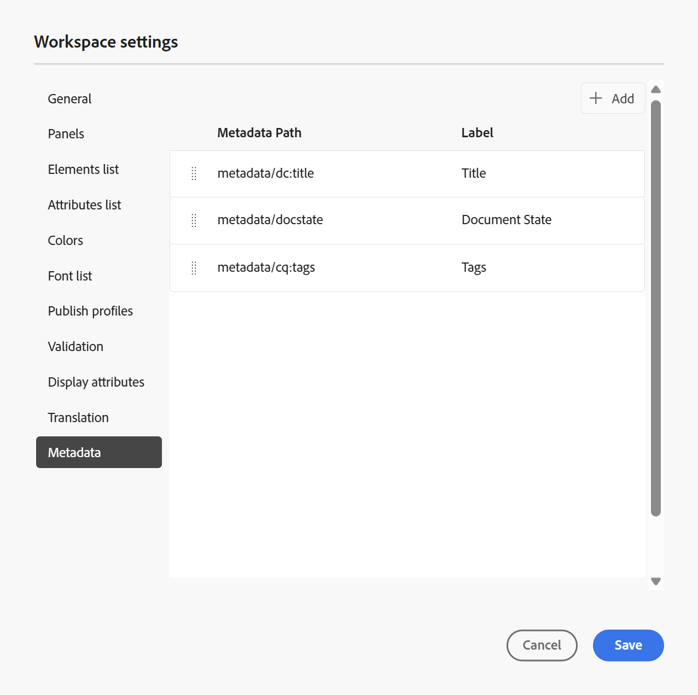

# Workspace-Einstellungen

Die Option **Workspace** in der [Registerkartenleiste](../user-guide/web-editor-tab-bar.md) des Editors ist nur für Administratoren und Ordnerprofiladministratoren verfügbar und ermöglicht die Konfiguration der folgenden Einstellungen:

- [Allgemein](#general)
- [Bedienfelder](#panels)
- [Liste der Elemente](#elements-list)
- [Attributliste](#attributes-list)
- [Farben](#colors)
- [Profile veröffentlichen](#publish-profiles)
- [Validierung](#validation)
- [Attribute anzeigen](#display-attributes)
- [Übersetzung](#translation)
- [Metadaten](#metadata)

>[!NOTE]
>
> - Wenn Sie die Adobe Experience Manager Guides in einem On-Premise-Setup verwenden, wird die Option Workspace-Einstellungen weiterhin als **Einstellungen** im Menü Mehr Aktionen angezeigt.
> - Wenn Sie Standardeinstellungen aktualisieren, sollten Sie die Dokumente erneut öffnen, damit die Änderungen wirksam werden.

## Allgemein

Mit den allgemeinen Einstellungen können Sie die Einstellungen so konfigurieren, dass der Editor verwendet wird. Diese Registerkarte enthält fünf Abschnitte: **KI-Assistent**, **Authoring**, **Zitate**, **Bedingung** und **Rechtschreibprüfung**.

{width="350" align="left"}

- **KI-Assistent**
Wählen Sie diese Option aus, um die Funktion [KI](../user-guide/ai-assistant.md)Assistent“ in der Experience Manager Guides zu aktivieren. Deaktivieren Sie diese Option, um die Funktion zu deaktivieren.

  Nach der Aktivierung des Umschalters **KI** Assistent) können Sie mithilfe des Menüs **Authoring-Schnellaktionen** konfigurieren, welche Optionen auf der Registerkarte **Authoring** für Autoren angezeigt werden.\
  Diese Änderungen gelten für das jeweilige Ordnerprofil, mit dem Sie arbeiten. Wenn Sie ein neues Ordnerprofil erstellen, übernimmt es standardmäßig die Workspace-Einstellungen, die im Ordnerprofil **Global** definiert sind. Sie können diese Einstellungen nach Bedarf mit den **Workspace-Einstellungen ändern** die aktualisierte Konfiguration speichern.\
  Einen detaillierten Überblick über die verfügbaren Optionen für das Authoring mit dem KI-Assistenten finden Sie unter [Authoring von Dokumenten mit dem KI-Assistenten](../user-guide/ai-assistant-right-panel.md).

  Über das **Authoring-Schnellaktionen**-Menü haben Sie folgende Möglichkeiten:

   - Verwenden Sie die Umschalter, um bestimmte Optionen zu aktivieren oder zu deaktivieren, auf die Autoren bei der Arbeit mit dem KI-Assistenten zugreifen können.

   - Ändern Sie die Reihenfolge, in der die Optionen angezeigt werden, und ziehen Sie sie per Drag-and-Drop nach Bedarf.

  {width="350" align="left"}

- **Authoring**

   - **Alle ersetzen aktivieren**: Wählen Sie diese Option aus, um das Symbol **Alle ersetzen** im Bedienfeld **Suchen und Ersetzen** anzuzeigen.

- **Zitate**

  Ändern des Stils von Zitaten. Wählen Sie in der Dropdown-Liste den Zitatstil aus, den Sie in Ihrem Projekt verwenden möchten. Weitere Informationen finden Sie unter [Ändern von &#x200B;](../user-guide/web-editor-apply-citations.md#change-citation-style).

- **Bedingung**

   - **Bedingten Text in der Autorenansicht hervorheben**: Wählen Sie diese Option, um den bedingten Text in der Autorenansicht hervorzuheben. Der bedingte Inhalt wird mit der für die Bedingung definierten Farbe hervorgehoben.

   - **Mit Bedingungsattributen validieren**: Wählen Sie diese Option, um die Validierung der für die Attribute definierten Werte zu ermöglichen. Dadurch wird verhindert, dass Sie einen falschen Wert hinzufügen.

   - **Schlüssel mit Titel im Bedienfeld „Betreffschema“ anzeigen**: Wählen Sie diese Option, um die Schlüssel zusammen mit Titeln im Betreffschema anzuzeigen. Wenn Sie diese Option nicht auswählen, werden nur die Titel angezeigt. Hier werden beispielsweise die Schlüssel „os“, „audience“ und „other“ zusammen mit Titeln angezeigt.

     {width="550" align="left"}

   - **Betreffschema im Bedienfeld Bedingungen anzeigen**: Wählen Sie diese Option, um ein Betreffschema im Bedienfeld Bedingungen anzuzeigen. Wenn Sie diese Option deaktivieren, werden die definierten Bedingungen im Bedienfeld Bedingungen angezeigt.

- **Rechtschreibprüfung**
Es gibt zwei Optionen: **AEM-** und **Browser-Rechtschreibprüfung**. Standardmäßig verwendet der Editor die Rechtschreibprüfung des Browsers, wobei die Rechtschreibprüfung mit dem integrierten Wörterbuch des Browsers durchgeführt wird. Sie können zur AEM-Rechtschreibprüfung wechseln, um das Adobe Experience Manager-Wörterbuch zu verwenden, das auch angepasst werden kann, um Ihre benutzerdefinierte Wortliste hinzuzufügen. Weitere Informationen zum Anpassen des AEM-Wörterbuchs finden Sie [&#x200B; Abschnitt „Anpassen des Standardwörterbuchs von AEM](../cs-install-guide/customize-aem-custom-dictionary.md) im Abschnitt Installieren und Konfigurieren von Adobe Experience Manager Guides as a Cloud Service.

## Bedienfelder

Mit dieser Einstellung werden die Bereiche gesteuert, die im linken und rechten Bereich der Editor- und Zuordnungskonsole angezeigt werden. Sie können die Schaltfläche umschalten, um das gewünschte Bedienfeld ein- oder auszublenden.

{width="650" align="left"}

Sie können auch die Reihenfolge festlegen, in der die in Bedienfeldern vorhandenen Funktionen angezeigt werden. Um die Standardreihenfolge der verfügbaren Funktionen in den Bedienfeldern zu ändern, wählen Sie die gepunkteten Balken aus, um die Elementregisterkarten per Drag-and-Drop an die gewünschte Position zu ziehen. Ein Feature kann je nach Anforderung auch vom **Mehr**-Abschnitt in den Hauptabschnitt eines Bedienfelds und umgekehrt verschoben werden. Nach der Neuanordnung erscheinen die Funktionen im entsprechenden rechten und linken Bedienfeld in der gleichen Reihenfolge.

{width="650" align="left"}

Es können maximal acht Bedienfelder gleichzeitig angezeigt werden. Alle Änderungen an den Bedienfeldeinstellungen werden sofort übernommen.

>[!NOTE]
>
> Wenn ein benutzerdefiniertes Bedienfeld konfiguriert wurde, wird es auch in der Liste der Bedienfelder angezeigt. Sie können den Schalter umschalten, um das benutzerdefinierte Bedienfeld ein- oder auszublenden.

## Liste der Elemente

Als Admin können Sie die Liste der Elemente steuern, die ein Autor in eine Datei einfügen kann, und auch den Anzeigenamen für das Element definieren. Mit der Einstellung Elementliste können Sie den Elementnamen gemäß DITA-Spezifikationen und eine Beschriftung angeben, die Sie anstelle des von DITA definierten Elementnamens verwenden möchten:

{width="650" align="left"}

Im obigen Screenshot wurde dem `p`-Element eine Beschriftung mit Absatz und `codeblock` neben einigen anderen Elementen eine Beschriftung mit Codeblock zugewiesen. Wenn Sie die Option **Nur Elemente oben verwenden** auswählen, werden nur die gültigen Elemente \(bei der aktuellen Einfügemarke\) aus dieser Liste im Dialogfeld **Element einfügen** angezeigt.

Im folgenden Screenshot werden nur 3 von 4 konfigurierten Elementen aus dem vorherigen Screenshot im aktuellen Kontext angezeigt:

{width="300" align="left"}

## Attributliste

Ähnlich wie bei der Elementliste können Sie die Liste der Attribute und deren Anzeigenamen steuern, die in der Attributliste eines Elements angezeigt werden sollen. Im folgenden Screenshot wurden nur drei Attribute so konfiguriert, dass sie in der Attributliste eines Elements angezeigt werden:

{width="650" align="left"}

Bei dieser Einstellung wird beim Versuch, einem Element ein Attribut hinzuzufügen, nur die Liste der in der Liste konfigurierten Attribute angezeigt.

{width="300" align="left"}

## Farben

Zeigt eine Liste der vorkonfigurierten Hintergrundfarben für (**)**. Benutzer können beim Anwenden einer Bedingung auf ein Thema eine Hintergrundfarbe auswählen. Als Administrator können Sie auch benutzerdefinierte Hintergrundfarben erstellen und zur Liste hinzufügen. Um eine neue Farbe hinzuzufügen, geben Sie den gewünschten Namen in das Feld **Farbname** ein, wählen Sie eine benutzerdefinierte Farbe aus und klicken Sie auf das Symbol **+** . Die benutzerdefinierte Farbe wird am Ende der Farbliste angezeigt.

## Profile veröffentlichen

Enthält die Profile, mit denen die Ausgabe der **Wissensdatenbank** veröffentlicht werden kann. Sie können ein neues Profil für eine Ziel-Wissensdatenbank erstellen. Beispiel: Salesforce oder ServiceNow.

**Erstellen eines Salesforce-Profils**

**Voraussetzungen**

- Erstellen Sie eine verbundene App für Salesforce. Weitere Informationen finden Sie unter [OAuth-Einstellungen für API-Integration aktivieren](https://help.salesforce.com/s/articleView?id=sf.connected_app_create_api_integration.htm&type=5).

- Stellen Sie beim Konfigurieren der verbundenen App Folgendes sicher:

   - Geben Sie den Callback an.

     `URL: http://<server name>:<port>/bin/dxml/thirdparty/callback/salesforce`

   - Wählen Sie die folgenden OAuth-Bereiche aus:
      - Vollständiger Zugriff (vollständig)
      - Wählen Sie Benutzerdaten über APIs verwalten (API) aus

     Sobald die App konfiguriert ist, stellt Salesforce einen **Consumer Key** und **Consumer Secret** bereit. Diese können zum Erstellen des Salesforce-Profils verwendet werden.

   - Um ein Salesforce-Profil zu erstellen, wählen Sie die **Salesforce** Knowledge Base aus der Dropdown-Liste **Servertyp** aus. Geben Sie einen Profilnamen ein. Geben Sie **Site-URL** die Verbraucherwebsite ein, mit der Sie die Ausgabe veröffentlichen möchten, und fügen Sie dann den **Consumer Key** und **Consumer Secret** hinzu, die von der Salesforce-Verbraucherwebsite bereitgestellt werden. Wählen Sie dann **Validieren** und **Speichern** das neu erstellte Profil aus.

     {width="550" align="left"}

     >[!NOTE]
     >
     >Verwenden Sie zum Konfigurieren eines Proxys für Salesforce in Experience Manager Guides die Apache-HTTP-Komponenten-Proxy-Konfiguration in AEM. Erfahren Sie, wie [Proxy für den AEM Link Checker konfigurieren](https://helpx.adobe.com/experience-manager/kb/How-to-configure-proxy-for-the-AEM-Link-Checker-AEM.html).

**Erstellen eines ServiceNow-Profils**

**Voraussetzungen**

Konfigurieren Sie den ServiceNow-Server, um die Assets hochzuladen.

- Stellen Sie eine Verbindung mit dem **ServiceNow**-Server her.
- Navigieren Sie **Systemeigenschaften** > **Sicherheit**.
- Deaktivieren Sie die folgende Option:

  **Diese Eigenschaft muss so eingestellt sein, dass die MIME-Typprüfung für Uploads (alle Versionen von Eureka und höher) aktiviert wird. Aktiviert (true) oder deaktiviert (false) die Validierung des MIME-Typs für die Dateianhänge. Dateierweiterungen, die über glide.attachment.extensions konfiguriert werden, werden während des Uploads auf MIME-Typ überprüft.**

- Wählen Sie **Speichern** aus.

  Nachdem Sie die App konfiguriert haben, erstellen Sie das Profil **ServiceNow**.

- Um ein Profil zu erstellen, wählen Sie die ServiceNow-Wissensdatenbank aus der Dropdown-Liste **Servertyp** aus. Geben Sie ein Profil **Name** ein. Geben Sie unter **ServiceNow** URL die Verbraucherwebsite ein, die Sie für die Veröffentlichung der Ausgabe verwenden möchten, und fügen Sie dann den **Benutzernamen** und das **Kennwort** hinzu, die von der ServiceNow-Verbraucherwebsite bereitgestellt werden. Wählen Sie dann **Validieren** und **Speichern** das neu erstellte Profil aus.

  {width="550" align="left"}

  Nach der Validierung können Sie das Veröffentlichungsprofil in den Ausgabevorgaben einer DITA-Zuordnung auswählen und es zum Generieren der Ausgabe für den ausgewählten **Salesforce**- oder **ServiceNow**-Server verwenden.

  Erfahren Sie mehr über die [Wissensdatenbank](../user-guide/generate-output-knowledge-base.md)-Ausgabevorgabe.

## Validierung

Diese Registerkarte enthält Optionen zum Konfigurieren der Schematron-Validierungen im Editor. Sie können die folgenden Funktionen aktivieren:

- **Validierungsprüfung vor dem Speichern der Datei ausführen**: Wählen Sie diese Option, um vor einem Speichervorgang Schematron-Validierungen unter Verwendung der ausgewählten Schematron-Datei(en) auszuführen. Sie können eine Schematron-Datei hinzufügen, indem Sie auf das Symbol + klicken. Die ausgewählten Schematron-Dateien werden aufgelistet.

  >[!NOTE]
  >
  > Die ausgewählte(n) Schematron-Datei(en) bleiben für das ausgewählte Ordnerprofil erhalten.

  {width="550" align="left"}

  Dies verhindert, dass Benutzer eine Datei speichern, die gegen eine in der/den ausgewählten Schematron-Datei(en) definierte Regel verstößt. Wenn diese Option nicht ausgewählt ist, wird die Datei vor dem Speichern der Änderungen nicht validiert.

- **Zulassen, dass alle Benutzer Schematron-Dateien im Validierungsbereich hinzufügen**: Wählen Sie diese Option aus, damit die Benutzer im Validierungsbereich des Editors beliebige Schematron-Dateien hinzufügen können. Auf diese Weise können Benutzer Schematron-Dateien hinzufügen und dann die Themen anhand der Schematron-Datei validieren. Wenn diese Option nicht ausgewählt ist, steht die Schaltfläche zum Hinzufügen **Schematrondatei** Schematrondatei hinzufügen“ den Benutzenden im **Validierungsbereich** des Editors nicht zur Verfügung.

## Attribute anzeigen

Wie bei der Attributliste können Sie die Liste der Attribute steuern, die in der Attributliste eines Elements angezeigt werden sollen. Standardmäßig wurden vier **Anzeigeattribute** - Zielgruppe, Plattform, Produkt und Eigenschaften so konfiguriert, dass sie in der Attributliste eines Elements angezeigt werden. Sie können ein Anzeigeattribut auch mit dem Symbol **Hinzufügen** oben hinzufügen. Sie können auch jedes der Anzeigeattribute über das Symbol **Löschen** löschen.

Die für ein Element definierten Attribute werden im Layout- und Gliederungsansicht angezeigt.

{width="550" align="left"}

## Übersetzung

Diese Registerkarte enthält die Optionen zum Erstellen von Sprachgruppen, zum Übertragen der Quellkennzeichnungen in die Zielversion und zum Bereinigen des Übersetzungsprojekts.

{width="550" align="left"}

- **Sprachgruppen**: Als Administrator können Sie eine Gruppe von Sprachen erstellen und sie als Gruppe verwenden, um die Inhalte zu übersetzen.

  Führen Sie die folgenden Schritte aus, um eine neue Sprachgruppe zu erstellen:

   1. Wählen Sie **Hinzufügen** aus.
   1. Geben Sie den Namen der Sprachgruppe ein. Jede Sprache sollte einen eindeutigen Namen haben. Sie können einen Fehler anzeigen, wenn das Namensfeld leer oder der Name nicht eindeutig ist.
   1. Wählen Sie die Sprachen aus dem Dropdown-Menü aus. Sie können mehrere Sprachen auswählen.

      Geben Sie die ersten Zeichen der Sprache oder den Sprach-Code ein, um die gewünschten Sprachen zu filtern. Geben Sie beispielsweise „en“ ein, um alle Sprachen zu filtern, die „en“ am Anfang ihres Namens oder Codes enthalten.

   1. Wählen Sie das Symbol Fertig aus, um der Gruppe die ausgewählten Sprachen hinzuzufügen. Die Sprachen werden angezeigt. Wenn Sie drei oder mehr Sprachen hinzufügen, wird **Option „Mehr anzeigen** angezeigt. Sie können auf **Mehr anzeigen** klicken, um alle in der Gruppe vorhandenen Sprachen anzuzeigen.

      >[!TIP]
      >
      > Schalten Sie **Mehr anzeigen** auf **Weniger anzeigen** um und zeigen Sie nur einige Sprachen an.

   1. Bewegen Sie den Mauszeiger über die Sprachen in einer Gruppe, um Bearbeiten-Symbol.
   1. Speichern Sie die **Einstellungen**.

      >[!NOTE]
      >
      >Als Benutzer können Sie die für Ihr Ordnerprofil konfigurierten Sprachgruppen anzeigen.

- **Beschriftungen der Quellversion an die Zielversion weitergeben**: Wählen Sie diese Option, um den Titel der Quelldateiversion an die übersetzte Datei weiterzugeben. Standardmäßig ist dies deaktiviert.
- **Bereinigung des Übersetzungsprojekts nach Abschluss**: Wählen Sie diese Option, um die Übersetzungsprojekte so zu konfigurieren, dass sie nach der Übersetzung automatisch deaktiviert oder gelöscht werden. Standardmäßig ist **Keine** ausgewählt, sodass das Projekt nach der Übersetzung existiert.

  Sie können die Übersetzungsprojekte deaktivieren, wenn Sie sie später verwenden möchten. Durch das Löschen eines Projekts werden alle im Projekt vorhandenen Dateien und Ordner endgültig gelöscht.

## Metadaten

Sie können die Versionsmetadaten des Themas und ihre Werte steuern, die im Dialogfeld **Versionsverlauf** angezeigt werden.  Geben Sie im Metadatenpfad den Speicherort der Knoten an, aus denen Sie die Metadaten auswählen möchten. Sie können auch einen benutzerdefinierten Namen für die Metadaten als Beschriftung definieren. Die Standardeigenschaften sind Titel, Dokumentstatus und Tags.

Die Metadaten können aus jeder Eigenschaft unter dem `/jcr:content` des Assets ausgewählt werden, sodass Sie den Pfad der Eigenschaft als Metadatenpfad hinzufügen können.

Wenn der Metadatenpfad leer ist, wird ein Fehler angezeigt. Wenn Sie das Feld leer lassen, wird das letzte Element als Titel ausgewählt.

{width="550" align="left"}

*Konfigurieren der Metadaten für das Dialogfeld **Versionsverlauf**.*

Sie können auch die Reihenfolge festlegen, in der diese Metadaten-Tags angezeigt werden. Um die Standardreihenfolge dieser Tags zu ändern, wählen Sie die gepunkteten Balken aus, um die Tags per Drag-and-Drop an die gewünschte Position zu ziehen.
Die Metadatenbeschriftungen werden im Dialogfeld **Versionsverlauf** des Editors in derselben Reihenfolge angezeigt.

