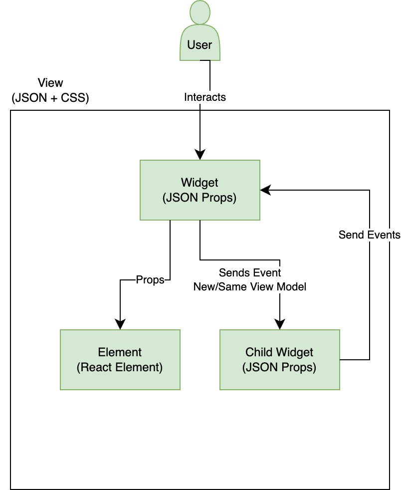
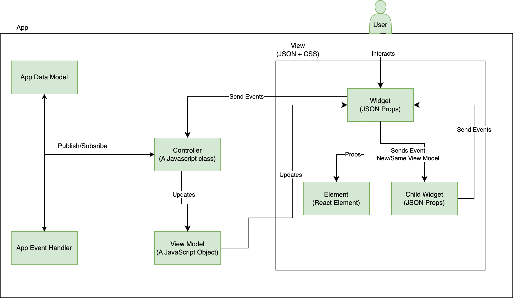

# JUI-Framework

Bevor wir uns mit dem Schreiben von Erweiterungen befassen, werden wir die Architektur des Frameworks verstehen.
Damit wir es effektiv verlängern können.

## Einführung

JUI ist ein MVC-Framework, das auf React- und Adobe React Spectrum-Komponenten aufbaut. JUI ist die JSON-Benutzeroberfläche. Es besteht aus mehreren Git-Repositorys.

JUI-Core ist die Kernbibliothek mit der gesamten Logik zum Konvertieren der JSON-Konfiguration in funktionierende React-Komponenten und zum Verknüpfen mit einer relevanten Controller-Klasseninstanz.
Die JUI-React-Spectrum-Bibliothek verfügt über Wrapper-Widgets von Adobe React Spectrum-Komponenten

## JUI-Kerndesign

### MVC-UI-Design

### Widget

- Hat eine eindeutige ID.
- Hat eine einzelne JSON-Datei zur Ansicht.
- Kann einen eigenen oder freigegebenen Controller haben.
- Kann übergeordnetes Modell oder neues Modell verwenden.
- Kann Benutzeroberflächenelemente (React-Komponenten) enthalten
- Kann andere Widgets haben
- App ist ein Widget

### Element

- ist eine HTML/React-Komponente.
- hat kein Modell, es verwendet das übergeordnete Widget-Modell.

### Ereignishandler

- Next(eventOpts)
   - Zum Trigger des Ereignisses mit einigen Optionen
- Subscribe(callback)
   - Benachrichtigung abrufen, dass das Ereignis mit der Konfiguration ausgelöst wird

### App/Globales Modell

- Next(neuer Wert)
   - So veröffentlichen Sie einen neuen Wert
- Subscribe(callback)
   - So rufen Sie eine Benachrichtigung über Wertänderung ab
   - Erster alter Wert
- GetValue()
   - Abrufen des aktuellen Werts

### Controller

- Sie sollte von der Controller-Klasse erweitert werden.
- APIs
- CreateModel
   - So erstellen Sie ein separates untergeordnetes Widget-Modell
- InitEventHandler
   - So erstellen Sie einen separaten Ereignishandler für untergeordnete Widgets
- RegistrierenBefehle
   - So registrieren Sie lokale, übergeordnete oder App-Ereignisse
- Next(eventName, eventHandler)
   - Zum Ereignisereignis des untergeordneten Widget-Ereignishandlers, des übergeordneten Widget-Ereignishandlers oder des App-Ereignishandlers
- Subscribe(callback, eventHandler)
- SubscribeAppModel(callback)

### Beispiel für App-Design

