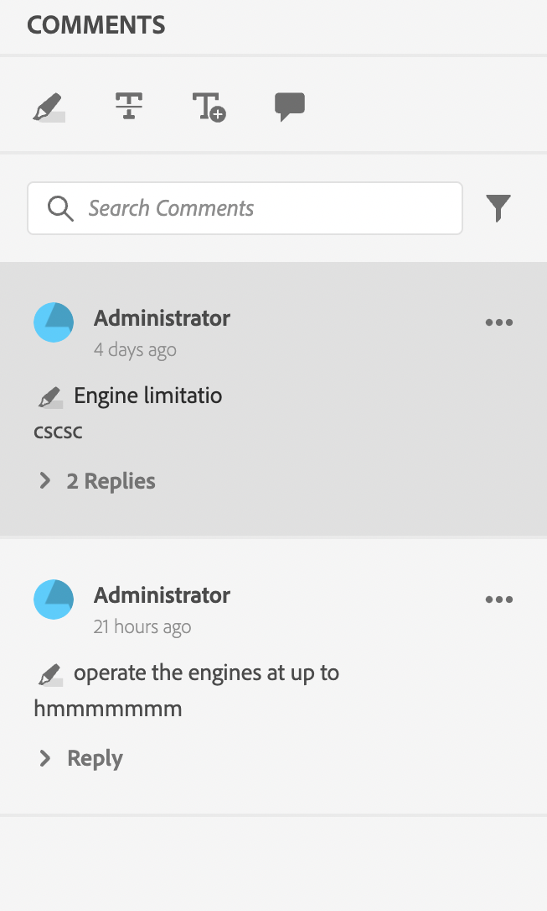
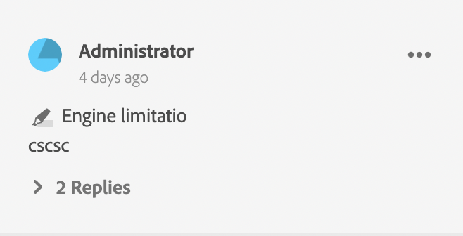
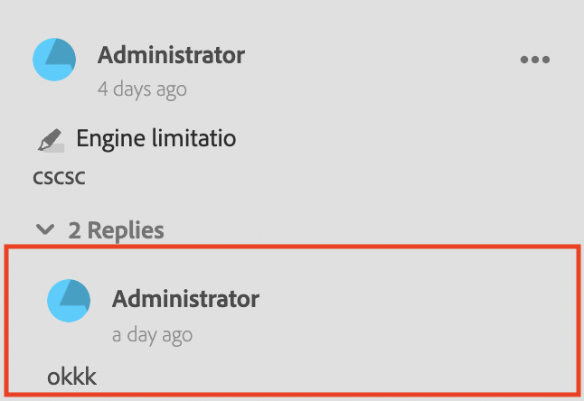

# Komponenten der Review-App

Im Folgenden finden Sie die wichtigsten Komponenten der Überprüfungs-App:

- Inline-Prüfungsbereich: `id: inline_review_panel`
   - Der rechte Bereich, in dem die Überprüfungskommentare auf der Seite des XML-Editors dargestellt werden.

- Themenüberprüfungen: `id: topic_reviews`
   - Der rechte Bereich, in dem die Kommentare in der Überprüfungs-App gerendert werden.

- Überprüfungskommentar: `id: review_comment`
   - Das Widget für jeden Prüfungskommentar.

Überprüfen Sie den Kommentar zur Überprüfungs-App:

Überprüfen Sie den Kommentar auf der Seite des XML-Editors:

- Kommentar-Antwort überprüfen: `id: comment_reply`
   - Das Widget für jede Reviewkommentar-Antwort.
     

- Neue Überprüfungskommentantwort: `id: comment_new_reply`
   - Das Widget für die Antwort auf neue Prüfungskommentare.
     

- Anmerkungs-Toolbox: `id: annotation_toolbox`
   - Die obere rechte Symbolleiste der Überprüfungs-App.
     
