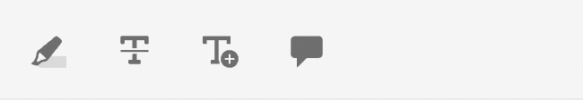

# Komponenten der Überprüfungs-App

Im Folgenden finden Sie die Hauptkomponenten der Überprüfungs-App:

- Inline-Überprüfungsfeld: `id: inline_review_panel`
   - Das rechte Bedienfeld, in dem die Überprüfungskommentare im XML-Editor gerendert werden.

- Themen-Rezensionen: `id: topic_reviews`
   - Das rechte Bedienfeld, in dem die Kommentare in der Überprüfungs-App gerendert werden.

- Kommentar überprüfen: `id: review_comment`
   - Das Widget für jeden Überprüfungskommentar.

Kommentar zur Überprüfungs-App überprüfen:

Kommentar zur Seite des XML-Editors überprüfen:

- Kommentar überprüfen Antwort: `id: comment_reply`
   - Das Widget für jede Überprüfungskommentarantwort.
     

- Antwort zum neuen Überprüfungskommentar: `id: comment_new_reply`
   - Das Widget für eine neue Überprüfungskommentarantwort.
     

- Anmerkungs-Toolbox: `id: annotation_toolbox`
   - Die Symbolleiste oben rechts in der Überprüfungs-App.
     
