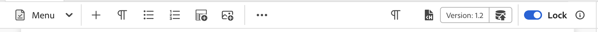

# Anpassen von Symbolleiste und Symbolleiste

Um die `topbar` und die `toolbar` anzupassen, können Sie die IDs `topbar` oder `toolbar` verwenden und derselben Ansicht bzw. Controllerstruktur folgen.

>[!NOTE]
>
>Ab Experience Manager Guides-Version 2502 wurde die ID **Symbolleiste** in &quot;**-Symbolleiste“**. Wenn Sie die vorherigen Versionen verwenden, können Sie die Symbolleiste mit der ID **Symbolleiste** anpassen. Wir haben jetzt keine ID als **topbar** und verfügen über eine **editor_tab_bar**.

Nachfolgend finden Sie ein triviales Beispiel für die Anpassung von Symbolleisten. Hier haben wir die Schaltfläche `Insert Numbered List` entfernt und die Schaltfläche `Insert Paragraph` durch unsere eigene Komponente ersetzt, indem ein benutzerdefinierter On-Click-Handler verwendet wurde.

>[!TIP]
>
>Da **editor_toolbar** für das Rendern von Schaltflächen entwickelt wurde, kann das Hinzufügen von Widgets die CSS- und Reaktionsfähigkeit beeinträchtigen. Es wird empfohlen, nur Schaltflächen oder grundlegende Komponenten wie eine Beschriftung einzubeziehen.

Um auf Funktionen zugreifen zu können, die unter dem `proxy`-Objekt verfügbar gemacht werden, müssen Sie mithilfe von `this.getValue` darauf zugreifen, z. B. um einen Wert abzurufen.

Ab AEM Guides Version 2502 können Sie im folgenden Beispiel die Anpassung der Symbolleiste erläutern.

```js title = toolbar_customization.js
const toolbarExtend = {
    id: "editor_toolbar",
    view: {
        items: [
            {
                component: "div",
                target: {
                    key:"title",value: "Insert Numbered List",                    
                    viewState: VIEW_STATE.REPLACE
                }
            },
            {
                "component": "button",
                "icon": "textParagraph",
                "variant": "action",
                "quiet": true,
                "title": "Insert Paragraph",
                "on-click": "INSERT_P",
                target: {
                    key:"title",value: "Insert Paragraph",                    
                    viewState: VIEW_STATE.REPLACE
                }
            },
            {
                "component": "button",
                "icon": "fileHTML",
                "variant": "action",
                "quiet": true,
                "title": "URL Link Customization",
                "on-click": "openExternalLinkDialog",
                target: {
                key: "title", value: "Insert Bulleted List",
                viewState: VIEW_STATE.REPLACE
                }
            }
        ]
    },
    controller: {
        init: function() {
            console.log(this.getValue("canUndo"))
            this.subscribeAppEvent({
              key: "editor.preview_rendered",
              next: async function (e) {
                console.log(this.getValue("canUndo"))
              }.bind(this)
            })
        },
        INSERT_P(){
            this.appEventHandlerNext("AUTHOR_INSERT_ELEMENT",  "p" )
        },
        openExternalLinkDialog() {
            this.appEventHandlerNext("AUTHOR_INSERT_ELEMENT",
                {
                args: "<xref href='' scope='external' format = 'dita' ></xref>", activeTabId: "conkey_reference"
                }
            )
        }
    }
}
```


Nach der Anpassung kann die endgültige Ausgabe wie folgt angezeigt werden:



Siehe folgendes Beispiel für das Anpassen der Symbolleiste in AEM Guides Version 4.6.x und früheren Versionen.

```js title = toolbar_customization.js
const topbarExtend = {
    id: "toolbar",
    view: {
        items: [
            {
                component: "div",
                target: {
                    key:"title",value: "Insert Element",                    
                    viewState: VIEW_STATE.REPLACE
                }
            },
            {
                component: "div",
                target: {
                    key:"title",value: "Insert Paragraph",                    
                    viewState: VIEW_STATE.REPLACE
                }
            },
            {
                component: "div",
                target: {
                    key:"title",value: "Insert Numbered List",                    
                    viewState: VIEW_STATE.REPLACE
                }
            },
            {
                component: "div",
                target: {
                    key:"title",value: "Insert Bulleted List",                    
                    viewState: VIEW_STATE.REPLACE
                }
            },
            {
                "component": "button",
                "extraclass": "insert-multimedia",
                "icon": "more",
                "variant": "action",
                "quiet": true,
                "holdAffordance": true,
                "title": "More Insert Options",
                "elementID": "toolbar_insert",
                "on-click": {
                    "name": "APP_SHOW_OPTIONS_POPOVER",
                    "args":{
                        "target": "toolbar_insert",
                        "extraclass": "new_options_buttons",
                        "items": [
                            {
                                "component": "button",
                                "icon": "add",
                                "variant": "action",
                                "quiet": true,
                                "title": "Insert Element",
                                "on-click": "AUTHOR_SHOW_INSERT_ELEMENT_UI"
                            },
                            {
                                "component": "button",
                                "icon": "textParagraph",
                                "variant": "action",
                                "quiet": true,
                                "title": "Insert Paragraph",
                                "on-click": "INSERT_P"
                            },
                            {
                                "component": "button",
                                "icon": "textNumbered",
                                "variant": "action",
                                "quiet": true,
                                "title": "Insert Numbered List",
                                "on-click": "AUTHOR_INSERT_REMOVE_NUMBERED_LIST"
                            },
                            {
                                "component": "button",
                                "icon": "textBulleted",
                                "variant": "action",
                                "quiet": true,
                                "title": "Insert Bulleted List",
                                "on-click": "AUTHOR_INSERT_REMOVE_BULLETED_LIST"
                            },
                            {
                                "component": "button",
                                "icon": "table",
                                "variant": "action",
                                "quiet": true,
                                "title": "Insert Table",
                                "on-click": "AUTHOR_INSERT_ELEMENT",
                            }
                        ]
                    },
                },
                target: {
                    key:"title",value: "Insert Table",                    
                    viewState: VIEW_STATE.REPLACE
                }
            },
        ]
    },
    controller: {
        init() {
            console.log(this.proxy.getValue('canUndo'))
            this.proxy.subscribeAppEvent({
                key: "editor.preview_rendered",
                next: async function (e) {
                    console.log(this.proxy.getValue('canUndo'))
                }.bind(this)
            })
        },
        INSERT_P(){
            this.next("AUTHOR_INSERT_ELEMENT",  "p" )
        }
    }
}
```

Nach der Anpassung kann die endgültige Ausgabe wie folgt angezeigt werden:


In einem anderen Beispiel erstellen wir eine benutzerdefinierte Symbolleistenschaltfläche, die direkt zu den gewünschten Unteroptionen von **Querverweis** wie E-Mail, Dateiverweis, Weblink usw. springen kann.


```js title = toolbar_customisation.js
const toolbarExtend = {
    id: "editor_toolbar",
    view: {
        items: [
            
                {
                    "component": "button",
                    "icon": "fileHTML",
                    "variant": "action",
                    "quiet": true,
                    "title": "External URL Link",
                    "on-click": "openExternalLinkDialogP",
            
                target: {
                    key:"title",value: "Insert Bulleted List",                    
                    viewState: VIEW_STATE.REPLACE
                }
            }
        ]
    },
    controller: {
        openExternalLinkDialog() {
            tcx.eventHandler.next ("AUTHOR_INSERT_ELEMENT")
            t{
          args:"<xref href='' scope='external' format = 'dita' ></xref>",activeTabId:"conkey_reference"
        }
    }
  }
}
```

Hier `activeTabId` die Aufzählung zur Auswahl der richtigen Registerkarte. Standardmäßig wird durch Auswahl der Registerkarte Querverweis `file_link` geöffnet. Sie können die `activeTabId` je nach Anforderung in `content_reference`, `conkey_reference`, `key_reference`, `file_link`, `web_link` und ` email_link` ändern.
