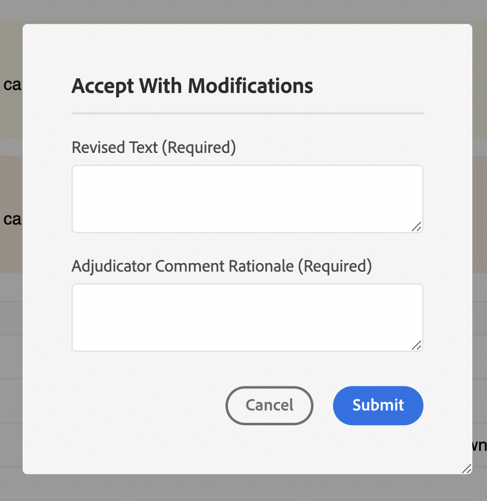

# Beispiele

In diesem Paket haben wir auch einige Anpassungsbeispiele bereitgestellt (verfügbar unter `guides_extension/src`) . Nachstehend finden Sie eine kurze Beschreibung für jeden dieser Punkte.

1. [Kontextmenü](./examples/file_options.ts)
In diesem Beispiel haben wir das `file_options` Kontextmenü angepasst, um die Optionen `Delete` und `Edit` zu entfernen und die Option `Duplicate` durch eine `Download` Option zu ersetzen.

2. [Linkes Bedienfeld](./examples/left_panel_container.ts)
In diesem Beispiel haben wir die `left tab panel` so angepasst, dass sie eine weitere `tab` mit dem Titel „TESTERWEITERUNG“ und einen entsprechenden `tab panel` mit der Bezeichnung `Test Tab Panel` enthält.

3. [Rechtes Bedienfeld](./examples/right_panel_container.ts)
In diesem Beispiel haben wir die `right tab panel` so angepasst, dass sie eine weitere `tab` mit dem Titel „TESTERWEITERUNG“ und einen entsprechenden `tab panel` mit einer Kennzeichnung enthält: `New Tab Panel`

4. [Repository-Bedienfeld](./examples/repository_panel.ts)

5. [Symbolleiste](./examples/toolbar.ts)
In diesem Beispiel haben wir die Schaltflächen `Insert Element`, `Insert Paragraph`, `Insert Numbered List`, `Insert Bulleted List` durch eine einzige `More Insert Options` ersetzt, die alle diese Schaltflächen enthält.

[Anwendungsbeispiele überprüfen]

1. [Anmerkungs-Toolbox](./examples/review_app_examples/annotation_extension.ts)
In diesem Beispiel haben wir der Anmerkungs-Toolbox eine weitere Schaltfläche hinzugefügt, die das aktuelle Prüfungsthema in AEM öffnet.

2. [Kommentar überprüfen](./examples/review_app_examples/review_comment.ts)
In diesem Beispiel haben wir den Benutzernamen durch Benutzerinformationen ersetzt (bestehend aus vollständigem Namen und Titel des Kommentars), eine eindeutige Kommentar-ID, ein MailTo-Symbol und Eingabefelder hinzugefügt, um den Schweregrad und die Begründung des Kommentars zu erwähnen.
Wir haben auch eine `accept with modification` Schaltfläche für Kommentare auf der XMLEditor-Seite hinzugefügt, die ein Dialogfeld öffnet.

3. [Antwort kommentieren](./examples/review_app_examples/comment_reply.ts)
In diesem Beispiel haben wir den Benutzernamen durch Benutzerinformationen ersetzt (bestehend aus vollständigem Namen und Titel des Kommentars) und ein MailTo-Symbol in der Kopfzeile des Kommentars hinzugefügt.

4. [Inline-Prüfungsbereich](./examples/review_app_examples/inline_review_panel.ts)
In dieser Datei berechnen und weisen wir die eindeutige Kommentar-ID zu, die in den `Review Comment` und `Comment Reply` Beispielen erwähnt wird.
   - Die `setCommentId` Methode legt die eindeutige Kommentar-ID für jeden Kommentar abhängig von der Anzahl der Kommentare fest.

   - Die `setUserInfo` legt den Wert von userInfo fest. Dabei werden für jeden Kommentar der vollständige Name und Titel verwendet.

   - Der `onNewCommentEvent` stellt sicher, dass für jeden neuen Kommentar oder jede neue Antwort die `setUserInfo` Methode aufgerufen wird.

   - Die Funktion `updatedProcessComments` wird für jedes neue Kommentarereignis ausgeführt und stellt sicher, dass `setCommentId` aufgerufen wird, wenn ein neues Kommentarereignis eintritt.

5. [Bedienfeld „Topic Reviews](./examples/review_app_examples/topic_reviews.ts): Diese Datei erweitert [Inline-Überprüfungsfeld](./examples/review_app_examples/inline_review_panel.ts) so, dass hinzugefügte Anpassungen auch auf der Seite der Überprüfungsanwendung funktionieren.

6. [Akzeptieren mit Dialogfeld „Änderung“](./examples/review_app_examples/accept_with_modification_dialog.ts)
Dies ist ein Beispiel für das Hinzufügen neuer Widgets zur App. Hier haben wir ein neues Dialogfeld erstellt, das zwei Eingabetextfelder enthält: `Revised Text` und `Adjudicator Comment Rationale`

7. [Revision speichern](./examples/save_revision.ts)
Dies ist ein Beispiel für die Aktualisierung eines vorhandenen Dialogfelds. Wir fügen in diesem eine Schaltfläche für die Veröffentlichung hinzu. Wir erlauben die Änderung des Inhalts des Dialogs. Siehe die zugehörige JSON-Datei hier: [`save_revision`](./jsons/dialogs/save_revision.json)

Hier finden Sie das Überprüfungsfenster vor und nach der Anpassung:

