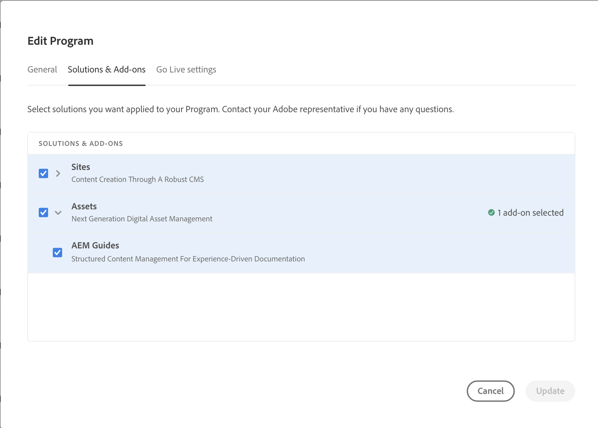

# Bereitstellung und Dispatcher-Konfiguration

Dieser Artikel enthält Informationen zum Bereitstellen von Experience Manager Guides as a Cloud Service und Konfigurieren des Dispatchers.

## Bereitstellen von Experience Manager Guides as a Cloud Service

Sie können Experience Manager Guides zunächst über die Cloud Manager bereitstellen. Um das Modul bereitzustellen, befolgen Sie die unter [Bereitstellung von AEM Guides as a Cloud Service](../release-info/deploy-xml-on-aemaacs.md) erwähnten Anweisungen.

>[!NOTE]
>
> Ab Version 2024.2.0 ist Experience Manager Guides nur noch als automatisiertes Add-on für Experience Manager as a Cloud Service verfügbar. Wenn Sie die Version vom Dezember 2023 oder frühere Versionen verwenden, können Sie die Adobe Experience Manager Guides aus dem GitHub-Repository herunterladen und installieren. Wenn Sie manuelle Bereitstellungen für Experience Manager Guides verwenden, entfernen Sie die `<module>dox.installer</module> from file dox/pom.xml` in Ihrer Cloud Manager-Git-Codebasis, bevor Sie Experience Manager Guides für Ihr Programm aktivieren.

Führen Sie die folgenden Schritte aus, um das Experience Manager Guides-Modul bereitzustellen:

1. Bei [!UICONTROL Cloud Manager anmelden].

1. Bearbeiten Sie das Programm, für das Sie [!DNL Experience Manager Guides] konfigurieren möchten.

1. Wechseln Sie zur Registerkarte **[!UICONTROL Lösungen und Add-ons]**.

1. Klicken Sie in **[!UICONTROL Tabelle „Lösungen und Add]** ons“ auf **[!UICONTROL Assets]**.

1. Wählen Sie **[!UICONTROL Guides]** und klicken Sie auf **[!UICONTROL Speichern]**.

Sie haben Ihr Programm erfolgreich für die automatische Bereitstellung der Experience Manager Guides-Lösung konfiguriert.

>[!NOTE]
>
>Um [!DNL Experience Manager Guides] in einer beliebigen Umgebung unter dem integrierten Programm zu installieren, müssen Sie die mit der Umgebung verknüpfte Pipeline ausführen. Für die Installation von [!DNL Experience Manager Guides] ist in Ihrer CM-Git-Codebasis keine zusätzliche Konfiguration erforderlich.

## Dispatcher konfigurieren

Dispatcher ist ein Tool von Adobe Experience Manager für das Zwischenspeichern und/oder den Lastenausgleich. Weitere Informationen finden Sie unter [Dispatcher in der Cloud](https://experienceleague.adobe.com/docs/experience-manager-cloud-service/implementing/content-delivery/disp-overview.html?lang=de).

1. Informationen zum Migrieren der Dispatcher-Konfiguration von AMS zu Cloud Service finden Sie unter [Migrieren der Dispatcher-Konfiguration von AMS zu AEM as a Cloud Service](https://experienceleague.adobe.com/docs/experience-manager-cloud-service/implementing/content-delivery/ams-aem.html?lang=de).
1. Weitere Informationen zum Konfigurieren des Dispatchers finden Sie unter [Konfigurieren von Dispatcher](https://experienceleague.adobe.com/docs/experience-manager-dispatcher/using/configuring/dispatcher-configuration.html?lang=de).

>[!NOTE]
>
> AEM as a Cloud Service unterstützt keinen Dispatcher für Autoreninstanzen.
