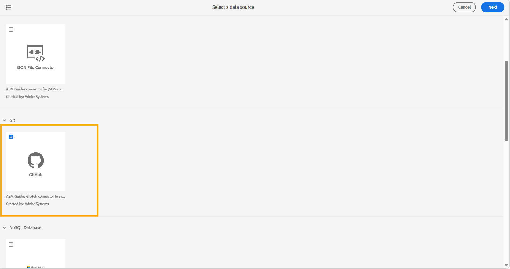

# Erstellen und Konfigurieren des Git-Connectors über die Benutzeroberfläche

Verwenden Sie das Datenquellen-Tool in Experience Manager Guides, um einen Git-Connector über die Benutzeroberfläche zu erstellen und zu konfigurieren. Nachdem Sie den Connector erfolgreich konfiguriert haben, können Sie ihn verwenden, um Inhalte aus einem Git-Repository in Experience Manager Guides zu importieren.

1. Wählen Sie oben den Link **Adobe Experience Manager** und dann **Tools** aus.
1. Wählen Sie **Guides** aus der Liste der Tools aus.
1. Wählen Sie die **Datenquellen** aus. Die **Datenquellen** wird angezeigt.
1. Wählen Sie **Erstellen** aus.
1. Wählen Sie aus der Liste der Datenquellen-Connectoren **GitHub** aus.

   {width="600"}

1. Wählen Sie **Weiter** aus.
1. Geben Sie die Konfigurations- und Verbindungsdetails ein.

   {width="600"}

   >[!TIP]
   >
   >* Bewegen Sie den Mauszeiger über  in der Nähe des Felds, um weitere Details dazu anzuzeigen.
   >* Felder mit * sind Pflichtfelder. Sie können beispielsweise die folgenden Details für den Elasticsearch-Connector eingeben.

   * **Name**: Geben Sie den Namen der Datenquelle ein.
   * **Target AEM-Stammverzeichnis**: Geben Sie den Pfad im AEM-Repository ein, in dem aus Git importierte Inhalte gespeichert werden sollen.
   * **Dateitypfilter (Einbeziehung)**: Geben Sie die Dateitypen an, die beim Import einbezogen werden sollen.
   * **Ausgeschlossener Pfad (Regex)**: Geben Sie Pfadmuster an, die vom Import ausgeschlossen werden sollen.
   * **Authentifizierungstyp**: Wählen Sie in der Dropdown-Liste den Authentifizierungstyp aus. Derzeit ist **Personal Access Token (PAT)** die einzige unterstützte Authentifizierungsmethode. Geben Sie den Pfad während der Connector-Einrichtung ein, um sich zu authentifizieren und auf das Git-Repository zuzugreifen.
   * **Repository-URL**: Geben Sie die Git-Repository-URL ein, aus der Inhalte importiert werden sollen.
   * **Verzweigung**: Geben Sie die Verzweigung ein, die für den Inhaltsimport verwendet werden soll.

1. Testen Sie die Verbindung. Die Schaltfläche **Verbindung testen** wird erst aktiviert, nachdem Sie die erforderlichen Details eingegeben haben. Wenn die Verbindungsdetails korrekt sind, wird eine Erfolgsmeldung angezeigt. Andernfalls wird eine Fehlermeldung angezeigt.

   {width="600"}

1. Wählen **oben** Speichern“ aus, um den Connector zu speichern.

   Die Schaltfläche Speichern wird erst aktiviert, nachdem alle erforderlichen Details eingegeben wurden und die Verbindung erfolgreich hergestellt wurde. Wenn der Connector erfolgreich gespeichert wurde, können Sie den konfigurierten GitHub-Connector auf der Seite **Datenquellen** anzeigen.

   {width="600"}

