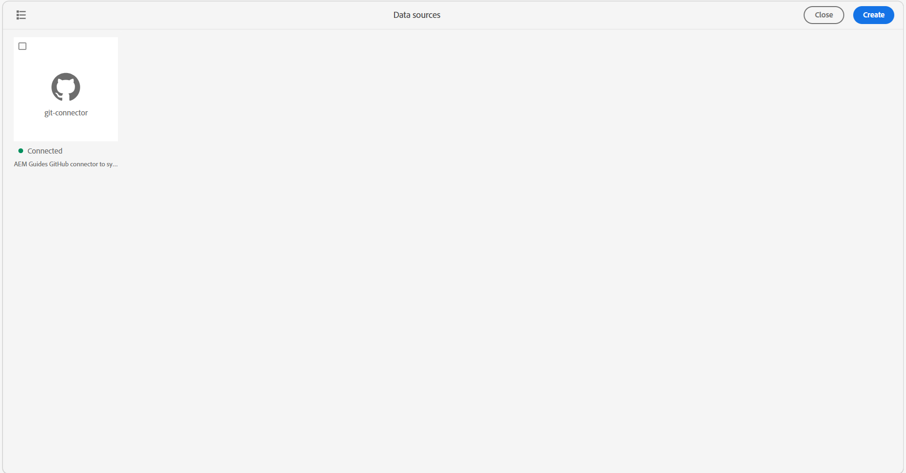

# Erstellen und Konfigurieren des Git-Connectors über die Benutzeroberfläche

>[!NOTE]
>
> Diese Funktion ist standardmäßig deaktiviert. Wenden Sie sich an Ihr Customer Success-Team, um diese Umgebung zu aktivieren.

Verwenden Sie das Datenquellen-Tool in Experience Manager Guides, um einen Git-Connector über die Benutzeroberfläche zu erstellen und zu konfigurieren. Nachdem Sie den Connector erfolgreich konfiguriert haben, können Sie ihn verwenden, um Inhalte aus einem Git-Repository in Experience Manager Guides zu importieren.

>[!NOTE]
>
> Bevor Sie beginnen, stellen Sie sicher, dass der Git-Connector in Ihrem Cloud Manager-Projekt bereitgestellt wird. Weitere Informationen finden Sie unter [Hinzufügen eines Git-Connectors zu Ihrem Cloud Manager-Projekt.](#add-git-connector-to-your-cloud-manager-project)


1. Wählen Sie oben den Link **Adobe Experience Manager** und dann **Tools** aus.
1. Wählen Sie **Guides** aus der Liste der Tools aus.
1. Wählen Sie die **Datenquellen** aus. Die **Datenquellen** wird angezeigt.
1. Wählen Sie **Erstellen** aus.
1. Wählen Sie aus der Liste der Datenquellen-Connectoren **GitHub** aus.

   {width="600"}

1. Wählen Sie **Weiter** aus.
1. Geben Sie die Konfigurations- und Verbindungsdetails ein.

   {width="600"}

   >[!TIP]
   >
   >* Bewegen Sie den Mauszeiger über  in der Nähe des Felds, um weitere Details dazu anzuzeigen.
   >* Felder mit * sind Pflichtfelder. Sie können beispielsweise die folgenden Details für den Git-Connector eingeben.

   - **Name**: Geben Sie den Namen der Datenquelle ein.
   - **Target AEM-Stammverzeichnis**: Geben Sie den Pfad im AEM-Repository ein, in dem aus Git importierte Inhalte gespeichert werden sollen.
   - **Dateitypfilter (Einbeziehung)**: Geben Sie die Dateitypen an, die beim Import einbezogen werden sollen.
   - **Ausgeschlossener Pfad (Regex)**: Geben Sie Pfadmuster an, die vom Import ausgeschlossen werden sollen.
   - **Authentifizierungstyp**: Wählen Sie in der Dropdown-Liste den Authentifizierungstyp aus. Derzeit ist **Personal Access Token (PAT)** die einzige unterstützte Authentifizierungsmethode. Geben Sie den Pfad während der Connector-Einrichtung ein, um sich zu authentifizieren und auf das Git-Repository zuzugreifen.

     Erfahren Sie, wie Sie [ein persönliches GitHub-Zugriffstoken generieren](https://docs.github.com/en/authentication/keeping-your-account-and-data-secure/managing-your-personal-access-tokens#creating-a-personal-access-token-classic).

     Stellen Sie beim Auswählen von Bereichen während der PAT-Generierung auf GitHub sicher, dass Sie die folgenden Bereiche aktivieren:
     - **repo**: Aktivieren Sie das Kontrollkästchen der obersten Ebene. Alle Unterbereiche werden automatisch ausgewählt und gewähren Zugriff auf Repository-Inhalte, Commit-Status und Bereitstellungen.
     - **admin:org**: Wählen Sie nur **lesen:org**. Dies ist erforderlich, um die Organisation und die Team-Mitgliedschaft zu klären.
   * **Repository-URL**: Geben Sie die Git-Repository-URL ein, aus der Inhalte importiert werden sollen.
   * **Verzweigung**: Geben Sie die Verzweigung ein, die für den Inhaltsimport verwendet werden soll.

1. Testen Sie die Verbindung. Die Schaltfläche **Verbindung testen** wird erst aktiviert, nachdem Sie die erforderlichen Details eingegeben haben. Wenn die Verbindungsdetails korrekt sind, wird eine Erfolgsmeldung angezeigt. Andernfalls wird eine Fehlermeldung angezeigt.

   {width="600"}

1. Wählen **oben** Speichern“ aus, um den Connector zu speichern.

   Die Schaltfläche Speichern wird erst aktiviert, nachdem alle erforderlichen Details eingegeben wurden und die Verbindung erfolgreich hergestellt wurde. Wenn der Connector erfolgreich gespeichert wurde, können Sie den konfigurierten GitHub-Connector auf der Seite **Datenquellen** anzeigen.

   {width="600"}

## Hinzufügen des Git-Connectors zu Ihrem Cloud Manager-Projekt

Bevor der Git-Connector auf der Seite **Datenquellen“ konfiguriert** kann, muss er als Abhängigkeit in Ihr AEM-Projekt eingebettet werden. Führen Sie die folgenden Schritte aus, um die Abhängigkeit hinzuzufügen:

>[!NOTE]
>
> Um die verfügbaren Git-Connector-Versionen anzuzeigen, rufen Sie [Maven Central Repository](https://central.sonatype.com/artifact/com.adobe.aem.addon.guides/konnect-github) auf.

1. Fügen Sie in der `all/pom.xml` Ihres AEM-Projekts den Git-Connector als Abhängigkeit unter `<dependencies>` hinzu:

   ```xml
   <dependency>
       <groupId>com.adobe.aem.addon.guides</groupId>
       <artifactId>konnect-github</artifactId>
       <version>1.0.1</version>
   </dependency>
   ```

1. Fügen Sie in derselben `pom.xml` die Abhängigkeit zum Abschnitt `<embeddeds>` der `filevault-package-maven-plugin` hinzu:

   ```xml
   <embedded>
       <groupId>com.adobe.aem.addon.guides</groupId>
       <artifactId>konnect-github</artifactId>
       <type>jar</type>
       <target>/apps/YOUR-vendor-packages/content/install</target>
   </embedded>
   ```

   Ersetzen Sie `YOUR-vendor-packages` durch den Anbieterpaketnamen Ihres Projekts.

1. Übertragen Sie die Änderungen, übertragen Sie sie in das Git-Repository von Cloud Manager und führen Sie dann die Pipeline aus, um sie bereitzustellen.

Sobald die Pipeline abgeschlossen ist, wird der Git-Connector in Ihrer Umgebung installiert und kann auf der Seite **Datenquellen“ konfiguriert**.


